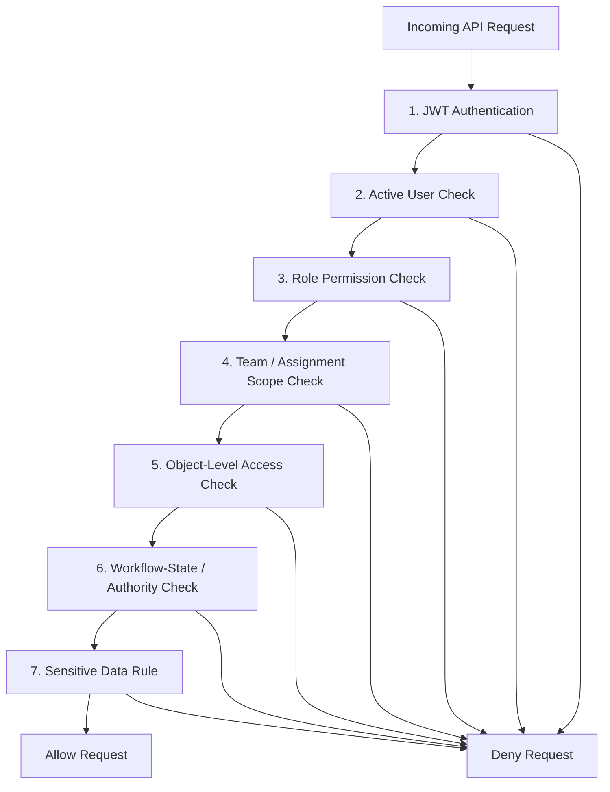
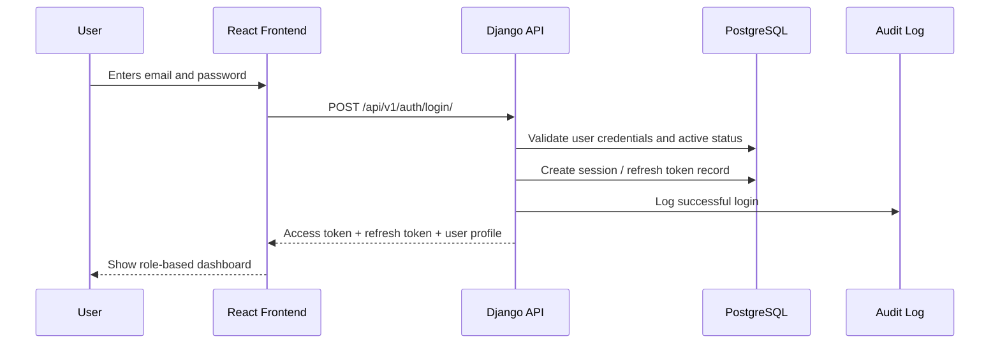
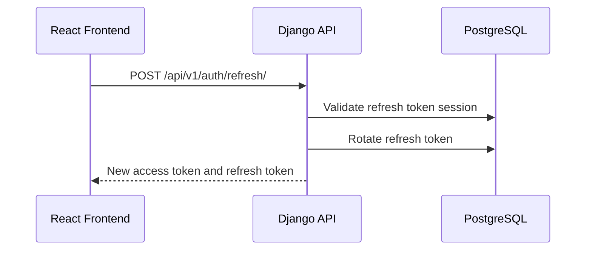
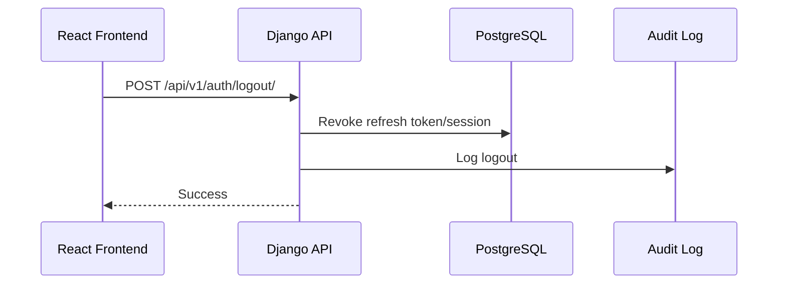
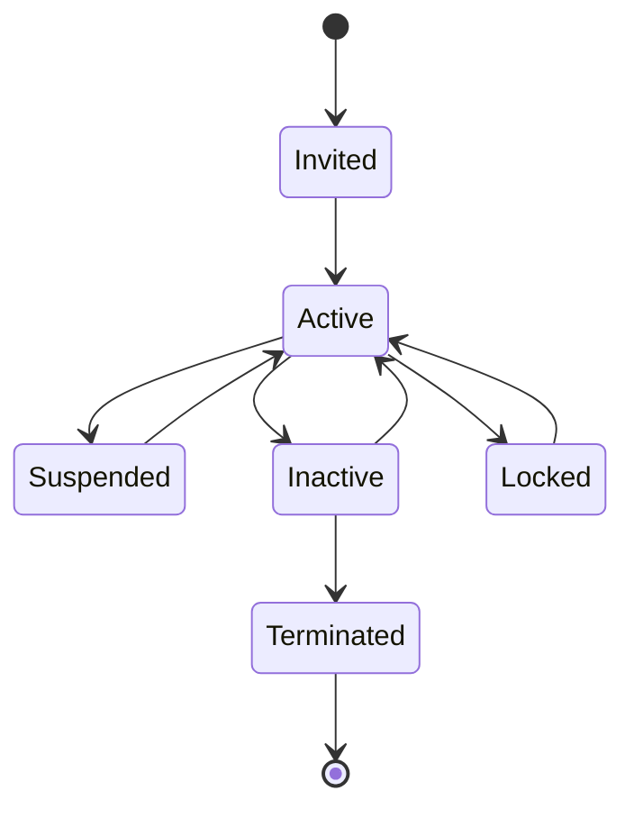

# Auth & Permissions Specification — SFPCL Member Credit Administration & Loan Disbursement Platform

## 1. Document Control

| Field | Value |
|---|---|
| Document name | `auth-permissions.md` |
| Product / system | SFPCL Member Credit Administration & Loan Disbursement Platform |
| Client | Sahyadri Farmers Producer Company Limited |
| Backend | Python + Django + Django REST Framework |
| Frontend | React |
| Database | PostgreSQL |
| Authentication | JWT |
| Source basis | Current analysis set: SOP review, client brief, user flows, functional specification, information architecture, screen specification, content specification, component specification, design system, domain model, data model, technical architecture and API contracts |
| Intended audience | Backend engineers, frontend engineers, QA, DevOps, product owners, compliance stakeholders and implementation teams |
| Status | Draft for implementation planning |

---

## 2. Purpose

This document defines the authentication, authorisation, permissions, roles, access-control rules and security-sensitive user behaviours for the SFPCL Member Credit Administration & Loan Disbursement Platform.

It covers:

- JWT authentication.
- User and session model.
- Role-based access control.
- Team-based access control.
- Object-level access rules.
- Workflow-state permission rules.
- Approval-authority checks.
- Sensitive data access.
- Field-level masking.
- Document access.
- Audit requirements.
- Permission catalogue.
- Role-to-permission matrix.
- Frontend action-visibility rules.
- Backend enforcement requirements.
- Security hardening requirements.
- QA test coverage for access control.

The platform must enforce the SOP’s controls for:

1. Member-only lending.
2. Maker-checker review.
3. Credit assessment ownership.
4. Sanction Committee authority.
5. Documentation verification.
6. Disbursement initiation and CFC authorisation.
7. Security custody and invocation.
8. Repayment posting and monitoring.
9. Default recovery approvals.
10. Closure, NOC and archival.
11. Compliance task ownership.
12. Audit evidence.

---

## 3. Core Access-Control Philosophy

The system must not rely only on the frontend to hide buttons or screens. The backend must enforce every permission, workflow gate and authority rule.

The access-control model has six layers:



## 3.1 Access-Control Layers

| Layer | Purpose | Example |
|---|---|---|
| Authentication | Confirms user identity | Valid JWT required |
| Active user check | Blocks inactive / suspended users | Inactive Director cannot approve |
| Role permission | Checks whether role can perform action | Credit Manager can review appraisal |
| Team / assignment scope | Limits users to relevant queue / team work | Deputy Manager can edit assigned appraisal only |
| Object-level access | Checks relation to specific application, loan or document | Director can view approval case assigned to them |
| Workflow-state check | Ensures action is valid at current stage | Disbursement cannot start before documentation approval |
| Sensitive data rule | Controls full PAN, Aadhaar, bank, cheque and KYC visibility | Aadhaar masked except for authorised KYC review |

---

## 4. User Categories

## 4.1 Internal Users

| User Category | Description |
|---|---|
| Field Officer | Helps borrowers with application intake, KYC collection and communication. |
| Deputy Manager – Finance | Performs application completeness check and prepares Loan Appraisal Note. |
| Credit Manager | Maintains Loan Request Register, reviews appraisal, updates loan register, sends rejection notes and monitors repayments. |
| Compliance Team Member | Prepares documentation package and coordinates document completion. |
| Company Secretary | Owns legal documentation, stamping, PoA, SH-4, security custody, compliance and NOC. |
| Senior Manager – Finance | Handles SAP customer profile creation and initiates online payment after final verification. |
| Chief Financial Controller | Authorises and executes bank transfers. |
| CFO | Sanction Committee member, exception approver, compliance owner and portfolio reviewer. |
| Director | Sanction Committee approver. |
| Accounts Head | Handles accounting, monthly accruals and financial reporting. |
| Sales Team User | May issue year-end interest invoices if confirmed by client. |
| IT Head | Manages access controls, security reviews and technical administration. |
| Internal Auditor | Reviews audit evidence and compliance records in read-only mode. |
| System Administrator | Manages users, roles, permissions and platform configuration. |

## 4.2 External / Future Users

| User Category | Description |
|---|---|
| Borrower / Member | Future borrower portal user for application status, documents and notices. |
| Nominee | Future limited access for nominee acknowledgment, if required. |
| Bank User | Not recommended for MVP; bank evidence handled internally. |
| Subsidiary Company User | Future access for produce deduction confirmation, if required. |
| External Auditor | Future limited audit access, if client requires. |

---

## 5. Authentication Model

## 5.1 Authentication Method

The platform uses JWT-based authentication:

- Access token for API requests.
- Refresh token for obtaining new access tokens.
- Refresh-token rotation recommended.
- Refresh-token blacklist required.
- Logout must revoke refresh token.
- Sensitive actions may require fresh login / re-authentication.

## 5.2 Token Types

| Token | Purpose | Recommended Lifetime | Storage |
|---|---|---:|---|
| Access token | Authorise API calls | 10–30 minutes | Memory or secure cookie |
| Refresh token | Issue new access token | 8–24 hours or client policy | httpOnly secure cookie preferred |
| Password reset token | Reset password | 15–60 minutes | Server-generated, single-use |
| Sensitive action token | Optional fresh-action approval | 5 minutes | Server-side session / short token |

## 5.3 JWT Claims

Access token should include only minimal claims.

```json
{
  "token_type": "access",
  "user_id": "uuid",
  "session_id": "uuid",
  "email": "credit.manager@sfpcl.example",
  "role_codes": ["credit_manager"],
  "team_codes": ["credit_assessment"],
  "permissions_version": "2026-06-22T10:30:00Z",
  "iat": 1782124200,
  "exp": 1782126000
}
```

### JWT Claim Rules

| Rule | Requirement |
|---|---|
| No sensitive personal data | Do not store PAN, Aadhaar, bank account or KYC values in token. |
| Minimal permission payload | Prefer permissions version or role codes over large permission arrays. |
| Session tracking | Include session ID to support revocation. |
| Token invalidation | If roles change, invalidate or refresh permissions version. |
| Token rotation | Refresh token should rotate on use. |

---

## 6. Authentication Flows

## 6.1 Login Flow



## 6.2 Refresh Flow



## 6.3 Logout Flow



## 6.4 Password Reset Flow

1. User requests reset.
2. System sends secure reset link / OTP to registered email.
3. User sets new password.
4. All active refresh tokens are revoked.
5. Audit log is created.

## 6.5 Sensitive Action Re-Authentication Flow

For critical actions such as disbursement authorisation, recovery invocation or sensitive data reveal:

1. User clicks sensitive action.
2. Backend checks whether recent authentication is still valid.
3. If not, frontend prompts for password or OTP.
4. Backend issues short-lived sensitive-action confirmation.
5. User completes action.
6. Audit log records re-authentication and action.

---

# 7. User Account Lifecycle

## 7.1 User Status Values

| Status | Meaning |
|---|---|
| `invited` | User created but not activated |
| `active` | User can log in and act |
| `inactive` | User cannot log in |
| `suspended` | Temporarily blocked |
| `locked` | Locked due to security policy |
| `terminated` | Permanently disabled, retained for audit |

## 7.2 Account Lifecycle



## 7.3 Account Rules

| Rule ID | Rule |
|---|---|
| AUTH-USER-001 | Only active users may authenticate. |
| AUTH-USER-002 | Inactive, suspended, locked and terminated users must be denied token issuance. |
| AUTH-USER-003 | Existing refresh tokens must be revoked when user is disabled. |
| AUTH-USER-004 | Role changes should invalidate old access tokens through permissions versioning or session revocation. |
| AUTH-USER-005 | User deletion should be soft-delete only to preserve audit history. |
| AUTH-USER-006 | Users referenced in approvals, documents, audit logs or compliance tasks must not be physically deleted. |

---

# 8. Password and Session Policy

## 8.1 Password Policy

Recommended baseline:

| Rule | Requirement |
|---|---|
| Minimum length | At least 10–12 characters |
| Complexity | Mix of letters, numbers and symbols preferred |
| Common password check | Reject common / compromised passwords if feasible |
| Password reuse | Prevent reuse of last 3–5 passwords |
| Password expiry | Client decision; avoid excessive forced expiry unless policy requires |
| Reset token | Single-use and short-lived |
| Failed attempts | Lock or rate-limit after repeated failures |

## 8.2 Session Policy

| Rule | Requirement |
|---|---|
| Access token lifetime | Short-lived |
| Refresh token lifetime | Configurable |
| Token rotation | Recommended |
| Logout | Revoke refresh token |
| Inactivity timeout | Configurable |
| Concurrent sessions | Allowed or limited based on policy |
| Session list | Admin can view and revoke sessions |
| Device metadata | Store IP, user-agent, last used time |

---

# 9. Role-Based Access Control Model

## 9.1 Core Objects

| Object | Purpose |
|---|---|
| User | Person or service account using the system |
| Role | Business function such as Credit Manager or Company Secretary |
| Permission | Atomic action such as `loan_application.create` |
| Team | Operational group such as Credit Assessment or Compliance |
| User-Team Membership | Defines team participation and effective dates |
| Approval Authority | Special authority designation such as CFO, Director, CFC |
| Object Assignment | Links a user/team to a specific application, loan or task |

## 9.2 Role Types

| Role Type | Examples |
|---|---|
| Operational role | Field Officer, Credit Manager, Compliance Team Member |
| Approval role | CFO, Director, CFC |
| Compliance role | Company Secretary, Internal Auditor |
| Finance role | Senior Manager – Finance, Accounts Head |
| Administration role | IT Head, System Administrator |
| Read-only role | Internal Auditor, Management Viewer |

## 9.3 Team Types

| Team | Typical Members |
|---|---|
| Credit Assessment Team | Credit Manager, Deputy Manager – Finance |
| Compliance Team | Company Secretary, Compliance Team Member |
| Treasury Team | Senior Manager – Finance, CFC |
| Sanction Committee | CFO and two Executive Directors |
| Accounts Team | Accounts Head and accounting users |
| IT Team | IT Head and system administrators |
| Audit Team | Internal Auditor |
| Sales Team | Sales Team users, if interest invoice process is assigned |

---

# 10. Data Model for Auth and Permissions

## 10.1 `users`

| Field | Description |
|---|---|
| `user_id` | UUID primary key |
| `full_name` | User display name |
| `email` | Login email, unique |
| `mobile_number` | Optional phone |
| `employee_code` | Optional HR code |
| `status` | User status |
| `primary_role_id` | Primary role |
| `approval_authority_type` | CFO, Director, CFC, CS, etc. |
| `password_hash` | Managed by Django |
| `last_login_at` | Last login timestamp |
| `created_at` | Created timestamp |
| `updated_at` | Updated timestamp |

## 10.2 `roles`

| Field | Description |
|---|---|
| `role_id` | UUID primary key |
| `role_code` | Machine-readable role code |
| `role_name` | Display role name |
| `description` | Role description |
| `is_system_role` | True for protected roles |
| `status` | Active / inactive |

## 10.3 `permissions`

| Field | Description |
|---|---|
| `permission_id` | UUID primary key |
| `permission_code` | Atomic permission code |
| `permission_name` | Human readable name |
| `module_name` | Module |
| `description` | Permission description |
| `risk_level` | Low, medium, high, critical |

## 10.4 `role_permissions`

| Field | Description |
|---|---|
| `role_permission_id` | UUID primary key |
| `role_id` | Role |
| `permission_id` | Permission |
| `granted_by_user_id` | Granting user |
| `granted_at` | Timestamp |

## 10.5 `teams`

| Field | Description |
|---|---|
| `team_id` | UUID primary key |
| `team_code` | Machine-readable team code |
| `team_name` | Display name |
| `description` | Description |
| `status` | Active / inactive |

## 10.6 `user_team_memberships`

| Field | Description |
|---|---|
| `user_team_membership_id` | UUID primary key |
| `user_id` | User |
| `team_id` | Team |
| `team_role` | Head, member, reviewer |
| `effective_from` | Start date |
| `effective_to` | End date |
| `status` | Active / inactive |

## 10.7 `user_sessions`

Recommended table for JWT refresh token/session tracking.

| Field | Description |
|---|---|
| `user_session_id` | UUID primary key |
| `user_id` | User |
| `refresh_token_hash` | Hashed refresh token |
| `session_status` | Active, revoked, expired |
| `ip_address` | Login IP |
| `user_agent` | Device / browser |
| `created_at` | Login time |
| `last_used_at` | Last refresh |
| `expires_at` | Refresh expiry |
| `revoked_at` | Revocation time |
| `revoked_reason` | Logout, password reset, admin revoke, role change |

## 10.8 `sensitive_access_logs`

Recommended table for full-value PII reveals and sensitive downloads.

| Field | Description |
|---|---|
| `sensitive_access_log_id` | UUID primary key |
| `user_id` | Acting user |
| `entity_type` | Member, nominee, bank account, document |
| `entity_id` | Related entity |
| `field_name` | PAN, Aadhaar, bank account, cheque, BO account |
| `access_reason` | User-provided reason |
| `approved_by_user_id` | Optional approver |
| `accessed_at` | Timestamp |
| `ip_address` | IP |
| `outcome` | Allowed / denied |

---

# 11. Permission Naming Convention

Permission codes should use:

```text
<module>.<resource>.<action>
```

Examples:

```text
applications.loan_application.create
applications.loan_application.submit
credit.loan_limit.calculate
approvals.approval_case.approve
documents.loan_document.verify
finance.disbursement.authorise
security.blank_cheque.invoke
compliance.nbfc_test.create
audit.audit_log.read
```

## 11.1 Action Verbs

| Verb | Meaning |
|---|---|
| `read` | View list or detail |
| `create` | Create new record |
| `update` | Edit record |
| `delete` | Soft delete |
| `submit` | Submit for next workflow stage |
| `verify` | Verify documents / evidence |
| `approve` | Formal approval action |
| `reject` | Formal rejection action |
| `return` | Return for clarification / deficiency |
| `generate` | Generate document / report |
| `download` | Download file or export |
| `upload` | Upload file |
| `calculate` | Run calculation |
| `override` | Override system result |
| `initiate` | Start disbursement / recovery |
| `authorise` | Authorise financial action |
| `close` | Close entity |
| `archive` | Archive records |
| `reveal` | View full sensitive data |
| `manage` | Administration-level management |

---

# 12. Permission Catalogue

## 12.1 Authentication and User Administration

| Permission Code | Description | Risk |
|---|---|---|
| `auth.session.read_own` | View own sessions | Low |
| `auth.session.revoke_own` | Revoke own session | Low |
| `auth.session.read_all` | View all user sessions | High |
| `auth.session.revoke_any` | Revoke any user session | High |
| `users.user.read` | View users | Medium |
| `users.user.create` | Create users | High |
| `users.user.update` | Update users | High |
| `users.user.disable` | Disable users | Critical |
| `users.role.read` | View roles | Medium |
| `users.role.create` | Create roles | Critical |
| `users.role.update` | Update roles | Critical |
| `users.permission.assign` | Assign permissions | Critical |
| `users.team.manage` | Manage teams | High |

## 12.2 Member Permissions

| Permission Code | Description | Risk |
|---|---|---|
| `members.member.read` | View member list / details | Medium |
| `members.member.create` | Create member | High |
| `members.member.update` | Update member | High |
| `members.member.deactivate` | Deactivate member | Critical |
| `members.sensitive.reveal_pan` | Reveal full PAN | Critical |
| `members.sensitive.reveal_aadhaar` | Reveal full Aadhaar | Critical |
| `members.nominee.read` | View nominees | Medium |
| `members.nominee.create` | Create nominee | High |
| `members.nominee.update` | Update nominee | High |
| `members.shareholding.read` | View shareholding | Medium |
| `members.shareholding.create` | Create shareholding | High |
| `members.shareholding.update` | Update shareholding | High |
| `members.active_status.calculate` | Calculate active member status | Medium |
| `members.active_status.verify` | Verify / override active status | High |

## 12.3 KYC Permissions

| Permission Code | Description | Risk |
|---|---|---|
| `kyc.profile.read` | View KYC status | Medium |
| `kyc.profile.create` | Create KYC profile | High |
| `kyc.profile.update` | Update KYC profile | High |
| `kyc.document.upload` | Upload KYC document | High |
| `kyc.document.read` | View KYC document metadata | High |
| `kyc.document.download` | Download KYC document | Critical |
| `kyc.document.verify` | Verify KYC document | High |
| `kyc.rekyc.manage` | Manage periodic re-KYC | High |
| `kyc.sensitive.reveal` | Reveal sensitive KYC fields | Critical |

## 12.4 Loan Application Permissions

| Permission Code | Description | Risk |
|---|---|---|
| `applications.loan_application.read` | View applications | Medium |
| `applications.loan_application.create` | Create loan application | High |
| `applications.loan_application.update` | Update draft application | High |
| `applications.loan_application.submit` | Submit application | High |
| `applications.loan_application.complete_check` | Mark completeness result | High |
| `applications.loan_application.reference_generate` | Generate official sequential loan reference number | High |
| `applications.loan_application.return_deficiency` | Return application with deficiencies | High |
| `applications.loan_application.cancel` | Cancel application | High |
| `applications.document.upload` | Upload application documents | High |
| `applications.document.verify` | Verify application documents | High |
| `applications.deficiency.create` | Create deficiencies | High |
| `applications.deficiency.resolve` | Resolve deficiencies | High |
| `applications.rejection_note.create` | Create rejection note | High |
| `applications.rejection_note.send` | Send rejection note | High |

## 12.5 Credit Assessment Permissions

| Permission Code | Description | Risk |
|---|---|---|
| `credit.eligibility.run` | Run eligibility assessment | High |
| `credit.eligibility.override` | Override eligibility result | Critical |
| `credit.loan_limit.calculate` | Calculate loan limit | High |
| `credit.loan_limit.override` | Override loan limit | Critical |
| `credit.appraisal.create` | Create appraisal note | High |
| `credit.appraisal.update` | Update appraisal note | High |
| `credit.appraisal.submit_review` | Submit appraisal for review | High |
| `credit.appraisal.review` | Review appraisal as Credit Manager | High |
| `credit.appraisal.submit_sanction` | Submit to Sanction Committee | High |
| `credit.risk_assessment.manage` | Create / update risk assessment | High |
| `credit.borrowing_history.read` | View borrowing history | Medium |
| `credit.borrowing_history.update` | Update borrowing history | High |

## 12.6 Approval Permissions

| Permission Code | Description | Risk |
|---|---|---|
| `approvals.matrix.read` | View approval matrix | Medium |
| `approvals.matrix.manage` | Manage approval matrix | Critical |
| `approvals.case.read` | View approval cases | Medium |
| `approvals.case.create` | Create approval case | High |
| `approvals.case.approve` | Approve assigned case | Critical |
| `approvals.case.reject` | Reject assigned case | Critical |
| `approvals.case.return` | Return case for clarification | High |
| `approvals.sanction.read` | View sanction decision | Medium |
| `approvals.sanction.create` | Create sanction decision | Critical |
| `approvals.sanction_register.read` | View Credit Sanction Register | Medium |
| `approvals.exception_register.read` | View Exception Register | Medium |
| `approvals.exception.create` | Create exception entry | Critical |
| `approvals.general_meeting.record` | Record general meeting approval | Critical |

## 12.7 Documentation Permissions

| Permission Code | Description | Risk |
|---|---|---|
| `documents.template.read` | View templates | Medium |
| `documents.template.manage` | Manage templates | Critical |
| `documents.file.upload` | Upload files | High |
| `documents.file.download` | Download files | High / Critical depending sensitivity |
| `documents.file.delete` | Delete file metadata where allowed | Critical |
| `documents.loan_document.generate` | Generate loan document | High |
| `documents.loan_document.read` | View loan document metadata | Medium |
| `documents.loan_document.verify` | Verify loan document | High |
| `documents.signature.record` | Record signature | High |
| `documents.signature.resolve_mismatch` | Resolve signature mismatch | High |
| `documents.stamp.record` | Record stamp duty | High |
| `documents.notary.record` | Record notarisation | High |
| `documents.checklist.read` | View checklist | Medium |
| `documents.checklist.update` | Update checklist items | High |
| `documents.checklist.approve_cs` | CS checklist approval | Critical |
| `documents.checklist.approve_credit` | Credit Manager checklist approval | Critical |
| `documents.checklist.approve_sanction` | Sanction Committee checklist approval | Critical |
| `documents.checklist.sign_disbursement_complete` | Senior Manager Finance disbursement signature | Critical |

## 12.8 Security Permissions

| Permission Code | Description | Risk |
|---|---|---|
| `security.package.read` | View security package | Medium |
| `security.package.create` | Create / refresh security package | High |
| `security.package.update` | Update security package | High |
| `security.poa.manage` | Manage Power of Attorney | Critical |
| `security.sh4.manage` | Manage SH-4 | Critical |
| `security.cdsl_pledge.manage` | Manage CDSL pledge | Critical |
| `security.blank_cheque.manage` | Manage blank-dated cheque | Critical |
| `security.blank_cheque.reveal` | Reveal cheque details | Critical |
| `security.custody.record` | Record custody movement | Critical |
| `security.instrument.invoke` | Invoke security instrument | Critical |
| `security.instrument.release` | Release security instrument | Critical |

## 12.9 SAP and Finance Permissions

| Permission Code | Description | Risk |
|---|---|---|
| `finance.sap_request.create` | Create SAP customer request | High |
| `finance.sap_request.send` | Send SAP request | High |
| `finance.sap_request.complete` | Mark SAP code created | Critical |
| `finance.sap_code.read` | View SAP customer code | Medium |
| `finance.loan_account.create` | Create loan account from sanction | Critical |
| `finance.loan_account.read` | View loan accounts | Medium |
| `finance.loan_account.update_terms` | Update loan terms | Critical |
| `finance.disbursement.readiness` | View disbursement readiness | Medium |
| `finance.disbursement.initiate` | Initiate disbursement | Critical |
| `finance.disbursement.authorise` | Authorise disbursement | Critical |
| `finance.disbursement.mark_success` | Mark bank transfer successful | Critical |
| `finance.disbursement.send_advice` | Send disbursement advice | High |
| `finance.repayment.create` | Capture repayment | High |
| `finance.repayment.allocate` | Allocate repayment | Critical |
| `finance.repayment.mark_sap_posted` | Mark SAP posting | High |
| `finance.interest_invoice.create` | Generate interest invoice | High |
| `finance.interest_invoice.issue` | Issue interest invoice | High |
| `finance.accrual.create` | Create monthly accrual | High |
| `finance.accrual.bulk_generate` | Bulk-generate accruals | High |
| `finance.interest_capitalise` | Capitalise unpaid interest | Critical |

## 12.10 Monitoring and Default Permissions

| Permission Code | Description | Risk |
|---|---|---|
| `monitoring.dpd.read` | View DPD status | Medium |
| `monitoring.dpd.calculate` | Calculate DPD | High |
| `monitoring.reminder.create` | Send / record reminder | High |
| `monitoring.mis.generate` | Generate quarterly MIS | High |
| `monitoring.mis.submit` | Submit MIS to CFO | High |
| `monitoring.mis.review` | Review MIS | High |
| `defaults.case.read` | View default cases | Medium |
| `defaults.case.open` | Open default case | High |
| `defaults.assessment.create` | Create default assessment | High |
| `defaults.extension.grant` | Grant one-year extension | Critical |
| `defaults.non_payment_note.create` | Create non-payment note | High |
| `defaults.non_payment_note.submit` | Submit to Sanction Committee | High |
| `recovery.decision.create` | Create recovery decision | Critical |
| `recovery.action.initiate` | Initiate recovery action | Critical |
| `recovery.action.complete` | Complete recovery action | Critical |

## 12.11 Closure Permissions

| Permission Code | Description | Risk |
|---|---|---|
| `closure.readiness.read` | View closure readiness | Medium |
| `closure.loan.close` | Close loan | Critical |
| `closure.noc.issue` | Issue NOC | Critical |
| `closure.security_return.record` | Record security return | Critical |
| `closure.archive.create` | Archive loan file | High |
| `closure.archive.read` | View archive metadata | Medium |

## 12.12 Compliance Permissions

| Permission Code | Description | Risk |
|---|---|---|
| `compliance.control.read` | View compliance controls | Medium |
| `compliance.control.manage` | Manage compliance controls | Critical |
| `compliance.task.read` | View compliance tasks | Medium |
| `compliance.task.create` | Create compliance task | High |
| `compliance.task.update` | Update compliance task | High |
| `compliance.evidence.submit` | Submit evidence | High |
| `compliance.evidence.review` | Review evidence | High |
| `compliance.section186.create` | Create Section 186 tracker | Critical |
| `compliance.section186.read` | View Section 186 tracker | High |
| `compliance.nbfc_test.create` | Create NBFC principal test | Critical |
| `compliance.nbfc_test.read` | View NBFC principal test | High |
| `compliance.kyc_review.manage` | Manage KYC reviews | High |
| `compliance.money_lending_review.manage` | Manage money-lending law review | High |
| `compliance.stamp_duty_review.manage` | Manage stamp duty compliance | High |

## 12.13 Reports, Audit and Configuration Permissions

| Permission Code | Description | Risk |
|---|---|---|
| `reports.application_pipeline.read` | View application pipeline report | Medium |
| `reports.portfolio.read` | View portfolio report | High |
| `reports.dpd.read` | View DPD report | High |
| `reports.compliance.read` | View compliance dashboard | High |
| `reports.export` | Export reports | High |
| `audit.audit_log.read` | View audit logs | High |
| `audit.workflow_event.read` | View workflow events | Medium |
| `audit.version_history.read` | View version history | Medium |
| `config.loan_policy.read` | View loan policy config | Medium |
| `config.loan_policy.manage` | Manage loan policy config | Critical |
| `config.share_valuation.manage` | Manage share valuation | Critical |
| `config.scale_of_finance.manage` | Manage scale of finance | Critical |
| `config.interest_rate.manage` | Manage interest rate | Critical |

---

# 13. Standard Roles

## 13.1 Role Catalogue

| Role Code | Role Name | Role Purpose |
|---|---|---|
| `field_officer` | Field Officer | Assisted borrower intake and document collection |
| `deputy_manager_finance` | Deputy Manager – Finance | Completeness check and appraisal preparation |
| `credit_manager` | Credit Manager | Credit workflow owner, appraisal reviewer and monitoring owner |
| `compliance_team_member` | Compliance Team Member | Document preparation and checklist coordination |
| `company_secretary` | Company Secretary | Legal documentation, stamping, security custody and compliance |
| `senior_manager_finance` | Senior Manager – Finance | SAP customer code and disbursement initiation |
| `chief_financial_controller` | Chief Financial Controller | Bank transfer authorisation |
| `cfo` | CFO | Sanction Committee, exceptions and compliance review |
| `director` | Director | Sanction Committee approval |
| `accounts_head` | Accounts Head | Interest accrual, accounting and reports |
| `sales_team_user` | Sales Team User | Interest invoice support if confirmed |
| `it_head` | IT Head | Access control and system security oversight |
| `internal_auditor` | Internal Auditor | Read-only audit and compliance evidence review |
| `system_admin` | System Administrator | User, role, config and platform administration |
| `management_viewer` | Management Viewer | Read-only dashboards and reports |
| `borrower_portal_user` | Borrower Portal User | Future borrower-facing self-service access |

---

# 14. Role-to-Permission Summary

## 14.1 High-Level Module Access Matrix

| Module | Field Officer | Deputy Manager Finance | Credit Manager | Compliance Team | CS | Senior Manager Finance | CFC | CFO | Director | Accounts | Auditor | Admin |
|---|---:|---:|---:|---:|---:|---:|---:|---:|---:|---:|---:|---:|
| Auth self-service | Yes | Yes | Yes | Yes | Yes | Yes | Yes | Yes | Yes | Yes | Yes | Yes |
| User admin | No | No | No | No | No | No | No | No | No | No | No | Yes |
| Member master | Create / edit limited | Read | Read / update | Read | Read | Read | Read | Read | Read | Read | Read | Manage |
| KYC | Upload | Verify limited | Verify / review | Read / upload | Review | Read | No | Read | Read limited | Read | Read | Manage |
| Application intake | Create | Create / check | Create / manage | Read | Read | Read | No | Read | Read | Read | Read | Manage |
| Credit assessment | No | Prepare | Review / submit | No | Read | No | No | Read | Read | Read | Read | Manage |
| Loan limit | No | Calculate | Calculate / review | No | Read | No | No | Read | Read | Read | Read | Manage |
| Approvals | No | No | Create case | No | Read | No | Authorise disbursement only | Approve | Approve | No | Read | Manage matrix |
| Documentation | Upload limited | Read | Review limits | Prepare | Approve / manage | Read | Read | Read | Read | Read | Read | Manage templates |
| Security | No | No | Read | Prepare | Manage | Read | Read | Read | Read | No | Read | Manage |
| SAP request | No | No | Create / send | No | Read | Complete | Read | Read | No | Read | Read | Manage |
| Disbursement | No | No | Read | Read | Read | Initiate | Authorise | Read | No | Read | Read | Manage |
| Repayment | No | No | Create / monitor | No | Read | Read | Read | Read | No | Post / reconcile | Read | Manage |
| Interest | No | No | Generate / monitor | No | Read | Read | Read | Review | No | Create / post | Read | Manage |
| Monitoring | No | No | Manage | No | Read | Read | Read | Review | Read | Read | Read | Manage |
| Default | No | No | Manage | No | Read | No | No | Review | Review | Read | Read | Manage |
| Recovery | No | No | Prepare | No | Execute legal / security | No | No | Approve | Approve | Read | Read | Manage |
| Closure | No | No | Initiate / read | Prepare | Issue NOC / security return | Read | Read | Review | No | Read | Read | Manage |
| Compliance | No | No | KYC / credit controls | Evidence | Manage | Evidence | Evidence | Review | Read | Evidence | Review | Manage |
| Audit | No | No | Own modules | Own modules | Compliance-related | Own modules | Own modules | High-level | Own approvals | Own modules | Full read | Full read |

---

# 15. Detailed Role Responsibilities and Permissions

## 15.1 Field Officer

### Purpose

Assists borrowers in application intake, document collection and communication. Does not make credit, sanction, disbursement or recovery decisions.

### Allowed

- Create draft loan applications.
- Upload borrower documents.
- Upload KYC documents.
- View assigned borrowers.
- Record borrower communications.
- View application status for assigned applications.
- Create basic nominee records.
- Upload land documents and crop plans.

### Not Allowed

- Verify KYC.
- Calculate or override loan limits.
- Review appraisal.
- Approve sanction.
- Approve documentation.
- Initiate disbursement.
- Capture repayments unless specifically authorised.
- View full sensitive data unless separately granted.
- Invoke security or perform recovery action.

### Key Permissions

- `members.member.read`
- `members.nominee.create`
- `applications.loan_application.create`
- `applications.loan_application.update`
- `applications.document.upload`
- `kyc.document.upload`
- `communications.communication.create`

---

## 15.2 Deputy Manager – Finance

### Purpose

Performs application completeness checks and prepares Loan Appraisal Note within the two-day TAT.

### Allowed

- View loan applications in Credit Assessment queue.
- Mark application complete / incomplete.
- Raise deficiencies.
- Prepare Loan Appraisal Note.
- Run eligibility assessment, if assigned.
- Calculate loan limit.
- Create risk assessment.
- Submit appraisal for Credit Manager review.

### Not Allowed

- Final review appraisal as Credit Manager.
- Submit to Sanction Committee without review.
- Approve sanction.
- Approve documentation.
- Initiate disbursement.
- Override eligibility or loan limit without approval.

### Key Permissions

- `applications.loan_application.read`
- `applications.loan_application.complete_check`
- `applications.deficiency.create`
- `applications.deficiency.resolve`
- `credit.eligibility.run`
- `credit.loan_limit.calculate`
- `credit.appraisal.create`
- `credit.appraisal.update`
- `credit.appraisal.submit_review`
- `credit.risk_assessment.manage`

---

## 15.3 Credit Manager

### Purpose

Owns credit workflow, Loan Request Register, appraisal review, Sanction Committee submission, rejection communication, loan register updates, monitoring, reminders and repayment status.

### Allowed

- Maintain Loan Request Register.
- Review application completeness.
- Review Loan Appraisal Note.
- Submit application to Sanction Committee.
- Create approval cases.
- Create and send rejection notes.
- Review loan limit calculations.
- Update loan register after disbursement.
- Capture direct repayments.
- Monitor DPD buckets.
- Generate reminders.
- Prepare quarterly MIS.
- Prepare extension notes.
- Prepare or coordinate Non-Payment Note.
- Initiate closure after full repayment.

### Not Allowed

- Approve sanction unless also assigned as CFO / Director, which should generally not occur.
- Approve own exception.
- Authorise disbursement.
- Execute bank transfer.
- Invoke SH-4 or blank cheque without recovery approval and CS involvement.
- Change policy configuration.

### Key Permissions

- `applications.loan_application.read`
- `applications.loan_application.create`
- `applications.loan_application.complete_check`
- `applications.rejection_note.create`
- `applications.rejection_note.send`
- `credit.eligibility.run`
- `credit.loan_limit.calculate`
- `credit.appraisal.review`
- `credit.appraisal.submit_sanction`
- `approvals.case.create`
- `finance.sap_request.create`
- `finance.sap_request.send`
- `finance.loan_account.read`
- `finance.repayment.create`
- `finance.repayment.allocate`
- `monitoring.dpd.calculate`
- `monitoring.reminder.create`
- `monitoring.mis.generate`
- `defaults.case.open`
- `defaults.assessment.create`
- `defaults.extension.grant`
- `defaults.non_payment_note.create`
- `closure.readiness.read`
- `closure.loan.close`

---

## 15.4 Compliance Team Member

### Purpose

Prepares and coordinates loan documentation package after sanction approval.

### Allowed

- View approved applications.
- Generate documents.
- Upload signed / scanned documents.
- Update document checklist items.
- Record witness KYC.
- Prepare PoA, Declaration / Tri-party Agreement, Term Sheet, Loan Agreement and checklist.
- Coordinate stamping and notarisation records.
- Update document preparation status.

### Not Allowed

- Final CS approval unless assigned Company Secretary role.
- Approve loan amount or credit limit.
- Initiate disbursement.
- Approve sanction.
- Invoke security.

### Key Permissions

- `documents.loan_document.generate`
- `documents.loan_document.read`
- `documents.loan_document.verify` limited or prepare-only depending policy
- `documents.signature.record`
- `documents.stamp.record`
- `documents.notary.record`
- `documents.checklist.read`
- `documents.checklist.update`
- `security.package.create`
- `security.package.update`

---

## 15.5 Company Secretary

### Purpose

Owns legal documentation, statutory controls, stamping, PoA, security custody, SH-4 handling, blank cheque custody, NOC and compliance evidence.

### Allowed

- Verify legal documents.
- Approve checklist as Company Secretary.
- Manage PoA.
- Manage SH-4 security.
- Manage CDSL pledge records.
- Manage blank-dated cheque records.
- Record security custody events.
- Review stamp duty and notarisation.
- Issue NOC after full repayment.
- Record security return.
- Manage compliance controls / evidence related to CS responsibilities.
- Maintain grievance log.
- Review money-lending law annual opinion.
- Manage record retention and archival controls.

### Not Allowed

- Approve credit sanction unless separately a committee member, which should be avoided.
- Initiate bank disbursement.
- Authorise bank transfer.
- Override loan limit without approval.

### Key Permissions

- `documents.checklist.approve_cs`
- `documents.loan_document.verify`
- `documents.signature.resolve_mismatch`
- `documents.stamp.record`
- `documents.notary.record`
- `security.poa.manage`
- `security.sh4.manage`
- `security.cdsl_pledge.manage`
- `security.blank_cheque.manage`
- `security.custody.record`
- `security.instrument.release`
- `security.instrument.invoke` only after approval
- `closure.noc.issue`
- `closure.security_return.record`
- `closure.archive.create`
- `compliance.control.read`
- `compliance.task.update`
- `compliance.evidence.submit`
- `compliance.money_lending_review.manage`
- `compliance.stamp_duty_review.manage`
- `grievances.manage`

---

## 15.6 Senior Manager – Finance

### Purpose

Creates / confirms SAP customer profile and initiates disbursement after final verification.

### Allowed

- View approved and documentation-ready applications.
- Receive SAP customer profile request.
- Complete SAP customer code creation.
- Initiate disbursement through bank portal.
- Record disbursement initiation.
- Sign checklist as disbursement complete after successful transfer.
- Upload bank evidence.
- View finance reports relevant to disbursement.

### Not Allowed

- Approve sanction.
- Authorise final bank transfer as CFC unless also assigned CFC role.
- Change loan limit.
- Approve documentation as CS.
- Invoke security.

### Key Permissions

- `finance.sap_request.complete`
- `finance.sap_code.read`
- `finance.disbursement.readiness`
- `finance.disbursement.initiate`
- `finance.disbursement.mark_success` if operationally assigned after CFC approval
- `documents.checklist.sign_disbursement_complete`
- `documents.file.upload`
- `finance.loan_account.read`

---

## 15.7 Chief Financial Controller

### Purpose

Authorises and executes online bank transfer for loan disbursement.

### Allowed

- View disbursement package.
- Verify payment details.
- Approve / reject disbursement authorisation.
- Upload or confirm bank transfer reference.
- View finance and disbursement reports.

### Not Allowed

- Create application.
- Prepare appraisal.
- Approve sanction as CFO / Director unless separately assigned.
- Modify documentation.
- Change loan policy.
- Invoke security.

### Key Permissions

- `finance.disbursement.readiness`
- `finance.disbursement.authorise`
- `finance.disbursement.mark_success`
- `finance.loan_account.read`
- `reports.portfolio.read` limited
- `audit.audit_log.read` limited to disbursement actions

---

## 15.8 CFO

### Purpose

Sanction Committee member, exception approver and statutory compliance owner.

### Allowed

- Approve / reject sanction cases.
- Approve exceptions requiring CFO authority.
- Review portfolio MIS.
- Review Section 186 tracker.
- Review NBFC principal test.
- Review compliance dashboard.
- Approve policy changes where configured.
- Review recovery proposals.
- View high-level sensitive credit data required for decision making.

### Not Allowed

- Prepare own appraisal.
- Approve conflicted cases where CFO is borrower / relative / interested party.
- Create or alter documents directly unless policy allows.
- Initiate disbursement or execute bank transfer.

### Key Permissions

- `approvals.case.read`
- `approvals.case.approve`
- `approvals.case.reject`
- `approvals.case.return`
- `approvals.exception.create` / approve through approval case
- `approvals.sanction.read`
- `reports.portfolio.read`
- `monitoring.mis.review`
- `compliance.section186.read`
- `compliance.nbfc_test.read`
- `compliance.evidence.review`
- `config.loan_policy.read`
- `recovery.decision.create` or approve through approval case, depending policy

---

## 15.9 Director

### Purpose

Sanction Committee approver for loan sanction and exception cases.

### Allowed

- View assigned sanction cases.
- View appraisal summary, loan limit, borrower summary and required decision documents.
- Approve, reject or return sanction case.
- Review exception cases where assigned.
- View own approval history.

### Not Allowed

- View unrelated applications unless granted management permission.
- Approve conflicted cases where director or relative is borrower.
- Edit appraisal, documents or disbursement records.
- Initiate disbursement.
- Override eligibility or loan limit.

### Key Permissions

- `approvals.case.read`
- `approvals.case.approve`
- `approvals.case.reject`
- `approvals.case.return`
- `approvals.sanction.read`
- `documents.loan_document.read` limited to sanction package
- `credit.appraisal.read`
- `credit.loan_limit.read`

---

## 15.10 Accounts Head

### Purpose

Handles monthly interest accruals, accounting-related reports, repayment reconciliation and finance reporting.

### Allowed

- View loan accounts.
- View repayments.
- Mark SAP repayment postings if assigned.
- Generate monthly accruals.
- Generate / review interest invoices if confirmed.
- View portfolio financial reports.
- Submit accounting compliance evidence.

### Not Allowed

- Approve sanction.
- Initiate or authorise disbursement.
- Invoke security.
- Alter approval records.
- Reveal full Aadhaar unless separately authorised.

### Key Permissions

- `finance.loan_account.read`
- `finance.repayment.read`
- `finance.repayment.mark_sap_posted`
- `finance.interest_invoice.create`
- `finance.interest_invoice.issue`
- `finance.accrual.create`
- `finance.accrual.bulk_generate`
- `reports.portfolio.read`
- `compliance.evidence.submit`

---

## 15.11 Internal Auditor

### Purpose

Read-only audit and compliance evidence review.

### Allowed

- View audit logs.
- View workflow events.
- View loan files and registers in read-only mode.
- View compliance evidence.
- Export audit reports if permitted.
- Comment on audit observations if feature exists.

### Not Allowed

- Create / edit operational records.
- Approve applications.
- Initiate disbursement.
- Alter documents.
- Invoke security.
- Modify configuration.

### Key Permissions

- `audit.audit_log.read`
- `audit.workflow_event.read`
- `audit.version_history.read`
- `reports.application_pipeline.read`
- `reports.portfolio.read`
- `reports.compliance.read`
- `documents.loan_document.read`
- `compliance.task.read`
- `compliance.evidence.review` if auditor review role is confirmed

---

## 15.12 System Administrator

### Purpose

Technical user and access administration.

### Allowed

- Manage users.
- Manage roles and permissions.
- Configure teams.
- Manage system settings.
- Revoke sessions.
- View technical logs where required.
- Manage templates and configurations only if business approval workflow exists.

### Not Allowed

- Approve loans by default.
- Override business decisions.
- View full sensitive business data without explicit audited break-glass process.
- Alter audit logs.

### Key Permissions

- `users.user.create`
- `users.user.update`
- `users.user.disable`
- `users.role.create`
- `users.role.update`
- `users.permission.assign`
- `users.team.manage`
- `auth.session.read_all`
- `auth.session.revoke_any`
- `config.*.read`
- `config.*.manage` only if policy allows

---

# 16. Approval Authority Model

## 16.1 Approval Authority Types

| Authority Type | Description |
|---|---|
| `none` | No special approval authority |
| `cfo` | CFO authority |
| `director` | Director authority |
| `company_secretary` | Legal / documentation authority |
| `chief_financial_controller` | Bank transfer authorisation authority |
| `senior_manager_finance` | Disbursement initiation authority |
| `credit_manager` | Credit review authority |
| `board` | Board approval record, not necessarily a user login |
| `general_meeting` | Member approval record |

## 16.2 Loan Sanction Authority

| Scenario | Required Authority |
|---|---|
| Loan up to ₹5,00,000 | CFO + one Director |
| Loan above ₹5,00,000 | CFO + two Directors |
| Loan exceeding maximum permissible limit | CFO + two Directors and Exception Register |
| Director / relative / Sanction Committee member borrower | Conflicted person excluded; remaining members approve; general meeting approval recorded |
| Policy exception | Configured exception approval route |
| Stage bypass | CFO approval and Exception Register |

## 16.3 Disbursement Authority

| Action | Authority |
|---|---|
| Verify documents and details | Senior Manager – Finance |
| Initiate online payment | Senior Manager – Finance |
| Authorise / execute bank transfer | Chief Financial Controller |
| Mark loan disbursed | Senior Manager – Finance or authorised finance user after CFC approval |
| Sign disbursement completion on checklist | Senior Manager – Finance |

## 16.4 Security Authority

| Action | Authority |
|---|---|
| Prepare PoA | Compliance Team / CS |
| Verify PoA | Company Secretary |
| Hold SH-4 and blank cheque | Company Secretary / authorised Compliance custody |
| Invoke SH-4 | Sanction Committee / Board approval, final rule pending client confirmation |
| Present blank-dated cheque | Sanction Committee / Board approval, final rule pending client confirmation |
| Release security after closure | Company Secretary |

---

# 17. Conflict of Interest Rules

## 17.1 Conflicted Cases

A conflict exists if:

- Sanction Committee member is borrower.
- Director is borrower.
- Relative of Director is borrower.
- Committee member has material interest.
- User is acting on their own application.
- User attempts to approve a case they created or materially prepared where maker-checker separation applies.

## 17.2 Conflict Rules

| Rule ID | Rule |
|---|---|
| COI-001 | Conflicted user must not approve the case. |
| COI-002 | Conflicted user must be excluded from required approver list. |
| COI-003 | Conflict reason must be recorded. |
| COI-004 | Director / relative loan requires general meeting approval evidence. |
| COI-005 | Conflicted user may have limited read access only where legally required. |
| COI-006 | Attempted conflicted approval must be denied and audit logged. |

## 17.3 API Behaviour

When conflicted approver attempts approval:

```json
{
  "success": false,
  "error": {
    "code": "CONFLICTED_APPROVER_NOT_ALLOWED",
    "message": "This user is marked as conflicted for the approval case and cannot approve it.",
    "details": {
      "approval_case_id": "uuid",
      "conflict_reason": "Borrower is relative of Director."
    }
  }
}
```

---

# 18. Maker-Checker Rules

## 18.1 Maker-Checker Overview

The system must enforce separation between preparation and approval for critical steps.

| Process | Maker | Checker / Approver |
|---|---|---|
| Application creation | Field Officer / Credit Team | Deputy Manager / Credit Manager completeness check |
| Appraisal preparation | Deputy Manager – Finance | Credit Manager |
| Sanction case | Credit Manager | CFO + Director(s) |
| Documentation preparation | Compliance Team Member | Company Secretary |
| Loan limit review | Credit Assessment | Credit Manager / Sanction Committee |
| Disbursement initiation | Senior Manager – Finance | CFC |
| Repayment capture | Credit / Accounts | SAP posting / reconciliation role |
| Recovery proposal | Credit Assessment | Sanction Committee / Board as configured |
| Closure preparation | Credit / Compliance | Company Secretary / authorised closure role |

## 18.2 Maker-Checker Enforcement Rules

| Rule ID | Rule |
|---|---|
| MC-001 | Maker and checker cannot be same user for configured critical actions. |
| MC-002 | Approval case must reject approval by maker where maker-checker separation applies. |
| MC-003 | Any maker-checker override requires exception approval. |
| MC-004 | Audit log must capture maker, checker and timestamps. |
| MC-005 | Frontend must hide checker actions from maker, but backend must enforce. |

---

# 19. Object-Level Permissions

## 19.1 Object Scope Types

| Scope Type | Meaning |
|---|---|
| `global` | User can access all records in module |
| `team` | User can access records assigned to their team |
| `assigned` | User can access records assigned to them |
| `created_by` | User can access records they created |
| `approval_assigned` | User can access approval cases requiring their decision |
| `borrower_self` | Future borrower can access only their own records |
| `audit_readonly` | Auditor can read many records but cannot edit |
| `management_readonly` | Management can read dashboards and summaries |

## 19.2 Application Object Access

| Role | Access Scope |
|---|---|
| Field Officer | Created / assigned applications |
| Deputy Manager – Finance | Credit Assessment queue / assigned applications |
| Credit Manager | All applications in Credit Assessment domain |
| Compliance Team | Approved applications requiring documentation |
| Company Secretary | Documentation and compliance-related applications |
| Senior Manager – Finance | Documentation-approved applications pending SAP / disbursement |
| CFC | Disbursement-ready applications requiring authorisation |
| CFO | Applications submitted for sanction or exceptions |
| Director | Approval cases assigned to that Director |
| Auditor | Read-only across selected records |
| Admin | Technical access; business data access should be restricted by policy |

## 19.3 Loan Account Object Access

| Role | Access Scope |
|---|---|
| Credit Manager | Active loans and monitoring queue |
| Accounts Head | Loan accounts for accounting and interest |
| Senior Manager – Finance | Disbursement and SAP-linked loans |
| CFC | Disbursement-authorised loans |
| CFO | Portfolio-level and detailed view |
| Company Secretary | Loans with documentation, security, recovery or closure actions |
| Auditor | Read-only |
| Borrower | Future own loan only |

## 19.4 Document Object Access

Document access must consider:

- Document sensitivity.
- Related entity access.
- Role permission.
- File category.
- Workflow stage.
- Reason for download.

| Document Category | Default Access |
|---|---|
| KYC | Restricted to KYC, Credit, Compliance, Auditor with need-to-know |
| Legal | Compliance, CS, Credit Manager, approvers as needed |
| Security | CS and authorised Compliance; read-only for approvers/auditors |
| Finance | Treasury, Accounts, Credit Manager, CFO, Auditor |
| Compliance evidence | Compliance owners, CFO, Auditor |
| Borrower communication | Credit, Compliance, relevant owner, Auditor |

---

# 20. Workflow-State Permission Rules

## 20.1 Loan Application Workflow Permissions

| State | Allowed Actions | Allowed Roles |
|---|---|---|
| `draft` | Edit, upload docs, submit | Field Officer, Deputy Manager, Credit Manager |
| `submitted` | Completeness check | Deputy Manager, Credit Manager |
| `completeness_check_pending` | Mark complete / return deficiency | Deputy Manager, Credit Manager |
| `incomplete_returned` | Upload missing docs, resubmit | Field Officer, Credit Team |
| `appraisal_in_progress` | Prepare appraisal | Deputy Manager – Finance |
| `appraisal_reviewed` | Submit to sanction | Credit Manager |
| `submitted_to_sanction_committee` | Approve / reject / return | CFO, Directors assigned |
| `approved_by_sanction_committee` | Start documentation | Compliance Team, CS |
| `documentation_in_progress` | Update documents / checklist | Compliance Team, CS |
| `documentation_approved` | Create loan account, SAP request, disbursement readiness | Credit Manager, Senior Manager – Finance |
| `disbursement_pending` | Initiate / authorise disbursement | Senior Manager – Finance, CFC |
| `disbursed` | View / monitor | Credit, Accounts, CFO, Auditor |

## 20.2 Loan Account Workflow Permissions

| State | Allowed Actions | Allowed Roles |
|---|---|---|
| `sanctioned` | Complete documentation, SAP request | Compliance, Credit, Senior Manager Finance |
| `ready_for_disbursement` | Initiate disbursement | Senior Manager Finance |
| `disbursement_in_progress` | Authorise / mark success | CFC, Senior Manager Finance |
| `active` | Capture repayment, issue invoice, monitor | Credit Manager, Accounts |
| `partially_repaid` | Continue servicing / close if zero outstanding | Credit Manager, Accounts |
| `overdue` | Open default case | Credit Manager |
| `grace_period` | Assess after grace / capture repayment | Credit Manager |
| `extended` | Monitor extension / repayment | Credit Manager |
| `non_recoverable_under_review` | Prepare non-payment note | Credit Assessment |
| `under_recovery` | Execute approved recovery | CS / authorised recovery users |
| `closed` | Issue NOC, return security, archive | CS, Compliance |
| `archived` | Read-only | Auditor, authorised users |

## 20.3 Default Workflow Permissions

| Default State | Allowed Action | Role |
|---|---|---|
| `open` | Start grace period | Credit Manager |
| `grace_period_active` | Record repayment / wait | Credit Manager |
| `grace_period_expired` | Assess default reason | Credit Assessment Team |
| `assessment_in_progress` | Classify intentional / non-intentional | Credit Assessment Team |
| `extension_granted` | Monitor extension | Credit Manager |
| `extension_expired` | Create Non-Payment Note | Credit Assessment Team |
| `non_payment_under_review` | Submit to Sanction Committee | Credit Manager |
| `recovery_decision_pending` | Approve recovery | Sanction Committee / Board as configured |
| `recovery_approved` | Execute recovery | Company Secretary / authorised |
| `closed` | Read-only | Authorised users |

---

# 21. Sensitive Data Access Rules

## 21.1 Sensitive Data Categories

| Data | Sensitivity | Default UI |
|---|---|---|
| PAN | High | Masked |
| Aadhaar | Very high | Masked |
| Bank account number | High | Last 4 digits only |
| Cheque number | High | Hidden / masked |
| BO account number | High | Masked |
| KYC files | Very high | Restricted |
| Bank statement | High | Restricted |
| Share pledge evidence | High | Restricted |
| Recovery notes | Confidential | Restricted |
| Approval comments | Internal | Role-based |
| Audit logs | Confidential | Auditor / admin / management |

## 21.2 Reveal Rules

A user may reveal full sensitive data only if:

1. User has explicit reveal permission.
2. User has object-level access to the related record.
3. User provides a reason.
4. Action is audit logged.
5. The full value is returned only once or for a short time.
6. Frontend must not persist full value.
7. Re-authentication may be required for very high sensitivity.

## 21.3 Sensitive Data Reveal API Contract

```http
POST /api/v1/members/{member_id}/reveal-sensitive-field/
```

```json
{
  "field_name": "aadhaar",
  "reason": "KYC verification during loan application"
}
```

Response:

```json
{
  "success": true,
  "data": {
    "field_name": "aadhaar",
    "value": "123412341234",
    "expires_at": "2026-06-22T10:35:00Z"
  }
}
```

## 21.4 Sensitive Download Rules

For restricted documents:

- KYC files.
- Bank statements.
- Blank cheque images.
- PoA.
- SH-4.
- CDSL pledge evidence.
- Recovery documentation.
- Legal opinions.

The API should require:

- Permission.
- Object access.
- Reason.
- Audit log.
- Optional watermark.
- Optional time-limited signed URL.

---

# 22. Document Access Rules

## 22.1 Document Category Access Matrix

| Document Category | Field Officer | Credit | Compliance | CS | Finance | CFO / Director | Auditor | Admin |
|---|---:|---:|---:|---:|---:|---:|---:|---:|
| Application form | Assigned only | Yes | Yes | Yes | Read | Sanction package only | Read | Limited |
| Borrower PAN / Aadhaar | Upload only | Masked / restricted | Restricted | Restricted | No / limited | Summary only | Restricted read | No by default |
| Nominee KYC | Upload only | Restricted | Restricted | Restricted | No | Summary only | Restricted read | No by default |
| Land documents | Assigned upload | Yes | Yes | Yes | Read | Summary | Read | Limited |
| Crop plan | Assigned upload | Yes | Yes | Yes | Read | Summary | Read | Limited |
| Bank statement | No / upload | Restricted | Restricted | No / read | Restricted | Summary | Restricted read | No by default |
| PoA | No | Read | Prepare | Manage | Read | Read | Read | Limited |
| Tri-party agreement | No | Read | Prepare | Approve / read | Read | Read | Read | Limited |
| SH-4 | No | Summary | Prepare | Manage | No | Summary | Restricted read | No by default |
| CDSL pledge | No | Summary | Prepare | Manage | No | Summary | Restricted read | No by default |
| Blank cheque | No | No | Prepare | Manage | No | No | Restricted audit | No by default |
| Loan Agreement | No | Read | Prepare | Verify | Read | Sanction package | Read | Limited |
| Term Sheet | No | Read | Prepare | Verify | Read | Sanction package | Read | Limited |
| SAP Excel | No | Create | No | Read | Manage | Read | Read | Limited |
| Bank transfer evidence | No | Read | No | Read | Manage | Read | Read | Limited |
| Interest invoice | No | Read | No | Read | Manage | Read | Read | Limited |
| NOC | No | Read | Prepare | Issue | Read | Read | Read | Limited |
| Compliance evidence | No | Limited | Submit | Manage | Submit | Review | Review | Limited |

## 22.2 Download Audit

Every download of a restricted file should create an audit event:

```text
documents.file.downloaded
```

Audit payload should include:

- User ID.
- Document ID.
- Related entity.
- File sensitivity.
- Reason.
- IP address.
- Timestamp.

---

# 23. Frontend Permission Behaviour

## 23.1 General Rules

React frontend must:

- Fetch current user permissions from `/auth/me/`.
- Use backend-provided `available_actions` for action buttons.
- Hide unavailable actions.
- Display disabled actions with reasons where useful.
- Never assume hidden actions are secure.
- Never display full sensitive values unless explicitly returned by reveal endpoint.
- Clear sensitive revealed values from memory after timeout.
- Handle `403`, `409` and workflow errors gracefully.
- Refresh permissions after role changes or token refresh.

## 23.2 Available Actions Contract

Detail APIs should return:

```json
{
  "available_actions": [
    {
      "action_code": "submit_to_sanction_committee",
      "label": "Submit to Sanction Committee",
      "enabled": true,
      "disabled_reason": null,
      "required_permission": "credit.appraisal.submit_sanction"
    },
    {
      "action_code": "initiate_disbursement",
      "label": "Initiate Disbursement",
      "enabled": false,
      "disabled_reason": "SAP customer code is missing.",
      "required_permission": "finance.disbursement.initiate"
    }
  ]
}
```

## 23.3 UI Route Guards

| Route | Required Permission |
|---|---|
| `/members` | `members.member.read` |
| `/applications` | `applications.loan_application.read` |
| `/applications/new` | `applications.loan_application.create` |
| `/completeness` | `applications.loan_application.complete_check` |
| `/applications/:id/appraisal` | `credit.appraisal.create` or `credit.appraisal.review` |
| `/approvals` | `approvals.case.read` |
| `/documents` | `documents.loan_document.read` |
| `/loans` | `finance.loan_account.read` |
| `/disbursement` | `finance.disbursement.readiness` |
| `/repayments` | `finance.repayment.create` or read permission |
| `/defaults` | `defaults.case.read` |
| `/compliance` | `compliance.task.read` |
| `/reports` | report-specific permission |
| `/settings/users` | `users.user.read` |
| `/settings/roles` | `users.role.read` |
| `/audit` | `audit.audit_log.read` |

---

# 24. Backend Permission Enforcement

## 24.1 Enforcement Locations

| Layer | Enforcement |
|---|---|
| DRF authentication classes | Validate JWT |
| DRF permission classes | Role and module permission |
| Queryset filtering | Object-level restrictions |
| Serializer validation | Field-level restrictions |
| Service layer | Workflow gates and authority checks |
| Model constraints | Data integrity |
| Audit service | Record critical actions |
| Middleware | Request ID, user context, IP capture |

## 24.2 Permission Class Pattern

Recommended conceptual pattern:

```python
class HasPermission(BasePermission):
    required_permission = None

    def has_permission(self, request, view):
        return request.user.has_perm(self.required_permission)

class CanAccessLoanApplication(BasePermission):
    def has_object_permission(self, request, view, obj):
        return permission_service.can_access_application(request.user, obj)
```

## 24.3 Service-Level Guard Pattern

```python
def submit_to_sanction_committee(user, loan_application_id):
    application = get_application(loan_application_id)

    permission_service.require(user, "credit.appraisal.submit_sanction")
    object_access_service.require_application_access(user, application)
    workflow_service.require_state(application, "appraisal_reviewed")
    appraisal_service.require_credit_manager_review(application)
    approval_service.require_no_unresolved_conflict(application)

    # perform transition inside transaction
```

---

# 25. Module-Specific Access Rules

## 25.1 Member Module

| Action | Permission | Object Rule |
|---|---|---|
| List members | `members.member.read` | Scope-limited unless management role |
| Create member | `members.member.create` | Field / Credit / Admin |
| Update member | `members.member.update` | Restricted after active loans exist |
| Deactivate member | `members.member.deactivate` | Admin / authorised compliance only |
| Reveal PAN | `members.sensitive.reveal_pan` | Reason + audit |
| Reveal Aadhaar | `members.sensitive.reveal_aadhaar` | Reason + re-auth + audit |
| Create nominee | `members.nominee.create` | User can access member |
| Verify active status | `members.active_status.verify` | Credit Manager / authorised |

## 25.2 Application Module

| Action | Permission | Workflow Rule |
|---|---|---|
| Create application | `applications.loan_application.create` | Member must exist |
| Submit application | `applications.loan_application.submit` | Required fields and docs |
| Completeness check | `applications.loan_application.complete_check` | Submitted state |
| Generate reference number | `applications.loan_application.reference_generate` | All mandatory completeness checks passed |
| Return deficiency | `applications.loan_application.return_deficiency` | Deficiency details required |
| Cancel application | `applications.loan_application.cancel` | Not disbursed |
| Create rejection | `applications.rejection_note.create` | Valid rejection stage |
| Send rejection | `applications.rejection_note.send` | Rejection note prepared |

## 25.3 Credit Module

| Action | Permission | Workflow Rule |
|---|---|---|
| Run eligibility | `credit.eligibility.run` | Application complete |
| Override eligibility | `credit.eligibility.override` | Exception approval required |
| Calculate loan limit | `credit.loan_limit.calculate` | Shareholding and land data available |
| Override loan limit | `credit.loan_limit.override` | Critical exception approval |
| Create appraisal | `credit.appraisal.create` | Eligibility assessment exists |
| Review appraisal | `credit.appraisal.review` | User must be Credit Manager |
| Submit to sanction | `credit.appraisal.submit_sanction` | Review complete |

## 25.4 Approval Module

| Action | Permission | Workflow Rule |
|---|---|---|
| Create approval case | `approvals.case.create` | Appraisal ready |
| Approve case | `approvals.case.approve` | User is required approver and not conflicted |
| Reject case | `approvals.case.reject` | User is required approver |
| Return case | `approvals.case.return` | User is required approver |
| Manage matrix | `approvals.matrix.manage` | Admin + approval governance |
| Record general meeting | `approvals.general_meeting.record` | Director / relative case |

## 25.5 Documentation Module

| Action | Permission | Workflow Rule |
|---|---|---|
| Generate docs | `documents.loan_document.generate` | Sanction approved |
| Verify docs | `documents.loan_document.verify` | Document uploaded / generated |
| Record signature | `documents.signature.record` | Signer required |
| Resolve mismatch | `documents.signature.resolve_mismatch` | Bank letter / declaration required |
| Record stamp | `documents.stamp.record` | Document requires stamping |
| CS approve checklist | `documents.checklist.approve_cs` | Required docs complete |
| Credit approve checklist | `documents.checklist.approve_credit` | Limits reviewed |
| Sanction approve checklist | `documents.checklist.approve_sanction` | Final disbursement approval |

## 25.6 Security Module

| Action | Permission | Workflow Rule |
|---|---|---|
| Create security package | `security.package.create` | Sanction approved |
| Manage PoA | `security.poa.manage` | PoA required |
| Manage SH-4 | `security.sh4.manage` | Physical shares |
| Manage CDSL pledge | `security.cdsl_pledge.manage` | Demat shares |
| Manage blank cheque | `security.blank_cheque.manage` | Cheque collected |
| Invoke instrument | `security.instrument.invoke` | Recovery approval required |
| Release instrument | `security.instrument.release` | Loan closed / repaid |

## 25.7 Finance Module

| Action | Permission | Workflow Rule |
|---|---|---|
| Create SAP request | `finance.sap_request.create` | Sanction approved |
| Complete SAP request | `finance.sap_request.complete` | Senior Manager Finance |
| Create loan account | `finance.loan_account.create` | Sanction decision exists |
| Initiate disbursement | `finance.disbursement.initiate` | Ready for disbursement |
| Authorise disbursement | `finance.disbursement.authorise` | CFC only |
| Mark transfer success | `finance.disbursement.mark_success` | CFC authorised |
| Capture repayment | `finance.repayment.create` | Loan active |
| Allocate repayment | `finance.repayment.allocate` | Principal-first |
| Capitalise interest | `finance.interest_capitalise` | After 30 April rule |

## 25.8 Default and Recovery Module

| Action | Permission | Workflow Rule |
|---|---|---|
| Open default | `defaults.case.open` | Missed principal repayment |
| Assess default | `defaults.assessment.create` | Grace expired |
| Grant extension | `defaults.extension.grant` | Non-intentional classification |
| Create non-payment note | `defaults.non_payment_note.create` | Extension expired unpaid |
| Create recovery decision | `recovery.decision.create` | Approval case required |
| Initiate recovery action | `recovery.action.initiate` | Recovery decision approved |
| Complete recovery action | `recovery.action.complete` | Evidence required |

## 25.9 Closure Module

| Action | Permission | Workflow Rule |
|---|---|---|
| Close loan | `closure.loan.close` | Total outstanding zero or approved settlement |
| Issue NOC | `closure.noc.issue` | Full repayment closure |
| Record security return | `closure.security_return.record` | Security package exists |
| Archive file | `closure.archive.create` | Closure complete |

---

# 26. Permission Matrix by SOP Stage

## 26.1 Stage 1 — Initial Loan Request

| Activity | Field Officer | Deputy Manager | Credit Manager | Borrower Future Portal |
|---|---:|---:|---:|---:|
| Create draft application | Yes | Yes | Yes | Future |
| Capture borrower details | Yes | Yes | Yes | Future self |
| Capture nominee details | Yes | Yes | Yes | Future self |
| Upload KYC documents | Yes | Yes | Yes | Future |
| Generate application reference | System | System | System | System |
| Maintain Loan Request Register | No | No | Yes | No |
| Return incomplete application | No | Yes | Yes | No |

## 26.2 Stage 2 — Credit Assessment

| Activity | Deputy Manager | Credit Manager | CFO / Director | Auditor |
|---|---:|---:|---:|---:|
| Run eligibility | Yes | Yes | Read | Read |
| Calculate loan limit | Yes | Yes | Read | Read |
| Prepare appraisal | Yes | No | Read | Read |
| Review appraisal | No | Yes | Read | Read |
| Reject at assessment | No | Yes | Read | Read |
| Submit to Sanction Committee | No | Yes | No | Read |

## 26.3 Stage 3 — Credit Scrutiny and Approval

| Activity | Credit Manager | CFO | Director | Company Secretary | Auditor |
|---|---:|---:|---:|---:|---:|
| Create approval case | Yes | No | No | No | Read |
| View sanction package | Yes | Yes | Yes | Read | Read |
| Approve sanction | No | Yes | Yes | No | Read |
| Reject sanction | No | Yes | Yes | No | Read |
| Return for clarification | No | Yes | Yes | No | Read |
| Record sanction decision | System | System | System | No | Read |
| Record exception | System / Credit | Approve | Approve | Read | Read |

## 26.4 Stage 4 — Documentation and Stamping

| Activity | Compliance Team | Company Secretary | Credit Manager | Sanction Committee | Senior Manager Finance |
|---|---:|---:|---:|---:|---:|
| Generate documents | Yes | Yes | Read | Read | Read |
| Upload signed docs | Yes | Yes | Read | Read | Read |
| Record witness KYC | Yes | Yes | Read | No | No |
| Record stamp duty | Yes | Approve | Read | No | No |
| Record notarisation | Yes | Approve | Read | No | No |
| Approve checklist as CS | No | Yes | No | No | No |
| Approve checklist as Credit Manager | No | No | Yes | No | No |
| Final checklist approval | No | No | No | Yes | No |

## 26.5 Stage 5 — Loan Disbursement

| Activity | Credit Manager | Senior Manager Finance | CFC | CFO | Auditor |
|---|---:|---:|---:|---:|---:|
| Request SAP customer code | Yes | Read | No | Read | Read |
| Complete SAP code | No | Yes | No | Read | Read |
| Check disbursement readiness | Read | Yes | Yes | Read | Read |
| Initiate bank transfer | No | Yes | No | No | Read |
| Authorise bank transfer | No | No | Yes | No | Read |
| Mark transfer successful | No | Yes / CFC | Yes | Read | Read |
| Send disbursement advice | Yes / Finance | Yes | No | Read | Read |

## 26.6 Stage 6 — Monitoring and Repayment

| Activity | Credit Manager | Accounts | CFO | Company Secretary | Auditor |
|---|---:|---:|---:|---:|---:|
| Capture direct repayment | Yes | Yes | Read | Read | Read |
| Verify subsidiary repayment | Yes / Treasury | Yes | Read | Read | Read |
| Allocate repayment | Yes | Yes | Read | Read | Read |
| Post SAP receipt | Yes / Accounts | Yes | Read | No | Read |
| Generate interest invoice | Yes / Accounts / Sales | Yes | Review | Read | Read |
| Monthly accrual | No | Yes | Review | No | Read |
| DPD classification | Yes | Read | Review | Read | Read |
| Quarterly MIS | Yes | Input | Review | Read | Read |
| Repayment reminders | Yes | No | Read | Read | Read |

## 26.7 Default, Recovery and Closure

| Activity | Credit Manager | Company Secretary | Sanction Committee | CFC | Auditor |
|---|---:|---:|---:|---:|---:|
| Open default case | Yes | Read | Read | No | Read |
| Assess reason | Yes | Read | Read | No | Read |
| Grant extension | Yes | Read | Review | No | Read |
| Prepare non-payment note | Yes | Read | Review | No | Read |
| Approve recovery | No | Read | Yes | No | Read |
| Invoke SH-4 / cheque | No | Yes after approval | Approve | No | Read |
| Close loan | Yes | Yes | Read | No | Read |
| Issue NOC | No | Yes | No | No | Read |
| Return security | No | Yes | No | No | Read |
| Archive file | Compliance / CS | Yes | No | No | Read |

---

# 27. Approval Case Assignment Rules

## 27.1 Sanction Case Assignment

The system should derive approvers automatically based on approval matrix.

### Scenario: Loan up to ₹5 lakh

Required approvers:

- CFO.
- One Director.

### Scenario: Loan above ₹5 lakh

Required approvers:

- CFO.
- Two Directors.

### Scenario: Exceeds permissible limit

Required approvers:

- CFO.
- Two Directors.
- Exception Register entry.
- Reason mandatory.

### Scenario: Director / Relative Loan

Required:

- Exclude conflicted Director / committee member.
- Remaining eligible approvers.
- General meeting approval record.
- Conflict reason.
- Member approval evidence.

## 27.2 Approval Action Rules

| Rule ID | Rule |
|---|---|
| APR-001 | Only required approvers can approve assigned cases. |
| APR-002 | Approval action is immutable after submission. |
| APR-003 | Rejection requires comments. |
| APR-004 | Return for clarification requires comments. |
| APR-005 | Approval case becomes approved only after all required approvals are complete. |
| APR-006 | If any required approver rejects, case status becomes rejected unless policy supports reconsideration. |
| APR-007 | Re-approval after change must create new approval cycle or version. |
| APR-008 | Conflicted approver cannot approve. |

---

# 28. Break-Glass Access

## 28.1 Purpose

Break-glass access is emergency access for highly restricted data or operations.

It should be avoided in MVP unless client requires it. If implemented, it must be heavily audited.

## 28.2 Break-Glass Rules

| Rule | Requirement |
|---|---|
| BG-001 | Only authorised admin / compliance head may request break-glass. |
| BG-002 | Reason is mandatory. |
| BG-003 | Access expires automatically. |
| BG-004 | All actions under break-glass are flagged. |
| BG-005 | CFO / CS / IT Head receives notification. |
| BG-006 | Auditor can review break-glass log. |
| BG-007 | Break-glass cannot alter approvals or audit logs. |

---

# 29. Service Accounts

## 29.1 Use Cases

Service accounts may be needed for:

- Celery scheduled jobs.
- SAP adapter.
- Email / SMS delivery.
- Report generation.
- Bank statement import.
- Data migration.

## 29.2 Service Account Rules

| Rule | Requirement |
|---|---|
| SA-001 | Service accounts cannot log into UI. |
| SA-002 | Service accounts must use separate credentials. |
| SA-003 | Permissions must be least privilege. |
| SA-004 | Every service action must identify `actor_type = system` or integration. |
| SA-005 | Service account tokens must be rotated. |
| SA-006 | Service accounts cannot approve loans. |
| SA-007 | Service accounts cannot reveal sensitive fields except controlled processing. |

---

# 30. Audit Requirements

## 30.1 Mandatory Audit Events

| Event | Trigger |
|---|---|
| `auth.login_success` | Successful login |
| `auth.login_failed` | Failed login |
| `auth.logout` | Logout |
| `auth.token_refresh` | Token refresh |
| `auth.session_revoked` | Session revoked |
| `users.created` | User created |
| `users.updated` | User changed |
| `users.disabled` | User disabled |
| `permissions.changed` | Role / permission changed |
| `sensitive_field.revealed` | Full sensitive value shown |
| `document.downloaded` | Restricted document downloaded |
| `loan_application.created` | Application created |
| `loan_application.submitted` | Application submitted |
| `application.returned_deficiency` | Deficiency return |
| `eligibility.assessed` | Eligibility run |
| `loan_limit.calculated` | Loan limit calculated |
| `appraisal.submitted` | Appraisal submitted |
| `appraisal.reviewed` | Credit Manager review |
| `approval.action_recorded` | Approver acted |
| `sanction.decision_recorded` | Sanction decision created |
| `exception.recorded` | Exception entry created |
| `document.verified` | Document verified |
| `checklist.approved` | Checklist approval |
| `security.custody_event` | Security custody changed |
| `sap.customer_code_created` | SAP code confirmed |
| `disbursement.initiated` | Disbursement started |
| `disbursement.authorised` | CFC authorised |
| `disbursement.completed` | Transfer successful |
| `repayment.created` | Repayment captured |
| `repayment.allocated` | Repayment allocated |
| `interest.invoice_issued` | Interest invoice issued |
| `interest.capitalised` | Interest capitalised |
| `default.case_opened` | Default opened |
| `extension.granted` | Extension granted |
| `recovery.approved` | Recovery approved |
| `security.invoked` | Security invoked |
| `loan.closed` | Loan closed |
| `noc.issued` | NOC issued |
| `security.returned` | Security returned |
| `archive.created` | Archive record created |
| `compliance.evidence_submitted` | Evidence submitted |
| `config.changed` | Configuration changed |

## 30.2 Audit Log Contents

Every audit log should include:

- Actor user ID.
- Actor type.
- Role at time of action.
- Team at time of action.
- Action code.
- Entity type.
- Entity ID.
- Old value.
- New value.
- Request ID.
- IP address.
- User agent.
- Timestamp.
- Reason/comment where required.

## 30.3 Immutable Audit Rules

| Rule ID | Rule |
|---|---|
| AUD-001 | Audit logs cannot be edited from application UI. |
| AUD-002 | Audit logs cannot be deleted by normal users. |
| AUD-003 | System admins cannot alter audit contents. |
| AUD-004 | Audit retention should meet or exceed record retention policy. |
| AUD-005 | Sensitive data values should not be stored in audit logs. |
| AUD-006 | Audit logs may store masked values or metadata only. |

---

# 31. Configuration Permission Governance

## 31.1 High-Risk Configurations

| Configuration | Risk | Required Access |
|---|---|---|
| Loan policy | Critical | Admin + business approval |
| Share valuation | Critical | CFO / authorised config role |
| Loan limit percentage | Critical | Board approval reference |
| Per-share cap | Critical | Board approval reference |
| Scale of finance | Critical | CFO / authorised role |
| Interest rate | Critical | CFO / Accounts / authorised role |
| Approval matrix | Critical | Admin + CFO / CS approval |
| Document templates | High | CS / Compliance owner |
| Content templates | Medium | Communication / Compliance owner |
| Compliance controls | High | CS / CFO / Admin |
| Role permissions | Critical | System Admin / IT Head |

## 31.2 Configuration Change Rules

| Rule ID | Rule |
|---|---|
| CFG-001 | Critical config changes require reason. |
| CFG-002 | Board approval reference is mandatory where policy requires. |
| CFG-003 | Config changes are effective-dated. |
| CFG-004 | Old config remains available for historical calculations. |
| CFG-005 | Config activation creates audit log. |
| CFG-006 | Config changes must not alter historical loan-limit snapshots. |
| CFG-007 | Approval matrix changes must not alter already-open approval cases unless explicitly re-generated. |

---

# 32. Row-Level and Queryset Filtering Rules

## 32.1 Recommended Query Filtering

For each API list endpoint, backend should filter by user scope.

### Example: Applications

```text
if user is Credit Manager:
    return all applications in credit workflow
elif user is Deputy Manager:
    return assigned or team queue applications
elif user is Compliance:
    return sanction-approved applications requiring documentation
elif user is Director:
    return applications linked to assigned approval cases
elif user is Auditor:
    return read-only records within audit scope
else:
    return only explicitly assigned records
```

### Example: Documents

```text
document visible if:
    user has document read permission
    and user has access to related application / loan
    and document sensitivity is allowed for user's role
```

### Example: Reports

```text
report visible if:
    user has report permission
    and report scope is allowed
    and sensitive fields in export are masked unless export-sensitive permission exists
```

---

# 33. Export Permissions

## 33.1 Export Risk

Exports can create data leakage risk. Export permissions must be more restrictive than read permissions.

## 33.2 Export Rules

| Rule ID | Rule |
|---|---|
| EXP-001 | Export requires explicit `reports.export` permission. |
| EXP-002 | Sensitive columns must be masked unless user has sensitive export permission. |
| EXP-003 | Export action must be audit logged. |
| EXP-004 | Export files should expire after configured time. |
| EXP-005 | Export should include watermark or generated-by metadata where feasible. |
| EXP-006 | Bulk KYC export should require higher approval or be disabled. |

## 33.3 Export Permission Types

| Permission | Description |
|---|---|
| `reports.export` | General export |
| `reports.export_sensitive` | Export sensitive fields unmasked |
| `documents.bulk_download` | Bulk document download |
| `audit.export` | Export audit logs |
| `compliance.export` | Export compliance reports |

---

# 34. API Endpoint Permission Map

## 34.1 Auth

| Endpoint | Permission |
|---|---|
| `POST /auth/login/` | Public |
| `POST /auth/refresh/` | Valid refresh token |
| `POST /auth/logout/` | Authenticated |
| `GET /auth/me/` | Authenticated |
| `POST /auth/change-password/` | Authenticated |
| `POST /auth/forgot-password/` | Public with rate limit |
| `POST /auth/reset-password/` | Valid reset token |

## 34.2 Members

| Endpoint | Permission |
|---|---|
| `GET /members/` | `members.member.read` |
| `POST /members/` | `members.member.create` |
| `GET /members/{id}/` | `members.member.read` + object access |
| `PATCH /members/{id}/` | `members.member.update` + object access |
| `POST /members/{id}/reveal-sensitive-field/` | field-specific reveal permission |
| `GET /members/{id}/nominees/` | `members.nominee.read` |
| `POST /members/{id}/nominees/` | `members.nominee.create` |
| `GET /members/{id}/shareholdings/` | `members.shareholding.read` |
| `POST /members/{id}/shareholdings/` | `members.shareholding.create` |
| `POST /members/{id}/active-status/calculate/` | `members.active_status.calculate` |
| `POST /members/{id}/active-status/verify/` | `members.active_status.verify` |

## 34.3 Applications

| Endpoint | Permission |
|---|---|
| `GET /loan-applications/` | `applications.loan_application.read` |
| `POST /loan-applications/` | `applications.loan_application.create` |
| `GET /loan-applications/{id}/` | `applications.loan_application.read` + object access |
| `PATCH /loan-applications/{id}/` | `applications.loan_application.update` + workflow state |
| `POST /loan-applications/{id}/submit/` | `applications.loan_application.submit` |
| `POST /loan-applications/{id}/complete-check/` | `applications.loan_application.complete_check` |
| `POST /loan-applications/{id}/return-with-deficiencies/` | `applications.loan_application.return_deficiency` |
| `POST /loan-applications/{id}/cancel/` | `applications.loan_application.cancel` |

## 34.4 Credit

| Endpoint | Permission |
|---|---|
| `POST /loan-applications/{id}/eligibility-assessment/run/` | `credit.eligibility.run` |
| `POST /loan-applications/{id}/eligibility-assessment/override/` | `credit.eligibility.override` |
| `POST /loan-applications/{id}/loan-limit-assessment/calculate/` | `credit.loan_limit.calculate` |
| `POST /loan-applications/{id}/appraisal-note/` | `credit.appraisal.create` |
| `POST /appraisal-notes/{id}/submit-for-review/` | `credit.appraisal.submit_review` |
| `POST /appraisal-notes/{id}/review/` | `credit.appraisal.review` |
| `POST /loan-applications/{id}/submit-to-sanction-committee/` | `credit.appraisal.submit_sanction` |

## 34.5 Approvals

| Endpoint | Permission |
|---|---|
| `GET /approval-cases/` | `approvals.case.read` |
| `POST /loan-applications/{id}/approval-cases/` | `approvals.case.create` |
| `POST /approval-cases/{id}/approve/` | `approvals.case.approve` + required approver |
| `POST /approval-cases/{id}/reject/` | `approvals.case.reject` + required approver |
| `POST /approval-cases/{id}/return-for-clarification/` | `approvals.case.return` |
| `GET /credit-sanction-register/` | `approvals.sanction_register.read` |
| `GET /exception-register/` | `approvals.exception_register.read` |
| `POST /loan-applications/{id}/general-meeting-approval/` | `approvals.general_meeting.record` |

## 34.6 Documents and Security

| Endpoint | Permission |
|---|---|
| `POST /document-files/` | `documents.file.upload` |
| `GET /document-files/{id}/download/` | `documents.file.download` + sensitivity check |
| `POST /loan-applications/{id}/loan-documents/generate/` | `documents.loan_document.generate` |
| `POST /loan-documents/{id}/verify/` | `documents.loan_document.verify` |
| `POST /loan-documents/{id}/signatures/` | `documents.signature.record` |
| `POST /signature-records/{id}/resolve-mismatch/` | `documents.signature.resolve_mismatch` |
| `POST /loan-documents/{id}/stamp-duty-record/` | `documents.stamp.record` |
| `POST /loan-documents/{id}/notarisation-record/` | `documents.notary.record` |
| `POST /document-checklists/{id}/approve-as-company-secretary/` | `documents.checklist.approve_cs` |
| `POST /document-checklists/{id}/approve-as-credit-manager/` | `documents.checklist.approve_credit` |
| `POST /document-checklists/{id}/approve-as-sanction-committee/` | `documents.checklist.approve_sanction` |
| `POST /document-checklists/{id}/sign-disbursement-complete/` | `documents.checklist.sign_disbursement_complete` |
| `POST /security-packages/{id}/power-of-attorney/` | `security.poa.manage` |
| `POST /security-packages/{id}/sh4-share-transfer-form/` | `security.sh4.manage` |
| `POST /security-packages/{id}/cdsl-share-pledge/` | `security.cdsl_pledge.manage` |
| `POST /security-packages/{id}/blank-dated-cheque/` | `security.blank_cheque.manage` |

## 34.7 Finance

| Endpoint | Permission |
|---|---|
| `POST /loan-applications/{id}/sap-customer-profile-request/` | `finance.sap_request.create` |
| `POST /sap-customer-profile-requests/{id}/send/` | `finance.sap_request.send` |
| `POST /sap-customer-profile-requests/{id}/complete/` | `finance.sap_request.complete` |
| `POST /loan-applications/{id}/create-loan-account/` | `finance.loan_account.create` |
| `GET /loan-accounts/` | `finance.loan_account.read` |
| `POST /loan-accounts/{id}/disbursements/initiate/` | `finance.disbursement.initiate` |
| `POST /disbursements/{id}/authorise/` | `finance.disbursement.authorise` |
| `POST /disbursements/{id}/mark-transfer-successful/` | `finance.disbursement.mark_success` |
| `POST /loan-accounts/{id}/repayments/` | `finance.repayment.create` |
| `POST /repayments/{id}/allocate/` | `finance.repayment.allocate` |
| `POST /repayments/{id}/mark-sap-posted/` | `finance.repayment.mark_sap_posted` |
| `POST /loan-accounts/{id}/interest-invoices/` | `finance.interest_invoice.create` |
| `POST /interest-invoices/{id}/issue/` | `finance.interest_invoice.issue` |
| `POST /loan-accounts/{id}/accrual-entries/` | `finance.accrual.create` |
| `POST /accrual-entries/bulk-generate/` | `finance.accrual.bulk_generate` |
| `POST /loan-accounts/{id}/interest-capitalisations/` | `finance.interest_capitalise` |

---

# 35. Security Headers and API Hardening

## 35.1 Required Security Controls

| Control | Requirement |
|---|---|
| HTTPS | Required in all non-local environments |
| HSTS | Enabled in production |
| CORS | Restricted to approved frontend origins |
| CSRF | Required if JWT refresh tokens are in cookies |
| Rate limiting | Login, password reset, sensitive reveal and file download |
| Request ID | Required for traceability |
| Error sanitisation | Do not expose stack traces |
| File validation | MIME type, extension, size and virus scanning |
| Password hashing | Django secure password hashers |
| Secrets | Environment variables or secret manager |
| Token revocation | Refresh token blacklist/session table |

## 35.2 Rate Limits

Recommended baseline:

| Endpoint Type | Suggested Limit |
|---|---|
| Login | 5 failed attempts per user/IP per 15 minutes |
| Password reset | 3 requests per hour |
| Token refresh | Reasonable per session |
| Sensitive reveal | 10 per user per day, configurable |
| Restricted document download | 50 per user per day, configurable |
| Bulk export | 5 per user per hour |
| Approval action | No high frequency expected; monitor anomalies |

---

# 36. Frontend State and Permissions

## 36.1 Auth State

React should maintain:

```ts
type AuthState = {
  isAuthenticated: boolean;
  accessToken: string | null;
  user: CurrentUser | null;
  permissions: string[];
  roleCodes: string[];
  teamCodes: string[];
  sessionExpiresAt: string | null;
};
```

## 36.2 Permission Helper

Frontend should use a helper such as:

```ts
can("credit.appraisal.review")
hasRole("credit_manager")
hasAnyRole(["cfo", "director"])
isActionEnabled("approve")
```

## 36.3 Important Frontend Rule

Frontend permission helpers are for user experience only. They must not be treated as security enforcement.

---

# 37. QA Test Matrix

## 37.1 Authentication Tests

| Test | Expected Result |
|---|---|
| Login with valid credentials | Tokens issued |
| Login with inactive user | Denied |
| Login with wrong password repeatedly | Rate-limited / locked |
| Expired access token | API returns `TOKEN_EXPIRED` |
| Valid refresh token | New access token issued |
| Revoked refresh token | Denied |
| Logout | Refresh token revoked |
| Role changed after login | Permissions refresh / old session invalidated |

## 37.2 Role Permission Tests

| Test | Expected Result |
|---|---|
| Field Officer tries to approve sanction | 403 |
| Deputy Manager tries to submit to Sanction Committee without Credit Manager review | 403 or 409 |
| Credit Manager tries to authorise disbursement | 403 |
| Senior Manager Finance tries to approve sanction | 403 |
| CFC tries to edit appraisal | 403 |
| Director tries to approve unassigned case | 403 |
| Auditor tries to edit loan document | 403 |
| Admin tries to approve loan without approval role | 403 |

## 37.3 Object Permission Tests

| Test | Expected Result |
|---|---|
| Director views unassigned approval case | Denied |
| Compliance user views pre-sanction draft not in documentation queue | Denied or limited |
| Field Officer views unrelated application | Denied |
| Auditor views loan in read-only mode | Allowed |
| Borrower future user views another borrower’s loan | Denied |

## 37.4 Workflow Permission Tests

| Test | Expected Result |
|---|---|
| Submit incomplete application to appraisal | 409 |
| Disburse before documentation complete | 409 |
| Disburse without SAP customer code | 409 |
| Disburse without CFC approval | 409 |
| Close loan with outstanding balance | 409 |
| Invoke SH-4 without recovery approval | 409 |
| Capitalise interest twice for same year | 409 |

## 37.5 Sensitive Data Tests

| Test | Expected Result |
|---|---|
| User without reveal permission views member detail | Masked PAN/Aadhaar |
| User with reveal permission and reason reveals Aadhaar | Full value returned and audit log created |
| Reveal without reason | 400 |
| Download restricted KYC file without permission | 403 |
| Download restricted KYC file with permission | Allowed and audit log created |
| Export report without sensitive export permission | Sensitive fields masked |

---

# 38. Recommended Seed Roles and Permissions

## 38.1 Minimal Seed Roles for MVP

The MVP should seed the following roles:

1. System Administrator.
2. Field Officer.
3. Deputy Manager – Finance.
4. Credit Manager.
5. Compliance Team Member.
6. Company Secretary.
7. Senior Manager – Finance.
8. Chief Financial Controller.
9. CFO.
10. Director.
11. Accounts Head.
12. Internal Auditor.
13. Management Viewer.

## 38.2 Seed Teams

The MVP should seed:

1. Credit Assessment Team.
2. Compliance Team.
3. Treasury Team.
4. Sanction Committee.
5. Accounts Team.
6. IT Team.
7. Audit Team.
8. Sales Team.

## 38.3 Seed Approval Authorities

The MVP should seed:

1. CFO.
2. Director.
3. Company Secretary.
4. Senior Manager – Finance.
5. Chief Financial Controller.
6. Credit Manager.
7. Board.
8. General Meeting.

---

# 39. Implementation Notes for Django

## 39.1 Recommended Packages

| Concern | Possible Package |
|---|---|
| JWT | `djangorestframework-simplejwt` |
| API | `djangorestframework` |
| Filtering | `django-filter` |
| Audit | Custom audit app or audit logging package with customisation |
| Field encryption | Custom encryption or vetted field encryption package |
| Object permissions | Custom permission service; Django Guardian only if suitable |
| CORS | `django-cors-headers` |
| Rate limiting | DRF throttling or reverse proxy rate limit |
| OpenAPI | `drf-spectacular` |
| Background jobs | Celery |
| Redis | Redis broker/cache |

## 39.2 Django Permission Strategy

Django built-in permissions can be used for broad CRUD, but SOP-specific permissions should be explicit custom permission codes.

Recommended:

- Store permissions in DB.
- Seed permissions through migrations / fixtures.
- Use custom service: `permission_service.has_permission(user, permission_code)`.
- Use decorators or DRF permission classes.
- Use object access service for object-level checks.
- Use workflow service for status checks.
- Use audit service for all critical actions.

## 39.3 Example Backend Permission Flow

```python
@action(detail=True, methods=["post"])
def initiate(self, request, pk=None):
    loan_account = self.get_object()

    permission_service.require(
        request.user,
        "finance.disbursement.initiate"
    )

    object_access_service.require_loan_access(
        request.user,
        loan_account
    )

    disbursement_service.initiate_disbursement(
        user=request.user,
        loan_account=loan_account,
        payload=request.data,
        idempotency_key=request.headers.get("Idempotency-Key"),
    )

    return Response(...)
```

---

# 40. Open Questions Requiring Client Confirmation

## 40.1 Borrower Portal

Confirm whether borrower/member portal login is part of MVP.

If included, borrower permissions must be added for:

- View own application.
- Upload own documents.
- View own loan account.
- Download own NOC.
- Submit grievance.
- View reminders / notices.

## 40.2 MFA

Confirm whether MFA is required for:

- CFO.
- Directors.
- CFC.
- Company Secretary.
- System Admin.
- Sensitive data reveal.
- Disbursement authorisation.
- Recovery invocation.

## 40.3 Recovery Approval Authority

Confirm whether recovery invocation requires:

- Sanction Committee approval only.
- Board approval only.
- Both Sanction Committee and Board approval.

Permission matrix should be updated accordingly.

## 40.4 Interest Invoice Owner

Confirm whether interest invoice issue permission belongs to:

- Credit Manager.
- Accounts Head.
- Sales Team.
- Combination of roles.

## 40.5 Sensitive Data Reveal Policy

Confirm whether full Aadhaar / PAN reveal is permitted in system, or whether values should remain masked permanently after upload.

## 40.6 Admin Business Data Access

Confirm whether System Admin can view business data or should be limited to technical access only.

Best practice is to restrict System Admin from full business data and use break-glass for emergencies.

## 40.7 External Auditor Access

Confirm whether external auditors require system login or whether evidence exports are sufficient.

---

# 41. Final Auth and Permissions Summary

The SFPCL platform requires a layered access-control model because loan processing is not a simple CRUD workflow. Each stage of the SOP has specific owners, checkers, approvers and evidence requirements.

The recommended model is:

1. JWT authentication for all API access.
2. Role-based permissions for module actions.
3. Team and assignment scope for operational queues.
4. Object-level access for applications, loans, documents and approvals.
5. Workflow-state guards for every state transition.
6. Approval-authority validation for sanction, exception, disbursement and recovery.
7. Conflict-of-interest checks for director / relative cases.
8. Maker-checker enforcement for appraisal, approval, documentation and disbursement.
9. Sensitive data masking and audited reveal workflows.
10. Restricted document access with download audit.
11. Immutable audit logs for all critical actions.
12. Explicit backend enforcement independent of frontend visibility.

The most important implementation rule is:

```text
The frontend may hide or disable actions for usability, but the Django backend must be the final source of truth for every permission, workflow gate, approval authority and sensitive data access rule.
```

This document should be used with `api-contracts.md`, `data-model.md` and `technical-architecture.md` to implement the platform’s authentication, authorisation, access-control and audit foundation.
