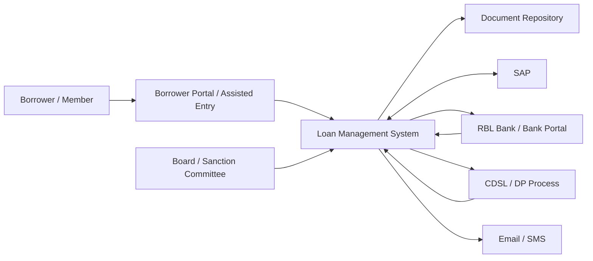
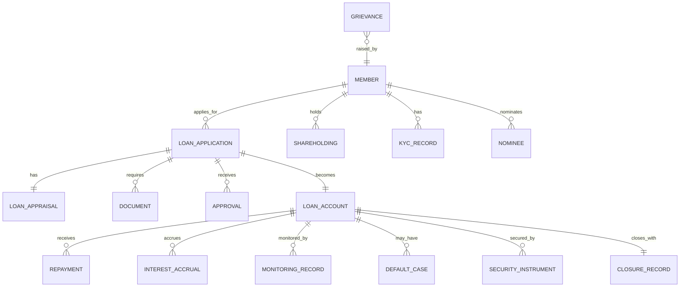

# functional-spec.md

# SFPCL Member Credit Administration & Settlement — Detailed Functional Specification

**Client:** Sahyadri Farmers Producer Company Limited (SFPCL)  
**Business Process:** Member Credit Administration, Loan Sanction, Documentation, Disbursement, Monitoring, Repayment, Recovery and Closure  
**System / Product:** Loan Management and Credit Administration Workflow System  
**Source Basis:** Current analysis of the uploaded SOP documents, the prepared client brief, and the prepared detailed user-flow document  
**Primary SOP Reference:** `SOP_SFPCL_LOANDISBURSEMENT`  
**Original SOP Version:** Version 1.0, August 2025  
**Prepared For:** Product, engineering, QA, implementation, operations, compliance, finance, treasury, SAP, audit and management teams  
**Document Type:** Functional specification in Markdown  
**Generated On:** 2026-06-22  
**File Name:** `functional-spec.md`

---

## 1. Purpose of This Functional Specification

This document defines the detailed functional requirements for a system that digitises and operationalises SFPCL's member credit administration and settlement process.

It converts the current SOP analysis into a build-ready specification covering:

1. Product scope and operating model.
2. Actors, roles and permissions.
3. End-to-end functional modules.
4. Lifecycle states and transitions.
5. Data model and data fields.
6. Business rules and validations.
7. Workflow requirements.
8. Document-generation requirements.
9. Approval and exception workflows.
10. SAP, bank, CDSL and communication touchpoints.
11. Repayment, monitoring, default and closure functionality.
12. Compliance, audit, reporting and security requirements.
13. Open clarifications and implementation risks.
14. Acceptance criteria and traceability to SOP stages.

The system must preserve the controls required by the SOP while reducing manual dependency on Excel registers, email-only approvals, physical checklist tracking and fragmented SAP / bank evidence.

---

## 2. Executive Summary

The proposed system must support the complete member lending lifecycle for SFPCL loans to eligible members. The workflow begins when a borrower, either an individual farmer or an FPC / producer institution member, submits a loan request. The system must validate membership, active status, KYC completeness, shareholding, land-based eligibility, past default status and loan purpose. It must then support preparation of a Loan Appraisal Note, loan-limit calculation, Credit Manager review, Sanction Committee approval, documentation, stamping, security handling, SAP customer code creation, disbursement through bank workflow, repayment tracking, interest invoicing, DPD monitoring, default escalation, recovery decisioning and final closure.

The system must enforce the SOP's core gate controls:

- No loan to non-members.
- No loan for non-agricultural purpose.
- No loan disbursement before KYC, appraisal, approval, documentation, stamping, checklist completion and SAP setup.
- No loan above authority thresholds without correct approval.
- No physical-share or demat-share security bypass.
- No recovery action using SH-4 or blank-dated cheque without formal approval.
- No closure without full repayment, NOC, security return / unpledge and archival.

The system must also support ongoing compliance controls, including Section 186 limits, NBFC principal business test, KYC / AML, stamp duty, money-lending law review, accounting, recovery conduct, data protection, record retention and Board-approved SOP change control.

---

## 3. Business Context

SFPCL is a farmer-owned producer company with a broad member and crop network. The SOP describes the organisation as consisting of 769 individual shareholders and 48 Farmer Producer Companies, representing more than 8,500 direct and indirect members, connecting a broader network of more than 30,000 farmers across 45,000 acres of farmland. SFPCL's value chain covers eight major crops: grapes, tomatoes, citrus, mangoes, bananas, sweetcorn, cashews and pomegranates.

The member credit process is intended to provide structured and transparent financial assistance to eligible members for crop production, agriculture and allied productive purposes.

The legal foundation described in the SOP is that a Producer Company may, subject to its Articles, provide financial assistance to its members by granting credit facilities or secured loans / advances within the allowed statutory period. The system should therefore be designed specifically for member-only lending and should not operate as a general external lending platform.

---

## 4. Product Scope

### 4.1 In Scope

The system must support the following scope:

1. Member / borrower master management.
2. Nominee and witness data capture.
3. Member validation and active / inactive status checks.
4. Loan request intake through assisted entry and digital portal.
5. Loan application form capture and generation.
6. Application completeness verification.
7. Unique application reference number generation.
8. Loan Request Register.
9. KYC / CKYC document tracking.
10. Land document, crop plan, bank statement and share certificate capture.
11. Loan Appraisal Note preparation.
12. Eligibility assessment.
13. Shareholding-based and land-based loan limit calculation.
14. Credit Manager review.
15. Rejection workflow and Rejection Note generation.
16. Sanction Committee scrutiny and approval.
17. Credit Sanction Register.
18. Exception Register.
19. Director / Sanction Committee member / relative special-case approval route.
20. Post-sanction document collection.
21. Document checklist and legal documentation tracking.
22. Power of Attorney generation and tracking.
23. Tri-party Agreement / repayment declaration tracking.
24. SH-4 handling for physical shares.
25. CDSL pledge tracking for demat shares.
26. Future-share pledge flagging.
27. Term Sheet generation and approval.
28. Loan Agreement generation and execution tracking.
29. Bank Verification Letter / signature mismatch declaration flow.
30. Final documentation checklist approval flow.
31. SAP customer / vendor code creation workflow.
32. Loan disbursement workflow through Senior Manager – Finance and Chief Financial Controller.
33. Loan register update and disbursement advice.
34. Direct repayment by farmer through RTGS / NEFT.
35. Repayment through subsidiary deduction.
36. Principal-first repayment allocation.
37. Interest invoicing.
38. Monthly interest accrual.
39. Interest capitalisation after unpaid interest remains unpaid until 30 April of the next financial year.
40. Quarterly monitoring and DPD bucketing.
41. CFO MIS.
42. Reminder workflow.
43. Missed repayment, grace period and extension handling.
44. Non-payment note and recovery action approval.
45. SH-4 / pledge invocation and blank-dated cheque decisioning.
46. Full repayment closure.
47. NOC issuance.
48. Security return and CDSL unpledge tracking.
49. Archival for at least eight years.
50. Borrower compliance and re-KYC tracking.
51. Company statutory compliance dashboard.
52. Grievance form and complaint-handling log.
53. SOP / policy change control.
54. Audit trail and evidence management.
55. Reporting, dashboards and exports.

### 4.2 Out of Scope Unless Confirmed

The following should be treated as optional / future-scope until confirmed:

1. Automated bank API disbursement execution.
2. Automated SAP posting through API integration.
3. Automated CKYC / bureau integration.
4. Automated CDSL pledge initiation.
5. Automated digital stamping / e-notary workflow.
6. eSign / Aadhaar eSign.
7. NACH / ECS debit processing.
8. Guarantor scoring.
9. External credit bureau pull.
10. Multi-state stamp-duty calculator.
11. Mobile app for field officers.
12. Advanced portfolio risk scoring using machine learning.

The first implementation can support these as manual task trackers with evidence upload, before full integration is implemented.

---

## 5. Key Design Principles

The system must be designed around the following principles:

| Principle | Functional Meaning |
|---|---|
| Member-first | Only valid SFPCL members should be allowed to progress into lending workflows. |
| Control-gated | Each stage must enforce mandatory checks before allowing transition to the next stage. |
| Maker-checker | Credit preparation, approval, disbursement and accounting actions must be segregated. |
| Configurable policy | Loan limits, interest rates, scale of finance, approval thresholds and re-KYC cadence must be configurable by authorised admins. |
| Audit-ready | Every decision, document, approval, override and status transition must be timestamped and attributable. |
| Dual physical-digital support | System must track both digital records and physical documents such as stamp papers, SH-4 forms and blank-dated cheques. |
| Exception transparency | Any deviation must have reason, owner, approver, evidence and date. |
| Compliance embedded | Compliance checks must be embedded into workflow, not left as manual afterthoughts. |
| Integration-aware | SAP, bank, CDSL, email, SMS and document storage must be supported either through API or manual evidence workflow. |
| Closure discipline | Full repayment must trigger NOC, security return / unpledge and archival. |

---

## 6. Actors, Roles and Permission Model

### 6.1 Primary Actors

| Actor / Role | Description | Core Responsibilities |
|---|---|---|
| Borrower / Member | Individual farmer, FPC or producer institution applying for a loan. | Submit application, provide documents, accept terms, repay loan, inform changes, cooperate with inspections. |
| Nominee | Nominee of individual borrower. | Sign required documents; provide KYC details; must not be a minor. |
| Witness | Existing SFPCL shareholder witnessing documents. | Provide PAN / Aadhaar; sign SH-4 and / or agreement as applicable. |
| Field Officer | Optional assisted-entry / field support role. | Collect borrower data, upload documents, support inspections and borrower communication. |
| Deputy Manager – Finance | Credit Assessment Team member. | Verify application completeness and prepare Loan Appraisal Note. |
| Credit Manager | Credit Assessment Team lead. | Maintain Loan Request Register, review appraisal, verify loan limits, reject deficient applications, monitor repayments and post repayment entries where required. |
| Company Secretary | Compliance Team lead. | Ensure statutory compliance, documentation, stamping, PoA, SH-4, blank cheque custody, NOC, grievance register and archival. |
| Compliance Team Member | Operational compliance role. | Prepare documentation set, checklist, Term Sheet, Loan Agreement, PoA, declarations and bank verification documents. |
| Sanction Committee Member | CFO and designated Executive Directors. | Approve or reject loan applications within authority matrix, record reasons and approve exceptions. |
| CFO | Sanction Committee member and compliance owner for limits. | Approvals, Section 186 monitoring, NBFC test monitoring, policy deviation oversight and CFO MIS review. |
| Director | Executive Director serving on Sanction Committee. | Approve loans based on authority matrix; abstain where conflict exists. |
| Senior Manager – Finance | Treasury / finance role. | Create SAP customer code workflow, verify documentation, initiate disbursement, sign checklist after disbursement. |
| Chief Financial Controller | Treasury authoriser. | Final bank-transfer approval / execution. |
| Accounts Head / Accounts Team | Accounting role. | SAP entries, accruals, DPD reports and Board pack inputs. |
| Sales Team | Year-end interest invoice role in SOP. | Prepare and issue interest invoices for farmers who have availed loans. |
| IT Head / System Admin | Technology owner. | User access, role permissions, data security, audit logs and integrations. |
| Internal Auditor | Audit role. | Test compliance, sample sanction files and verify process controls. |
| Board / Members in General Meeting | Governance body. | Approve SOP changes, policy changes, special cases and director / relative lending when required. |

### 6.2 Permission Matrix

| Function | Borrower | Field Officer | Credit Manager | Deputy Manager Finance | Compliance | CS | Sanction Committee | Treasury | CFC | CFO | Admin | Auditor |
|---|---:|---:|---:|---:|---:|---:|---:|---:|---:|---:|---:|---:|
| Submit application | Yes | Assisted | No | No | No | No | No | No | No | No | No | View |
| Edit draft application | Own only | Assigned | Assigned | Assigned | No | No | No | No | No | No | No | View |
| Verify completeness | No | No | Review | Yes | No | No | No | No | No | No | No | View |
| Generate application number | No | No | Yes | Yes | No | No | No | No | No | No | Config | View |
| Prepare appraisal note | No | Input | Review | Yes | No | No | No | No | No | No | No | View |
| Approve / reject appraisal | No | No | Yes | No | No | No | No | No | No | No | No | View |
| Sanction loan | No | No | No | No | No | No | Yes | No | No | Yes | No | View |
| Approve exceptions | No | No | No | No | No | No | Yes | No | No | Yes | No | View |
| Prepare legal docs | No | No | No | No | Yes | Yes | No | No | No | No | Template config | View |
| Verify legal docs | No | No | No | No | Yes | Yes | No | No | No | No | No | View |
| Execute checklist approval | No | No | Yes | No | Yes | Yes | Yes | Yes | No | Yes | No | View |
| Create SAP code task | No | No | Request | No | No | No | No | Yes | No | No | No | View |
| Initiate disbursement | No | No | No | No | No | No | No | Yes | No | No | No | View |
| Authorise bank transfer | No | No | No | No | No | No | No | No | Yes | Optional | No | View |
| Post repayment | No | No | Yes | No | No | No | No | Yes | No | No | No | View |
| Generate interest invoice | No | No | Yes | No | No | No | No | No | No | No | No | View |
| Monitor DPD | No | No | Yes | No | No | No | No | Yes | No | CFO view | No | View |
| Initiate recovery note | No | No | Yes | No | Yes | Yes | No | No | No | No | No | View |
| Close loan | View | No | Confirm | No | Execute | Approve | No | Confirm | No | No | No | View |
| Manage users / config | No | No | No | No | No | No | No | No | No | Approve | Yes | View config |
| View audit logs | No | Limited | Own scope | Own scope | Own scope | Yes | Own decisions | Own scope | Own scope | Yes | Yes | Yes |

---

## 7. Functional Architecture

### 7.1 Module List

The system should be organised into the following modules:

| Module ID | Module Name | Description |
|---|---|---|
| M01 | Policy and Product Configuration | Maintains board-approved loan parameters, interest rates, thresholds, scale of finance, document templates and approval matrix. |
| M02 | Member and Borrower Master | Stores member, borrower, nominee, witness, shareholding, active status and KYC data. |
| M03 | Loan Origination | Handles inquiry, application, document upload, completeness check and application number generation. |
| M04 | Eligibility and Appraisal | Performs eligibility checks, prepares appraisal note, captures risk assessment and calculates loan limits. |
| M05 | Sanction and Approval | Manages Sanction Committee workflow, special cases, rejection, Credit Sanction Register and Exception Register. |
| M06 | Documentation and Security | Manages PoA, Term Sheet, Loan Agreement, Tri-party Agreement, SH-4, CDSL pledge, blank cheque, witness and stamping workflows. |
| M07 | SAP and Finance Setup | Tracks customer / vendor code creation in SAP and finance master readiness. |
| M08 | Disbursement | Manages final finance checks, payment initiation, authorisation, disbursement advice and loan activation. |
| M09 | Repayment and Receipting | Tracks repayments through direct RTGS / NEFT and subsidiary deduction; applies principal-first logic. |
| M10 | Interest and Accounting | Handles floating interest configuration, monthly accrual, yearly invoices and unpaid interest capitalisation. |
| M11 | Monitoring and MIS | Tracks DPD, quarterly monitoring, reminders, CFO MIS and portfolio health. |
| M12 | Default and Recovery | Manages grace period, extensions, non-payment notes and recovery action approvals. |
| M13 | Closure and Archival | Supports full repayment confirmation, NOC, security return, CDSL unpledge and eight-year archival. |
| M14 | Compliance and Audit | Manages statutory compliance tasks, audit evidence, record retention, Section 186 and NBFC trackers. |
| M15 | Grievance Management | Captures member complaints, resolution, TAT and escalation. |
| M16 | Notifications and Communications | Sends email, SMS, hard-copy task notices and internal alerts. |
| M17 | Reporting and Exports | Provides registers, dashboards, MIS, audit reports and data exports. |
| M18 | Administration and Access Control | User, role, approval hierarchy, security, workflow and template administration. |

### 7.2 High-Level System Context



Mermaid blocks are included for documentation purposes. The markdown file remains usable even if the viewer does not render Mermaid diagrams.

---

## 8. Lifecycle State Model

### 8.1 Loan Application States

| State Code | State Name | Description | Entry Trigger | Exit Trigger |
|---|---|---|---|---|
| `DRAFT` | Draft Application | Application started but not submitted. | Borrower / field officer starts entry. | Submitted for completeness check. |
| `SUBMITTED` | Submitted | Application submitted with initial data and attachments. | Borrower submits. | Completeness check started. |
| `INCOMPLETE` | Incomplete / Deficiency Raised | Missing or incorrect data / documents. | Deputy Manager – Finance marks deficiencies. | Borrower resubmits or application rejected. |
| `APPLICATION_NO_GENERATED` | Application Number Generated | Unique reference number assigned. | Completeness passed. | Appraisal begins. |
| `APPRAISAL_IN_PROGRESS` | Appraisal in Progress | Loan Appraisal Note under preparation. | Deputy Manager – Finance starts appraisal. | Submitted to Credit Manager. |
| `CREDIT_MANAGER_REVIEW` | Credit Manager Review | Appraisal under Credit Manager review. | Appraisal submitted. | Rejected or sent to Sanction Committee. |
| `REJECTED_BY_CREDIT` | Rejected by Credit Assessment | Credit Manager rejects application. | Eligibility failure. | Reapplication allowed. |
| `PENDING_SANCTION` | Pending Sanction | Awaiting Sanction Committee decision. | Credit Manager submits. | Approved / rejected / sent for more info. |
| `RETURNED_BY_SANCTION` | Returned for Clarification | Sanction Committee asks for clarifications. | Committee action. | Resubmitted to committee. |
| `REJECTED_BY_SANCTION` | Rejected by Sanction Committee | Application declined after committee scrutiny. | Committee rejection. | Reapplication allowed. |
| `SANCTIONED` | Sanctioned | Loan approved in principle. | Committee approval. | Documentation initiated. |
| `DOCUMENTATION_IN_PROGRESS` | Documentation in Progress | Compliance Team prepares and collects documents. | Sanctioned status. | Documentation checklist complete. |
| `DOCUMENT_DEFICIENCY` | Documentation Deficiency | Documents missing, unsigned, unstamped or invalid. | CS / Compliance raises gap. | Deficiency rectified. |
| `DOCS_VERIFIED_BY_CS` | Documents Verified by CS | CS confirms required documents are attached and verified. | CS approval. | Credit Manager final review. |
| `FINAL_CREDIT_REVIEW` | Final Credit Review | Credit Manager verifies limits and documentation before final approval. | CS verification. | Sanction Committee final approval. |
| `FINAL_SANCTION_APPROVAL` | Final Sanction Approval | Final disbursement approval stage. | Credit Manager submits. | Treasury handover. |
| `PENDING_SAP_CODE` | Pending SAP Customer Code | SAP customer code creation pending. | Treasury receives approved file. | SAP code confirmed. |
| `READY_FOR_DISBURSEMENT` | Ready for Disbursement | All controls complete; payment can be initiated. | SAP code and checklist complete. | Payment initiated. |
| `DISBURSEMENT_INITIATED` | Disbursement Initiated | Senior Manager – Finance initiated online transfer. | Treasury action. | CFC authorises. |
| `DISBURSED` | Disbursed / Active Loan | Funds transferred to borrower. | CFC authorisation and bank success. | Repayment monitoring starts. |
| `ACTIVE` | Active Under Repayment | Loan is outstanding and being monitored. | Disbursement complete. | Fully repaid, overdue or default. |
| `OVERDUE` | Overdue | Scheduled repayment missed. | Due date missed. | Paid, grace period, extension or default escalation. |
| `GRACE_PERIOD` | Grace Period | Three-month grace period allowed after missed principal repayment. | Missed repayment. | Paid or reviewed. |
| `EXTENDED` | Extension Granted | One-year extension after non-intentional non-payment. | Non-intentional reason approved. | Paid or non-recoverable review. |
| `NON_RECOVERABLE_REVIEW` | Non-Recoverable Review | Loan unpaid after extension; recovery note required. | Extension failure. | Sanction Committee recovery decision. |
| `RECOVERY_APPROVED` | Recovery Approved | Shares / cheque / recovery action approved. | Committee decision. | Recovery executed or settlement. |
| `RECOVERY_IN_PROGRESS` | Recovery in Progress | SH-4 / CDSL / cheque or other recovery action in progress. | Approved recovery. | Recovered, settled or written-off per policy. |
| `FULLY_REPAID` | Fully Repaid | Principal, interest and dues settled. | Payment confirms zero outstanding. | Closure processing. |
| `CLOSURE_IN_PROGRESS` | Closure in Progress | NOC, return of SH-4 / cheque, unpledge and archival pending. | Full repayment. | Closed. |
| `CLOSED` | Closed | Loan closed and archived. | Closure checklist completed. | Archived / retained. |
| `CANCELLED` | Cancelled | Application cancelled before sanction / disbursement. | Borrower withdrawal or admin cancellation. | Final state. |

### 8.2 State Transition Controls

The system must block transition to later states if required predecessor controls are incomplete.

Examples:

- `SUBMITTED` cannot move to `APPLICATION_NO_GENERATED` if mandatory application fields or KYC documents are missing.
- `APPRAISAL_IN_PROGRESS` cannot move to `PENDING_SANCTION` if eligibility checks are incomplete.
- `SANCTIONED` cannot move to `READY_FOR_DISBURSEMENT` unless documentation, stamping, security and checklist controls are complete.
- `READY_FOR_DISBURSEMENT` cannot move to `DISBURSEMENT_INITIATED` unless SAP customer code is confirmed.
- `ACTIVE` cannot move to `CLOSED` unless outstanding balance is zero and closure checklist is complete.

---

## 9. Core Data Model

### 9.1 Entity Relationship Overview



### 9.2 Member / Borrower Master

| Field | Type | Required | Notes / Validation |
|---|---|---:|---|
| `member_id` | String | Yes | Unique SFPCL member identifier. |
| `member_type` | Enum | Yes | `Individual Farmer`, `FPC`, `Producer Institution`. |
| `full_name` | Text | Yes | Legal name. |
| `father_or_authorised_person_name` | Text | Conditional | For individual / institutional borrower as applicable. |
| `date_of_birth_or_incorporation` | Date | Conditional | Used to validate nominee / borrower details. |
| `pan` | String | Yes | PAN format validation. |
| `aadhaar` | String | Yes for individuals | Masked display; full value stored securely if legally permitted. |
| `registered_address` | Text | Yes | Address for communication and KYC. |
| `mobile_number` | String | Yes | Used for SMS notices. |
| `email_id` | Email | Conditional | Required where available; used for notices. |
| `folio_number` | String | Yes | Required in application. |
| `share_count` | Number | Yes | Used for loan limit calculation. |
| `shareholding_mode` | Enum | Yes | `Physical`, `Demat`, `Mixed`, `Unknown`. |
| `demat_bo_id` | String | Conditional | Required if shares in demat form. |
| `active_member_status` | Enum | Yes | `Active`, `Inactive`, `Pending Verification`. |
| `active_status_reason` | Text | Conditional | Basis of active status. |
| `produce_supply_history_years` | Number | Conditional | Used for active status. |
| `service_availed_flag` | Boolean | Yes | Whether member availed company services. |
| `subsidiary_relationships` | List | Optional | Subsidiaries with which member transacts. |
| `land_area_under_cultivation` | Decimal | Conditional | Used for land-based limit. |
| `default_flag` | Boolean | Yes | Any default with SFPCL, subsidiary or associate company. |
| `current_outstanding_exposure` | Currency | Yes | Total active exposure. |
| `kyc_status` | Enum | Yes | `Pending`, `Complete`, `Expired`, `Rejected`. |
| `re_kyc_due_date` | Date | Conditional | Every two years unless changed. |
| `created_by` | User ID | Yes | Audit. |
| `created_at` | Timestamp | Yes | Audit. |
| `updated_by` | User ID | Yes | Audit. |
| `updated_at` | Timestamp | Yes | Audit. |

### 9.3 Nominee

| Field | Type | Required | Notes |
|---|---|---:|---|
| `nominee_id` | String | Yes | Unique. |
| `member_id` | String | Yes | Linked borrower. |
| `nominee_name` | Text | Yes | As per application. |
| `nominee_age` | Number | Yes | Must not be minor. |
| `nominee_gender` | Enum | Yes | As captured in application. |
| `nominee_aadhaar` | String | Yes | KYC copy required. |
| `nominee_pan` | String | Yes | PAN copy required. |
| `relationship_to_borrower` | Text | Optional | Recommended. |
| `nominee_signature_status` | Enum | Yes | `Pending`, `Signed`, `Mismatch`, `Not Required`. |

### 9.4 Witness

| Field | Type | Required | Notes |
|---|---|---:|---|
| `witness_id` | String | Yes | Unique. |
| `witness_member_id` | String | Yes | Must be existing SFPCL shareholder. |
| `witness_name` | Text | Yes | From KYC. |
| `pan_copy_uploaded` | Boolean | Yes | Required. |
| `aadhaar_copy_uploaded` | Boolean | Yes | Required. |
| `shareholder_validated` | Boolean | Yes | Must be true before document execution. |
| `documents_witnessed` | List | Optional | SH-4, Loan Agreement etc. |

### 9.5 Loan Application

| Field | Type | Required | Notes |
|---|---|---:|---|
| `loan_application_id` | String | Yes | Unique internal ID. |
| `application_reference_number` | String | Conditional | Generated as `LO00000001` onwards after completeness. |
| `member_id` | String | Yes | Borrower. |
| `application_channel` | Enum | Yes | `Offline`, `Digital Portal`, `Assisted Entry`. |
| `requested_amount` | Currency | Yes | Borrower-requested loan amount. |
| `loan_purpose` | Enum/Text | Yes | Must be agriculture / crop production related. |
| `crop_details` | Text/List | Yes | Crop plan required. |
| `loan_type` | Enum | Conditional | `Short-term`, `Long-term`. |
| `requested_tenure_months` | Number | Conditional | Must fit policy. |
| `repayment_date` | Date | Conditional | Captured in Term Sheet. |
| `application_status` | Enum | Yes | From state model. |
| `maximum_permissible_limit` | Currency | System | Calculated. |
| `shareholding_limit` | Currency | System | Calculated. |
| `land_based_limit` | Currency | System | Calculated. |
| `final_eligible_amount` | Currency | System | Lower of the two limits. |
| `recommended_amount` | Currency | Conditional | From appraisal. |
| `sanctioned_amount` | Currency | Conditional | From sanction approval. |
| `exception_required` | Boolean | System | True if requested / sanctioned amount exceeds limit or policy deviation exists. |
| `special_case_flag` | Boolean | System/User | Director / relative / committee member case. |
| `created_at` | Timestamp | Yes | Audit. |
| `submitted_at` | Timestamp | Conditional | Audit and TAT. |

### 9.6 KYC Record

| Field | Type | Required | Notes |
|---|---|---:|---|
| `kyc_record_id` | String | Yes | Unique. |
| `member_id` | String | Yes | Borrower. |
| `pan_document_id` | Document Ref | Yes | Self-attested PAN copy. |
| `aadhaar_document_id` | Document Ref | Yes | Self-attested Aadhaar copy. |
| `ckyc_consent_document_id` | Document Ref | Conditional | Required if CKYC process adopted. |
| `photo_document_id` | Document Ref | Conditional | Borrower compliance section refers to photographs. |
| `beneficial_owner_details` | Text | Conditional | For group / institutional borrowers where applicable. |
| `verified_by` | User ID | Yes | Credit officer / team. |
| `verification_status` | Enum | Yes | `Pending`, `Verified`, `Rejected`, `Expired`. |
| `verification_date` | Date | Conditional | KYC completion date. |
| `next_rekyc_due_date` | Date | Conditional | Normally every two years. |

### 9.7 Document

| Field | Type | Required | Notes |
|---|---|---:|---|
| `document_id` | String | Yes | Unique. |
| `linked_entity_type` | Enum | Yes | Member / Application / Loan Account / Compliance Task. |
| `linked_entity_id` | String | Yes | ID. |
| `document_type` | Enum | Yes | PAN, Aadhaar, Share Certificate, 7/12 Extract, Crop Plan, Bank Statement, PoA, Agreement etc. |
| `file_name` | Text | Yes | Original file name. |
| `file_hash` | Text | Yes | For tamper evidence. |
| `uploaded_by` | User ID | Yes | Audit. |
| `uploaded_at` | Timestamp | Yes | Audit. |
| `verification_status` | Enum | Yes | `Pending`, `Accepted`, `Rejected`, `Expired`, `Returned`. |
| `verified_by` | User ID | Conditional | Document checker. |
| `physical_original_required` | Boolean | Yes | For PoA, agreement, SH-4, cheque etc. |
| `physical_original_received` | Boolean | Conditional | Must be tracked where relevant. |
| `stamp_required` | Boolean | Conditional | For PoA and Loan Agreement. |
| `stamp_amount` | Currency | Conditional | ₹500 for PoA and Loan Agreement per SOP. |
| `notarisation_required` | Boolean | Conditional | PoA and Loan Agreement. |
| `notarisation_status` | Enum | Conditional | `Pending`, `Completed`, `Not Required`. |
| `custody_location` | Text | Conditional | Physical file / vault location. |

### 9.8 Loan Appraisal

| Field | Type | Required | Notes |
|---|---|---:|---|
| `appraisal_id` | String | Yes | Unique. |
| `loan_application_id` | String | Yes | Linked application. |
| `prepared_by` | User ID | Yes | Deputy Manager – Finance. |
| `reviewed_by` | User ID | Conditional | Credit Manager. |
| `active_member_check` | Boolean | Yes | Required. |
| `default_check` | Boolean | Yes | No default required. |
| `document_completeness_check` | Boolean | Yes | Required. |
| `purpose_check` | Boolean | Yes | Agriculture / crop production only. |
| `repayment_capacity_notes` | Text | Yes | From appraisal. |
| `income_evidence_notes` | Text | Recommended | SOP mentions income evidence in exception section. |
| `risk_rating` | Enum | Recommended | Low / Medium / High, configurable. |
| `risk_mitigation` | Text | Recommended | Required for higher-risk borrowers. |
| `recommended_amount` | Currency | Yes | Must not exceed eligible amount unless exception. |
| `recommended_tenure` | Number | Yes | Months / years. |
| `recommended_security` | Text | Yes | SH-4 / pledge / cheque. |
| `appraisal_status` | Enum | Yes | Draft, Submitted, Reviewed, Rejected. |
| `tat_due_at` | Timestamp | System | 2 days from receipt. |

### 9.9 Approval

| Field | Type | Required | Notes |
|---|---|---:|---|
| `approval_id` | String | Yes | Unique. |
| `loan_application_id` | String | Yes | Linked application. |
| `approval_stage` | Enum | Yes | Credit Review, Sanction, Final Documentation, Exception, Recovery, Closure etc. |
| `approval_role` | Enum | Yes | CFO, Director, CS, Credit Manager, Senior Manager Finance etc. |
| `approver_user_id` | User ID | Yes | Actual approver. |
| `decision` | Enum | Yes | Approved, Rejected, Returned, Abstained. |
| `decision_reason` | Text | Conditional | Mandatory for rejection, exception and return. |
| `decision_at` | Timestamp | Yes | Audit. |
| `approval_matrix_rule_id` | String | System | Which authority rule triggered. |
| `conflict_declared` | Boolean | Conditional | Special case handling. |
| `abstention_reason` | Text | Conditional | Required if conflict. |

### 9.10 Security Instrument

| Field | Type | Required | Notes |
|---|---|---:|---|
| `security_id` | String | Yes | Unique. |
| `loan_application_id` | String | Yes | Linked loan. |
| `security_type` | Enum | Yes | `SH-4`, `CDSL Pledge`, `Blank-Dated Cheque`, `PoA`, `Other`. |
| `share_mode` | Enum | Conditional | Physical / Demat. |
| `document_id` | Document Ref | Conditional | Linked file. |
| `physical_original_received` | Boolean | Conditional | Required for SH-4 and cheque. |
| `cheque_number` | String | Conditional | Blank-dated cheque tracking. |
| `bank_name` | Text | Conditional | Cheque bank. |
| `cdsl_pledge_sequence_number` | Text | Conditional | PSN for demat pledge. |
| `pledge_status` | Enum | Conditional | Pending, Created, Rejected, Invoked, Unpledged. |
| `future_shares_pledge_flag` | Boolean | Conditional | True if future shares are to stand pledged. |
| `custody_owner` | User/Role | Conditional | Typically CS / Compliance. |
| `return_status` | Enum | Conditional | Pending, Returned, Not Applicable. |

### 9.11 Loan Account

| Field | Type | Required | Notes |
|---|---|---:|---|
| `loan_account_id` | String | Yes | Unique. |
| `loan_application_id` | String | Yes | Source application. |
| `member_id` | String | Yes | Borrower. |
| `sap_customer_code` | String | Yes before disbursement | Created / confirmed in SAP. |
| `sanctioned_amount` | Currency | Yes | Approved amount. |
| `disbursed_amount` | Currency | Yes after disbursement | Must match approved disbursement. |
| `interest_rate_type` | Enum | Yes | Floating. |
| `current_interest_rate` | Decimal | Yes | Configured rate at disbursement. |
| `penal_interest_rate` | Decimal | Conditional | Open client clarification if not specified. |
| `loan_start_date` | Date | Yes | Disbursement date. |
| `repayment_due_date` | Date | Yes | As per Term Sheet. |
| `loan_tenure_months` | Number | Yes | Short-term = one year; long-term = other tenures. |
| `principal_outstanding` | Currency | Yes | Updated on repayment. |
| `interest_outstanding` | Currency | Yes | Updated by invoices / accruals. |
| `other_charges_outstanding` | Currency | Optional | If fees configured. |
| `loan_status` | Enum | Yes | Active, Overdue, Grace, Extended, Recovery, Closed etc. |
| `dpd_bucket` | Enum | System | 1-2 years, 2-3 years, 3+ years per SOP monitoring; optional standard 0-30, 31-60 etc. |
| `closure_date` | Date | Conditional | Set at closure. |

### 9.12 Repayment

| Field | Type | Required | Notes |
|---|---|---:|---|
| `repayment_id` | String | Yes | Unique. |
| `loan_account_id` | String | Yes | Linked loan. |
| `payment_source` | Enum | Yes | Direct Farmer, Subsidiary Deduction, Recovery, Adjustment. |
| `payment_mode` | Enum | Yes | RTGS, NEFT, Bank Transfer, Subsidiary Transfer, Cheque etc. |
| `payment_date` | Date | Yes | Date received. |
| `value_date` | Date | Optional | Bank value date. |
| `amount_received` | Currency | Yes | Payment amount. |
| `principal_allocated` | Currency | System | Partial repayments adjusted first to principal. |
| `interest_allocated` | Currency | System | After principal as per SOP rule. |
| `charges_allocated` | Currency | Conditional | If charges exist. |
| `bank_reference_number` | Text | Conditional | Required for bank transfer. |
| `borrower_name_in_bank_statement` | Text | Conditional | Required for subsidiary repayment matching. |
| `loan_application_number_in_bank_statement` | Text | Conditional | Required for subsidiary repayment matching. |
| `sap_receipt_entry_id` | String | Conditional | SAP posting reference. |
| `verified_by` | User ID | Yes | Treasury / Credit Manager depending flow. |
| `posted_to_sap_at` | Timestamp | Conditional | Required after posting. |

### 9.13 Interest Accrual and Invoice

| Field | Type | Required | Notes |
|---|---|---:|---|
| `interest_record_id` | String | Yes | Unique. |
| `loan_account_id` | String | Yes | Linked loan. |
| `period_start` | Date | Yes | Accrual / invoice period. |
| `period_end` | Date | Yes | Accrual / invoice period. |
| `interest_rate` | Decimal | Yes | Floating rate applicable. |
| `principal_base` | Currency | Yes | Principal or revised principal. |
| `interest_amount` | Currency | Yes | Calculated. |
| `record_type` | Enum | Yes | Monthly Accrual, Yearly Invoice, Capitalisation. |
| `invoice_number` | String | Conditional | Year-end invoice. |
| `posted_to_sap` | Boolean | Yes | Accounting control. |
| `capitalised_flag` | Boolean | Conditional | True if unpaid interest added to principal. |
| `borrower_intimated` | Boolean | Conditional | Required for capitalisation. |

### 9.14 Compliance Task

| Field | Type | Required | Notes |
|---|---|---:|---|
| `compliance_task_id` | String | Yes | Unique. |
| `compliance_area` | Enum | Yes | Producer lending, Section 186, NBFC, KYC, Stamp Duty, Money-lending, Accounting, Data Protection, Record Retention etc. |
| `owner_role` | Enum | Yes | CS, CFO, Credit Head, IT Head, Accounts Head etc. |
| `frequency` | Enum | Yes | Ongoing, Monthly, Quarterly, Annual, At Execution, Biannual. |
| `due_date` | Date | Yes | System generated. |
| `status` | Enum | Yes | Pending, Complete, Overdue, Waived. |
| `evidence_document_id` | Document Ref | Conditional | Evidence upload. |
| `reviewed_by` | User ID | Conditional | Reviewer. |
| `reviewed_at` | Timestamp | Conditional | Audit. |

---

## 10. Business Rules and Validations

### 10.1 Member and Borrower Rules

| Rule ID | Rule | Severity | System Behaviour |
|---|---|---|---|
| BR-001 | Applicant must be a member of SFPCL. | Blocker | Do not allow loan application to proceed if membership cannot be verified. |
| BR-002 | Borrower may be an individual farmer, FPC or producer institution. | Blocker | Borrower type must be captured and used to trigger applicable fields. |
| BR-003 | Applicant must be active or qualify under recent-member relaxation. | Blocker | Require active status evidence or relaxation reason before appraisal. |
| BR-004 | Individual active member must have availed services and supplied primary produce for four continuous financial years, unless relaxation applies. | Blocker | Validate from member / supply history or require manual approval evidence. |
| BR-005 | New / recent individual member relaxation applies if member supplied produce for at least one year to SFPCL, subsidiary, step-down subsidiary or through a producer institution. | Conditional | Allow active status under relaxation with evidence. |
| BR-006 | Producer member service-based relaxation applies where services were provided in employment or other capacity for three continuous years to SFPCL / subsidiaries / step-down subsidiaries. | Conditional | Allow active status with evidence. |
| BR-007 | Producer institution must be member, avail services and supply primary produce for four continuous financial years unless one-year relaxation applies. | Blocker | Validate or request evidence. |
| BR-008 | Borrower must not be in default for any FPC loan of SFPCL, subsidiary or associate company. | Blocker | Flag if default history exists; prevent normal approval unless exception policy permits. |
| BR-009 | Nominee must not be a minor. | Blocker | Nominee age must meet legal majority threshold. |
| BR-010 | Witness must be an existing SFPCL shareholder. | Blocker | Validate witness member / shareholder status before document execution. |

### 10.2 Application Rules

| Rule ID | Rule | Severity | System Behaviour |
|---|---|---|---|
| BR-011 | Loan Application Form must be signed by applicant and nominee. | Blocker | Do not mark application complete until signatures captured / uploaded. |
| BR-012 | Application must include folio number, share count, maximum permissible limit, requested amount and nominee details. | Blocker | Mandatory fields. |
| BR-013 | KYC documents for borrower and nominee must be submitted. | Blocker | Require PAN, Aadhaar and other OVD / CKYC as configured. |
| BR-014 | Borrower must submit share certificates, 7/12 extract, crop plan and past six months bank statement. | Blocker | Required document checklist. |
| BR-015 | Unique application reference number must follow sequential format beginning `LO00000001`. | Blocker | System-generated, immutable after generation. |
| BR-016 | Incomplete applications must be returned with deficiency list. | Required | Generate deficiency note / rejection note and notification. |
| BR-017 | Loan Appraisal Note must be prepared within two days from application receipt. | SLA | TAT alert to Deputy Manager – Finance and Credit Manager. |
| BR-018 | Loan purpose must be crop production and agriculture activity only. | Blocker | Non-agri purpose cannot proceed unless policy amended. |

### 10.3 Loan Limit Rules

| Rule ID | Rule | Severity | System Behaviour |
|---|---|---|---|
| BR-019 | Shareholding-based limit must be calculated from share count and valuation percentage / per-share cap. | Blocker | Formula-driven calculation. |
| BR-020 | Agricultural land-based limit must be calculated from scale of finance and land area under cultivation. | Blocker | Formula-driven calculation. |
| BR-021 | Final eligible loan amount must be lower of shareholding-based and land-based limits. | Blocker | System-calculated. |
| BR-022 | Scale of finance is currently capped at ₹20,000 per acre unless configured otherwise. | Configurable | Use board-approved parameter. |
| BR-023 | Share valuation must be based on latest audited financial statements approved at AGM, using Net Asset Value / fair market valuation. | Configurable / Evidence | Require annual valuation parameter and Board / AGM evidence. |
| BR-024 | Percentage / per-share cap changes require Board approval. | Blocker | Admin cannot activate changed config without approval metadata. |
| BR-025 | SOP contains 30% vs 10% / ₹200 per share ambiguity. | Open Issue | System must not hard-code until client confirms operative rule. |

### 10.4 Approval Rules

| Rule ID | Rule | Severity | System Behaviour |
|---|---|---|---|
| BR-026 | Loan up to ₹5,00,000 per member requires CFO + one Director approval. | Blocker | Route approval accordingly. |
| BR-027 | Loan above ₹5,00,000 requires CFO + two Directors approval. | Blocker | Route approval accordingly. |
| BR-028 | Loan exceeding maximum permissible limit requires CFO + two Directors and Exception Register reason. | Blocker | Create exception workflow. |
| BR-029 | Credit Manager is maker and Sanction Committee is checker for loan sanction. | Blocker | Segregate maker and checker. |
| BR-030 | Sanction Committee decision must be recorded with approval / rejection reason in Credit Sanction Register. | Blocker | Do not progress without decision record. |
| BR-031 | If Sanction Committee member, director or relative is borrower, conflicted person must be excluded from scrutiny and approval. | Blocker | Require conflict declaration and abstention. |
| BR-032 | Director / relative loan requires approval of members in general meeting in accordance with Section 378ZK. | Blocker | Require general meeting approval evidence before sanction finalisation. |
| BR-033 | Rejected borrower may reapply after fulfilling rejection criteria. | Required | Support reapplication linked to rejected application. |

### 10.5 Documentation and Security Rules

| Rule ID | Rule | Severity | System Behaviour |
|---|---|---|---|
| BR-034 | Post-sanction documents must include witness PAN / Aadhaar, cancelled cheque and blank-dated cheque. | Blocker | Required before final documentation completion. |
| BR-035 | Cancelled cheque verifies account number, IFSC and branch. | Blocker | Bank details must be verified before disbursement. |
| BR-036 | Blank-dated cheque is held as security and can only be used after approved default handling. | Blocker | Track custody; block informal use. |
| BR-037 | PoA must be prepared in favour of Company Secretary, signed by farmer and nominee, executed on ₹500 stamp paper and notarised. | Blocker | Checklist item. |
| BR-038 | Tri-party agreement / declaration must be prepared where repayment via subsidiary transactions is applicable. | Blocker / Conditional | Required if subsidiary repayment route selected. |
| BR-039 | SH-4 required for physical shares and must be signed by shareholder and witness. | Blocker / Conditional | Required if shareholding mode is physical. |
| BR-040 | CDSL pledge process required for demat shares. | Blocker / Conditional | Track pledge request, PSN and status. |
| BR-041 | Future shares issued to borrower shall stand pledged to SFPCL. | Required | Mark future-share pledge flag. |
| BR-042 | Term Sheet must include borrower, nominee, shares, loan type, amount, purpose, rate, tenure, repayment date, penalty, charges, security and dispute resolution. | Blocker | Template field completeness validation. |
| BR-043 | Loan Agreement must be executed on ₹500 stamp paper and notarised. | Blocker | Required before disbursement. |
| BR-044 | Signature mismatch requires Bank Verification Letter or borrower declaration on non-judicial stamp paper. | Blocker | Require resolution before disbursement. |
| BR-045 | Checklist must be signed / approved by CS, Credit Manager, Sanction Committee and Senior Manager – Finance as per sequence. | Blocker | Sequential approvals. |
| BR-046 | Term Sheet requires CFO signature below ₹5 lakh and CFO + two Directors above ₹5 lakh. | Blocker | Route signature approvals accordingly. |

### 10.6 SAP and Disbursement Rules

| Rule ID | Rule | Severity | System Behaviour |
|---|---|---|---|
| BR-047 | Unique SAP customer ID is created for first-time borrower after Sanction Committee approval. | Blocker | Create SAP code task. |
| BR-048 | Existing borrower with outstanding loan must continue existing Customer ID; no duplicate code. | Blocker | Check existing SAP customer code. |
| BR-049 | Customer code creation request must include farmer name, Aadhaar, PAN, address, email ID and loan application number. | Blocker | Data completeness validation. |
| BR-050 | Senior Manager – Finance must confirm SAP customer code creation. | Blocker | Cannot disburse before confirmation. |
| BR-051 | Senior Manager – Finance initiates online payment through SFPCL's RBL Bank account. | Required | Track initiation task. |
| BR-052 | Chief Financial Controller gives final approval and executes bank transfer. | Blocker | Track authorisation. |
| BR-053 | Loan Register must be updated after disbursement. | Required | Automatic or task-based update. |
| BR-054 | Disbursement advice must be shared with farmer after disbursement. | Required | Notification generation. |

### 10.7 Repayment and Interest Rules

| Rule ID | Rule | Severity | System Behaviour |
|---|---|---|---|
| BR-055 | Direct repayment must be through company account via RTGS / NEFT. | Required | Capture bank reference. |
| BR-056 | Partial repayment is adjusted first against principal before interest. | Blocker | Allocation engine. |
| BR-057 | Direct repayment SAP entry must be posted by Credit Manager on next working day after payment confirmation. | SLA | Task and alert. |
| BR-058 | Subsidiary repayment transaction must clearly reflect borrower name and loan application number. | Blocker for auto-match | Unmatched transactions go to reconciliation queue. |
| BR-059 | Treasury verifies bank statement and passes corresponding receipt entry in SAP for subsidiary repayment. | Required | Track verification and SAP entry. |
| BR-060 | Sales Team prepares and issues yearly interest invoices for each farmer who has availed loan. | Required | Year-end invoice workflow. |
| BR-061 | If interest remains unpaid up to 30 April of next financial year, unpaid interest is added to principal. | Blocker for new FY calculation | Capitalisation workflow. |
| BR-062 | New FY interest is calculated on revised principal after capitalisation. | Blocker | Recalculate base. |
| BR-063 | Borrower must be intimated by official email / hard copy letter about interest capitalisation. | Required | Communication task. |
| BR-064 | Interest rate is floating and changes based on bank rates. | Configurable | Rate changes must be versioned and communicated. |
| BR-065 | Revised interest rates must be communicated by SMS and email. | Required | Notification workflow. |

### 10.8 Monitoring, Default and Closure Rules

| Rule ID | Rule | Severity | System Behaviour |
|---|---|---|---|
| BR-066 | Accounts Team monitors repayments quarterly. | Required | Quarterly tasks and MIS. |
| BR-067 | Credit Manager classifies loans by DPD buckets. | Required | Automatic ageing / manual confirmation. |
| BR-068 | Quarterly MIS must be presented to CFO. | Required | CFO dashboard and report. |
| BR-069 | Credit Manager sends SMS / phone reminders when loan remains outstanding beyond one year at quarter-end. | Required | Reminder queue and call log. |
| BR-070 | Missed scheduled principal repayment triggers three-month grace period. | Required | Automatic status transition. |
| BR-071 | After grace period, Credit Assessment Team assesses intentional vs non-intentional non-payment. | Required | Default review task. |
| BR-072 | Non-intentional non-payment may receive one-year extension with extension note in file. | Required | Extension workflow and document. |
| BR-073 | If still unpaid after extension, loan enters non-recoverable review. | Required | Non-payment note required. |
| BR-074 | Sanction Committee decides on share sale / cheque presentation / recovery action. | Blocker | Recovery cannot proceed without decision. |
| BR-075 | Full repayment triggers NOC issuance, SH-4 return, blank cheque return and archival. | Blocker | Closure checklist. |
| BR-076 | Loan-related documents retained for at least eight years. | Compliance | Archive retention policy. |

---

## 11. Module Functional Specifications

## 11.1 M01 — Policy and Product Configuration

### Objective

Enable authorised administrators to maintain all board-approved lending policy parameters that drive eligibility, calculation, approval and compliance workflows.

### Functional Requirements

| Req ID | Requirement |
|---|---|
| M01-FR-001 | System shall maintain one or more loan product configurations for SFPCL member lending. |
| M01-FR-002 | System shall store effective date, version, approval authority and Board approval reference for each policy configuration. |
| M01-FR-003 | System shall maintain loan eligibility parameters by borrower type. |
| M01-FR-004 | System shall maintain share valuation parameters from latest audited financial statements approved at AGM. |
| M01-FR-005 | System shall support configurable shareholding-based calculation percentage or per-share cap. |
| M01-FR-006 | System shall flag the current SOP ambiguity between 30%, 10% and ₹200 per share as a policy decision pending confirmation until resolved. |
| M01-FR-007 | System shall maintain annual Scale of Finance and current cap of ₹20,000 per acre unless changed. |
| M01-FR-008 | System shall maintain approval thresholds, including ₹5,00,000. |
| M01-FR-009 | System shall maintain list of Sanction Committee members and designated directors. |
| M01-FR-010 | System shall maintain interest-rate type as floating and store current rate, rate source, effective date and communication status. |
| M01-FR-011 | System shall maintain penalty interest, other charges and fees once client confirms values. |
| M01-FR-012 | System shall maintain document templates and checklist requirements by borrower type and share mode. |
| M01-FR-013 | System shall maintain re-KYC cadence, defaulting to two years. |
| M01-FR-014 | System shall maintain statutory compliance task frequency and owners. |
| M01-FR-015 | System shall prevent activation of a policy version without evidence of required approval. |

### Configuration Objects

1. Loan product.
2. Share valuation version.
3. Scale of Finance version.
4. Interest rate version.
5. Approval matrix.
6. Document checklist matrix.
7. Compliance schedule.
8. User role assignment.
9. Notification templates.
10. Register numbering sequences.

### Controls

- Only Admin can draft configuration.
- CFO / Board-approved role must approve activation.
- Every change must generate an audit log entry.
- Old configuration must remain available for historical loans.

---

## 11.2 M02 — Member and Borrower Master

### Objective

Maintain a single source of truth for borrower identity, membership, shareholding, active status, KYC, nominee, witness and default profile.

### Functional Requirements

| Req ID | Requirement |
|---|---|
| M02-FR-001 | System shall maintain member profile for individual farmers, FPCs and producer institutions. |
| M02-FR-002 | System shall store folio number, share count and shareholding mode. |
| M02-FR-003 | System shall support physical, demat and mixed shareholding. |
| M02-FR-004 | System shall store produce supply history and service usage details required for active member validation. |
| M02-FR-005 | System shall support active / inactive / pending verification status. |
| M02-FR-006 | System shall store active-member relaxation evidence for new / recent members. |
| M02-FR-007 | System shall record whether borrower has default with SFPCL, subsidiary or associate company. |
| M02-FR-008 | System shall store nominee details and prevent minor nominee submission. |
| M02-FR-009 | System shall store witness details and validate witness as SFPCL shareholder. |
| M02-FR-010 | System shall maintain KYC status and next re-KYC due date. |
| M02-FR-011 | System shall maintain history of address, bank account, landholding and shareholding changes. |
| M02-FR-012 | System shall support locking identity fields after verification unless change request is approved. |

### Key Screens

1. Member Search.
2. Member Profile View.
3. Member Eligibility Tab.
4. Shareholding Tab.
5. KYC Tab.
6. Nominee Tab.
7. Land and Crop Profile Tab.
8. Borrowing History Tab.
9. Communications and Grievances Tab.

### Acceptance Criteria

- User can search member by name, PAN, Aadhaar, folio number, mobile number or member ID.
- System identifies duplicate PAN / Aadhaar before creating a new member record.
- System blocks loan initiation if member status is inactive unless an authorised user changes status with evidence.
- System displays whether share security should be SH-4 or CDSL pledge based on shareholding mode.

---

## 11.3 M03 — Loan Origination

### Objective

Capture loan requests from borrowers through offline, assisted or digital channels and ensure complete application intake.

### Functional Requirements

| Req ID | Requirement |
|---|---|
| M03-FR-001 | System shall allow application initiation by borrower, field officer, Credit Manager or Deputy Manager – Finance. |
| M03-FR-002 | System shall capture application channel as offline, digital portal or assisted entry. |
| M03-FR-003 | System shall capture folio number, share count, requested loan amount, purpose and nominee details. |
| M03-FR-004 | System shall show system-calculated maximum permissible loan limit after required data is available. |
| M03-FR-005 | System shall require applicant and nominee signatures, either digital or scanned physical copy. |
| M03-FR-006 | System shall require borrower and nominee KYC uploads. |
| M03-FR-007 | System shall require share certificate, 7/12 extract, crop plan and six-month bank statement. |
| M03-FR-008 | System shall allow save-as-draft before submission. |
| M03-FR-009 | System shall validate mandatory fields before submission. |
| M03-FR-010 | System shall route submitted application to Deputy Manager – Finance for completeness check. |
| M03-FR-011 | System shall generate deficiency list for incomplete applications. |
| M03-FR-012 | System shall generate unique application number only after completeness passes. |

### Application Reference Number

The system must support the sequence:

```text
LO00000001
LO00000002
LO00000003
...
```

The sequence must be unique, non-repeating and auditable. Cancelled or rejected applications should not result in reused numbers.

### Deficiency Flow

1. Deputy Manager – Finance reviews submitted application.
2. Missing fields / documents are marked.
3. System generates deficiency note or Rejection Note as applicable.
4. Borrower is notified through configured channel.
5. Application enters `INCOMPLETE` state.
6. Borrower / field officer resubmits.
7. System keeps deficiency history.

---

## 11.4 M04 — Eligibility and Appraisal

### Objective

Support appraisal note preparation, eligibility verification, risk review and loan-limit recommendation.

### Functional Requirements

| Req ID | Requirement |
|---|---|
| M04-FR-001 | System shall create Loan Appraisal Note task after application number generation. |
| M04-FR-002 | System shall assign appraisal preparation to Deputy Manager – Finance. |
| M04-FR-003 | System shall track two-day TAT from application receipt / completeness confirmation. |
| M04-FR-004 | System shall provide checklist for active membership, default status, land documents, KYC, bank statement, crop plan and loan purpose. |
| M04-FR-005 | System shall calculate shareholding-based limit. |
| M04-FR-006 | System shall calculate land-based limit. |
| M04-FR-007 | System shall calculate final eligible amount as lower of the two limits. |
| M04-FR-008 | System shall allow recommendation amount, tenure, security and repayment terms. |
| M04-FR-009 | System shall capture repayment capacity notes and risk assessment. |
| M04-FR-010 | System shall require Credit Manager review before submission to Sanction Committee. |
| M04-FR-011 | System shall support rejection by Credit Manager and generate Rejection Note. |

### Appraisal Fields

The Loan Appraisal Note should include at minimum:

1. Borrower identity.
2. Borrower type.
3. Application number.
4. Requested amount.
5. Purpose of loan.
6. Membership status.
7. Active member evidence.
8. Default status.
9. Shareholding details.
10. Land area.
11. Crop plan summary.
12. Bank statement review notes.
13. Loan limit calculation.
14. Recommended amount.
15. Recommended tenure.
16. Interest / rate basis.
17. Security proposed.
18. Risk rating.
19. Risk observations.
20. Credit Manager recommendation.

---

## 11.5 M05 — Sanction and Approval

### Objective

Digitise the Sanction Committee review and approval process with matrix-based routing, decision records, rejections and special-case handling.

### Functional Requirements

| Req ID | Requirement |
|---|---|
| M05-FR-001 | System shall route appraisal package to Sanction Committee after Credit Manager submission. |
| M05-FR-002 | System shall display eligibility, loan amount, purpose, compliance checks, borrowing history, risk and documentation completeness. |
| M05-FR-003 | System shall apply approval matrix based on loan amount and exception status. |
| M05-FR-004 | System shall require CFO + one Director approval for loans up to ₹5,00,000. |
| M05-FR-005 | System shall require CFO + two Directors for loans above ₹5,00,000. |
| M05-FR-006 | System shall require CFO + two Directors and Exception Register entry for loans exceeding maximum permissible limit. |
| M05-FR-007 | System shall allow approval, rejection or return-for-clarification. |
| M05-FR-008 | System shall require reasons for rejection and return. |
| M05-FR-009 | System shall generate Credit Sanction Register record after decision. |
| M05-FR-010 | System shall notify Credit Assessment Team by email / workflow notification. |
| M05-FR-011 | System shall support abstention where approver has conflict. |
| M05-FR-012 | System shall trigger general meeting approval evidence requirement for director / relative cases. |

### Sanction Committee Checklist

The Sanction Committee screen must show explicit confirmations for:

1. Eligibility verification.
2. Loan amount assessment.
3. Purpose of loan.
4. Compliance checks.
5. Past borrowing history.
6. Risk assessment.
7. Documentation completeness.
8. Approval authority applicable.
9. Exception flag, if any.
10. Conflict / related-party flag, if any.

### Credit Sanction Register Fields

1. Application number.
2. Borrower name.
3. Borrower type.
4. Requested amount.
5. Eligible amount.
6. Recommended amount.
7. Sanctioned amount.
8. Approval authority.
9. Approver names.
10. Approval date.
11. Decision.
12. Reasons.
13. Exception reference.
14. Conflict / abstention details.
15. General meeting approval reference, if applicable.

---

## 11.6 M06 — Documentation and Security

### Objective

Ensure all post-sanction documents are prepared, signed, stamped, notarised, verified, secured and approved before disbursement.

### Functional Requirements

| Req ID | Requirement |
|---|---|
| M06-FR-001 | System shall create documentation checklist automatically after sanction. |
| M06-FR-002 | System shall assign document preparation to Compliance Team. |
| M06-FR-003 | System shall collect witness PAN and Aadhaar. |
| M06-FR-004 | System shall validate witness as existing SFPCL shareholder. |
| M06-FR-005 | System shall require cancelled cheque for bank verification. |
| M06-FR-006 | System shall require blank-dated cheque as security and capture custody details. |
| M06-FR-007 | System shall generate / track Power of Attorney in favour of Company Secretary. |
| M06-FR-008 | System shall require ₹500 stamp and notarisation for PoA. |
| M06-FR-009 | System shall generate / track Tri-party Agreement where subsidiary repayment is applicable. |
| M06-FR-010 | System shall generate / track SH-4 for physical shares. |
| M06-FR-011 | System shall track CDSL pledge for demat shares. |
| M06-FR-012 | System shall track future-share pledge obligation. |
| M06-FR-013 | System shall generate Term Sheet with mandatory terms. |
| M06-FR-014 | System shall enforce Term Sheet signature routing based on loan amount. |
| M06-FR-015 | System shall generate Loan Agreement and require ₹500 stamp and notarisation. |
| M06-FR-016 | System shall detect / allow flagging of signature mismatch. |
| M06-FR-017 | System shall generate Bank Verification Letter or require borrower declaration for signature mismatch. |
| M06-FR-018 | System shall maintain final checklist index. |
| M06-FR-019 | System shall block disbursement until checklist is complete and approved. |

### Mandatory Documentation Set

| Document | Applies When | Required Signatures / Evidence | Stamp / Notary |
|---|---|---|---|
| Power of Attorney | All loans unless policy says otherwise | Farmer / borrower and nominee | ₹500 stamp paper and notarised |
| Declaration / Tri-party Agreement | Subsidiary deduction route | Borrower, nominee, SFPCL, subsidiary as applicable | As template requires |
| SH-4 | Physical shares | Loan applicant / shareholder and witness | As applicable |
| CDSL Pledge Evidence | Demat shares | PRF, PSN, DP acceptance evidence | Not applicable unless external document requires |
| Term Sheet | All loans | Applicant, nominee, CFO / directors as per amount | As template requires |
| Loan Agreement | All loans | Applicant and witness | ₹500 stamp paper and notarised |
| Bank Verification Letter | Signature mismatch | Bank signature and stamp | Not applicable |
| Borrower Signature Declaration | Signature mismatch alternative | Borrower | Non-judicial stamp paper |
| Cancelled Cheque | All disbursements | Uploaded cheque image / physical record | Not applicable |
| Blank-Dated Cheque | Security | Physical cheque custody | Not applicable |
| Checklist | All loans | CS, Credit Manager, Sanction Committee, Senior Manager – Finance | Not applicable |

### Checklist Approval Sequence

1. Compliance Team prepares file.
2. Company Secretary verifies all documents and signs / approves checklist.
3. Credit Manager verifies loan limits and signs / approves checklist.
4. Sanction Committee gives final disbursement approval and signs / approves checklist.
5. Senior Manager – Finance signs / approves checklist only after actual disbursement.

---

## 11.7 M07 — SAP and Finance Setup

### Objective

Track creation or reuse of SAP customer / vendor code and ensure finance readiness before disbursement.

### Functional Requirements

| Req ID | Requirement |
|---|---|
| M07-FR-001 | System shall check whether borrower already has SAP customer code. |
| M07-FR-002 | System shall prevent duplicate customer ID where borrower has outstanding loan. |
| M07-FR-003 | System shall generate SAP customer code request after sanction approval. |
| M07-FR-004 | System shall capture required details: full name, Aadhaar, PAN, address, email ID and loan application number. |
| M07-FR-005 | System shall allow export in Excel format for SAP code creation if direct integration is unavailable. |
| M07-FR-006 | System shall track email / task sent to Senior Manager – Finance. |
| M07-FR-007 | System shall require Senior Manager – Finance confirmation of SAP code. |
| M07-FR-008 | System shall store SAP customer code against borrower and loan application. |
| M07-FR-009 | System shall track initial loan payment SAP entry. |
| M07-FR-010 | System shall block disbursement until SAP customer code is confirmed. |

### SAP Request Fields

1. Farmer / borrower full name.
2. Aadhaar number.
3. PAN number.
4. Address.
5. Email ID.
6. Loan application number.
7. Member ID / folio number.
8. Borrower type.
9. Bank account details.
10. Sanctioned amount.

---

## 11.8 M08 — Loan Disbursement

### Objective

Control loan disbursement after all approvals, documentation and SAP setup are complete.

### Functional Requirements

| Req ID | Requirement |
|---|---|
| M08-FR-001 | System shall route approved and documented file to Treasury Team. |
| M08-FR-002 | System shall require Senior Manager – Finance final verification. |
| M08-FR-003 | System shall display all disbursement blockers before allowing payment initiation. |
| M08-FR-004 | System shall capture borrower bank details verified from cancelled cheque. |
| M08-FR-005 | System shall record online payment initiation through RBL Bank account. |
| M08-FR-006 | System shall route payment to Chief Financial Controller for final approval. |
| M08-FR-007 | System shall capture bank reference / UTR after transfer. |
| M08-FR-008 | System shall activate loan account after successful disbursement. |
| M08-FR-009 | System shall update Loan Register automatically or via confirmed task. |
| M08-FR-010 | System shall generate disbursement advice to farmer. |
| M08-FR-011 | System shall require Senior Manager – Finance checklist sign-off after actual disbursement. |

### Disbursement Blockers

The system must prevent disbursement if any of the following are incomplete:

1. Sanction approval.
2. Exception approval, if applicable.
3. General meeting approval, if applicable.
4. KYC complete.
5. Appraisal complete.
6. Document checklist complete.
7. PoA complete.
8. Term Sheet complete.
9. Loan Agreement complete.
10. SH-4 or CDSL pledge complete, as applicable.
11. Blank-dated cheque received.
12. Cancelled cheque verified.
13. Signature mismatch resolved.
14. SAP customer code confirmed.
15. Senior Manager – Finance verification complete.
16. CFC authorisation pending but required before final disbursement success.

---

## 11.9 M09 — Repayment and Receipting

### Objective

Record, allocate and reconcile loan repayments from both direct farmer transfers and subsidiary deductions.

### Functional Requirements

| Req ID | Requirement |
|---|---|
| M09-FR-001 | System shall support direct farmer repayment through RTGS / NEFT. |
| M09-FR-002 | System shall support repayment through subsidiary deduction. |
| M09-FR-003 | System shall capture bank reference, payment date, amount and source. |
| M09-FR-004 | System shall allocate partial repayment first to principal before interest. |
| M09-FR-005 | System shall create SAP posting task for Credit Manager for direct repayments. |
| M09-FR-006 | System shall create Treasury verification task for subsidiary repayments. |
| M09-FR-007 | System shall require borrower name and loan application number for subsidiary repayment matching. |
| M09-FR-008 | System shall maintain unmatched payment queue. |
| M09-FR-009 | System shall allow manual allocation with reason and approval where auto-match fails. |
| M09-FR-010 | System shall update principal and interest outstanding after posting. |
| M09-FR-011 | System shall maintain repayment ledger. |

### Repayment Allocation Logic

```text
If amount_received <= principal_outstanding:
    principal_allocated = amount_received
    interest_allocated = 0
else:
    principal_allocated = principal_outstanding
    interest_allocated = amount_received - principal_outstanding
```

If charges are introduced, client must confirm whether charges are paid before or after interest. Until confirmed, system should not auto-allocate to charges unless configured.

---

## 11.10 M10 — Interest and Accounting

### Objective

Support floating interest, monthly accruals, yearly invoices and unpaid-interest capitalisation.

### Functional Requirements

| Req ID | Requirement |
|---|---|
| M10-FR-001 | System shall store floating interest rate versions and effective dates. |
| M10-FR-002 | System shall notify borrowers of rate changes by SMS and email. |
| M10-FR-003 | System shall calculate monthly interest accruals based on configured method. |
| M10-FR-004 | System shall create monthly SAP accrual posting tasks. |
| M10-FR-005 | System shall support yearly interest invoice generation. |
| M10-FR-006 | System shall identify farmers requiring interest invoices at financial year-end. |
| M10-FR-007 | System shall track unpaid interest up to 30 April of next financial year. |
| M10-FR-008 | System shall capitalise unpaid interest into principal after 30 April where applicable. |
| M10-FR-009 | System shall calculate new financial year interest on revised principal. |
| M10-FR-010 | System shall notify borrower of capitalisation by email and hard-copy task. |
| M10-FR-011 | System shall preserve invoice and accrual history. |

### Open Accounting Configuration

The SOP does not define:

1. Exact interest calculation day count.
2. Rate benchmark and spread.
3. Rate reset frequency.
4. Penal interest values.
5. Fee allocation waterfall.
6. GST / tax applicability on charges or interest invoices.

The system must make these configurable and require client confirmation before production.

---

## 11.11 M11 — Monitoring and MIS

### Objective

Provide ongoing repayment monitoring, DPD classification, reminders and CFO / Board reporting.

### Functional Requirements

| Req ID | Requirement |
|---|---|
| M11-FR-001 | System shall monitor all active loans quarterly. |
| M11-FR-002 | System shall compute overdue status from due dates and repayment ledger. |
| M11-FR-003 | System shall classify loans into DPD buckets defined in SOP: 1-2 years, 2-3 years and more than 3 years. |
| M11-FR-004 | System should optionally support standard delinquency buckets such as 0-30, 31-60, 61-90 and >90 days for management reporting. |
| M11-FR-005 | System shall generate CFO quarterly MIS. |
| M11-FR-006 | System shall create reminder tasks for loans outstanding beyond one year at quarter-end. |
| M11-FR-007 | System shall log SMS reminders and phone calls. |
| M11-FR-008 | System shall display portfolio summary by amount, crop, region, borrower type, DPD and security type. |
| M11-FR-009 | System shall track extension notes and non-payment notes. |
| M11-FR-010 | System shall provide drill-down from portfolio dashboard to loan account. |

### CFO MIS Fields

1. Total active loans.
2. Total sanctioned amount.
3. Total disbursed amount.
4. Principal outstanding.
5. Interest outstanding.
6. Repayments received in quarter.
7. Loans by DPD bucket.
8. Loans overdue beyond one year.
9. Loans in grace period.
10. Loans under extension.
11. Loans under non-recoverable review.
12. Loans with recovery approved.
13. Exceptions approved.
14. Director / related-party cases.
15. KYC overdue cases.
16. Pending documentation issues.
17. SAP posting exceptions.
18. Interest invoice status.
19. Closure pending cases.
20. Grievances open.

---

## 11.12 M12 — Default and Recovery

### Objective

Implement the SOP's missed repayment, grace period, extension and recovery decision workflow.

### Functional Requirements

| Req ID | Requirement |
|---|---|
| M12-FR-001 | System shall detect missed scheduled principal repayment. |
| M12-FR-002 | System shall move loan to three-month grace period after missed repayment. |
| M12-FR-003 | System shall notify Credit Assessment Team of grace period start and end. |
| M12-FR-004 | System shall require reason assessment after grace period if unpaid. |
| M12-FR-005 | System shall capture whether non-payment is intentional or non-intentional. |
| M12-FR-006 | System shall allow one-year extension for non-intentional non-payment. |
| M12-FR-007 | System shall require Credit Manager to prepare extension note. |
| M12-FR-008 | System shall store extension note in loan file. |
| M12-FR-009 | System shall move loan to non-recoverable review if unpaid after extension. |
| M12-FR-010 | System shall require Note for Non-Payment. |
| M12-FR-011 | System shall route Note for Non-Payment to Sanction Committee. |
| M12-FR-012 | System shall support recovery decision options: invoke SH-4 / sell shares, invoke CDSL pledge, present blank-dated cheque, other approved action. |
| M12-FR-013 | System shall block recovery execution without Sanction Committee approval. |
| M12-FR-014 | System shall maintain recovery log and evidence. |
| M12-FR-015 | System shall track fair-practice controls, including call / visit logs and no-harassment notes. |

### Recovery Decision Screen

The recovery decision screen must show:

1. Borrower profile.
2. Loan history.
3. Amount disbursed.
4. Principal outstanding.
5. Interest outstanding.
6. Days / years overdue.
7. Security instruments available.
8. SH-4 status.
9. CDSL pledge status.
10. Blank-dated cheque status.
11. Extension note.
12. Note for Non-Payment.
13. Reason for intentional / non-intentional classification.
14. Contact / reminder history.
15. Recommended recovery action.
16. Sanction Committee decision and reasons.

---

## 11.13 M13 — Closure and Archival

### Objective

Close fully repaid loans with complete NOC, security return / unpledge and retention controls.

### Functional Requirements

| Req ID | Requirement |
|---|---|
| M13-FR-001 | System shall detect zero outstanding principal, interest and charges. |
| M13-FR-002 | System shall move loan to `FULLY_REPAID` status. |
| M13-FR-003 | System shall create closure checklist. |
| M13-FR-004 | System shall assign NOC preparation to Compliance Team. |
| M13-FR-005 | System shall generate NOC. |
| M13-FR-006 | System shall track return of SH-4 copy where physical shares were used. |
| M13-FR-007 | System shall track return of blank-dated cheque. |
| M13-FR-008 | System shall track CDSL unpledge for demat shares. |
| M13-FR-009 | System shall capture borrower acknowledgement of returned documents / security. |
| M13-FR-010 | System shall archive loan file for minimum eight years. |
| M13-FR-011 | System shall prevent loan status `CLOSED` until closure checklist is complete. |

### Closure Checklist

1. Principal fully repaid.
2. Interest fully repaid or adjusted.
3. Other dues / charges cleared.
4. SAP balance reconciled.
5. Repayment ledger confirmed.
6. NOC generated.
7. NOC issued to borrower.
8. SH-4 returned if applicable.
9. Blank-dated cheque returned.
10. CDSL unpledge completed if applicable.
11. Security return acknowledgement captured.
12. Loan documents archived.
13. Closure date recorded.
14. Closure notification sent.

---

## 11.14 M14 — Compliance and Audit

### Objective

Provide a structured compliance dashboard and evidence store for statutory and internal controls.

### Functional Requirements

| Req ID | Requirement |
|---|---|
| M14-FR-001 | System shall maintain statutory compliance obligations with owner, frequency, due date and evidence. |
| M14-FR-002 | System shall track Producer Company member-only lending control. |
| M14-FR-003 | System shall track Section 186 loan limit calculation quarterly. |
| M14-FR-004 | System shall track NBFC principal business test quarterly. |
| M14-FR-005 | System shall track KYC / AML onboarding and re-KYC. |
| M14-FR-006 | System shall track stamp duty / stamping at execution. |
| M14-FR-007 | System shall track annual state money-lending law review / legal opinion. |
| M14-FR-008 | System shall track accounting and reporting controls monthly / quarterly. |
| M14-FR-009 | System shall track recovery conduct and grievance controls. |
| M14-FR-010 | System shall track data protection and access review quarterly. |
| M14-FR-011 | System shall track record retention and annual audit. |
| M14-FR-012 | System shall allow auditors to sample files and record audit observations. |
| M14-FR-013 | System shall generate compliance status reports. |

### Compliance Task Matrix

| Compliance Area | Frequency | Owner | Evidence |
|---|---|---|---|
| Producer company member lending | Ongoing | CS and Credit Manager | Loan Register, Membership Register, Board minutes. |
| Section 186 limits | Quarterly | CFO | Limit calculation tracker. |
| NBFC principal business test | Quarterly | CFO | Asset / income ratio sheet, Board minutes. |
| KYC / AML | Onboarding and every two years | Credit Head | KYC files, CKYC records, audit reports. |
| Interest and charges disclosure | At sanction and rate change | CS / Credit Officer | Signed Term Sheet, borrower acknowledgement. |
| Stamp duty | At execution | CS | Stamped agreements, stamp purchase records. |
| Money-lending law review | Annual | CS | Legal opinion, Board note. |
| Accounting and reporting | Monthly / quarterly | Accounts Head | SAP reports, Board pack. |
| Recovery conduct | Ongoing | CS / Credit Head | Call logs, visit logs, grievance register. |
| Data protection | Quarterly | IT Head / CS | Access logs, destruction certificate. |
| Record retention | Annual audit | CS / Internal Auditor | Audit reports, archive logs. |

---

## 11.15 M15 — Grievance Management

### Objective

Capture and track borrower complaints and resolution in accordance with the SOP's grievance form and complaint-handling log.

### Functional Requirements

| Req ID | Requirement |
|---|---|
| M15-FR-001 | System shall allow borrower, field officer or CS to create grievance record. |
| M15-FR-002 | System shall capture issue description, category, date received and supporting documents. |
| M15-FR-003 | System shall assign grievance to owner. |
| M15-FR-004 | System shall track TAT for resolution. |
| M15-FR-005 | System shall capture resolution notes, resolution date and borrower acknowledgement. |
| M15-FR-006 | System shall escalate overdue grievances. |
| M15-FR-007 | System shall include grievance status in management dashboard. |

### Grievance Categories

1. Application issue.
2. Document issue.
3. Approval delay.
4. Disbursement delay.
5. Interest / charge dispute.
6. Repayment adjustment issue.
7. Recovery conduct issue.
8. NOC / closure delay.
9. KYC / data correction issue.
10. Other.

---

## 11.16 M16 — Notifications and Communications

### Objective

Ensure all borrower and internal communications required by the SOP are generated, tracked and evidenced.

### Functional Requirements

| Req ID | Requirement |
|---|---|
| M16-FR-001 | System shall support email notifications. |
| M16-FR-002 | System shall support SMS notifications. |
| M16-FR-003 | System shall support hard-copy letter task generation. |
| M16-FR-004 | System shall store communication templates by event. |
| M16-FR-005 | System shall log delivery status where available. |
| M16-FR-006 | System shall log manual phone call reminders. |
| M16-FR-007 | System shall attach communications to borrower and loan record. |

### Notification Matrix

| Event | Recipient | Channel | Trigger |
|---|---|---|---|
| Application received | Borrower | SMS / Email | Submission. |
| Application number generated | Borrower | SMS / Email | Completeness passed. |
| Deficiency raised | Borrower | Email / Courier task / SMS | Incomplete application. |
| Rejection by Credit Manager | Borrower | Email / Courier task | Credit rejection. |
| Rejection by Sanction Committee | Borrower | Email / Courier task | Sanction rejection. |
| Sanction approved | Borrower / internal teams | Email / SMS / workflow | Committee approval. |
| Documentation pending | Borrower / Compliance | SMS / Email / task | Post-sanction. |
| Bank verification required | Borrower | Email / task | Signature mismatch. |
| SAP code request | Senior Manager – Finance | Email / workflow | Post-sanction. |
| Disbursement completed | Borrower | SMS / Email | Bank transfer success. |
| Interest rate revised | Borrower | SMS / Email | Rate configuration change. |
| Interest invoice issued | Borrower | Email / hard copy | Year-end invoice. |
| Interest capitalised | Borrower | Email / hard copy | Post 30 April unpaid interest. |
| Repayment reminder | Borrower | SMS / phone call | Outstanding beyond threshold. |
| Grace period started | Borrower / Credit Team | SMS / Email / task | Missed repayment. |
| Extension granted | Borrower | Email / hard copy | Non-intentional default extension. |
| Recovery decision | Internal / Borrower as policy requires | Workflow / letter | Sanction Committee approval. |
| Full repayment | Borrower / Compliance | Workflow / SMS | Zero outstanding. |
| NOC issued | Borrower | Email / hard copy | Closure. |
| Security returned | Borrower / Compliance | Acknowledgement | Closure. |
| Grievance received | Borrower | SMS / Email | Grievance creation. |
| Grievance resolved | Borrower | SMS / Email | Resolution. |

---

## 11.17 M17 — Reporting and Exports

### Objective

Provide operational, financial, compliance and audit reports required for day-to-day execution and management oversight.

### Functional Requirements

| Req ID | Requirement |
|---|---|
| M17-FR-001 | System shall provide Loan Request Register. |
| M17-FR-002 | System shall provide Credit Sanction Register. |
| M17-FR-003 | System shall provide Exception Register. |
| M17-FR-004 | System shall provide Security Register. |
| M17-FR-005 | System shall provide Blank-Dated Cheque Register. |
| M17-FR-006 | System shall provide SH-4 Register. |
| M17-FR-007 | System shall provide CDSL Pledge Register. |
| M17-FR-008 | System shall provide SAP Code Creation Register. |
| M17-FR-009 | System shall provide Disbursement Register. |
| M17-FR-010 | System shall provide Repayment Ledger. |
| M17-FR-011 | System shall provide Interest Invoice Register. |
| M17-FR-012 | System shall provide Monthly Accrual Report. |
| M17-FR-013 | System shall provide DPD / ageing report. |
| M17-FR-014 | System shall provide CFO quarterly MIS. |
| M17-FR-015 | System shall provide Closure and NOC Register. |
| M17-FR-016 | System shall provide Compliance Calendar and Evidence Report. |
| M17-FR-017 | System shall provide Grievance Register. |
| M17-FR-018 | System shall provide Audit Log export. |
| M17-FR-019 | System shall support export to Excel / CSV and PDF where required. |

### Standard Reports

1. Applications by status.
2. Applications pending completeness check.
3. Appraisal TAT breach report.
4. Sanction pending report.
5. Rejection report with reasons.
6. Exception approval report.
7. Documentation deficiency report.
8. Stamp / notarisation pending report.
9. SAP code pending report.
10. Disbursement pending report.
11. Loan portfolio outstanding report.
12. Repayment reconciliation report.
13. Subsidiary repayment matching report.
14. Interest invoice pending report.
15. Interest capitalisation report.
16. DPD bucket report.
17. Loans outstanding beyond one year.
18. Grace period / extension report.
19. Recovery action report.
20. NOC pending report.
21. Security return pending report.
22. KYC / re-KYC due report.
23. Statutory compliance tracker.
24. User access review report.
25. Record retention / archival report.

---

## 11.18 M18 — Administration and Access Control

### Objective

Control user access, workflows, templates, numbering, notifications and audit settings.

### Functional Requirements

| Req ID | Requirement |
|---|---|
| M18-FR-001 | System shall support role-based access control. |
| M18-FR-002 | System shall support maker-checker restrictions. |
| M18-FR-003 | System shall prevent the same user from preparing and approving the same critical control where segregation is required. |
| M18-FR-004 | System shall support branch / team / role assignment if required. |
| M18-FR-005 | System shall maintain document templates with version history. |
| M18-FR-006 | System shall maintain notification templates. |
| M18-FR-007 | System shall maintain numbering sequences. |
| M18-FR-008 | System shall support approval matrix configuration. |
| M18-FR-009 | System shall maintain audit log retention. |
| M18-FR-010 | System shall support user access review evidence. |
| M18-FR-011 | System shall support account deactivation and access expiry. |

---

## 12. Screens and UX Requirements

## 12.1 Borrower Portal / Assisted Entry Screen

### Purpose

Enable borrower or field officer to submit loan application and documents.

### Required Sections

1. Borrower identification.
2. Member verification result.
3. Folio and shareholding details.
4. Loan request details.
5. Nominee details.
6. Loan purpose and crop plan.
7. Land details.
8. Bank details.
9. KYC uploads.
10. Share certificate upload.
11. 7/12 extract upload.
12. Bank statement upload.
13. Declarations and consents.
14. Signature capture / upload.
15. Submit button.

### UX Controls

- Show missing mandatory fields before submission.
- Show provisional eligibility only after required inputs are available.
- Use simple language for borrower-facing screens.
- Provide print / download copy of submitted application.

## 12.2 Credit Dashboard

### Required Widgets

1. Applications pending completeness check.
2. Applications with deficiencies.
3. Appraisals due today.
4. Appraisals breaching two-day TAT.
5. Applications awaiting Credit Manager review.
6. Rejected applications.
7. Loans outstanding beyond one year.
8. DPD bucket summary.
9. Reminder queue.
10. Default assessment queue.

## 12.3 Sanction Committee Dashboard

### Required Widgets

1. Applications pending sanction.
2. Applications above ₹5 lakh.
3. Applications exceeding eligible limit.
4. Director / relative special cases.
5. Returned-for-clarification queue.
6. Recent approvals.
7. Recent rejections.
8. Exception Register summary.
9. Recovery approval queue.

## 12.4 Compliance Dashboard

### Required Widgets

1. Documentation pending.
2. PoA pending stamp / notarisation.
3. Loan Agreement pending stamp / notarisation.
4. SH-4 pending.
5. CDSL pledge pending.
6. Blank-dated cheque pending / custody list.
7. Signature mismatch pending.
8. NOC pending.
9. Security return pending.
10. Grievances open.
11. Compliance calendar tasks.
12. Record retention / archival pending.

## 12.5 Treasury / Finance Dashboard

### Required Widgets

1. SAP customer code creation pending.
2. SAP code confirmation pending.
3. Ready for disbursement.
4. Payment initiated pending CFC authorisation.
5. Disbursed today / this week.
6. Repayments pending verification.
7. Subsidiary payment unmatched queue.
8. SAP posting pending.
9. Monthly accrual pending.
10. Interest invoice pending.

## 12.6 CFO / Management Dashboard

### Required Widgets

1. Total portfolio outstanding.
2. Sanctioned amount by month.
3. Disbursed amount by month.
4. Principal outstanding.
5. Interest outstanding.
6. DPD ageing.
7. Exceptions approved.
8. Section 186 utilisation tracker.
9. NBFC principal business test ratios.
10. Compliance overdue tasks.
11. Recovery cases.
12. Grievance summary.
13. Related-party / director borrower cases.
14. KYC overdue cases.
15. SOP change approvals pending.

---

## 13. Integrations and External Touchpoints

## 13.1 SAP Integration

### Integration Modes

| Mode | Description | MVP Approach |
|---|---|---|
| Manual export | System exports Excel template for SAP customer code creation. | Required for MVP. |
| Manual confirmation | Senior Manager – Finance enters SAP customer code and posting reference. | Required for MVP. |
| API integration | System creates / reads customer code and posts entries through SAP API. | Future / optional. |

### SAP Touchpoints

1. Customer code creation.
2. Initial loan payment entry.
3. Repayment receipt posting.
4. Monthly accrual posting.
5. Interest invoice posting.
6. Loan outstanding reconciliation.

## 13.2 Bank / RBL Bank Touchpoint

### MVP Approach

- Track payment initiation and authorisation as manual tasks.
- Capture UTR / bank reference after successful transfer.
- Upload bank statement for reconciliation.

### Future Integration

- Bank API for payment initiation.
- Bank approval callback.
- Bank statement import.
- Auto-reconciliation.

## 13.3 CDSL / DP Touchpoint

### MVP Approach

- Track pledge status manually.
- Capture Pledge Request Form, Pledge Sequence Number, pledgee DP acceptance and unpledge evidence.

### Future Integration

- Integration or structured upload with CDSL / DP data, if available.

## 13.4 Email and SMS

System should integrate with email and SMS providers to send:

- Application acknowledgements.
- Deficiency notices.
- Rejection notes.
- Sanction notices.
- Disbursement advice.
- Interest rate changes.
- Repayment reminders.
- Interest capitalisation notices.
- Closure / NOC communications.

## 13.5 Document Storage

Document repository must support:

- Secure storage.
- File versioning.
- Document hash / integrity check.
- Access restrictions.
- Physical document metadata.
- Retention policy.

---

## 14. Registers Required in the System

| Register | Purpose | Primary Owner |
|---|---|---|
| Loan Request Register | Tracks applications and unique application numbers. | Credit Manager |
| Credit Sanction Register | Records sanction decisions and reasons. | Sanction Committee / Credit Team |
| Exception Register | Records deviations, reasons and approvals. | CFO / Credit Manager |
| Document Checklist Register | Tracks required documents and approvals. | Compliance Team / CS |
| Security Register | Tracks SH-4, CDSL pledge, PoA and blank-dated cheques. | CS |
| Blank-Dated Cheque Register | Tracks cheque details, custody and return / invocation. | CS / Compliance |
| SH-4 Register | Tracks physical share transfer forms. | CS |
| CDSL Pledge Register | Tracks demat pledge creation, invocation and unpledge. | Compliance / CS |
| SAP Customer Code Register | Tracks SAP code requests and confirmations. | Treasury |
| Disbursement Register | Tracks payment initiation, authorisation and bank reference. | Treasury |
| Repayment Register | Tracks repayment receipts and allocations. | Credit / Treasury |
| Interest Invoice Register | Tracks yearly invoices. | Sales / Accounts / Credit |
| Accrual Register | Tracks monthly interest accruals. | Accounts |
| DPD / Monitoring Register | Tracks delinquency and monitoring status. | Credit Manager |
| Default and Recovery Register | Tracks grace, extension, non-payment and recovery. | Credit / Sanction Committee |
| NOC and Closure Register | Tracks closure, NOC and security return. | Compliance Team |
| Grievance Register | Tracks borrower complaints and TAT. | CS |
| Compliance Register | Tracks statutory compliance tasks. | CS / CFO / Accounts / IT |
| SOP Change Register | Tracks SOP revisions and Board approvals. | CS / Board |

---

## 15. Document Generation Requirements

### 15.1 Template Engine

The system should generate standard templates using approved data fields.

Templates must support:

1. Borrower type variations: individual and FPO / institutional borrower.
2. Auto-population of borrower data.
3. Auto-population of loan amount, interest, tenure and repayment date.
4. Auto-population of shareholding details.
5. Auto-population of nominee and witness data.
6. Configurable clause versions.
7. Template version history.
8. Download as PDF or Word / editable format if required.
9. Upload of signed scanned copy.
10. Document verification status.

### 15.2 Required Templates

1. Loan Application Form.
2. Loan Appraisal Note.
3. Power of Attorney to Company Secretary.
4. Declaration / Tri-party Agreement.
5. Term Sheet.
6. Loan Agreement.
7. Bank Verification Letter.
8. Checklist.
9. Excel template for SAP customer code creation.
10. Board / Sanction Committee Register format.
11. Grievance Form and Complaint-Handling Log.
12. Rejection Note.
13. Extension Note.
14. Note for Non-Payment.
15. NOC.
16. Security Return Acknowledgement.
17. Interest Capitalisation Intimation Letter.
18. Interest Rate Revision Notice.

### 15.3 Annexure Numbering Warning

The SOP analysis identified an annexure inconsistency:

- The process text refers to Annexure K as the Credit Sanction Register format.
- The annexure summary lists Annexure K as the Grievance Form and Complaint-Handling Log.

The system should not hard-code annexure labels until the client confirms corrected numbering. Template IDs should be independent of annexure labels.

---

## 16. Non-Functional Requirements

## 16.1 Security

| Requirement | Description |
|---|---|
| NFR-SEC-001 | Role-based access control must restrict access to borrower KYC and financial data. |
| NFR-SEC-002 | PAN, Aadhaar and bank account details must be masked in normal views. |
| NFR-SEC-003 | Full sensitive data access must require specific permission and audit logging. |
| NFR-SEC-004 | Documents must be stored securely with access control. |
| NFR-SEC-005 | System must maintain immutable audit trail for approvals, status changes and document actions. |
| NFR-SEC-006 | User sessions should timeout after inactivity. |
| NFR-SEC-007 | Admin access should be restricted and reviewed periodically. |
| NFR-SEC-008 | Data exports containing sensitive information should be permission-controlled. |

## 16.2 Auditability

| Requirement | Description |
|---|---|
| NFR-AUD-001 | Every create, update, delete, approval, rejection, override and status change must be logged. |
| NFR-AUD-002 | Audit log must include user, role, timestamp, old value, new value and reason where applicable. |
| NFR-AUD-003 | Approval logs must be immutable. |
| NFR-AUD-004 | Document uploads must store file hash and version. |
| NFR-AUD-005 | System must support audit export by loan account, borrower, date range and user. |

## 16.3 Availability and Reliability

| Requirement | Description |
|---|---|
| NFR-AVL-001 | System should be available during business hours for credit, compliance and treasury operations. |
| NFR-AVL-002 | Critical workflow data must be backed up regularly. |
| NFR-AVL-003 | Failed notification or integration events must be retried or shown in exception queue. |
| NFR-AVL-004 | System must prevent duplicate submissions from browser refresh / double click. |

## 16.4 Performance

| Requirement | Description |
|---|---|
| NFR-PERF-001 | Common search operations should return results promptly for normal portfolio size. |
| NFR-PERF-002 | Dashboards should load summary data without requiring full document retrieval. |
| NFR-PERF-003 | Bulk exports should run asynchronously if large. |

## 16.5 Data Retention

| Requirement | Description |
|---|---|
| NFR-RET-001 | Loan files must be retained for at least eight years. |
| NFR-RET-002 | KYC records must be preserved for at least five years after relationship ends, subject to applicable law. |
| NFR-RET-003 | System must support archive state and archive logs. |
| NFR-RET-004 | Secure destruction must be evidenced when records are destroyed after retention period. |

## 16.6 Privacy

| Requirement | Description |
|---|---|
| NFR-PRI-001 | System must collect only required data for application, KYC, lending and compliance. |
| NFR-PRI-002 | System must maintain access logs for sensitive data. |
| NFR-PRI-003 | Borrower documents must not be exposed to unauthorised users. |
| NFR-PRI-004 | Data correction requests should be tracked. |

---

## 17. Exception Handling

### 17.1 Exception Types

| Exception Type | Example | Required Approval / Action |
|---|---|---|
| Application deficiency | Missing KYC / bank statement / crop plan | Return to borrower; deficiency note. |
| Eligibility exception | Active status unclear | Credit Manager review; evidence required. |
| Limit exception | Requested amount exceeds eligible limit | CFO + two Directors; Exception Register. |
| Documentation exception | Stamp / signature / witness issue | CS resolution before disbursement. |
| Signature mismatch | PAN / cheque / documents mismatch | Bank Verification Letter or stamp-paper declaration. |
| SAP exception | SAP code pending / duplicate code | Treasury resolution before disbursement. |
| Bank disbursement exception | Failed transfer / wrong account risk | Stop payment; rectify bank details. |
| Repayment mismatch | Subsidiary payment missing application number | Reconciliation queue. |
| Interest exception | Rate / invoice dispute | Credit / Accounts / CS review. |
| Default exception | Borrower claims non-intentional default | Extension note and approval. |
| Recovery exception | Security unavailable or legally disputed | Sanction Committee / legal review. |
| Closure exception | Security documents not returnable / missing | CS escalation and documented resolution. |

### 17.2 Top Errors to Prevent

The system must actively prevent the following errors:

1. Processing loans for non-members.
2. Exceeding per-share or eligible cap without approval.
3. Missing PAN / Aadhaar / CKYC consent in KYC files.
4. Incomplete appraisal notes.
5. Missing income evidence or risk rating where required.
6. Missing witness signatures on Loan Agreement or SH-4.
7. Disbursing before stamping is completed.
8. Entering incorrect bank account details in SAP / finance workflow.
9. Failing to send year-end interest invoice.
10. Not re-KYCing members every two years.
11. Using SH-4 or blank-dated cheque without approval.
12. Delaying NOC after full closure.

---

## 18. Acceptance Criteria by Lifecycle Stage

## 18.1 Application Stage

- System allows application creation only for identified member / prospective member record.
- Application captures all mandatory borrower, nominee, shareholding and loan fields.
- Application cannot be submitted without required documents.
- Unique application number is generated only after completeness check.
- Incomplete application generates deficiency list and borrower communication.

## 18.2 Appraisal Stage

- Appraisal Note is generated with all mandatory sections.
- Two-day TAT is tracked.
- Eligibility checks are visible and must be completed.
- Loan limit calculations are shown with formulas and input values.
- Credit Manager can approve for sanction or reject with reason.

## 18.3 Sanction Stage

- Sanction Committee receives full appraisal package.
- Approval matrix is automatically applied.
- Required number and role of approvers are enforced.
- Special-case conflicts trigger abstention and general meeting approval evidence.
- Credit Sanction Register is generated.
- Rejections generate reason and borrower communication.

## 18.4 Documentation Stage

- Documentation checklist is generated automatically after sanction.
- System distinguishes physical and demat share security path.
- PoA, Term Sheet, Loan Agreement and other documents are generated / tracked.
- Stamp and notarisation status is captured.
- Signature mismatch cannot be ignored.
- Checklist approvals occur in correct sequence.

## 18.5 SAP and Disbursement Stage

- SAP code creation or reuse is tracked.
- Duplicate SAP code creation is blocked for existing borrower with outstanding loan.
- Disbursement blockers are visible.
- Payment initiation and CFC authorisation are tracked.
- Loan status changes to active only after successful disbursement.
- Disbursement advice is sent.

## 18.6 Repayment Stage

- Direct and subsidiary repayments can be recorded.
- Partial repayment is allocated first to principal.
- Subsidiary repayments require borrower name and application number.
- SAP posting references are captured.
- Repayment ledger updates balances.

## 18.7 Interest Stage

- Floating rates are versioned.
- Rate changes trigger borrower communication.
- Monthly accruals can be generated and tracked.
- Yearly interest invoices can be generated.
- Unpaid interest after 30 April can be capitalised with borrower intimation.

## 18.8 Monitoring and Default Stage

- Quarterly DPD monitoring is available.
- CFO MIS is generated.
- Reminder queue is created for loans outstanding beyond one year.
- Missed principal repayment triggers grace period.
- Grace period failure triggers intentional / non-intentional assessment.
- Non-intentional default can receive one-year extension with note.
- Extension failure triggers non-payment note and Sanction Committee decision.
- Recovery action cannot proceed without approval.

## 18.9 Closure Stage

- Closure cannot start unless balance is zero.
- NOC is generated and issued.
- SH-4 and blank-dated cheque return is tracked.
- CDSL unpledge is tracked for demat shares.
- Borrower acknowledgement is stored.
- Loan is archived for eight years.

---

## 19. Traceability Matrix

| SOP / Analysis Area | Functional Modules | Key Requirements |
|---|---|---|
| Initial Loan Request | M02, M03 | Member validation, application form, KYC upload, application number. |
| Credit Assessment | M04 | Appraisal note, eligibility checks, TAT, loan limit calculation. |
| Credit Scrutiny and Approval | M05 | Approval matrix, sanction register, rejection, special cases. |
| Documentation and Stamping | M06 | PoA, Term Sheet, Loan Agreement, SH-4, CDSL pledge, checklist. |
| Loan Disbursement | M07, M08 | SAP code, final finance verification, RBL transfer, CFC authorisation. |
| Monitoring and Repayment | M09, M10, M11 | Repayment posting, principal-first allocation, interest invoice, DPD, CFO MIS. |
| Default Handling | M12 | Grace period, extension, non-payment note, recovery approval. |
| Closure | M13 | NOC, SH-4 return, cheque return, unpledge, archive. |
| Statutory Compliance | M14 | Section 186, NBFC, KYC, stamp duty, money-lending, audit, data protection. |
| Borrower Compliance | M02, M03, M14 | KYC, declarations, income evidence, ongoing duties, re-KYC. |
| Annexures and Templates | M06, M17, M18 | Template generation, registers, numbering issue handling. |
| Compliance Matrix | M14, M17 | Evidence, owner, frequency, test procedure and exception route. |
| Exception Handling | M05, M06, M12, M14 | Exception register, top error prevention and escalations. |
| Change / Revision History | M01, M18 | Board-approved policy versioning and SOP change register. |

---

## 20. Open Clarifications and Implementation Risks

The following items require client confirmation before final build or production configuration.

| ID | Clarification / Risk | Impact |
|---|---|---|
| OC-001 | Confirm operative shareholding loan-limit rule: 30% of valuation per share, 10% of valuation per share, or ₹200 per share. | Critical calculation and approval routing impact. |
| OC-002 | Confirm annexure numbering, especially Annexure K conflict. | Template and documentation mapping. |
| OC-003 | Confirm current interest rate, benchmark, spread and reset frequency. | Interest engine. |
| OC-004 | Confirm penal interest and other charges / fees. | Term Sheet, accounting and repayment allocation. |
| OC-005 | Confirm day-count convention and interest calculation method. | Accounting accuracy. |
| OC-006 | Confirm whether NACH / ECS mandate is required. | Repayment module scope. |
| OC-007 | Confirm guarantor requirement and trigger conditions. | Borrower compliance and documentation. |
| OC-008 | Confirm whether credit bureau checks are mandatory. | Appraisal and integration scope. |
| OC-009 | Confirm director / relative approval workflow documents and general meeting evidence format. | Special-case approval build. |
| OC-010 | Confirm intentional vs non-intentional default criteria. | Default decision workflow. |
| OC-011 | Confirm whether non-recoverable classification is automatic or committee-approved. | Recovery workflow. |
| OC-012 | Confirm money-lending law scope if operations extend beyond Maharashtra. | Compliance configuration. |
| OC-013 | Confirm NBFC principal business test calculation source and Board reporting template. | Compliance dashboard. |
| OC-014 | Confirm whether system should integrate with SAP in phase 1 or use export / upload workflow. | Integration and timeline. |
| OC-015 | Confirm whether CDSL pledge will be manual-tracked or integrated. | Security module complexity. |
| OC-016 | Confirm eSign / physical signature approach. | Document workflow. |
| OC-017 | Confirm record destruction policy after retention period. | Data retention implementation. |
| OC-018 | Confirm whether loan applications can be withdrawn by borrower and at which stages. | State model. |
| OC-019 | Confirm whether multiple active loans per borrower are allowed under one SAP customer code. | Exposure tracking and SAP rules. |
| OC-020 | Confirm whether crop-wise or season-wise loan products are needed. | Product configuration. |

---

## 21. Suggested Implementation Roadmap

### Phase 1 — Control Backbone

1. User roles and access.
2. Member / borrower master.
3. Application intake.
4. Application numbering.
5. Eligibility checks.
6. Loan limit calculation.
7. Appraisal Note.
8. Credit Manager review.
9. Sanction Committee approval.
10. Credit Sanction Register.
11. Rejection Note.
12. Exception Register.

### Phase 2 — Documentation and Disbursement

1. Documentation checklist.
2. Template generation.
3. PoA, Term Sheet, Loan Agreement and Tri-party Agreement tracking.
4. SH-4 and CDSL pledge tracking.
5. Signature mismatch flow.
6. Final checklist approval.
7. SAP customer code request and confirmation.
8. Disbursement workflow.
9. Disbursement advice.

### Phase 3 — Repayment, Interest and Monitoring

1. Repayment ledger.
2. Direct repayment tracking.
3. Subsidiary deduction tracking.
4. Principal-first allocation.
5. Monthly accrual tasks.
6. Yearly interest invoices.
7. Interest capitalisation.
8. DPD classification.
9. CFO MIS.
10. Reminder workflow.

### Phase 4 — Default, Recovery, Closure and Compliance

1. Grace period workflow.
2. Extension notes.
3. Non-payment notes.
4. Recovery approval.
5. SH-4 / pledge / cheque recovery tracking.
6. NOC generation.
7. Security return / unpledge.
8. Archival.
9. Statutory compliance dashboard.
10. Audit reports.
11. Grievance management.
12. SOP change control.

---

## 22. MVP Definition

A practical MVP should include:

1. Role-based login.
2. Member search and borrower profile.
3. Loan application capture.
4. Document upload and checklist.
5. Application number generation.
6. Appraisal Note.
7. Loan limit calculation with configurable rule.
8. Approval matrix workflow.
9. Credit Sanction Register.
10. Rejection Note.
11. Documentation checklist.
12. SAP code request tracker.
13. Disbursement tracker.
14. Repayment ledger.
15. DPD dashboard.
16. Closure checklist.
17. Audit trail.
18. Basic reports.

MVP may manually track SAP, CDSL, bank transfer and physical document actions, provided evidence upload and approval controls are implemented.

---

## 23. Success Metrics

| Metric | Target / Measurement |
|---|---|
| Application completeness accuracy | % applications submitted without deficiencies. |
| Appraisal TAT compliance | % appraisal notes prepared within two days. |
| Approval TAT | Average time from appraisal submission to sanction decision. |
| Documentation readiness | % sanctioned loans with complete documentation before disbursement. |
| Disbursement control adherence | 100% loans disbursed only after all blockers cleared. |
| SAP reconciliation | % loan accounts with valid SAP customer code and posting references. |
| Repayment posting timeliness | % repayments posted by next working day where applicable. |
| Interest invoice completion | % applicable borrowers receiving yearly interest invoice. |
| DPD reporting completion | Quarterly CFO MIS generated on time. |
| Closure discipline | % fully repaid loans with NOC and security return completed. |
| Compliance completion | % statutory compliance tasks completed on or before due date. |
| Audit exceptions | Number and severity of audit findings. |

---

## 24. Glossary

| Term | Definition |
|---|---|
| Active Member | Member meeting AoA-defined service and produce supply conditions, or qualifying under relaxation. |
| Application Reference Number | Sequential loan application identifier beginning `LO00000001`. |
| CDSL | Central Depository Services system used for demat share pledge process. |
| Credit Sanction Register | Register recording Sanction Committee approval / rejection decisions. |
| DPD | Days Past Due; used for overdue classification. |
| FPC | Farmer Producer Company. |
| KYC / CKYC | Know Your Customer / Central KYC identity verification. |
| Loan Appraisal Note | Credit assessment note prepared before sanction. |
| NOC | No Objection Certificate issued after full repayment. |
| PoA | Power of Attorney in favour of Company Secretary. |
| SAP Customer Code | Customer master code used in SAP for loan accounting. |
| Scale of Finance | Per-acre cost of cultivation fixed annually by company. |
| SH-4 | Share Transfer Form used as security for physical shares. |
| TAT | Turnaround Time. |

---

## 25. Final Functional Summary

The proposed functional system must operate as a controlled loan lifecycle platform for SFPCL's member-only credit programme. It must combine loan origination, appraisal, sanction, documentation, security management, SAP coordination, disbursement, repayment, interest accounting, monitoring, default handling, closure, compliance and audit into one traceable workflow.

The most important functional design requirement is that the system must not merely store data; it must enforce the SOP's sequence and controls. Each stage must have clear entry criteria, mandatory evidence, role-based approval, audit log and status transition. Where the SOP contains unresolved policy matters, the system must expose them as configurable parameters and open clarifications rather than hard-code assumptions.

A successful implementation will allow SFPCL to process member loans faster while preserving legal, operational, financial and audit discipline.
