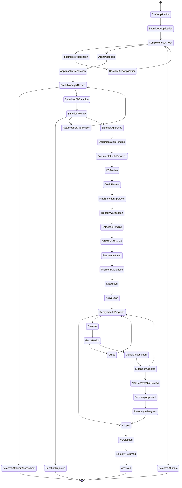

# Information Architecture: SFPCL Member Credit Administration & Loan Management System

**File:** `information-architecture.md`  
**Client:** Sahyadri Farmers Producer Company Limited (SFPCL)  
**Domain:** Member credit administration, loan sanction, documentation, disbursement, monitoring and settlement  
**Source basis:** Original SFPCL Loan Disbursement SOP, WhatsLoan summary deck, client brief, user flows and functional specification developed in the current analysis  
**Document purpose:** Define the complete information structure, navigation model, object model, page hierarchy, state model, permissions model and data findability strategy for a digital system supporting SFPCL’s member lending process.

---

## 1. Executive Summary

This Information Architecture (IA) translates the SFPCL Member Credit Administration and Loan Disbursement SOP into a structured digital product model. It defines how information should be organised, named, accessed, searched, filtered, linked, governed and retained across the full loan lifecycle.

The system must support a tightly controlled lending workflow where every loan moves through sequential gates:

1. Initial loan request.
2. Application completeness check.
3. Credit assessment.
4. Loan appraisal.
5. Sanction Committee scrutiny.
6. Approval or rejection.
7. Documentation and stamping.
8. SAP customer code creation.
9. Treasury verification.
10. Online bank disbursement.
11. Repayment tracking.
12. Interest invoicing and accrual.
13. DPD monitoring.
14. Default and recovery handling.
15. Closure, NOC, security return and archival.

The IA is designed around the following business realities:

- SFPCL lends only to eligible members.
- Borrowers may be individual farmers or Farmer Producer Companies / producer institutions.
- Loan limits depend on both shareholding and agricultural land-based scale of finance.
- The process requires strict maker-checker controls.
- Several registers must be maintained for audit readiness.
- Approvals vary by amount and exception type.
- Documentation includes PoA, Term Sheet, Loan Agreement, SH-4 / CDSL pledge, Tri-party Agreement, cancelled cheque, blank-dated cheque and checklist.
- Disbursement requires SAP customer code creation and bank transfer authorisation.
- Repayment may happen directly from the borrower or through subsidiary deduction from produce payments.
- Closure requires NOC, return of SH-4 and blank cheque, and archival for at least eight years.

The IA therefore needs to support not just a “loan application” experience, but a complete regulated operating system for member credit administration.

---

## 2. IA Goals

The information architecture must achieve the following goals.

### 2.1 Operational Goals

- Make every loan file easy to locate, understand and act upon.
- Allow each team to see only the work that is relevant to its role.
- Preserve the six-stage process structure from the SOP.
- Prevent users from bypassing mandatory gates.
- Make pending actions, blockers and missing documents visible.
- Reduce dependence on manual Excel registers and email threads.
- Enable clean handoffs between Credit, Compliance, Sanction Committee, Treasury and Accounts.

### 2.2 Compliance Goals

- Enforce lending only to eligible SFPCL members.
- Capture evidence for each statutory and internal compliance requirement.
- Maintain auditable histories for approvals, rejections, exceptions and document verification.
- Track stamp duty, notarisation, KYC, re-KYC, Section 186 limits, NBFC threshold monitoring and record retention.
- Preserve maker-checker evidence at each control point.
- Maintain registers in digital, searchable and exportable form.

### 2.3 User Experience Goals

- Make complex workflows understandable through clear page grouping and status labels.
- Provide role-based dashboards instead of a single generic landing page.
- Use consistent terminology across application, loan, borrower, member, farmer and FPC contexts.
- Show each loan’s full lifecycle from one master record.
- Allow users to drill down from summary dashboards to granular loan files, documents, approvals and ledger entries.
- Provide warnings when policy contradictions or open clarifications affect configuration.

### 2.4 Data Governance Goals

- Establish clean canonical entities for member, borrower, application, loan, document, approval, security, repayment and compliance records.
- Ensure every record has a unique identifier.
- Ensure all records have owner, status, timestamps and audit trail.
- Support retention, archival and secure access control.
- Enable future integrations with SAP, bank systems, CDSL, CKYC, SMS, email and document storage.

---

## 3. Core IA Principles

### 3.1 Lifecycle-First Structure

The system should be organised around the loan lifecycle rather than only departmental ownership. Users should be able to answer:

- Where is the loan currently?
- Who owns the next action?
- What documents or approvals are pending?
- What controls have been completed?
- What is the financial and repayment status?
- What happens next?

### 3.2 One Loan, One Master Record

Each loan must have a single canonical loan file. The file should contain or link to:

- Application.
- Borrower and nominee profile.
- Membership and shareholding data.
- Eligibility checks.
- Loan limit calculation.
- Appraisal note.
- Approval decisions.
- Exception records.
- Documents and checklist.
- Security records.
- SAP customer code.
- Disbursement record.
- Repayment ledger.
- Interest invoices and accruals.
- Monitoring records.
- Default and recovery notes.
- Closure documents.
- Communications and audit trail.

### 3.3 Registers Are Views, Not Duplicate Data

The SOP requires multiple registers. In the digital system, these should be generated as filtered views of canonical objects rather than separately re-entered lists.

For example:

- Loan Request Register = filtered application records.
- Credit Sanction Register = approval decision records.
- Exception Register = loan records with exception flags.
- Security Register = security instrument records.
- Disbursement Register = disbursement records.
- DPD Report = loan accounts with overdue metrics.
- NOC Register = closure records.

### 3.4 Role-Based Entry Points

The same underlying information should appear differently based on role.

For example:

- Credit Manager sees application quality, eligibility, appraisal, loan limit and repayment follow-up.
- Company Secretary sees document readiness, stamping, PoA, SH-4, compliance and archival.
- CFO sees approval queue, portfolio exposure, exceptions, Section 186, NBFC test and DPD MIS.
- Treasury sees SAP code creation, bank details, disbursement readiness and bank transfer status.
- Accounts sees repayment posting, interest accrual, invoicing and reconciliation.
- Auditor sees read-only registers, audit trail and supporting evidence.

### 3.5 Status Is a First-Class Information Element

Every major object should have a status. The UI should not require users to infer status from missing fields.

Examples:

- Application status.
- KYC status.
- Appraisal status.
- Sanction status.
- Documentation status.
- Stamping status.
- SAP code status.
- Disbursement status.
- Repayment status.
- Default status.
- Closure status.
- Archive status.

### 3.6 Exceptions Must Be Visible and Traceable

The system must separate routine cases from exceptions. Exceptions include:

- Requested amount above eligible limit.
- Loan above ₹5,00,000.
- Borrower is director / Sanction Committee member / relative.
- KYC incomplete.
- Signature mismatch.
- Documentation deficiency.
- Stamp duty pending.
- SAP code creation blocked.
- Bank account mismatch.
- Re-KYC overdue.
- Interest unpaid after 30 April.
- DPD beyond one year.
- Use of SH-4 or blank cheque proposed.

Each exception must capture:

- Type.
- Triggering rule.
- Date raised.
- Raised by.
- Business reason.
- Required approval authority.
- Decision.
- Decision date.
- Evidence.
- Final disposition.

---

## 4. Primary Users and Information Needs

### 4.1 Borrower / Member / Farmer / FPC

The borrower is the applicant and eventual loan account holder.

Information needs:

- Application requirements.
- Required KYC and supporting documents.
- Loan eligibility and limit.
- Application reference number.
- Approval / rejection outcome.
- Loan terms.
- Required signatures.
- Disbursement status.
- Repayment obligations.
- Interest rate changes.
- Outstanding balance.
- NOC and security return after closure.

Potential borrower-facing pages / outputs:

- Application form.
- Acknowledgment receipt.
- Deficiency / rejection note.
- Term Sheet.
- Loan Agreement copy.
- Disbursement advice.
- Repayment statement.
- Interest invoice.
- Default reminder.
- Closure NOC.

### 4.2 Deputy Manager – Finance

Primary function:

- Verify application completeness.
- Prepare Loan Appraisal Note.
- Support eligibility and document validation.

Information needs:

- New applications awaiting completeness check.
- Missing documents.
- KYC document list.
- Loan limit inputs.
- Active membership status.
- Landholding and crop plan evidence.
- Bank statement evidence.
- Draft appraisal notes.
- Two-day TAT queue.

### 4.3 Credit Manager

Primary function:

- Own loan intake, appraisal review, Loan Register, rejection notes, limit confirmation and repayment monitoring.

Information needs:

- Application pipeline.
- Loan Request Register.
- Eligibility results.
- Loan limit calculation.
- Borrower default history.
- Appraisal Note review queue.
- Rejection Note generator.
- Sanction Committee submission status.
- Loan Register updates.
- DPD buckets.
- Quarterly CFO MIS.
- Extension and non-payment notes.

### 4.4 Company Secretary

Primary function:

- Own documentation, stamping, compliance evidence, PoA, SH-4, legal documentation, registers and archives.

Information needs:

- Approved loans pending documentation.
- Document checklist status.
- Stamp duty and notarisation status.
- PoA status.
- SH-4 custody.
- CDSL pledge status.
- Blank cheque custody.
- Tri-party agreement status.
- Special cases involving directors / relatives.
- Compliance trackers.
- Grievance log.
- Archive register.
- Board approval records.

### 4.5 Compliance Team Member

Primary function:

- Prepare documents, coordinate signatures, maintain checklist and route file to CS, Credit Manager and Sanction Committee.

Information needs:

- Loan files approved for documentation.
- Document templates.
- Borrower / nominee / witness details.
- Signature mismatch flags.
- Bank Verification Letter status.
- Stamping and notarisation instructions.
- Checklist status.
- Pending signatory queue.

### 4.6 Sanction Committee

Composition:

- CFO and two Executive Directors as decided in Board Meeting.

Primary function:

- Scrutinise and approve or reject loan applications.
- Approve exceptions.
- Decide recovery action.

Information needs:

- Appraisal summary.
- Borrower profile.
- Member status.
- Shareholding and loan limit.
- Land-based limit.
- Requested and recommended amount.
- Loan purpose.
- Past borrowing and default history.
- Risk assessment.
- Documentation completeness.
- Compliance flags.
- Exception reason.
- Required authority level.
- Abstention requirement.
- Final decision recording.

### 4.7 Chief Financial Officer

Primary function:

- Member of Sanction Committee; oversee financial controls, portfolio exposure, statutory limit monitoring and policy changes.

Information needs:

- Approval queue.
- Loans above ₹5,00,000.
- Loans above eligible limit.
- Portfolio outstanding.
- Quarterly DPD MIS.
- Section 186 utilisation.
- NBFC principal business test.
- Interest income and accruals.
- Exception Register.
- Recovery action requests.
- Policy configuration changes.

### 4.8 Senior Manager – Finance

Primary function:

- Create / coordinate SAP customer codes, verify documentation before release and initiate online payment.

Information needs:

- Loans approved for SAP code creation.
- Excel template data.
- SAP customer code status.
- Final document checklist.
- Bank account details and cancelled cheque.
- Payment initiation queue.
- Disbursement completion status.
- Checklist signature requirement.

### 4.9 Chief Financial Controller

Primary function:

- Final bank transfer authorisation.

Information needs:

- Payment queue.
- Loan sanction evidence.
- Borrower bank details.
- Payment amount.
- RBL bank transfer status.
- Treasury verification confirmation.

### 4.10 Accounts Team / Accounts Head

Primary function:

- Repayment entry, interest accrual, invoices, accounting reports, DPD and reconciliation.

Information needs:

- Bank receipt data.
- Subsidiary deduction information.
- Borrower name and loan application number matching.
- Repayment allocation rules.
- Interest accrual schedule.
- Year-end interest invoices.
- Capitalisation of unpaid interest after 30 April.
- DPD report.
- Monthly and quarterly accounting reports.

### 4.11 IT Head / System Administrator

Primary function:

- Access control, integrations, audit logs, data protection and system configuration.

Information needs:

- Role configuration.
- User provisioning.
- Access logs.
- Security events.
- Data export logs.
- Retention policies.
- Integration status.
- Configuration change audit trail.

### 4.12 Internal Auditor / Statutory Auditor

Primary function:

- Verify compliance, controls, approvals, documentation and accounting evidence.

Information needs:

- Read-only access to loan files.
- Registers.
- Approval logs.
- Document checklist.
- Disbursement and repayment evidence.
- Section 186 tracker.
- NBFC test calculations.
- KYC samples.
- Archive records.
- Audit trail.

---

## 5. Global Navigation Model

The recommended primary navigation is role-sensitive but built on a common core module set.

### 5.1 Primary Navigation

```text
Home / Dashboard
Applications
Members & Borrowers
Loan Accounts
Appraisal & Sanction
Documentation & Security
Disbursement
Repayments & Accounting
Monitoring & Collections
Default & Recovery
Closure & NOC
Compliance
Registers
Reports & MIS
Masters & Configuration
Administration
Audit Trail
Help & SOP Library
```

### 5.2 Recommended Navigation by Role

| Role | Primary Landing Page | Main Navigation Emphasis |
|---|---|---|
| Deputy Manager – Finance | Application Intake Dashboard | Applications, Completeness Check, Appraisal Drafts |
| Credit Manager | Credit Operations Dashboard | Applications, Appraisal, Loan Limits, Loan Register, Monitoring |
| Compliance Team | Documentation Dashboard | Documentation, Stamping, Security, Checklist |
| Company Secretary | Compliance & Documentation Dashboard | Documentation, Compliance, Registers, Archive, Grievances |
| CFO | Executive Portfolio Dashboard | Approvals, Exceptions, MIS, Section 186, NBFC Test, DPD |
| Director / Sanction Committee | Approval Queue | Sanction Review, Exceptions, Recovery Decisions |
| Senior Manager – Finance | Disbursement Dashboard | SAP Code, Treasury Verification, Payment Initiation |
| Chief Financial Controller | Payment Authorisation Queue | Bank Authorisations, Disbursement Register |
| Accounts | Accounting Dashboard | Repayments, Interest, Accruals, Reconciliation |
| Auditor | Audit Dashboard | Registers, Loan Files, Evidence, Audit Trail |
| Admin / IT | System Admin Dashboard | Users, Roles, Config, Integrations, Logs |

---

## 6. Top-Level Sitemap

```mermaid
flowchart TD
    A[Home / Dashboard]

    A --> B[Applications]
    B --> B1[New Application]
    B --> B2[Application Queue]
    B --> B3[Incomplete Applications]
    B --> B4[Rejected Applications]
    B --> B5[Loan Request Register]

    A --> C[Members & Borrowers]
    C --> C1[Member Directory]
    C --> C2[Borrower Profile]
    C --> C3[Nominee Records]
    C --> C4[Witness Records]
    C --> C5[Shareholding & Folio]
    C --> C6[Active Member Status]

    A --> D[Loan Accounts]
    D --> D1[Loan File 360]
    D --> D2[Active Loans]
    D --> D3[Closed Loans]
    D --> D4[Overdue Loans]
    D --> D5[Loan Ledger]

    A --> E[Appraisal & Sanction]
    E --> E1[Appraisal Drafts]
    E --> E2[Loan Limit Calculator]
    E --> E3[Sanction Queue]
    E --> E4[Credit Sanction Register]
    E --> E5[Exception Register]
    E --> E6[Rejection Notes]

    A --> F[Documentation & Security]
    F --> F1[Documentation Queue]
    F --> F2[Document Checklist]
    F --> F3[Stamping & Notarisation]
    F --> F4[PoA]
    F --> F5[Term Sheet]
    F --> F6[Loan Agreement]
    F --> F7[Tri-party Agreement]
    F --> F8[SH-4 / Physical Shares]
    F --> F9[CDSL Pledge / Demat Shares]
    F --> F10[Blank Cheque Custody]
    F --> F11[Security Register]

    A --> G[Disbursement]
    G --> G1[SAP Customer Code Queue]
    G --> G2[Bank Detail Verification]
    G --> G3[Payment Initiation]
    G --> G4[Bank Authorisation]
    G --> G5[Disbursement Register]
    G --> G6[Disbursement Advice]

    A --> H[Repayments & Accounting]
    H --> H1[Repayment Receipts]
    H --> H2[Subsidiary Deductions]
    H --> H3[Repayment Allocation]
    H --> H4[Interest Accrual]
    H --> H5[Interest Invoices]
    H --> H6[Capitalised Interest]
    H --> H7[Reconciliation]

    A --> I[Monitoring & Collections]
    I --> I1[DPD Dashboard]
    I --> I2[Reminder Queue]
    I --> I3[Quarterly CFO MIS]
    I --> I4[Visit / Call Logs]
    I --> I5[Portfolio at Risk]

    A --> J[Default & Recovery]
    J --> J1[Grace Period Cases]
    J --> J2[Intentionality Assessment]
    J --> J3[Extension Notes]
    J --> J4[Non-Payment Notes]
    J --> J5[Recovery Approval Queue]
    J --> J6[SH-4 Invocation]
    J --> J7[Cheque Presentation]

    A --> K[Closure & NOC]
    K --> K1[Closure Queue]
    K --> K2[NOC Generation]
    K --> K3[Security Return]
    K --> K4[CDSL Unpledge]
    K --> K5[Archive Register]

    A --> L[Compliance]
    L --> L1[Section 186 Tracker]
    L --> L2[NBFC Principal Test]
    L --> L3[KYC / Re-KYC Tracker]
    L --> L4[Stamp Duty Register]
    L --> L5[Money-Lending Law Review]
    L --> L6[Data Protection Controls]
    L --> L7[Grievance Log]

    A --> M[Reports & MIS]
    M --> M1[Operational Reports]
    M --> M2[Financial Reports]
    M --> M3[Compliance Reports]
    M --> M4[Audit Reports]

    A --> N[Masters & Configuration]
    N --> N1[Loan Products]
    N --> N2[Share Valuation]
    N --> N3[Scale of Finance]
    N --> N4[Interest Rates]
    N --> N5[Approval Matrix]
    N --> N6[Document Templates]
    N --> N7[Compliance Rules]

    A --> O[Administration]
    O --> O1[Users]
    O --> O2[Roles & Permissions]
    O --> O3[Notifications]
    O --> O4[Integrations]
    O --> O5[Audit Logs]
```



---

## 7. Core Object Model

The following entities form the core information architecture.

### 7.1 Member

Represents an SFPCL member eligible or potentially eligible to borrow.

Key fields:

| Field | Description |
|---|---|
| Member ID | Internal unique member identifier |
| Member Type | Individual Farmer / FPC / Producer Institution |
| Folio Number | Folio number of shares held |
| Shareholder Status | Active / Inactive / Under Review |
| Membership Start Date | Date of membership |
| Services Availed | Crop production, procurement, input purchases, etc. |
| Supply History | Produce supplied to SFPCL / subsidiaries / step-down subsidiaries |
| Associated FPC | For individual members routed through producer institution |
| Subsidiary Linkage | Subsidiary company with which member transacts |
| KYC Status | Pending / Verified / Re-KYC Due / Expired |
| Default Status | No Default / Past Default / Current Default |

Relationships:

- Member has many Applications.
- Member has many Loan Accounts.
- Member has one or many Shareholding Records.
- Member has one or many KYC Records.
- Member may have one or many Nominees.

### 7.2 Borrower / Applicant

A borrower is the member applying for a loan.

Key fields:

| Field | Description |
|---|---|
| Borrower ID | Unique borrower identifier |
| Linked Member ID | Link to member master |
| Borrower Name | Individual / entity name |
| Aadhaar | Required for individual borrower where applicable |
| PAN | Required |
| Address | Residential / registered address |
| Email | Communication email |
| Mobile | SMS / call reminder number |
| Bank Account | Verified disbursement / repayment account |
| Borrower Category | Farmer / FPC / Producer Institution |
| Borrower Risk Rating | Low / Medium / High, if adopted |

### 7.3 Nominee

Nominee must be captured for loan application and several documents.

Key fields:

| Field | Description |
|---|---|
| Nominee ID | Unique nominee identifier |
| Linked Borrower ID | Borrower relationship |
| Name | Nominee name |
| Age | Must not be minor |
| Aadhaar | Nominee Aadhaar |
| PAN | Nominee PAN |
| Gender | As per application form |
| Relationship | Relationship to borrower, if captured |
| Signature Status | Required for application, PoA, Term Sheet and declaration |

Validation:

- Nominee must not be a minor.
- Nominee KYC must be collected as per SOP.

### 7.4 Witness

Witness is required for specific legal documents.

Key fields:

| Field | Description |
|---|---|
| Witness ID | Unique witness identifier |
| Name | Witness name |
| PAN | Witness PAN copy required |
| Aadhaar | Witness Aadhaar copy required |
| Existing Shareholder Flag | Must be existing SFPCL shareholder |
| Linked Document | SH-4 / Loan Agreement / other |

### 7.5 Loan Application

Represents the pre-sanction request.

Key fields:

| Field | Description |
|---|---|
| Application Number | Starts `LO00000001` and increments sequentially |
| Application Date | Date of receipt |
| Channel | Offline / Digital / Portal / Assisted Entry |
| Borrower ID | Applicant |
| Nominee ID | Nominee |
| Requested Amount | Loan amount requested |
| Purpose | Crop production / agriculture activity only |
| Folio Number | From application |
| Shares Held | Number of shares held |
| Maximum Permissible Limit | As calculated by rule engine |
| Application Status | Draft / Submitted / Incomplete / Acknowledged / Rejected / Sent to Appraisal |
| Completeness Checked By | Deputy Manager – Finance |
| Acknowledgment Date | Date reference number issued |
| Deficiency Notes | Missing information or documents |

### 7.6 KYC Record

Key fields:

| Field | Description |
|---|---|
| KYC Record ID | Unique record |
| Party Type | Borrower / Nominee / Witness / Guarantor, if applicable |
| PAN Document | File and verification status |
| Aadhaar Document | File and verification status |
| CKYC Consent | If applicable |
| Photo | If required |
| OVD Type | Officially Valid Document type |
| Verification Status | Pending / Verified / Rejected / Expired |
| Verified By | User |
| Verification Date | Date |
| Re-KYC Due Date | Every two years, as per SOP |

### 7.7 Land and Crop Evidence

Key fields:

| Field | Description |
|---|---|
| Land Record ID | Unique record |
| Borrower ID | Linked borrower |
| 7/12 Extract | Uploaded document |
| Land Area Under Cultivation | Acre value used for limit calculation |
| Crop Plan | Crop plan document |
| Crop Type | Grapes / Tomato / Citrus / Mango / Banana / Sweetcorn / Cashew / Pomegranate / Other approved agriculture crop |
| Bank Statement | Last six months statement |
| Evidence Status | Pending / Verified / Rejected |

### 7.8 Shareholding Record

Key fields:

| Field | Description |
|---|---|
| Shareholding ID | Unique record |
| Member ID | Linked member |
| Folio Number | Folio |
| Shares Held | Number of shares |
| Share Certificate Copy | Document for physical shares |
| Holding Mode | Physical / Demat |
| DP ID / Client ID | If demat |
| Valuation Version | Latest approved AGM valuation version |
| Pledge Status | Not Required / Pending / Pledged / Invoked / Released |

### 7.9 Loan Limit Calculation

Key fields:

| Field | Description |
|---|---|
| Calculation ID | Unique calculation |
| Application Number | Link to application |
| Number of Shares | Shares held |
| Valuation Per Share | As configured |
| Shareholding Percentage Applied | 30% or 10% or approved percentage; requires client resolution |
| Shareholding-Based Limit | Calculated amount |
| Per-Acre Cost of Cultivation | Current cap, e.g. ₹20,000 per acre |
| Land Area | Acres under cultivation |
| Land-Based Limit | Calculated amount |
| Final Eligible Amount | Lower of two limits |
| Requested Amount | Borrower request |
| Excess Flag | Yes if requested amount exceeds final eligible amount |
| Board Approval Reference | If percentage changed or exception approved |

Important unresolved configuration item:

- SOP contains a contradiction between 30% of valuation per share, 10% of share value and current ₹200 per share. The IA must keep this value configurable and versioned until client confirms final rule.

### 7.10 Loan Appraisal Note

Key fields:

| Field | Description |
|---|---|
| Appraisal ID | Unique note |
| Application Number | Linked application |
| Prepared By | Deputy Manager – Finance |
| Reviewed By | Credit Manager |
| Preparation Due Date | Application receipt + 2 days |
| Eligibility Summary | Active member, no default, documents complete, purpose valid |
| Loan Limit Summary | Share-based and land-based limit |
| Repayment Capacity | Based on bank statement, crop plan, land / produce data |
| Past Borrowing History | Existing or previous loans |
| Risk Assessment | Market, operational and borrower-specific risks |
| Recommended Amount | Credit recommendation |
| Recommended Tenure | Short-term / long-term |
| Recommended Security | SH-4 / CDSL pledge / cheque / tri-party agreement |
| Appraisal Status | Draft / Under Review / Submitted to Sanction / Returned / Rejected |

### 7.11 Sanction Decision

Key fields:

| Field | Description |
|---|---|
| Sanction ID | Unique decision record |
| Application Number | Linked application |
| Loan Amount | Approved / rejected amount |
| Approval Level | CFO + 1 Director / CFO + 2 Directors / General Meeting |
| Decision | Approved / Rejected / Returned for Clarification / Conditional Approval |
| Reasons | Mandatory for approval and rejection |
| CFO Decision | Approve / Reject / Abstain |
| Director 1 Decision | Approve / Reject / Abstain |
| Director 2 Decision | Approve / Reject / Abstain |
| Special Case Flag | Director / relative / sanction member borrower |
| General Meeting Approval Reference | Required for special cases |
| Credit Sanction Register Entry | Link |
| Decision Date | Date |

### 7.12 Exception Record

Key fields:

| Field | Description |
|---|---|
| Exception ID | Unique record |
| Exception Type | Limit breach / approval level / KYC / documentation / signature mismatch / SAP / disbursement / default / policy contradiction |
| Linked Loan / Application | Reference |
| Raised By | User |
| Raised Date | Date |
| Business Reason | Explanation |
| Required Authority | CFO / CFO + Directors / Board / General Meeting |
| Decision | Approved / Rejected / Pending |
| Approver Comments | Mandatory |
| Evidence | File / note |
| Closure Status | Open / Closed |

### 7.13 Loan Account

Represents the sanctioned and disbursed loan.

Key fields:

| Field | Description |
|---|---|
| Loan Account ID | Unique loan account number |
| Application Number | Source application |
| Borrower ID | Borrower |
| Sanction Amount | Approved amount |
| Disbursed Amount | Actual amount transferred |
| Loan Type | Short-term / Long-term |
| Tenure | From disbursement date to repayment date |
| Interest Rate Type | Floating |
| Current Interest Rate | Configured benchmark / rate |
| Penal Interest | As configured in Term Sheet |
| Repayment Date | As per Term Sheet |
| Security Summary | SH-4 / CDSL pledge / PoA / cheque / tri-party |
| Loan Status | Sanctioned / Documentation Pending / Disbursement Pending / Active / Overdue / Default / Closed / Archived |
| Outstanding Principal | Current balance |
| Accrued Interest | Current accrued interest |
| DPD Bucket | Current DPD classification |

### 7.14 Document Record

Documents should be managed as structured objects, not just file uploads.

Key fields:

| Field | Description |
|---|---|
| Document ID | Unique document record |
| Document Type | Application / PAN / Aadhaar / 7/12 / Crop Plan / Bank Statement / PoA / Term Sheet / Loan Agreement / SH-4 / Tri-party / Checklist / NOC / etc. |
| Linked Entity | Borrower / Application / Loan / Security / Closure |
| Required Flag | Mandatory / Conditional / Optional |
| Applicability Rule | Physical shares / demat shares / signature mismatch / etc. |
| Status | Not Started / Pending Upload / Uploaded / Verified / Rejected / Signed / Stamped / Notarised / Returned |
| Uploaded By | User |
| Verified By | User |
| Version | Version number |
| Expiry / Re-KYC Date | If applicable |
| Storage Location | DMS / physical custody reference |
| Confidentiality Level | Public / Internal / Restricted / Highly Restricted |

### 7.15 Document Checklist

The checklist is both an index and a control gate.

Key fields:

| Field | Description |
|---|---|
| Checklist ID | Unique checklist |
| Loan Account ID | Linked loan |
| Checklist Status | Draft / In Progress / CS Approved / Credit Approved / Sanction Approved / Treasury Signed / Complete |
| CS Signature | Document verification confirmation |
| Credit Manager Signature | Loan limit confirmation |
| Sanction Committee Signature | Final disbursement approval |
| Senior Manager – Finance Signature | Actual disbursement completed |
| Missing Items | Auto-generated |
| Blocker Flag | Prevents disbursement if mandatory item missing |

### 7.16 Security Instrument

Security instruments include SH-4, CDSL pledge, PoA, blank cheque and tri-party deduction arrangement.

Key fields:

| Field | Description |
|---|---|
| Security ID | Unique security record |
| Security Type | PoA / SH-4 / CDSL Pledge / Blank-Dated Cheque / Tri-party Agreement |
| Loan Account ID | Linked loan |
| Status | Pending / Executed / Held in Custody / Pledged / Invoked / Released / Returned |
| Execution Date | Date |
| Custodian | Company Secretary / Compliance / Treasury |
| Stamp Duty Status | If applicable |
| Notarisation Status | If applicable |
| Invocation Approval Required | Yes / No |
| Invocation Status | Not Initiated / Proposed / Approved / Invoked / Completed |
| Return Date | Closure date |

### 7.17 SAP Customer Code Request

Key fields:

| Field | Description |
|---|---|
| SAP Request ID | Unique request |
| Loan Account ID | Linked loan |
| Farmer Name | As sent to SAP |
| Aadhaar | As sent to SAP |
| PAN | As sent to SAP |
| Address | As sent to SAP |
| Email | As sent to SAP |
| Loan Application Number | Required |
| Request Sent By | Credit Manager |
| Request Received By | Senior Manager – Finance |
| SAP Customer Code | Generated SAP ID |
| Status | Not Required / Pending / Created / Failed / Rework Required |
| Confirmation Email Date | Date |

### 7.18 Disbursement Record

Key fields:

| Field | Description |
|---|---|
| Disbursement ID | Unique record |
| Loan Account ID | Linked loan |
| Borrower Bank Account | Verified account |
| IFSC | Bank IFSC |
| Bank Branch | Branch |
| Disbursement Amount | Amount transferred |
| Source Bank | RBL Bank account |
| Initiated By | Senior Manager – Finance |
| Authorised By | Chief Financial Controller |
| Initiation Date | Date |
| Authorisation Date | Date |
| UTR / Transaction Reference | Bank reference |
| Status | Pending Verification / Initiated / Authorised / Failed / Completed |
| Disbursement Advice Sent | Yes / No |

### 7.19 Repayment Record

Key fields:

| Field | Description |
|---|---|
| Repayment ID | Unique record |
| Loan Account ID | Linked loan |
| Receipt Date | Date received |
| Payment Channel | Direct RTGS / Direct NEFT / Subsidiary Deduction / Other |
| Subsidiary Name | If routed through subsidiary |
| Amount | Receipt amount |
| Principal Allocation | Principal-first allocation |
| Interest Allocation | Interest allocation |
| Other Charges Allocation | If applicable |
| Bank Reference | UTR / statement reference |
| SAP Entry Status | Pending / Posted / Failed |
| Posted By | Accounts / Credit Manager as defined |
| Posting Date | Next working day target for direct repayment |

### 7.20 Interest Invoice and Accrual

Key fields:

| Field | Description |
|---|---|
| Interest Record ID | Unique record |
| Loan Account ID | Linked loan |
| Period | Month / year |
| Interest Rate | Floating rate applicable |
| Accrual Amount | Monthly accrual |
| Invoice Amount | Year-end invoice |
| Invoice Date | Date |
| Due Date | 30 April rule relevance |
| Unpaid Interest | Amount unpaid |
| Capitalised Flag | Whether added to principal |
| Revised Principal | Principal after capitalisation |
| Borrower Intimation Sent | Email / hard copy |

### 7.21 DPD / Monitoring Record

Key fields:

| Field | Description |
|---|---|
| Monitoring ID | Unique record |
| Loan Account ID | Linked loan |
| Scheduled Due Date | Repayment due date |
| Days Past Due | Calculated |
| SOP Bucket | 1–2 years / 2–3 years / 3+ years |
| Standard Delinquency Bucket | 0–30 / 31–60 / 61–90 / >90, if adopted |
| Reminder Status | Not Sent / Sent / Follow-Up Required |
| CFO MIS Quarter | Quarter reported |
| Collection Notes | Call / SMS / visit logs |

### 7.22 Default Case

Key fields:

| Field | Description |
|---|---|
| Default Case ID | Unique case |
| Loan Account ID | Linked loan |
| Trigger | Missed scheduled principal repayment |
| Grace Period Start | Due date |
| Grace Period End | Due date + 3 months |
| Payment Status After Grace | Paid / Unpaid / Partial |
| Intentionality Assessment | Intentional / Non-Intentional / Undetermined |
| Assessment Note | Reason analysis |
| Extension Granted | Yes / No |
| Extension End Date | One-year extension end date |
| Extension Note | Documented note |
| Non-Payment Note | Required if still unpaid |
| Sanction Committee Decision | Recovery action / further extension / write-off policy / other |
| Recovery Action | SH-4 / CDSL pledge / blank cheque / legal / other |

### 7.23 Closure and NOC Record

Key fields:

| Field | Description |
|---|---|
| Closure ID | Unique record |
| Loan Account ID | Linked loan |
| Full Repayment Date | Date principal, interest and dues cleared |
| NOC Generated | Yes / No |
| NOC Date | Date |
| SH-4 Returned | Yes / No / Not Applicable |
| Blank Cheque Returned | Yes / No |
| CDSL Unpledged | Yes / No / Not Applicable |
| Security Return Acknowledgment | Borrower acknowledgment |
| Archive Date | Date archived |
| Retention End Date | Archive date + at least 8 years |

### 7.24 Grievance Record

Key fields:

| Field | Description |
|---|---|
| Grievance ID | Unique complaint |
| Borrower ID | Linked borrower |
| Loan Account ID | If loan-specific |
| Issue Category | Application / Disbursement / Repayment / Recovery / NOC / Data / Other |
| Description | Complaint details |
| Date Received | Date |
| Assigned To | Owner |
| Resolution TAT | Target |
| Status | Open / Under Review / Resolved / Escalated / Closed |
| Resolution Summary | Final action |

---

## 8. Lifecycle State Architecture

### 8.1 Application-to-Closure State Model



### 8.2 Application Status Values

| Status | Meaning | Owner |
|---|---|---|
| Draft | Application captured but not submitted | Borrower / Field / Credit |
| Submitted | Application received | Credit Assessment Team |
| Completeness Check | Deputy Manager – Finance validating details | Deputy Manager – Finance |
| Incomplete | Missing required information or documents | Deputy Manager – Finance / Credit Manager |
| Acknowledged | Complete and reference number issued | Deputy Manager – Finance |
| Appraisal In Preparation | Appraisal Note being prepared | Deputy Manager – Finance |
| Credit Review | Credit Manager reviewing appraisal | Credit Manager |
| Submitted to Sanction | Ready for Sanction Committee | Credit Manager |
| Rejected | Rejection Note issued | Credit Manager / Sanction Committee |

### 8.3 Sanction Status Values

| Status | Meaning |
|---|---|
| Pending Review | Awaiting Sanction Committee action |
| Under Clarification | Sent back to Credit Assessment Team |
| Approved | Loan sanctioned |
| Conditionally Approved | Approved subject to conditions |
| Rejected | Loan rejected |
| Abstention Required | Special case where applicant / related party must not approve |
| General Meeting Approval Required | Director / relative special case |

### 8.4 Documentation Status Values

| Status | Meaning |
|---|---|
| Not Started | Sanction approved but documentation not begun |
| In Progress | Compliance Team preparing documents |
| Pending Borrower Signature | Awaiting borrower / nominee / witness signatures |
| Pending Stamp | Stamp paper / e-stamp pending |
| Pending Notarisation | Notarisation pending |
| Pending CS Review | Company Secretary review pending |
| Pending Credit Review | Credit Manager review pending |
| Pending Final Approval | Final Sanction Committee review pending |
| Complete | Documentation gate complete |

### 8.5 Security Status Values

| Security Type | Status Values |
|---|---|
| PoA | Drafted / Signed / Stamped / Notarised / Active / Revoked / Archived |
| SH-4 | Not Applicable / Pending / Signed / Held in Custody / Invoked / Returned |
| CDSL Pledge | Not Applicable / PRF Pending / PSN Generated / Pledge Accepted / Pledged / Invoked / Unpledged |
| Blank-Dated Cheque | Pending / Received / Held in Custody / Presented / Returned |
| Tri-party Agreement | Drafted / Signed / Active / Terminated / Archived |

### 8.6 Disbursement Status Values

| Status | Meaning |
|---|---|
| Pending Documentation | Cannot proceed until checklist complete |
| Pending SAP Code | Customer code not created |
| SAP Code Created | SAP customer code confirmed |
| Pending Bank Verification | Bank details under check |
| Ready for Payment | All pre-disbursement gates complete |
| Payment Initiated | Senior Manager – Finance initiated online transfer |
| Pending CFC Approval | Awaiting Chief Financial Controller authorisation |
| Completed | Bank transfer executed and advice sent |
| Failed | Transfer failed; reason required |

### 8.7 Repayment and Default Status Values

| Status | Meaning |
|---|---|
| Current | No overdue scheduled amount |
| Partially Paid | Partial repayment received |
| Overdue | Scheduled repayment missed |
| In Grace Period | Three-month grace period active |
| Under Default Assessment | Intentionality assessment underway |
| Extension Granted | One-year extension granted for non-intentional default |
| Non-Recoverable Review | Extension failed; note for non-payment required |
| Recovery Approved | Sanction Committee approved recovery action |
| Recovery In Progress | SH-4 / cheque / pledge / other action underway |
| Closed | Full repayment / recovery completed |

---

## 9. Page-Level Information Architecture

## 9.1 Home / Dashboard

### Purpose

Provide the user with an immediate view of pending actions, risk indicators and portfolio status based on role.

### Common Components

- Welcome header with role.
- Pending tasks.
- Loans by stage.
- Exceptions requiring attention.
- TAT breaches.
- Overdue / DPD summary.
- Compliance alerts.
- Quick links.
- Recent activity.

### Role-Specific Dashboard Cards

| Role | Cards |
|---|---|
| Credit Manager | New applications, incomplete applications, appraisals due within 2 days, sanction submissions pending, DPD reminders, rejected / re-apply cases |
| Compliance | Documentation pending, stamping pending, signature mismatch, PoA pending, SH-4 pending, CDSL pledge pending, checklist incomplete |
| CFO | Approval queue, exceptions, loans above ₹5 lakh, portfolio outstanding, DPD summary, Section 186 utilisation, NBFC ratio, recovery decisions |
| Treasury | SAP code pending, bank details pending, disbursements ready, payments awaiting CFC approval, failed transfers |
| Accounts | Repayments pending posting, interest invoices pending, accruals pending, reconciliation breaks, capitalisation due after 30 April |
| CS | Compliance calendar, Board approvals required, document custody, grievance open cases, archival due |

---

## 9.2 Applications Module

### Main Pages

```text
Applications
├── New Application
├── Application Queue
├── Completeness Check
├── Incomplete Applications
├── Appraisal Ready
├── Rejected Applications
└── Loan Request Register
```

### New Application Page

Sections:

1. Applicant identification.
2. Member / folio lookup.
3. Shareholding details.
4. Requested loan amount.
5. Loan purpose.
6. Nominee details.
7. KYC upload.
8. Land and crop evidence.
9. Bank statement upload.
10. Declarations and consents.
11. Submit / Save Draft.

Required field groups:

| Field Group | Fields |
|---|---|
| Member Details | Member ID, name, member type, folio number, active status |
| Shareholding | Number of shares, holding mode, share certificates / demat details |
| Loan Request | Amount requested, purpose, loan type, expected tenure |
| Nominee | Name, age, Aadhaar, PAN, gender, relationship |
| KYC | Borrower PAN, Aadhaar, nominee PAN, nominee Aadhaar |
| Agriculture Evidence | 7/12 extract, land area, crop plan, crop type |
| Financial Evidence | Six-month bank statement, bank account details |

Validation rules:

- Borrower must be an SFPCL member.
- Loan purpose must be agriculture / crop production.
- Nominee must not be minor.
- Required KYC documents must be uploaded.
- Land area must be present for land-based limit calculation.
- Bank statement must cover past six months.

### Application Queue

Default columns:

| Column | Purpose |
|---|---|
| Application Number | Primary identifier |
| Applicant Name | Borrower |
| Member Type | Individual / FPC |
| Requested Amount | Requested loan amount |
| Application Date | TAT start |
| Current Status | Workflow stage |
| Pending With | Current owner |
| TAT Remaining / Breached | Operational urgency |
| Completeness Status | Complete / incomplete |
| Exception Flag | Yes / No |

Filters:

- Status.
- Member type.
- Application date.
- Pending owner.
- TAT breached.
- KYC pending.
- Document missing.
- Loan amount range.
- Purpose.
- FPC / subsidiary linkage.

### Loan Request Register

This should be a system-generated register with export support.

Fields:

- Application number.
- Date received.
- Borrower name.
- Member ID.
- Folio number.
- Shares held.
- Requested amount.
- Maximum permissible amount.
- Application channel.
- Completeness status.
- Appraisal status.
- Sanction status.
- Rejection reason, if any.
- Current owner.
- Last updated date.

---

## 9.3 Members & Borrowers Module

### Main Pages

```text
Members & Borrowers
├── Member Directory
├── Member Profile
├── Borrower 360
├── Nominee Records
├── Witness Records
├── Shareholding Records
├── Active Member Status
└── KYC / Re-KYC Records
```

### Member Directory

Purpose:

- Serve as the authoritative list of SFPCL members and their eligibility context.

Default columns:

- Member ID.
- Member name.
- Member type.
- Folio number.
- Shares held.
- Active / inactive status.
- Produce supply years.
- Services availed.
- KYC status.
- Current loan exposure.
- Default status.

Filters:

- Active / inactive.
- Individual / FPC.
- Crop type.
- Subsidiary linkage.
- KYC status.
- Shareholding range.
- Has active loan.
- Has overdue loan.

### Member Profile Tabs

```text
Overview
Membership & Eligibility
Shareholding
KYC & Documents
Applications
Loan Accounts
Produce Supply History
Subsidiary Transactions
Nominees
Communications
Audit Trail
```

### Borrower 360

Purpose:

- Give a complete operational view of a borrower across all loan applications and loans.

Key cards:

- Member status.
- Current exposure.
- Eligible limit.
- Active loans.
- Overdue amount.
- KYC status.
- Re-KYC due date.
- Security held.
- Subsidiary repayment arrangement.

---

## 9.4 Loan Account 360

The Loan Account 360 page is the central page of the system.

### Header

The header should show:

- Loan Account ID.
- Application Number.
- Borrower name.
- Member type.
- Sanction amount.
- Disbursed amount.
- Outstanding principal.
- Accrued interest.
- Current status.
- DPD status.
- Current owner.
- Critical alerts.

### Recommended Tabs

```text
Overview
Applicant & Member
Eligibility & Loan Limit
Appraisal
Sanction & Approvals
Documents & Checklist
Security
SAP & Disbursement
Repayment Ledger
Interest & Invoices
Monitoring & DPD
Default & Recovery
Closure & NOC
Communications
Audit Trail
```

### Tab Details

#### Overview Tab

Contains:

- Lifecycle progress bar.
- Current status.
- Next action.
- Pending owner.
- Key dates.
- Financial summary.
- Approval summary.
- Document status summary.
- Security status summary.
- Exception summary.

#### Applicant & Member Tab

Contains:

- Borrower identity.
- Member ID and folio.
- Member type.
- Active member qualification.
- Nominee details.
- Witness details.
- Contact details.
- Bank details.

#### Eligibility & Loan Limit Tab

Contains:

- Active membership checks.
- Default checks.
- KYC checklist.
- Purpose validation.
- Shareholding-based limit calculation.
- Land-based limit calculation.
- Final eligible amount.
- Requested amount vs eligible amount.
- Exception flag.
- Rule version used.

#### Appraisal Tab

Contains:

- Appraisal Note.
- Prepared by.
- Reviewed by.
- TAT status.
- Repayment capacity.
- Risk assessment.
- Past borrowing history.
- Recommended amount.
- Recommendation comments.

#### Sanction & Approvals Tab

Contains:

- Approval matrix applied.
- Approver list.
- Approval / rejection decisions.
- Reasons.
- Date and timestamp.
- Special case handling.
- General meeting approval reference, if required.
- Credit Sanction Register entry.
- Exception Register entry.

#### Documents & Checklist Tab

Contains:

- Required document list.
- Document upload / verification status.
- Stamping status.
- Notarisation status.
- Signature status.
- Checklist signatures.
- Missing document blockers.

#### Security Tab

Contains:

- PoA.
- SH-4.
- CDSL pledge.
- Blank-dated cheque.
- Tri-party agreement.
- Security custody.
- Invocation restrictions.
- Release / return status.

#### SAP & Disbursement Tab

Contains:

- SAP customer code request.
- SAP customer code confirmation.
- Bank account verification.
- Payment initiation.
- CFC authorisation.
- UTR / transaction reference.
- Disbursement advice.

#### Repayment Ledger Tab

Contains:

- Schedule.
- Receipts.
- Principal allocation.
- Interest allocation.
- Other charges allocation.
- Outstanding balances.
- SAP posting status.
- Bank reference.

#### Interest & Invoices Tab

Contains:

- Floating interest rate history.
- Monthly accruals.
- Yearly interest invoices.
- Unpaid interest.
- Capitalisation after 30 April.
- Revised principal.
- Borrower intimation.

#### Monitoring & DPD Tab

Contains:

- Due dates.
- DPD calculation.
- SOP bucket.
- Reminder logs.
- Quarterly CFO MIS inclusion.
- Portfolio at risk status.

#### Default & Recovery Tab

Contains:

- Missed repayment event.
- Three-month grace period.
- Intentionality assessment.
- One-year extension note.
- Non-payment note.
- Sanction Committee recovery decision.
- Recovery action tracking.

#### Closure & NOC Tab

Contains:

- Full repayment confirmation.
- NOC generation.
- SH-4 return.
- Blank cheque return.
- CDSL unpledge.
- Borrower acknowledgment.
- Archive date.
- Retention end date.

#### Communications Tab

Contains:

- Emails.
- SMS.
- Phone call logs.
- Courier records.
- Hard copy letters.
- Disbursement advice.
- Reminder history.

#### Audit Trail Tab

Contains:

- Created by / date.
- Field changes.
- Document uploads.
- Approvals.
- Rejections.
- Downloads / exports.
- Access logs.

---

## 9.5 Appraisal & Sanction Module

### Main Pages

```text
Appraisal & Sanction
├── Appraisal Queue
├── Appraisal Note Builder
├── Loan Limit Calculator
├── Sanction Committee Queue
├── Approval Detail Page
├── Credit Sanction Register
├── Rejection Notes
└── Exception Register
```

### Appraisal Queue

Columns:

- Application number.
- Borrower name.
- Requested amount.
- Final eligible amount.
- Completeness status.
- TAT due date.
- Prepared by.
- Review status.
- Risk rating.
- Current owner.

### Loan Limit Calculator

Inputs:

- Number of shares.
- Valuation per share.
- Percentage applied.
- Per-acre cost of cultivation.
- Land area under cultivation.

Outputs:

- Shareholding-based limit.
- Land-based limit.
- Lower eligible limit.
- Excess requested amount.
- Required exception approval.

Configuration warning:

- System must show the rule version and percentage used because the SOP currently contains unresolved references to 30%, 10% and ₹200 per share.

### Sanction Committee Queue

Columns:

- Application number.
- Borrower.
- Loan amount.
- Approval level required.
- Exception flag.
- Special case flag.
- Appraisal recommendation.
- Submitted date.
- Pending approvers.
- SLA / pending days.

Decision options:

- Approve.
- Reject.
- Return for clarification.
- Approve with conditions.
- Abstain, if conflicted.

Mandatory decision data:

- Decision reason.
- Comments.
- Timestamp.
- Approver identity.
- Register entry update.

---

## 9.6 Documentation & Security Module

### Main Pages

```text
Documentation & Security
├── Documentation Queue
├── Document Checklist
├── Document Generation
├── Signature Tracking
├── Stamping & Notarisation
├── PoA Register
├── Term Sheet Register
├── Loan Agreement Register
├── Tri-party Agreement Register
├── SH-4 Register
├── CDSL Pledge Tracker
├── Blank Cheque Custody Register
└── Security Register
```

### Documentation Queue

Columns:

- Loan / application number.
- Borrower name.
- Documentation stage.
- Required documents complete.
- Pending signature.
- Pending stamp.
- Pending notarisation.
- Pending CS review.
- Pending Sanction Committee final approval.

### Document Checklist Page

Checklist sections:

1. Borrower KYC.
2. Nominee KYC.
3. Witness KYC.
4. Application form.
5. Appraisal note.
6. Sanction approval.
7. PoA.
8. Tri-party Agreement.
9. SH-4 or CDSL pledge.
10. Term Sheet.
11. Loan Agreement.
12. Bank Verification Letter / signature declaration, if applicable.
13. Cancelled cheque.
14. Blank-dated cheque.
15. SAP code confirmation.
16. Disbursement evidence.
17. Final checklist signatures.

### Document Generation Page

Template-driven documents:

- Loan Application Form.
- Loan Appraisal Note.
- PoA.
- Declaration / Tri-party Agreement.
- SH-4 support record.
- Term Sheet.
- Loan Agreement.
- Bank Verification Letter.
- Checklist.
- Rejection Note.
- NOC.

Template variables:

- Borrower details.
- Nominee details.
- Witness details.
- Share details.
- Loan amount.
- Purpose.
- Interest rate.
- Tenure.
- Repayment date.
- Penalty interest.
- Security.
- Dispute resolution.
- Approval reference.

### Security Register

Fields:

- Security ID.
- Loan Account ID.
- Borrower name.
- Security type.
- Execution status.
- Custodian.
- Invocation status.
- Release status.
- Return date.
- Linked document.

---

## 9.7 Disbursement Module

### Main Pages

```text
Disbursement
├── Disbursement Readiness Queue
├── SAP Customer Code Queue
├── Bank Detail Verification
├── Payment Initiation
├── Bank Authorisation Queue
├── Disbursement Register
└── Disbursement Advice
```

### Disbursement Readiness Queue

A loan appears here only after:

- Sanction approval is complete.
- Documentation checklist is complete.
- Company Secretary has signed checklist.
- Credit Manager has signed checklist.
- Sanction Committee final approval is captured.
- Required Term Sheet signatures are complete.
- Security documents are executed.
- Bank details are verified.

### SAP Customer Code Queue

Fields:

- Loan application number.
- Farmer full name.
- Aadhaar.
- PAN.
- Address.
- Email.
- Request sent date.
- SAP customer code.
- Confirmation status.

### Payment Initiation Page

Required data:

- Borrower bank account.
- IFSC.
- Branch.
- Disbursement amount.
- Loan account ID.
- SAP customer code.
- Approved sanction amount.
- Checklist completion confirmation.

Actions:

- Initiate payment.
- Send to CFC for authorisation.
- Mark failed with reason.
- Record UTR after completion.
- Send disbursement advice.

---

## 9.8 Repayments & Accounting Module

### Main Pages

```text
Repayments & Accounting
├── Repayment Dashboard
├── Direct Repayments
├── Subsidiary Deduction Receipts
├── Repayment Allocation
├── SAP Posting Queue
├── Interest Accruals
├── Interest Invoices
├── Interest Capitalisation
└── Bank Reconciliation
```

### Repayment Dashboard

Cards:

- Receipts awaiting matching.
- Repayments awaiting SAP posting.
- Principal collected this period.
- Interest collected this period.
- Unpaid interest.
- Capitalisation due.
- Reconciliation breaks.

### Repayment Allocation Rule

The SOP requires partial repayment to be adjusted first against principal before interest recovery.

Allocation display:

| Component | Amount |
|---|---:|
| Receipt amount | ₹X |
| Principal allocation | ₹Y |
| Interest allocation | ₹Z |
| Other dues | ₹A |
| Remaining outstanding principal | ₹B |
| Remaining outstanding interest | ₹C |

### Subsidiary Deduction Receipts

Required matching data:

- Borrower name.
- Loan application number.
- Subsidiary company.
- Deducted amount.
- Payment reference.
- Bank statement line.
- SAP posting status.

### Interest Capitalisation

Trigger:

- Farmer cannot pay interest up to 30 April of the next financial year.

System action:

- Mark interest unpaid.
- Add unpaid interest to principal at start of next financial year.
- Recalculate interest on revised principal.
- Generate borrower intimation by email and hard copy.

---

## 9.9 Monitoring & Collections Module

### Main Pages

```text
Monitoring & Collections
├── Portfolio Monitoring Dashboard
├── DPD Buckets
├── Reminder Queue
├── Quarterly CFO MIS
├── Call / SMS / Visit Logs
└── Portfolio at Risk
```

### DPD Buckets

The SOP includes buckets:

- 1 year to 2 years.
- 2 years to 3 years.
- More than 3 years.

The glossary also refers to delinquency buckets such as:

- 0–30 days.
- 31–60 days.
- 61–90 days.
- More than 90 days.

Recommended IA approach:

- Maintain both standard DPD buckets and SOP-specific long overdue buckets.
- Use standard DPD for operational collection visibility.
- Use SOP buckets for quarterly CFO reporting if required.

### Reminder Queue

Trigger:

- Loan remains outstanding beyond one year at end of each quarter.

Channels:

- SMS.
- Phone call.
- Email, if configured.

Required log fields:

- Reminder date.
- Channel.
- Message type.
- Sent by.
- Response received.
- Follow-up date.

---

## 9.10 Default & Recovery Module

### Main Pages

```text
Default & Recovery
├── Missed Repayment Cases
├── Grace Period Tracker
├── Default Assessment
├── Extension Note Builder
├── Non-Payment Note Builder
├── Recovery Decision Queue
├── SH-4 Invocation Tracker
├── CDSL Pledge Invocation Tracker
├── Blank Cheque Presentation Tracker
└── Recovery Log
```

### Default Handling Flow

1. Scheduled principal repayment missed.
2. Three-month grace period granted.
3. If unpaid after grace, Credit Assessment Team assesses reason.
4. Assessment determines intentional or non-intentional non-payment.
5. If non-intentional, one-year extension may be granted.
6. Credit Manager prepares extension note.
7. If still unpaid after one-year extension, loan moves to non-recoverable review.
8. Credit Assessment Team prepares Note for Non-Payment.
9. Sanction Committee decides whether to initiate share sale, invoke pledge or present blank cheque.

### Recovery Decision Requirements

Before any recovery action, the system should require:

- Note for Non-Payment.
- Borrower repayment history.
- Security details.
- Amount outstanding.
- Intentionality assessment.
- Sanction Committee approval.
- Board approval if policy requires it.
- Recovery action selected.
- Fair-practice log.

---

## 9.11 Closure & NOC Module

### Main Pages

```text
Closure & NOC
├── Closure Eligibility Queue
├── NOC Generator
├── Security Return Tracker
├── CDSL Unpledge Tracker
├── Borrower Acknowledgment
├── Closed Loan Register
└── Archive Register
```

### Closure Preconditions

A loan can move to closure only when:

- Principal is fully repaid.
- Interest is fully paid or adjusted.
- Other dues are fully cleared.
- SAP loan balance is zero.
- Security return checklist is ready.

### Closure Actions

- Generate NOC.
- Return SH-4 copy where applicable.
- Return blank-dated cheque.
- Process CDSL unpledge where applicable.
- Capture borrower acknowledgment.
- Archive loan documents for at least eight years.

---

## 9.12 Compliance Module

### Main Pages

```text
Compliance
├── Compliance Dashboard
├── Producer Company Lending Controls
├── Section 186 Tracker
├── NBFC Principal Business Test
├── KYC / Re-KYC Tracker
├── Interest Disclosure Tracker
├── Stamp Duty Register
├── Money-Lending Law Review
├── Accounting & Reporting Controls
├── Recovery Conduct Controls
├── Data Protection Controls
├── Record Retention Tracker
└── Grievance Log
```

### Compliance Dashboard Cards

- Loans to non-members: should always be zero.
- Loans above eligible limits.
- Section 186 utilisation.
- NBFC ratio status.
- KYC pending / overdue.
- Re-KYC due.
- Documents unstamped.
- NOC pending after full repayment.
- Open grievances.
- Loans missing audit evidence.

### Section 186 Tracker

Fields:

- Paid-up capital.
- Free reserves.
- Securities premium.
- 60% threshold.
- 100% threshold.
- Higher of both.
- Current loans / guarantees / investments exposure.
- Available headroom.
- Special resolution required flag.
- Board note reference.

### NBFC Principal Business Test

Fields:

- Total assets.
- Financial assets.
- Financial assets percentage.
- Gross income.
- Financial income.
- Financial income percentage.
- 50% threshold status.
- Quarter.
- Prepared by.
- Reviewed by CFO.
- Board presentation reference.

### KYC / Re-KYC Tracker

Fields:

- Borrower / nominee / witness.
- KYC status.
- Date verified.
- Re-KYC due date.
- Days overdue.
- Risk category.
- Missing documents.

### Stamp Duty Register

Fields:

- Loan account.
- Document type.
- Stamp amount.
- Stamp paper / e-stamp number.
- Execution date.
- Notarisation date.
- Verified by CS.

### Grievance Log

Fields:

- Grievance ID.
- Borrower.
- Loan account.
- Category.
- Date received.
- Owner.
- Status.
- Resolution date.
- TAT.

---

## 10. Registers Architecture

Registers should be generated from underlying workflow data and exportable to Excel / PDF.

| Register | Source Object | Primary Owner | Key Purpose |
|---|---|---|---|
| Loan Request Register | Loan Application | Credit Manager | Track all applications and reference numbers |
| Credit Sanction Register | Sanction Decision | Sanction Committee / CFO | Record approval / rejection decisions |
| Exception Register | Exception Record | CFO / CS | Track deviations and approvals |
| Document Checklist Register | Document Checklist | Compliance / CS | Track documentation readiness |
| Security Register | Security Instrument | CS | Track PoA, SH-4, pledge, cheque and tri-party security |
| SAP Customer Code Tracker | SAP Request | Senior Manager – Finance | Track SAP profile creation |
| Disbursement Register | Disbursement Record | Treasury | Track loan payments |
| Repayment Ledger | Repayment Record | Accounts | Track receipts and allocations |
| Interest Invoice Register | Interest Invoice | Accounts / Sales Team | Track yearly interest invoices |
| DPD Report | Monitoring Record | Credit Manager | Track overdue loans |
| Recovery Log | Default Case / Recovery Action | Credit / CS | Track recovery actions |
| NOC Register | Closure Record | Compliance / CS | Track closure certificates |
| Archive Register | Closure / Archive Record | CS | Track eight-year retention |
| Grievance Log | Grievance Record | CS | Track complaints and resolution |
| Section 186 Tracker | Compliance Record | CFO | Monitor statutory lending limits |
| NBFC Test Tracker | Compliance Record | CFO | Monitor RBI principal business test |
| KYC / Re-KYC Register | KYC Record | Credit Head | Track KYC compliance |
| Stamp Duty Register | Document Record | CS | Track stamp duty compliance |

---

## 11. Search, Filter and Findability Architecture

### 11.1 Global Search

Global search should allow lookup by:

- Application number.
- Loan account number.
- Borrower name.
- Member ID.
- Folio number.
- Aadhaar last four digits, subject to privacy rules.
- PAN.
- SAP customer code.
- UTR / bank transaction reference.
- Document ID.
- Security ID.
- Grievance ID.

### 11.2 Search Result Grouping

Results should be grouped by object type:

```text
Applications
Members
Loan Accounts
Documents
Approvals
Disbursements
Repayments
Compliance Records
Grievances
```

### 11.3 Universal Filters

Across tables, the system should support:

- Status.
- Date range.
- Owner / pending with.
- Member type.
- Loan amount range.
- Branch / location, if applicable.
- Crop type.
- Subsidiary linkage.
- Exception flag.
- TAT breached.
- KYC status.
- Document status.
- DPD bucket.
- Approval level.

### 11.4 Saved Views

Recommended saved views:

- Applications pending completeness check.
- Appraisals due today.
- Loans awaiting Sanction Committee.
- Loans above ₹5 lakh.
- Loans exceeding eligible limit.
- Documentation pending CS review.
- Loans ready for disbursement.
- SAP code pending.
- Payments awaiting CFC approval.
- Repayments pending SAP posting.
- Interest invoices due.
- Loans overdue beyond one year.
- Re-KYC due in next 30 days.
- NOC pending after closure.

---

## 12. Permission and Access Control Architecture

### 12.1 Role-Based Access Matrix

| Module / Action | Deputy Manager Finance | Credit Manager | Compliance Team | CS | CFO | Director | Sr. Mgr Finance | CFC | Accounts | Auditor | Admin |
|---|---:|---:|---:|---:|---:|---:|---:|---:|---:|---:|---:|
| Create application | Edit | Edit | View | View | View | View | View | View | View | View | Configure |
| Verify completeness | Edit | Approve | View | View | View | View | View | View | View | View | Configure |
| Prepare appraisal | Edit | Review | View | View | View | View | View | View | View | View | Configure |
| Reject at credit stage | Propose | Approve | View | View | View | View | View | View | View | View | Configure |
| Submit to sanction | No | Approve | View | View | View | View | View | View | View | View | Configure |
| Sanction decision | View | View | View | View | Approve | Approve | View | View | View | View | Configure |
| Prepare documents | View | View | Edit | Approve | View | View | View | View | View | View | Configure |
| Verify legal docs | View | View | Edit | Approve | View | View | View | View | View | View | Configure |
| SAP customer code | View | View | View | View | View | View | Edit | View | View | View | Configure |
| Initiate disbursement | View | View | View | View | View | View | Edit | View | View | View | Configure |
| Authorise payment | View | View | View | View | View | View | View | Approve | View | View | Configure |
| Post repayments | View | View | View | View | View | View | View | View | Edit | View | Configure |
| Monitor DPD | View | Edit | View | View | View | View | View | View | View | View | Configure |
| Recovery decision | View | Propose | View | Review | Approve | Approve | View | View | View | View | Configure |
| Generate NOC | View | View | Edit | Approve | View | View | View | View | View | View | Configure |
| Compliance trackers | View | View | Edit | Approve | Review | View | View | View | View | View | Configure |
| View audit trail | View | View | View | View | View | View | View | View | View | View | Configure |
| Export sensitive data | No | Limited | Limited | Approve | Approve | No | Limited | Limited | Limited | View | Configure |

Legend:

- **View:** Can see records subject to data access rules.
- **Edit:** Can create or modify records.
- **Review:** Can review and comment.
- **Approve:** Can approve / reject based on authority.
- **Configure:** Can configure system settings, not business approvals.
- **No:** No access.

### 12.2 Sensitive Data Controls

Highly restricted information:

- Aadhaar.
- PAN.
- Bank account details.
- Blank cheque details.
- KYC documents.
- Personal address and contact details.

Controls:

- Mask Aadhaar and PAN where full view is not required.
- Restrict bank details to authorised finance and audit roles.
- Log every download and view of KYC documents.
- Require reason for export of borrower data.
- Apply role-based document access.

---

## 13. Notification Architecture

### 13.1 Notification Channels

Supported channels:

- In-app notification.
- Email.
- SMS.
- Phone call log.
- Courier / hard copy letter record.

### 13.2 Notification Triggers

| Trigger | Recipient | Channel | Purpose |
|---|---|---|---|
| Application submitted | Credit Assessment Team | In-app / email | New application received |
| Application incomplete | Borrower | Email / courier / SMS | Deficiency communication |
| Application acknowledged | Borrower | Email / SMS | Reference number issued |
| Appraisal TAT nearing breach | Deputy Manager / Credit Manager | In-app | 2-day TAT alert |
| Submitted to Sanction | Sanction Committee | In-app / email | Approval action required |
| Loan approved | Credit / Compliance | In-app / email | Begin documentation |
| Loan rejected | Borrower | Email / courier | Rejection Note communication |
| Documents pending signature | Borrower / nominee / witness | SMS / email | Signature action |
| Signature mismatch | Credit / borrower | In-app / email | Bank letter or declaration required |
| Checklist complete | Treasury | In-app / email | Disbursement readiness |
| SAP code created | Credit Manager | Email / in-app | Proceed to disbursement |
| Payment initiated | CFC | In-app / email | Bank authorisation needed |
| Disbursement complete | Borrower | SMS / email | Disbursement advice |
| Repayment received | Borrower / Accounts | SMS / in-app | Receipt confirmation |
| Interest rate changed | Borrower | SMS / email | Floating rate update |
| Interest invoice generated | Borrower | Email / hard copy | Year-end interest due |
| Interest unpaid after 30 April | Borrower | Email / hard copy | Capitalisation notice |
| Loan outstanding beyond one year | Borrower / Credit Manager | SMS / call | Reminder |
| Grace period started | Credit Manager | In-app | Default monitoring |
| Extension granted | Borrower | Email / hard copy | Updated timeline |
| Recovery proposed | Sanction Committee | In-app / email | Decision required |
| Full repayment received | Compliance / CS | In-app | NOC and security return |
| NOC issued | Borrower | Email / hard copy | Closure confirmation |
| Re-KYC due | Borrower / Credit | SMS / in-app | Compliance update |

---

## 14. Content and Naming Taxonomy

### 14.1 Primary Labels

Use consistent labels across the system.

| Preferred Label | Avoid / Notes |
|---|---|
| Member | Use as legal membership concept |
| Borrower | Use once loan application is initiated |
| Applicant | Use during application stage |
| Loan Application | Pre-sanction request |
| Loan Account | Sanctioned / disbursed account |
| Sanction Committee | Approval body |
| Credit Assessment Team | Deputy Manager – Finance and Credit Manager |
| Documentation Checklist | Index and control document |
| Security Instrument | PoA, SH-4, CDSL pledge, blank cheque, tri-party agreement |
| Disbursement Advice | Borrower communication after payment |
| NOC | Closure certificate |

### 14.2 Identifier Conventions

| Object | Suggested Format | Notes |
|---|---|---|
| Application Number | `LO00000001` | As SOP specifies sequential numbering |
| Loan Account ID | `LN-YYYY-000001` | System-generated; may map to application number |
| Member ID | Existing SFPCL ID | Must preserve source system identifier |
| SAP Customer Code | SAP-generated | Stored after confirmation |
| Sanction ID | `SAN-YYYY-000001` | Approval register |
| Exception ID | `EXC-YYYY-000001` | Exception Register |
| Document ID | `DOC-YYYY-000001` | DMS record |
| Security ID | `SEC-YYYY-000001` | Security Register |
| Repayment ID | `PAY-YYYY-000001` | Receipt / repayment record |
| Grievance ID | `GRV-YYYY-000001` | Complaint log |
| NOC ID | `NOC-YYYY-000001` | Closure register |

### 14.3 Controlled Vocabularies

#### Member Type

- Individual Farmer.
- FPC.
- Producer Institution.

#### Loan Purpose

- Crop production.
- Agriculture activity.
- Other productive agriculture-aligned purpose, only if approved by policy.

#### Loan Type

- Short-term loan: one year.
- Long-term loan: all other tenures.

#### Holding Mode

- Physical.
- Demat.

#### Security Type

- PoA.
- SH-4.
- CDSL Pledge.
- Blank-Dated Cheque.
- Tri-party Agreement.

#### Document Status

- Not Started.
- Pending Upload.
- Uploaded.
- Under Verification.
- Verified.
- Rejected.
- Signed.
- Stamped.
- Notarised.
- Complete.
- Returned.
- Archived.

#### Approval Decision

- Approved.
- Rejected.
- Returned for Clarification.
- Conditionally Approved.
- Abstained.

#### Default Cause

- Intentional.
- Non-Intentional.
- Undetermined.

#### Payment Channel

- Direct RTGS.
- Direct NEFT.
- Subsidiary Deduction.
- Other.

---

## 15. Configuration and Master Data Architecture

### 15.1 Masters & Configuration Module

```text
Masters & Configuration
├── Loan Product Master
├── Share Valuation Master
├── Scale of Finance Master
├── Interest Rate Master
├── Penal Charges Master
├── Approval Matrix Master
├── Document Template Master
├── Checklist Rule Master
├── Security Rule Master
├── Compliance Rule Master
├── Notification Template Master
├── Role & Permission Master
└── Calendar / Holiday Master
```

### 15.2 Loan Product Master

Fields:

- Product name.
- Borrower type applicability.
- Loan purpose applicability.
- Minimum amount.
- Maximum amount.
- Tenure rules.
- Interest type.
- Security requirements.
- Documentation requirements.
- Active / inactive.

### 15.3 Share Valuation Master

Fields:

- Valuation year.
- AGM approval date.
- Audited financial statement reference.
- Valuation method.
- Valuation per share.
- Percentage applicable for loan limit.
- Effective from date.
- Effective to date.
- Board approval reference.

### 15.4 Scale of Finance Master

Fields:

- Financial year.
- Crop type.
- Per-acre cost of cultivation.
- Cap amount.
- Approval reference.
- Effective date.

Current SOP cap:

- ₹20,000 per acre for the present period.

### 15.5 Interest Rate Master

Fields:

- Rate type: floating.
- Benchmark.
- Spread.
- Effective date.
- Borrower notification date.
- Applies to new loans / existing loans.
- Board / management approval reference.

Open issue:

- SOP does not define the current interest benchmark, reset frequency or exact penal rate. These must be configured after client confirmation.

### 15.6 Approval Matrix Master

Rules:

| Condition | Required Approval |
|---|---|
| Loan up to ₹5,00,000 | CFO + one Director |
| Loan above ₹5,00,000 | CFO + two Directors |
| Loan exceeding maximum permissible borrower limit | CFO + two Directors + Exception Register reason |
| Director / relative / Sanction Committee member borrower | Remaining Sanction Committee + Members in General Meeting |
| Use of SH-4 or blank cheque for recovery | Sanction Committee / Board approval as policy confirms |

### 15.7 Document Template Master

Templates:

- Loan Application Form.
- Loan Appraisal Note.
- PoA.
- Tri-party Agreement / Declaration.
- Term Sheet.
- Loan Agreement.
- Bank Verification Letter.
- Checklist.
- Rejection Note.
- NOC.
- Extension Note.
- Note for Non-Payment.

---

## 16. Reporting and MIS Architecture

### 16.1 Operational Reports

- Application pipeline report.
- Application TAT report.
- Incomplete application report.
- Rejection report.
- Appraisal TAT report.
- Sanction pending report.
- Documentation pending report.
- Disbursement readiness report.
- SAP code pending report.
- Payment pending report.

### 16.2 Financial Reports

- Loan outstanding report.
- Disbursement report.
- Repayment collection report.
- Principal outstanding report.
- Interest accrued report.
- Interest invoice report.
- Unpaid interest report.
- Capitalised interest report.
- Subsidiary deduction reconciliation report.
- Bank reconciliation report.

### 16.3 Portfolio and Risk Reports

- DPD report.
- Portfolio at risk report.
- Loans overdue beyond one year.
- Loans in grace period.
- Loans under extension.
- Non-recoverable review cases.
- Recovery action report.
- Top overdue borrowers.
- Exposure by member type.
- Exposure by crop.
- Exposure by subsidiary linkage.

### 16.4 Compliance Reports

- Loans to non-members exception report.
- Loan limit breach report.
- Section 186 tracker.
- NBFC principal business test report.
- KYC completion report.
- Re-KYC due report.
- Stamp duty report.
- Documentation gap report.
- Security custody report.
- Grievance report.
- Record retention / archival report.

### 16.5 Executive MIS

Recommended CFO quarterly MIS sections:

1. Total applications received.
2. Applications approved / rejected.
3. Total sanctioned amount.
4. Total disbursed amount.
5. Total outstanding principal.
6. Interest accrued and invoiced.
7. Repayments received.
8. DPD bucket summary.
9. Loans outstanding beyond one year.
10. Exceptions approved.
11. Section 186 headroom.
12. NBFC principal test result.
13. Recovery actions proposed / approved.
14. Compliance breaches.

---

## 17. Integration Architecture

### 17.1 SAP Integration

Integration object:

- Customer code creation.
- Loan accounting entries.
- Repayment entries.
- Interest accrual entries.

Minimum integration fields:

- Borrower name.
- Aadhaar.
- PAN.
- Address.
- Email.
- Application number.
- SAP customer code.
- Loan amount.
- Repayment receipt.
- Interest accrual amount.

Initial implementation may use controlled export / import templates if API integration is not available.

### 17.2 Bank Integration

Bank flows:

- Disbursement through RBL Bank account.
- Repayment receipt through RTGS / NEFT.
- Bank statement reconciliation.

Minimum fields:

- Account number.
- IFSC.
- Bank branch.
- Transaction amount.
- UTR.
- Transaction date.
- Payer / beneficiary name.
- Application / loan number reference.

### 17.3 CDSL / Demat Pledge Tracking

The system may not directly integrate with CDSL initially, but must track manual pledge workflow.

Tracked stages:

- BO accounts confirmed.
- Approved securities list checked.
- PRF submitted.
- PSN generated.
- Pledgee acceptance submitted.
- Pledge created.
- Invocation request, if default.
- Unpledge request after closure.

### 17.4 Email and SMS Integration

Messages:

- Acknowledgment.
- Deficiency / Rejection Note.
- Approval notification.
- Document signing reminder.
- Disbursement advice.
- Interest rate change.
- Interest invoice.
- Repayment reminder.
- Default / grace period notice.
- NOC issuance.

### 17.5 Document Management System

Requirements:

- Versioned document storage.
- Role-based access.
- Metadata tagging.
- Download audit logs.
- Retention and archival support.
- Link documents to application, loan, borrower and security records.

### 17.6 Optional Future Integrations

The SOP references or implies possible future needs:

- CKYC registry.
- Credit bureau checks.
- NACH / ECS mandate.
- Digital signatures.
- eStamping provider.
- WhatsLoan portal.
- Farmer portal / mobile app.

These should be left as future-ready integration points unless confirmed.

---

## 18. Audit Trail and Record Retention Architecture

### 18.1 Audit Trail Events

The system should log:

- Record creation.
- Field edits.
- Document uploads.
- Document verification.
- Application acknowledgment.
- Rejection Note generation.
- Appraisal submission.
- Approval / rejection decisions.
- Exception creation and approval.
- Checklist signatures.
- SAP code creation.
- Payment initiation.
- Payment authorisation.
- Repayment posting.
- Interest accrual / invoice generation.
- Default assessment.
- Recovery approval.
- NOC generation.
- Document returns.
- Archive movement.
- Data export.
- Sensitive document access.

### 18.2 Audit Trail Fields

- Event ID.
- Object type.
- Object ID.
- User.
- Role.
- Action.
- Old value.
- New value.
- Timestamp.
- IP / device, if available.
- Reason / comment, where required.

### 18.3 Retention Rules

The SOP requires loan documents to be archived for at least eight years after closure.

Retention architecture:

| Record Type | Retention |
|---|---|
| Loan files | At least 8 years after closure |
| Registers | At least 8 years or as Companies Act requires |
| KYC records | At least 5 years post-relationship, per SOP compliance note |
| Board minutes / approvals | As per Companies Act and internal policy |
| Audit logs | Minimum 8 years recommended |
| Grievance records | Minimum 8 years recommended |

---

## 19. Error, Empty and Blocked States

### 19.1 Application Blockers

- Applicant is not a member.
- Member is inactive.
- Borrower has existing default.
- KYC missing.
- Nominee is minor.
- Land records missing.
- Bank statement missing.
- Loan purpose not agriculture-related.

### 19.2 Appraisal Blockers

- Loan limit cannot be calculated.
- Share valuation master not configured.
- Scale of finance missing.
- Default history unavailable.
- Required evidence not verified.

### 19.3 Sanction Blockers

- Approval level not satisfied.
- Conflict of interest not resolved.
- General meeting approval missing for director / relative case.
- Exception reason missing.
- Appraisal not reviewed by Credit Manager.

### 19.4 Documentation Blockers

- PoA unsigned / unstamped / not notarised.
- Term Sheet unsigned.
- Loan Agreement unsigned / unstamped / not notarised.
- SH-4 missing for physical shares.
- CDSL pledge missing for demat shares.
- Blank cheque not received.
- Cancelled cheque missing.
- Bank Verification Letter missing for signature mismatch.
- Checklist not signed.

### 19.5 Disbursement Blockers

- SAP customer code not created.
- Bank details unverified.
- CFC authorisation missing.
- Payment failed.
- Sanction amount and payment amount mismatch.

### 19.6 Closure Blockers

- Outstanding principal remains.
- Interest unpaid.
- SAP balance not zero.
- Security return incomplete.
- CDSL unpledge pending.
- NOC not generated.

---

## 20. Open Issues and Configuration Risks

The IA must explicitly preserve unresolved issues so they are not hidden during implementation.

| Issue | IA Treatment |
|---|---|
| Loan limit contradiction: 30% vs 10% vs ₹200 per share | Make percentage and per-share cap configurable, versioned and Board-approved |
| Annexure K conflict | Maintain separate configurable templates for Credit Sanction Register and Grievance Log until numbering is corrected |
| Interest rate undefined | Use Interest Rate Master with benchmark, spread, reset frequency and effective date |
| Penal interest undefined | Add Penal Charges Master requiring approval before use |
| NACH / ECS unclear | Keep optional repayment mandate object disabled unless confirmed |
| Guarantor unclear | Keep guarantor entity optional and rule-driven |
| Bureau enquiry unclear | Keep bureau consent and report optional until policy confirmed |
| Intentional default criteria undefined | Add structured assessment template but require client-defined criteria |
| Recovery approval level unclear for SH-4 / cheque | Require Sanction Committee approval minimum and configurable Board approval flag |
| NBFC monitoring calculation details | Add quarterly tracker with CFO review and Board reporting reference |
| Money-lending law exemption | Add annual legal review tracker |

---

## 21. Recommended MVP Information Architecture

A practical MVP should include the minimum structure needed to digitise the SOP without losing controls.

### 21.1 MVP Modules

1. Dashboard.
2. Applications.
3. Members & Borrowers.
4. Appraisal & Sanction.
5. Documentation & Security.
6. Disbursement.
7. Repayments.
8. Monitoring & DPD.
9. Closure & NOC.
10. Registers.
11. Masters & Configuration.
12. Audit Trail.

### 21.2 MVP Registers

- Loan Request Register.
- Credit Sanction Register.
- Exception Register.
- Document Checklist Register.
- Security Register.
- Disbursement Register.
- Repayment Ledger.
- DPD Report.
- NOC Register.

### 21.3 MVP Configurations

- Approval matrix.
- Share valuation.
- Scale of finance.
- Loan limit formula.
- Interest rate.
- Document checklist rules.
- Security rules by holding mode.
- User roles.

### 21.4 MVP Integrations

- SAP export template.
- Bank transaction reference capture.
- Email notifications.
- SMS placeholders.
- Document upload storage.

---

## 22. Future-State Information Architecture

Future enhancements can extend the system into a full member credit platform.

### 22.1 Borrower Portal

Borrowers can:

- Submit applications.
- Upload KYC.
- View application status.
- Download Term Sheet.
- See outstanding loan balance.
- View interest invoices.
- Receive reminders.
- Download NOC.

### 22.2 Digital Documentation

Future support:

- eSign.
- eStamping.
- Digital notarisation tracking.
- Automated template generation.
- QR-coded document verification.

### 22.3 SAP API Integration

Future support:

- Real-time customer code creation.
- Automatic accounting entries.
- Repayment posting.
- Interest accrual posting.
- Balance reconciliation.

### 22.4 Bank Integration

Future support:

- Payment initiation API.
- Bank statement ingestion.
- Auto-matching repayments.
- UTR validation.
- Failed payment alerts.

### 22.5 Risk and Portfolio Analytics

Future support:

- Crop-wise portfolio exposure.
- Subsidiary-wise recovery performance.
- Borrower risk scoring.
- Default prediction.
- Seasonality-based repayment risk.
- Recovery efficiency analytics.

---

## 23. Final IA Summary

The recommended information architecture is built around a single principle: every member loan must have one traceable digital file that moves through clear lifecycle states, while all registers, dashboards, approvals, compliance trackers and reports are generated from that canonical file.

The system should therefore be structured as a controlled lending operating platform rather than a simple application form tool. Its primary information units are:

- Member.
- Borrower.
- Application.
- Loan account.
- Appraisal.
- Sanction decision.
- Exception.
- Document.
- Security instrument.
- SAP customer code request.
- Disbursement.
- Repayment.
- Interest invoice / accrual.
- Monitoring record.
- Default case.
- Recovery decision.
- Closure / NOC.
- Compliance record.
- Audit trail.

The IA must preserve all fine-grain SOP controls, especially:

- Lending only to members.
- Active member validation.
- Loan purpose restriction to crop production / agriculture.
- KYC and land document requirements.
- Loan limit calculation using shareholding and scale of finance.
- Approval thresholds of ₹5,00,000.
- Special approval treatment for directors / relatives.
- Mandatory documentation, stamping and notarisation.
- SH-4 or CDSL pledge based on shareholding mode.
- SAP customer code before accounting and disbursement.
- RBL bank payment initiation and CFC authorisation.
- Principal-first repayment allocation.
- Year-end interest invoicing and capitalisation after 30 April.
- DPD monitoring and quarterly CFO MIS.
- Grace period, extension note, non-payment note and recovery approval.
- NOC and return of security on closure.
- Eight-year archive retention.

This IA provides the structural foundation for UX design, database design, workflow automation, role permissions, system configuration and implementation planning.
