# Data Model — SFPCL Member Credit Administration & Loan Disbursement Platform

## 1. Document Control

| Field | Value |
|---|---|
| Document name | `data-model.md` |
| Product / system | SFPCL Member Credit Administration & Loan Disbursement Platform |
| Business domain | Member lending, credit administration, sanction, documentation, disbursement, repayment, monitoring, recovery, closure and compliance |
| Client | Sahyadri Farmers Producer Company Limited |
| Source basis | Uploaded SOP documents and the current analysis set: client brief, user flows, functional specification, information architecture, screen specification, content specification, component specification, design system and domain model |
| Intended audience | Engineering, database architects, backend developers, product owners, QA, implementation teams, data migration teams, compliance stakeholders and reporting teams |
| Data model level | Logical data model with implementation-ready relational schema guidance |
| Recommended database style | Relational database with strict transactional integrity, audit logging, role-based access and encrypted sensitive data |
| Status | Draft for build planning and client validation |

---

## 2. Purpose

This document defines the detailed data model for the SFPCL loan administration system.

It expands the domain model into an implementation-oriented schema that can support:

- Member-only lending.
- Individual farmer and Farmer Producer Company / Producer Institution borrowers.
- Nominee capture and validation.
- Active / inactive member eligibility.
- Shareholding records.
- Share valuation and loan-limit configuration.
- Landholding and crop plan evidence.
- Loan application numbering and register management.
- Application completeness and deficiency tracking.
- KYC and document verification.
- Loan appraisal and risk assessment.
- Sanction Committee approval.
- Authority matrix enforcement.
- Special director / relative borrowing flows.
- Documentation, stamping, notarisation and checklist approvals.
- PoA, SH-4, CDSL pledge and blank-dated cheque security.
- SAP customer code request and confirmation.
- RBL Bank disbursement workflow.
- Direct repayment through RTGS / NEFT.
- Subsidiary company deduction-based repayment.
- Principal-first repayment allocation.
- Interest invoicing, monthly accrual and interest capitalisation.
- DPD and quarterly monitoring.
- Default, grace period, extension, non-payment and recovery handling.
- Full repayment, NOC, security return and archival.
- Statutory compliance trackers.
- Audit evidence and immutable workflow history.

The model is intentionally comprehensive so that no fine-grain SOP control is lost during implementation.

---

## 3. Modelling Philosophy

## 3.1 Key Principles

| Principle | Design Implication |
|---|---|
| Compliance-first | Every critical action must have an owner, timestamp, evidence and audit trail. |
| Member-only lending | Loan application tables must always reference an eligible member record. |
| Separation of application and loan account | Applications may be rejected or abandoned; loan accounts exist only after sanction / disbursement readiness. |
| Snapshot important decisions | Borrower details, nominee details, shareholding, sanction terms and loan-limit calculations must be snapshotted at decision time. |
| Configurable rules | Interest rates, approval thresholds, scale of finance, share valuation percentage, retention periods and TATs should be stored as versioned configuration. |
| Strong workflow states | Application, documentation, approval, disbursement, repayment, default and closure states should be explicit. |
| Maker-checker support | Approvals and verifications are separate from data entry. |
| Physical and digital evidence | Many SOP controls depend on physical documents; the system must track both digital files and physical custody. |
| Secure PII storage | PAN, Aadhaar, bank account details and KYC files must be encrypted or masked where appropriate. |
| Audit immutability | Audit logs, approval decisions and register entries should not be overwritten. Corrections should be captured as new entries or versioned changes. |

---

## 4. Recommended Technology Assumptions

This model is database-agnostic but assumes a relational database such as PostgreSQL, MySQL or SQL Server.

Recommended implementation assumptions:

| Area | Recommendation |
|---|---|
| Primary keys | UUIDs for internal IDs; business numbers for human-readable identifiers |
| Money | Decimal / numeric with precision, e.g. `NUMERIC(18,2)` |
| Dates | `DATE` for business dates; `TIMESTAMP WITH TIME ZONE` for events |
| Status fields | Controlled enums or reference tables |
| Sensitive values | Encrypted columns or tokenised storage |
| Document files | Store file metadata in database; store actual files in object storage / DMS |
| Audit logs | Append-only table with no update / delete by application users |
| Soft deletes | Use `is_deleted`, `deleted_at`, `deleted_by` where deletion is allowed |
| Versioning | Effective-dated configuration tables |
| Reporting | Use materialized views / reporting tables for portfolio and compliance dashboards |

---

## 5. Naming Conventions

## 5.1 Table Naming

- Use lowercase snake case.
- Use plural table names.
- Use clear domain prefixes where helpful.

Examples:

- `members`
- `loan_applications`
- `loan_accounts`
- `approval_cases`
- `loan_documents`
- `security_packages`
- `repayments`
- `compliance_tasks`

## 5.2 Column Naming

| Column Type | Convention |
|---|---|
| Primary key | `<singular_table_name>_id` |
| Foreign key | `<referenced_singular_table_name>_id` |
| Status | `<entity>_status` or `status` |
| Boolean | `<meaning>_flag` |
| Date | `<event>_date` |
| Timestamp | `<event>_at` |
| User reference | `<action>_by_user_id` |
| Amount | `<meaning>_amount` |
| Count | `<meaning>_count` |

## 5.3 Common Columns

Most operational tables should include:

| Column | Type | Description |
|---|---|---|
| `created_at` | timestamp | Record creation timestamp |
| `created_by_user_id` | uuid | User who created the record |
| `updated_at` | timestamp | Last update timestamp |
| `updated_by_user_id` | uuid | Last updating user |
| `is_deleted` | boolean | Soft-delete flag |
| `deleted_at` | timestamp | Soft-delete timestamp |
| `deleted_by_user_id` | uuid | User who deleted record |
| `row_version` | integer | Optimistic locking version |

For immutable tables such as audit logs and approval actions, `updated_at` and delete columns may be omitted.

---

## 6. High-Level Data Subject Areas

| Subject Area | Tables |
|---|---|
| Identity and access | `users`, `roles`, `permissions`, `role_permissions`, `teams`, `user_team_memberships` |
| Parties and members | `members`, `individual_member_profiles`, `producer_institution_profiles`, `nominees`, `witnesses`, `subsidiary_companies` |
| Membership and eligibility | `shareholdings`, `share_certificates`, `demat_accounts`, `share_valuations`, `active_member_statuses`, `produce_supply_records`, `land_holdings`, `crop_plans` |
| KYC and bank | `kyc_profiles`, `kyc_documents`, `bank_accounts`, `cancelled_cheques`, `bank_verification_letters` |
| Loan origination | `loan_applications`, `loan_request_register_entries`, `application_documents`, `deficiencies`, `rejection_notes` |
| Credit assessment | `eligibility_assessments`, `loan_limit_assessments`, `loan_appraisal_notes`, `risk_assessments`, `borrowing_histories` |
| Approvals | `sanction_committees`, `approval_matrix_rules`, `approval_cases`, `approval_actions`, `sanction_decisions`, `credit_sanction_register_entries`, `exception_register_entries`, `general_meeting_approvals` |
| Documentation | `document_templates`, `loan_documents`, `document_checklists`, `checklist_items`, `signature_records`, `stamp_duty_records`, `notarisation_records` |
| Security | `security_packages`, `power_of_attorneys`, `sh4_share_transfer_forms`, `cdsl_share_pledges`, `blank_dated_cheques`, `security_custody_events` |
| Loan servicing | `loan_accounts`, `loan_terms`, `repayment_schedules`, `loan_status_histories`, `interest_rate_histories` |
| Finance and SAP | `sap_customer_profile_requests`, `sap_customer_codes`, `disbursements`, `bank_transfers`, `repayments`, `repayment_allocations`, `interest_invoices`, `accrual_entries`, `interest_capitalisations` |
| Monitoring | `dpd_statuses`, `reminders`, `quarterly_mis_reports`, `loan_portfolio_snapshots` |
| Default and recovery | `default_cases`, `default_assessments`, `extension_notes`, `non_payment_notes`, `recovery_decisions`, `recovery_actions` |
| Closure | `loan_closures`, `nocs`, `security_returns`, `archive_records` |
| Compliance | `compliance_controls`, `compliance_tasks`, `compliance_evidence`, `section_186_trackers`, `nbfc_principal_tests`, `kyc_reviews`, `money_lending_law_reviews`, `stamp_duty_compliance_records` |
| Communication and content | `communications`, `content_templates`, `grievances` |
| Configuration and audit | `loan_policy_configs`, `scale_of_finance_configs`, `interest_rate_configs`, `system_sequences`, `audit_logs`, `workflow_events`, `version_histories` |

---

# 7. Entity Relationship Overview

```mermaid
erDiagram
    members ||--o{ loan_applications : submits
    members ||--o{ loan_accounts : borrows
    members ||--o{ nominees : has
    members ||--o{ shareholdings : owns
    members ||--o{ land_holdings : cultivates
    members ||--o{ crop_plans : prepares
    members ||--o{ produce_supply_records : supplies

    loan_applications ||--|| loan_request_register_entries : recorded_in
    loan_applications ||--o{ application_documents : contains
    loan_applications ||--o{ deficiencies : may_have
    loan_applications ||--o| rejection_notes : may_generate
    loan_applications ||--|| eligibility_assessments : assessed_by
    loan_applications ||--|| loan_limit_assessments : calculated_by
    loan_applications ||--o| loan_appraisal_notes : appraised_by
    loan_applications ||--o{ approval_cases : requires
    loan_applications ||--o| sanction_decisions : receives
    loan_applications ||--o| document_checklists : has
    loan_applications ||--o| security_packages : secured_by

    approval_cases ||--o{ approval_actions : has
    sanction_decisions ||--|| credit_sanction_register_entries : recorded_in
    approval_cases ||--o| exception_register_entries : may_create

    document_checklists ||--o{ checklist_items : has
    loan_applications ||--o{ loan_documents : has
    loan_documents ||--o{ signature_records : signed_by
    loan_documents ||--o| stamp_duty_records : stamped_by
    loan_documents ||--o| notarisation_records : notarised_by

    security_packages ||--o| power_of_attorneys : includes
    security_packages ||--o| sh4_share_transfer_forms : includes
    security_packages ||--o| cdsl_share_pledges : includes
    security_packages ||--o| blank_dated_cheques : includes

    sanction_decisions ||--o| loan_accounts : creates
    loan_accounts ||--|| loan_terms : governed_by
    loan_accounts ||--o{ repayment_schedules : has
    loan_accounts ||--o{ disbursements : paid_by
    loan_accounts ||--o{ repayments : receives
    repayments ||--o{ repayment_allocations : allocated_as
    loan_accounts ||--o{ interest_invoices : billed_by
    loan_accounts ||--o{ accrual_entries : accrues
    loan_accounts ||--o{ dpd_statuses : monitored_by
    loan_accounts ||--o{ default_cases : may_have
    loan_accounts ||--o| loan_closures : closes_with

    default_cases ||--o{ default_assessments : assessed_by
    default_cases ||--o| extension_notes : may_have
    default_cases ||--o| non_payment_notes : may_have
    default_cases ||--o| recovery_decisions : resolved_by
    recovery_decisions ||--o{ recovery_actions : executes

    loan_closures ||--o| nocs : issues
    loan_closures ||--o| security_returns : returns
    loan_closures ||--o| archive_records : archives
```



---

# 8. Reference / Enumeration Tables

The system may implement these as database enum types or reference tables. Reference tables are preferred when client administrators may need to configure labels, translations or active / inactive values.

## 8.1 Core Enums

## `member_type`

| Value | Meaning |
|---|---|
| `individual_farmer` | Individual farmer member |
| `fpc` | Farmer Producer Company |
| `producer_institution` | Producer Institution |
| `other_eligible_institution` | Other eligible institutional member if approved |

## `membership_status`

| Value | Meaning |
|---|---|
| `active` | Active member |
| `inactive` | Inactive member |
| `eligible_under_relaxation` | Eligible due to new/recent member relaxation |
| `suspended` | Temporarily suspended |
| `closed` | Membership closed |

## `loan_application_status`

| Value |
|---|
| `draft` |
| `submitted` |
| `completeness_check_pending` |
| `incomplete_returned` |
| `appraisal_in_progress` |
| `appraisal_reviewed` |
| `submitted_to_sanction_committee` |
| `rejected_by_credit_assessment` |
| `rejected_by_sanction_committee` |
| `approved_by_sanction_committee` |
| `documentation_in_progress` |
| `documentation_approved` |
| `disbursement_pending` |
| `disbursed` |
| `cancelled` |
| `expired` |

## `loan_account_status`

| Value |
|---|
| `sanctioned` |
| `documentation_pending` |
| `ready_for_disbursement` |
| `disbursement_in_progress` |
| `active` |
| `partially_repaid` |
| `overdue` |
| `grace_period` |
| `extended` |
| `non_recoverable_under_review` |
| `under_recovery` |
| `closed` |
| `written_off` |
| `cancelled` |

## `loan_type`

| Value | Meaning |
|---|---|
| `short_term` | One-year loan |
| `long_term` | All other tenures |

## `application_channel`

| Value |
|---|
| `offline` |
| `digital_portal` |
| `assisted_digital` |

## `purpose_category`

| Value |
|---|
| `crop_production` |
| `agriculture_activity` |
| `other` |

## `approval_case_status`

| Value |
|---|
| `pending` |
| `partially_approved` |
| `approved` |
| `rejected` |
| `returned_for_clarification` |
| `cancelled` |
| `escalated` |

## `approval_decision`

| Value |
|---|
| `approved` |
| `rejected` |
| `returned_for_clarification` |
| `abstained` |

## `document_status`

| Value |
|---|
| `not_required` |
| `pending` |
| `submitted` |
| `generated` |
| `uploaded` |
| `pending_signature` |
| `partially_signed` |
| `signed` |
| `verified` |
| `rejected` |
| `mismatch` |
| `waived_with_approval` |

## `security_status`

| Value |
|---|
| `pending` |
| `partially_complete` |
| `complete` |
| `invoked` |
| `released` |
| `closed` |

## `repayment_source`

| Value |
|---|
| `direct_farmer` |
| `subsidiary_deduction` |

## `payment_method`

| Value |
|---|
| `rtgs` |
| `neft` |
| `subsidiary_transfer` |
| `other` |

## `default_case_status`

| Value |
|---|
| `open` |
| `grace_period_active` |
| `grace_period_expired` |
| `assessment_in_progress` |
| `extension_granted` |
| `extension_expired` |
| `non_payment_under_review` |
| `recovery_decision_pending` |
| `recovery_approved` |
| `recovery_in_progress` |
| `resolved_by_repayment` |
| `closed` |

## `compliance_frequency`

| Value |
|---|
| `ongoing` |
| `at_application` |
| `at_execution` |
| `monthly` |
| `quarterly` |
| `annual` |
| `bi_annual` |

---

# 9. Identity, Access and Organisation Tables

## 9.1 `users`

Internal platform users.

| Column | Type | Null | Key | Notes |
|---|---:|---:|---|---|
| `user_id` | uuid | No | PK | Internal user ID |
| `full_name` | varchar(200) | No |  | User display name |
| `email` | varchar(255) | No | UQ | Login and notification email |
| `mobile_number` | varchar(20) | Yes |  | Optional |
| `employee_code` | varchar(50) | Yes | UQ | Optional HR code |
| `status` | varchar(40) | No | IDX | `active`, `inactive`, `suspended` |
| `primary_role_id` | uuid | No | FK | `roles.role_id` |
| `approval_authority_type` | varchar(80) | Yes | IDX | `cfo`, `director`, `cfc`, `company_secretary`, `credit_manager`, etc. |
| `last_login_at` | timestamptz | Yes |  | Security tracking |
| `created_at` | timestamptz | No |  | Standard |
| `created_by_user_id` | uuid | Yes | FK | Self-reference |
| `updated_at` | timestamptz | Yes |  | Standard |
| `updated_by_user_id` | uuid | Yes | FK | Self-reference |

### Constraints

- `email` must be unique.
- `status` must be from configured user status list.
- Users who perform approval actions must have active status at the time of approval.

---

## 9.2 `roles`

| Column | Type | Null | Key | Notes |
|---|---:|---:|---|---|
| `role_id` | uuid | No | PK | Role ID |
| `role_code` | varchar(80) | No | UQ | e.g. `credit_manager`, `company_secretary` |
| `role_name` | varchar(150) | No |  | Display name |
| `description` | text | Yes |  | Role summary |
| `is_system_role` | boolean | No |  | True for fixed roles |
| `status` | varchar(40) | No |  | Active / inactive |

### Standard Roles

| Role code | Role name |
|---|---|
| `deputy_manager_finance` | Deputy Manager – Finance |
| `credit_manager` | Credit Manager |
| `compliance_team_member` | Compliance Team Member |
| `company_secretary` | Company Secretary |
| `senior_manager_finance` | Senior Manager – Finance |
| `chief_financial_controller` | Chief Financial Controller |
| `cfo` | Chief Financial Officer |
| `director` | Director |
| `accounts_head` | Accounts Head |
| `it_head` | IT Head |
| `internal_auditor` | Internal Auditor |
| `field_officer` | Field Officer |
| `system_admin` | System Administrator |

---

## 9.3 `permissions`

| Column | Type | Null | Key | Notes |
|---|---:|---:|---|---|
| `permission_id` | uuid | No | PK | Permission ID |
| `permission_code` | varchar(120) | No | UQ | e.g. `loan_application.create` |
| `permission_name` | varchar(200) | No |  | Display name |
| `module_name` | varchar(100) | No | IDX | Module |
| `description` | text | Yes |  | Description |

---

## 9.4 `role_permissions`

| Column | Type | Null | Key | Notes |
|---|---:|---:|---|---|
| `role_permission_id` | uuid | No | PK | |
| `role_id` | uuid | No | FK | `roles` |
| `permission_id` | uuid | No | FK | `permissions` |
| `granted_at` | timestamptz | No |  | |
| `granted_by_user_id` | uuid | Yes | FK | `users` |

### Unique Constraint

- Unique pair: `role_id`, `permission_id`.

---

## 9.5 `teams`

| Column | Type | Null | Key | Notes |
|---|---:|---:|---|---|
| `team_id` | uuid | No | PK | |
| `team_code` | varchar(80) | No | UQ | `credit_assessment`, `compliance`, `treasury`, etc. |
| `team_name` | varchar(150) | No |  | |
| `description` | text | Yes |  | |
| `status` | varchar(40) | No |  | Active / inactive |

### Standard Teams

- Credit Assessment Team.
- Compliance Team.
- Treasury Team.
- Sanction Committee.
- Accounts Team.
- IT Team.
- Audit Team.

---

## 9.6 `user_team_memberships`

| Column | Type | Null | Key | Notes |
|---|---:|---:|---|---|
| `user_team_membership_id` | uuid | No | PK | |
| `user_id` | uuid | No | FK | `users` |
| `team_id` | uuid | No | FK | `teams` |
| `team_role` | varchar(100) | Yes |  | e.g. head, member |
| `effective_from` | date | No |  | |
| `effective_to` | date | Yes |  | |
| `status` | varchar(40) | No |  | Active / inactive |

---

# 10. Party and Member Tables

## 10.1 `members`

Central borrower / member table.

| Column | Type | Null | Key | Notes |
|---|---:|---:|---|---|
| `member_id` | uuid | No | PK | Internal member ID |
| `member_number` | varchar(80) | Yes | UQ | Business member number if available |
| `member_type` | varchar(60) | No | IDX | Individual / FPC / Producer Institution |
| `legal_name` | varchar(255) | No | IDX | Full legal name |
| `display_name` | varchar(255) | No |  | UI display |
| `folio_number` | varchar(100) | No | IDX | Share folio number |
| `membership_start_date` | date | Yes |  | |
| `membership_status` | varchar(60) | No | IDX | Active / inactive / etc. |
| `pan_encrypted` | text | No |  | Encrypted PAN |
| `pan_hash` | varchar(128) | No | IDX | Search / duplicate detection |
| `aadhaar_encrypted` | text | Yes |  | Encrypted Aadhaar for individual |
| `aadhaar_hash` | varchar(128) | Yes | IDX | Search / duplicate detection |
| `registered_address_line1` | varchar(255) | Yes |  | |
| `registered_address_line2` | varchar(255) | Yes |  | |
| `registered_village_city` | varchar(150) | Yes |  | |
| `registered_district` | varchar(150) | Yes |  | |
| `registered_state` | varchar(150) | Yes |  | |
| `registered_pincode` | varchar(20) | Yes |  | |
| `mobile_number` | varchar(20) | Yes | IDX | Borrower contact |
| `email` | varchar(255) | Yes | IDX | Borrower email |
| `kyc_status` | varchar(60) | No | IDX | KYC status |
| `rekyc_due_date` | date | Yes | IDX | Periodic KYC due |
| `default_status` | varchar(60) | No | IDX | Default status |
| `active_member_status_id` | uuid | Yes | FK | Latest active status |
| `primary_bank_account_id` | uuid | Yes | FK | `bank_accounts` |
| `created_at` | timestamptz | No |  | Standard |
| `created_by_user_id` | uuid | Yes | FK | `users` |
| `updated_at` | timestamptz | Yes |  | Standard |
| `updated_by_user_id` | uuid | Yes | FK | `users` |
| `is_deleted` | boolean | No |  | Default false |

### Business Rules

- `member_type` is mandatory.
- PAN is mandatory for all borrowers.
- Aadhaar is mandatory for individual borrower and nominee where applicable.
- Loan applications must reference `members.member_id`.
- `membership_status` must be active or eligible under relaxation for loan eligibility.
- `default_status` cannot indicate active default at the time of approval unless exception policy allows.

### Indexes

- `idx_members_member_type_status`
- `idx_members_folio_number`
- `idx_members_pan_hash`
- `idx_members_aadhaar_hash`
- `idx_members_mobile`
- `idx_members_kyc_status`
- `idx_members_default_status`

---

## 10.2 `individual_member_profiles`

| Column | Type | Null | Key | Notes |
|---|---:|---:|---|---|
| `individual_member_profile_id` | uuid | No | PK | |
| `member_id` | uuid | No | FK/UQ | `members` |
| `first_name` | varchar(120) | No |  | |
| `middle_name` | varchar(120) | Yes |  | |
| `last_name` | varchar(120) | No |  | |
| `gender` | varchar(40) | Yes |  | |
| `date_of_birth` | date | Yes |  | |
| `occupation` | varchar(150) | Yes |  | |
| `land_area_under_cultivation_acres` | numeric(12,2) | Yes |  | Used for loan limit |
| `primary_crop` | varchar(100) | Yes |  | |
| `services_availed_flag` | boolean | No |  | Required for active member logic |
| `employment_or_service_years` | numeric(5,2) | Yes |  | Relaxation route |
| `created_at` | timestamptz | No |  | Standard |
| `updated_at` | timestamptz | Yes |  | Standard |

### Business Rules

- One individual profile per individual member.
- Must exist where `members.member_type = individual_farmer`.
- Crop, land and service data supports eligibility and limit calculation.

---

## 10.3 `producer_institution_profiles`

| Column | Type | Null | Key | Notes |
|---|---:|---:|---|---|
| `producer_institution_profile_id` | uuid | No | PK | |
| `member_id` | uuid | No | FK/UQ | `members` |
| `institution_type` | varchar(80) | No |  | FPC / Producer Institution |
| `registration_number` | varchar(120) | Yes | IDX | |
| `authorised_signatory_name` | varchar(200) | No |  | |
| `authorised_signatory_pan_encrypted` | text | Yes |  | |
| `authorised_signatory_pan_hash` | varchar(128) | Yes | IDX | |
| `authorised_signatory_aadhaar_encrypted` | text | Yes |  | |
| `authorised_signatory_aadhaar_hash` | varchar(128) | Yes | IDX | |
| `board_resolution_required_flag` | boolean | No |  | |
| `services_availed_flag` | boolean | No |  | Active status |
| `produce_supply_years` | numeric(5,2) | Yes |  | Active status |
| `created_at` | timestamptz | No |  | |
| `updated_at` | timestamptz | Yes |  | |

### Business Rules

- Must exist where member type is FPC / Producer Institution.
- Authorised signatory details support institutional loan execution.

---

## 10.4 `nominees`

| Column | Type | Null | Key | Notes |
|---|---:|---:|---|---|
| `nominee_id` | uuid | No | PK | |
| `member_id` | uuid | No | FK | Related member |
| `loan_application_id` | uuid | Yes | FK | Application-specific nominee snapshot |
| `nominee_name` | varchar(255) | No |  | |
| `date_of_birth` | date | Yes |  | |
| `age_at_application` | integer | Yes |  | Snapshot |
| `gender` | varchar(40) | No |  | |
| `relationship_to_borrower` | varchar(100) | Yes |  | |
| `pan_encrypted` | text | No |  | |
| `pan_hash` | varchar(128) | No | IDX | |
| `aadhaar_encrypted` | text | No |  | |
| `aadhaar_hash` | varchar(128) | No | IDX | |
| `kyc_status` | varchar(60) | No |  | Pending / verified |
| `minor_flag` | boolean | No | IDX | Must be false |
| `signature_required_flag` | boolean | No |  | |
| `created_at` | timestamptz | No |  | |
| `updated_at` | timestamptz | Yes |  | |

### Business Rules

- Nominee must not be a minor.
- Nominee must sign the application and relevant loan documents.
- Nominee PAN and Aadhaar are required.

---

## 10.5 `witnesses`

| Column | Type | Null | Key | Notes |
|---|---:|---:|---|---|
| `witness_id` | uuid | No | PK | |
| `loan_application_id` | uuid | No | FK | |
| `member_id` | uuid | Yes | FK | If witness is linked to member table |
| `witness_name` | varchar(255) | No |  | |
| `pan_encrypted` | text | No |  | |
| `pan_hash` | varchar(128) | No | IDX | |
| `aadhaar_encrypted` | text | No |  | |
| `aadhaar_hash` | varchar(128) | No | IDX | |
| `shareholder_verified_flag` | boolean | No |  | Must be true |
| `verification_status` | varchar(60) | No |  | |
| `verified_by_user_id` | uuid | Yes | FK | |
| `verified_at` | timestamptz | Yes |  | |
| `created_at` | timestamptz | No |  | |

### Business Rules

- Witness must be an existing shareholder of SFPCL.
- Witness KYC is required for documentation.
- Witness signs Loan Agreement and SH-4 where applicable.

---

## 10.6 `subsidiary_companies`

Represents subsidiary / step-down subsidiary entities involved in produce purchase and repayment deduction.

| Column | Type | Null | Key | Notes |
|---|---:|---:|---|---|
| `subsidiary_company_id` | uuid | No | PK | |
| `company_name` | varchar(255) | No | IDX | |
| `company_type` | varchar(80) | No |  | Subsidiary / step-down |
| `registration_number` | varchar(120) | Yes |  | |
| `sap_code` | varchar(100) | Yes |  | |
| `contact_email` | varchar(255) | Yes |  | |
| `status` | varchar(40) | No |  | Active / inactive |

---

# 11. Membership, Shareholding and Eligibility Tables

## 11.1 `shareholdings`

| Column | Type | Null | Key | Notes |
|---|---:|---:|---|---|
| `shareholding_id` | uuid | No | PK | |
| `member_id` | uuid | No | FK | |
| `folio_number` | varchar(100) | No | IDX | |
| `number_of_shares` | integer | No |  | |
| `holding_mode` | varchar(40) | No | IDX | Physical / demat / mixed |
| `demat_account_id` | uuid | Yes | FK | Required for demat |
| `latest_share_valuation_id` | uuid | Yes | FK | |
| `valuation_per_share` | numeric(18,2) | Yes |  | Snapshot |
| `valuation_effective_date` | date | Yes |  | |
| `pledged_share_count` | integer | No |  | Default 0 |
| `available_share_count` | integer | No |  | Derived or maintained |
| `future_shares_pledge_flag` | boolean | No |  | |
| `status` | varchar(40) | No |  | Active / inactive |
| `created_at` | timestamptz | No |  | |
| `updated_at` | timestamptz | Yes |  | |

### Constraints

- `number_of_shares >= 0`.
- `pledged_share_count <= number_of_shares`.
- `available_share_count = number_of_shares - pledged_share_count` if maintained.

---

## 11.2 `share_certificates`

| Column | Type | Null | Key | Notes |
|---|---:|---:|---|---|
| `share_certificate_id` | uuid | No | PK | |
| `shareholding_id` | uuid | No | FK | |
| `certificate_number` | varchar(120) | No | IDX | |
| `distinctive_number_from` | varchar(120) | Yes |  | |
| `distinctive_number_to` | varchar(120) | Yes |  | |
| `share_count` | integer | No |  | |
| `document_id` | uuid | Yes | FK | Copy of certificate |
| `status` | varchar(40) | No |  | Active / pledged / transferred |

---

## 11.3 `demat_accounts`

| Column | Type | Null | Key | Notes |
|---|---:|---:|---|---|
| `demat_account_id` | uuid | No | PK | |
| `member_id` | uuid | No | FK | |
| `bo_account_number_encrypted` | text | No |  | CDSL BO account |
| `bo_account_number_hash` | varchar(128) | No | IDX | |
| `depository` | varchar(40) | No |  | CDSL |
| `depository_participant_name` | varchar(255) | Yes |  | DP |
| `depository_participant_id` | varchar(100) | Yes |  | |
| `verification_status` | varchar(60) | No |  | |
| `status` | varchar(40) | No |  | Active / inactive |

---

## 11.4 `share_valuations`

Annual share valuation configuration.

| Column | Type | Null | Key | Notes |
|---|---:|---:|---|---|
| `share_valuation_id` | uuid | No | PK | |
| `financial_year` | varchar(20) | No | IDX | e.g. FY2025-26 |
| `valuation_per_share` | numeric(18,2) | No |  | NAV / fair value |
| `valuation_method` | varchar(100) | No |  | `net_asset_value_fair_market` |
| `source_financials_status` | varchar(60) | No |  | Audited / AGM approved |
| `agm_approval_date` | date | Yes |  | |
| `loan_limit_percentage` | numeric(8,4) | Yes |  | 10% / 30% pending confirmation |
| `per_share_loan_cap` | numeric(18,2) | Yes |  | Current referenced ₹200 |
| `board_approval_reference` | varchar(255) | Yes |  | Required for changes |
| `effective_from` | date | No |  | |
| `effective_to` | date | Yes |  | |
| `status` | varchar(40) | No | IDX | Draft / approved / superseded |
| `created_at` | timestamptz | No |  | |

### Business Rule

Only one approved share valuation should be active for a financial year and effective period.

---

## 11.5 `active_member_statuses`

Stores active / inactive eligibility assessment.

| Column | Type | Null | Key | Notes |
|---|---:|---:|---|---|
| `active_member_status_id` | uuid | No | PK | |
| `member_id` | uuid | No | FK | |
| `status` | varchar(60) | No | IDX | Active / inactive / relaxation |
| `member_type` | varchar(60) | No |  | Snapshot |
| `services_availed_flag` | boolean | No |  | |
| `continuous_supply_years` | numeric(5,2) | Yes |  | |
| `supplied_to_company_flag` | boolean | No |  | |
| `supplied_to_subsidiary_flag` | boolean | No |  | |
| `supplied_to_stepdown_flag` | boolean | No |  | |
| `supplied_through_producer_institution_flag` | boolean | No |  | For individual |
| `employment_service_years` | numeric(5,2) | Yes |  | Individual relaxation |
| `relaxation_reason` | text | Yes |  | |
| `evidence_summary` | text | Yes |  | |
| `verified_by_user_id` | uuid | Yes | FK | |
| `verified_at` | timestamptz | Yes |  | |
| `effective_from` | date | No |  | |
| `effective_to` | date | Yes |  | |

### Indexes

- `idx_active_member_statuses_member_status`
- `idx_active_member_statuses_effective`

---

## 11.6 `produce_supply_records`

| Column | Type | Null | Key | Notes |
|---|---:|---:|---|---|
| `produce_supply_record_id` | uuid | No | PK | |
| `member_id` | uuid | No | FK | |
| `financial_year` | varchar(20) | No | IDX | |
| `supplied_to_entity_type` | varchar(60) | No |  | SFPCL / subsidiary / step-down |
| `supplied_to_entity_id` | uuid | Yes |  | Can point to subsidiary company |
| `supply_route` | varchar(60) | No |  | Direct / through Producer Institution |
| `producer_institution_member_id` | uuid | Yes | FK | If routed |
| `crop_type` | varchar(100) | Yes | IDX | |
| `quantity` | numeric(18,3) | Yes |  | |
| `value_amount` | numeric(18,2) | Yes |  | |
| `evidence_reference` | varchar(255) | Yes |  | Invoice / ERP ref |
| `verified_flag` | boolean | No |  | |
| `verified_by_user_id` | uuid | Yes | FK | |
| `verified_at` | timestamptz | Yes |  | |

---

## 11.7 `land_holdings`

| Column | Type | Null | Key | Notes |
|---|---:|---:|---|---|
| `land_holding_id` | uuid | No | PK | |
| `member_id` | uuid | No | FK | |
| `document_type` | varchar(80) | No |  | 7/12 extract / other |
| `survey_number` | varchar(120) | Yes |  | |
| `village` | varchar(150) | Yes |  | |
| `taluka` | varchar(150) | Yes |  | |
| `district` | varchar(150) | Yes |  | |
| `state` | varchar(150) | Yes |  | |
| `area_acres` | numeric(12,2) | No |  | |
| `document_id` | uuid | No | FK | Land document |
| `verification_status` | varchar(60) | No | IDX | Pending / verified / rejected |
| `verified_by_user_id` | uuid | Yes | FK | |
| `verified_at` | timestamptz | Yes |  | |
| `created_at` | timestamptz | No |  | |

### Business Rules

- 7/12 extract is required for loan application.
- `area_acres` feeds land-based loan limit.

---

## 11.8 `crop_plans`

| Column | Type | Null | Key | Notes |
|---|---:|---:|---|---|
| `crop_plan_id` | uuid | No | PK | |
| `member_id` | uuid | No | FK | |
| `loan_application_id` | uuid | Yes | FK | Application-specific crop plan |
| `crop_type` | varchar(100) | No | IDX | |
| `season` | varchar(100) | Yes |  | |
| `planned_area_acres` | numeric(12,2) | No |  | |
| `estimated_cost_amount` | numeric(18,2) | Yes |  | |
| `loan_purpose_alignment` | varchar(60) | No |  | Agriculture aligned / not aligned |
| `document_id` | uuid | Yes | FK | |
| `verification_status` | varchar(60) | No | IDX | |
| `verified_by_user_id` | uuid | Yes | FK | |
| `verified_at` | timestamptz | Yes |  | |

---

# 12. KYC and Bank Tables

## 12.1 `kyc_profiles`

| Column | Type | Null | Key | Notes |
|---|---:|---:|---|---|
| `kyc_profile_id` | uuid | No | PK | |
| `party_type` | varchar(60) | No | IDX | Member / nominee / witness / signatory |
| `party_id` | uuid | No | IDX | Referenced party |
| `kyc_status` | varchar(60) | No | IDX | |
| `ckyc_identifier_encrypted` | text | Yes |  | If available |
| `ckyc_consent_flag` | boolean | No |  | Required where applicable |
| `beneficial_ownership_verified_flag` | boolean | Yes |  | Institutional cases |
| `risk_rating` | varchar(60) | Yes |  | Low / medium / high |
| `last_verified_at` | timestamptz | Yes |  | |
| `last_verified_by_user_id` | uuid | Yes | FK | |
| `rekyc_due_date` | date | Yes | IDX | |
| `rejection_reason` | text | Yes |  | |

### Business Rules

- KYC must be complete before disbursement.
- Re-KYC every two years.

---

## 12.2 `kyc_documents`

| Column | Type | Null | Key | Notes |
|---|---:|---:|---|---|
| `kyc_document_id` | uuid | No | PK | |
| `kyc_profile_id` | uuid | No | FK | |
| `document_type` | varchar(80) | No | IDX | PAN, Aadhaar, photo, CKYC consent |
| `document_id` | uuid | No | FK | File |
| `self_attested_flag` | boolean | No |  | Required for PAN / Aadhaar |
| `verification_status` | varchar(60) | No | IDX | |
| `verified_by_user_id` | uuid | Yes | FK | |
| `verified_at` | timestamptz | Yes |  | |
| `remarks` | text | Yes |  | |

---

## 12.3 `bank_accounts`

| Column | Type | Null | Key | Notes |
|---|---:|---:|---|---|
| `bank_account_id` | uuid | No | PK | |
| `owner_party_type` | varchar(60) | No | IDX | Member / SFPCL / subsidiary |
| `owner_party_id` | uuid | No | IDX | |
| `account_holder_name` | varchar(255) | No |  | |
| `account_number_encrypted` | text | No |  | |
| `account_number_hash` | varchar(128) | No | IDX | |
| `account_number_last4` | varchar(4) | Yes |  | UI display |
| `ifsc` | varchar(20) | No | IDX | |
| `bank_name` | varchar(150) | Yes |  | |
| `branch_name` | varchar(150) | Yes |  | |
| `verification_status` | varchar(60) | No | IDX | |
| `cancelled_cheque_id` | uuid | Yes | FK | |
| `signature_verified_flag` | boolean | Yes |  | |
| `status` | varchar(40) | No |  | Active / inactive |

---

## 12.4 `cancelled_cheques`

| Column | Type | Null | Key | Notes |
|---|---:|---:|---|---|
| `cancelled_cheque_id` | uuid | No | PK | |
| `loan_application_id` | uuid | No | FK | |
| `member_id` | uuid | No | FK | |
| `document_id` | uuid | No | FK | Cheque image |
| `account_number_encrypted` | text | No |  | |
| `ifsc` | varchar(20) | No |  | |
| `branch_name` | varchar(150) | Yes |  | |
| `verification_status` | varchar(60) | No |  | |
| `signature_mismatch_flag` | boolean | No |  | |
| `created_at` | timestamptz | No |  | |

---

## 12.5 `bank_verification_letters`

| Column | Type | Null | Key | Notes |
|---|---:|---:|---|---|
| `bank_verification_letter_id` | uuid | No | PK | |
| `loan_application_id` | uuid | No | FK | |
| `member_id` | uuid | No | FK | |
| `bank_account_id` | uuid | No | FK | |
| `reason` | varchar(80) | No |  | Signature mismatch / bank detail confirmation |
| `document_id` | uuid | Yes | FK | Letter scan |
| `bank_signed_flag` | boolean | No |  | |
| `bank_stamp_flag` | boolean | No |  | |
| `verification_result` | varchar(60) | No |  | Pending / confirmed / rejected |
| `received_at` | date | Yes |  | |

---

# 13. Loan Origination Tables

## 13.1 `loan_applications`

| Column | Type | Null | Key | Notes |
|---|---:|---:|---|---|
| `loan_application_id` | uuid | No | PK | |
| `application_reference_number` | varchar(40) | No | UQ | Starts `LO00000001` |
| `member_id` | uuid | No | FK/IDX | Borrower |
| `borrower_type` | varchar(60) | No | IDX | Snapshot of member type |
| `application_channel` | varchar(60) | No |  | Offline / digital |
| `application_date` | date | No | IDX | Date received |
| `received_by_user_id` | uuid | No | FK | Usually Credit Manager |
| `required_loan_amount` | numeric(18,2) | No |  | Requested amount |
| `declared_purpose` | text | No |  | |
| `purpose_category` | varchar(80) | No | IDX | Crop production / agriculture |
| `nominee_id` | uuid | No | FK | |
| `loan_type_requested` | varchar(60) | Yes |  | Short / long term |
| `current_stage` | varchar(80) | No | IDX | One of six SOP stages |
| `application_status` | varchar(80) | No | IDX | Lifecycle |
| `completeness_status` | varchar(60) | No | IDX | Complete / incomplete |
| `terms_acceptance_flag` | boolean | No |  | Terms accepted |
| `cfo_stage_bypass_approval_id` | uuid | Yes | FK | For any bypass |
| `submitted_at` | timestamptz | Yes |  | |
| `created_at` | timestamptz | No |  | |
| `created_by_user_id` | uuid | Yes | FK | |
| `updated_at` | timestamptz | Yes |  | |
| `updated_by_user_id` | uuid | Yes | FK | |

### Constraints

- `required_loan_amount > 0`.
- `purpose_category` must be agriculture-aligned for approval.
- `application_reference_number` unique.
- `member_id` required.

### Indexes

- `idx_loan_applications_status_stage`
- `idx_loan_applications_member`
- `idx_loan_applications_application_date`
- `idx_loan_applications_reference`

---

## 13.2 `system_sequences`

Used to generate business sequences such as `LO00000001`.

| Column | Type | Null | Key | Notes |
|---|---:|---:|---|---|
| `system_sequence_id` | uuid | No | PK | |
| `sequence_code` | varchar(80) | No | UQ | `loan_application_reference` |
| `prefix` | varchar(20) | No |  | `LO` |
| `current_value` | bigint | No |  | Last used number |
| `padding_length` | integer | No |  | 8 |
| `last_generated_value` | varchar(80) | Yes |  | |
| `updated_at` | timestamptz | No |  | |

### Business Rule

Application reference generation must be atomic to avoid duplicate numbers.

---

## 13.3 `loan_request_register_entries`

| Column | Type | Null | Key | Notes |
|---|---:|---:|---|---|
| `loan_request_register_entry_id` | uuid | No | PK | |
| `loan_application_id` | uuid | No | FK/UQ | |
| `application_reference_number` | varchar(40) | No | IDX | |
| `member_id` | uuid | No | FK | |
| `date_received` | date | No | IDX | |
| `received_channel` | varchar(60) | No |  | |
| `received_by_user_id` | uuid | No | FK | |
| `register_status` | varchar(60) | No | IDX | |
| `original_copy_reference` | varchar(255) | Yes |  | O/C reference |
| `remarks` | text | Yes |  | |
| `created_at` | timestamptz | No |  | |

---

## 13.4 `application_documents`

| Column | Type | Null | Key | Notes |
|---|---:|---:|---|---|
| `application_document_id` | uuid | No | PK | |
| `loan_application_id` | uuid | No | FK/IDX | |
| `document_type` | varchar(100) | No | IDX | PAN / Aadhaar / share cert / etc. |
| `party_type` | varchar(60) | No |  | Borrower / nominee / witness |
| `party_id` | uuid | Yes |  | |
| `document_id` | uuid | Yes | FK | File reference |
| `required_flag` | boolean | No |  | |
| `submission_status` | varchar(60) | No | IDX | Pending / submitted |
| `verification_status` | varchar(60) | No | IDX | Pending / verified / rejected |
| `verified_by_user_id` | uuid | Yes | FK | |
| `verified_at` | timestamptz | Yes |  | |
| `remarks` | text | Yes |  | |

### Required Documents at Application

- Loan Application Form.
- Borrower self-attested PAN.
- Borrower self-attested Aadhaar.
- Nominee self-attested PAN.
- Nominee self-attested Aadhaar.
- Share certificate copy.
- Land document / 7/12 extract.
- Crop plan.
- Recent six-month bank statement.

---

## 13.5 `deficiencies`

| Column | Type | Null | Key | Notes |
|---|---:|---:|---|---|
| `deficiency_id` | uuid | No | PK | |
| `loan_application_id` | uuid | No | FK/IDX | |
| `deficiency_type` | varchar(100) | No | IDX | Missing document, invalid KYC, etc. |
| `description` | text | No |  | |
| `raised_by_user_id` | uuid | No | FK | |
| `raised_at` | timestamptz | No |  | |
| `resolution_status` | varchar(60) | No | IDX | Open / resolved / rejected |
| `resolved_by_user_id` | uuid | Yes | FK | |
| `resolved_at` | timestamptz | Yes |  | |
| `borrower_communication_id` | uuid | Yes | FK | |
| `waiver_approval_case_id` | uuid | Yes | FK | If waived |

---

## 13.6 `rejection_notes`

| Column | Type | Null | Key | Notes |
|---|---:|---:|---|---|
| `rejection_note_id` | uuid | No | PK | |
| `loan_application_id` | uuid | No | FK/IDX | |
| `rejection_stage` | varchar(80) | No | IDX | Credit assessment / sanction |
| `rejection_reason_category` | varchar(100) | No | IDX | Eligibility, docs, default, purpose, etc. |
| `detailed_reason` | text | No |  | |
| `reapply_allowed_flag` | boolean | No |  | Usually true |
| `prepared_by_user_id` | uuid | No | FK | Credit Manager |
| `approved_by_user_id` | uuid | Yes | FK | If required |
| `communication_mode` | varchar(60) | No |  | Email / courier |
| `communication_id` | uuid | Yes | FK | |
| `sent_at` | timestamptz | Yes |  | |

---

# 14. Credit Assessment Tables

## 14.1 `eligibility_assessments`

| Column | Type | Null | Key | Notes |
|---|---:|---:|---|---|
| `eligibility_assessment_id` | uuid | No | PK | |
| `loan_application_id` | uuid | No | FK/UQ | |
| `member_active_check` | varchar(60) | No |  | Pass / fail / relaxation |
| `default_check` | varchar(60) | No |  | No default / default found |
| `document_check` | varchar(60) | No |  | Complete / incomplete |
| `terms_acceptance_check` | varchar(60) | No |  | Accepted / pending |
| `purpose_check` | varchar(60) | No |  | Agriculture aligned |
| `nominee_check` | varchar(60) | No |  | Valid / minor / incomplete |
| `overall_result` | varchar(60) | No | IDX | Eligible / ineligible |
| `assessment_notes` | text | Yes |  | |
| `assessed_by_user_id` | uuid | No | FK | |
| `assessed_at` | timestamptz | No |  | |

---

## 14.2 `loan_limit_assessments`

| Column | Type | Null | Key | Notes |
|---|---:|---:|---|---|
| `loan_limit_assessment_id` | uuid | No | PK | |
| `loan_application_id` | uuid | No | FK/UQ | |
| `member_id` | uuid | No | FK | |
| `shareholding_id` | uuid | Yes | FK | |
| `number_of_shares` | integer | No |  | Snapshot |
| `valuation_per_share` | numeric(18,2) | No |  | Snapshot |
| `share_limit_percentage` | numeric(8,4) | Yes |  | Configured |
| `per_share_cap_amount` | numeric(18,2) | Yes |  | Configured |
| `shareholding_based_limit_amount` | numeric(18,2) | No |  | Computed |
| `land_area_acres` | numeric(12,2) | No |  | Snapshot |
| `scale_of_finance_per_acre_amount` | numeric(18,2) | No |  | Current ₹20,000 unless changed |
| `land_based_limit_amount` | numeric(18,2) | No |  | Computed |
| `final_eligible_loan_amount` | numeric(18,2) | No |  | Lower of two |
| `requested_amount` | numeric(18,2) | No |  | |
| `amount_within_limit_flag` | boolean | No | IDX | |
| `exception_required_flag` | boolean | No | IDX | |
| `calculation_rule_version` | varchar(80) | No |  | Config version |
| `calculated_by_user_id` | uuid | Yes | FK | |
| `calculated_at` | timestamptz | No |  | |

### Business Rules

- Final eligible amount = lower of shareholding limit and land-based limit.
- If requested amount exceeds final eligible amount, exception is required.
- System must be configurable for unresolved 30% vs 10% vs ₹200 per-share policy.

---

## 14.3 `risk_assessments`

| Column | Type | Null | Key | Notes |
|---|---:|---:|---|---|
| `risk_assessment_id` | uuid | No | PK | |
| `loan_application_id` | uuid | No | FK/IDX | |
| `market_risk_rating` | varchar(60) | Yes |  | |
| `operational_risk_rating` | varchar(60) | Yes |  | |
| `borrower_risk_rating` | varchar(60) | Yes |  | |
| `overall_risk_rating` | varchar(60) | Yes | IDX | Low / medium / high |
| `risk_mitigation_notes` | text | Yes |  | |
| `assessed_by_user_id` | uuid | No | FK | |
| `assessed_at` | timestamptz | No |  | |

---

## 14.4 `loan_appraisal_notes`

| Column | Type | Null | Key | Notes |
|---|---:|---:|---|---|
| `loan_appraisal_note_id` | uuid | No | PK | |
| `loan_application_id` | uuid | No | FK/UQ | |
| `prepared_by_user_id` | uuid | No | FK | Deputy Manager – Finance |
| `reviewed_by_user_id` | uuid | Yes | FK | Credit Manager |
| `prepared_at` | timestamptz | No |  | |
| `reviewed_at` | timestamptz | Yes |  | |
| `tat_due_at` | timestamptz | No | IDX | Application receipt + 2 days |
| `tat_status` | varchar(60) | No | IDX | Within / breached |
| `borrower_summary` | text | No |  | |
| `eligibility_summary` | text | No |  | |
| `loan_limit_summary` | text | No |  | |
| `recommended_amount` | numeric(18,2) | No |  | |
| `recommended_tenure_months` | integer | Yes |  | |
| `recommended_interest_type` | varchar(60) | Yes |  | Floating |
| `recommended_security_summary` | text | No |  | |
| `risk_assessment_id` | uuid | Yes | FK | |
| `recommendation` | varchar(60) | No | IDX | Approve / reject / conditions |
| `appraisal_status` | varchar(60) | No | IDX | Draft / reviewed / submitted |

---

## 14.5 `borrowing_histories`

| Column | Type | Null | Key | Notes |
|---|---:|---:|---|---|
| `borrowing_history_id` | uuid | No | PK | |
| `member_id` | uuid | No | FK/IDX | |
| `source_entity_type` | varchar(80) | No |  | SFPCL / subsidiary / associate |
| `source_entity_id` | uuid | Yes |  | |
| `loan_account_id` | uuid | Yes | FK | Internal loan |
| `loan_status` | varchar(60) | No | IDX | |
| `outstanding_amount` | numeric(18,2) | Yes |  | |
| `default_flag` | boolean | No | IDX | |
| `repayment_discipline_summary` | text | Yes |  | |
| `checked_at` | timestamptz | No |  | |
| `checked_by_user_id` | uuid | No | FK | |

---

# 15. Approval and Sanction Tables

## 15.1 `sanction_committees`

| Column | Type | Null | Key | Notes |
|---|---:|---:|---|---|
| `sanction_committee_id` | uuid | No | PK | |
| `committee_name` | varchar(150) | No |  | |
| `cfo_user_id` | uuid | No | FK | CFO |
| `director_1_user_id` | uuid | No | FK | |
| `director_2_user_id` | uuid | No | FK | |
| `board_meeting_reference` | varchar(255) | No |  | |
| `effective_from` | date | No |  | |
| `effective_to` | date | Yes |  | |
| `status` | varchar(40) | No | IDX | Active / superseded |

---

## 15.2 `approval_matrix_rules`

| Column | Type | Null | Key | Notes |
|---|---:|---:|---|---|
| `approval_matrix_rule_id` | uuid | No | PK | |
| `decision_type` | varchar(80) | No | IDX | Loan sanction, disbursement, recovery |
| `amount_min` | numeric(18,2) | Yes |  | |
| `amount_max` | numeric(18,2) | Yes |  | |
| `condition_code` | varchar(120) | Yes | IDX | e.g. `exceeds_permissible_limit` |
| `required_approver_roles_json` | jsonb | No |  | Role list |
| `joint_approval_required_flag` | boolean | No |  | |
| `register_required` | varchar(100) | Yes |  | Sanction / exception register |
| `effective_from` | date | No |  | |
| `effective_to` | date | Yes |  | |
| `status` | varchar(40) | No | IDX | Active / inactive |

### Example Rules

| Decision | Rule |
|---|---|
| Loan sanction up to ₹5 lakh | CFO + 1 Director |
| Loan sanction above ₹5 lakh | CFO + 2 Directors |
| Exceeds borrower permissible limit | CFO + 2 Directors + Exception Register |
| Disbursement initiation | Senior Manager – Finance |
| Security document execution | Company Secretary |
| Recovery action | Sanction Committee / Board, pending confirmation |

---

## 15.3 `approval_cases`

| Column | Type | Null | Key | Notes |
|---|---:|---:|---|---|
| `approval_case_id` | uuid | No | PK | |
| `loan_application_id` | uuid | Yes | FK/IDX | |
| `loan_account_id` | uuid | Yes | FK/IDX | |
| `related_entity_type` | varchar(80) | No |  | Application / recovery / exception |
| `related_entity_id` | uuid | No | IDX | |
| `approval_type` | varchar(80) | No | IDX | Sanction / exception / recovery |
| `approval_matrix_rule_id` | uuid | No | FK | |
| `amount` | numeric(18,2) | Yes |  | |
| `required_approvers_json` | jsonb | No |  | Snapshot |
| `excluded_approvers_json` | jsonb | Yes |  | Conflict handling |
| `current_status` | varchar(60) | No | IDX | |
| `reason_for_approval` | text | Yes |  | |
| `reason_for_rejection` | text | Yes |  | |
| `created_at` | timestamptz | No |  | |
| `closed_at` | timestamptz | Yes |  | |

---

## 15.4 `approval_actions`

Immutable table of individual approver decisions.

| Column | Type | Null | Key | Notes |
|---|---:|---:|---|---|
| `approval_action_id` | uuid | No | PK | |
| `approval_case_id` | uuid | No | FK/IDX | |
| `approver_user_id` | uuid | No | FK | |
| `approver_role_code` | varchar(100) | No | IDX | CFO / Director |
| `decision` | varchar(60) | No | IDX | Approved / rejected / returned |
| `comments` | text | Yes |  | Mandatory for rejection / return |
| `acted_at` | timestamptz | No |  | Immutable |
| `digital_signature_id` | uuid | Yes | FK | Optional |
| `ip_address` | varchar(80) | Yes |  | Audit |
| `user_agent` | text | Yes |  | Audit |

### Constraint

- Unique: `approval_case_id`, `approver_user_id`, unless versioned re-approval is allowed.

---

## 15.5 `sanction_decisions`

| Column | Type | Null | Key | Notes |
|---|---:|---:|---|---|
| `sanction_decision_id` | uuid | No | PK | |
| `loan_application_id` | uuid | No | FK/UQ | |
| `approval_case_id` | uuid | No | FK | |
| `decision` | varchar(60) | No | IDX | Sanctioned / rejected / conditions |
| `sanctioned_amount` | numeric(18,2) | Yes |  | Required if sanctioned |
| `sanctioned_tenure_months` | integer | Yes |  | |
| `interest_rate_type` | varchar(60) | No |  | Floating |
| `interest_rate_value` | numeric(8,4) | Yes |  | Current rate if configured |
| `repayment_date` | date | Yes |  | |
| `penal_interest_rate` | numeric(8,4) | Yes |  | Pending client config |
| `charges_json` | jsonb | Yes |  | Other fees |
| `security_required_summary` | text | No |  | |
| `conditions_precedent` | text | Yes |  | |
| `decision_reason` | text | No |  | |
| `recorded_at` | timestamptz | No |  | |

---

## 15.6 `credit_sanction_register_entries`

| Column | Type | Null | Key | Notes |
|---|---:|---:|---|---|
| `credit_sanction_register_entry_id` | uuid | No | PK | |
| `loan_application_id` | uuid | No | FK/IDX | |
| `member_id` | uuid | No | FK | |
| `sanction_decision_id` | uuid | No | FK | |
| `sanctioned_amount` | numeric(18,2) | Yes |  | |
| `authority_applied_summary` | text | No |  | CFO + directors |
| `decision` | varchar(60) | No | IDX | |
| `decision_reason` | text | No |  | |
| `recorded_by_user_id` | uuid | No | FK | |
| `recorded_at` | timestamptz | No |  | |

---

## 15.7 `exception_register_entries`

| Column | Type | Null | Key | Notes |
|---|---:|---:|---|---|
| `exception_register_entry_id` | uuid | No | PK | |
| `loan_application_id` | uuid | Yes | FK/IDX | |
| `loan_account_id` | uuid | Yes | FK/IDX | |
| `exception_type` | varchar(100) | No | IDX | Exceeds limit / stage bypass / waiver |
| `description` | text | No |  | |
| `business_reason` | text | No |  | |
| `risk_assessment` | text | Yes |  | |
| `approval_case_id` | uuid | No | FK | |
| `status` | varchar(60) | No | IDX | Pending / approved / rejected |
| `created_at` | timestamptz | No |  | |
| `closed_at` | timestamptz | Yes |  | |

---

## 15.8 `general_meeting_approvals`

For director / relative / Sanction Committee member borrowing cases.

| Column | Type | Null | Key | Notes |
|---|---:|---:|---|---|
| `general_meeting_approval_id` | uuid | No | PK | |
| `loan_application_id` | uuid | No | FK/IDX | |
| `related_party_type` | varchar(80) | No |  | Director / relative / committee member |
| `related_party_user_id` | uuid | Yes | FK | |
| `relationship_description` | text | No |  | |
| `meeting_date` | date | No |  | |
| `notice_document_id` | uuid | Yes | FK | |
| `minutes_document_id` | uuid | Yes | FK | |
| `resolution_document_id` | uuid | Yes | FK | |
| `approval_status` | varchar(60) | No | IDX | Pending / approved / rejected |
| `recorded_by_user_id` | uuid | No | FK | |

---

# 16. Document and Checklist Tables

## 16.1 `document_files`

Central file metadata table.

| Column | Type | Null | Key | Notes |
|---|---:|---:|---|---|
| `document_id` | uuid | No | PK | |
| `file_name` | varchar(255) | No |  | |
| `file_extension` | varchar(20) | Yes |  | |
| `mime_type` | varchar(100) | Yes |  | |
| `file_size_bytes` | bigint | Yes |  | |
| `storage_provider` | varchar(80) | No |  | S3 / DMS / local |
| `storage_key` | text | No |  | Object key |
| `checksum_sha256` | varchar(128) | Yes |  | Integrity |
| `uploaded_by_user_id` | uuid | Yes | FK | |
| `uploaded_at` | timestamptz | No |  | |
| `sensitivity_level` | varchar(60) | No | IDX | Public / internal / confidential / restricted |
| `retention_until_date` | date | Yes |  | |

---

## 16.2 `document_templates`

| Column | Type | Null | Key | Notes |
|---|---:|---:|---|---|
| `document_template_id` | uuid | No | PK | |
| `template_code` | varchar(120) | No | UQ | |
| `template_name` | varchar(255) | No |  | |
| `document_type` | varchar(100) | No | IDX | |
| `borrower_type` | varchar(60) | Yes | IDX | Individual / FPO |
| `template_version` | varchar(40) | No |  | |
| `template_file_id` | uuid | Yes | FK | |
| `merge_fields_json` | jsonb | Yes |  | |
| `approval_status` | varchar(60) | No | IDX | Draft / approved / retired |
| `effective_from` | date | No |  | |
| `effective_to` | date | Yes |  | |
| `created_at` | timestamptz | No |  | |

### Templates from SOP

- Annexure A: Loan Application Form.
- Annexure B: Loan Appraisal Note.
- Annexure C: Power of Attorney.
- Annexure D: Declaration / Tri-party Agreement.
- Annexure E: Term Sheet.
- Annexure F: Loan Agreement.
- Annexure G: Bank Verification Letter.
- Annexure H: Checklist.
- Annexure I: Excel template for SAP Customer Code.
- Annexure J: Board / Sanction Committee Register.
- Annexure K: Needs client clarification due to conflict.
- Annexure L: Rejection Note.

---

## 16.3 `loan_documents`

| Column | Type | Null | Key | Notes |
|---|---:|---:|---|---|
| `loan_document_id` | uuid | No | PK | |
| `loan_application_id` | uuid | No | FK/IDX | |
| `loan_account_id` | uuid | Yes | FK/IDX | |
| `document_type` | varchar(100) | No | IDX | |
| `document_category` | varchar(80) | No | IDX | KYC / legal / security / finance |
| `party_required` | varchar(80) | Yes |  | Borrower / nominee / witness |
| `document_template_id` | uuid | Yes | FK | |
| `document_id` | uuid | Yes | FK | Generated / uploaded file |
| `generation_status` | varchar(60) | No | IDX | |
| `execution_status` | varchar(60) | No | IDX | |
| `verification_status` | varchar(60) | No | IDX | |
| `stamp_status` | varchar(60) | Yes | IDX | |
| `notarisation_status` | varchar(60) | Yes | IDX | |
| `custody_location` | varchar(255) | Yes |  | Physical file |
| `retention_until_date` | date | Yes |  | |
| `created_at` | timestamptz | No |  | |
| `verified_by_user_id` | uuid | Yes | FK | |
| `verified_at` | timestamptz | Yes |  | |

---

## 16.4 `document_checklists`

| Column | Type | Null | Key | Notes |
|---|---:|---:|---|---|
| `document_checklist_id` | uuid | No | PK | |
| `loan_application_id` | uuid | No | FK/UQ | |
| `loan_account_id` | uuid | Yes | FK | |
| `checklist_status` | varchar(80) | No | IDX | Draft / CS approved / ready |
| `company_secretary_signature_id` | uuid | Yes | FK | |
| `credit_manager_signature_id` | uuid | Yes | FK | |
| `sanction_committee_signature_id` | uuid | Yes | FK | |
| `senior_manager_finance_signature_id` | uuid | Yes | FK | |
| `remarks` | text | Yes |  | |
| `created_at` | timestamptz | No |  | |
| `updated_at` | timestamptz | Yes |  | |

---

## 16.5 `checklist_items`

| Column | Type | Null | Key | Notes |
|---|---:|---:|---|---|
| `checklist_item_id` | uuid | No | PK | |
| `document_checklist_id` | uuid | No | FK/IDX | |
| `loan_document_id` | uuid | Yes | FK | |
| `item_code` | varchar(120) | No |  | |
| `item_label` | varchar(255) | No |  | |
| `required_flag` | boolean | No |  | |
| `applicable_flag` | boolean | No |  | |
| `completion_status` | varchar(60) | No | IDX | Pending / complete / not applicable |
| `verified_by_user_id` | uuid | Yes | FK | |
| `verified_at` | timestamptz | Yes |  | |
| `remarks` | text | Yes |  | |

---

## 16.6 `signature_records`

| Column | Type | Null | Key | Notes |
|---|---:|---:|---|---|
| `signature_record_id` | uuid | No | PK | |
| `loan_document_id` | uuid | No | FK/IDX | |
| `signer_party_type` | varchar(80) | No |  | Borrower / nominee / witness / user |
| `signer_party_id` | uuid | Yes | IDX | |
| `signer_name_snapshot` | varchar(255) | No |  | |
| `signature_method` | varchar(60) | No |  | Wet ink / digital / scanned |
| `signature_status` | varchar(60) | No | IDX | Pending / signed / mismatch |
| `signature_mismatch_flag` | boolean | No |  | |
| `mismatch_resolution_type` | varchar(80) | Yes |  | Bank letter / declaration |
| `mismatch_resolution_document_id` | uuid | Yes | FK | |
| `signed_at` | timestamptz | Yes |  | |
| `verified_by_user_id` | uuid | Yes | FK | |
| `verified_at` | timestamptz | Yes |  | |

---

## 16.7 `stamp_duty_records`

| Column | Type | Null | Key | Notes |
|---|---:|---:|---|---|
| `stamp_duty_record_id` | uuid | No | PK | |
| `loan_document_id` | uuid | No | FK/UQ | |
| `stamp_paper_amount` | numeric(18,2) | No |  | ₹500 for PoA / Loan Agreement |
| `stamp_type` | varchar(60) | No |  | Physical / electronic |
| `stamp_number` | varchar(120) | Yes | IDX | |
| `stamp_purchase_date` | date | Yes |  | |
| `executed_date` | date | Yes |  | |
| `verified_by_user_id` | uuid | Yes | FK | Company Secretary |
| `status` | varchar(60) | No | IDX | Pending / adequate / insufficient |
| `remarks` | text | Yes |  | |

---

## 16.8 `notarisation_records`

| Column | Type | Null | Key | Notes |
|---|---:|---:|---|---|
| `notarisation_record_id` | uuid | No | PK | |
| `loan_document_id` | uuid | No | FK/UQ | |
| `notary_name` | varchar(255) | Yes |  | |
| `notary_registration_number` | varchar(120) | Yes |  | |
| `notarised_date` | date | Yes |  | |
| `status` | varchar(60) | No | IDX | Pending / completed / rejected |
| `evidence_document_id` | uuid | Yes | FK | |
| `remarks` | text | Yes |  | |

---

# 17. Security Tables

## 17.1 `security_packages`

| Column | Type | Null | Key | Notes |
|---|---:|---:|---|---|
| `security_package_id` | uuid | No | PK | |
| `loan_application_id` | uuid | No | FK/UQ | |
| `loan_account_id` | uuid | Yes | FK | |
| `security_status` | varchar(60) | No | IDX | Pending / complete / released |
| `physical_share_security_required_flag` | boolean | No |  | SH-4 |
| `demat_pledge_required_flag` | boolean | No |  | CDSL |
| `poa_required_flag` | boolean | No |  | |
| `blank_cheque_required_flag` | boolean | No |  | |
| `cancelled_cheque_required_flag` | boolean | No |  | |
| `security_summary` | text | Yes |  | |
| `created_at` | timestamptz | No |  | |
| `updated_at` | timestamptz | Yes |  | |

---

## 17.2 `power_of_attorneys`

| Column | Type | Null | Key | Notes |
|---|---:|---:|---|---|
| `power_of_attorney_id` | uuid | No | PK | |
| `security_package_id` | uuid | No | FK/UQ | |
| `borrower_member_id` | uuid | No | FK | |
| `nominee_id` | uuid | No | FK | |
| `attorney_user_id` | uuid | No | FK | Company Secretary |
| `purpose_summary` | text | No |  | Authorises sale of shares on default |
| `loan_document_id` | uuid | No | FK | |
| `stamp_duty_record_id` | uuid | No | FK | |
| `notarisation_record_id` | uuid | No | FK | |
| `execution_status` | varchar(60) | No | IDX | |
| `effective_from` | date | Yes |  | |
| `status` | varchar(60) | No | IDX | Draft / active / invoked / released |
| `released_at` | timestamptz | Yes |  | |

---

## 17.3 `sh4_share_transfer_forms`

| Column | Type | Null | Key | Notes |
|---|---:|---:|---|---|
| `sh4_share_transfer_form_id` | uuid | No | PK | |
| `security_package_id` | uuid | No | FK | |
| `member_id` | uuid | No | FK | |
| `witness_id` | uuid | No | FK | |
| `shareholding_id` | uuid | No | FK | |
| `share_count` | integer | Yes |  | |
| `loan_document_id` | uuid | No | FK | |
| `form_status` | varchar(60) | No | IDX | Pending / signed / custody / invoked / returned |
| `custody_location` | varchar(255) | No |  | |
| `signed_at` | date | Yes |  | |
| `returned_at` | date | Yes |  | |
| `invocation_approval_case_id` | uuid | Yes | FK | Required before invocation |

---

## 17.4 `cdsl_share_pledges`

| Column | Type | Null | Key | Notes |
|---|---:|---:|---|---|
| `cdsl_share_pledge_id` | uuid | No | PK | |
| `security_package_id` | uuid | No | FK | |
| `pledgor_member_id` | uuid | No | FK | Borrower |
| `pledgee_entity_name` | varchar(255) | No |  | SFPCL |
| `pledgor_bo_account_encrypted` | text | No |  | |
| `pledgor_bo_account_hash` | varchar(128) | No | IDX | |
| `pledgee_bo_account_encrypted` | text | Yes |  | |
| `pledgor_dp_name` | varchar(255) | Yes |  | |
| `pledgee_dp_name` | varchar(255) | Yes |  | |
| `prf_status` | varchar(60) | No | IDX | Pledge Request Form |
| `pledge_sequence_number` | varchar(120) | Yes | IDX | PSN |
| `pledge_acceptance_status` | varchar(60) | No | IDX | Pending / accepted / rejected |
| `pledged_share_count` | integer | Yes |  | |
| `agreement_number` | varchar(120) | Yes |  | Loan agreement ref |
| `pledge_status` | varchar(60) | No | IDX | Pending / created / invoked / unpledged |
| `created_at_cdsl` | timestamptz | Yes |  | |
| `invoked_at` | timestamptz | Yes |  | |
| `unpledged_at` | timestamptz | Yes |  | |
| `evidence_document_id` | uuid | Yes | FK | |

---

## 17.5 `blank_dated_cheques`

| Column | Type | Null | Key | Notes |
|---|---:|---:|---|---|
| `blank_dated_cheque_id` | uuid | No | PK | |
| `security_package_id` | uuid | No | FK | |
| `member_id` | uuid | No | FK | |
| `bank_account_id` | uuid | No | FK | |
| `cheque_number_encrypted` | text | Yes |  | Sensitive |
| `cheque_number_hash` | varchar(128) | Yes | IDX | |
| `document_id` | uuid | Yes | FK | Cheque scan, if stored |
| `cheque_status` | varchar(60) | No | IDX | Collected / held / invoked / returned |
| `custody_location` | varchar(255) | No |  | |
| `collected_at` | date | No |  | |
| `returned_at` | date | Yes |  | |
| `invocation_approval_case_id` | uuid | Yes | FK | Required before presenting |
| `presented_date` | date | Yes |  | If invoked |
| `amount_presented` | numeric(18,2) | Yes |  | If invoked |

---

## 17.6 `security_custody_events`

Tracks custody movement of physical security documents.

| Column | Type | Null | Key | Notes |
|---|---:|---:|---|---|
| `security_custody_event_id` | uuid | No | PK | |
| `security_package_id` | uuid | No | FK/IDX | |
| `security_item_type` | varchar(80) | No |  | SH-4 / cheque / PoA |
| `security_item_id` | uuid | No |  | Item ID |
| `event_type` | varchar(80) | No | IDX | Collected / moved / returned / invoked |
| `from_location` | varchar(255) | Yes |  | |
| `to_location` | varchar(255) | Yes |  | |
| `handled_by_user_id` | uuid | No | FK | |
| `event_at` | timestamptz | No |  | |
| `acknowledgement_document_id` | uuid | Yes | FK | |

---

# 18. Loan Account and Terms Tables

## 18.1 `loan_accounts`

| Column | Type | Null | Key | Notes |
|---|---:|---:|---|---|
| `loan_account_id` | uuid | No | PK | |
| `loan_application_id` | uuid | No | FK/UQ | |
| `loan_account_number` | varchar(80) | No | UQ | Business loan number |
| `member_id` | uuid | No | FK/IDX | |
| `sap_customer_code_id` | uuid | Yes | FK | Required before disbursement |
| `sanction_decision_id` | uuid | No | FK | |
| `sanctioned_amount` | numeric(18,2) | No |  | |
| `disbursed_amount` | numeric(18,2) | Yes |  | |
| `loan_type` | varchar(60) | No | IDX | Short / long term |
| `tenure_start_date` | date | Yes |  | Usually disbursement date |
| `tenure_end_date` | date | Yes |  | |
| `interest_rate_type` | varchar(60) | No |  | Floating |
| `current_interest_rate` | numeric(8,4) | Yes |  | |
| `repayment_date` | date | Yes | IDX | |
| `principal_outstanding` | numeric(18,2) | No |  | |
| `interest_outstanding` | numeric(18,2) | No |  | |
| `charges_outstanding` | numeric(18,2) | No |  | |
| `total_outstanding` | numeric(18,2) | No |  | May be computed |
| `loan_account_status` | varchar(80) | No | IDX | |
| `current_dpd_status_id` | uuid | Yes | FK | |
| `created_at` | timestamptz | No |  | |
| `closed_at` | timestamptz | Yes |  | |

### Constraints

- `sanctioned_amount > 0`.
- `principal_outstanding >= 0`.
- `interest_outstanding >= 0`.
- Disbursement cannot exceed sanctioned amount unless configured exception exists.

---

## 18.2 `loan_terms`

| Column | Type | Null | Key | Notes |
|---|---:|---:|---|---|
| `loan_terms_id` | uuid | No | PK | |
| `loan_account_id` | uuid | No | FK/UQ | |
| `borrower_details_snapshot_json` | jsonb | No |  | Snapshot |
| `nominee_details_snapshot_json` | jsonb | No |  | Snapshot |
| `shareholding_snapshot_json` | jsonb | No |  | Snapshot |
| `facility_type` | varchar(60) | No |  | Short / long term |
| `loan_amount` | numeric(18,2) | No |  | |
| `purpose` | text | No |  | |
| `rate_of_interest` | numeric(8,4) | Yes |  | |
| `interest_rate_type` | varchar(60) | No |  | Floating |
| `interest_tenure` | varchar(120) | Yes |  | |
| `repayment_date` | date | No |  | |
| `penalty_interest_rate` | numeric(8,4) | Yes |  | |
| `other_charges_fees_json` | jsonb | Yes |  | |
| `security_details_json` | jsonb | No |  | |
| `dispute_resolution_text` | text | Yes |  | |
| `term_sheet_document_id` | uuid | Yes | FK | |
| `loan_agreement_document_id` | uuid | Yes | FK | |

---

## 18.3 `repayment_schedules`

| Column | Type | Null | Key | Notes |
|---|---:|---:|---|---|
| `repayment_schedule_id` | uuid | No | PK | |
| `loan_account_id` | uuid | No | FK/IDX | |
| `installment_number` | integer | No |  | |
| `due_date` | date | No | IDX | |
| `principal_due` | numeric(18,2) | No |  | |
| `interest_due` | numeric(18,2) | No |  | |
| `charges_due` | numeric(18,2) | No |  | |
| `total_due` | numeric(18,2) | No |  | |
| `paid_principal` | numeric(18,2) | No |  | Default 0 |
| `paid_interest` | numeric(18,2) | No |  | Default 0 |
| `paid_charges` | numeric(18,2) | No |  | Default 0 |
| `schedule_status` | varchar(60) | No | IDX | Pending / paid / overdue |
| `extended_due_date` | date | Yes |  | If extension |
| `created_at` | timestamptz | No |  | |

### Unique Constraint

- `loan_account_id`, `installment_number`.

---

## 18.4 `loan_status_histories`

Append-only history of loan account status transitions.

| Column | Type | Null | Key | Notes |
|---|---:|---:|---|---|
| `loan_status_history_id` | uuid | No | PK | |
| `loan_account_id` | uuid | No | FK/IDX | |
| `from_status` | varchar(80) | Yes |  | |
| `to_status` | varchar(80) | No | IDX | |
| `reason` | text | Yes |  | |
| `changed_by_user_id` | uuid | Yes | FK | |
| `changed_at` | timestamptz | No |  | |

---

## 18.5 `interest_rate_histories`

| Column | Type | Null | Key | Notes |
|---|---:|---:|---|---|
| `interest_rate_history_id` | uuid | No | PK | |
| `loan_account_id` | uuid | No | FK/IDX | |
| `old_interest_rate` | numeric(8,4) | Yes |  | |
| `new_interest_rate` | numeric(8,4) | No |  | |
| `effective_from` | date | No |  | |
| `rate_config_id` | uuid | Yes | FK | |
| `borrower_communication_id` | uuid | Yes | FK | SMS / email evidence |
| `changed_by_user_id` | uuid | Yes | FK | |
| `changed_at` | timestamptz | No |  | |

---

# 19. Finance, SAP, Disbursement and Repayment Tables

## 19.1 `sap_customer_profile_requests`

| Column | Type | Null | Key | Notes |
|---|---:|---:|---|---|
| `sap_customer_profile_request_id` | uuid | No | PK | |
| `loan_application_id` | uuid | No | FK/IDX | |
| `member_id` | uuid | No | FK | |
| `request_status` | varchar(60) | No | IDX | Draft / sent / completed |
| `requested_by_user_id` | uuid | No | FK | Credit Manager |
| `assigned_to_user_id` | uuid | No | FK | Senior Manager – Finance |
| `farmer_full_name` | varchar(255) | No |  | |
| `aadhaar_number_encrypted` | text | No |  | |
| `pan_number_encrypted` | text | No |  | |
| `address_text` | text | No |  | |
| `email_id` | varchar(255) | Yes |  | |
| `loan_application_number` | varchar(40) | No |  | |
| `excel_file_id` | uuid | Yes | FK | Annexure I |
| `sent_at` | timestamptz | Yes |  | |
| `completed_at` | timestamptz | Yes |  | |

---

## 19.2 `sap_customer_codes`

| Column | Type | Null | Key | Notes |
|---|---:|---:|---|---|
| `sap_customer_code_id` | uuid | No | PK | |
| `member_id` | uuid | No | FK/IDX | |
| `sap_customer_code` | varchar(120) | No | UQ | |
| `sap_vendor_code` | varchar(120) | Yes |  | If applicable |
| `created_for_loan_application_id` | uuid | No | FK | |
| `created_by_user_id` | uuid | No | FK | Senior Manager – Finance |
| `created_at_sap` | timestamptz | Yes |  | |
| `confirmation_communication_id` | uuid | Yes | FK | Email evidence |
| `status` | varchar(40) | No | IDX | Active / inactive |

### Business Rules

- First loan: create new SAP customer code.
- Existing outstanding loan: reuse customer code.

---

## 19.3 `disbursements`

| Column | Type | Null | Key | Notes |
|---|---:|---:|---|---|
| `disbursement_id` | uuid | No | PK | |
| `loan_account_id` | uuid | No | FK/IDX | |
| `loan_application_id` | uuid | No | FK | |
| `disbursement_amount` | numeric(18,2) | No |  | |
| `borrower_bank_account_id` | uuid | No | FK | |
| `source_bank_account_id` | uuid | No | FK | SFPCL RBL Bank account |
| `initiated_by_user_id` | uuid | No | FK | Senior Manager – Finance |
| `authorised_by_user_id` | uuid | Yes | FK | CFC |
| `initiation_status` | varchar(60) | No | IDX | Pending / initiated |
| `authorisation_status` | varchar(60) | No | IDX | Pending / approved |
| `bank_transfer_status` | varchar(60) | No | IDX | Processing / successful |
| `bank_reference_number` | varchar(120) | Yes | IDX | |
| `disbursed_at` | timestamptz | Yes | IDX | |
| `disbursement_advice_communication_id` | uuid | Yes | FK | |
| `loan_register_updated_flag` | boolean | No |  | |
| `created_at` | timestamptz | No |  | |

### Constraints

- `disbursement_amount <= loan_accounts.sanctioned_amount`.
- Authorisation by CFC required before bank transfer success state.

---

## 19.4 `bank_transfers`

Generic bank transfer record.

| Column | Type | Null | Key | Notes |
|---|---:|---:|---|---|
| `bank_transfer_id` | uuid | No | PK | |
| `transfer_type` | varchar(60) | No | IDX | Disbursement / repayment |
| `related_entity_type` | varchar(80) | No |  | |
| `related_entity_id` | uuid | No | IDX | |
| `source_bank_account_id` | uuid | Yes | FK | |
| `destination_bank_account_id` | uuid | Yes | FK | |
| `amount` | numeric(18,2) | No |  | |
| `payment_method` | varchar(60) | No |  | RTGS / NEFT |
| `bank_reference_number` | varchar(120) | Yes | IDX | |
| `bank_status` | varchar(60) | No | IDX | |
| `initiated_at` | timestamptz | Yes |  | |
| `completed_at` | timestamptz | Yes |  | |

---

## 19.5 `repayments`

| Column | Type | Null | Key | Notes |
|---|---:|---:|---|---|
| `repayment_id` | uuid | No | PK | |
| `loan_account_id` | uuid | No | FK/IDX | |
| `member_id` | uuid | No | FK/IDX | |
| `repayment_source` | varchar(60) | No | IDX | Direct / subsidiary |
| `amount_received` | numeric(18,2) | No |  | |
| `received_date` | date | No | IDX | |
| `payment_method` | varchar(60) | No |  | RTGS / NEFT / subsidiary |
| `bank_reference_number` | varchar(120) | Yes | IDX | |
| `subsidiary_company_id` | uuid | Yes | FK | Required for subsidiary |
| `produce_payment_reference` | varchar(255) | Yes |  | |
| `bank_statement_line_id` | uuid | Yes | FK | Optional |
| `sap_posting_status` | varchar(60) | No | IDX | Pending / posted |
| `sap_posted_by_user_id` | uuid | Yes | FK | |
| `sap_posted_at` | timestamptz | Yes |  | |
| `allocation_status` | varchar(60) | No | IDX | Pending / allocated |
| `created_at` | timestamptz | No |  | |

### Business Rules

- Direct repayments use RTGS / NEFT.
- Subsidiary repayments require subsidiary company and produce reference where available.
- Bank statement must identify borrower name and loan application number for subsidiary deduction.

---

## 19.6 `repayment_allocations`

| Column | Type | Null | Key | Notes |
|---|---:|---:|---|---|
| `repayment_allocation_id` | uuid | No | PK | |
| `repayment_id` | uuid | No | FK/IDX | |
| `loan_account_id` | uuid | No | FK | |
| `repayment_schedule_id` | uuid | Yes | FK | |
| `allocated_to_principal` | numeric(18,2) | No |  | |
| `allocated_to_interest` | numeric(18,2) | No |  | |
| `allocated_to_charges` | numeric(18,2) | No |  | |
| `allocation_rule` | varchar(80) | No |  | Principal first |
| `allocated_by_user_id` | uuid | Yes | FK | |
| `allocated_at` | timestamptz | No |  | |

### Business Rule

Partial repayments must be allocated to principal first as per SOP.

---

## 19.7 `interest_invoices`

| Column | Type | Null | Key | Notes |
|---|---:|---:|---|---|
| `interest_invoice_id` | uuid | No | PK | |
| `loan_account_id` | uuid | No | FK/IDX | |
| `member_id` | uuid | No | FK/IDX | |
| `financial_year` | varchar(20) | No | IDX | |
| `invoice_number` | varchar(80) | Yes | UQ | |
| `invoice_date` | date | No | IDX | |
| `interest_period_start` | date | No |  | |
| `interest_period_end` | date | No |  | |
| `principal_base_amount` | numeric(18,2) | No |  | |
| `interest_rate` | numeric(8,4) | Yes |  | |
| `interest_amount` | numeric(18,2) | No |  | |
| `invoice_status` | varchar(60) | No | IDX | Draft / issued / paid / capitalised |
| `issued_by_user_id` | uuid | Yes | FK | Owner to be confirmed |
| `document_id` | uuid | Yes | FK | Invoice file |
| `communication_id` | uuid | Yes | FK | Sent evidence |

---

## 19.8 `accrual_entries`

| Column | Type | Null | Key | Notes |
|---|---:|---:|---|---|
| `accrual_entry_id` | uuid | No | PK | |
| `loan_account_id` | uuid | No | FK/IDX | |
| `accrual_month` | varchar(7) | No | IDX | YYYY-MM |
| `principal_base_amount` | numeric(18,2) | No |  | |
| `interest_rate` | numeric(8,4) | Yes |  | |
| `interest_accrued_amount` | numeric(18,2) | No |  | |
| `sap_entry_reference` | varchar(120) | Yes | IDX | |
| `posted_status` | varchar(60) | No | IDX | Pending / posted / failed |
| `posted_by_user_id` | uuid | Yes | FK | |
| `posted_at` | timestamptz | Yes |  | |

### Unique Constraint

- `loan_account_id`, `accrual_month`.

---

## 19.9 `interest_capitalisations`

| Column | Type | Null | Key | Notes |
|---|---:|---:|---|---|
| `interest_capitalisation_id` | uuid | No | PK | |
| `loan_account_id` | uuid | No | FK/IDX | |
| `financial_year` | varchar(20) | No | IDX | |
| `unpaid_interest_amount` | numeric(18,2) | No |  | |
| `old_principal_amount` | numeric(18,2) | No |  | |
| `new_principal_amount` | numeric(18,2) | No |  | |
| `capitalisation_date` | date | No | IDX | After 30 April rule |
| `borrower_intimation_email_id` | uuid | Yes | FK | |
| `borrower_intimation_letter_document_id` | uuid | Yes | FK | |
| `status` | varchar(60) | No | IDX | Pending / capitalised |

---

# 20. Monitoring Tables

## 20.1 `dpd_statuses`

| Column | Type | Null | Key | Notes |
|---|---:|---:|---|---|
| `dpd_status_id` | uuid | No | PK | |
| `loan_account_id` | uuid | No | FK/IDX | |
| `as_of_date` | date | No | IDX | |
| `days_past_due` | integer | No |  | |
| `sop_bucket` | varchar(80) | No | IDX | Current / 1-2 yrs / 2-3 yrs / 3+ yrs |
| `standard_bucket` | varchar(80) | Yes | IDX | 0-30 / 31-60 / etc. if used |
| `principal_overdue_amount` | numeric(18,2) | No |  | |
| `interest_overdue_amount` | numeric(18,2) | No |  | |
| `total_overdue_amount` | numeric(18,2) | No |  | |
| `reported_to_cfo_flag` | boolean | No |  | |
| `created_at` | timestamptz | No |  | |

---

## 20.2 `reminders`

| Column | Type | Null | Key | Notes |
|---|---:|---:|---|---|
| `reminder_id` | uuid | No | PK | |
| `loan_account_id` | uuid | Yes | FK/IDX | |
| `loan_application_id` | uuid | Yes | FK/IDX | |
| `member_id` | uuid | No | FK/IDX | |
| `reminder_type` | varchar(80) | No | IDX | Repayment due, outstanding beyond one year |
| `channel` | varchar(60) | No | IDX | SMS / phone / email |
| `content_template_id` | uuid | Yes | FK | |
| `message_body` | text | Yes |  | Snapshot |
| `sent_by_user_id` | uuid | Yes | FK | |
| `sent_at` | timestamptz | Yes | IDX | |
| `delivery_status` | varchar(60) | No | IDX | |
| `call_outcome` | text | Yes |  | For phone calls |

---

## 20.3 `quarterly_mis_reports`

| Column | Type | Null | Key | Notes |
|---|---:|---:|---|---|
| `quarterly_mis_report_id` | uuid | No | PK | |
| `financial_year` | varchar(20) | No | IDX | |
| `quarter` | varchar(10) | No | IDX | Q1-Q4 |
| `prepared_by_user_id` | uuid | No | FK | |
| `submitted_to_user_id` | uuid | No | FK | CFO |
| `portfolio_snapshot_id` | uuid | Yes | FK | |
| `report_document_id` | uuid | Yes | FK | |
| `status` | varchar(60) | No | IDX | Draft / submitted / reviewed |
| `submitted_at` | timestamptz | Yes |  | |
| `reviewed_at` | timestamptz | Yes |  | |

---

## 20.4 `loan_portfolio_snapshots`

| Column | Type | Null | Key | Notes |
|---|---:|---:|---|---|
| `loan_portfolio_snapshot_id` | uuid | No | PK | |
| `as_of_date` | date | No | IDX | |
| `total_active_loans_count` | integer | No |  | |
| `total_sanctioned_amount` | numeric(18,2) | No |  | |
| `total_disbursed_amount` | numeric(18,2) | No |  | |
| `principal_outstanding_amount` | numeric(18,2) | No |  | |
| `interest_outstanding_amount` | numeric(18,2) | No |  | |
| `total_overdue_amount` | numeric(18,2) | No |  | |
| `dpd_bucket_summary_json` | jsonb | Yes |  | |
| `default_cases_count` | integer | No |  | |
| `extensions_count` | integer | No |  | |
| `recovery_cases_count` | integer | No |  | |
| `closed_loans_count` | integer | No |  | |
| `created_at` | timestamptz | No |  | |

---

# 21. Default and Recovery Tables

## 21.1 `default_cases`

| Column | Type | Null | Key | Notes |
|---|---:|---:|---|---|
| `default_case_id` | uuid | No | PK | |
| `loan_account_id` | uuid | No | FK/IDX | |
| `member_id` | uuid | No | FK/IDX | |
| `trigger_event` | varchar(80) | No | IDX | Missed principal repayment |
| `scheduled_due_date` | date | No | IDX | |
| `default_detected_at` | timestamptz | No |  | |
| `grace_period_start_date` | date | No |  | Due date |
| `grace_period_end_date` | date | No | IDX | Due date + 3 months |
| `default_case_status` | varchar(80) | No | IDX | |
| `current_assessment_id` | uuid | Yes | FK | |
| `extension_note_id` | uuid | Yes | FK | |
| `non_payment_note_id` | uuid | Yes | FK | |
| `recovery_decision_id` | uuid | Yes | FK | |
| `created_at` | timestamptz | No |  | |
| `closed_at` | timestamptz | Yes |  | |

---

## 21.2 `default_assessments`

| Column | Type | Null | Key | Notes |
|---|---:|---:|---|---|
| `default_assessment_id` | uuid | No | PK | |
| `default_case_id` | uuid | No | FK/IDX | |
| `assessment_type` | varchar(80) | No |  | Post-grace / post-extension |
| `payment_failure_classification` | varchar(80) | No | IDX | Intentional / non-intentional / unclear |
| `reason_summary` | text | No |  | |
| `evidence_document_ids_json` | jsonb | Yes |  | |
| `borrower_interaction_summary` | text | Yes |  | |
| `assessed_by_user_id` | uuid | No | FK | Credit Assessment Team |
| `assessed_at` | timestamptz | No |  | |
| `recommended_action` | varchar(100) | No |  | Grant extension / recovery |

---

## 21.3 `extension_notes`

| Column | Type | Null | Key | Notes |
|---|---:|---:|---|---|
| `extension_note_id` | uuid | No | PK | |
| `default_case_id` | uuid | No | FK/UQ | |
| `loan_account_id` | uuid | No | FK | |
| `extension_reason` | text | No |  | |
| `extension_start_date` | date | No |  | |
| `extension_end_date` | date | No | IDX | One year |
| `prepared_by_user_id` | uuid | No | FK | Credit Manager |
| `approved_by_user_id` | uuid | Yes | FK | If required |
| `document_id` | uuid | Yes | FK | |
| `status` | varchar(60) | No | IDX | Draft / approved / active / expired |

---

## 21.4 `non_payment_notes`

| Column | Type | Null | Key | Notes |
|---|---:|---:|---|---|
| `non_payment_note_id` | uuid | No | PK | |
| `default_case_id` | uuid | No | FK/UQ | |
| `loan_account_id` | uuid | No | FK | |
| `prepared_by_user_id` | uuid | No | FK | |
| `reason_for_non_payment` | text | No |  | |
| `intentionality_assessment` | varchar(80) | No |  | |
| `outstanding_principal_amount` | numeric(18,2) | No |  | |
| `outstanding_interest_amount` | numeric(18,2) | No |  | |
| `recommended_recovery_action` | varchar(100) | No |  | |
| `submitted_to_sanction_committee_at` | timestamptz | Yes |  | |
| `status` | varchar(60) | No | IDX | Draft / submitted / reviewed |

---

## 21.5 `recovery_decisions`

| Column | Type | Null | Key | Notes |
|---|---:|---:|---|---|
| `recovery_decision_id` | uuid | No | PK | |
| `default_case_id` | uuid | No | FK/UQ | |
| `approval_case_id` | uuid | No | FK | |
| `decision` | varchar(100) | No | IDX | Invoke SH-4 / cheque / no action |
| `decision_reason` | text | No |  | |
| `decided_at` | timestamptz | No |  | |
| `status` | varchar(60) | No | IDX | Approved / rejected / completed |

---

## 21.6 `recovery_actions`

| Column | Type | Null | Key | Notes |
|---|---:|---:|---|---|
| `recovery_action_id` | uuid | No | PK | |
| `recovery_decision_id` | uuid | No | FK/IDX | |
| `action_type` | varchar(100) | No | IDX | SH-4, CDSL, cheque, legal notice |
| `initiated_by_user_id` | uuid | No | FK | |
| `initiated_at` | timestamptz | Yes |  | |
| `completed_at` | timestamptz | Yes |  | |
| `amount_recovered` | numeric(18,2) | Yes |  | |
| `action_status` | varchar(60) | No | IDX | Pending / completed / failed |
| `evidence_document_ids_json` | jsonb | Yes |  | |

---

# 22. Closure Tables

## 22.1 `loan_closures`

| Column | Type | Null | Key | Notes |
|---|---:|---:|---|---|
| `loan_closure_id` | uuid | No | PK | |
| `loan_account_id` | uuid | No | FK/UQ | |
| `member_id` | uuid | No | FK | |
| `closure_type` | varchar(80) | No | IDX | Full repayment / recovery |
| `principal_paid_flag` | boolean | No |  | |
| `interest_paid_flag` | boolean | No |  | |
| `charges_paid_flag` | boolean | No |  | |
| `total_outstanding_at_closure` | numeric(18,2) | No |  | |
| `closed_by_user_id` | uuid | No | FK | |
| `closed_at` | timestamptz | No | IDX | |
| `noc_id` | uuid | Yes | FK | |
| `security_return_id` | uuid | Yes | FK | |
| `archive_record_id` | uuid | Yes | FK | |

---

## 22.2 `nocs`

| Column | Type | Null | Key | Notes |
|---|---:|---:|---|---|
| `noc_id` | uuid | No | PK | |
| `loan_closure_id` | uuid | No | FK/UQ | |
| `loan_account_id` | uuid | No | FK | |
| `member_id` | uuid | No | FK | |
| `issued_by_user_id` | uuid | No | FK | Compliance / CS |
| `issued_at` | timestamptz | No |  | |
| `document_id` | uuid | No | FK | NOC file |
| `delivery_mode` | varchar(60) | Yes |  | |
| `delivery_status` | varchar(60) | No |  | |

---

## 22.3 `security_returns`

| Column | Type | Null | Key | Notes |
|---|---:|---:|---|---|
| `security_return_id` | uuid | No | PK | |
| `loan_closure_id` | uuid | No | FK/UQ | |
| `security_package_id` | uuid | No | FK | |
| `sh4_returned_flag` | boolean | No |  | |
| `blank_cheque_returned_flag` | boolean | No |  | |
| `cdsl_unpledge_completed_flag` | boolean | No |  | |
| `poa_released_flag` | boolean | No |  | |
| `returned_to_party_name` | varchar(255) | No |  | |
| `returned_at` | timestamptz | Yes |  | |
| `acknowledgement_document_id` | uuid | Yes | FK | |

---

## 22.4 `archive_records`

| Column | Type | Null | Key | Notes |
|---|---:|---:|---|---|
| `archive_record_id` | uuid | No | PK | |
| `loan_account_id` | uuid | No | FK/UQ | |
| `file_location_physical` | varchar(255) | Yes |  | |
| `file_location_digital` | varchar(255) | Yes |  | |
| `retention_start_date` | date | No |  | |
| `retention_until_date` | date | No | IDX | At least 8 years |
| `archived_by_user_id` | uuid | No | FK | |
| `archived_at` | timestamptz | No |  | |
| `destruction_eligible_flag` | boolean | No |  | |
| `destruction_certificate_id` | uuid | Yes | FK | Future |

---

# 23. Compliance Tables

## 23.1 `compliance_controls`

| Column | Type | Null | Key | Notes |
|---|---:|---:|---|---|
| `compliance_control_id` | uuid | No | PK | |
| `control_code` | varchar(120) | No | UQ | |
| `control_name` | varchar(255) | No |  | |
| `control_area` | varchar(100) | No | IDX | Producer lending, NBFC, KYC, etc. |
| `legal_basis` | text | No |  | |
| `control_type` | varchar(60) | No |  | Preventive / detective |
| `frequency` | varchar(60) | No | IDX | Monthly / quarterly / annual |
| `owner_role_code` | varchar(100) | No |  | |
| `evidence_required` | text | No |  | |
| `risk_if_missed` | text | No |  | |
| `status` | varchar(40) | No | IDX | Active |

---

## 23.2 `compliance_tasks`

| Column | Type | Null | Key | Notes |
|---|---:|---:|---|---|
| `compliance_task_id` | uuid | No | PK | |
| `compliance_control_id` | uuid | No | FK/IDX | |
| `task_period` | varchar(40) | Yes | IDX | Month / quarter / year |
| `due_date` | date | No | IDX | |
| `assigned_to_user_id` | uuid | No | FK | |
| `reviewer_user_id` | uuid | Yes | FK | |
| `task_status` | varchar(60) | No | IDX | |
| `evidence_id` | uuid | Yes | FK | |
| `remarks` | text | Yes |  | |
| `closed_at` | timestamptz | Yes |  | |

---

## 23.3 `compliance_evidence`

| Column | Type | Null | Key | Notes |
|---|---:|---:|---|---|
| `compliance_evidence_id` | uuid | No | PK | |
| `compliance_task_id` | uuid | No | FK/IDX | |
| `evidence_type` | varchar(100) | No | IDX | Register / Board minutes / SAP report |
| `document_id` | uuid | Yes | FK | |
| `summary` | text | Yes |  | |
| `submitted_by_user_id` | uuid | No | FK | |
| `submitted_at` | timestamptz | No |  | |
| `review_status` | varchar(60) | No | IDX | Pending / accepted / rejected |

---

## 23.4 `section_186_trackers`

| Column | Type | Null | Key | Notes |
|---|---:|---:|---|---|
| `section_186_tracker_id` | uuid | No | PK | |
| `financial_year` | varchar(20) | No | IDX | |
| `quarter` | varchar(10) | No | IDX | |
| `paid_up_capital_amount` | numeric(18,2) | No |  | |
| `free_reserves_amount` | numeric(18,2) | No |  | |
| `securities_premium_amount` | numeric(18,2) | No |  | |
| `limit_60_percent_basis_amount` | numeric(18,2) | No |  | |
| `limit_100_percent_basis_amount` | numeric(18,2) | No |  | |
| `applicable_limit_amount` | numeric(18,2) | No |  | Higher |
| `total_loans_exposure_amount` | numeric(18,2) | No |  | |
| `within_limit_flag` | boolean | No | IDX | |
| `special_resolution_required_flag` | boolean | No |  | |
| `prepared_by_user_id` | uuid | No | FK | CFO / delegate |
| `reviewed_by_user_id` | uuid | Yes | FK | |
| `prepared_at` | timestamptz | No |  | |

---

## 23.5 `nbfc_principal_tests`

| Column | Type | Null | Key | Notes |
|---|---:|---:|---|---|
| `nbfc_principal_test_id` | uuid | No | PK | |
| `financial_year` | varchar(20) | No | IDX | |
| `quarter` | varchar(10) | No | IDX | |
| `financial_assets_amount` | numeric(18,2) | No |  | |
| `total_assets_amount` | numeric(18,2) | No |  | |
| `financial_asset_ratio` | numeric(8,4) | No |  | |
| `financial_income_amount` | numeric(18,2) | No |  | |
| `gross_income_amount` | numeric(18,2) | No |  | |
| `financial_income_ratio` | numeric(8,4) | No |  | |
| `registration_triggered_flag` | boolean | No | IDX | Both ratios > 50% |
| `early_warning_flag` | boolean | No |  | |
| `presented_to_board_flag` | boolean | No |  | |
| `prepared_by_user_id` | uuid | No | FK | CFO |
| `prepared_at` | timestamptz | No |  | |

---

## 23.6 `kyc_reviews`

| Column | Type | Null | Key | Notes |
|---|---:|---:|---|---|
| `kyc_review_id` | uuid | No | PK | |
| `member_id` | uuid | No | FK/IDX | |
| `kyc_profile_id` | uuid | Yes | FK | |
| `review_type` | varchar(80) | No | IDX | Onboarding / re-KYC |
| `due_date` | date | No | IDX | |
| `completed_at` | timestamptz | Yes |  | |
| `kyc_status_before` | varchar(60) | No |  | |
| `kyc_status_after` | varchar(60) | Yes |  | |
| `reviewed_by_user_id` | uuid | Yes | FK | |
| `status` | varchar(60) | No | IDX | Pending / overdue / completed |

---

## 23.7 `money_lending_law_reviews`

Annual review of state money-lending law applicability / exemption.

| Column | Type | Null | Key | Notes |
|---|---:|---:|---|---|
| `money_lending_law_review_id` | uuid | No | PK | |
| `financial_year` | varchar(20) | No | IDX | |
| `state` | varchar(100) | No | IDX | Maharashtra initially |
| `exemption_applicable_flag` | boolean | No |  | |
| `legal_opinion_document_id` | uuid | Yes | FK | |
| `board_note_document_id` | uuid | Yes | FK | |
| `reviewed_by_user_id` | uuid | No | FK | CS |
| `reviewed_at` | timestamptz | No |  | |
| `remarks` | text | Yes |  | |

---

## 23.8 `stamp_duty_compliance_records`

| Column | Type | Null | Key | Notes |
|---|---:|---:|---|---|
| `stamp_duty_compliance_record_id` | uuid | No | PK | |
| `loan_application_id` | uuid | No | FK/IDX | |
| `loan_account_id` | uuid | Yes | FK | |
| `document_count_required` | integer | No |  | |
| `document_count_stamped` | integer | No |  | |
| `all_required_stamps_complete_flag` | boolean | No | IDX | |
| `reviewed_by_user_id` | uuid | No | FK | CS |
| `reviewed_at` | timestamptz | No |  | |
| `remarks` | text | Yes |  | |

---

# 24. Communication, Content and Grievance Tables

## 24.1 `content_templates`

| Column | Type | Null | Key | Notes |
|---|---:|---:|---|---|
| `content_template_id` | uuid | No | PK | |
| `template_code` | varchar(120) | No | UQ | |
| `template_name` | varchar(255) | No |  | |
| `template_type` | varchar(60) | No | IDX | Email / SMS / letter / error |
| `language_code` | varchar(20) | Yes | IDX | en / mr / hi |
| `audience` | varchar(80) | No | IDX | Borrower / internal / bank |
| `subject_template` | varchar(255) | Yes |  | For email / letter |
| `body_template` | text | No |  | |
| `variables_json` | jsonb | Yes |  | Merge variables |
| `approval_status` | varchar(60) | No | IDX | Draft / approved |
| `template_version` | varchar(40) | No |  | |
| `effective_from` | date | No |  | |
| `effective_to` | date | Yes |  | |

---

## 24.2 `communications`

| Column | Type | Null | Key | Notes |
|---|---:|---:|---|---|
| `communication_id` | uuid | No | PK | |
| `related_entity_type` | varchar(80) | No | IDX | Application / loan / default |
| `related_entity_id` | uuid | No | IDX | |
| `recipient_party_type` | varchar(80) | No |  | Borrower / nominee / bank |
| `recipient_party_id` | uuid | Yes |  | |
| `recipient_address` | varchar(255) | Yes |  | Email / phone / postal |
| `channel` | varchar(60) | No | IDX | Email / SMS / phone / courier |
| `content_template_id` | uuid | Yes | FK | |
| `subject_snapshot` | varchar(255) | Yes |  | |
| `body_snapshot` | text | No |  | |
| `sent_by_user_id` | uuid | Yes | FK | |
| `sent_at` | timestamptz | Yes | IDX | |
| `delivery_status` | varchar(60) | No | IDX | Pending / sent / delivered |
| `acknowledgement_status` | varchar(60) | Yes |  | |
| `external_message_id` | varchar(255) | Yes |  | SMS/email provider ID |

---

## 24.3 `grievances`

| Column | Type | Null | Key | Notes |
|---|---:|---:|---|---|
| `grievance_id` | uuid | No | PK | |
| `member_id` | uuid | No | FK/IDX | |
| `loan_account_id` | uuid | Yes | FK/IDX | |
| `loan_application_id` | uuid | Yes | FK/IDX | |
| `grievance_category` | varchar(100) | No | IDX | Application / disbursement / repayment |
| `description` | text | No |  | |
| `received_date` | date | No | IDX | |
| `received_channel` | varchar(60) | No |  | Portal / form / phone |
| `assigned_to_user_id` | uuid | No | FK | Usually CS |
| `resolution_due_date` | date | Yes | IDX | |
| `status` | varchar(60) | No | IDX | Open / resolved |
| `resolution_summary` | text | Yes |  | |
| `closed_at` | timestamptz | Yes |  | |

---

# 25. Configuration Tables

## 25.1 `loan_policy_configs`

| Column | Type | Null | Key | Notes |
|---|---:|---:|---|---|
| `loan_policy_config_id` | uuid | No | PK | |
| `policy_name` | varchar(255) | No |  | |
| `policy_version` | varchar(40) | No |  | |
| `effective_from` | date | No | IDX | |
| `effective_to` | date | Yes | IDX | |
| `short_term_duration_months` | integer | No |  | 12 |
| `min_secured_loan_months` | integer | Yes |  | 3 |
| `max_secured_loan_years` | integer | Yes |  | 7 |
| `approval_threshold_amount` | numeric(18,2) | No |  | ₹5,00,000 |
| `default_scale_of_finance_per_acre_amount` | numeric(18,2) | No |  | ₹20,000 |
| `share_limit_percentage` | numeric(8,4) | Yes |  | Requires confirmation |
| `per_share_cap_amount` | numeric(18,2) | Yes |  | ₹200 currently referenced |
| `interest_rate_type` | varchar(60) | No |  | Floating |
| `interest_benchmark` | varchar(120) | Yes |  | To be defined |
| `penal_interest_rate` | numeric(8,4) | Yes |  | To be defined |
| `rekyc_frequency_months` | integer | No |  | 24 |
| `record_retention_years` | integer | No |  | 8 |
| `grace_period_months` | integer | No |  | 3 |
| `non_intentional_extension_months` | integer | No |  | 12 |
| `board_approval_reference` | varchar(255) | Yes |  | Required for policy changes |
| `status` | varchar(60) | No | IDX | Draft / active / retired |

---

## 25.2 `scale_of_finance_configs`

| Column | Type | Null | Key | Notes |
|---|---:|---:|---|---|
| `scale_of_finance_config_id` | uuid | No | PK | |
| `financial_year` | varchar(20) | No | IDX | |
| `crop_type` | varchar(100) | Yes | IDX | Future crop-specific config |
| `per_acre_cost_amount` | numeric(18,2) | No |  | |
| `cap_amount` | numeric(18,2) | No |  | Current ₹20,000 |
| `approved_by_user_id` | uuid | Yes | FK | |
| `board_approval_reference` | varchar(255) | Yes |  | |
| `effective_from` | date | No |  | |
| `effective_to` | date | Yes |  | |
| `status` | varchar(60) | No | IDX | |

---

## 25.3 `interest_rate_configs`

| Column | Type | Null | Key | Notes |
|---|---:|---:|---|---|
| `interest_rate_config_id` | uuid | No | PK | |
| `rate_type` | varchar(60) | No |  | Floating |
| `benchmark_name` | varchar(120) | Yes |  | Bank rate |
| `spread_rate` | numeric(8,4) | Yes |  | |
| `effective_rate` | numeric(8,4) | No |  | |
| `effective_from` | date | No | IDX | |
| `effective_to` | date | Yes | IDX | |
| `communication_required_flag` | boolean | No |  | Rate change SMS / email |
| `approved_by_user_id` | uuid | Yes | FK | |
| `board_approval_reference` | varchar(255) | Yes |  | |
| `status` | varchar(60) | No | IDX | |

---

# 26. Audit, Workflow and Versioning Tables

## 26.1 `audit_logs`

Append-only immutable audit log.

| Column | Type | Null | Key | Notes |
|---|---:|---:|---|---|
| `audit_log_id` | uuid | No | PK | |
| `actor_user_id` | uuid | Yes | FK/IDX | |
| `actor_type` | varchar(60) | No |  | User / system / integration |
| `action` | varchar(150) | No | IDX | |
| `entity_type` | varchar(100) | No | IDX | |
| `entity_id` | uuid | No | IDX | |
| `old_value_json` | jsonb | Yes |  | |
| `new_value_json` | jsonb | Yes |  | |
| `ip_address` | varchar(80) | Yes |  | |
| `user_agent` | text | Yes |  | |
| `created_at` | timestamptz | No | IDX | |

### Business Rule

Do not update or delete audit logs from application workflows.

---

## 26.2 `workflow_events`

| Column | Type | Null | Key | Notes |
|---|---:|---:|---|---|
| `workflow_event_id` | uuid | No | PK | |
| `workflow_name` | varchar(100) | No | IDX | Application / documentation / default |
| `entity_type` | varchar(100) | No | IDX | |
| `entity_id` | uuid | No | IDX | |
| `from_state` | varchar(100) | Yes |  | |
| `to_state` | varchar(100) | No | IDX | |
| `triggered_by_user_id` | uuid | Yes | FK | |
| `trigger_reason` | text | Yes |  | |
| `created_at` | timestamptz | No | IDX | |

---

## 26.3 `version_histories`

| Column | Type | Null | Key | Notes |
|---|---:|---:|---|---|
| `version_history_id` | uuid | No | PK | |
| `versioned_entity_type` | varchar(80) | No | IDX | SOP / rule / template / config |
| `versioned_entity_id` | uuid | No | IDX | |
| `version_number` | varchar(40) | No |  | |
| `change_summary` | text | No |  | |
| `author_user_id` | uuid | Yes | FK | |
| `reviewer_user_id` | uuid | Yes | FK | |
| `approver_user_id` | uuid | Yes | FK | |
| `board_approval_reference` | varchar(255) | Yes |  | Required for SOP / policy |
| `effective_from` | date | No |  | |
| `effective_to` | date | Yes |  | |
| `created_at` | timestamptz | No |  | |

---

# 27. Derived Views and Reporting Views

## 27.1 `vw_member_current_status`

Purpose: Current member eligibility dashboard.

Columns:

- `member_id`
- `member_number`
- `legal_name`
- `member_type`
- `membership_status`
- `active_member_status`
- `kyc_status`
- `rekyc_due_date`
- `default_status`
- `number_of_shares`
- `available_share_count`
- `land_area_acres`
- `open_loan_count`
- `total_outstanding_amount`

## 27.2 `vw_application_pipeline`

Purpose: Application pipeline and TAT tracking.

Columns:

- `loan_application_id`
- `application_reference_number`
- `member_name`
- `application_date`
- `current_stage`
- `application_status`
- `completeness_status`
- `requested_amount`
- `recommended_amount`
- `final_eligible_amount`
- `exception_required_flag`
- `tat_status`
- `assigned_owner`

## 27.3 `vw_document_readiness`

Purpose: Disbursement gate tracking.

Columns:

- `loan_application_id`
- `application_reference_number`
- `checklist_status`
- `required_document_count`
- `completed_document_count`
- `pending_document_count`
- `stamping_pending_count`
- `notarisation_pending_count`
- `signature_pending_count`
- `security_status`
- `ready_for_disbursement_flag`

## 27.4 `vw_loan_portfolio`

Purpose: CFO / portfolio monitoring.

Columns:

- `loan_account_id`
- `loan_account_number`
- `member_id`
- `member_name`
- `sanctioned_amount`
- `disbursed_amount`
- `principal_outstanding`
- `interest_outstanding`
- `total_outstanding`
- `loan_status`
- `repayment_date`
- `days_past_due`
- `sop_bucket`
- `default_case_status`

## 27.5 `vw_compliance_dashboard`

Purpose: Compliance owners and management tracking.

Columns:

- `control_area`
- `control_name`
- `frequency`
- `owner_role`
- `task_period`
- `due_date`
- `task_status`
- `evidence_status`
- `overdue_flag`

---

# 28. Key Constraints and Validation Rules

## 28.1 Referential Integrity

| Rule | Constraint |
|---|---|
| Loan application must have member | `loan_applications.member_id` FK |
| Loan account must come from application | `loan_accounts.loan_application_id` unique FK |
| Loan account must have sanction | `loan_accounts.sanction_decision_id` FK |
| Repayment must have loan account | `repayments.loan_account_id` FK |
| Approval action must have approval case | `approval_actions.approval_case_id` FK |
| Document checklist must have application | `document_checklists.loan_application_id` unique FK |
| Security package must have application | `security_packages.loan_application_id` unique FK |
| Default case must have loan account | `default_cases.loan_account_id` FK |
| Closure must have loan account | `loan_closures.loan_account_id` unique FK |

---

## 28.2 Workflow Gate Constraints

These may be enforced at application/service layer and optionally through database checks / triggers.

| Gate | Required Data |
|---|---|
| Submit application | Member, nominee, requested amount, purpose, application form |
| Move to appraisal | Application complete or deficiencies resolved |
| Submit to Sanction Committee | Appraisal note reviewed by Credit Manager |
| Approve sanction | Required approvers completed approval actions |
| Start documentation | Sanction decision approved |
| Ready for disbursement | Checklist approved by CS, Credit Manager and Sanction Committee |
| Disburse | SAP customer code, verified bank account, CFC authorisation |
| Close loan | Total outstanding zero, NOC issued, security return started |
| Archive | Closure complete and archive record created |

---

## 28.3 Data Quality Rules

| Field / Entity | Rule |
|---|---|
| PAN | Store encrypted and hash; validate format before save |
| Aadhaar | Store encrypted and hash; mask in UI |
| Bank account number | Store encrypted and hash; display last 4 only |
| Nominee age | Must not be minor |
| Witness | Must be SFPCL shareholder |
| Loan amount | Positive numeric amount |
| Repayment amount | Positive numeric amount |
| Share count | Non-negative integer |
| Land area | Positive decimal |
| Interest capitalisation | New principal = old principal + unpaid interest |
| DPD | Cannot be negative; current loans use zero |
| Record retention | Archive retention minimum eight years |

---

# 29. Security and Privacy Model

## 29.1 Encrypted Columns

Recommended encrypted fields:

- `members.pan_encrypted`
- `members.aadhaar_encrypted`
- `nominees.pan_encrypted`
- `nominees.aadhaar_encrypted`
- `witnesses.pan_encrypted`
- `witnesses.aadhaar_encrypted`
- `producer_institution_profiles.authorised_signatory_pan_encrypted`
- `producer_institution_profiles.authorised_signatory_aadhaar_encrypted`
- `bank_accounts.account_number_encrypted`
- `cancelled_cheques.account_number_encrypted`
- `blank_dated_cheques.cheque_number_encrypted`
- `demat_accounts.bo_account_number_encrypted`
- `cdsl_share_pledges.pledgor_bo_account_encrypted`
- `sap_customer_profile_requests.aadhaar_number_encrypted`
- `sap_customer_profile_requests.pan_number_encrypted`

## 29.2 Hash Columns

Hash columns support duplicate detection and search without exposing values.

Examples:

- `pan_hash`
- `aadhaar_hash`
- `account_number_hash`
- `cheque_number_hash`
- `bo_account_number_hash`

## 29.3 Masking Rules

| Data | Default UI Mask |
|---|---|
| PAN | Show last 4 characters only |
| Aadhaar | Show last 4 digits only |
| Bank account | Show last 4 digits only |
| Cheque number | Hidden by default |
| BO account | Show last 4 digits only |
| KYC documents | Preview only for authorised roles |

---

# 30. Indexing Strategy

## 30.1 Primary Operational Indexes

| Table | Index |
|---|---|
| `loan_applications` | `application_reference_number`, `member_id`, `application_status`, `current_stage`, `application_date` |
| `members` | `member_type`, `membership_status`, `folio_number`, `pan_hash`, `aadhaar_hash`, `kyc_status`, `default_status` |
| `loan_accounts` | `loan_account_number`, `member_id`, `loan_account_status`, `repayment_date`, `current_dpd_status_id` |
| `approval_cases` | `related_entity_type`, `related_entity_id`, `current_status`, `approval_type` |
| `approval_actions` | `approval_case_id`, `approver_user_id`, `decision` |
| `loan_documents` | `loan_application_id`, `document_type`, `verification_status`, `execution_status` |
| `repayments` | `loan_account_id`, `member_id`, `received_date`, `bank_reference_number`, `repayment_source` |
| `dpd_statuses` | `loan_account_id`, `as_of_date`, `sop_bucket` |
| `default_cases` | `loan_account_id`, `member_id`, `default_case_status`, `grace_period_end_date` |
| `compliance_tasks` | `due_date`, `task_status`, `assigned_to_user_id` |
| `audit_logs` | `entity_type`, `entity_id`, `created_at`, `actor_user_id` |

## 30.2 Unique Constraints

| Table | Unique Constraint |
|---|---|
| `members` | `member_number`, where not null |
| `loan_applications` | `application_reference_number` |
| `loan_request_register_entries` | `loan_application_id` |
| `loan_accounts` | `loan_account_number`, `loan_application_id` |
| `sap_customer_codes` | `sap_customer_code` |
| `document_checklists` | `loan_application_id` |
| `security_packages` | `loan_application_id` |
| `loan_closures` | `loan_account_id` |
| `repayment_schedules` | `loan_account_id`, `installment_number` |
| `accrual_entries` | `loan_account_id`, `accrual_month` |

---

# 31. Data Migration Model

## 31.1 Likely Source Data

| Source | Target Tables |
|---|---|
| Existing Excel Loan Register | `loan_applications`, `loan_request_register_entries`, `loan_accounts` |
| Member / shareholder records | `members`, `shareholdings`, `share_certificates` |
| Physical KYC files | `kyc_profiles`, `kyc_documents`, `document_files` |
| SAP customer master | `sap_customer_codes`, `bank_accounts` |
| SAP accounting entries | `repayments`, `accrual_entries`, `interest_invoices` |
| Physical loan files | `loan_documents`, `document_checklists`, `security_packages` |
| Manual sanction records | `approval_cases`, `approval_actions`, `sanction_decisions`, `credit_sanction_register_entries` |

## 31.2 Migration Requirements

- Preserve original loan application references where available.
- Generate new system IDs while retaining legacy references.
- Mark migrated records with `migration_batch_id`.
- Store scanned physical documents in document storage.
- Capture missing documents as open deficiencies or historical exceptions.
- Validate outstanding balances against SAP before go-live.
- Map physical security custody locations.
- Mark records as `migrated_flag = true` where appropriate.

## 31.3 Recommended Migration Columns

Add to major tables where needed:

| Column | Type | Purpose |
|---|---|---|
| `legacy_reference_number` | varchar | Old Excel / SAP / file number |
| `migration_batch_id` | uuid | Migration run |
| `migrated_flag` | boolean | Indicates migrated data |
| `migrated_at` | timestamptz | Migration timestamp |
| `migration_notes` | text | Exceptions / data quality notes |

---

# 32. API Resource Mapping

| API Resource | Primary Tables |
|---|---|
| `/members` | `members`, profiles, nominees, shareholdings |
| `/loan-applications` | `loan_applications`, documents, deficiencies |
| `/eligibility-assessments` | `eligibility_assessments`, active status, borrowing history |
| `/loan-limit-assessments` | `loan_limit_assessments`, configs |
| `/appraisals` | `loan_appraisal_notes`, risk assessments |
| `/approvals` | `approval_cases`, `approval_actions`, sanction decisions |
| `/documents` | `loan_documents`, checklist, signatures, stamp duty |
| `/security-packages` | Security package and security instruments |
| `/sap-customer-requests` | SAP request and customer codes |
| `/loan-accounts` | Loan accounts, terms, schedules |
| `/disbursements` | Disbursements and bank transfers |
| `/repayments` | Repayments and allocations |
| `/interest` | Interest invoices, accruals, capitalisation |
| `/monitoring` | DPD, reminders, MIS |
| `/defaults` | Default cases, assessments, extensions |
| `/recoveries` | Recovery decisions and actions |
| `/closures` | Closures, NOC, security returns, archives |
| `/compliance` | Compliance controls, tasks, evidence, trackers |
| `/communications` | Communications and content templates |
| `/grievances` | Grievance records |
| `/audit` | Audit logs and workflow events |

---

# 33. Event Model and Event Payloads

## 33.1 Domain Events

| Event | Trigger | Key Payload |
|---|---|---|
| `LoanApplicationSubmitted` | Application submitted | `loan_application_id`, `member_id`, `application_reference_number` |
| `ApplicationReferenceGenerated` | Sequence generated | `application_reference_number` |
| `ApplicationReturnedWithDeficiencies` | Deficiencies raised | `loan_application_id`, deficiency IDs |
| `EligibilityAssessmentCompleted` | Assessment done | `overall_result`, checks |
| `LoanLimitCalculated` | Limit calculated | share limit, land limit, final eligible amount |
| `LoanAppraisalSubmitted` | Appraisal sent to Sanction Committee | appraisal note ID |
| `SanctionApproved` | Approval completed | sanctioned amount, approvers |
| `SanctionRejected` | Rejection decision | reason |
| `ExceptionApprovalRequested` | Policy deviation | exception type |
| `DocumentGenerated` | Document created | document type |
| `DocumentSigned` | Signature completed | signer |
| `StampingCompleted` | Stamp verified | stamp details |
| `ChecklistApprovedByCS` | CS signs checklist | checklist ID |
| `ChecklistApprovedByCreditManager` | Credit Manager signs checklist | checklist ID |
| `ChecklistApprovedBySanctionCommittee` | Sanction Committee signs | checklist ID |
| `SAPCustomerCodeRequested` | SAP request created | request ID |
| `SAPCustomerCodeCreated` | SAP code confirmed | SAP customer code |
| `DisbursementInitiated` | Senior Manager initiates | amount |
| `DisbursementAuthorised` | CFC approves | transfer info |
| `LoanDisbursed` | Bank transfer successful | bank reference |
| `RepaymentReceived` | Receipt captured | amount |
| `RepaymentAllocated` | Allocation done | principal / interest split |
| `InterestInvoiceIssued` | Invoice generated | invoice amount |
| `InterestCapitalised` | Unpaid interest added | old / new principal |
| `DPDBucketChanged` | DPD changes | old / new bucket |
| `DefaultCaseOpened` | Missed repayment | due date |
| `GracePeriodStarted` | Grace started | grace end date |
| `ExtensionGranted` | One-year extension | extension dates |
| `NonPaymentNoteSubmitted` | Non-payment escalation | note ID |
| `RecoveryApproved` | Recovery decision | action |
| `SecurityInvoked` | Security invoked | SH-4 / CDSL / cheque |
| `LoanFullyRepaid` | Balance zero | loan ID |
| `NOCIssued` | NOC issued | NOC ID |
| `SecurityReturned` | Security returned | return ID |
| `LoanArchived` | Archive completed | archive ID |

---

# 34. Transactional Integrity Requirements

## 34.1 Atomic Transactions

| Operation | Tables Updated Atomically |
|---|---|
| Application submission | `loan_applications`, `loan_request_register_entries`, `system_sequences`, `workflow_events` |
| Deficiency return | `deficiencies`, `loan_applications`, `communications`, `workflow_events` |
| Loan limit calculation | `loan_limit_assessments`, `audit_logs`, `workflow_events` |
| Sanction approval | `approval_actions`, `approval_cases`, `sanction_decisions`, `credit_sanction_register_entries`, `workflow_events` |
| Exception approval | `approval_actions`, `approval_cases`, `exception_register_entries` |
| Checklist approval | `document_checklists`, `signature_records`, `workflow_events` |
| Disbursement success | `disbursements`, `loan_accounts`, `bank_transfers`, `loan_status_histories`, `communications` |
| Repayment allocation | `repayments`, `repayment_allocations`, `loan_accounts`, `repayment_schedules` |
| Interest capitalisation | `interest_capitalisations`, `loan_accounts`, `communications` |
| Default case opening | `default_cases`, `loan_accounts`, `loan_status_histories`, `workflow_events` |
| Loan closure | `loan_closures`, `loan_accounts`, `nocs`, `security_returns`, `archive_records` |

---

# 35. Implementation Rules for Calculations

## 35.1 Loan Limit

```text
shareholding_based_limit = number_of_shares × configured_share_percentage_or_per_share_cap
```

```text
land_based_limit = scale_of_finance_per_acre × land_area_acres
```

```text
final_eligible_loan_amount = min(shareholding_based_limit, land_based_limit)
```

### Data Model Requirement

Store all inputs as snapshots in `loan_limit_assessments`:

- Number of shares.
- Valuation per share.
- Percentage / cap used.
- Land area.
- Scale of finance.
- Rule version.
- Final result.

## 35.2 Repayment Allocation

```text
If repayment is partial:
1. Allocate to principal first.
2. Then allocate to interest.
3. Then allocate to charges, if configured.
```

Store allocations explicitly in `repayment_allocations`.

## 35.3 Interest Capitalisation

```text
new_principal = old_principal + unpaid_interest_amount
```

Capitalisation applies if interest remains unpaid up to 30 April of the next financial year.

## 35.4 DPD

```text
days_past_due = as_of_date - earliest_unpaid_due_date
```

SOP monitoring buckets:

- Current.
- 1 year to 2 years.
- 2 years to 3 years.
- More than 3 years.

Standard DPD buckets may also be supported if required:

- 0–30 days.
- 31–60 days.
- 61–90 days.
- More than 90 days.

---

# 36. Open Data Model Questions

The following issues must be resolved before final database freeze.

## 36.1 Loan Limit Rule

The SOP contains a discrepancy:

- 30% of valuation per share.
- 10% of valuation per share.
- Current result of ₹200 per share.

Data model response:

- Store configurable values in `loan_policy_configs` and `share_valuations`.
- Store rule snapshot in `loan_limit_assessments`.
- Require Board approval reference for final operative configuration.

## 36.2 Annexure K Conflict

The SOP references Annexure K as both:

- Credit Sanction Register.
- Grievance Form and Complaint-Handling Log.

Data model response:

- Support both `credit_sanction_register_entries` and `grievances`.
- Keep template codes independent from annexure labels until client confirms numbering.

## 36.3 Interest Ownership

The SOP refers to Sales Team preparing year-end interest invoices and also Credit Manager generating yearly interest invoices.

Data model response:

- Use `interest_invoices.issued_by_user_id`.
- Do not hard-code team ownership until client confirms.

## 36.4 NACH / ECS and Guarantor

The borrower compliance section references NACH / ECS and guarantors as optional.

Data model response:

- Do not make mandatory in core schema.
- Add future optional tables if confirmed:
  - `nach_mandates`
  - `guarantors`
  - `guarantor_documents`

## 36.5 Credit Bureau

Bureau enquiry is mentioned but not operationally defined.

Data model response:

- Add future optional table if confirmed:
  - `credit_bureau_checks`

## 36.6 Recovery Approval Authority

The SOP says Sanction Committee decides recovery action, while error list warns not to use SH-4 or undated cheques without Board approval.

Data model response:

- Model recovery approval through `approval_cases`.
- Allow approval matrix configuration to require Sanction Committee, Board or both.

---

# 37. Optional Future Extension Tables

## 37.1 `guarantors`

| Column | Type | Notes |
|---|---|---|
| `guarantor_id` | uuid PK | |
| `loan_application_id` | uuid FK | |
| `guarantor_name` | varchar | |
| `pan_encrypted` | text | |
| `aadhaar_encrypted` | text | |
| `relationship_to_borrower` | varchar | |
| `kyc_status` | varchar | |
| `consent_document_id` | uuid FK | |

## 37.2 `nach_mandates`

| Column | Type | Notes |
|---|---|---|
| `nach_mandate_id` | uuid PK | |
| `loan_account_id` | uuid FK | |
| `member_id` | uuid FK | |
| `bank_account_id` | uuid FK | |
| `mandate_reference_number` | varchar | |
| `mandate_amount` | numeric | |
| `mandate_status` | varchar | |
| `start_date` | date | |
| `end_date` | date | |

## 37.3 `credit_bureau_checks`

| Column | Type | Notes |
|---|---|---|
| `credit_bureau_check_id` | uuid PK | |
| `loan_application_id` | uuid FK | |
| `member_id` | uuid FK | |
| `bureau_name` | varchar | |
| `consent_document_id` | uuid FK | |
| `score` | integer | |
| `report_document_id` | uuid FK | |
| `check_status` | varchar | |
| `checked_at` | timestamptz | |

---

# 38. Data Model Quality Checklist

Before development begins, validate that the schema supports the following:

| Requirement | Supported By |
|---|---|
| Loan only to members | `loan_applications.member_id` FK and eligibility rules |
| Active member check | `active_member_statuses` |
| Borrower and nominee KYC | `kyc_profiles`, `kyc_documents`, `nominees` |
| Nominee not minor | `nominees.minor_flag` |
| Application reference sequence | `system_sequences`, `loan_applications` |
| Loan Request Register | `loan_request_register_entries` |
| Loan limit calculation | `loan_limit_assessments` |
| Two-day appraisal TAT | `loan_appraisal_notes.tat_due_at` |
| Approval matrix | `approval_matrix_rules`, `approval_cases`, `approval_actions` |
| Credit Sanction Register | `credit_sanction_register_entries` |
| Exception Register | `exception_register_entries` |
| Director / relative special approval | `general_meeting_approvals` |
| Documentation checklist | `document_checklists`, `checklist_items` |
| PoA | `power_of_attorneys` |
| SH-4 | `sh4_share_transfer_forms` |
| CDSL pledge | `cdsl_share_pledges` |
| Blank cheque | `blank_dated_cheques` |
| Signature mismatch | `signature_records`, `bank_verification_letters` |
| SAP code workflow | `sap_customer_profile_requests`, `sap_customer_codes` |
| Disbursement | `disbursements`, `bank_transfers` |
| Repayment | `repayments`, `repayment_allocations` |
| Interest invoice | `interest_invoices` |
| Monthly accrual | `accrual_entries` |
| Interest capitalisation | `interest_capitalisations` |
| DPD | `dpd_statuses` |
| Default grace and extension | `default_cases`, `extension_notes` |
| Non-payment escalation | `non_payment_notes` |
| Recovery approval | `recovery_decisions`, `recovery_actions` |
| NOC | `nocs` |
| Security return | `security_returns` |
| Eight-year archive | `archive_records` |
| Section 186 | `section_186_trackers` |
| NBFC test | `nbfc_principal_tests` |
| Re-KYC | `kyc_reviews` |
| Audit trail | `audit_logs`, `workflow_events` |

---

# 39. Final Data Model Summary

The proposed data model treats SFPCL’s lending process as a controlled, auditable lifecycle rather than a simple loan table.

At the centre of the model are:

1. `members` — eligible borrowers and shareholder/member identity.
2. `loan_applications` — initial request and origination lifecycle.
3. `loan_limit_assessments` — shareholding and land-based loan limit calculation.
4. `approval_cases` and `sanction_decisions` — authority-controlled approval.
5. `loan_documents` and `document_checklists` — legal and compliance readiness.
6. `security_packages` — PoA, SH-4, CDSL pledge and blank cheque control.
7. `loan_accounts` — live sanctioned and disbursed loans.
8. `repayments`, `interest_invoices` and `accrual_entries` — financial servicing.
9. `default_cases` and `recovery_decisions` — controlled default handling.
10. `loan_closures`, `nocs`, `security_returns` and `archive_records` — settlement and archival.
11. `compliance_tasks` and statutory trackers — ongoing governance.
12. `audit_logs` and `workflow_events` — evidence and traceability.

This schema is designed to preserve every important SOP control: member eligibility, KYC, loan caps, maker-checker approvals, documentation gates, SAP and bank checks, repayment monitoring, default escalation, recovery approval, closure evidence and statutory compliance.
