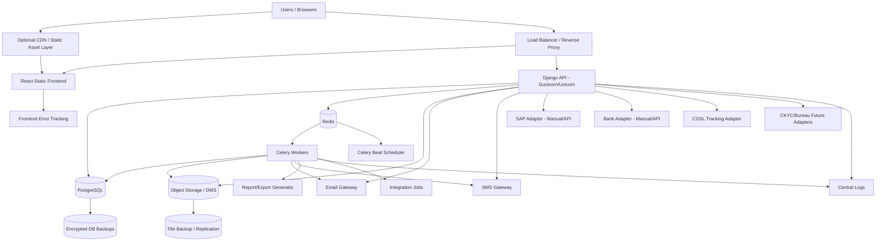
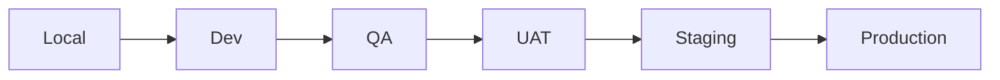
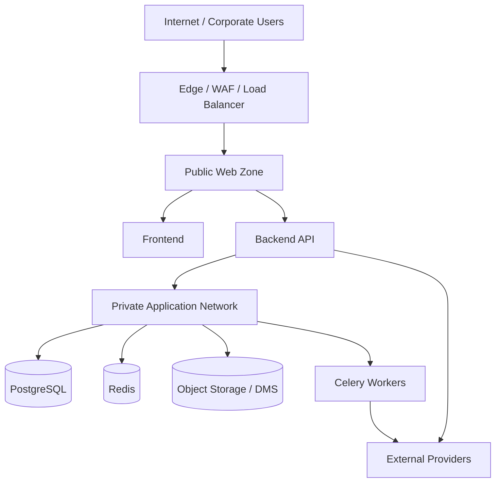
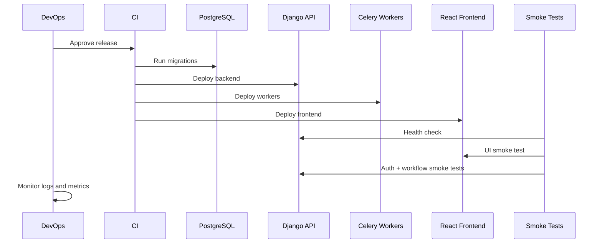
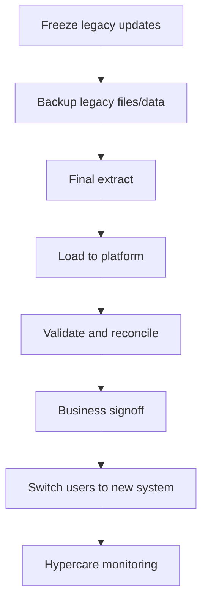

# Deployment & Operations Specification — SFPCL Member Credit Administration & Loan Disbursement Platform

## 1. Document Control

| Field | Value |
|---|---|
| Document name | `deployment-ops.md` |
| Product / system | SFPCL Member Credit Administration & Loan Disbursement Platform |
| Client | Sahyadri Farmers Producer Company Limited |
| Backend | Python + Django + Django REST Framework |
| Frontend | React |
| Database | PostgreSQL |
| Authentication | JWT |
| Supporting services | Redis, Celery, Celery Beat, object storage / DMS, email gateway, SMS gateway, SAP adapter, bank adapter, reporting/export workers |
| Primary deployment model | Containerised deployment recommended |
| Source basis | Current analysis set: SOP review, client brief, user flows, functional specification, information architecture, screen specification, content specification, component specification, design system, domain model, data model, technical architecture, API contracts, auth-permissions, integrations and security/privacy specification |
| Intended audience | DevOps, backend engineering, frontend engineering, QA, product, support, implementation, compliance, IT administration and operations teams |
| Status | Draft for implementation planning |

---

## 2. Purpose

This document defines the deployment, environment, release, monitoring, support, maintenance, incident response and production operations model for the SFPCL Member Credit Administration & Loan Disbursement Platform.

The platform supports a highly controlled financial and compliance workflow. Production operations must therefore ensure:

1. High availability during business operations.
2. Safe release and rollback practices.
3. Protected production data.
4. Reliable background jobs.
5. Secure integrations with SAP, bank, email, SMS, object storage and future providers.
6. Strong observability across application, infrastructure, workflow and compliance processes.
7. Recoverability through backups and disaster recovery.
8. Operational controls for loan disbursement, repayment, security instruments and audit evidence.
9. Production support runbooks for common and critical incidents.
10. Go-live readiness and post-go-live hypercare.

This specification focuses on how the system is deployed and operated after it is built.

---

## 3. Operational Context

## 3.1 Business Process Supported

The platform implements the end-to-end SOP lifecycle:

| SOP Stage | Operational Sensitivity |
|---|---|
| Initial Loan Request | Application reference generation, KYC upload and member validation must be reliable. |
| Credit Assessment | Two-day TAT, eligibility checks and loan limit calculation must be available and auditable. |
| Credit Scrutiny and Approval | CFO/Director approvals must be secure, available and immutable. |
| Documentation and Stamping | Document generation, upload, checklist approval and security custody must be reliable. |
| Loan Disbursement | SAP customer code, final verification, bank payment initiation and CFC authorisation are business-critical. |
| Monitoring and Repayment | Repayment capture, principal-first allocation, interest invoicing, DPD and MIS jobs must run correctly. |
| Default and Recovery | Grace period, extension, non-payment note and recovery actions require strict control. |
| Closure and Archival | NOC, security return and long-term retention must be dependable. |
| Compliance | Section 186, NBFC test, KYC/re-KYC, stamp duty, audit and retention controls require scheduled operations. |

## 3.2 Operational Priorities

| Priority | Description |
|---|---|
| Data integrity | Loan balances, approvals, disbursements, repayments and audit logs must remain consistent. |
| Workflow continuity | Users must be able to process loan lifecycle stages without avoidable downtime. |
| Security | Sensitive KYC, bank, legal and security-instrument data must be protected in production. |
| Recoverability | Database, files, audit logs and configuration must be restorable. |
| Traceability | All operational actions must be logged and auditable. |
| Controlled change | Releases must not disrupt active loan processing or approvals. |
| Compliance evidence | Production operations must retain evidence of changes, incidents, access reviews and backups. |

---

# 4. Deployment Architecture Overview

## 4.1 Recommended Runtime Architecture



## 4.2 Core Runtime Components

| Component | Technology | Production Responsibility |
|---|---|---|
| Frontend | React static build | User interface for internal roles and future borrower portal |
| Backend API | Django REST Framework | Workflow APIs, RBAC, business services, audit logging |
| WSGI/ASGI server | Gunicorn or Uvicorn/Gunicorn | Serves Django application |
| Reverse proxy | Nginx / cloud load balancer | TLS termination, routing, request limits |
| Database | PostgreSQL | System of record |
| Cache / broker | Redis | Celery broker, cache, rate-limit support |
| Background worker | Celery | Notifications, reports, scheduled jobs, document generation |
| Scheduler | Celery Beat | Daily/monthly/quarterly/annual jobs |
| Object storage | S3-compatible / DMS / approved storage | Stores uploaded and generated documents |
| Email service | SMTP or API provider | Email notifications and documents |
| SMS service | SMS gateway | SMS reminders and alerts |
| Monitoring | Prometheus/Grafana/Sentry/ELK-style tools | Logs, metrics, exceptions and alerts |
| Backup system | DB backups + storage replication | Recovery and retention |
| Integration adapters | Django integration modules | Manual/API SAP, bank, CDSL, CKYC and future integrations |

---

# 5. Deployment Model Options

## 5.1 Recommended Model: Containerised Deployment

The recommended approach is to containerise the frontend, backend, workers and scheduler.

### Advantages

- Consistent local, QA, UAT and production builds.
- Easier rollback through image tags.
- Clear runtime separation for API, workers and scheduled jobs.
- Easier scaling of Celery workers and API containers.
- Portable across cloud, private cloud or on-premise.

### Standard Containers

| Container | Purpose |
|---|---|
| `frontend` | Serves React static build or build artifact |
| `backend` | Django API |
| `celery_worker` | Background tasks |
| `celery_beat` | Scheduled tasks |
| `nginx` | Reverse proxy if not using managed load balancer |
| `postgres` | Local/dev only; production may use managed or dedicated PostgreSQL |
| `redis` | Cache and broker; production may use managed or dedicated Redis |

## 5.2 Alternative Model: VM-Based Deployment

Acceptable if client infrastructure requires virtual machines.

| Component | VM Deployment Pattern |
|---|---|
| Frontend | Nginx serving static files |
| Backend | Gunicorn systemd service |
| Workers | Celery systemd service |
| Scheduler | Celery Beat systemd service |
| DB | PostgreSQL VM or managed DB |
| Redis | Redis VM or managed service |
| Files | Mounted storage or DMS |

VM deployment requires stricter manual configuration management and patching discipline.

## 5.3 Alternative Model: Kubernetes

Recommended only if SFPCL or implementation partner already operates Kubernetes.

| Component | Kubernetes Object |
|---|---|
| Frontend | Deployment + Service + Ingress |
| Backend | Deployment + Service |
| Celery workers | Deployment |
| Celery Beat | Deployment with one replica |
| Redis | Managed Redis or StatefulSet |
| PostgreSQL | Managed DB preferred |
| Secrets | Kubernetes secrets or external secret manager |
| Config | ConfigMaps |
| Scaling | HPA for API/workers |

---

# 6. Environment Strategy

## 6.1 Environment List

| Environment | Purpose | Data Type | Integrations |
|---|---|---|---|
| Local | Developer workstations | Synthetic only | Mock providers |
| Dev | Shared engineering integration | Synthetic / limited sample | Mock or sandbox |
| QA | Functional and regression testing | Synthetic / masked | Mock or sandbox |
| UAT | Business user acceptance | Client-approved test data | Manual or sandbox |
| Staging | Production-like release candidate | Sanitised or controlled | Production-like non-live |
| Production | Live system | Live sensitive data | Live/manual production providers |
| DR | Recovery environment | Restored production backup | Disabled until DR activation |

## 6.2 Environment Requirements

| Requirement | Local | Dev | QA | UAT | Staging | Production |
|---|---:|---:|---:|---:|---:|---:|
| HTTPS | Optional | Recommended | Recommended | Required | Required | Required |
| Synthetic data | Yes | Yes | Yes | Preferred | Preferred | No |
| Production secrets | No | No | No | No | No | Yes only |
| Database backups | Optional | Optional | Daily | Daily | Daily | Required |
| Object storage encryption | Optional | Recommended | Recommended | Required | Required | Required |
| Monitoring | Basic | Basic | Yes | Yes | Yes | Full |
| Error tracking | Optional | Yes | Yes | Yes | Yes | Full |
| Restricted access | No | Yes | Yes | Yes | Yes | Strict |
| Live payment integration | No | No | No | No | No | Controlled |

## 6.3 Environment Promotion Flow



Promotion requires:

1. Build artifact immutability.
2. Versioned Docker images.
3. Migration validation.
4. Automated tests.
5. Security scan.
6. UAT signoff for production releases.
7. Rollback plan.
8. Release notes.

---

# 7. Infrastructure Components

## 7.1 Frontend Hosting

| Item | Requirement |
|---|---|
| Artifact | Static React build |
| Hosting | Nginx, CDN, object storage static hosting or app service |
| TLS | Required |
| Cache | Static assets cacheable; HTML entry point should have short cache |
| Environment config | Runtime config or build-time config depending deployment policy |
| Rollback | Previous build artifact retained |
| Monitoring | Frontend error tracking and availability check |

### Frontend Runtime Config

Recommended values:

| Config | Description |
|---|---|
| `API_BASE_URL` | Backend API URL |
| `APP_ENV` | dev / qa / uat / staging / prod |
| `SENTRY_DSN` | Frontend error tracking |
| `ENABLE_BORROWER_PORTAL` | Future flag |
| `ENABLE_E_SIGN` | Future flag |
| `ENABLE_CKYC` | Future flag |
| `ENABLE_BUREAU` | Future flag |
| `SUPPORT_CONTACT_EMAIL` | User support contact |

## 7.2 Backend API Hosting

| Item | Requirement |
|---|---|
| Framework | Django + DRF |
| Runtime | Gunicorn or Uvicorn/Gunicorn |
| Replicas | At least 2 for production where infrastructure supports |
| Health endpoint | Required |
| Readiness endpoint | Required |
| Secrets | Environment variables / secret manager |
| Static/media | Static through frontend; documents through object storage |
| Logs | Structured JSON logs |
| Migrations | Run before or during controlled deployment |
| Timeout | Configured per API and proxy |

## 7.3 PostgreSQL

| Item | Requirement |
|---|---|
| Version | Current supported PostgreSQL version |
| Deployment | Managed PostgreSQL or dedicated secured VM/service |
| Encryption | At rest and in transit where feasible |
| Backups | Daily full and PITR if feasible |
| Access | Private network only |
| Users | Separate app, migration and read-only users |
| Monitoring | Connections, CPU, memory, disk, replication/backups |
| Maintenance | Vacuum, analyze, index review, upgrades |
| Extensions | Only approved extensions |

## 7.4 Redis

| Item | Requirement |
|---|---|
| Purpose | Celery broker, cache, throttling |
| Persistence | Optional depending broker design; not system of record |
| Access | Private network only |
| Authentication | Required |
| Monitoring | Memory, queue depth, evictions, connectivity |
| Production | Managed or secured Redis |
| Backup | Not necessary if used only as broker/cache, but config should be recoverable |

## 7.5 Celery Workers

| Worker Type | Responsibility |
|---|---|
| `default` | General async tasks |
| `notifications` | Email and SMS |
| `reports` | Heavy exports and report generation |
| `documents` | Document generation and file processing |
| `finance` | Interest accrual, DPD, repayment jobs |
| `integrations` | SAP, bank, CDSL, CKYC, provider adapters |

Production may start with one worker pool and later split queues by workload.

## 7.6 Celery Beat

Celery Beat must run as a singleton.

| Requirement | Description |
|---|---|
| Single scheduler | Avoid duplicate scheduled jobs |
| Job idempotency | Scheduled jobs must be safe against accidental duplicate execution |
| Monitoring | Alert if scheduler stops |
| Schedule storage | Database-backed schedule preferred |
| Timezone | Clearly configured, preferably Asia/Kolkata for business schedules with UTC storage |

## 7.7 Object Storage / DMS

| Requirement | Description |
|---|---|
| Encryption | Required |
| Access control | Backend-mediated signed URLs |
| Retention | Loan files at least eight years after closure |
| Versioning | Recommended |
| Backup/replication | Required |
| Malware scanning | Recommended |
| Lifecycle policies | Archive tiers after closure if approved |
| Audit | Upload/download/delete/archive logged |
| Data residency | Client to confirm |

---

# 8. Network and Security Topology

## 8.1 Recommended Network Zones



## 8.2 Network Controls

| Control | Requirement |
|---|---|
| TLS | Required for all external traffic |
| DB public access | Not allowed |
| Redis public access | Not allowed |
| Object storage public bucket | Not allowed |
| Admin endpoints | IP allowlist/VPN/MFA where feasible |
| Security groups/firewall | Least privilege |
| Webhook endpoints | Signature verification and IP allowlist where possible |
| Rate limiting | Login, sensitive reveal, file download and export endpoints |
| WAF | Recommended for production |
| CORS | Strict allowed origins |

---

# 9. Configuration Management

## 9.1 Configuration Sources

| Config Type | Storage |
|---|---|
| Non-sensitive app config | Environment variables / config maps |
| Secrets | Secret manager / protected environment variables |
| Business rules | Database configuration tables with approval workflow |
| Document templates | Database + object storage |
| Content templates | Database |
| Feature flags | Database or config service |
| Integration settings | Database provider config + secret references |

## 9.2 Environment Variables

| Variable | Purpose |
|---|---|
| `DJANGO_SETTINGS_MODULE` | Django environment settings |
| `DJANGO_SECRET_KEY` | Django secret key |
| `DATABASE_URL` | PostgreSQL connection |
| `REDIS_URL` | Redis / Celery broker |
| `ALLOWED_HOSTS` | Allowed hosts |
| `CORS_ALLOWED_ORIGINS` | Frontend origins |
| `CSRF_TRUSTED_ORIGINS` | Trusted CSRF origins |
| `JWT_ACCESS_TOKEN_LIFETIME` | Access token lifetime |
| `JWT_REFRESH_TOKEN_LIFETIME` | Refresh token lifetime |
| `OBJECT_STORAGE_PROVIDER` | S3 / DMS / local |
| `OBJECT_STORAGE_BUCKET` | Bucket name |
| `OBJECT_STORAGE_REGION` | Storage region |
| `OBJECT_STORAGE_CREDENTIALS_SECRET` | Secret reference |
| `EMAIL_PROVIDER` | SMTP / provider |
| `EMAIL_HOST` | Email host |
| `EMAIL_CREDENTIALS_SECRET` | Email secret reference |
| `SMS_PROVIDER` | SMS provider |
| `SMS_CREDENTIALS_SECRET` | SMS secret reference |
| `SAP_MODE` | manual / api / file / disabled |
| `BANK_MODE` | manual / api / file / disabled |
| `CDSL_MODE` | manual / api / disabled |
| `CKYC_MODE` | disabled / api |
| `BUREAU_MODE` | disabled / api |
| `ESIGN_MODE` | disabled / api |
| `SENTRY_DSN` | Error tracking |
| `LOG_LEVEL` | Logging level |
| `FIELD_ENCRYPTION_KEY_REF` | Encryption key reference |
| `BACKUP_BUCKET` | Backup location |

## 9.3 Configuration Governance

| Rule | Requirement |
|---|---|
| Config versioning | Business-critical config must be effective-dated |
| Approval reference | Board/CFO references captured where required |
| Historical immutability | Old loan snapshots must not change after config update |
| Audit log | Every config change logged |
| Separation of duties | Admin config changes require business approval for critical rules |
| Rollback | Previous config version can be restored if not used incorrectly |
| Environment parity | Staging mirrors production configuration where possible without live secrets |

---

# 10. Secrets Management

## 10.1 Secret Types

| Secret | Owner |
|---|---|
| Django secret key | DevOps |
| JWT signing key | DevOps / Security |
| Database credentials | DevOps |
| Redis credentials | DevOps |
| Field encryption keys | Security / DevOps |
| Object storage credentials | DevOps |
| Email provider credentials | DevOps / IT |
| SMS provider credentials | DevOps / IT |
| SAP API credentials | Finance IT / DevOps |
| Bank API credentials | Finance IT / DevOps |
| Webhook secrets | DevOps |
| Backup encryption keys | DevOps / Security |

## 10.2 Secret Rules

| Rule | Requirement |
|---|---|
| No secret in code | Repository must not contain secrets |
| No secret in logs | Redact environment and payload secrets |
| Separate by environment | Dev/QA/UAT/prod credentials are separate |
| Rotation | Rotation schedule defined for production |
| Emergency revocation | Procedure documented |
| Access control | Only authorised DevOps/security users |
| Audit | Secret access and update logged where tooling supports |
| Backup | Key recovery plan documented |

---

# 11. CI/CD Pipeline

## 11.1 Pipeline Overview

```mermaid
flowchart LR
    COMMIT[Developer Commit] --> STATIC[Static Checks]
    STATIC --> TEST[Automated Tests]
    TEST --> BUILD[Build Artifacts]
    BUILD --> SCAN[Security Scans]
    SCAN --> PACKAGE[Publish Images]
    PACKAGE --> DEPLOYQA[Deploy QA]
    DEPLOYQA --> UAT[Deploy UAT]
    UAT --> APPROVAL[Release Approval]
    APPROVAL --> STAGING[Deploy Staging]
    STAGING --> PROD[Deploy Production]
    PROD --> SMOKE[Smoke Tests]
    SMOKE --> MONITOR[Monitor]
```



## 11.2 Backend CI Checks

| Check | Requirement |
|---|---|
| Formatting | Black / Ruff or equivalent |
| Linting | Required |
| Type checks | Recommended |
| Unit tests | Required |
| Service tests | Required for workflow services |
| API tests | Required |
| Permission tests | Required |
| Migration check | Required |
| Security dependency scan | Required |
| Secret scan | Required |
| OpenAPI schema generation | Recommended |
| Coverage threshold | Recommended |

## 11.3 Frontend CI Checks

| Check | Requirement |
|---|---|
| TypeScript build | Required |
| Linting | Required |
| Unit tests | Required |
| Component tests | Recommended |
| Route guard tests | Required for protected modules |
| Accessibility checks | Recommended |
| Dependency scan | Required |
| Production build | Required |
| Bundle size check | Recommended |

## 11.4 Container CI Checks

| Check | Requirement |
|---|---|
| Image build | Required |
| Vulnerability scan | Required |
| Non-root user | Recommended |
| Minimal base image | Recommended |
| Tagging | Commit SHA + version |
| Image signing | Future recommended |
| Registry retention | Keep recent versions and release tags |

## 11.5 Deployment Gates

| Gate | Required Before Production |
|---|---|
| All critical tests pass | Yes |
| No critical vulnerabilities | Yes |
| Migrations reviewed | Yes |
| Rollback plan prepared | Yes |
| Release notes prepared | Yes |
| UAT signoff | Yes for business releases |
| Data migration signoff | For migration releases |
| Security signoff | For auth/payment/security changes |
| Backup verified | Before major releases |
| Maintenance window approved | For downtime releases |

---

# 12. Branching and Release Strategy

## 12.1 Branching Model

Recommended simple model:

| Branch | Purpose |
|---|---|
| `main` | Production-ready code |
| `develop` | Integrated development branch, if used |
| `feature/*` | Feature branches |
| `bugfix/*` | Bug fixes |
| `release/*` | Release preparation |
| `hotfix/*` | Production hotfixes |

## 12.2 Versioning

Use semantic versioning:

```text
MAJOR.MINOR.PATCH
```

| Version Part | Meaning |
|---|---|
| Major | Breaking changes or major module release |
| Minor | New features |
| Patch | Bug fixes / small changes |

Example:

```text
v1.3.2
```

## 12.3 Release Types

| Release Type | Examples | Approval |
|---|---|---|
| Standard feature release | New report, workflow improvement | Product + QA |
| Compliance release | NBFC tracker change, KYC change | Compliance + Product + QA |
| Security release | Permission or encryption fix | Security + QA |
| Hotfix | Production bug fix | Incident owner + tech lead |
| Data fix | Correct loan/account/config data | Business owner + audit |
| Infrastructure release | DB upgrade, storage change | DevOps + QA |

---

# 13. Deployment Process

## 13.1 Standard Deployment Steps

1. Confirm release scope and release notes.
2. Confirm production backup is recent.
3. Confirm no critical background jobs are mid-run.
4. Put release into approved deployment window.
5. Deploy database migrations.
6. Deploy backend image.
7. Deploy Celery worker image.
8. Deploy Celery Beat if schedule changed.
9. Deploy frontend build.
10. Run post-deployment smoke tests.
11. Verify health checks.
12. Verify scheduled jobs.
13. Verify logs and error tracking.
14. Confirm key business workflows.
15. Communicate release completion.

## 13.2 Deployment Sequence



## 13.3 Zero-Downtime Considerations

To support zero or low downtime:

- Use backward-compatible migrations.
- Deploy additive DB changes before code using them.
- Avoid destructive schema changes in the same release.
- Run multiple API replicas and rolling updates.
- Drain workers gracefully.
- Ensure frontend can handle old/new API during rollout.
- Use feature flags for partially released functionality.
- Avoid long-running migrations during business hours.

## 13.4 Worker Deployment Safety

Before worker deployment:

- Let in-flight tasks finish if possible.
- Stop accepting new tasks during rolling restart if needed.
- Ensure tasks are idempotent.
- Confirm Celery Beat does not run duplicate instances.
- Confirm queue backlog after restart.
- Monitor failed tasks.

---

# 14. Database Migration Operations

## 14.1 Migration Principles

| Principle | Requirement |
|---|---|
| Reversible where possible | Migrations should support rollback when feasible |
| Backward compatible | Avoid breaking running app during rollout |
| No long locks | Avoid long table locks in production |
| Data migrations tested | Test on staging with production-like data volume |
| Backup before major migration | Required |
| Migration audit | Record migration version and deployer |
| Business signoff | Required for migrations changing loan data |

## 14.2 Safe Migration Pattern

For risky schema changes:

1. Add nullable new column.
2. Deploy code that writes both old and new fields.
3. Backfill data asynchronously.
4. Validate consistency.
5. Switch reads to new field.
6. Remove old field in later release.

## 14.3 Data Migration Controls

| Control | Requirement |
|---|---|
| Batch ID | Every migrated record tagged |
| Dry run | Required for large migrations |
| Validation report | Before and after |
| Reconciliation | Financial data reconciled with SAP/source |
| Rollback plan | Defined |
| Audit | Migration actions logged |
| Approval | Business owner signoff |

## 14.4 Migration Freeze Scenarios

Do not run migrations during:

- Active high-volume disbursement window.
- Month-end/quarter-end interest or MIS generation.
- Annual interest invoice/capitalisation date.
- Major compliance review.
- Production incident.
- Backup failure period.

---

# 15. Rollback Strategy

## 15.1 Rollback Types

| Rollback Type | Description |
|---|---|
| Application rollback | Revert backend/frontend/worker image to previous version |
| Config rollback | Re-activate previous config version |
| Database rollback | Restore backup or reverse migration |
| Feature flag rollback | Disable feature |
| Data correction | Controlled correction script with audit |
| Integration rollback | Switch provider mode from API to manual |

## 15.2 Application Rollback Steps

1. Identify failing release version.
2. Stop new deployments.
3. Confirm database compatibility with previous application version.
4. Roll back backend image.
5. Roll back worker image.
6. Roll back frontend build.
7. Verify health checks.
8. Run smoke tests.
9. Monitor errors.
10. Record incident/release note.

## 15.3 Database Rollback Caution

Database rollback should be avoided unless necessary because loan, approval, disbursement and repayment data may have changed after release.

Before DB rollback:

- Freeze application writes.
- Identify affected records.
- Confirm backup restore point.
- Get business owner approval.
- Preserve audit logs.
- Run restore in staging first if time permits.
- Communicate downtime.

## 15.4 Feature Flag Rollback

Feature flags should be used for:

- Future CKYC integration.
- Bureau checks.
- E-sign.
- Bank API.
- SAP API.
- Borrower portal.
- New approval matrix rules.
- New interest calculation method.
- New reports.
- UI modules not yet fully adopted.

Feature flag rollback is safest for newly introduced functionality.

---

# 16. Release Notes and Change Records

## 16.1 Release Note Contents

Every production release should include:

- Release version.
- Release date/time.
- Deployed by.
- Approved by.
- Business owner.
- Modules changed.
- New features.
- Bug fixes.
- Security changes.
- Database migrations.
- Config changes.
- Integration changes.
- Known issues.
- Rollback plan.
- Post-release validation results.

## 16.2 Change Record Classification

| Change Type | Examples |
|---|---|
| Functional | New screen or workflow |
| Compliance | New statutory tracker |
| Security | Role/permission update |
| Infrastructure | DB version upgrade |
| Integration | SAP/bank provider change |
| Data | Migration or correction |
| Emergency | Production hotfix |

---

# 17. Monitoring and Observability

## 17.1 Monitoring Layers

| Layer | What to Monitor |
|---|---|
| Infrastructure | CPU, memory, disk, network, container restarts |
| Database | Connections, locks, slow queries, replication, backup status |
| Redis | Memory, queue depth, evictions, connectivity |
| API | Latency, error rate, throughput, status codes |
| Celery | Queue depth, task failures, task duration, Beat status |
| Frontend | JS errors, page load, failed API calls |
| Object storage | Upload/download failures, latency, capacity |
| Integrations | SAP requests, bank status, email/SMS delivery, CDSL milestones |
| Business workflow | Pending approvals, disbursement blockers, repayment exceptions |
| Security | Failed logins, sensitive reveals, downloads, role changes |
| Compliance | Overdue compliance tasks, NBFC/Section 186 tracker status |

## 17.2 Application Metrics

| Metric | Purpose |
|---|---|
| API request count | Traffic |
| API latency p50/p95/p99 | Performance |
| API error rate | Reliability |
| Auth failures | Security |
| Active sessions | Usage |
| Application creations | Business throughput |
| Appraisal TAT breaches | Operational control |
| Approval pending age | Bottleneck |
| Documentation pending age | Bottleneck |
| SAP request pending age | Disbursement bottleneck |
| CFC authorisation pending age | Payment bottleneck |
| Disbursement failures | Financial risk |
| Repayment capture failures | Financial operations |
| Interest job failures | Accounting risk |
| DPD job failures | Monitoring risk |
| Compliance overdue count | Governance risk |

## 17.3 Business Process Metrics

| Metric | Owner | Frequency |
|---|---|---|
| Applications received | Credit Manager | Daily/weekly |
| Applications incomplete | Credit Manager | Daily |
| Appraisals pending beyond 2-day TAT | Credit Manager | Daily |
| Sanction cases pending | CFO/Sanction Committee | Daily |
| Documentation files pending | CS/Compliance | Daily |
| SAP requests pending | Senior Manager Finance | Daily |
| Disbursements pending CFC | CFC/Treasury | Daily |
| Loans outstanding beyond 1 year | Credit Manager | Quarterly |
| DPD bucket counts | Credit Manager/CFO | Quarterly |
| Interest invoices pending | Accounts/Credit | Year-end |
| Capitalisation pending after 30 April | Accounts/Credit | Annual |
| Default cases by stage | Credit Manager/CFO | Monthly |
| Recovery actions pending | CS/CFO | Monthly |
| NOC pending after closure | CS | Weekly |
| Security returns pending | CS | Weekly |
| Compliance tasks overdue | CS/CFO | Weekly/monthly |

## 17.4 Security Metrics

| Metric | Alert Threshold |
|---|---|
| Failed login attempts | Configured threshold per user/IP |
| Suspicious login location | Review |
| Sensitive reveal count | Spike above baseline |
| Restricted document downloads | Spike above baseline |
| Role/permission changes | Immediate notification |
| Admin login after hours | Review |
| Disbursement outside business hours | High-priority alert |
| Recovery action initiated | Notify CS/CFO |
| Webhook signature failure | Immediate review |
| Export of sensitive report | Audit review |

---

# 18. Logging Strategy

## 18.1 Log Types

| Log Type | Source | Purpose |
|---|---|---|
| Application logs | Django API | Debugging and operations |
| Access logs | Nginx/load balancer | Traffic and request trace |
| Worker logs | Celery | Background job monitoring |
| Scheduler logs | Celery Beat | Scheduled job execution |
| Database logs | PostgreSQL | Query and DB health |
| Security logs | Auth and permission services | Security monitoring |
| Integration logs | Integration adapters | Provider status and failures |
| Audit logs | Application audit service | Immutable business evidence |
| Frontend logs | React/Sentry | Client-side errors |

## 18.2 Structured Log Fields

| Field | Description |
|---|---|
| `timestamp` | Event time |
| `level` | INFO/WARN/ERROR/CRITICAL |
| `request_id` | Request trace ID |
| `user_id` | Acting user, if any |
| `role_codes` | Role snapshot, if safe |
| `ip_address` | Client IP |
| `method` | HTTP method |
| `path` | API path without sensitive query values |
| `status_code` | HTTP response |
| `duration_ms` | Request duration |
| `entity_type` | Related entity |
| `entity_id` | Related entity ID |
| `action_code` | Business action |
| `error_code` | Standard error code |
| `provider_code` | Integration provider |
| `job_id` | Background job ID |

## 18.3 Sensitive Log Redaction

Logs must not include:

- Full PAN.
- Full Aadhaar.
- Full bank account.
- Cheque number.
- BO account number.
- Password.
- JWT token.
- Refresh token.
- OTP.
- API key.
- Secret.
- Raw KYC file content.
- Raw bank statement content.
- Full integration payload containing sensitive data.

## 18.4 Log Retention

| Log Type | Suggested Retention |
|---|---|
| Application operational logs | 30–90 days |
| Security logs | 1 year or longer |
| Audit logs | Long-term, aligned with loan retention |
| Integration events | Loan/compliance retention where evidence-related |
| Access logs | 90 days or client policy |
| Error traces | 90–180 days |
| Database logs | 30–90 days |
| Backup logs | 1 year |

Final retention should follow client IT and compliance policy.

---

# 19. Alerting Strategy

## 19.1 Severity Levels

| Severity | Definition | Response Target |
|---|---|---|
| Sev 1 / Critical | Production down, data loss, unauthorised disbursement, major security incident | Immediate |
| Sev 2 / High | Major function impaired, disbursement blocked, DB degradation, failed critical jobs | Same business day / urgent |
| Sev 3 / Medium | Non-critical module degraded, report failure, notification delay | Within agreed SLA |
| Sev 4 / Low | Minor issue, cosmetic bug, single user issue | Planned fix |

## 19.2 Critical Alerts

| Alert | Severity |
|---|---|
| API unavailable | Sev 1 |
| Database unavailable | Sev 1 |
| Object storage unavailable | Sev 1/2 depending impact |
| Disbursement completed without expected gate | Sev 1 |
| Bank transfer duplicate detected | Sev 1 |
| Role/permission escalation anomaly | Sev 1/2 |
| Sensitive data breach suspected | Sev 1 |
| Backup failure for production | Sev 2 |
| Celery Beat stopped | Sev 2 |
| Interest accrual job failed | Sev 2 |
| DPD calculation failed | Sev 2 |
| SAP requests stuck beyond threshold | Sev 3 |
| Email/SMS provider unavailable | Sev 3 unless blocking legal notices |
| Compliance task overdue | Sev 3 |
| SSL certificate nearing expiry | Sev 2 if under threshold |

## 19.3 Alert Routing

| Alert Type | Notify |
|---|---|
| Infrastructure down | DevOps, Tech Lead |
| Database issue | DevOps, DBA |
| Security incident | IT Head, Security, CFO, CS |
| Disbursement anomaly | Senior Manager Finance, CFC, CFO, DevOps |
| Approval workflow issue | Credit Manager, CFO, Product Support |
| Document storage issue | Compliance, CS, DevOps |
| SAP integration issue | Credit Manager, Senior Manager Finance |
| Bank reconciliation issue | Treasury, Accounts |
| Compliance overdue | CS, CFO |
| Backup failure | DevOps, IT Head |

---

# 20. Health Checks

## 20.1 Backend Health Endpoints

| Endpoint | Purpose |
|---|---|
| `/health/live/` | Basic application process is alive |
| `/health/ready/` | Application can serve traffic |
| `/health/deep/` | Optional deeper dependencies check |

## 20.2 Readiness Checks

Readiness should verify:

- Database connectivity.
- Redis connectivity.
- Migrations applied.
- Critical configuration present.
- Object storage reachable, if required for readiness.
- Secret keys loaded.
- Celery broker reachable.

## 20.3 Deep Health Checks

Deep health may verify:

- Email provider connectivity.
- SMS provider connectivity.
- Storage upload/download test.
- SAP adapter status.
- Bank adapter status.
- Celery worker heartbeat.
- Celery Beat heartbeat.
- Disk space.
- DB replication/backup status.

Deep checks should not be too expensive and should not trigger actual business transactions.

---

# 21. Backup and Restore Operations

## 21.1 Backup Scope

| Data | Backup Required |
|---|---|
| PostgreSQL database | Yes |
| Object storage / DMS files | Yes |
| Audit logs | Yes |
| Integration event records | In database |
| Document templates | Database + storage |
| Content templates | Database |
| Configuration tables | Database |
| Secrets | Secure backup / secret manager recovery |
| Application images | Container registry |
| Frontend builds | Artifact registry |
| Logs | Retention based on logging system |

## 21.2 Backup Schedule

| Backup Type | Recommended Frequency |
|---|---|
| Database full backup | Daily |
| Point-in-time recovery | Continuous WAL archiving if feasible |
| Object storage replication | Continuous or daily |
| Config export | On change / daily |
| Secret backup | As per secret manager policy |
| Backup verification | Daily automated check |
| Restore test | Quarterly |
| DR drill | At least annually |

## 21.3 Backup Security

- Encrypt backups at rest.
- Restrict backup access.
- Store backups separately from production.
- Monitor backup job success.
- Test restore regularly.
- Document restore steps.
- Do not restore production data into non-secure environments without masking.
- Preserve audit logs during restore.

## 21.4 Restore Runbook

1. Declare restore scenario and severity.
2. Identify restore point.
3. Freeze affected application writes if needed.
4. Notify stakeholders.
5. Provision restore environment or prepare production restore.
6. Restore PostgreSQL backup.
7. Restore object storage files.
8. Validate database schema version.
9. Validate file references.
10. Run integrity checks.
11. Run application smoke tests.
12. Obtain business validation.
13. Resume service.
14. Record restore evidence and incident/change record.

## 21.5 Recovery Targets

Final RPO/RTO must be confirmed by SFPCL. Suggested planning values:

| Target | Suggested Value |
|---|---|
| RPO | 15 minutes to 24 hours based on infrastructure |
| RTO | 4–8 hours for production |
| Critical data | Database, documents, audit logs, configuration and secrets |
| Restore test | Quarterly |
| DR drill | Annual |

---

# 22. Disaster Recovery

## 22.1 DR Scenarios

| Scenario | DR Response |
|---|---|
| Application server failure | Restart / redeploy containers |
| Database corruption | Restore from backup / PITR |
| Object storage loss | Restore from replication/backup |
| Region/data center outage | Activate DR environment |
| Ransomware | Isolate, restore clean backups |
| Accidental deletion | Restore affected data/files |
| Secret compromise | Rotate secrets and redeploy |
| Integration provider outage | Switch to manual mode where possible |

## 22.2 DR Environment

| Component | DR Requirement |
|---|---|
| Backend | Deployable from same image registry |
| Frontend | Deployable from artifact registry |
| DB | Restore from backup |
| Files | Restore from replicated storage |
| Redis | Recreated, queues may be lost; idempotency handles retries |
| Secrets | Recover from secret manager |
| DNS | Switchable to DR endpoint |
| Monitoring | Available in DR |
| Runbooks | Accessible outside production environment |

## 22.3 DR Drill Checklist

- Restore database backup.
- Restore object storage sample.
- Deploy backend/frontend/worker.
- Validate login.
- Validate member/application read.
- Validate document download.
- Validate critical workflow in test mode.
- Validate audit logs.
- Validate backup encryption keys.
- Validate DNS cutover steps.
- Record drill outcome and improvements.

---

# 23. Background Jobs and Operational Scheduling

## 23.1 Scheduled Job Catalogue

| Job | Frequency | Owner | Business Purpose |
|---|---|---|---|
| Overdue scan | Daily | Credit Manager | Detect missed repayments |
| Grace period expiry check | Daily | Credit Manager | Advance default workflow |
| Extension expiry check | Daily | Credit Manager | Trigger non-payment review |
| Notification retry | Frequent | System | Retry failed email/SMS |
| SAP request reminder | Daily | Senior Manager Finance | Prevent disbursement delays |
| Pending approval reminder | Daily | CFO/Sanction Committee | Reduce approval bottleneck |
| Documentation pending reminder | Daily | Compliance/CS | Complete documentation |
| DPD calculation | Daily or scheduled quarterly | Credit Manager | Portfolio monitoring |
| Quarterly MIS generation | Quarterly | Credit Manager | CFO reporting |
| Section 186 tracker reminder | Quarterly | CFO | Statutory compliance |
| NBFC principal test reminder | Quarterly | CFO | Regulatory monitoring |
| Monthly interest accrual | Monthly | Accounts | Accounting |
| Year-end interest invoice | Annual | Accounts/Credit/Sales | Interest recovery |
| Interest capitalisation check | After 30 April | Accounts/Credit | Capitalise unpaid interest |
| Re-KYC task generation | Periodic | Credit/Compliance | KYC compliance |
| Stamp duty exception review | Monthly/Quarterly | CS | Documentation compliance |
| Archive review | Monthly | CS/Auditor | Retention management |
| Access review reminder | Monthly/Quarterly | IT Head | Security governance |
| Backup verification | Daily | DevOps | Recoverability |

## 23.2 Job Execution Rules

| Rule | Requirement |
|---|---|
| Idempotency | Jobs must not create duplicates |
| Locking | Use job lock for singleton jobs |
| Audit | Critical jobs write execution records |
| Retry | Safe retry policy |
| Alerting | Alert on failure |
| Dry run | For major financial jobs |
| Business review | For interest capitalisation and compliance |
| Timezone | Store UTC; display Asia/Kolkata where applicable |
| Manual rerun | Authorised users can rerun failed jobs with audit |

## 23.3 Job Run Records

Every scheduled job should record:

- Job name.
- Job run ID.
- Started at.
- Completed at.
- Status.
- Records processed.
- Records failed.
- Error summary.
- Trigger type: scheduled/manual.
- Triggered by user/system.
- Related report/document if generated.

---

# 24. Operational Runbooks

## 24.1 API Down

### Symptoms

- Health check failing.
- Users cannot load pages.
- API returns 5xx.

### Immediate Steps

1. Check load balancer and API container status.
2. Check recent deployment.
3. Check database connectivity.
4. Check environment variables/secrets.
5. Check error logs.
6. Restart failed containers if safe.
7. Rollback recent deployment if correlated.
8. Notify stakeholders if outage exceeds threshold.

### Validation

- `/health/live/` passes.
- `/health/ready/` passes.
- Login works.
- Dashboard loads.
- Application detail loads.

## 24.2 Database Down or Degraded

### Symptoms

- API 500 errors.
- DB connection errors.
- Slow queries.
- Connection pool exhausted.

### Immediate Steps

1. Check DB availability.
2. Check connection count.
3. Check CPU/memory/disk.
4. Check long-running queries/locks.
5. Stop excessive background jobs if needed.
6. Scale DB or app connections where possible.
7. Restart app only if connection leaks suspected.
8. Escalate to DBA/DevOps.

### Validation

- API readiness passes.
- No critical DB locks.
- Slow query count normal.
- Login and key workflows work.

## 24.3 Celery Queue Stuck

### Symptoms

- Notifications not sent.
- Reports not generated.
- DPD/interest jobs not running.
- Queue depth increasing.

### Immediate Steps

1. Check Redis.
2. Check Celery worker heartbeat.
3. Check worker logs.
4. Check failed tasks.
5. Restart worker if safe.
6. Scale workers if backlog high.
7. Confirm Celery Beat is running.
8. Rerun failed idempotent tasks.

### Validation

- Queue depth decreasing.
- Test email/SMS task works.
- Scheduled jobs resume.

## 24.4 Celery Beat Stopped

### Symptoms

- Scheduled jobs not running.
- Daily/quarterly jobs missed.

### Immediate Steps

1. Confirm Beat process/container status.
2. Ensure only one Beat instance is running.
3. Restart Beat.
4. Identify missed jobs.
5. Rerun missed jobs with dry-run where needed.
6. Notify business owners for financial/compliance jobs.

### Validation

- Beat heartbeat visible.
- Next schedule correct.
- Missed jobs resolved.

## 24.5 Object Storage Unavailable

### Symptoms

- Document upload/download failures.
- Generated document failures.
- Disbursement/documentation blocked.

### Immediate Steps

1. Check storage provider status.
2. Check credentials/secrets.
3. Check bucket permissions.
4. Check network connectivity.
5. Disable non-critical document actions if needed.
6. Communicate impact to CS/Compliance/Credit.
7. Retry failed uploads when service returns.

### Validation

- Upload test file.
- Download existing file.
- Generate a test document.
- Restricted download audit logs created.

## 24.6 Email/SMS Provider Failure

### Symptoms

- Communication job failures.
- Borrower reminders not delivered.
- Email queue backlog.

### Immediate Steps

1. Check provider status and credentials.
2. Check rate limits.
3. Review failed tasks.
4. Retry if safe.
5. Switch provider/manual mode if configured.
6. Notify business owners if legal/critical communications delayed.
7. Generate manual communication list if needed.

### Validation

- Test email/SMS sent.
- Queue backlog reduces.
- Failed communications tracked.

## 24.7 SAP Request Backlog

### Symptoms

- Many SAP requests pending.
- Disbursement readiness blocked.

### Immediate Steps

1. Review SAP pending dashboard.
2. Identify oldest requests.
3. Notify Senior Manager – Finance.
4. Check request Excel generation.
5. Check if confirmation evidence missing.
6. Escalate if TAT breached.
7. Record manual updates as SAP codes are created.

### Validation

- SAP customer code recorded.
- Disbursement readiness passes.
- Audit log present.

## 24.8 Bank Disbursement Stuck

### Symptoms

- Disbursement initiated but CFC pending.
- CFC authorised but UTR missing.
- Bank transfer failed.

### Immediate Steps

1. Check disbursement status.
2. Verify readiness checks.
3. Notify Senior Manager – Finance and CFC.
4. Check bank portal status.
5. Capture bank evidence.
6. If failed, mark failure and create new initiation only if safe.
7. Do not mark loan active without UTR/success evidence.

### Validation

- CFC authorisation recorded.
- UTR captured.
- Loan status active only after success.
- Disbursement advice sent.

## 24.9 Repayment Reconciliation Exception

### Symptoms

- Bank receipt unmatched.
- Duplicate bank reference.
- Repayment captured but not allocated.
- SAP posting missing.

### Immediate Steps

1. Review bank statement line.
2. Search by UTR/reference.
3. Search by borrower/application/loan.
4. Check amount/date.
5. Match manually if verified.
6. Allocate repayment principal-first.
7. Mark SAP posted when done.
8. Escalate mismatch to Accounts/Credit.

### Validation

- Repayment matched.
- Allocation created.
- Loan outstanding updated.
- SAP reference recorded.

## 24.10 Security Incident

Follow `security-privacy.md` incident runbook. Immediate actions:

1. Disable suspected account.
2. Revoke sessions.
3. Preserve logs.
4. Identify affected records.
5. Notify IT Head, CFO and Company Secretary.
6. Contain issue.
7. Investigate audit logs.
8. Remediate and record incident.

---

# 25. Support Model

## 25.1 Support Levels

| Level | Owner | Responsibility |
|---|---|---|
| L0 | Help content / SOP library | Self-service guidance |
| L1 | Business support / operations admin | User questions, workflow guidance, simple access issues |
| L2 | Product / application support | Data/workflow issues, report issues, configuration help |
| L3 | Engineering / DevOps | Bugs, infrastructure, integrations, database issues |
| L4 | External provider support | SAP, bank, SMS, email, object storage, hosting |

## 25.2 Support Channels

| Channel | Use |
|---|---|
| In-app support form | Application-specific issues |
| Email support | General support |
| Phone/urgent escalation | Disbursement, security and production outages |
| Ticketing system | Tracking and SLA |
| Incident channel | Major production incident |
| Change advisory group | Release and production change approval |

## 25.3 Ticket Fields

Support ticket should capture:

- Reporter.
- Role/team.
- Module.
- Environment.
- Application/loan/reference number.
- Severity.
- Business impact.
- Screenshots/logs.
- Error message.
- Time observed.
- Steps to reproduce.
- Data sensitivity flag.
- Assigned owner.
- Resolution notes.
- Root cause for high-severity issues.

## 25.4 Suggested SLA

Final SLA must be agreed with SFPCL.

| Severity | Example | Initial Response | Resolution Target |
|---|---|---:|---:|
| Sev 1 | System down, unauthorised disbursement, data breach | Immediate / 30 min | 4–8 hours or workaround |
| Sev 2 | Disbursement blocked, DB degradation, critical job failed | 1 hour | Same day |
| Sev 3 | Report failure, non-critical notification issue | 1 business day | 2–5 business days |
| Sev 4 | Minor UI issue, enhancement | 2 business days | Planned release |

---

# 26. User and Access Operations

## 26.1 User Provisioning

Steps:

1. Business owner requests user access.
2. Request includes full name, email, role, team, approval authority if any.
3. IT/Admin validates request.
4. User created in system.
5. Role and team assigned.
6. Temporary password or invite sent.
7. User completes activation.
8. Audit log created.

## 26.2 User Deprovisioning

Triggers:

- Employee exit.
- Role change.
- Committee membership change.
- Suspicious activity.
- Temporary suspension.

Steps:

1. Disable user.
2. Revoke active sessions.
3. Reassign pending tasks.
4. Reassign approval cases if needed.
5. Remove from teams/committee.
6. Preserve audit history.
7. Record deprovisioning evidence.

## 26.3 Access Review

| Review | Frequency |
|---|---|
| Active users | Monthly |
| Admin users | Monthly |
| Sanction Committee users | Quarterly and on committee change |
| CFC/Senior Manager Finance access | Quarterly |
| Sensitive data reveal permissions | Quarterly |
| Document download permissions | Quarterly |
| Integration service accounts | Quarterly |
| Dormant users | Monthly |

## 26.4 Privileged Access

Privileged access includes:

- System Administrator.
- IT Head.
- CFO.
- Directors.
- CFC.
- Company Secretary.
- Users with sensitive reveal.
- Users with recovery invocation permission.
- Users with approval matrix/config permissions.

Privileged users should have stronger controls such as MFA, access review and activity monitoring.

---

# 27. Data Operations

## 27.1 Data Correction Policy

Data corrections may be needed for:

- Wrong member contact information.
- Wrong SAP code.
- Wrong bank reference.
- Wrong repayment matching.
- Wrong document metadata.
- Incorrect workflow status due to operational error.
- Migration issue.

Data corrections must:

1. Have business owner approval.
2. Be performed through application UI where possible.
3. Use controlled admin script only when UI cannot support.
4. Be audit logged.
5. Preserve old and new values.
6. Avoid direct DB updates unless emergency.
7. Include validation report after correction.

## 27.2 Financial Data Correction

Financial corrections require extra care.

| Correction Type | Required Approval |
|---|---|
| Disbursement amount | CFO/CFC and audit |
| Repayment amount | Accounts + Credit Manager |
| Repayment allocation | Accounts + Credit Manager |
| Interest invoice | Accounts + CFO/Credit |
| Interest capitalisation | Accounts + CFO |
| Loan outstanding | CFO + Accounts + audit |
| Recovery amount | CFO + CS |

## 27.3 Data Purge

Routine purge is not expected for active loan data.

Purge/deletion must respect:

- Loan file retention.
- KYC retention.
- Audit log retention.
- Legal hold.
- Backup retention.
- Compliance requirements.

---

# 28. Data Migration and Cutover Operations

## 28.1 Migration Sources

Likely source data includes:

- Existing Excel Loan Register.
- Member/shareholder records.
- KYC document scans.
- Physical loan files.
- SAP customer master.
- SAP accounting references.
- Bank statements.
- Manual sanction registers.
- Security custody records.
- Compliance trackers.

## 28.2 Migration Environments

| Stage | Purpose |
|---|---|
| Trial migration 1 | Validate mapping and quality |
| Trial migration 2 | Validate corrections and reconciliation |
| UAT migration | Business validation |
| Dress rehearsal | Production-like timing |
| Final migration | Go-live data load |

## 28.3 Migration Controls

| Control | Requirement |
|---|---|
| Migration batch ID | Required |
| Source file checksum | Required |
| Data mapping signoff | Required |
| Sensitive file protection | Required |
| Validation report | Required |
| Reconciliation report | Required |
| Business signoff | Required |
| Rollback plan | Required |
| Access restriction | Required |
| Temporary file cleanup | Required |

## 28.4 Cutover Plan



## 28.5 Cutover Checklist

- Legacy data freeze communicated.
- Final loan register exported.
- Final member records exported.
- SAP customer master exported.
- Open loans reconciled.
- Pending applications identified.
- Pending approvals identified.
- Pending documentation identified.
- Security custody list verified.
- Bank references reconciled.
- Migration run completed.
- Validation report reviewed.
- Business signoff received.
- Users activated.
- Support team on standby.
- Rollback decision window defined.

---

# 29. Go-Live Readiness

## 29.1 Technical Go-Live Checklist

| Item | Status |
|---|---|
| Production infrastructure provisioned | Pending/Done |
| DNS configured | Pending/Done |
| HTTPS certificate installed | Pending/Done |
| Backend deployed | Pending/Done |
| Frontend deployed | Pending/Done |
| Workers deployed | Pending/Done |
| Celery Beat deployed | Pending/Done |
| PostgreSQL configured | Pending/Done |
| Redis configured | Pending/Done |
| Object storage configured | Pending/Done |
| Backups configured | Pending/Done |
| Monitoring configured | Pending/Done |
| Alerts configured | Pending/Done |
| Logs centralised | Pending/Done |
| Secrets loaded | Pending/Done |
| Production settings validated | Pending/Done |
| Admin access restricted | Pending/Done |
| Smoke tests passed | Pending/Done |

## 29.2 Business Go-Live Checklist

| Item | Status |
|---|---|
| Loan policy configuration confirmed | Pending/Done |
| Loan limit ambiguity resolved | Pending/Done |
| Approval matrix confirmed | Pending/Done |
| Sanction Committee users configured | Pending/Done |
| Role permissions reviewed | Pending/Done |
| Document templates approved | Pending/Done |
| Content templates approved | Pending/Done |
| SAP workflow tested | Pending/Done |
| Bank disbursement workflow tested | Pending/Done |
| Email/SMS tested | Pending/Done |
| KYC/re-KYC process confirmed | Pending/Done |
| Security custody process confirmed | Pending/Done |
| Recovery approval route confirmed | Pending/Done |
| NOC and archive process confirmed | Pending/Done |
| Compliance trackers configured | Pending/Done |
| Users trained | Pending/Done |
| SOP library loaded | Pending/Done |

## 29.3 Security Go-Live Checklist

| Item | Status |
|---|---|
| Production `DEBUG=False` | Pending/Done |
| JWT lifetimes configured | Pending/Done |
| Password policy configured | Pending/Done |
| Sensitive fields encrypted | Pending/Done |
| Masking verified | Pending/Done |
| Restricted download audit verified | Pending/Done |
| Role-based access tested | Pending/Done |
| Object-level permissions tested | Pending/Done |
| Disbursement gate tested | Pending/Done |
| Recovery gate tested | Pending/Done |
| Secret scan passed | Pending/Done |
| Dependency scan passed | Pending/Done |
| Backup restore tested | Pending/Done |
| Incident contacts confirmed | Pending/Done |

---

# 30. Post-Go-Live Hypercare

## 30.1 Hypercare Period

Suggested period:

- Minimum 2 weeks after go-live.
- Extend to one full loan cycle if operational risk is high.
- Include first disbursement, first repayment, first report export and first compliance job validation.

## 30.2 Hypercare Activities

| Activity | Frequency |
|---|---|
| Daily standup with business owners | Daily |
| Review production errors | Daily |
| Review failed jobs | Daily |
| Review pending SAP requests | Daily |
| Review pending disbursements | Daily |
| Review access issues | Daily |
| Review user feedback | Daily |
| Review data quality exceptions | Daily |
| Monitor email/SMS failures | Daily |
| Validate backups | Daily |
| Update issue tracker | Continuous |

## 30.3 Hypercare Exit Criteria

- No Sev 1 issues open.
- No Sev 2 issues open without accepted workaround.
- Critical workflows validated.
- Users can process applications and approvals.
- SAP workflow stable.
- Bank disbursement workflow stable.
- Document upload/download stable.
- Reports and exports stable.
- Backups verified.
- Support team can handle L1/L2 issues.
- Operations runbooks accepted.

---

# 31. Maintenance Operations

## 31.1 Routine Maintenance

| Task | Frequency | Owner |
|---|---|---|
| Review application errors | Daily | DevOps / Support |
| Review failed jobs | Daily | DevOps |
| Review pending business queues | Daily | Business owners |
| Backup status check | Daily | DevOps |
| Disk/storage usage review | Weekly | DevOps |
| Database health review | Weekly | DevOps/DBA |
| Dependency vulnerability review | Weekly/Monthly | Engineering |
| Access review | Monthly/Quarterly | IT Head |
| Patch OS/container base images | Monthly or as needed | DevOps |
| Restore test | Quarterly | DevOps |
| DR drill | Annual | DevOps/IT |
| Audit log review | Monthly/Quarterly | Auditor/IT |
| Security alert review | Weekly/Monthly | IT/Security |
| Compliance task review | Monthly/Quarterly | CS/CFO |

## 31.2 Patch Management

| Patch Type | Approach |
|---|---|
| Critical security patch | Emergency change, expedited testing |
| High vulnerability patch | Prioritised release |
| Regular dependency update | Scheduled release |
| OS/container patch | Maintenance window |
| PostgreSQL minor update | Planned maintenance |
| Major version upgrade | Project plan and testing |
| Browser/frontend dependency | Regression testing |
| Provider SDK update | Integration testing |

## 31.3 Certificate Management

| Certificate | Monitoring |
|---|---|
| HTTPS certificate | Alert 30/15/7 days before expiry |
| Provider mTLS certificate | Alert before expiry if applicable |
| Internal certs | Inventory and renewal plan |
| Signing keys | Rotation plan |

---

# 32. Performance and Capacity Operations

## 32.1 Expected Workload Profile

The platform is workflow-heavy, not consumer high-traffic. Expected load drivers:

- Loan application processing.
- Document upload/download.
- Approval workflows.
- Report exports.
- Scheduled DPD and interest jobs.
- Compliance trackers.
- Audit log writes.
- Search and filtering.

## 32.2 Capacity Planning Metrics

| Metric | Planning Use |
|---|---|
| Number of users | API and frontend capacity |
| Number of members | Database and search |
| Number of applications per month | Workflow volume |
| Number of active loans | Monitoring/interest job volume |
| Number of documents per loan | Storage |
| Average document size | Storage and bandwidth |
| Report export size | Worker capacity |
| Audit events per action | Database growth |
| Email/SMS volume | Provider limits |
| Bank/SAP manual task count | Business staffing |

## 32.3 Scaling Strategy

| Component | Scaling Approach |
|---|---|
| Frontend | CDN/static scaling |
| Backend API | Horizontal replicas |
| Celery workers | Queue-based scaling |
| Reports workers | Separate worker queue |
| PostgreSQL | Vertical scaling, indexing, read replicas later |
| Redis | Managed scaling / memory increase |
| Object storage | Provider-managed |
| Email/SMS | Provider throughput configuration |

## 32.4 Performance Targets

| Use Case | Target |
|---|---|
| Login | < 2 seconds |
| Dashboard load | < 3 seconds |
| Application detail load | < 3 seconds |
| Member search | < 2–4 seconds with pagination |
| Document upload | Progress indicator; depends on size |
| Document preview | < 5 seconds for typical file |
| Approval action | < 2 seconds excluding notification |
| Disbursement readiness check | < 3 seconds |
| Report export | Async if > 5 seconds |
| Background job retries | Visible in dashboard |

---

# 33. Database Operations

## 33.1 Database Maintenance

| Task | Frequency |
|---|---|
| Backup verification | Daily |
| Vacuum/analyze monitoring | Weekly |
| Slow query review | Weekly |
| Index usage review | Monthly |
| Connection usage review | Weekly |
| Storage growth review | Monthly |
| Migration planning | Every release |
| Restore test | Quarterly |

## 33.2 Important Indexes

Indexes should support:

- Application reference number.
- Loan account number.
- Member ID.
- PAN hash.
- Aadhaar hash.
- Application status/stage.
- Approval case status.
- Document checklist status.
- Loan account status.
- Disbursement status.
- Repayment bank reference.
- Interest invoice financial year.
- DPD bucket.
- Default case status.
- Compliance task due date/status.
- Audit entity type/entity ID.
- Integration event provider/status.

## 33.3 Database Alert Thresholds

| Alert | Threshold Example |
|---|---|
| Disk usage | > 80% warning, > 90% critical |
| Connection usage | > 80% max connections |
| Slow queries | Above agreed threshold |
| Lock wait | Sustained lock waits |
| Backup failure | Any failure |
| Replication lag | Above agreed limit |
| Table bloat | Above threshold |
| Migration failure | Immediate critical |

---

# 34. Object Storage Operations

## 34.1 Storage Organisation

Suggested path pattern:

```text
/{environment}/
  loan-applications/{application_reference}/
    kyc/
    application/
    appraisal/
    sanction/
    legal-documents/
    security/
    sap/
    disbursement/
  loan-accounts/{loan_account_number}/
    repayments/
    interest/
    default/
    recovery/
    closure/
    archive/
  compliance/
  reports/
  templates/
```

Actual object keys should avoid sensitive values such as PAN/Aadhaar.

## 34.2 Storage Lifecycle

| Lifecycle Stage | Action |
|---|---|
| Upload | Store with checksum and metadata |
| Verification | Mark as verified or rejected |
| Active loan | Keep readily available |
| Closed loan | Move to archive location |
| Retention period | Preserve until retention date |
| Retention expiry | Review for disposal if allowed |
| Legal hold | Prevent deletion |

## 34.3 Storage Alerts

| Alert | Severity |
|---|---|
| Upload failure spike | High |
| Download failure spike | High |
| Storage unavailable | Critical |
| Restricted download spike | High security |
| Bucket public access detected | Critical |
| Backup/replication failure | High |
| Storage near quota | Medium/High |

---

# 35. Integration Operations

## 35.1 SAP Operations

Daily checks:

- Pending SAP requests.
- Requests older than SLA.
- Requests returned for correction.
- SAP code duplicates.
- Disbursement blocked due to missing SAP code.
- SAP posting pending for repayments/accruals.

Escalation:

- Credit Manager → Senior Manager – Finance → CFO if pending blocks disbursement.

## 35.2 Bank Operations

Daily checks:

- Disbursement initiated but pending CFC.
- CFC approved but UTR missing.
- Failed transfers.
- Duplicate UTR attempts.
- Unmatched bank statement lines.
- Repayments pending allocation.

Escalation:

- Senior Manager – Finance → CFC → CFO for disbursement issues.
- Accounts/Credit for repayment reconciliation.

## 35.3 Email/SMS Operations

Daily checks:

- Failed communications.
- Retry queue.
- Bounced emails.
- Invalid mobile numbers.
- Critical notices not delivered.

Escalation:

- Support → Business owner → IT/provider.

## 35.4 CDSL Operations

Weekly checks:

- PRF pending.
- PSN pending.
- Pledge acceptance pending.
- Pledge rejected.
- Unpledge pending after closure.
- Security package blocked by CDSL milestone.

Escalation:

- Compliance Team → Company Secretary.

---

# 36. Compliance Operations

## 36.1 Statutory Task Calendar

| Compliance Task | Frequency | Owner |
|---|---|---|
| Producer Company member-only lending check | Ongoing | Credit Manager / CS |
| Loan register review | Ongoing/monthly | Credit Manager |
| Section 186 tracker | Quarterly | CFO |
| NBFC principal business test | Quarterly | CFO |
| KYC/re-KYC review | Every 2 years / periodic | Credit Head |
| Stamp duty checklist review | Ongoing/monthly | CS |
| Money-lending law annual review | Annual | CS |
| Accounting accrual review | Monthly | Accounts |
| DPD / PAR review | Quarterly | Credit Manager/CFO |
| Recovery conduct/grievance review | Monthly/Quarterly | CS |
| Access control review | Monthly/Quarterly | IT Head |
| Record retention audit | Annual | CS/Internal Auditor |

## 36.2 Compliance Evidence Operations

Each compliance task should have:

- Owner.
- Due date.
- Legal/control basis.
- Evidence requirement.
- Status.
- Submitted evidence.
- Reviewer.
- Review comments.
- Audit trail.
- Escalation path.

## 36.3 Overdue Compliance Escalation

| Days Overdue | Escalation |
|---:|---|
| 1–7 days | Owner reminder |
| 8–15 days | Owner + manager |
| 16–30 days | CFO/CS depending control |
| > 30 days | Senior management / Board note if material |

---

# 37. Business Continuity Operations

## 37.1 Manual Fallback Procedures

If the platform is unavailable, SFPCL may need manual fallbacks for urgent operations.

| Process | Manual Fallback | Post-Restoration Action |
|---|---|---|
| Application intake | Paper application and temporary register | Enter into system with original receipt date |
| Appraisal | Manual appraisal note | Upload and record approval |
| Sanction approval | Formal email/meeting minutes | Enter approval case and evidence |
| Documentation | Physical execution | Upload scans and checklist |
| SAP code | Existing manual SAP workflow | Enter SAP code |
| Bank disbursement | Bank portal with manual approval | Enter disbursement and UTR |
| Repayment | Bank statement/manual receipt | Enter and allocate |
| Interest invoice | Manual invoice | Upload and record |
| Compliance evidence | Offline evidence file | Upload when restored |

## 37.2 Manual Fallback Controls

- Manual actions must be approved by business owner.
- Temporary reference numbers must be tracked.
- No duplicate application numbers after restoration.
- All manual approvals must be uploaded.
- Backdated system entries must clearly mark manual fallback.
- Audit note must identify fallback reason.
- Financial actions must be reconciled.

---

# 38. Production Data Access

## 38.1 Direct Production Access Rules

| Rule | Requirement |
|---|---|
| No routine DB edits | Use application UI |
| Read-only access | Restricted and approved |
| Emergency write access | Requires incident/change approval |
| Session recording | Recommended for privileged access |
| Audit | All direct access logged |
| Data export | Approved and masked where possible |
| Developer access | No default production data access |
| Break-glass | Time-limited and reviewed |

## 38.2 Production Support Data Handling

Support users must not:

- Download KYC documents unless required and authorised.
- Share screenshots containing PAN/Aadhaar/bank data.
- Send production data over unsecured email.
- Copy production database to local machines.
- Use borrower data in test environments without masking.
- Modify financial records directly.

---

# 39. Operational Security Controls

## 39.1 Admin Operations

| Operation | Required Control |
|---|---|
| Create user | Approved request |
| Assign role | Business owner approval |
| Assign sanction authority | CFO/CS/Board reference where applicable |
| Disable user | Audit log |
| Change approval matrix | Business approval and audit |
| Change loan policy | Board/CFO approval reference |
| Change interest rate | Business approval and borrower notice process |
| Change templates | CS/compliance approval |
| Change integration provider | IT/business approval |
| Reveal sensitive data | Reason and audit |

## 39.2 Security Maintenance

| Task | Frequency |
|---|---|
| Review failed logins | Weekly |
| Review sensitive reveals | Monthly |
| Review restricted downloads | Monthly |
| Review role changes | Monthly |
| Review admin sessions | Monthly |
| Review integration secrets | Quarterly |
| Rotate secrets | As policy |
| Dependency security update | Monthly or urgent |
| Penetration test | Before launch and periodically |
| Vulnerability scan | Each release |

---

# 40. Production Incident Management

## 40.1 Incident Lifecycle

```mermaid
flowchart LR
    REPORT[Report/Alert] --> TRIAGE[Triage]
    TRIAGE --> CLASSIFY[Classify Severity]
    CLASSIFY --> ASSIGN[Assign Owner]
    ASSIGN --> CONTAIN[Contain]
    CONTAIN --> RESOLVE[Resolve]
    RESOLVE --> VERIFY[Verify]
    VERIFY --> COMMUNICATE[Communicate]
    COMMUNICATE --> RCA[Root Cause Analysis]
    RCA --> ACTIONS[Preventive Actions]
```



## 40.2 Incident Record Fields

- Incident ID.
- Severity.
- Start time.
- Detected by.
- Affected modules.
- Affected users.
- Business impact.
- Data sensitivity impact.
- Financial impact.
- Initial diagnosis.
- Actions taken.
- Current status.
- Resolution time.
- Root cause.
- Corrective actions.
- Preventive actions.
- Approvals.
- Communications sent.

## 40.3 RCA Requirements

RCA required for:

- Sev 1 incidents.
- Sev 2 incidents affecting disbursement/repayment.
- Security incidents.
- Data integrity issues.
- Repeated failures.
- Failed backup/restore.
- Major release rollback.

RCA should include:

- Timeline.
- Root cause.
- Impact.
- Detection gap.
- Resolution.
- Preventive action.
- Owner and due date.
- Business signoff.

---

# 41. Operational Controls by SOP Stage

## 41.1 Stage 1 — Initial Loan Request

Operational controls:

- Application reference generator monitored.
- Loan Request Register daily backup through database.
- Upload failure alerts for KYC/application docs.
- Incomplete application queue monitored.
- Duplicate PAN/Aadhaar/member checks monitored.
- Field Officer access controlled.

## 41.2 Stage 2 — Credit Assessment

Operational controls:

- Two-day TAT alerts.
- Eligibility service health monitored.
- Loan limit configuration protected.
- Appraisal drafts backed up.
- Rejection notes tracked.
- Credit Manager review queue monitored.

## 41.3 Stage 3 — Approval

Operational controls:

- Approval pending dashboard.
- Director/CFO access reviewed.
- Approval action audit immutable.
- Conflict-of-interest rules tested.
- General meeting approval evidence required where applicable.
- Exception Register monitored.

## 41.4 Stage 4 — Documentation

Operational controls:

- Document generation queue monitored.
- Object storage availability monitored.
- Checklist blockers tracked.
- Stamp and notarisation evidence required.
- Signature mismatch unresolved queue tracked.
- SH-4 / PoA / cheque custody tracked.

## 41.5 Stage 5 — Disbursement

Operational controls:

- SAP code pending queue monitored.
- Disbursement readiness gate monitored.
- CFC pending queue monitored.
- Bank UTR duplicate check.
- Bank transfer evidence required.
- Disbursement advice delivery tracked.
- Any disbursement outside normal process alerts.

## 41.6 Stage 6 — Repayment and Monitoring

Operational controls:

- Bank statement import monitored.
- Repayment allocation failures tracked.
- SAP posting pending tracked.
- Monthly accrual job monitored.
- Year-end invoice job monitored.
- Capitalisation job controlled and audited.
- DPD job and quarterly MIS monitored.

## 41.7 Default, Recovery and Closure

Operational controls:

- Grace expiry job monitored.
- Extension expiry job monitored.
- Non-payment note queue monitored.
- Recovery approval required.
- SH-4/cheque/CDSL invocation monitored.
- NOC pending queue monitored.
- Security return pending queue monitored.
- Archive completion monitored.

---

# 42. Operational Dashboards

## 42.1 DevOps Dashboard

Cards:

- API uptime.
- API p95 latency.
- API error rate.
- DB health.
- Redis health.
- Celery queue depth.
- Failed tasks.
- Object storage errors.
- Backup status.
- Deployment version.
- Recent incidents.

## 42.2 Business Operations Dashboard

Cards:

- Applications pending completeness.
- Appraisals due today.
- Approvals pending.
- Documentation pending.
- SAP code pending.
- Disbursement pending CFC.
- Repayments pending allocation.
- Interest invoices pending.
- DPD bucket summary.
- Default cases active.
- NOC pending.
- Compliance tasks overdue.

## 42.3 Security Dashboard

Cards:

- Failed login attempts.
- Sensitive reveals.
- Restricted downloads.
- Role changes.
- Admin sessions.
- Disbursement anomalies.
- Recovery actions.
- Export activity.
- Webhook failures.
- Security incidents.

## 42.4 Integration Dashboard

Cards:

- SAP pending requests.
- SAP completed today.
- Bank disbursements pending.
- Bank statement unmatched lines.
- Email failures.
- SMS failures.
- CDSL pledges pending.
- Storage upload failures.
- Export jobs failed.

---

# 43. Documentation and Knowledge Management

## 43.1 Required Operational Documentation

| Document | Owner |
|---|---|
| Deployment guide | DevOps |
| Environment configuration guide | DevOps |
| Runbooks | DevOps/Product Support |
| Backup and restore procedure | DevOps |
| DR plan | DevOps/IT |
| Incident response plan | IT/Security |
| Access management SOP | IT/Admin |
| Release checklist | Engineering/Product |
| Data migration runbook | Data/Engineering |
| Integration support guide | Engineering/Finance |
| User support guide | Product/Implementation |
| Known issues list | Support |
| SOP mapping guide | Product/Compliance |

## 43.2 Documentation Maintenance

- Update runbooks after incidents.
- Update deployment docs after architecture changes.
- Update release checklist after release lessons.
- Review security runbooks quarterly.
- Keep environment variable list current.
- Keep integration contacts current.
- Keep escalation matrix current.

---

# 44. Operational Roles and RACI

## 44.1 Technical Operations RACI

| Activity | DevOps | Backend | Frontend | QA | Product | Business Owner | IT/Security |
|---|---|---|---|---|---|---|---|
| Deploy release | R | C | C | C | A | I | C |
| Run migrations | R | C | I | C | I | I | C |
| Monitor production | R | C | C | I | I | I | C |
| Incident triage | R | C | C | C | C | I | C |
| Security incident | C | C | I | I | I | A/C | R |
| Backup restore | R | C | I | C | I | A | C |
| Feature rollback | R | C | C | C | A | C | I |
| Data correction | C | R | I | C | C | A | C |
| Access provisioning | C | I | I | I | I | A | R |
| Integration troubleshooting | C | R | I | C | C | A | C |

R = Responsible, A = Accountable, C = Consulted, I = Informed.

## 44.2 Business Operations RACI

| Process | Credit Manager | Deputy Manager | CS | Senior Manager Finance | CFC | CFO | Director | Accounts | Auditor |
|---|---|---|---|---|---|---|---|---|---|
| Application queue | A/R | R | I | I | I | I | I | I | I |
| Appraisal | C | R | I | I | I | I | I | I | I |
| Sanction | C | I | I | I | I | A/R | R | I | I |
| Documentation | C | I | A/R | I | I | I | I | I | I |
| SAP request | R | I | I | A/R | I | I | I | I | I |
| Disbursement | I | I | C | R | A/R | I | I | I | I |
| Repayment | A/R | I | I | C | I | I | I | R | I |
| Monitoring | A/R | I | C | I | I | C | I | C | I |
| Default | A/R | C | C | I | I | C | I | I | I |
| Recovery | C | I | R | I | I | A/R | R | I | I |
| Closure | C | I | A/R | I | I | I | I | C | I |
| Compliance | C | I | A/R | C | C | A/R | I | C | R |

---

# 45. Operational Acceptance Criteria

## 45.1 Deployment

| ID | Acceptance Criteria |
|---|---|
| OPS-DEP-001 | Production can be deployed from versioned artifacts. |
| OPS-DEP-002 | Deployment can be rolled back to previous version. |
| OPS-DEP-003 | Migrations are tested before production. |
| OPS-DEP-004 | Release notes are produced for every production deployment. |
| OPS-DEP-005 | Production health checks are available. |

## 45.2 Monitoring

| ID | Acceptance Criteria |
|---|---|
| OPS-MON-001 | API uptime and latency are monitored. |
| OPS-MON-002 | Database health and backups are monitored. |
| OPS-MON-003 | Celery queue depth and failures are monitored. |
| OPS-MON-004 | Business workflow queues are visible. |
| OPS-MON-005 | Security events are monitored. |
| OPS-MON-006 | Integration failures are visible. |

## 45.3 Backup and Recovery

| ID | Acceptance Criteria |
|---|---|
| OPS-BCK-001 | Database backups run automatically. |
| OPS-BCK-002 | Object storage backups/replication are configured. |
| OPS-BCK-003 | Backup failure alerts are configured. |
| OPS-BCK-004 | Restore test is documented. |
| OPS-BCK-005 | DR procedure exists. |

## 45.4 Support

| ID | Acceptance Criteria |
|---|---|
| OPS-SUP-001 | Support levels and escalation paths are defined. |
| OPS-SUP-002 | Incident severity levels are defined. |
| OPS-SUP-003 | Runbooks exist for critical incidents. |
| OPS-SUP-004 | User provisioning/deprovisioning process exists. |
| OPS-SUP-005 | Hypercare plan exists before go-live. |

## 45.5 Security Operations

| ID | Acceptance Criteria |
|---|---|
| OPS-SEC-001 | Secrets are managed outside code. |
| OPS-SEC-002 | Production admin access is restricted. |
| OPS-SEC-003 | Sensitive downloads are audited. |
| OPS-SEC-004 | Role changes are audited. |
| OPS-SEC-005 | Access reviews are scheduled. |
| OPS-SEC-006 | Incident response process is documented. |

---

# 46. Open Deployment and Operations Questions

The following decisions must be confirmed before final deployment planning.

## 46.1 Hosting

1. Will production run on cloud, private cloud or on-premise?
2. Is Kubernetes available or should deployment use Docker/VMs?
3. Is managed PostgreSQL allowed?
4. Is managed Redis allowed?
5. What are data residency requirements?
6. Is WAF available?

## 46.2 Availability and Recovery

1. What are final RPO and RTO requirements?
2. Is active DR required or backup-restore DR sufficient?
3. What business hours require guaranteed support?
4. Are weekend/holiday disbursements expected?
5. What maintenance window is acceptable?

## 46.3 Security Operations

1. Is MFA mandatory for privileged users?
2. Is VPN/IP allowlisting required for admin access?
3. Who approves production access?
4. What SIEM/logging platform is available?
5. What vulnerability management process exists?

## 46.4 Integrations

1. Will SAP remain manual for MVP?
2. Will RBL Bank remain manual for MVP?
3. Which email/SMS providers will be used?
4. Is object storage cloud-based or existing DMS?
5. Is CKYC/bureau/e-sign in MVP or later?

## 46.5 Business Operations

1. What is the expected daily application volume?
2. What is the expected document volume per loan?
3. Who owns L1 support?
4. Who owns production configuration updates?
5. Who signs off go-live?
6. What is the final escalation matrix for disbursement incidents?

---

# 47. Recommended MVP Operations Baseline

For MVP, implement at minimum:

1. Containerised backend, frontend, worker and scheduler deployment.
2. PostgreSQL with encrypted backups.
3. Redis for Celery broker/cache.
4. Object storage/DMS with encryption and signed URLs.
5. Separate Dev, QA/UAT and Production environments.
6. CI/CD with tests, scans and migration checks.
7. Production release checklist and rollback plan.
8. Health/readiness endpoints.
9. Centralised application and worker logs.
10. Error tracking for backend and frontend.
11. Monitoring for API, DB, Redis, Celery, storage and backups.
12. Alerting for production outage, DB issues, failed critical jobs and backup failures.
13. Business dashboards for approval, documentation, SAP and disbursement queues.
14. Runbooks for API down, DB down, Celery stuck, storage down, SAP backlog, bank disbursement stuck and security incident.
15. User provisioning/deprovisioning process.
16. Access review schedule.
17. Daily backup verification.
18. Go-live checklist and hypercare plan.
19. Manual fallback procedures.
20. Incident severity and escalation process.

---

# 48. Final Deployment and Operations Summary

The SFPCL platform must be operated as a controlled financial and compliance system, not only as a standard web application.

The recommended operational model is:

- Containerised deployment.
- Separate environments.
- Controlled CI/CD.
- PostgreSQL as protected system of record.
- Redis/Celery for background jobs.
- Object storage/DMS for documents.
- Manual-first but API-ready integrations.
- Strict secrets management.
- Strong monitoring and alerting.
- Encrypted backups and tested restores.
- Defined support levels and incident response.
- Business workflow dashboards.
- Compliance task operations.
- Access review and production data governance.

The most important operational rule is:

```text
Production operations must preserve loan workflow integrity, audit evidence, sensitive data protection and financial correctness even during deployments, incidents, integrations, migrations, manual fallbacks and recovery events.
```

This document should be used as the baseline for DevOps planning, production readiness review, go-live preparation, support handover and ongoing operations.
