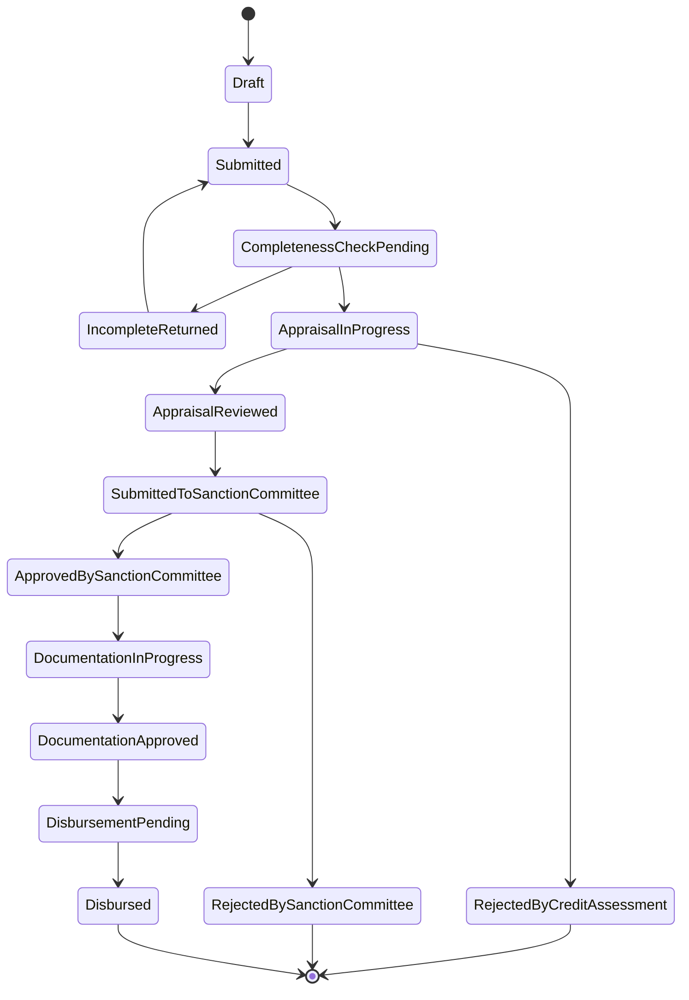
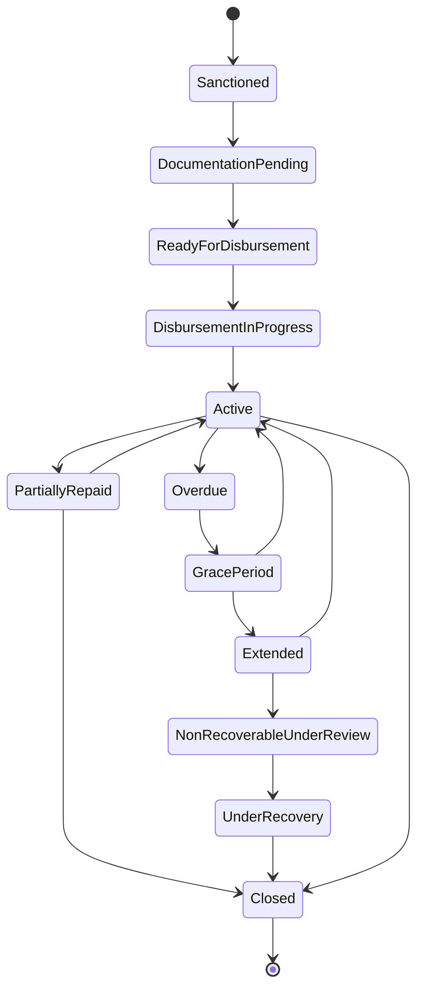
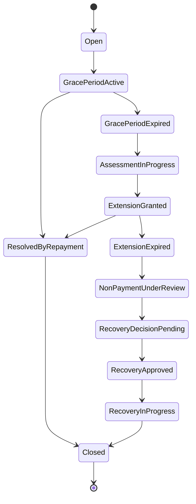

# Domain Model — SFPCL Member Credit Administration & Loan Disbursement System

## 1. Document Control

| Field | Value |
|---|---|
| Document name | `domain-model.md` |
| Product / System | SFPCL Member Credit Administration & Loan Disbursement Platform |
| Client | Sahyadri Farmers Producer Company Limited |
| Domain | Member lending, loan sanction, documentation, disbursement, repayment, monitoring, settlement and compliance |
| Source basis | Uploaded SOP documents and the current analysis set: client brief, user flows, functional specification, information architecture, screen specification, content specification, component specification and design system |
| Intended readers | Product owners, business analysts, solution architects, database designers, engineers, QA, implementation teams, compliance owners and auditors |
| Status | Draft implementation domain model |

---

## 2. Purpose

This document defines the business domain model for a digital system supporting SFPCL’s member credit administration process. It converts the current SOP analysis into an implementation-ready view of business objects, relationships, lifecycle states, rules, validations, derived values, integrations and reporting dimensions.

The model must support the full SOP lifecycle:

1. Member and borrower identification.
2. Active member eligibility.
3. Loan application intake.
4. KYC and document completeness.
5. Shareholding and agricultural land-based loan limit calculation.
6. Credit appraisal.
7. Sanction Committee approval.
8. Special case approval for director / Sanction Committee member / relative borrowing.
9. Legal documentation and stamping.
10. Security creation through PoA, SH-4, CDSL pledge and blank-dated cheque.
11. SAP customer code workflow.
12. RBL Bank disbursement workflow.
13. Direct and subsidiary-based repayment.
14. Interest invoicing, monthly accrual and interest capitalisation.
15. DPD monitoring and quarterly CFO MIS.
16. Default handling, extension, non-payment note and recovery approval.
17. Closure, NOC, security return and archival.
18. Statutory compliance tracking and audit evidence.

---

## 3. Domain Context

SFPCL is a Farmer Producer Company that provides credit facilities to eligible members. Borrowers may be individual farmer shareholders or Farmer Producer Companies / Producer Institutions. The system is not a generic loan origination platform; it is a compliance-first, member-only lending domain where eligibility depends on membership, active member status, shareholding, agriculture-related loan purpose, KYC, produce-supply relationship, landholding and default history.

The lending process contains six SOP stages:

| Stage | Name | Domain Meaning |
|---:|---|---|
| 1 | Initial Loan Request | Borrower submits application with nominee and basic KYC / supporting documents. |
| 2 | Credit Assessment | Eligibility, loan limit and appraisal note are prepared and reviewed. |
| 3 | Credit Scrutiny and Approval | Sanction Committee approves, rejects or records exceptions. |
| 4 | Documentation and Stamping | Legal and security documents are prepared, signed, stamped and verified. |
| 5 | Loan Disbursement | SAP customer code, bank verification and RBL transfer are completed. |
| 6 | Monitoring and Repayment | Repayment, interest, DPD, default handling, closure and archival occur. |

---

## 4. Bounded Contexts

| Bounded Context | Responsibility | Core Entities |
|---|---|---|
| Member Context | Members, borrowers, nominees, witness, shareholding, active status and produce supply. | Member, IndividualMemberProfile, ProducerInstitutionProfile, Nominee, Witness, Shareholding, ActiveMemberStatus, ProduceSupplyRecord |
| Application Context | Loan inquiry, application, reference number, completeness and deficiencies. | LoanApplication, LoanRequestRegisterEntry, ApplicationDocument, Deficiency, RejectionNote |
| Credit Context | Eligibility checks, loan limit calculation, appraisal and risk. | EligibilityAssessment, LoanLimitAssessment, LoanAppraisalNote, RiskAssessment, BorrowingHistory |
| Approval Context | Authority matrix, approvals, sanctions, exceptions and special cases. | SanctionCommittee, ApprovalMatrixRule, ApprovalCase, ApprovalAction, SanctionDecision, CreditSanctionRegisterEntry, ExceptionRegisterEntry |
| Documentation Context | Document generation, upload, verification, signatures, stamping and notarisation. | LoanDocument, DocumentChecklist, SignatureRecord, StampDutyRecord, NotarisationRecord |
| Security Context | Loan security instruments and their lifecycle. | SecurityPackage, PowerOfAttorney, SH4ShareTransferForm, CDSLSharePledge, BlankDatedCheque, CancelledCheque, BankVerificationLetter |
| Finance / SAP Context | SAP customer code, disbursement, repayment, interest, accrual and accounting references. | SAPCustomerProfileRequest, SAPCustomerCode, LoanAccount, Disbursement, Repayment, InterestInvoice, AccrualEntry |
| Monitoring Context | DPD, reminders, ageing and CFO MIS. | DPDStatus, Reminder, QuarterlyMIS, PortfolioSnapshot |
| Default / Recovery Context | Missed repayment, grace, extension, non-payment note and recovery. | DefaultCase, DefaultAssessment, ExtensionNote, NonPaymentNote, RecoveryDecision, RecoveryAction |
| Closure Context | Full repayment, NOC, security return and archive. | LoanClosure, NOC, SecurityReturn, ArchiveRecord |
| Compliance Context | Statutory controls, tasks, evidence and trackers. | ComplianceControl, ComplianceTask, Section186Tracker, NBFCPrincipalTest, KYCReview, ComplianceEvidence |
| Audit Context | Immutable activity trail and version history. | AuditLog, WorkflowEvent, VersionHistory |

---

## 5. Aggregate Roots

| Aggregate Root | Owns / Coordinates | Why It Is an Aggregate Root |
|---|---|---|
| `Member` | Profiles, nominee links, shareholding, active status, KYC status and borrowing history. | All lending eligibility starts with member-only lending. |
| `LoanApplication` | Application form, documents, deficiencies, eligibility, appraisal and sanction decision. | Main origination object before loan account creation. |
| `ApprovalCase` | Required approvers, individual actions, approval status and decision rationale. | Approval rules must be enforced consistently and audited. |
| `DocumentChecklist` | Document requirements, signing, stamping, notarisation and verification states. | Disbursement is gated by full document readiness. |
| `SecurityPackage` | PoA, SH-4 / CDSL pledge, blank cheque and security release / invocation. | Security instruments must move together with the loan lifecycle. |
| `LoanAccount` | Sanctioned terms, disbursement, repayments, interest, DPD and closure. | Servicing and monitoring occur after sanction / disbursement. |
| `DefaultCase` | Grace period, assessment, extension, non-payment note and recovery decision. | Default handling has a specific SOP cascade. |
| `ComplianceTask` | Compliance control, owner, due date, evidence and review. | Statutory controls need assigned evidence and periodic closure. |

---

# 6. Entity Catalogue

## 6.1 Party and Organisation Entities

| Entity | Description |
|---|---|
| Member | SFPCL shareholder / member eligible to apply for loans. |
| Borrower | Role played by a Member when applying for or holding a loan. |
| IndividualMemberProfile | Farmer-specific details for individual members. |
| ProducerInstitutionProfile | FPC / producer institution details. |
| Nominee | Nominee of borrower; must not be minor. |
| Witness | Existing SFPCL shareholder who witnesses documents. |
| User | Internal system user. |
| Team | Internal functional team such as Credit Assessment, Compliance, Treasury or Sanction Committee. |
| SubsidiaryCompany | Subsidiary involved in produce purchase and repayment deduction. |
| SanctionCommittee | CFO and two Executive Directors as decided by Board. |

## 6.2 Lending and Workflow Entities

| Entity | Description |
|---|---|
| LoanApplication | Borrower’s loan request with amount, purpose, nominee and supporting documents. |
| LoanRequestRegisterEntry | Official register entry with sequential application reference. |
| ApplicationDocument | Document submitted at application stage. |
| Deficiency | Missing / incorrect information in application. |
| RejectionNote | Formal rejection / deficiency communication. |
| EligibilityAssessment | Structured eligibility result. |
| LoanLimitAssessment | Shareholding-based and land-based loan limit calculation. |
| LoanAppraisalNote | Appraisal prepared by Deputy Manager – Finance and reviewed by Credit Manager. |
| SanctionDecision | Final approval / rejection by Sanction Committee. |
| LoanAccount | Live loan record after sanction and disbursement. |
| LoanTerms | Snapshot of term sheet and agreement terms. |
| RepaymentSchedule | Due dates and repayment amounts. |

## 6.3 Documentation and Security Entities

| Entity | Description |
|---|---|
| LoanDocument | Any generated or uploaded loan file document. |
| DocumentChecklist | Index and readiness control for all documents. |
| SignatureRecord | Signature requirement and verification record. |
| StampDutyRecord | Stamp paper / e-stamp compliance record. |
| NotarisationRecord | Notary completion record. |
| SecurityPackage | Combined security record for a loan. |
| PowerOfAttorney | PoA in favour of Company Secretary. |
| SH4ShareTransferForm | Security for physical shares. |
| CDSLSharePledge | Security for demat shares. |
| BlankDatedCheque | Cheque collected as security. |
| CancelledCheque | Cheque used to verify bank account details. |
| BankVerificationLetter | Bank confirmation where signature mismatch exists. |

## 6.4 Finance and Monitoring Entities

| Entity | Description |
|---|---|
| SAPCustomerProfileRequest | Request to create / confirm SAP customer code. |
| SAPCustomerCode | SAP customer identity linked to borrower. |
| Disbursement | Loan payout through RBL Bank account. |
| BankTransfer | Bank transfer authorisation and reference. |
| Repayment | Amount received directly or via subsidiary. |
| RepaymentAllocation | Split of repayment to principal, interest and charges. |
| InterestInvoice | Yearly interest invoice. |
| AccrualEntry | Monthly interest accrual entry. |
| InterestCapitalisation | Unpaid interest added to principal after 30 April. |
| DPDStatus | Days past due / ageing classification. |
| Reminder | SMS, phone, email or letter reminder. |
| QuarterlyMIS | CFO portfolio monitoring report. |

## 6.5 Default, Closure, Compliance and Audit Entities

| Entity | Description |
|---|---|
| DefaultCase | Default workflow opened after missed scheduled principal repayment. |
| DefaultAssessment | Intentional / non-intentional non-payment classification. |
| ExtensionNote | One-year extension documentation for non-intentional non-payment. |
| NonPaymentNote | Escalation note after extension failure. |
| RecoveryDecision | Approved decision to invoke security or other recovery action. |
| RecoveryAction | Execution of recovery action. |
| LoanClosure | Full closure / settlement record. |
| NOC | No Objection Certificate after full repayment. |
| SecurityReturn | Return of SH-4, blank cheque and unpledging of demat shares. |
| ArchiveRecord | Eight-year retention record for loan file. |
| ComplianceControl | Statutory / internal control definition. |
| ComplianceTask | Periodic compliance execution task. |
| ComplianceEvidence | Evidence attached to compliance task. |
| Section186Tracker | Quarterly Companies Act section 186 limit tracking. |
| NBFCPrincipalTest | Quarterly NBFC 50-50 principal business test. |
| KYCReview | Onboarding or two-year re-KYC review. |
| Grievance | Borrower complaint / issue record. |
| AuditLog | Immutable audit trail. |
| WorkflowEvent | Lifecycle transition record. |
| VersionHistory | SOP, rule, policy and template version record. |

---

# 7. Core Entity Specifications

## 7.1 Member

Represents an SFPCL member who may apply for credit.

### Key Attributes

| Attribute | Type | Required | Notes |
|---|---|---:|---|
| `member_id` | UUID | Yes | Internal unique ID. |
| `member_number` | String | Yes | Business member number if available. |
| `member_type` | Enum | Yes | `IndividualFarmer`, `FPC`, `ProducerInstitution`. |
| `legal_name` | String | Yes | Full legal name. |
| `folio_number` | String | Yes | Folio number of shares held. |
| `membership_status` | Enum | Yes | `Active`, `Inactive`, `Suspended`, `Closed`. |
| `active_member_status_id` | FK | Yes | Links active status assessment. |
| `pan` | String | Yes | PAN is mandatory. |
| `aadhaar` | String | Conditional | Required for individuals / nominees where applicable. |
| `registered_address` | Address | Yes | Required for application and SAP profile. |
| `mobile_number` | String | Yes | SMS and phone reminders. |
| `email` | String | Optional | Official communication. |
| `kyc_status` | Enum | Yes | `NotStarted`, `Incomplete`, `Verified`, `Expired`, `Rejected`. |
| `rekyc_due_date` | Date | Conditional | Two-year periodic re-KYC. |
| `default_status` | Enum | Yes | `NoDefault`, `ExistingDefault`, `PastDefaultClosed`, `UnderRecovery`. |

### Business Rules

- Only members may apply for SFPCL loans.
- Member must be active or eligible under active-member relaxation.
- Member must not be in default with SFPCL, subsidiary or associate company.
- PAN is mandatory.
- KYC must be complete before disbursement.
- The member record is the parent for applications, shareholding, loans, repayments and closure.

---

## 7.2 IndividualMemberProfile

Extends `Member` where `member_type = IndividualFarmer`.

| Attribute | Type | Required | Notes |
|---|---|---:|---|
| `individual_profile_id` | UUID | Yes | Unique profile ID. |
| `member_id` | FK | Yes | Parent member. |
| `date_of_birth` | Date | Optional | Used for age if available. |
| `gender` | Enum | Optional | Gender. |
| `land_area_under_cultivation` | Decimal | Conditional | Used for loan limit. |
| `primary_crop` | String | Optional | Crop linked to loan purpose. |
| `services_availed_flag` | Boolean | Yes | Whether company services were used. |
| `employment_or_service_years` | Decimal | Optional | Used for three-year service relaxation. |

### Active Member Rule for Individuals

An individual member must:

1. Avail services offered by SFPCL directly or indirectly, such as crop production, procurement, purchase or sale of agricultural inputs.
2. Supply primary produce for a continuous period of four financial years to SFPCL, subsidiaries, step-down subsidiaries or through a Producer Institution member supplying to these entities.

Relaxation applies where:

- The member has supplied produce for at least one year to SFPCL / subsidiaries / step-down subsidiaries / through Producer Institution route; or
- The Producer Member has provided employment or other services continuously for three years to SFPCL / subsidiaries / step-down subsidiaries.

---

## 7.3 ProducerInstitutionProfile

Extends `Member` where `member_type = FPC` or `ProducerInstitution`.

| Attribute | Type | Required | Notes |
|---|---|---:|---|
| `institution_profile_id` | UUID | Yes | Unique profile ID. |
| `member_id` | FK | Yes | Parent member. |
| `institution_type` | Enum | Yes | `FarmerProducerCompany`, `ProducerInstitution`, `OtherEligibleInstitution`. |
| `registration_number` | String | Optional | Corporate / registration number. |
| `authorised_signatory_name` | String | Yes | Signatory for loan documents. |
| `authorised_signatory_kyc_status` | Enum | Conditional | Required where institutional signing is digitised. |
| `services_availed_flag` | Boolean | Yes | Service usage status. |
| `produce_supply_years` | Decimal | Optional | Used for active-status logic. |

### Active Member Rule for Producer Institutions

A Producer Institution must:

1. Be a member of SFPCL.
2. Avail services offered by SFPCL directly or indirectly.
3. Supply primary produce continuously for four financial years to SFPCL, subsidiaries or step-down subsidiaries.

Relaxation applies if the institution has supplied produce for at least one year to SFPCL / subsidiaries / step-down subsidiaries.

---

## 7.4 Nominee

Represents nominee details captured with a loan application.

| Attribute | Type | Required | Notes |
|---|---|---:|---|
| `nominee_id` | UUID | Yes | Unique nominee ID. |
| `member_id` | FK | Yes | Linked borrower. |
| `loan_application_id` | FK | Conditional | Application-specific nominee snapshot. |
| `name` | String | Yes | Full name. |
| `age` | Integer | Yes | Must not be minor. |
| `aadhaar` | String | Yes | Required in loan application. |
| `pan` | String | Yes | Required in loan application. |
| `gender` | Enum | Yes | Captured in application. |
| `relationship_to_borrower` | String | Optional | Helpful for future workflows. |
| `kyc_document_status` | Enum | Yes | `Pending`, `Submitted`, `Verified`, `Rejected`. |

### Rules

- Nominee must sign the Loan Application Form.
- Nominee must sign PoA and Term Sheet where specified.
- Nominee must not be a minor.
- Nominee KYC must be collected with the application.

---

## 7.5 Witness

Represents the witness for legal documents.

| Attribute | Type | Required | Notes |
|---|---|---:|---|
| `witness_id` | UUID | Yes | Unique witness ID. |
| `loan_application_id` | FK | Yes | Related loan application. |
| `member_id` | FK | Conditional | Witness must be an existing SFPCL shareholder. |
| `name` | String | Yes | Witness name. |
| `pan_document_id` | FK | Yes | PAN copy. |
| `aadhaar_document_id` | FK | Yes | Aadhaar copy. |
| `shareholder_verified` | Boolean | Yes | Confirms witness is existing shareholder. |
| `signature_status` | Enum | Yes | `Pending`, `Signed`, `Rejected`. |

### Rules

- Witness must be an existing shareholder of SFPCL.
- Witness signs the Loan Agreement.
- Witness signs SH-4 for physical share security.
- Witness PAN and Aadhaar copies are collected during documentation.

---

## 7.6 Shareholding

Represents shares held by the borrower in SFPCL.

| Attribute | Type | Required | Notes |
|---|---|---:|---|
| `shareholding_id` | UUID | Yes | Unique ID. |
| `member_id` | FK | Yes | Shareholder. |
| `folio_number` | String | Yes | Folio number. |
| `number_of_shares` | Integer | Yes | Number of shares. |
| `holding_mode` | Enum | Yes | `Physical`, `Demat`, `Mixed`. |
| `valuation_per_share` | Decimal | Yes | Latest AGM-approved valuation. |
| `valuation_effective_date` | Date | Yes | Effective valuation date. |
| `pledged_share_count` | Integer | Optional | Shares already pledged. |
| `available_share_count` | Integer | Derived | Shares available. |
| `future_shares_pledge_flag` | Boolean | Optional | Future shares stand pledged if required. |

### Rules

- Shareholding is mandatory for loan eligibility.
- Shareholding is used to compute one of two loan limits.
- Physical shares require SH-4 security.
- Demat shares require CDSL pledge security.
- Future shares may stand pledged as part of security terms.

---

## 7.7 ShareValuation

Represents the yearly valuation used for loan limit calculation.

| Attribute | Type | Required | Notes |
|---|---|---:|---|
| `share_valuation_id` | UUID | Yes | Unique valuation record. |
| `financial_year` | String | Yes | Applicable FY. |
| `valuation_per_share` | Decimal | Yes | Value per share. |
| `valuation_method` | Enum | Yes | `NAVFairMarketValuation`. |
| `source_financials_status` | Enum | Yes | `Audited`, `ApprovedAtAGM`. |
| `agm_approval_date` | Date | Conditional | AGM date. |
| `loan_limit_percentage` | Decimal | Conditional | 10% or 30% once clarified. |
| `per_share_cap` | Decimal | Optional | Current analysis references ₹200 per share. |
| `board_approval_reference` | String | Yes | Approval reference. |
| `effective_from` | Date | Yes | Effective start. |
| `effective_to` | Date | Optional | Effective end. |
| `status` | Enum | Yes | `Draft`, `Approved`, `Superseded`. |

### Important Policy Ambiguity

The current analysis identifies an unresolved contradiction:

- The formula section states shareholding-based loan limit = number of shares × 30% of valuation per share.
- The valuation section states that 10% of share value is used.
- The current result of 10% valuation is referenced as ₹200 per share.

The system should implement this as a versioned configuration value and require final client confirmation before production.

---

## 7.8 LandHolding

Represents land evidence used for agricultural land-based loan limit.

| Attribute | Type | Required | Notes |
|---|---|---:|---|
| `land_holding_id` | UUID | Yes | Unique record. |
| `member_id` | FK | Yes | Borrower. |
| `document_type` | Enum | Yes | `7_12Extract`, `OtherLandDocument`. |
| `area_acres` | Decimal | Yes | Cultivated land area. |
| `crop_plan_id` | FK | Conditional | Linked crop plan. |
| `document_id` | FK | Yes | Uploaded document. |
| `verification_status` | Enum | Yes | `Pending`, `Verified`, `Rejected`. |

### Rules

- 7/12 extract or land document is required.
- Land area is used in the land-based limit formula.
- Current Scale of Finance is capped at ₹20,000 per acre unless revised by company.

---

## 7.9 CropPlan

Represents crop plan submitted by borrower.

| Attribute | Type | Required | Notes |
|---|---|---:|---|
| `crop_plan_id` | UUID | Yes | Unique crop plan. |
| `member_id` | FK | Yes | Borrower. |
| `loan_application_id` | FK | Conditional | Related loan. |
| `crop_type` | String | Yes | Crop being financed. |
| `planned_area_acres` | Decimal | Yes | Crop area. |
| `estimated_cost` | Decimal | Optional | Projected cultivation cost. |
| `loan_purpose_alignment` | Enum | Yes | `AgricultureAligned`, `NotAligned`, `NeedsReview`. |
| `verification_status` | Enum | Yes | `Pending`, `Verified`, `Rejected`. |

### Rules

- Loan purpose must relate to crop production and agriculture only.
- Crop plan must align with borrower’s declared purpose and landholding.

---

# 8. Application Domain

## 8.1 LoanApplication

Primary origination entity.

| Attribute | Type | Required | Notes |
|---|---|---:|---|
| `loan_application_id` | UUID | Yes | System ID. |
| `application_reference_number` | String | Yes | Sequential number, starts `LO00000001`. |
| `member_id` | FK | Yes | Borrower. |
| `application_channel` | Enum | Yes | `Offline`, `DigitalPortal`, `AssistedDigital`. |
| `application_date` | Date | Yes | Receipt date. |
| `received_by_user_id` | FK | Yes | Receiver, often Credit Manager. |
| `required_loan_amount` | Decimal | Yes | Amount requested. |
| `declared_purpose` | Text | Yes | Borrower-stated purpose. |
| `purpose_category` | Enum | Yes | `CropProduction`, `AgricultureActivity`, `Other`. |
| `nominee_id` | FK | Yes | Nominee. |
| `loan_type_requested` | Enum | Optional | `ShortTerm`, `LongTerm`, `NotSpecified`. |
| `completeness_status` | Enum | Yes | `Complete`, `Incomplete`, `PendingReview`. |
| `current_stage` | Enum | Yes | SOP stage 1-6. |
| `application_status` | Enum | Yes | Lifecycle state. |

### Status Values

| Status | Meaning |
|---|---|
| `Draft` | Application being prepared. |
| `Submitted` | Application submitted. |
| `CompletenessCheckPending` | Deputy Manager – Finance must check completeness. |
| `IncompleteReturned` | Returned with deficiencies. |
| `AppraisalInProgress` | Loan Appraisal Note being prepared. |
| `AppraisalReviewed` | Credit Manager reviewed note. |
| `SubmittedToSanctionCommittee` | Awaiting sanction. |
| `RejectedByCreditAssessment` | Rejected before sanction. |
| `RejectedBySanctionCommittee` | Rejected by committee. |
| `ApprovedBySanctionCommittee` | Approved for documentation. |
| `DocumentationInProgress` | Legal documents being prepared. |
| `DocumentationApproved` | Document file approved. |
| `DisbursementPending` | Ready for finance processing. |
| `Disbursed` | Loan paid to borrower. |
| `Cancelled` | Application cancelled. |

### Rules

- Application must be signed by applicant and nominee.
- Application must include folio number, share count, maximum permissible limit, requested amount and nominee details.
- Application may be offline or digital.
- Incomplete applications must be returned with a list of deficiencies.
- Every submitted application must be recorded in the Loan Request Register.

---

## 8.2 LoanRequestRegisterEntry

Official register maintained by Credit Manager.

| Attribute | Type | Required | Notes |
|---|---|---:|---|
| `loan_request_register_entry_id` | UUID | Yes | Unique row. |
| `application_reference_number` | String | Yes | Sequential reference. |
| `loan_application_id` | FK | Yes | Application. |
| `member_id` | FK | Yes | Borrower. |
| `date_received` | Date | Yes | Receipt date. |
| `received_channel` | Enum | Yes | Offline / digital. |
| `received_by_user_id` | FK | Yes | Responsible user. |
| `status` | Enum | Yes | Current register status. |

### Rules

- Reference number is entered in Loan Request Register and recorded on original application copy.
- Numbering begins at `LO00000001` and continues sequentially.

---

## 8.3 ApplicationDocument

Represents documents submitted with application.

| Attribute | Type | Required | Notes |
|---|---|---:|---|
| `application_document_id` | UUID | Yes | Unique ID. |
| `loan_application_id` | FK | Yes | Parent application. |
| `document_type` | Enum | Yes | PAN, Aadhaar, Share Certificate, 7/12, Crop Plan, Bank Statement, etc. |
| `party_type` | Enum | Yes | `Borrower`, `Nominee`, `Witness`, `Institution`, `Bank`. |
| `file_id` | FK | Yes | File reference. |
| `submission_status` | Enum | Yes | `Pending`, `Submitted`, `Returned`, `Waived`. |
| `verification_status` | Enum | Yes | `Pending`, `Verified`, `Rejected`, `Mismatch`. |
| `verified_by_user_id` | FK | Optional | Verifier. |

### Required Application Documents

- Borrower PAN card self-attested copy.
- Borrower Aadhaar card self-attested copy.
- Nominee PAN card copy.
- Nominee Aadhaar card copy.
- Share certificate copy.
- Land document / 7/12 extract.
- Crop plan.
- Recent bank statement for past six months.
- Signed Loan Application Form.

---

## 8.4 Deficiency and RejectionNote

### Deficiency Attributes

| Attribute | Type | Required | Notes |
|---|---|---:|---|
| `deficiency_id` | UUID | Yes | Unique deficiency. |
| `loan_application_id` | FK | Yes | Application. |
| `deficiency_type` | Enum | Yes | Missing document, invalid KYC, signature issue, invalid nominee, etc. |
| `description` | Text | Yes | Clear deficiency. |
| `resolution_status` | Enum | Yes | `Open`, `Resolved`, `Rejected`, `WaivedWithApproval`. |

### RejectionNote Attributes

| Attribute | Type | Required | Notes |
|---|---|---:|---|
| `rejection_note_id` | UUID | Yes | Unique note. |
| `loan_application_id` | FK | Yes | Application. |
| `rejection_stage` | Enum | Yes | `CreditAssessment`, `SanctionCommittee`. |
| `detailed_reason` | Text | Yes | Reason for rejection. |
| `reapply_allowed_flag` | Boolean | Yes | Borrower may reapply after fulfilling criteria. |
| `communication_mode` | Enum | Yes | `Email`, `Courier`, `Portal`, `HandDelivery`. |

---

# 9. Credit Assessment Domain

## 9.1 EligibilityAssessment

| Attribute | Type | Required | Notes |
|---|---|---:|---|
| `eligibility_assessment_id` | UUID | Yes | Unique assessment. |
| `loan_application_id` | FK | Yes | Application. |
| `member_active_check` | Enum | Yes | `Pass`, `Fail`, `Relaxation`, `NeedsReview`. |
| `default_check` | Enum | Yes | `NoDefault`, `DefaultFound`, `NeedsReview`. |
| `document_check` | Enum | Yes | `Complete`, `Incomplete`, `NeedsReview`. |
| `terms_acceptance_check` | Enum | Yes | `Accepted`, `Pending`, `Rejected`. |
| `purpose_check` | Enum | Yes | `AgricultureAligned`, `NotAligned`, `NeedsReview`. |
| `nominee_check` | Enum | Yes | `Valid`, `Minor`, `Incomplete`. |
| `overall_result` | Enum | Yes | `Eligible`, `Ineligible`, `ConditionallyEligible`, `NeedsReview`. |
| `assessed_by_user_id` | FK | Yes | Deputy Manager – Finance / Credit Manager. |

### Eligibility Conditions

1. Applicant must be active member of the FPC / company.
2. Applicant should not be in default for any FPC loan of SFPCL or subsidiary / associate company.
3. Applicant must submit land documents, KYC, bank statement and crop plan.
4. Applicant must agree to loan sanction terms as per Term Sheet and Loan Agreement.
5. Loan purpose must be crop production or agriculture activity only.

---

## 9.2 LoanLimitAssessment

| Attribute | Type | Required | Notes |
|---|---|---:|---|
| `loan_limit_assessment_id` | UUID | Yes | Unique calculation. |
| `loan_application_id` | FK | Yes | Application. |
| `number_of_shares` | Integer | Yes | Shares held. |
| `valuation_per_share` | Decimal | Yes | Approved valuation. |
| `share_limit_percentage` | Decimal | Yes | Configured value. |
| `per_share_cap` | Decimal | Optional | If cap applies. |
| `shareholding_based_limit` | Decimal | Yes | Computed value. |
| `land_area_acres` | Decimal | Yes | Cultivated area. |
| `scale_of_finance_per_acre` | Decimal | Yes | Currently ₹20,000 per acre unless revised. |
| `land_based_limit` | Decimal | Yes | Computed value. |
| `final_eligible_loan_amount` | Decimal | Yes | Lower of two limits. |
| `requested_amount` | Decimal | Yes | Borrower request. |
| `amount_within_limit_flag` | Boolean | Yes | True if request <= final eligible limit. |
| `exception_required_flag` | Boolean | Yes | True if requested amount exceeds permissible limit. |
| `calculation_version` | String | Yes | Rule version. |

### Formulas

```text
Shareholding-Based Limit = Number of Shares Held × Approved Percentage / Per-Share Cap Rule
```

```text
Agricultural Land-Based Limit = Per-Acre Cost of Cultivation × Farmer Land Area Under Cultivation
```

```text
Final Eligible Loan Amount = Lower of Shareholding-Based Limit and Agricultural Land-Based Limit
```

### Rules

- The lower of the two limits is the final eligible amount.
- If requested amount exceeds this limit, an exception approval is required.
- The calculation must preserve the policy configuration and valuation used at that time.

---

## 9.3 LoanAppraisalNote

| Attribute | Type | Required | Notes |
|---|---|---:|---|
| `loan_appraisal_note_id` | UUID | Yes | Unique note. |
| `loan_application_id` | FK | Yes | Application. |
| `prepared_by_user_id` | FK | Yes | Deputy Manager – Finance. |
| `reviewed_by_user_id` | FK | Yes | Credit Manager. |
| `prepared_at` | DateTime | Yes | Preparation timestamp. |
| `tat_due_at` | DateTime | Yes | Two-day TAT deadline. |
| `tat_status` | Enum | Yes | `WithinTAT`, `AtRisk`, `Breached`. |
| `eligibility_summary` | Text | Yes | Eligibility conclusion. |
| `loan_limit_summary` | Text | Yes | Limit conclusion. |
| `recommended_amount` | Decimal | Yes | Recommended loan amount. |
| `recommended_tenure` | String | Yes | Proposed tenure. |
| `risk_rating` | Enum | Optional | `Low`, `Medium`, `High`, `NeedsReview`. |
| `recommendation` | Enum | Yes | `Approve`, `Reject`, `ApproveWithConditions`, `Refer`. |

### Rules

- Must be prepared within two days from application receipt.
- Must be reviewed by Credit Manager before Sanction Committee submission.
- Must state borrower eligibility and loan limit.

---

# 10. Approval Domain

## 10.1 SanctionCommittee

| Attribute | Type | Required | Notes |
|---|---|---:|---|
| `sanction_committee_id` | UUID | Yes | Unique committee. |
| `cfo_user_id` | FK | Yes | CFO. |
| `director_user_ids` | FK Array | Yes | Two Executive Directors. |
| `board_meeting_reference` | String | Yes | Board decision reference. |
| `effective_from` | Date | Yes | Start date. |
| `status` | Enum | Yes | `Active`, `Superseded`, `Inactive`. |

### Rules

- Committee composition is decided in Board Meeting.
- If a committee member, director or relative is borrower, conflicted person is excluded from approval.
- If director / relative is borrower, members’ approval in general meeting is required.

---

## 10.2 ApprovalMatrixRule

| Scenario | Authority | Domain Rule |
|---|---|---|
| Loan up to ₹5,00,000 | CFO + one Director | Maker-checker mechanism; Credit Manager maker and Sanction Committee checker. |
| Loan above ₹5,00,000 | CFO + two Directors | Joint approval required in Credit Sanction Register. |
| Loan exceeding maximum permissible limit | CFO + two Directors | Reason recorded in Exception Register with joint approval. |
| Disbursement process initiation | Senior Manager – Finance | Verifies documentation and SAP posting before release. |
| Execution of security documents | Company Secretary | Acts under PoA for stamping, SH-4 and blank cheque handling. |

---

## 10.3 ApprovalCase and ApprovalAction

### ApprovalCase Attributes

| Attribute | Type | Required | Notes |
|---|---|---:|---|
| `approval_case_id` | UUID | Yes | Unique approval workflow. |
| `loan_application_id` | FK | Yes | Related application. |
| `approval_type` | Enum | Yes | `Sanction`, `Exception`, `Documentation`, `Disbursement`, `Recovery`, `Closure`. |
| `approval_matrix_rule_id` | FK | Yes | Applied rule. |
| `required_approvers` | FK Array | Yes | Required approver users. |
| `excluded_approvers` | FK Array | Optional | Conflict of interest exclusions. |
| `current_status` | Enum | Yes | `Pending`, `PartiallyApproved`, `Approved`, `Rejected`, `Returned`, `Cancelled`. |
| `reason_for_rejection` | Text | Conditional | Required if rejected. |

### ApprovalAction Attributes

| Attribute | Type | Required | Notes |
|---|---|---:|---|
| `approval_action_id` | UUID | Yes | Unique action. |
| `approval_case_id` | FK | Yes | Approval case. |
| `approver_user_id` | FK | Yes | Approver. |
| `decision` | Enum | Yes | `Approved`, `Rejected`, `ReturnedForClarification`, `Abstained`. |
| `comments` | Text | Conditional | Mandatory for rejection / return / abstention. |
| `acted_at` | DateTime | Yes | Timestamp. |

---

## 10.4 SanctionDecision, CreditSanctionRegister and ExceptionRegister

### SanctionDecision Attributes

| Attribute | Type | Required | Notes |
|---|---|---:|---|
| `sanction_decision_id` | UUID | Yes | Unique decision. |
| `loan_application_id` | FK | Yes | Application. |
| `approval_case_id` | FK | Yes | Approval case. |
| `decision` | Enum | Yes | `Sanctioned`, `Rejected`, `SanctionedWithConditions`. |
| `sanctioned_amount` | Decimal | Conditional | Required if sanctioned. |
| `sanctioned_tenure` | String | Conditional | Required if sanctioned. |
| `interest_rate_type` | Enum | Yes | `Floating`. |
| `repayment_date` | Date | Optional | As per Term Sheet. |
| `security_required` | Text / JSON | Yes | Security package requirements. |
| `decision_reason` | Text | Yes | Reason for approval or rejection. |

### CreditSanctionRegisterEntry

Records Sanction Committee decision, authority applied, approval / rejection reason and timestamp.

### ExceptionRegisterEntry

Captures policy deviations such as exceeding loan limit, stage bypass, document waiver, TAT breach, recovery exception or other deviations. Exceptions require approval and must remain auditable.

---

# 11. Documentation Domain

## 11.1 LoanDocument

| Attribute | Type | Required | Notes |
|---|---|---:|---|
| `loan_document_id` | UUID | Yes | Unique document. |
| `loan_application_id` | FK | Yes | Application. |
| `loan_account_id` | FK | Optional | Loan after creation. |
| `document_type` | Enum | Yes | Application, KYC, PoA, SH-4, Term Sheet, Loan Agreement, etc. |
| `document_category` | Enum | Yes | `KYC`, `Legal`, `Security`, `Financial`, `Compliance`, `Communication`. |
| `file_id` | FK | Optional | Generated / uploaded file. |
| `generation_status` | Enum | Yes | `NotGenerated`, `Generated`, `Uploaded`, `NotApplicable`. |
| `execution_status` | Enum | Yes | `PendingSignature`, `PartiallySigned`, `Signed`, `Rejected`. |
| `verification_status` | Enum | Yes | `Pending`, `Verified`, `Rejected`, `Mismatch`. |
| `stamp_status` | Enum | Optional | `NotRequired`, `Pending`, `Stamped`, `Insufficient`. |
| `notarisation_status` | Enum | Optional | `NotRequired`, `Pending`, `Notarised`, `Rejected`. |
| `custody_location` | String | Optional | Physical custody location. |
| `retention_until` | Date | Optional | Archive retention date. |

### Document Types

| Document | Key Requirement |
|---|---|
| Loan Application Form | Signed by applicant and nominee. |
| Borrower PAN / Aadhaar | Self-attested copies. |
| Nominee PAN / Aadhaar | Required; nominee cannot be minor. |
| Share certificate copy | Required for shareholding evidence. |
| 7/12 extract / land document | Required for land-based limit. |
| Crop plan | Required; must align with agricultural loan purpose. |
| Six-month bank statement | Required for application. |
| Witness PAN / Aadhaar | Required at documentation stage. |
| Cancelled cheque | Used to verify account details. |
| Blank-dated cheque | Held as security. |
| Power of Attorney | In favour of Company Secretary; ₹500 stamp paper; notarised; signed by farmer and nominee. |
| Tri-party agreement / declaration | Borrower + SFPCL + subsidiary repayment arrangement. |
| SH-4 | Required for physical shares; signed by borrower and witness. |
| CDSL pledge evidence | Required for demat shares. |
| Term Sheet | Signed by applicant and nominee. |
| Loan Agreement | ₹500 stamp paper; notarised; signed by applicant and witness. |
| Bank Verification Letter | Required if signature mismatch. |
| Checklist | Index of all documents and approvals. |
| Disbursement Advice | Sent after loan transfer. |
| Interest Invoice | Issued yearly. |
| NOC | Issued after full repayment. |

---

## 11.2 DocumentChecklist

| Attribute | Type | Required | Notes |
|---|---|---:|---|
| `document_checklist_id` | UUID | Yes | Unique checklist. |
| `loan_application_id` | FK | Yes | Application. |
| `checklist_status` | Enum | Yes | `Draft`, `InProgress`, `CSApproved`, `CreditManagerApproved`, `SanctionCommitteeApproved`, `ReadyForDisbursement`, `Disbursed`. |
| `company_secretary_signature_id` | FK | Optional | Confirms all documents verified and attached. |
| `credit_manager_signature_id` | FK | Optional | Confirms loan limits reviewed. |
| `sanction_committee_signature_id` | FK | Optional | Confirms final approval. |
| `senior_manager_finance_signature_id` | FK | Optional | Confirms disbursement completed. |

### Checklist Signature Meaning

| Signatory | Meaning |
|---|---|
| Company Secretary | All documents required for loan disbursement have been duly verified and attached. |
| Credit Manager | Loan disbursement limits have been reviewed and confirmed. |
| Sanction Committee | Final approval for loan disbursement as per authority matrix. |
| Senior Manager – Finance | Loan has been disbursed to applicant’s account. |

---

## 11.3 SignatureRecord, StampDutyRecord and NotarisationRecord

### SignatureRecord Rules

- Borrower signature is checked across PAN, cheque and KYC documents.
- If mismatch exists, either a Bank Verification Letter or a declaration on non-judicial stamp paper is required.
- Witness signatures are required on Loan Agreement and SH-4.
- Term Sheet is signed by applicant and nominee.
- Term Sheet must also be signed by CFO for loan below ₹5 lakh and by CFO + two Directors for loan above ₹5 lakh.

### StampDutyRecord Rules

- PoA must be on ₹500 stamp paper and notarised.
- Loan Agreement must be on ₹500 stamp paper and notarised.
- Disbursement cannot occur before required stamping is complete.

### NotarisationRecord Rules

- PoA and Loan Agreement must be notarised.
- Notarisation evidence must be retained with loan file.

---

# 12. Security Domain

## 12.1 SecurityPackage

| Attribute | Type | Required | Notes |
|---|---|---:|---|
| `security_package_id` | UUID | Yes | Unique package. |
| `loan_application_id` | FK | Yes | Application. |
| `loan_account_id` | FK | Optional | Loan after creation. |
| `security_status` | Enum | Yes | `Pending`, `PartiallyComplete`, `Complete`, `Invoked`, `Released`, `Closed`. |
| `physical_share_security_required` | Boolean | Yes | SH-4 required. |
| `demat_pledge_required` | Boolean | Yes | CDSL pledge required. |
| `poa_required` | Boolean | Yes | PoA required. |
| `blank_cheque_required` | Boolean | Yes | Security cheque. |
| `cancelled_cheque_required` | Boolean | Yes | Bank verification cheque. |

### Rules

- Security package must be complete before disbursement.
- Physical shareholding requires SH-4.
- Demat shareholding requires CDSL pledge.
- Blank-dated cheque is held as security and returned at closure unless invoked under approved recovery.

---

## 12.2 PowerOfAttorney

PoA authorises the Company Secretary to initiate sale of shares held in SFPCL if the borrower defaults.

| Attribute | Type | Required | Notes |
|---|---|---:|---|
| `poa_id` | UUID | Yes | Unique PoA. |
| `security_package_id` | FK | Yes | Security package. |
| `borrower_id` | FK | Yes | Member. |
| `nominee_id` | FK | Yes | Nominee. |
| `attorney_user_id` | FK | Yes | Company Secretary. |
| `stamp_duty_record_id` | FK | Yes | ₹500 stamp paper. |
| `notarisation_id` | FK | Yes | Notarised. |
| `status` | Enum | Yes | `Draft`, `Executed`, `Active`, `Invoked`, `Released`, `Revoked`. |

---

## 12.3 SH4ShareTransferForm

Required where shares are physically held.

| Attribute | Type | Required | Notes |
|---|---|---:|---|
| `sh4_id` | UUID | Yes | Unique SH-4. |
| `security_package_id` | FK | Yes | Security package. |
| `member_id` | FK | Yes | Shareholder. |
| `witness_id` | FK | Yes | Witness. |
| `shareholding_id` | FK | Yes | Shares secured. |
| `form_status` | Enum | Yes | `Pending`, `Signed`, `HeldInCustody`, `Invoked`, `Returned`, `Cancelled`. |
| `custody_location` | String | Yes | Physical custody. |

### Rules

- SH-4 is signed by shareholder and valid witness.
- Held as additional security.
- Returned upon closure.
- Must not be invoked without approval.

---

## 12.4 CDSLSharePledge

Required where shares are in demat form.

| Attribute | Type | Required | Notes |
|---|---|---:|---|
| `cdsl_pledge_id` | UUID | Yes | Unique pledge record. |
| `pledgor_member_id` | FK | Yes | Borrower. |
| `pledgee_entity_id` | FK | Yes | SFPCL. |
| `pledgor_bo_account` | String | Yes | Pledgor BO account. |
| `pledgee_bo_account` | String | Yes | Pledgee BO account. |
| `prf_status` | Enum | Yes | Pledge Request Form status. |
| `pledge_sequence_number` | String | Optional | PSN generated by depository system. |
| `pledge_acceptance_status` | Enum | Yes | `Pending`, `Accepted`, `Rejected`. |
| `pledge_status` | Enum | Yes | `Pending`, `Created`, `Invoked`, `Unpledged`, `Rejected`. |

### CDSL Pledge Rules

1. Pledgor and pledgee must have BO accounts with CDSL.
2. Pledgor submits Pledge Request Form in duplicate to DP.
3. Pledgor DP sets pledge request in depository system and PSN is generated.
4. Pledgee DP accepts or rejects request.
5. Pledge is created after pledgee DP acceptance.
6. Loan agreement and disbursement remain outside depository system.
7. If default occurs, pledgee may invoke pledge through Invocation Request Form.
8. Invocation does not require pledgor confirmation.
9. After loan repayment, shares can be unpledged through URF or auto-unpledged by pledgee.

---

## 12.5 BlankDatedCheque and CancelledCheque

### BlankDatedCheque

| Attribute | Type | Required | Notes |
|---|---|---:|---|
| `blank_cheque_id` | UUID | Yes | Unique cheque. |
| `member_id` | FK | Yes | Borrower. |
| `bank_account_id` | FK | Yes | Borrower bank account. |
| `cheque_number` | String | Optional | Cheque number. |
| `cheque_status` | Enum | Yes | `Collected`, `Held`, `Invoked`, `Presented`, `Returned`, `Cancelled`. |
| `invocation_approval_case_id` | FK | Conditional | Required before presentation. |

Rules:

- Held as security.
- In case of default, lender may insert date and present cheque for recovery after proper approval.
- Returned on full repayment if not invoked.

### CancelledCheque

Used to verify account number, IFSC and branch for disbursement.

---

# 13. Loan Account, Disbursement and Repayment Domain

## 13.1 LoanAccount

| Attribute | Type | Required | Notes |
|---|---|---:|---|
| `loan_account_id` | UUID | Yes | Unique loan. |
| `loan_application_id` | FK | Yes | Source application. |
| `loan_account_number` | String | Yes | Business loan number. |
| `member_id` | FK | Yes | Borrower. |
| `sap_customer_code_id` | FK | Conditional | SAP linkage. |
| `sanctioned_amount` | Decimal | Yes | Approved amount. |
| `disbursed_amount` | Decimal | Conditional | Actual disbursement. |
| `loan_type` | Enum | Yes | `ShortTerm`, `LongTerm`. |
| `tenure_start_date` | Date | Yes | Usually disbursement date. |
| `tenure_end_date` | Date | Yes | Repayment / maturity. |
| `interest_rate_type` | Enum | Yes | `Floating`. |
| `current_interest_rate` | Decimal | Optional | Configured rate. |
| `principal_outstanding` | Decimal | Yes | Current principal. |
| `interest_outstanding` | Decimal | Yes | Current unpaid interest. |
| `total_outstanding` | Decimal | Derived | Principal + interest + charges. |
| `loan_status` | Enum | Yes | Current lifecycle state. |

### Loan Status Values

`Sanctioned`, `DocumentationPending`, `ReadyForDisbursement`, `DisbursementInProgress`, `Active`, `PartiallyRepaid`, `Overdue`, `GracePeriod`, `Extended`, `NonRecoverableUnderReview`, `UnderRecovery`, `Closed`, `Cancelled`.

### Rules

- Short-term loan means one-year loan.
- Long-term loan means other tenures, subject to legal limits.
- Loan tenure is specified from date of disbursement.
- Company may extend tenure at its sole discretion.
- Floating interest rate changes are communicated through SMS / email.

---

## 13.2 SAPCustomerProfileRequest and SAPCustomerCode

### SAPCustomerProfileRequest Required Data

- Farmer full name.
- Aadhaar number.
- PAN number.
- Address.
- Email ID.
- Assigned loan application number.

### Rules

- SAP customer code is created after Sanction Committee approval.
- Credit Manager sends official email to Senior Manager – Finance.
- Senior Manager – Finance confirms customer code creation by formal email.
- First-time borrower gets new SAP Customer ID.
- Borrower with existing outstanding loan continues existing Customer ID.

---

## 13.3 Disbursement

| Attribute | Type | Required | Notes |
|---|---|---:|---|
| `disbursement_id` | UUID | Yes | Unique disbursement. |
| `loan_account_id` | FK | Yes | Loan. |
| `disbursement_amount` | Decimal | Yes | Amount. |
| `borrower_bank_account_id` | FK | Yes | Beneficiary account. |
| `source_bank_account` | Enum / FK | Yes | SFPCL RBL Bank account. |
| `initiated_by_user_id` | FK | Yes | Senior Manager – Finance. |
| `authorised_by_user_id` | FK | Yes | Chief Financial Controller. |
| `bank_transfer_status` | Enum | Yes | `Pending`, `Processing`, `Successful`, `Failed`, `Reversed`. |
| `bank_reference_number` | String | Optional | Bank UTR/reference. |
| `disbursed_at` | DateTime | Optional | Actual transfer time. |

### Rules

- Final approval and checklist must be complete.
- Senior Manager – Finance initiates online payment through RBL Bank account.
- Chief Financial Controller authorises the transfer.
- Loan register is updated and disbursement advice is sent after payment.

---

## 13.4 Repayment and Allocation

### Repayment Attributes

| Attribute | Type | Required | Notes |
|---|---|---:|---|
| `repayment_id` | UUID | Yes | Unique receipt. |
| `loan_account_id` | FK | Yes | Loan. |
| `repayment_source` | Enum | Yes | `DirectFarmer`, `SubsidiaryDeduction`. |
| `amount_received` | Decimal | Yes | Receipt amount. |
| `received_date` | Date | Yes | Receipt date. |
| `payment_method` | Enum | Yes | `RTGS`, `NEFT`, `SubsidiaryTransfer`, `Other`. |
| `subsidiary_company_id` | FK | Conditional | Required for subsidiary deduction. |
| `sap_posting_status` | Enum | Yes | `Pending`, `Posted`, `Failed`. |
| `allocation_status` | Enum | Yes | `Pending`, `Allocated`, `PartiallyAllocated`, `Rejected`. |

### Repayment Rules

- Direct repayment is through RTGS / NEFT.
- Partial repayment is adjusted against principal first.
- SAP entry for direct repayment is posted next working day after confirmation.
- Subsidiary deduction is governed by tri-party agreement.
- Subsidiary deducts principal, interest or other dues from produce payment and transfers to SFPCL.
- Bank statement should clearly include borrower name and loan application number.

---

## 13.5 InterestInvoice, AccrualEntry and InterestCapitalisation

### Rules

- Interest is floating and changes based on bank rates.
- Interest changes are communicated by SMS / email.
- Interest invoices are generated yearly.
- Monthly SAP accrual entries are required.
- If farmer cannot pay interest up to 30 April of next financial year, unpaid interest is added to principal at beginning of the next financial year.
- New interest is calculated on revised principal.
- Borrower is informed through official email and hard copy intimation letter.

### Important Ownership Clarification

The analysis contains a possible responsibility conflict:

- One process states Sales Team prepares and issues year-end interest invoices.
- Another section assigns Credit Manager responsibility for yearly interest invoices.

The domain model should support a configurable owner until the client confirms the final operating model.

---

# 14. Monitoring and Default Domain

## 14.1 DPDStatus

| Attribute | Type | Required | Notes |
|---|---|---:|---|
| `dpd_status_id` | UUID | Yes | Unique DPD status. |
| `loan_account_id` | FK | Yes | Loan. |
| `as_of_date` | Date | Yes | Reporting date. |
| `days_past_due` | Integer | Yes | Days overdue. |
| `sop_bucket` | Enum | Yes | `Current`, `OneToTwoYears`, `TwoToThreeYears`, `MoreThanThreeYears`. |
| `standard_bucket` | Enum | Optional | `0_30`, `31_60`, `61_90`, `Over90` if needed. |
| `principal_overdue` | Decimal | Yes | Principal overdue. |
| `interest_overdue` | Decimal | Yes | Interest overdue. |

### Rules

- Credit Manager classifies loans by DPD bucket.
- Quarterly MIS is presented to CFO.
- Reminders are sent by SMS / phone where loans remain outstanding beyond one year at quarter-end.

---

## 14.2 QuarterlyMIS

Includes:

- Active loans.
- Total sanctioned amount.
- Total disbursed amount.
- Principal outstanding.
- Interest outstanding.
- Overdue amount.
- DPD bucket distribution.
- Loans outstanding beyond one year.
- Default cases.
- Extension cases.
- Recovery cases.
- Closed loans.
- Exceptions.
- Compliance alerts.

---

## 14.3 DefaultCase

| Attribute | Type | Required | Notes |
|---|---|---:|---|
| `default_case_id` | UUID | Yes | Unique case. |
| `loan_account_id` | FK | Yes | Loan. |
| `trigger_event` | Enum | Yes | `MissedPrincipalRepayment`, `InterestOverdue`, `ManualReview`. |
| `scheduled_due_date` | Date | Yes | Missed due date. |
| `grace_period_start` | Date | Yes | Due date. |
| `grace_period_end` | Date | Yes | Due date + three months. |
| `default_case_status` | Enum | Yes | Lifecycle status. |

### Default Lifecycle

1. Borrower misses scheduled principal repayment.
2. SFPCL provides three-month grace period.
3. If still unpaid, Credit Assessment Team assesses reason.
4. Team classifies non-payment as intentional or non-intentional.
5. If non-intentional, one-year extension is granted.
6. Credit Manager prepares extension note and keeps it in loan file.
7. If still unpaid after one year, loan is scrutinised as not recoverable.
8. Credit Assessment Team prepares Note for Non-Payment.
9. Sanction Committee decides recovery action.
10. Security may be invoked only after approval.

---

## 14.4 DefaultAssessment, ExtensionNote, NonPaymentNote and RecoveryDecision

### DefaultAssessment

Captures intentional / non-intentional non-payment classification, reason, evidence, borrower interaction and recommended action.

### ExtensionNote

Documents one-year extension for non-intentional default. It includes reason, start date, end date, preparer and approval status.

### NonPaymentNote

Prepared when borrower remains unpaid after one-year extension. It includes reason, outstanding principal, interest, intentionality assessment and recommended recovery action.

### RecoveryDecision

Sanction Committee decision to:

- Invoke SH-4.
- Invoke CDSL pledge.
- Present blank-dated cheque.
- Provide further action / no action.
- Take other approved recovery steps.

Recovery decision must be auditable and linked to approval actions.

---

# 15. Closure Domain

## 15.1 LoanClosure

| Attribute | Type | Required | Notes |
|---|---|---:|---|
| `loan_closure_id` | UUID | Yes | Unique closure. |
| `loan_account_id` | FK | Yes | Loan. |
| `closure_type` | Enum | Yes | `FullRepayment`, `RecoverySettlement`, `WriteOff`, `CancelledBeforeDisbursement`. |
| `principal_paid_flag` | Boolean | Yes | Principal fully paid. |
| `interest_paid_flag` | Boolean | Yes | Interest fully paid. |
| `closed_by_user_id` | FK | Yes | Responsible user. |
| `closed_at` | DateTime | Yes | Closure timestamp. |
| `noc_id` | FK | Conditional | Required for full repayment. |
| `security_return_id` | FK | Conditional | Required for normal closure. |
| `archive_record_id` | FK | Conditional | Required. |

### Rules

- Full repayment triggers NOC issuance.
- Compliance Team issues NOC.
- SH-4 and blank-dated cheque are returned.
- Demat shares are unpledged.
- Loan documents are archived for at least eight years.

## 15.2 SecurityReturn

Tracks return of:

- SH-4 form.
- Blank-dated cheque.
- CDSL unpledge completion.
- PoA release / closure.
- Borrower acknowledgement.

## 15.3 ArchiveRecord

Tracks physical and digital archive location, retention start date, retention until date and destruction eligibility. Minimum retention is eight years.

---

# 16. Compliance Domain

## 16.1 ComplianceControl

| Control Area | Owner | Frequency | Evidence |
|---|---|---|---|
| Producer Company lending to members | CS and Credit Manager | Ongoing | Loan Register, Membership Register, Board-approved policy |
| Section 186 loan limits | CFO | Quarterly | Limit calculation tracker |
| NBFC principal business test | CFO | Quarterly | Asset and income ratio calculation, Board note |
| KYC / AML | Credit Head | Onboarding and every two years | KYC checklist, CKYC / KYC files |
| Interest and charges disclosure | CS and Credit Officer | At sanction and rate change | Signed Term Sheet, borrower acknowledgement |
| Stamp duty | Company Secretary | At execution | Stamped documents, stamp purchase records |
| Money-lending law review | Company Secretary | Annual | Legal opinion / Board note |
| Accounting and reporting | Accounts Head | Monthly / quarterly | SAP reports, accrual entries, Board pack |
| Recovery conduct and grievance | CS and Credit Head | Ongoing | Call / visit logs, grievance register |
| Data protection | IT Head and CS | Quarterly | Access logs, review evidence |
| Record retention and audit | CS and Internal Auditor | Annual | Archive logs, audit report |

## 16.2 Section186Tracker

Tracks paid-up capital, free reserves, securities premium, 60% limit, 100% limit, applicable limit, exposure and whether special resolution is required.

## 16.3 NBFCPrincipalTest

Tracks financial assets / total assets and financial income / gross income. If both ratios exceed 50%, NBFC registration risk is triggered. Quarterly calculation must be documented and presented to Board.

## 16.4 KYCReview

Supports onboarding KYC and two-year periodic re-KYC. Stores due date, completion date, before / after status, reviewer and evidence.

---

# 17. Communication and Grievance Domain

## 17.1 Communication

Represents SMS, email, phone, courier, portal or hard copy letter communication.

Common communication events:

- Application acknowledgement with reference number.
- Deficiency / incomplete application communication.
- Rejection Note.
- Sanction approval and next steps.
- Document pending reminder.
- Interest rate change SMS / email.
- Disbursement advice.
- Repayment reminder.
- Interest invoice issue.
- Interest capitalisation intimation by email and hard copy.
- Default notice.
- Extension communication.
- NOC communication.

## 17.2 Grievance

Captures borrower complaints related to application, sanction, disbursement, repayment, recovery, data privacy, document return or other issues. Company Secretary maintains grievance log, and the system should capture category, description, received channel, owner, resolution due date, status and resolution summary.

---

# 18. Audit and Versioning Domain

## 18.1 AuditLog

All high-risk actions must be audit logged:

- Application submission.
- Reference number generation.
- Deficiency creation and resolution.
- Eligibility result.
- Loan limit calculation.
- Appraisal preparation and review.
- Approval actions.
- Rejection decisions.
- Document generation and verification.
- Stamping and notarisation completion.
- Checklist approvals.
- SAP customer code confirmation.
- Disbursement initiation and authorisation.
- Repayment posting and allocation.
- Interest invoice and capitalisation.
- DPD bucket changes.
- Default case opening.
- Extension and non-payment notes.
- Recovery decision and security invocation.
- NOC issuance.
- Security return.
- Archive completion.
- Compliance task closure.

Audit logs should be immutable and retain actor, timestamp, entity, action, old value and new value where applicable.

## 18.2 VersionHistory

Versioned objects include:

- SOP / policy manual.
- Loan policy configuration.
- Share valuation.
- Scale of Finance.
- Interest rate configuration.
- Approval matrix.
- Document templates.
- Content templates.
- Compliance controls.

Every SOP / policy change must be Board approved and revision history must capture version, date, author, reviewer, approver and change note.

---

# 19. Configuration Entities

## 19.1 LoanPolicyConfig

| Attribute | Purpose |
|---|---|
| `approval_threshold_amount` | Current threshold ₹5,00,000. |
| `scale_of_finance_per_acre` | Current cap ₹20,000 per acre. |
| `share_limit_percentage` | Configurable due to 10% / 30% ambiguity. |
| `per_share_cap` | Configurable, currently referenced as ₹200. |
| `interest_rate_type` | Floating. |
| `interest_benchmark` | To be confirmed. |
| `penal_interest_rate` | To be confirmed. |
| `rekyc_frequency_months` | 24 months. |
| `record_retention_years` | 8 years. |
| `grace_period_months` | 3 months. |
| `non_intentional_extension_months` | 12 months. |
| `board_approval_reference` | Required for policy changes. |

## 19.2 InterestRateConfig

Supports floating interest setup, effective rate, benchmark, spread, effective dates and borrower communication requirement.

## 19.3 ScaleOfFinanceConfig

Stores annual per-acre cultivation cost / cap. Current cap is ₹20,000 per acre.

## 19.4 ApprovalMatrixConfig

Stores amount thresholds, approver roles, joint approval requirements, exception rules and effective dates.

---

# 20. Relationship Model

## 20.1 Entity Relationship Diagram

```mermaid
erDiagram
    MEMBER ||--o{ LOAN_APPLICATION : submits
    MEMBER ||--o{ SHAREHOLDING : holds
    MEMBER ||--o{ NOMINEE : has
    MEMBER ||--o{ LAND_HOLDING : provides
    MEMBER ||--o{ PRODUCE_SUPPLY_RECORD : supplies
    MEMBER ||--o{ LOAN_ACCOUNT : borrows

    LOAN_APPLICATION ||--|| LOAN_REQUEST_REGISTER_ENTRY : recorded_as
    LOAN_APPLICATION ||--o{ APPLICATION_DOCUMENT : contains
    LOAN_APPLICATION ||--o{ DEFICIENCY : may_have
    LOAN_APPLICATION ||--o| REJECTION_NOTE : may_generate
    LOAN_APPLICATION ||--|| ELIGIBILITY_ASSESSMENT : assessed_by
    LOAN_APPLICATION ||--|| LOAN_LIMIT_ASSESSMENT : calculated_by
    LOAN_APPLICATION ||--o| LOAN_APPRAISAL_NOTE : appraised_by
    LOAN_APPLICATION ||--o{ APPROVAL_CASE : requires
    LOAN_APPLICATION ||--o| SANCTION_DECISION : receives
    LOAN_APPLICATION ||--o| DOCUMENT_CHECKLIST : requires
    LOAN_APPLICATION ||--o| SECURITY_PACKAGE : secures

    APPROVAL_CASE ||--o{ APPROVAL_ACTION : contains
    SANCTION_DECISION ||--|| CREDIT_SANCTION_REGISTER_ENTRY : recorded_in
    APPROVAL_CASE ||--o| EXCEPTION_REGISTER_ENTRY : may_record

    DOCUMENT_CHECKLIST ||--o{ LOAN_DOCUMENT : indexes
    LOAN_DOCUMENT ||--o{ SIGNATURE_RECORD : requires
    LOAN_DOCUMENT ||--o| STAMP_DUTY_RECORD : may_require
    LOAN_DOCUMENT ||--o| NOTARISATION_RECORD : may_require

    SECURITY_PACKAGE ||--o| POWER_OF_ATTORNEY : contains
    SECURITY_PACKAGE ||--o| SH4_SHARE_TRANSFER_FORM : contains
    SECURITY_PACKAGE ||--o| CDSL_SHARE_PLEDGE : contains
    SECURITY_PACKAGE ||--o| BLANK_DATED_CHEQUE : contains

    SANCTION_DECISION ||--o| LOAN_ACCOUNT : creates
    LOAN_ACCOUNT ||--|| LOAN_TERMS : governed_by
    LOAN_ACCOUNT ||--o{ REPAYMENT_SCHEDULE : has
    LOAN_ACCOUNT ||--o{ DISBURSEMENT : disbursed_by
    LOAN_ACCOUNT ||--o{ REPAYMENT : receives
    REPAYMENT ||--o{ REPAYMENT_ALLOCATION : allocated_as
    LOAN_ACCOUNT ||--o{ INTEREST_INVOICE : billed_by
    LOAN_ACCOUNT ||--o{ ACCRUAL_ENTRY : accrues
    LOAN_ACCOUNT ||--o{ DPD_STATUS : monitored_by
    LOAN_ACCOUNT ||--o{ DEFAULT_CASE : may_have
    LOAN_ACCOUNT ||--o| LOAN_CLOSURE : closes_with

    DEFAULT_CASE ||--o{ DEFAULT_ASSESSMENT : assessed_by
    DEFAULT_CASE ||--o| EXTENSION_NOTE : may_receive
    DEFAULT_CASE ||--o| NON_PAYMENT_NOTE : may_generate
    DEFAULT_CASE ||--o| RECOVERY_DECISION : resolved_by
    RECOVERY_DECISION ||--o{ RECOVERY_ACTION : executes

    LOAN_CLOSURE ||--o| NOC : issues
    LOAN_CLOSURE ||--o| SECURITY_RETURN : returns
    LOAN_CLOSURE ||--o| ARCHIVE_RECORD : archives
```



## 20.2 Cardinality Summary

| Relationship | Cardinality | Notes |
|---|---:|---|
| Member to LoanApplication | 1:N | A member may apply multiple times. |
| LoanApplication to LoanAccount | 1:0..1 | Only sanctioned / disbursed applications become loan accounts. |
| Member to LoanAccount | 1:N | Member may have multiple loans; SAP customer code is reused. |
| LoanApplication to Nominee | N:1 or 1:1 snapshot | Application stores nominee details. |
| LoanApplication to AppraisalNote | 1:0..1 | One note per application. |
| LoanApplication to SanctionDecision | 1:0..1 | One final sanction decision. |
| ApprovalCase to ApprovalAction | 1:N | Multiple approvers. |
| DocumentChecklist to LoanDocument | 1:N | Checklist indexes documents. |
| SecurityPackage to SecurityInstrument | 1:N | PoA, SH-4/CDSL, blank cheque. |
| LoanAccount to Repayment | 1:N | Multiple repayments. |
| Repayment to RepaymentAllocation | 1:N | Allocated to principal, interest, charges. |
| LoanAccount to DefaultCase | 1:N | Multiple default events possible. |
| LoanAccount to LoanClosure | 1:0..1 | One closure record. |
| ComplianceControl to ComplianceTask | 1:N | Periodic tasks. |

---

# 21. Lifecycle State Machines

## 21.1 Loan Application Lifecycle



## 21.2 Loan Account Lifecycle



## 21.3 Default Lifecycle



---

# 22. Derived Fields and Computed Values

| Field | Formula / Logic |
|---|---|
| `nominee_is_minor` | Nominee age below legal majority threshold. |
| `shareholding_based_limit` | Shares held × configured percentage / per-share cap rule. |
| `land_based_limit` | Scale of Finance per acre × land area under cultivation. |
| `final_eligible_loan_amount` | Lower of shareholding-based limit and land-based limit. |
| `amount_within_limit_flag` | Requested amount <= final eligible amount. |
| `exception_required_flag` | Requested amount > final eligible amount or other policy deviation. |
| `approval_route` | Based on amount, exception flag and special borrower flags. |
| `loan_type` | Short-term if one year; long-term otherwise. |
| `principal_outstanding` | Disbursed principal - principal repayments + capitalised interest. |
| `interest_outstanding` | Accrued / invoiced interest - interest repayments. |
| `total_outstanding` | Principal + interest + charges. |
| `days_past_due` | As-of date - earliest unpaid due date. |
| `dpd_bucket` | Based on SOP ageing bucket and optional standard DPD bucket. |
| `rekyc_due_date` | Last KYC verification + 24 months. |
| `retention_until_date` | Closure / archive date + 8 years. |
| `nbfc_asset_ratio` | Financial assets / total assets. |
| `nbfc_income_ratio` | Financial income / gross income. |
| `section186_applicable_limit` | Higher of 60% formula and 100% formula. |

---

# 23. Key Business Rules

## 23.1 Member and Eligibility Rules

| Rule ID | Rule |
|---|---|
| BR-MEM-001 | Only SFPCL members may apply for loans. |
| BR-MEM-002 | Borrower must be active or eligible under relaxation rules. |
| BR-MEM-003 | Borrower must not be in default for any SFPCL, subsidiary or associate company loan. |
| BR-MEM-004 | Nominee is mandatory and must not be a minor. |
| BR-MEM-005 | Loan purpose must be crop production or agriculture activity only. |
| BR-MEM-006 | KYC documents are required for borrower and nominee. |
| BR-MEM-007 | Witness must be existing SFPCL shareholder. |

## 23.2 Application Rules

| Rule ID | Rule |
|---|---|
| BR-APP-001 | Every application must receive a unique sequential reference number starting `LO00000001`. |
| BR-APP-002 | Application must be signed by applicant and nominee. |
| BR-APP-003 | Incomplete applications must be returned with deficiencies. |
| BR-APP-004 | Borrower may reapply after fulfilling rejection criteria. |
| BR-APP-005 | No stage may be bypassed without documented CFO approval. |

## 23.3 Credit and Approval Rules

| Rule ID | Rule |
|---|---|
| BR-CRD-001 | Loan Appraisal Note must be prepared within two days. |
| BR-CRD-002 | Final eligible loan amount is lower of shareholding and land-based limits. |
| BR-CRD-003 | Current Scale of Finance cap is ₹20,000 per acre unless revised. |
| BR-APR-001 | Up to ₹5 lakh requires CFO + one Director. |
| BR-APR-002 | Above ₹5 lakh requires CFO + two Directors. |
| BR-APR-003 | Exceeding permissible limit requires CFO + two Directors and Exception Register reason. |
| BR-APR-004 | Sanction decisions must be recorded in Credit Sanction Register. |
| BR-APR-005 | Director / relative borrower requires conflicted approver exclusion and members’ approval in general meeting. |

## 23.4 Documentation and Disbursement Rules

| Rule ID | Rule |
|---|---|
| BR-DOC-001 | Documentation begins only after Sanction Committee approval. |
| BR-DOC-002 | PoA must be on ₹500 stamp paper and notarised. |
| BR-DOC-003 | Loan Agreement must be on ₹500 stamp paper and notarised. |
| BR-DOC-004 | SH-4 is required for physical shares. |
| BR-DOC-005 | CDSL pledge is required for demat shares. |
| BR-DOC-006 | Signature mismatch requires Bank Verification Letter or non-judicial declaration. |
| BR-DOC-007 | Disbursement cannot occur before documentation, stamping and checklist approvals. |
| BR-DIS-001 | SAP customer code is created after sanction. |
| BR-DIS-002 | Senior Manager – Finance initiates disbursement. |
| BR-DIS-003 | Chief Financial Controller authorises bank transfer. |

## 23.5 Repayment, Default and Closure Rules

| Rule ID | Rule |
|---|---|
| BR-REP-001 | Direct repayment occurs through RTGS / NEFT. |
| BR-REP-002 | Subsidiary repayment is governed by tri-party agreement. |
| BR-REP-003 | Partial repayment is adjusted to principal first. |
| BR-REP-004 | If interest remains unpaid by 30 April, it is added to principal. |
| BR-DEF-001 | Missed scheduled principal repayment triggers three-month grace period. |
| BR-DEF-002 | Non-intentional default gets one-year extension. |
| BR-DEF-003 | After extension failure, Non-Payment Note is prepared. |
| BR-DEF-004 | Recovery action requires approval before invoking security. |
| BR-CLO-001 | Full repayment triggers NOC. |
| BR-CLO-002 | SH-4, blank cheque and CDSL pledge must be returned / released on closure. |
| BR-CLO-003 | Loan records are retained for at least eight years. |

---

# 24. Data Validation Rules

| Area | Validation |
|---|---|
| PAN | Required; format validation; masked in most UI views. |
| Aadhaar | Required where applicable; masked by default. |
| Nominee age | Must not be minor. |
| Application amount | Must be positive. |
| Loan purpose | Must be agriculture / crop-production aligned. |
| Loan limit | Must be calculated from active policy configuration. |
| Share valuation | Must use active AGM-approved valuation. |
| Scale of Finance | Must use active annual configuration. |
| Witness | Must be existing SFPCL shareholder. |
| PoA | Requires ₹500 stamp and notarisation. |
| Loan Agreement | Requires ₹500 stamp and notarisation. |
| SH-4 | Required for physical shares. |
| CDSL pledge | Required for demat shares. |
| Bank verification | Required if signature mismatch. |
| Approval | Must match authority matrix. |
| Disbursement | Requires completed checklist and SAP customer code. |
| Recovery | Requires approved recovery decision. |

---

# 25. Privacy and Access Control Model

## 25.1 Sensitive Data

| Data | Sensitivity | Control |
|---|---|---|
| PAN | High | Mask in list views. |
| Aadhaar | Very high | Mask by default; strict access. |
| Bank account | High | Mask except last digits. |
| KYC files | High | Role-based access. |
| Cheque images | High | Restricted access and custody tracking. |
| Legal agreements | High | CS / compliance / authorised roles. |
| Approval notes | Internal confidential | Role-based access. |
| Recovery notes | Internal confidential | Restricted to credit, CS, CFO and approvers. |
| Audit logs | System confidential | Read-only for audit/admin. |

## 25.2 Role Access Summary

| Role | Primary Access |
|---|---|
| Deputy Manager – Finance | Application completeness and appraisal preparation. |
| Credit Manager | Applications, eligibility, appraisals, loan register, rejections, reminders and repayment posting. |
| Compliance Team | Documentation preparation and checklist coordination. |
| Company Secretary | Legal documents, stamping, compliance, security custody and NOC. |
| Senior Manager – Finance | SAP request, customer code, disbursement initiation. |
| Chief Financial Controller | Bank transfer authorisation. |
| CFO | Sanction, exceptions, statutory trackers and MIS. |
| Director | Sanction approvals. |
| Accounts Head | Accruals, accounting reports and portfolio finance data. |
| IT Head | Access control logs; no routine access to Aadhaar / KYC content. |
| Auditor | Read-only evidence and audit samples. |

---

# 26. Integration Model

## 26.1 SAP

| Direction | Object | Data |
|---|---|---|
| LMS to SAP / Finance | Customer profile request | Farmer name, Aadhaar, PAN, address, email, application number. |
| SAP / Finance to LMS | Customer code confirmation | Customer code, creation date, confirmation reference. |
| LMS to SAP | Loan accounting entry | Loan account, amount, member, customer code. |
| LMS / SAP | Repayment receipt | Payment receipt and SAP posting reference. |
| LMS / SAP | Accrual entries | Monthly interest accrual. |

## 26.2 Bank

- SFPCL source account: RBL Bank account.
- Borrower account verified by cancelled cheque.
- CFC authorises bank transfer.
- Bank reference stored on disbursement.
- Repayments matched from bank statement.
- Subsidiary transfers must include borrower name and loan application number.

## 26.3 CDSL

Manual or future integration objects:

- BO accounts.
- PRF.
- PSN.
- Pledge acceptance.
- Invocation Request Form.
- URF / auto-unpledge.

## 26.4 Communications

- Email.
- SMS.
- Phone log.
- Courier.
- Hard copy letter.
- Portal notification.

---

# 27. Reporting Model

## 27.1 Operational Reports

| Report | Primary Entities |
|---|---|
| Loan Request Register | LoanApplication, LoanRequestRegisterEntry |
| Incomplete Applications | LoanApplication, Deficiency |
| Appraisal TAT | LoanAppraisalNote |
| Sanction Pending | ApprovalCase |
| Rejections | RejectionNote |
| Documentation Pending | DocumentChecklist, LoanDocument |
| SAP Customer Code Pending | SAPCustomerProfileRequest |
| Disbursement Pending | LoanAccount, Disbursement |
| Repayments Received | Repayment, RepaymentAllocation |
| Interest Invoices | InterestInvoice |
| Interest Capitalisation | InterestCapitalisation |
| Closure Pending Security Return | LoanClosure, SecurityReturn |

## 27.2 Compliance Reports

| Report | Primary Entities |
|---|---|
| Section 186 Tracker | Section186Tracker |
| NBFC Principal Test | NBFCPrincipalTest |
| KYC / Re-KYC Due | KYCReview, Member |
| Stamp Duty Register | StampDutyRecord |
| Security Custody Register | SecurityPackage, SH-4, BlankDatedCheque |
| Exception Register | ExceptionRegisterEntry |
| Grievance Log | Grievance |
| Record Retention | ArchiveRecord |
| Audit Evidence | ComplianceEvidence, AuditLog |

## 27.3 Portfolio Reports

- CFO Quarterly MIS.
- Portfolio at risk.
- Member exposure.
- Crop / purpose exposure.
- Subsidiary deduction repayment report.
- Recovery pipeline.
- Physical vs demat security report.
- Loans outstanding beyond one year.

---

# 28. Open Domain Questions

| ID | Question | Impact |
|---|---|---|
| OQ-001 | Confirm loan limit formula: 30%, 10%, ₹200 per share or another Board-approved value. | Loan limit engine, approvals and exceptions. |
| OQ-002 | Resolve Annexure K conflict: Credit Sanction Register vs Grievance Form. | Template and navigation model. |
| OQ-003 | Confirm interest benchmark, spread, reset frequency and penal interest. | Interest engine and borrower disclosures. |
| OQ-004 | Confirm owner for yearly interest invoice: Sales Team or Credit Manager. | Workflow and permissions. |
| OQ-005 | Confirm whether NACH / ECS is in scope. | Repayment domain. |
| OQ-006 | Define guarantor requirement, if any. | Application and documentation domain. |
| OQ-007 | Confirm credit bureau / CIBIL checks. | Credit assessment and borrower consent. |
| OQ-008 | Define criteria for intentional vs non-intentional default. | Default assessment and recovery fairness. |
| OQ-009 | Confirm approval authority before invoking SH-4 / blank cheque: Board, Sanction Committee or both. | Recovery workflow. |
| OQ-010 | Define evidence required for general meeting approval in director / relative loan cases. | Special approval model. |
| OQ-011 | Confirm if lending operates only in Maharashtra or other states also. | Money-lending law compliance. |
| OQ-012 | Define early warning threshold for NBFC 50-50 test. | CFO compliance dashboard. |

---

# 29. Implementation Notes

## 29.1 Database Design Principles

- Store immutable audit logs for critical actions.
- Store rule-version snapshots for loan limit, interest and approval decisions.
- Do not overwrite sanction-time borrower, nominee, shareholding or terms data; keep snapshots.
- Separate application status from document status and loan account status.
- Separate approval workflows from business entities.
- Encrypt sensitive fields at rest.
- Mask PAN, Aadhaar and bank account details in UI.
- Model security custody and return as first-class data.
- Use configuration tables for limits, interest, scale of finance, approval matrix and retention.
- Preserve status history for application, loan, document, security and default lifecycles.

## 29.2 Suggested API Resource Groups

```text
/members
/loan-applications
/eligibility-assessments
/loan-limit-assessments
/appraisals
/approvals
/documents
/security-packages
/sap-customer-requests
/loan-accounts
/disbursements
/repayments
/interest-invoices
/defaults
/recoveries
/closures
/compliance
/reports
/audit
```

## 29.3 Important Domain Events

- `LoanApplicationSubmitted`
- `ApplicationReferenceGenerated`
- `ApplicationReturnedWithDeficiencies`
- `EligibilityAssessmentCompleted`
- `LoanLimitCalculated`
- `LoanAppraisalSubmitted`
- `SanctionApproved`
- `SanctionRejected`
- `ExceptionApprovalRequested`
- `DocumentGenerated`
- `DocumentSigned`
- `StampingCompleted`
- `ChecklistApprovedByCS`
- `ChecklistApprovedByCreditManager`
- `ChecklistApprovedBySanctionCommittee`
- `SAPCustomerCodeRequested`
- `SAPCustomerCodeCreated`
- `DisbursementInitiated`
- `DisbursementAuthorised`
- `LoanDisbursed`
- `RepaymentReceived`
- `RepaymentAllocated`
- `InterestInvoiceIssued`
- `InterestCapitalised`
- `DPDBucketChanged`
- `DefaultCaseOpened`
- `GracePeriodStarted`
- `ExtensionGranted`
- `NonPaymentNoteSubmitted`
- `RecoveryApproved`
- `SecurityInvoked`
- `LoanFullyRepaid`
- `NOCIssued`
- `SecurityReturned`
- `LoanArchived`

---

# 30. Domain Glossary

| Term | Meaning |
|---|---|
| Active Member | Member satisfying AoA-based activity and produce-supply criteria or relaxation. |
| Application Reference Number | Unique sequential loan application number beginning `LO00000001`. |
| Borrower | Member applying for or receiving loan. |
| CDSL Pledge | Demat share pledge used as security. |
| Credit Assessment Team | Credit Manager and Deputy Manager – Finance. |
| Credit Sanction Register | Register recording sanction decisions and reasons. |
| DPD | Days Past Due. |
| Exception Register | Register recording policy deviations and approvals. |
| Final Eligible Loan Amount | Lower of shareholding-based and land-based limits. |
| Loan Account | Post-sanction / disbursed loan record. |
| Loan Appraisal Note | Credit assessment note submitted to Sanction Committee. |
| NOC | No Objection Certificate issued after full repayment. |
| PoA | Power of Attorney in favour of Company Secretary. |
| Sanction Committee | CFO and two Executive Directors as decided by Board. |
| Scale of Finance | Per-acre cost of cultivation fixed annually by company. |
| SH-4 | Share transfer form used as security for physical shares. |
| Tri-party Agreement | Agreement among borrower, SFPCL and subsidiary for deduction-based repayment. |

---

# 31. MVP Domain Scope

## MVP 1 — Origination and Approval

- Member master.
- Loan application.
- Reference number generation.
- Document upload checklist.
- Eligibility assessment.
- Loan limit calculator.
- Appraisal note.
- Sanction approval workflow.
- Rejection note.
- Credit Sanction Register.
- Exception Register.

## MVP 2 — Documentation and Disbursement

- Document generation tracking.
- PoA / Term Sheet / Loan Agreement / SH-4 / CDSL checklist.
- Signature and stamp status.
- SAP customer code workflow.
- Disbursement workflow.
- Bank transfer status.
- Disbursement advice.

## MVP 3 — Servicing and Monitoring

- Loan account.
- Repayment schedule.
- Repayment capture.
- Principal-first allocation.
- Interest invoices.
- Monthly accruals.
- DPD monitoring.
- Quarterly MIS.

## MVP 4 — Default, Closure and Compliance

- Default case.
- Grace period.
- Extension note.
- Non-payment note.
- Recovery decision.
- NOC.
- Security return.
- Archive record.
- Compliance dashboard.
- Statutory trackers.

---

# 32. Final Domain Summary

The SFPCL domain is a member-only, compliance-first credit administration domain. The central object is not merely a loan; it is the controlled relationship between a member, their shareholding, agricultural eligibility, credit need, Sanction Committee approval, legal documentation, security instruments, SAP accounting identity, bank disbursement, repayment flows, default remedies and statutory compliance evidence.

The system must enforce hard gates:

1. Member eligibility before application progression.
2. KYC and document completeness before appraisal.
3. Loan limit calculation before sanction.
4. Correct approval authority before documentation and disbursement.
5. Stamped and notarised legal documentation before payment.
6. SAP customer code and bank verification before disbursement.
7. Accurate repayment allocation and interest accounting after disbursement.
8. Controlled default handling before recovery.
9. NOC and security return before closure.
10. Audit, retention and compliance evidence after closure.

This domain model should serve as the canonical basis for database design, API contracts, workflow implementation, QA test cases, reporting, compliance controls and future system integrations.
