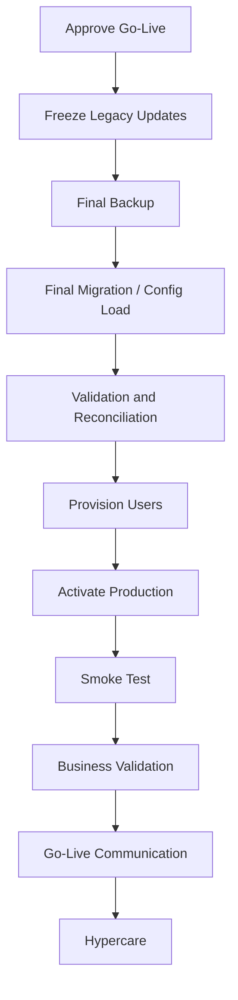

# Implementation Roadmap — SFPCL Member Credit Administration & Loan Disbursement Platform

## 1. Document Control

| Field | Value |
|---|---|
| Document name | `implementation-roadmap.md` |
| Product / system | SFPCL Member Credit Administration & Loan Disbursement Platform |
| Client | Sahyadri Farmers Producer Company Limited |
| Backend | Python + Django + Django REST Framework |
| Frontend | React |
| Database | PostgreSQL |
| Authentication | JWT |
| Supporting services | Redis, Celery, Celery Beat, object storage / DMS, email gateway, SMS gateway, SAP adapter, bank adapter, CDSL tracking adapter and future CKYC / bureau / e-sign adapters |
| Source basis | Current analysis set: SOP review, client brief, user flows, functional specification, information architecture, screen specification, content specification, component specification, design system, domain model, data model, technical architecture, API contracts, auth-permissions, integrations, security/privacy, deployment/ops and test plan |
| Intended audience | Product owners, implementation leads, engineering leads, backend engineers, frontend engineers, QA, DevOps, compliance, business stakeholders, project managers and SFPCL leadership |
| Status | Draft for implementation planning |

---

## 2. Purpose

This document defines a detailed implementation roadmap for building and launching the SFPCL Member Credit Administration & Loan Disbursement Platform.

The roadmap translates the current analysis into a practical build plan covering:

1. Product sequencing.
2. MVP scope.
3. Release phases.
4. Sprint-level implementation epics.
5. Engineering workstreams.
6. Configuration and data setup.
7. Integration sequencing.
8. Security and compliance readiness.
9. QA and UAT milestones.
10. Deployment and go-live activities.
11. Migration and cutover planning.
12. Hypercare and post-launch evolution.
13. Risks, dependencies and decision gates.

The roadmap is designed for a workflow-heavy, compliance-sensitive internal lending platform, not a generic CRUD application. It therefore prioritises controls, auditability and lifecycle gates before optional automation.

---

## 3. Strategic Product Goal

The platform should become the single controlled system of record for SFPCL’s member loan lifecycle, covering:

- Member and borrower identification.
- KYC and document control.
- Loan application intake.
- Credit assessment and appraisal.
- Loan limit calculation.
- Sanction Committee approvals.
- Legal documentation and security instruments.
- SAP customer code workflow.
- Disbursement readiness, initiation and authorisation.
- Loan servicing, repayment and interest.
- Monitoring, DPD and MIS.
- Default handling, extension and recovery.
- Loan closure, NOC, security return and archive.
- Statutory compliance trackers and audit evidence.

The key product outcome is:

```text
SFPCL staff can process member credit from initial request to closure through a secure, auditable, role-based workflow that enforces SOP gates and prevents disbursement or recovery actions unless all required approvals, documents, security instruments and evidence are complete.
```

---

## 4. Roadmap Principles

| Principle | Implementation Meaning |
|---|---|
| Controls before convenience | Build workflow gates, RBAC, audit and validations before optional automation. |
| Manual-first, API-ready integrations | Implement structured manual workflows for SAP, bank, CDSL and subsidiary repayment first; add direct APIs later. |
| One source of truth | Every loan should have one master application/account record with registers generated from system data. |
| State-machine discipline | Loan applications, approvals, documents, disbursements, repayments, defaults and closures must move through controlled states. |
| Security by default | Sensitive data must be encrypted, masked and audit-controlled from the first release. |
| Configuration over hardcoding | Loan policy, approval matrix, share valuation, scale of finance, interest rates and templates should be configurable and versioned. |
| Incremental business value | Release usable stages in phases, starting with origination and approvals, then documentation/disbursement, then servicing/compliance. |
| Audit-ready by design | Critical actions should leave evidence: who, when, role, reason, old value, new value and related document. |
| UAT-driven acceptance | Business users should validate each major SOP stage before production. |
| Future-proof but not overbuilt | Keep architecture ready for CKYC, bureau, e-sign, SAP API and bank API without blocking MVP. |

---

# 5. Scope Baseline

## 5.1 MVP Scope

The recommended MVP should include:

| Area | MVP Inclusion |
|---|---|
| Internal user login | Yes |
| JWT authentication | Yes |
| Role-based access | Yes |
| Object-level permissions | Yes |
| Member master | Yes |
| Individual farmer borrower | Yes |
| FPC / Producer Institution borrower | Yes |
| Nominee and witness records | Yes |
| KYC document upload and verification | Yes |
| Shareholding, landholding and crop plan | Yes |
| Loan application intake | Yes |
| Application reference number | Yes |
| Completeness check and deficiencies | Yes |
| Eligibility assessment | Yes |
| Active member validation | Yes |
| Loan limit calculator | Yes |
| Appraisal note | Yes |
| Credit Manager review | Yes |
| Sanction approval matrix | Yes |
| CFO + Director approval workflow | Yes |
| Exception register | Yes |
| Director/relative special-case tracking | Yes, at least manual evidence |
| Legal document generation | Yes |
| Document upload and verification | Yes |
| Stamp duty and notarisation records | Yes |
| Checklist approval sequence | Yes |
| PoA tracking | Yes |
| SH-4 tracking | Yes |
| CDSL pledge manual tracking | Yes |
| Blank-dated cheque custody | Yes |
| SAP customer request manual workflow | Yes |
| SAP code confirmation | Yes |
| Disbursement readiness | Yes |
| Senior Manager Finance disbursement initiation | Yes |
| CFC authorisation | Yes |
| Bank UTR capture | Yes |
| Loan account activation | Yes |
| Direct repayment | Yes |
| Subsidiary deduction repayment | Yes, manual |
| Principal-first allocation | Yes |
| SAP repayment posting reference | Yes |
| Interest invoice and monthly accrual | Yes |
| Interest capitalisation | Yes |
| DPD and monitoring | Yes |
| Repayment reminders | Yes |
| Default case and grace period | Yes |
| Non-intentional extension | Yes |
| Non-payment note | Yes |
| Recovery approval and action tracking | Yes |
| Loan closure | Yes |
| NOC | Yes |
| Security return / CDSL unpledge | Yes |
| Archive record | Yes |
| Compliance dashboards | Yes |
| Section 186 tracker | Yes |
| NBFC principal business test | Yes |
| KYC/re-KYC tracker | Yes |
| Stamp duty register | Yes |
| Money-lending annual review | Yes |
| Grievance register | Yes |
| Reports and exports | Yes |
| Audit logs | Yes |
| Deployment and operational monitoring | Yes |

## 5.2 Non-MVP / Future Scope

| Feature | Reason to Defer |
|---|---|
| Borrower self-service portal | Internal process control should stabilise first. |
| Mobile app | Not required for internal MVP. |
| Direct SAP API | Manual SAP process exists in SOP and should be captured first. |
| Direct RBL Bank API | Manual bank portal + CFC authorisation can satisfy MVP controls. |
| CKYC API | Requires provider, legal/consent setup and production credentials. |
| Credit bureau API | Bureau requirement is referenced but not fully defined. |
| E-sign / e-stamp | Legal acceptability for PoA, notarisation and wet signatures must be confirmed. |
| Automated CDSL integration | Manual DP/CDSL process is sufficient for MVP unless API available. |
| Advanced BI / warehouse | Operational and compliance reports are enough for MVP. |
| Multi-language borrower portal | Future customer-facing enhancement. |
| AI document extraction | Not needed for initial controlled workflow. |

---

# 6. Roadmap Overview

## 6.1 Recommended Release Structure

| Release | Theme | Business Outcome |
|---|---|---|
| R0 | Discovery Finalisation and Foundation Setup | Team alignment, final decisions, environments, architecture and baseline configuration |
| R1 | Core Platform Foundation | Users, roles, auth, member master, document storage, audit and configuration foundation |
| R2 | Loan Origination and Credit Assessment | Application intake, KYC, completeness, eligibility, loan limit and appraisal |
| R3 | Sanction and Approval Workflow | Approval matrix, sanction committee, exceptions and special cases |
| R4 | Documentation and Security Package | Legal documents, checklist, PoA, SH-4, CDSL, cheques and stamping |
| R5 | SAP and Disbursement | SAP request, loan account, readiness, initiation, CFC authorisation and UTR |
| R6 | Repayment, Interest and Monitoring | Repayment capture, allocation, interest invoice/accrual, DPD, reminders and MIS |
| R7 | Default, Recovery, Closure and Compliance | Default, extension, recovery, NOC, security return, archive and compliance trackers |
| R8 | Reports, Hardening, UAT and Go-Live | Regression, security, performance, reports, migration, operations and go-live |
| R9 | Post-Go-Live Enhancements | Automation, integrations, borrower portal and advanced analytics |

## 6.2 Roadmap Timeline Model

Actual calendar duration depends on team size, design maturity and client decision speed. A practical implementation may use two-week sprints.

| Phase | Suggested Duration | Sprints |
|---|---:|---:|
| R0 Discovery finalisation and setup | 2–3 weeks | 1 |
| R1 Core foundation | 4–6 weeks | 2–3 |
| R2 Origination and assessment | 4–6 weeks | 2–3 |
| R3 Sanction and approvals | 3–4 weeks | 2 |
| R4 Documentation and security | 5–6 weeks | 3 |
| R5 SAP and disbursement | 3–4 weeks | 2 |
| R6 Repayment, interest and monitoring | 5–6 weeks | 3 |
| R7 Default, closure and compliance | 5–6 weeks | 3 |
| R8 UAT, migration and go-live | 4–6 weeks | 2–3 |
| Total MVP | 35–47 weeks | 18–23 sprints |

A compressed approach is possible if parallel teams work on backend, frontend, QA, DevOps and document templates simultaneously, but compression should not remove control testing.

---

# 7. Delivery Workstreams

## 7.1 Workstream Summary

| Workstream | Responsibility |
|---|---|
| Product and Business Analysis | Finalise requirements, open decisions, acceptance criteria and UAT scripts |
| UX/UI and Design System | Screens, components, interaction patterns, content and accessibility |
| Backend Engineering | Django apps, domain services, APIs, workflow engines and integrations |
| Frontend Engineering | React screens, components, state management, forms and role-based UI |
| Data and Database | PostgreSQL schema, migrations, seed data, indexes and data migration |
| Security and Permissions | JWT, RBAC, object permissions, masking, audit and access review |
| Documents and Templates | Annexures, PDF generation, templates, signatures, checklist and evidence |
| Integrations | SAP, bank, email, SMS, object storage, CDSL, subsidiary and future adapters |
| QA and Automation | Unit, API, E2E, regression, UAT and performance testing |
| DevOps and Operations | Environments, CI/CD, monitoring, backup, restore, runbooks and go-live |
| Compliance and Audit | Statutory trackers, evidence requirements, audit logs and retention |
| Change Management and Training | User training, SOP mapping, support process and hypercare |

## 7.2 Core Team Roles

| Role | Recommended Involvement |
|---|---|
| Product Owner | Full-time or near full-time |
| Business Analyst | Full-time during discovery/build |
| Technical Architect | High involvement in R0–R3, review throughout |
| Backend Lead | Full-time |
| Backend Engineers | Full-time |
| Frontend Lead | Full-time |
| Frontend Engineers | Full-time |
| QA Lead | Full-time from R1 onward |
| QA Automation Engineer | R2 onward |
| DevOps Engineer | R0, then part-time/critical release support |
| UX Designer | R0–R4, then support |
| Compliance SME | Frequent review at stage gates |
| Credit SME | Frequent review for R2/R3/R6/R7 |
| Company Secretary / Legal SME | Frequent review for R4/R7/compliance |
| Finance SME | Frequent review for R5/R6 |
| SFPCL IT/Admin | Access, deployment and go-live support |

---

# 8. Key Decision Gates

The following decisions must be resolved early or explicitly configured as provisional.

## 8.1 Critical Policy Decisions

| Decision | Impact | Recommended Timing |
|---|---|---|
| Loan limit formula: 30% vs 10% vs ₹200/share | Affects calculator, approvals, exceptions and UAT | Before R2 calculator finalisation |
| Approval threshold interpretation at exactly ₹5 lakh | Affects approval matrix | Before R3 |
| Legal document signer: CS vs CFO/designated directors | Affects document workflows | Before R4 |
| Annexure K inconsistency | Affects naming, registers and templates | Before R4/R7 |
| Interest benchmark and floating-rate reset logic | Affects term sheet, invoices and accruals | Before R6 |
| Penal interest rate and triggers | Affects loan agreement, default, interest | Before R6/R7 |
| NACH/ECS requirement | Affects repayment modules | Before R6 if included |
| Guarantor criteria | Affects application and docs | Before R2/R4 if included |
| Bureau check requirement | Affects eligibility/appraisal and consent | Before R2 if included |
| Recovery approval authority | Affects recovery workflows | Before R7 |
| Director/relative approval flow | Affects R3 special cases | Before R3 |
| SAP responsibility for repayment posting | Affects R6 permissions and workflow | Before R6 |
| Archive locations and retention implementation | Affects closure and operations | Before R7 |
| MFA requirement | Affects auth/security | Before production go-live |

## 8.2 Integration Decisions

| Decision | Impact | Recommended Timing |
|---|---|---|
| SAP MVP mode | Manual vs API affects R5 design | R0 |
| RBL Bank MVP mode | Manual vs API affects R5 design | R0 |
| Email provider | Communication integration | R1/R2 |
| SMS provider | Reminders and borrower notices | R1/R2 |
| Object storage / DMS | Document platform foundation | R1 |
| CKYC provider | Future KYC integration | Later unless MVP includes |
| Bureau provider | Future credit checks | Later unless MVP includes |
| E-sign provider | Future digital docs | Later unless MVP includes |
| CDSL API availability | Security automation | R4 or later |
| Subsidiary deduction file format | R6 repayment integration | Before R6 |

---

# 9. Release R0 — Discovery Finalisation and Foundation Setup

## 9.1 Goal

Prepare the project for controlled delivery by closing critical open questions, confirming MVP scope, establishing environments, selecting tools and finalising the build plan.

## 9.2 Key Activities

| Activity | Description |
|---|---|
| Confirm MVP scope | Agree what must go live first and what is deferred. |
| Confirm role model | Finalise internal user roles, teams and approval authorities. |
| Confirm legal/policy decisions | Resolve loan limit, signer, interest, recovery authority and annexure inconsistencies. |
| Confirm integration modes | Decide manual/API/file mode for SAP, bank, email, SMS, storage and CDSL. |
| Confirm hosting | Cloud/private/on-prem, deployment model and environment list. |
| Confirm security baseline | JWT, MFA, masking, encryption, sensitive reveal, exports and audit policy. |
| Confirm document templates | Identify which annexures need generated templates in MVP. |
| Confirm migration scope | Decide whether legacy loan data is migrated for go-live. |
| Create project backlog | Convert specs into epics/stories. |
| Set up delivery rituals | Sprint cadence, demo, triage, UAT review and change control. |

## 9.3 Deliverables

- Approved MVP scope.
- Approved open decision log.
- Approved architecture baseline.
- Approved environment strategy.
- Initial product backlog.
- Definition of Done.
- Definition of Ready.
- UAT ownership matrix.
- Security baseline.
- Integration mode decision record.
- Migration strategy decision.
- Release plan and sprint plan.

## 9.4 Acceptance Criteria

| ID | Acceptance Criteria |
|---|---|
| R0-AC-001 | MVP scope is signed off by product/business. |
| R0-AC-002 | Critical policy decisions are resolved or explicitly marked provisional with owner/date. |
| R0-AC-003 | Deployment model and environments are agreed. |
| R0-AC-004 | Integration modes are agreed. |
| R0-AC-005 | Initial backlog is prioritised by release. |
| R0-AC-006 | UAT participants are identified. |

---

# 10. Release R1 — Core Platform Foundation

## 10.1 Goal

Build the secure foundation required for all subsequent workflow modules.

## 10.2 Scope

| Epic | Description |
|---|---|
| R1-E1 Project setup | Django, React, PostgreSQL, Redis, Celery, CI/CD and repository standards |
| R1-E2 Authentication | JWT login, refresh, logout, current user and password reset |
| R1-E3 User/role/team management | Users, roles, permissions, teams and approval authority |
| R1-E4 RBAC and object access foundation | Permission service, route guards and API permission classes |
| R1-E5 Audit log foundation | Immutable audit service and workflow event service |
| R1-E6 Document storage foundation | File upload, metadata, object storage, signed downloads and sensitivity |
| R1-E7 Configuration foundation | Loan policy, approval matrix, share valuation, scale of finance and interest config shells |
| R1-E8 UI shell and design system | Navigation, layout, tables, forms, buttons, status badges, modals and alerts |
| R1-E9 Dashboard foundation | Role-based dashboard framework and task card shell |
| R1-E10 DevOps baseline | Environments, health checks, logs, backups and deployment pipeline |

## 10.3 Backend Stories

| Story | Description |
|---|---|
| Auth models and JWT | Configure JWT tokens, sessions and refresh revocation. |
| User model | Custom user model or extended Django user with roles/teams. |
| Permissions | Seed permission catalogue from auth-permissions spec. |
| RBAC service | `permission_service.require()` and helpers. |
| Object access service | Initial framework for object-level access. |
| Audit service | Append-only audit log with request context. |
| Document file model | Metadata, sensitivity, checksum, storage key. |
| Storage adapter | Upload/download/signed URL abstraction. |
| Config models | Versioned configuration tables. |
| Health endpoints | Live/ready/deep checks. |
| Background jobs | Celery setup and basic test task. |

## 10.4 Frontend Stories

| Story | Description |
|---|---|
| App shell | Header, navigation, role-based menu. |
| Login screen | JWT login and session handling. |
| Protected routes | Route guard based on auth state. |
| Permission helper | `can()` and action visibility helpers. |
| Dashboard shell | Cards, task list and empty states. |
| Design components | Button, input, select, table, badge, modal, toast. |
| File upload component | Basic upload and progress. |
| Document viewer shell | Secure preview/download pattern. |
| Audit timeline component | Generic event display. |
| Admin user screens | User list/detail/create/edit role assignment. |

## 10.5 QA Focus

- Auth tests.
- Role permission tests.
- File upload/download tests.
- Sensitive masking foundation.
- Audit event creation.
- Health checks.
- Deployment smoke tests.
- Design system component tests.

## 10.6 R1 Acceptance Criteria

| ID | Acceptance Criteria |
|---|---|
| R1-AC-001 | Users can log in, refresh and log out using JWT. |
| R1-AC-002 | Inactive users cannot access the system. |
| R1-AC-003 | Roles, teams and permissions can be configured. |
| R1-AC-004 | UI navigation is role-aware. |
| R1-AC-005 | Backend rejects unauthorised API calls. |
| R1-AC-006 | Document files can be uploaded and downloaded securely. |
| R1-AC-007 | Restricted document downloads are audit logged. |
| R1-AC-008 | Audit logs are created for critical admin actions. |
| R1-AC-009 | Health checks and CI/CD baseline are working. |

---

# 11. Release R2 — Loan Origination and Credit Assessment

## 11.1 Goal

Enable Credit Assessment Team to create and process loan applications through completeness check, eligibility, loan limit and appraisal.

## 11.2 Scope

| Epic | Description |
|---|---|
| R2-E1 Member master | Individual farmer and FPC member profiles |
| R2-E2 Nominee and witness | Nominee, witness and age/shareholder validation |
| R2-E3 Shareholding | Physical/demat shareholding and share certificate tracking |
| R2-E4 Landholding and crop plan | 7/12 extract, land area and crop plan records |
| R2-E5 KYC | PAN/Aadhaar, CKYC consent, verification and re-KYC due date |
| R2-E6 Loan application | Application form, reference number, purpose and amount |
| R2-E7 Application documents | Required document checklist for application stage |
| R2-E8 Completeness check | Complete/incomplete status and deficiency list |
| R2-E9 Rejection Note | Assessment-stage rejection note |
| R2-E10 Eligibility assessment | Active member, default, document, purpose and terms checks |
| R2-E11 Loan limit calculator | Shareholding and land-based calculation |
| R2-E12 Appraisal note | Deputy Manager appraisal and Credit Manager review |
| R2-E13 Credit work queues | TAT tracking and task queues |

## 11.3 Backend Stories

| Story | Description |
|---|---|
| Member APIs | Create/list/detail/update members. |
| FPC profile APIs | Institutional borrower fields and authorised signatory. |
| Nominee APIs | Adult validation and KYC linkage. |
| Witness APIs | Existing shareholder validation. |
| Shareholding APIs | Shares, mode, valuation and pledge availability. |
| Landholding APIs | 7/12 extract metadata and acreage. |
| Crop plan APIs | Crop, season, planned area and cost. |
| KYC APIs | Profile, documents, verification and re-KYC due. |
| Loan application APIs | Draft, update, submit and reference number. |
| Completeness APIs | Mark complete/incomplete and create deficiencies. |
| Deficiency APIs | Resolve and communicate deficiencies. |
| Rejection APIs | Create/send rejection note. |
| Eligibility service | Run and store pass/fail checks. |
| Active member service | Evaluate 4-year and relaxation rules. |
| Loan limit service | Calculate share/land/final limit with rule snapshot. |
| Appraisal APIs | Draft, submit, review and attach risk assessment. |

## 11.4 Frontend Stories

| Screen | Description |
|---|---|
| Member Directory | Search, filters, masked values. |
| Member Profile | Profile, KYC, shareholding, land, crop, loans. |
| New Loan Application | Multi-section application capture. |
| Application Detail | Stage summary and available actions. |
| Document Upload | Application and KYC documents. |
| Completeness Check | Required docs and deficiency creation. |
| Deficiency Resolution | Upload missing documents and close deficiencies. |
| Eligibility Assessment | Run/check results and explanations. |
| Loan Limit Calculator | Share limit, land limit, final eligible amount. |
| Appraisal Note | Form for appraisal, risk and recommendation. |
| Credit Manager Review | Review comments and submit to sanction. |
| Rejection Note Builder | Reason, message and communication. |

## 11.5 Critical Business Rules

| Rule | Implementation |
|---|---|
| Borrower must be member | Application creation requires member record. |
| Nominee cannot be minor | Nominee validation blocks minor. |
| Purpose must be agriculture/crop production | Purpose category validation. |
| Required documents must be complete | Appraisal blocked until completeness passes. |
| Active member rule | Four-year supply or relaxation logic. |
| Borrower default check | Existing default blocks eligibility. |
| Loan limit | Lower of shareholding-based and land-based limits. |
| Current loan cap ambiguity | Config must show rule version and warnings if unresolved. |
| TAT | Appraisal stage tracks two-day TAT. |

## 11.6 QA Focus

- Member data validation.
- KYC upload and masking.
- Nominee minor rejection.
- Witness shareholder validation.
- Application reference uniqueness.
- Completeness blocking.
- Eligibility pass/fail.
- Loan limit boundary tests.
- Appraisal submission and review.
- Rejection note generation and communication.

## 11.7 R2 Acceptance Criteria

| ID | Acceptance Criteria |
|---|---|
| R2-AC-001 | Credit users can create member and loan application records. |
| R2-AC-002 | Application references are unique and sequential/configured. |
| R2-AC-003 | Required KYC/application documents are tracked. |
| R2-AC-004 | Incomplete applications can be returned with deficiencies. |
| R2-AC-005 | Appraisal cannot begin until completeness passes. |
| R2-AC-006 | Eligibility assessment produces explainable results. |
| R2-AC-007 | Loan limit calculation stores full snapshot and rule version. |
| R2-AC-008 | Credit Manager review is required before sanction submission. |
| R2-AC-009 | Rejection note can be generated and sent. |
| R2-AC-010 | All critical actions are audit logged. |

---

# 12. Release R3 — Sanction and Approval Workflow

## 12.1 Goal

Implement approval matrix, Sanction Committee workflow, exception handling, special cases and sanction decision recording.

## 12.2 Scope

| Epic | Description |
|---|---|
| R3-E1 Approval matrix configuration | Amount thresholds, required roles, director count and exception rules |
| R3-E2 Approval case engine | Create and manage approval cases |
| R3-E3 Sanction Committee workbench | CFO/Director review and decision screens |
| R3-E4 Approval action workflow | Approve, reject and return for clarification |
| R3-E5 Sanction decision | Approved/rejected sanction terms and reason |
| R3-E6 Credit Sanction Register | Register generated from approval decisions |
| R3-E7 Exception Register | Loan limit and policy exceptions |
| R3-E8 Conflict-of-interest | Director/committee/relative borrower controls |
| R3-E9 General meeting approval | Evidence capture for special cases |
| R3-E10 Approval notifications | Internal notifications to approvers and Credit Manager |

## 12.3 Backend Stories

| Story | Description |
|---|---|
| Approval matrix model | Effective-dated threshold and role requirements. |
| Approval case model | Related entity, status, required approvers. |
| Approval action model | Immutable approver action. |
| Approval case service | Determine approvers based on amount and exception. |
| Conflict service | Exclude conflicted approvers and require evidence. |
| Sanction decision service | Create sanction snapshot after approvals. |
| Register APIs | Sanction and exception register list/export. |
| Approval APIs | Approve, reject, return and comments. |
| Notification jobs | Approval assignment and return notification. |
| Audit events | Approval action, sanction, exception and conflict. |

## 12.4 Frontend Stories

| Screen | Description |
|---|---|
| Approval Workbench | Assigned approval cases for CFO/Directors. |
| Approval Case Detail | Borrower, appraisal, loan limit, documents, risk. |
| Approval Action Modal | Approve/reject/return with comments. |
| Sanction Decision View | Approved terms and approval history. |
| Credit Sanction Register | Filterable register. |
| Exception Register | Exceptions with reasons and approvals. |
| Special Case Approval | Conflict and general meeting evidence. |
| Approval Matrix Settings | Admin/configuration screen. |

## 12.5 Critical Business Rules

| Rule | Implementation |
|---|---|
| Up to ₹5 lakh | CFO + one Director. |
| Above ₹5 lakh | CFO + two Directors. |
| Exceeds loan limit | CFO + two Directors and exception reason. |
| Director/relative borrower | Conflicted person excluded and general meeting approval required. |
| Approval actions immutable | No edit/delete after submission. |
| Rejection requires reason | Comments mandatory. |
| Return requires clarification comment | Comments mandatory. |
| Approval after changes | New approval cycle/version required. |

## 12.6 QA Focus

- Threshold tests: below, exactly and above ₹5 lakh.
- Exception approval.
- Conflicted approver blocked.
- General meeting evidence.
- Approval action immutability.
- Sanction register accuracy.
- Available actions by role.
- Notification routing.

## 12.7 R3 Acceptance Criteria

| ID | Acceptance Criteria |
|---|---|
| R3-AC-001 | Approval matrix creates correct required approvers. |
| R3-AC-002 | CFO and Director users can approve assigned cases. |
| R3-AC-003 | Unassigned or conflicted users cannot approve. |
| R3-AC-004 | Sanction decision is created only after required approvals. |
| R3-AC-005 | Rejected cases cannot move to documentation. |
| R3-AC-006 | Exception Register captures approved exceptions. |
| R3-AC-007 | Director/relative cases require general meeting evidence. |
| R3-AC-008 | Registers are generated and exportable. |
| R3-AC-009 | Approval audit logs are immutable. |

---

# 13. Release R4 — Documentation and Security Package

## 13.1 Goal

Enable Compliance Team and Company Secretary to prepare, execute, verify and approve all legal documents and security instruments before disbursement.

## 13.2 Scope

| Epic | Description |
|---|---|
| R4-E1 Document template management | Annexure templates and merge fields |
| R4-E2 Document generation | Generate application, appraisal, PoA, tri-party, term sheet, agreement, checklist |
| R4-E3 Signature records | Borrower, nominee, witness and internal signatures |
| R4-E4 Stamp duty and notarisation | Stamp paper amount, number, execution and notary evidence |
| R4-E5 Signature mismatch resolution | Bank Verification Letter or borrower declaration |
| R4-E6 Document checklist | Required items, applicability and completion |
| R4-E7 Checklist approval sequence | CS, Credit Manager, Sanction Committee, Senior Manager after disbursement |
| R4-E8 Security package | PoA, SH-4, CDSL pledge, blank-dated cheque and cancelled cheque |
| R4-E9 Custody tracking | Security document and cheque custody movement |
| R4-E10 Documentation dashboards | Pending documents, blockers and readiness |

## 13.3 Backend Stories

| Story | Description |
|---|---|
| Template model | Document templates and versions. |
| Merge field engine | Document generation inputs. |
| PDF generation service | Generate and store PDFs. |
| Loan document model | Generated/uploaded document lifecycle. |
| Signature model | Signer, method, status and mismatch flag. |
| Stamp duty model | Stamp number, amount, date and status. |
| Notarisation model | Notary details and evidence. |
| Checklist model | Items, applicability and completion. |
| Checklist service | Generate/refresh based on borrower and share mode. |
| Checklist approvals | CS, Credit Manager, Sanction Committee, Finance signature. |
| PoA model | CS attorney record and execution. |
| SH-4 model | Physical share security record. |
| CDSL pledge model | Pledge milestones and PSN. |
| Cheque model | Cancelled and blank-dated cheque records. |
| Custody events | Movement and acknowledgement records. |

## 13.4 Frontend Stories

| Screen | Description |
|---|---|
| Documentation Workspace | Document list, status and actions. |
| Template Management | Admin template upload/versioning. |
| Document Generation | Select template and generate PDF. |
| Signature Panel | Signers, status and mismatch. |
| Bank Verification Screen | Resolve mismatch. |
| Stamp Duty Screen | Stamp and execution details. |
| Notarisation Screen | Notary record and upload. |
| Document Checklist | Required items and completion states. |
| PoA Screen | Execution and evidence. |
| Tri-party Agreement Screen | Subsidiary repayment agreement. |
| SH-4 Screen | Witness and custody details. |
| CDSL Pledge Screen | PRF, PSN, acceptance and status. |
| Blank Cheque Screen | Restricted custody screen. |
| Final Documentation Approval | Approval sequence and blockers. |

## 13.5 Document Templates for MVP

| Template | Priority |
|---|---|
| Loan Application Form | High |
| Loan Appraisal Note | High |
| Power of Attorney | High |
| Declaration / Tri-party Agreement | High |
| Term Sheet | High |
| Loan Agreement | High |
| Bank Verification Letter | High |
| Document Checklist | High |
| Rejection Note | High |
| Extension Note | Medium |
| Non-Payment Note | Medium |
| NOC | High |
| Interest Invoice | High |
| Disbursement Advice | High |

## 13.6 Critical Business Rules

| Rule | Implementation |
|---|---|
| Documentation starts only after sanction | Workflow gate. |
| PoA executed on required stamp and notarised | Checklist item. |
| Loan Agreement executed on required stamp and notarised | Checklist item. |
| SH-4 required for physical shares | Security package rule. |
| CDSL pledge required for demat shares | Security package rule. |
| Blank-dated cheque required | Security package rule. |
| Cancelled cheque required | Bank verification. |
| Witness must be existing shareholder | Validation. |
| Signature mismatch blocks checklist | Requires bank letter/declaration. |
| CS approval means all documents verified | Checklist approval meaning. |
| Credit Manager approval means limits reviewed | Checklist approval meaning. |
| Sanction Committee approval means final disbursement approval | Checklist approval meaning. |

## 13.7 QA Focus

- Template merge accuracy.
- Required document logic.
- Stamp duty/notarisation.
- Signature mismatch.
- SH-4 vs CDSL applicability.
- Cheque restricted access.
- Custody events.
- Checklist blocking logic.
- Final documentation approvals.
- Audit logs.

## 13.8 R4 Acceptance Criteria

| ID | Acceptance Criteria |
|---|---|
| R4-AC-001 | Required legal documents can be generated and uploaded. |
| R4-AC-002 | Stamp duty and notarisation records can be captured. |
| R4-AC-003 | Signature mismatch blocks completion until resolved. |
| R4-AC-004 | Physical share borrowers require SH-4. |
| R4-AC-005 | Demat share borrowers require CDSL pledge tracking. |
| R4-AC-006 | Blank-dated cheque and cancelled cheque are tracked. |
| R4-AC-007 | Checklist cannot approve until required items are complete. |
| R4-AC-008 | Checklist approvals follow configured sequence. |
| R4-AC-009 | Restricted security documents are protected and audited. |

---

# 14. Release R5 — SAP and Disbursement

## 14.1 Goal

Implement the SAP customer code workflow, create loan accounts and control disbursement through readiness, Senior Manager Finance initiation, CFC authorisation and bank reference capture.

## 14.2 Scope

| Epic | Description |
|---|---|
| R5-E1 SAP customer profile request | Generate request and Excel details |
| R5-E2 SAP customer code confirmation | Senior Manager Finance confirms code |
| R5-E3 SAP reuse logic | Existing customer code reused for borrower with outstanding loan |
| R5-E4 Loan account creation | Create loan account from sanction |
| R5-E5 Disbursement readiness check | Gate all required conditions |
| R5-E6 Payment initiation | Senior Manager Finance initiates |
| R5-E7 CFC authorisation | Chief Financial Controller approval |
| R5-E8 Bank transfer success | UTR, date and evidence capture |
| R5-E9 Disbursement advice | Borrower communication |
| R5-E10 Loan Register update | Register generated after disbursement |
| R5-E11 Disbursement dashboard | Pending SAP, readiness and CFC queues |

## 14.3 Backend Stories

| Story | Description |
|---|---|
| SAP request model | Request status and generated Excel file. |
| SAP request service | Create/send/complete request. |
| SAP customer code model | Member-level code storage. |
| Loan account model | Sanction snapshot and outstanding fields. |
| Loan account service | Create from approved sanction. |
| Readiness service | Gate checklist, security, SAP, bank and sanction. |
| Disbursement model | Amount, source account, beneficiary, statuses. |
| Disbursement initiation API | Idempotent initiation. |
| CFC authorisation API | Authorise/reject payment. |
| Transfer success API | UTR, bank evidence and activation. |
| Disbursement advice job | Email/SMS/letter generation. |
| Register updates | Loan Register and disbursement report. |

## 14.4 Frontend Stories

| Screen | Description |
|---|---|
| SAP Request Screen | Create/send request and download Excel. |
| SAP Confirmation Screen | Enter SAP customer code and evidence. |
| Loan Account Creation Screen | Confirm creation from sanction. |
| Disbursement Readiness | Pass/fail checks. |
| Payment Initiation | Beneficiary and amount verification. |
| CFC Authorisation | Review and approve/reject. |
| Transfer Success | UTR and bank evidence. |
| Disbursement Advice | Preview and send. |
| Disbursement Queue | Status and blockers. |
| Loan Account 360 | Initial loan account detail. |

## 14.5 Critical Business Rules

| Rule | Implementation |
|---|---|
| SAP code after sanction | Request only after sanction approval. |
| Existing borrower code reused | Avoid duplicate SAP customer ID. |
| Loan account created once | One loan account per sanctioned application. |
| Disbursement requires readiness pass | No partial bypass without exception. |
| Disbursement amount cannot exceed sanction | Validation. |
| Senior Manager initiates | Permission check. |
| CFC authorises | Authority check. |
| UTR required for success | Required field. |
| Duplicate UTR blocked | Unique constraint/idempotency. |
| Loan active only after success | State transition. |

## 14.6 QA Focus

- SAP request generation.
- SAP code duplicate prevention.
- Loan account creation.
- Readiness gate.
- Initiation idempotency.
- CFC permission.
- UTR uniqueness.
- Loan activation.
- Disbursement advice.
- Audit logs.

## 14.7 R5 Acceptance Criteria

| ID | Acceptance Criteria |
|---|---|
| R5-AC-001 | SAP request can be created after sanction approval. |
| R5-AC-002 | SAP Excel/details include required borrower information. |
| R5-AC-003 | SAP customer code can be confirmed and reused. |
| R5-AC-004 | Loan account can be created from sanction. |
| R5-AC-005 | Disbursement readiness returns all pass/fail checks. |
| R5-AC-006 | Disbursement cannot start without readiness. |
| R5-AC-007 | Senior Manager Finance can initiate disbursement. |
| R5-AC-008 | CFC authorisation is required for success. |
| R5-AC-009 | UTR is captured and duplicate UTR is blocked. |
| R5-AC-010 | Loan becomes active after successful transfer. |

---

# 15. Release R6 — Repayment, Interest and Monitoring

## 15.1 Goal

Support active loan servicing through repayment capture, subsidiary deduction, principal-first allocation, SAP posting references, interest invoices, monthly accruals, capitalisation, DPD and monitoring.

## 15.2 Scope

| Epic | Description |
|---|---|
| R6-E1 Loan Account 360 | Balances, terms, documents, repayments, interest and status |
| R6-E2 Direct repayment | RTGS/NEFT receipt capture |
| R6-E3 Subsidiary repayment | Produce-payment deduction and transfer tracking |
| R6-E4 Bank statement import | Manual upload and matching |
| R6-E5 Repayment allocation | Principal-first allocation |
| R6-E6 SAP receipt posting | SAP reference capture |
| R6-E7 Repayment schedule | Due dates and outstanding display |
| R6-E8 Interest invoice | Year-end interest invoice |
| R6-E9 Monthly accrual | Monthly accrual jobs |
| R6-E10 Interest capitalisation | Post-30-April unpaid interest added to principal |
| R6-E11 DPD calculation | DPD and SOP buckets |
| R6-E12 Reminder management | SMS/phone/email reminders |
| R6-E13 Quarterly MIS | CFO portfolio report |
| R6-E14 Monitoring dashboard | Outstanding, ageing and reminders |

## 15.3 Backend Stories

| Story | Description |
|---|---|
| Loan ledger service | Principal, interest and charges summary. |
| Repayment model | Source, amount, reference and status. |
| Repayment capture API | Direct and subsidiary repayment. |
| Allocation service | Principal-first logic. |
| SAP posting fields | Receipt posting references. |
| Bank statement model | Statement upload and lines. |
| Matching service | UTR/amount/date/name matching. |
| Interest invoice model | Year-end invoices. |
| Accrual model | Monthly accrual entries. |
| Capitalisation model | Annual unpaid interest capitalisation. |
| DPD service | DPD days and SOP buckets. |
| Reminder model | SMS/email/phone logs. |
| MIS report service | Quarterly CFO MIS. |
| Scheduled jobs | Accrual, DPD, reminders, capitalisation checks. |

## 15.4 Frontend Stories

| Screen | Description |
|---|---|
| Loan Account 360 | Overview, ledger, documents, repayment, interest, monitoring tabs. |
| Direct Repayment Entry | Amount, date, UTR and evidence. |
| Subsidiary Deduction Entry | Subsidiary, produce reference, transfer reference. |
| Bank Statement Upload | Upload, parse and match lines. |
| Repayment Allocation | Principal-first allocation result. |
| SAP Posting Screen | Mark receipt posted. |
| Interest Invoice Screen | Generate, issue and track. |
| Accrual Screen | Monthly accrual list and bulk generation. |
| Capitalisation Screen | Dry run and finalise after 30 April. |
| DPD Dashboard | Bucket counts and loan list. |
| Reminder Queue | SMS/phone/email reminders. |
| Quarterly MIS | Generate, preview, submit and review. |

## 15.5 Critical Business Rules

| Rule | Implementation |
|---|---|
| Direct repayment via RTGS/NEFT | Capture bank reference and evidence. |
| Subsidiary deduction requires borrower and loan reference | Match and flag exceptions. |
| Partial repayment principal-first | Allocation service. |
| SAP receipt entry next working day | Posting status and task. |
| Interest invoice at financial year close | Scheduled/manual generation. |
| Unpaid interest after 30 April capitalised | Annual capitalisation job. |
| Capitalisation increases principal | Ledger update. |
| Duplicate capitalisation blocked | Unique loan/FY. |
| DPD buckets | SOP buckets 1–2 yrs, 2–3 yrs, 3+ yrs plus operational buckets. |
| Quarterly MIS to CFO | Report workflow. |

## 15.6 QA Focus

- Direct repayment.
- Subsidiary deduction.
- Duplicate references.
- Principal-first allocation.
- SAP posting status.
- Interest invoice.
- Accrual duplicate prevention.
- Capitalisation date rule.
- DPD bucket accuracy.
- Reminder logs.
- MIS generation.

## 15.7 R6 Acceptance Criteria

| ID | Acceptance Criteria |
|---|---|
| R6-AC-001 | Direct repayments can be captured and allocated. |
| R6-AC-002 | Subsidiary deduction repayments can be captured and reconciled. |
| R6-AC-003 | Partial repayments allocate to principal first. |
| R6-AC-004 | Duplicate bank/subsidiary references are blocked. |
| R6-AC-005 | SAP posting references can be captured. |
| R6-AC-006 | Interest invoices can be generated and issued. |
| R6-AC-007 | Monthly accruals can be created without duplicates. |
| R6-AC-008 | Unpaid interest can be capitalised once after 30 April. |
| R6-AC-009 | DPD and monitoring dashboards work. |
| R6-AC-010 | Quarterly MIS can be generated and reviewed. |

---

# 16. Release R7 — Default, Recovery, Closure and Compliance

## 16.1 Goal

Complete the lifecycle by implementing default management, grace periods, extensions, recovery approvals/actions, loan closure, NOC, security return, archive and statutory compliance trackers.

## 16.2 Scope

| Epic | Description |
|---|---|
| R7-E1 Default case | Open default case for missed principal repayment |
| R7-E2 Grace period | Three-month grace tracking |
| R7-E3 Default assessment | Intentional/non-intentional reason capture |
| R7-E4 Extension | One-year extension for non-intentional default |
| R7-E5 Non-Payment Note | Note after extension failure |
| R7-E6 Recovery approval | Sanction Committee/Board approval as configured |
| R7-E7 Recovery action | SH-4, CDSL or cheque action tracking |
| R7-E8 Closure readiness | Ensure zero outstanding |
| R7-E9 NOC generation | NOC after full repayment |
| R7-E10 Security return | SH-4, cheque, PoA release and CDSL unpledge |
| R7-E11 Archive | Physical/digital archive and retention date |
| R7-E12 Compliance controls | Control library and tasks |
| R7-E13 Section 186 | Quarterly tracker |
| R7-E14 NBFC principal test | Quarterly ratio tracker |
| R7-E15 KYC/re-KYC | Tracker and overdue tasks |
| R7-E16 Stamp duty register | Documentation compliance |
| R7-E17 Money-lending review | Annual legal opinion and board note |
| R7-E18 Grievance register | Complaint handling |

## 16.3 Backend Stories

| Story | Description |
|---|---|
| Default case model | Trigger, status, dates and reason. |
| Grace service | Create and monitor three-month period. |
| Default assessment API | Classify reason and recommendation. |
| Extension model | One-year extension and note. |
| Non-payment note model | Outstanding and recommendation. |
| Recovery decision model | Approval and selected action. |
| Recovery action model | Execution evidence and amounts. |
| Closure service | Readiness and close loan. |
| NOC generation | Generate and store NOC. |
| Security return model | Return/release/unpledge evidence. |
| Archive model | Retention and storage locations. |
| Compliance control model | Controls and owners. |
| Compliance task model | Frequencies, due dates and evidence. |
| Section 186 service | Exposure limit calculation. |
| NBFC test service | Asset/income ratio calculation. |
| Grievance model | Complaint and resolution. |
| Scheduled jobs | Default/extension/re-KYC/compliance reminders. |

## 16.4 Frontend Stories

| Screen | Description |
|---|---|
| Default Dashboard | Cases by stage and age. |
| Default Case Detail | Grace, assessment and interaction history. |
| Extension Screen | Non-intentional reason and extension note. |
| Non-Payment Note | Prepare and submit note. |
| Recovery Approval | Decision and evidence. |
| Recovery Action | Invoke/complete security action. |
| Closure Readiness | Outstanding and blockers. |
| Loan Closure | Close loan with notes. |
| NOC Screen | Generate and deliver NOC. |
| Security Return | SH-4, cheque, PoA and CDSL unpledge. |
| Archive Screen | Locations and retention. |
| Compliance Dashboard | Task cards and overdue controls. |
| Section 186 Tracker | Quarterly inputs and limits. |
| NBFC Test | Quarterly ratio inputs and trigger. |
| KYC/Re-KYC Tracker | Due and overdue records. |
| Stamp Duty Register | Stamp evidence. |
| Money-Lending Review | Annual legal opinion. |
| Grievance Register | Create, assign and resolve. |

## 16.5 Critical Business Rules

| Rule | Implementation |
|---|---|
| One missed principal repayment triggers default | Default case. |
| Grace period is three months | Date logic. |
| Non-intentional default can get one-year extension | Extension service. |
| Extension note stored in loan file | Document/evidence. |
| After extension failure, Non-Payment Note required | Recovery gate. |
| Recovery requires approval | Approval case. |
| SH-4/cheque/CDSL invocation cannot happen without approval | Hard gate. |
| Closure requires full repayment | Outstanding zero check. |
| NOC after full repayment | Document generation. |
| Security return after closure | Closure task. |
| Archive minimum eight years | Retention date calculation. |
| Compliance tasks frequency based | Quarterly/monthly/annual. |

## 16.6 QA Focus

- Default triggers.
- Grace period dates.
- Extension eligibility.
- Non-payment note.
- Recovery approval gate.
- Security invocation gate.
- Closure readiness.
- NOC generation.
- Security return.
- Archive retention.
- Compliance calculations.
- Grievance workflow.

## 16.7 R7 Acceptance Criteria

| ID | Acceptance Criteria |
|---|---|
| R7-AC-001 | Missed repayment can open default case. |
| R7-AC-002 | Three-month grace period is calculated. |
| R7-AC-003 | Non-intentional extension can be recorded. |
| R7-AC-004 | Non-Payment Note can be prepared after extension failure. |
| R7-AC-005 | Recovery actions are blocked without approval. |
| R7-AC-006 | Loan closure is blocked if outstanding exists. |
| R7-AC-007 | NOC is generated after closure. |
| R7-AC-008 | Security return and CDSL unpledge can be tracked. |
| R7-AC-009 | Archive retention date is at least eight years. |
| R7-AC-010 | Compliance trackers calculate and store evidence. |

---

# 17. Release R8 — Reports, Hardening, UAT and Go-Live

## 17.1 Goal

Prepare the system for production launch through reporting completion, regression testing, security hardening, migration, UAT, operations readiness and go-live.

## 17.2 Scope

| Epic | Description |
|---|---|
| R8-E1 Report centre | Operational, finance, compliance and audit reports |
| R8-E2 Export security | Masking, permission and audit for exports |
| R8-E3 Regression hardening | Fix defects, workflow edge cases and performance |
| R8-E4 Security hardening | Auth, RBAC, sensitive data, logs, dependencies |
| R8-E5 Performance testing | API, search, reports and batch jobs |
| R8-E6 Data migration | Legacy loan/member/SAP/security data if included |
| R8-E7 UAT execution | Business scripts and signoff |
| R8-E8 Training | Role-based user training |
| R8-E9 Deployment readiness | CI/CD, backups, monitoring, runbooks |
| R8-E10 Go-live cutover | Final migration, activation and support |
| R8-E11 Hypercare | Post-launch monitoring and issue resolution |

## 17.3 Report Scope

| Report | Priority |
|---|---|
| Loan Request Register | High |
| Credit Sanction Register | High |
| Exception Register | High |
| Documentation Readiness | High |
| Security Custody Register | High |
| SAP Pending Report | High |
| Disbursement Report | High |
| Repayment Report | High |
| Interest Invoice Report | High |
| DPD Report | High |
| CFO Quarterly MIS | High |
| Default Report | High |
| Recovery Report | High |
| Closure/NOC Report | High |
| Section 186 Report | High |
| NBFC Test Report | High |
| KYC/Re-KYC Report | High |
| Stamp Duty Register | High |
| Grievance Report | Medium |
| Audit Log Export | High but restricted |

## 17.4 UAT Workstreams

| Workstream | Scripts |
|---|---|
| Credit | Application, eligibility, appraisal, rejection, monitoring |
| Sanction Committee | Approval below/above threshold, exceptions and special cases |
| Compliance/CS | Documents, stamping, security, NOC and archive |
| Finance/Treasury | SAP, disbursement, repayment and bank references |
| Accounts | Interest invoices, accruals, capitalisation |
| Compliance/CFO | Section 186, NBFC, KYC, money-lending review |
| Auditor | Audit trail, registers and evidence |
| IT/Admin | Users, roles, permissions, deployment and access review |

## 17.5 Go-Live Checklist

| Area | Required |
|---|---|
| Functional signoff | UAT passed |
| Security signoff | RBAC, masking, audit and secure config passed |
| Data signoff | Migration/reconciliation approved |
| Integration signoff | SAP, bank, email, SMS, storage workflows tested |
| Operations signoff | Monitoring, backups, runbooks ready |
| Training signoff | Role-based training completed |
| Support signoff | Support channels and escalation active |
| Business signoff | CFO/CS/Credit owner approval |
| Rollback plan | Approved |
| Hypercare plan | Active |

## 17.6 R8 Acceptance Criteria

| ID | Acceptance Criteria |
|---|---|
| R8-AC-001 | All critical reports are available and exportable with correct permissions. |
| R8-AC-002 | Full regression suite passes or exceptions are accepted. |
| R8-AC-003 | Security/privacy critical tests pass. |
| R8-AC-004 | Performance tests meet agreed targets. |
| R8-AC-005 | Migration reconciliation is approved if migration is in scope. |
| R8-AC-006 | UAT signoff is received. |
| R8-AC-007 | Production monitoring and backups are ready. |
| R8-AC-008 | Support and hypercare plan is active. |
| R8-AC-009 | Go-live decision is formally approved. |

---

# 18. Release R9 — Post-Go-Live Enhancements

## 18.1 Goal

Enhance automation, user experience and external integration after MVP stabilisation.

## 18.2 Candidate Enhancements

| Enhancement | Benefit |
|---|---|
| Borrower/member portal | Borrower status, document upload, NOC download and grievances |
| Mobile-friendly borrower flows | Better field/borrower communication |
| SAP API integration | Reduce manual customer code/posting work |
| Bank API integration | Reduce manual payment and reconciliation work |
| CKYC API integration | Improve KYC validation |
| Credit bureau integration | Improve risk assessment |
| E-sign and e-stamp | Reduce physical documentation friction |
| CDSL/DP integration | Automate pledge status |
| Subsidiary deduction API/file automation | Improve repayment reconciliation |
| Advanced reporting/BI | Management dashboards |
| Data warehouse | Portfolio analytics and compliance trend analysis |
| Automated document extraction | Reduce manual entry from KYC/bank statements |
| MFA/security keys | Stronger privileged-user security |
| Automated access review | Compliance improvement |
| Multi-language borrower communication | Better farmer-facing notices |
| Notification preference management | Better communications |
| Advanced recovery workflow | Legal case management and structured recovery steps |

## 18.3 Enhancement Prioritisation Criteria

| Criterion | Description |
|---|---|
| Compliance impact | Does it reduce legal/regulatory risk? |
| Financial risk reduction | Does it reduce disbursement/repayment errors? |
| Operational effort reduction | Does it reduce manual workload? |
| User adoption | Does it improve daily user experience? |
| Integration feasibility | Is provider/API available? |
| Security impact | Does it improve data protection? |
| Cost and complexity | Is effort justified by value? |
| Client readiness | Are business owners ready to adopt process change? |

---

# 19. Backlog Structure

## 19.1 Epic Categories

| Category | Examples |
|---|---|
| Platform Foundation | Auth, users, audit, documents, config |
| Member and KYC | Member, nominee, witness, KYC, active status |
| Origination | Loan application, completeness, deficiencies |
| Credit | Eligibility, loan limit, appraisal |
| Approval | Sanction Committee, exceptions, conflict |
| Documentation | Templates, documents, signatures, stamp, checklist |
| Security | PoA, SH-4, CDSL, cheques, custody |
| Finance | SAP, loan account, disbursement |
| Servicing | Repayments, interest, accruals, DPD |
| Default and Recovery | Grace, extension, non-payment, recovery |
| Closure | NOC, security return, archive |
| Compliance | Section 186, NBFC, KYC, stamp, money-lending |
| Reporting | Registers, MIS, exports |
| Security | RBAC, masking, sensitive reveal, audit |
| Operations | Monitoring, backup, deployment, runbooks |
| Migration | Legacy import and reconciliation |

## 19.2 User Story Template

```markdown
### Story: <Title>

**As a** <role>  
**I want** <capability>  
**So that** <business outcome>

#### Business Context
<Why this matters in the SOP>

#### Acceptance Criteria
- Given ...
- When ...
- Then ...

#### Validation Rules
- ...

#### Permissions
- ...

#### Audit Events
- ...

#### Dependencies
- ...

#### Test Notes
- ...
```

## 19.3 Definition of Ready

A story is ready when:

- Business requirement is clear.
- Screen/API impact is understood.
- Data model impact is identified.
- Permissions are defined.
- Workflow state impact is defined.
- Validation rules are defined.
- Acceptance criteria are written.
- Dependencies and open questions are resolved or tracked.
- Test data requirements are identified.

## 19.4 Definition of Done

A story is done when:

- Backend implementation complete.
- Frontend implementation complete where applicable.
- Database migration complete.
- API contract updated.
- Permissions enforced.
- Audit events implemented for critical actions.
- Unit tests added.
- API tests added.
- UI tests added where applicable.
- Security/masking validated where applicable.
- Documentation updated.
- QA passed.
- Product acceptance completed.

---

# 20. Technical Implementation Sequencing

## 20.1 Django App Structure

Recommended app sequence:

| App | Build Phase |
|---|---|
| `accounts` | R1 |
| `rbac` | R1 |
| `audit` | R1 |
| `documents` | R1/R4 |
| `configurations` | R1 |
| `members` | R2 |
| `kyc` | R2 |
| `applications` | R2 |
| `credit` | R2 |
| `approvals` | R3 |
| `legal_documents` | R4 |
| `security_instruments` | R4 |
| `sap_workflow` | R5 |
| `loans` | R5 |
| `disbursements` | R5 |
| `repayments` | R6 |
| `interest` | R6 |
| `monitoring` | R6 |
| `defaults` | R7 |
| `recovery` | R7 |
| `closure` | R7 |
| `compliance` | R7 |
| `communications` | R1/R2/R6 |
| `reports` | R6/R8 |
| `integrations` | R1/R5 onward |
| `ops` | R8 |

## 20.2 Service Layer Sequence

| Service | Build Phase |
|---|---|
| Permission service | R1 |
| Object access service | R1 |
| Audit service | R1 |
| Document storage service | R1 |
| Configuration service | R1 |
| Active member service | R2 |
| Eligibility service | R2 |
| Loan limit service | R2 |
| Appraisal service | R2 |
| Approval matrix service | R3 |
| Sanction decision service | R3 |
| Document generation service | R4 |
| Checklist service | R4 |
| Security package service | R4 |
| SAP request service | R5 |
| Loan account service | R5 |
| Disbursement readiness service | R5 |
| Disbursement service | R5 |
| Repayment allocation service | R6 |
| Interest accrual service | R6 |
| DPD service | R6 |
| Default service | R7 |
| Recovery service | R7 |
| Closure service | R7 |
| Compliance calculation service | R7 |
| Reporting service | R8 |

## 20.3 Frontend Module Sequence

| Module | Build Phase |
|---|---|
| App shell and login | R1 |
| Design system components | R1 |
| Admin/user management | R1 |
| Member directory/profile | R2 |
| Application screens | R2 |
| Credit assessment screens | R2 |
| Approval workbench | R3 |
| Documentation workspace | R4 |
| Security package screens | R4 |
| SAP and disbursement screens | R5 |
| Loan account 360 | R5/R6 |
| Repayment and interest screens | R6 |
| Monitoring dashboards | R6 |
| Default/recovery screens | R7 |
| Closure screens | R7 |
| Compliance screens | R7 |
| Reports centre | R8 |
| Audit explorer | R8 |

---

# 21. Data Model Implementation Sequencing

## 21.1 Foundation Tables

Build first:

- Users.
- Roles.
- Permissions.
- Teams.
- User-team memberships.
- User sessions.
- Audit logs.
- Workflow events.
- Document files.
- Configuration versions.
- Communication templates.
- Integration providers.

## 21.2 Business Master Tables

Build next:

- Members.
- Individual member profiles.
- Producer institution profiles.
- Nominees.
- Witnesses.
- Shareholdings.
- Share certificates.
- Demat accounts.
- Land holdings.
- Crop plans.
- KYC profiles.
- KYC documents.

## 21.3 Origination and Credit Tables

- Loan applications.
- Application documents.
- Deficiencies.
- Eligibility assessments.
- Active member status.
- Loan limit assessments.
- Appraisal notes.
- Risk assessments.
- Rejection notes.

## 21.4 Approval and Documentation Tables

- Approval matrix rules.
- Approval cases.
- Approval actions.
- Sanction decisions.
- Exception records.
- General meeting approval records.
- Loan documents.
- Signature records.
- Stamp duty records.
- Notarisation records.
- Document checklists.
- Checklist items.
- Checklist approvals.

## 21.5 Security and Finance Tables

- Security packages.
- Power of attorney records.
- SH-4 records.
- CDSL pledge records.
- Blank-dated cheques.
- Cancelled cheques.
- Custody events.
- SAP customer profile requests.
- SAP customer codes.
- Loan accounts.
- Disbursements.
- Bank transfer records.

## 21.6 Servicing, Default and Compliance Tables

- Repayments.
- Repayment allocations.
- Bank statement lines.
- Interest invoices.
- Accrual entries.
- Interest capitalisations.
- DPD statuses.
- Reminders.
- Quarterly MIS reports.
- Default cases.
- Default assessments.
- Extensions.
- Non-payment notes.
- Recovery decisions.
- Recovery actions.
- Loan closures.
- NOC records.
- Security returns.
- Archive records.
- Compliance controls.
- Compliance tasks.
- Compliance evidence.
- Section 186 trackers.
- NBFC tests.
- Money-lending reviews.
- Grievances.

---

# 22. API Implementation Sequencing

## 22.1 API Groups by Phase

| Phase | API Groups |
|---|---|
| R1 | Auth, users, roles, permissions, documents, audit, config |
| R2 | Members, KYC, nominees, shareholding, land, crop, applications, eligibility, loan limit, appraisal |
| R3 | Approval matrix, approval cases, approval actions, sanction, registers, exceptions |
| R4 | Loan documents, signatures, stamps, notarisation, checklist, security package |
| R5 | SAP request, loan account, disbursement readiness, disbursement |
| R6 | Repayments, allocations, interest, accruals, capitalisation, DPD, reminders, MIS |
| R7 | Default, recovery, closure, compliance, grievance |
| R8 | Reports, exports, audit explorer, operational dashboards |

## 22.2 API Contract Governance

Every API should have:

- Endpoint path.
- Request schema.
- Response schema.
- Permissions.
- Object access rules.
- Workflow guards.
- Validation errors.
- Audit events.
- Idempotency if relevant.
- Test cases.
- OpenAPI documentation.

---

# 23. Integration Implementation Sequencing

## 23.1 MVP Integration Sequence

| Integration | Phase | Implementation |
|---|---|---|
| Object storage/DMS | R1 | File upload/download foundation |
| Email | R1/R2 | SMTP/API and templates |
| SMS | R2/R6 | SMS gateway and reminder templates |
| SAP manual | R5 | Request, Excel, code confirmation |
| Bank manual | R5 | Initiation, CFC, UTR and evidence |
| Bank statement upload | R6 | Upload and matching |
| CDSL manual | R4 | Pledge milestones and evidence |
| Subsidiary deduction manual | R6 | Repayment source and reconciliation |
| Reports export | R8 | Async export jobs |
| Monitoring/alerts | R8 | Operational dashboards |

## 23.2 Future Integration Sequence

| Integration | Recommended Timing |
|---|---|
| SAP file exchange | After MVP stabilisation |
| SAP API | After manual SAP process is stable |
| Bank payment API | After manual disbursement workflow proves control model |
| Bank statement API | After matching logic is stable |
| CKYC API | After consent and provider confirmed |
| Bureau API | After credit policy confirms use |
| E-sign/e-stamp | After legal validation |
| CDSL/DP API | If provider access available |
| Borrower portal | After internal process adoption |

---

# 24. Security Implementation Sequencing

## 24.1 Security Must-Haves by Release

| Release | Security Must-Haves |
|---|---|
| R1 | JWT, RBAC, sessions, audit foundation, secure file storage, health checks |
| R2 | PAN/Aadhaar encryption/masking, KYC document restrictions, object-level access |
| R3 | Approval authority checks, conflict-of-interest, immutable approvals |
| R4 | Restricted security documents, custody audit, checklist gates |
| R5 | Disbursement idempotency, CFC authority, UTR duplicate prevention |
| R6 | Repayment duplicate prevention, interest idempotency, export controls |
| R7 | Recovery approval gates, NOC/security return controls, compliance evidence |
| R8 | Security testing, dependency scanning, backup/restore, production hardening |

## 24.2 Privacy Must-Haves

- Encrypt PAN, Aadhaar, bank account, cheque and BO account fields.
- Mask sensitive fields in all list/detail APIs by default.
- Require reason and permission for sensitive reveal.
- Audit sensitive reveal and restricted file download.
- Mask sensitive fields in exports by default.
- Prevent sensitive values in logs, URLs and SMS.
- Restrict KYC/security document downloads.
- Use signed URLs for file downloads.
- Configure data retention and archive rules.

---

# 25. QA and Test Implementation Sequencing

## 25.1 QA by Release

| Release | QA Focus |
|---|---|
| R1 | Auth, RBAC, file storage, audit, config and deployment smoke |
| R2 | Application, KYC, eligibility, loan limit and appraisal |
| R3 | Approval matrix, sanction, exceptions and conflicts |
| R4 | Documents, checklist, stamp, signature and security package |
| R5 | SAP, loan account, readiness, disbursement and UTR |
| R6 | Repayment, allocation, interest, DPD, reminders and MIS |
| R7 | Default, recovery, closure, compliance and grievance |
| R8 | Full regression, security, performance, migration, UAT and ops |

## 25.2 Automation Priorities

| Priority | Tests |
|---|---|
| P0 | Auth, RBAC, workflow gates, loan limit, approval matrix, disbursement, repayment allocation |
| P1 | Documentation checklist, security package, SAP workflow, interest and DPD |
| P2 | Compliance trackers, reports, exports and notifications |
| P3 | UI visual states, future integrations and advanced edge cases |

## 25.3 Regression Milestones

| Milestone | Regression Scope |
|---|---|
| End R2 | Origination regression |
| End R3 | Origination + approval regression |
| End R4 | Origination + approval + documentation regression |
| End R5 | End-to-end disbursement regression |
| End R6 | Servicing regression |
| End R7 | Full lifecycle regression |
| R8 | Full production release regression |

---

# 26. Migration Roadmap

## 26.1 Migration Decision

Before R8, decide whether production go-live includes migration of:

- Existing member records.
- Shareholdings.
- Existing loans.
- SAP customer codes.
- Repayment history.
- Interest balances.
- Existing documents.
- Security custody records.
- Compliance evidence.

## 26.2 Migration Phases

| Phase | Description |
|---|---|
| Migration discovery | Identify source files/systems and owners. |
| Mapping | Map source fields to data model. |
| Data quality assessment | Identify gaps, duplicates and missing values. |
| Trial migration 1 | Validate load mechanics. |
| Trial migration 2 | Validate corrected data. |
| UAT migration | Business users validate migrated records. |
| Dress rehearsal | Time final migration and validate cutover. |
| Final migration | Load production data. |
| Post-migration reconciliation | Verify balances, documents and registers. |

## 26.3 Migration Acceptance Criteria

| ID | Acceptance Criteria |
|---|---|
| MIG-AC-001 | Members and shareholdings loaded correctly. |
| MIG-AC-002 | Existing SAP codes linked to members. |
| MIG-AC-003 | Existing loan balances reconcile with source/SAP. |
| MIG-AC-004 | Documents linked to correct application/loan/member. |
| MIG-AC-005 | Security custody records migrated or recorded as historical exceptions. |
| MIG-AC-006 | Missing KYC/documents appear as exceptions. |
| MIG-AC-007 | Migration batch and audit records created. |
| MIG-AC-008 | Business signoff obtained. |

---

# 27. Go-Live Roadmap

## 27.1 Go-Live Preparation

| Activity | Owner |
|---|---|
| Final UAT signoff | Product/Business |
| Production infrastructure ready | DevOps |
| Production configuration loaded | Admin/Product |
| Users provisioned | IT/Admin |
| Roles and permissions reviewed | IT/Compliance |
| Templates approved | CS/Compliance |
| SAP workflow tested | Credit/Finance |
| Bank workflow tested | Finance/CFC |
| Email/SMS tested | IT/Product |
| Backups verified | DevOps |
| Monitoring alerts configured | DevOps |
| Support team trained | Support/Product |
| Training completed | Implementation |
| Migration rehearsed | Data/Engineering |
| Cutover date approved | Steering group |

## 27.2 Cutover Sequence



## 27.3 Production Smoke Tests

Immediately after go-live:

1. Login as admin.
2. Login as Credit Manager.
3. Verify dashboard.
4. Search member.
5. Open application/loan record.
6. Upload/download test document.
7. Verify role permissions.
8. Verify SAP queue.
9. Verify disbursement queue.
10. Verify reports centre.
11. Verify audit logs.
12. Verify Celery worker and Beat.
13. Verify backup job status.
14. Verify email/SMS test communication.

## 27.4 Hypercare

Suggested hypercare duration: 2–4 weeks.

Daily hypercare checks:

- New applications created.
- Completeness queue.
- Appraisal TAT.
- Approval queue.
- Documentation blockers.
- SAP pending requests.
- Disbursement pending CFC.
- Failed jobs.
- Email/SMS failures.
- Security alerts.
- User access issues.
- Defects and support tickets.
- Backup status.

---

# 28. Training and Change Management Roadmap

## 28.1 Role-Based Training Modules

| Role | Training Topics |
|---|---|
| Field Officer | Application intake, document upload, borrower communication |
| Deputy Manager – Finance | Completeness check, eligibility, appraisal note |
| Credit Manager | Loan register, appraisal review, sanction submission, rejection, monitoring |
| Compliance Team | Document generation, upload, checklist and security package |
| Company Secretary | Legal verification, PoA, SH-4, cheques, NOC, compliance |
| Senior Manager – Finance | SAP request, SAP code, disbursement initiation |
| CFC | Disbursement authorisation and bank reference |
| CFO | Approval workbench, exceptions, MIS and compliance |
| Directors | Approval decisions and conflict rules |
| Accounts | Repayments, SAP posting, interest and accruals |
| Auditor | Audit logs, registers and compliance evidence |
| Admin/IT | Users, roles, config, access review and support |

## 28.2 Training Deliverables

- Role-specific user guides.
- SOP-to-system mapping guide.
- Quick reference cards.
- Video walkthroughs if needed.
- UAT script-based practice.
- Admin guide.
- Support FAQ.
- Error/message glossary.
- Data privacy and secure handling guidelines.

## 28.3 Adoption Risks

| Risk | Mitigation |
|---|---|
| Users continue offline process | Make system workflow mandatory for disbursement gate. |
| Documents uploaded late | Dashboard and reminders. |
| Approvers delay action | Approval notifications and pending queue. |
| Finance users prefer manual SAP tracking | Ensure SAP request screen mirrors current Excel/email process. |
| CS custody not updated | Custody movement required before checklist completion. |
| Reports not trusted | UAT reconciliation and signoff. |
| Sensitive data mishandled | Training and restricted access. |

---

# 29. Governance and Project Management

## 29.1 Recommended Governance Forums

| Forum | Frequency | Purpose |
|---|---|---|
| Daily engineering standup | Daily | Delivery coordination |
| Product backlog grooming | Weekly | Story readiness |
| Sprint planning | Every sprint | Commit sprint scope |
| Sprint demo | Every sprint | Business review |
| Defect triage | 2–3 times/week during QA | Prioritise fixes |
| Architecture review | Weekly/biweekly | Technical decisions |
| Compliance review | Biweekly or release gates | Legal/control signoff |
| Integration review | Weekly during R4–R6 | SAP/bank/storage/SMS/email |
| UAT review | During R8 | Business acceptance |
| Go-live readiness meeting | Weekly near launch | Launch preparation |
| Steering committee | Biweekly/monthly | Scope, risk and decisions |

## 29.2 Decision Log

Maintain a decision log with:

- Decision ID.
- Topic.
- Options considered.
- Decision.
- Owner.
- Date.
- Impact.
- Related release.
- Revisit date if provisional.

## 29.3 Risk Register

Maintain a risk register with:

- Risk ID.
- Description.
- Probability.
- Impact.
- Risk owner.
- Mitigation.
- Contingency.
- Status.
- Target resolution date.

## 29.4 Change Control

Change control required for:

- Loan policy changes.
- Approval matrix changes.
- Interest rate logic.
- Recovery process changes.
- Security/permissions changes.
- Document template legal changes.
- Integration mode changes.
- Data migration scope changes.
- Go-live date changes.

---

# 30. Dependency Map

## 30.1 Business Dependencies

| Dependency | Required For |
|---|---|
| Final loan limit rule | R2 loan limit calculator |
| Active member data availability | R2 eligibility |
| Share valuation data | R2 calculator |
| Scale of finance amount | R2 calculator |
| Approval committee membership | R3 approvals |
| Director/relative policy | R3 conflicts |
| Legal document templates | R4 documents |
| Stamp duty requirements | R4 checklist |
| SAP process owner | R5 SAP workflow |
| Bank source account details | R5 disbursement |
| Interest rate policy | R6 interest |
| Subsidiary deduction process | R6 repayment |
| Recovery approval authority | R7 recovery |
| Archive locations | R7 closure |
| Compliance owners | R7 compliance |
| UAT users | R8 UAT |

## 30.2 Technical Dependencies

| Dependency | Required For |
|---|---|
| Object storage | R1 documents and all later stages |
| Email provider | R2 notifications and documents |
| SMS provider | R6 reminders |
| Redis/Celery | Notifications, jobs, reports |
| PostgreSQL backups | Production readiness |
| CI/CD pipeline | All releases |
| JWT secret management | R1 auth |
| Encryption key management | Sensitive data |
| PDF generation stack | R4 document generation |
| File preview/download | R4 documentation |
| Monitoring stack | R8 operations |
| OpenAPI/schema tooling | API governance |

---

# 31. Risk-Based Roadmap Controls

## 31.1 Major Risks and Mitigations

| Risk | Impact | Mitigation |
|---|---|---|
| Loan limit policy ambiguity | Incorrect loan eligibility | Resolve in R0 or configure with rule version and warnings. |
| Approval matrix misconfiguration | Governance violation | Seed rules, unit tests and approval UAT. |
| Sensitive data exposure | Privacy/legal risk | Encrypt, mask, restrict downloads and audit. |
| Disbursement bypass | Financial loss | Readiness gate, CFC gate and idempotency. |
| Manual SAP/bank processes not tracked | Audit gaps | Structured manual status, references and evidence. |
| Document templates delayed | R4 delay | Start legal template review in R0/R1. |
| Migration data quality poor | Go-live delay | Early trial migration and data quality reports. |
| Users resist workflow | Adoption risk | Training, dashboards and mandatory gates. |
| Over-customisation early | Delivery delay | MVP-first, defer optional automation. |
| Background jobs fail silently | Compliance/finance risk | Job run records and alerts. |
| Reports not trusted | Business rejection | Reconcile reports in UAT. |
| Recovery process unclear | R7 delay | Resolve recovery authority early. |
| Hosting decision delayed | DevOps delay | Decide by R0. |
| Provider decisions delayed | Integration delay | Use manual/mock adapters for MVP. |

---

# 32. Roadmap Milestone Checklist

## 32.1 Milestone M1 — Foundation Ready

- Auth working.
- Users/roles/permissions seeded.
- UI shell ready.
- Document storage ready.
- Audit log working.
- Config tables ready.
- Environments and CI/CD ready.

## 32.2 Milestone M2 — Application and Credit Ready

- Member and KYC ready.
- Loan application ready.
- Completeness and deficiency ready.
- Eligibility ready.
- Loan limit ready.
- Appraisal ready.
- Credit Manager review ready.

## 32.3 Milestone M3 — Approval Ready

- Approval matrix ready.
- Sanction Committee workbench ready.
- CFO/Director actions ready.
- Exception register ready.
- Special case logic ready.
- Sanction decision ready.

## 32.4 Milestone M4 — Documentation Ready

- Templates ready.
- Document generation ready.
- Stamp/notary/signature ready.
- PoA/SH-4/CDSL/cheque ready.
- Checklist approval ready.
- Documentation dashboard ready.

## 32.5 Milestone M5 — Disbursement Ready

- SAP request ready.
- SAP code confirmation ready.
- Loan account creation ready.
- Readiness checks ready.
- Disbursement initiation ready.
- CFC authorisation ready.
- UTR success ready.
- Disbursement advice ready.

## 32.6 Milestone M6 — Servicing Ready

- Repayment capture ready.
- Subsidiary deduction ready.
- Allocation ready.
- SAP posting reference ready.
- Interest invoice ready.
- Accrual ready.
- Capitalisation ready.
- DPD and MIS ready.

## 32.7 Milestone M7 — Lifecycle Complete

- Default ready.
- Grace and extension ready.
- Non-payment note ready.
- Recovery approval/action ready.
- Closure ready.
- NOC ready.
- Security return ready.
- Archive ready.
- Compliance trackers ready.

## 32.8 Milestone M8 — Production Ready

- Full regression passed.
- Security tests passed.
- Performance acceptable.
- UAT signed off.
- Migration/reconciliation complete.
- Monitoring/backup ready.
- Training complete.
- Support ready.
- Go-live approved.

---

# 33. Recommended Sprint Plan

This is an example sprint plan assuming two-week sprints. Actual sequencing may vary.

## Sprint 0 — Project Bootstrap

- Confirm MVP.
- Set up repositories.
- Set up CI/CD skeleton.
- Set up local/dev environments.
- Confirm design tokens.
- Confirm decision log.
- Create initial backlog.

## Sprint 1 — Auth, Users and UI Shell

- JWT auth.
- User/role/team schema.
- Permissions seed.
- Login UI.
- App shell.
- Protected routes.
- Health endpoints.

## Sprint 2 — Audit, Documents and Config Foundation

- Audit logs.
- Document upload/download.
- Object storage adapter.
- Configuration models.
- Admin screens.
- Basic dashboard.

## Sprint 3 — Member and KYC

- Member master.
- Individual and FPC profiles.
- Nominee/witness.
- KYC profiles and documents.
- Masking and reveal workflow.

## Sprint 4 — Application Intake

- Loan application form.
- Reference number.
- Application documents.
- Completeness check.
- Deficiencies.
- Rejection note shell.

## Sprint 5 — Eligibility and Loan Limit

- Active member service.
- Default check.
- Eligibility assessment.
- Loan limit calculator.
- Rule snapshots.
- Calculator UI.

## Sprint 6 — Appraisal and Credit Review

- Appraisal note.
- Risk assessment.
- Credit Manager review.
- Submit to sanction.
- TAT dashboards.
- R2 regression.

## Sprint 7 — Approval Matrix and Cases

- Approval matrix config.
- Approval case creation.
- Required approver logic.
- CFO/Director workbench.
- Approval notifications.

## Sprint 8 — Sanction, Exceptions and Special Cases

- Approval actions.
- Sanction decision.
- Exception register.
- Conflict-of-interest.
- General meeting approval.
- R3 regression.

## Sprint 9 — Document Templates and Generation

- Template management.
- Merge fields.
- Generate PDFs.
- Loan documents list.
- Signature records.

## Sprint 10 — Stamping, Notary and Checklist

- Stamp duty.
- Notarisation.
- Signature mismatch.
- Checklist generation.
- Checklist item completion.

## Sprint 11 — Security Package

- PoA.
- SH-4.
- CDSL pledge.
- Cheques.
- Custody events.
- Checklist approvals.
- R4 regression.

## Sprint 12 — SAP and Loan Account

- SAP request.
- Excel generation.
- SAP code confirmation.
- Loan account creation.
- SAP pending dashboard.

## Sprint 13 — Disbursement

- Readiness check.
- Payment initiation.
- CFC authorisation.
- UTR success.
- Disbursement advice.
- R5 regression.

## Sprint 14 — Repayments

- Direct repayment.
- Subsidiary deduction.
- Bank statement upload.
- Allocation.
- SAP posting reference.

## Sprint 15 — Interest

- Interest invoice.
- Monthly accrual.
- Capitalisation.
- Borrower intimation.
- Duplicate prevention.

## Sprint 16 — Monitoring and MIS

- DPD service.
- Reminder queue.
- Quarterly MIS.
- Monitoring dashboards.
- R6 regression.

## Sprint 17 — Default and Extension

- Default case.
- Grace period.
- Assessment.
- Extension note.
- Non-payment note.

## Sprint 18 — Recovery, Closure and Archive

- Recovery approval/action.
- Closure readiness.
- NOC.
- Security return.
- Archive.
- R7 regression.

## Sprint 19 — Compliance Trackers

- Compliance controls/tasks.
- Section 186.
- NBFC test.
- KYC/re-KYC.
- Stamp duty.
- Money-lending review.
- Grievance register.

## Sprint 20 — Reports and Exports

- Reports centre.
- Registers.
- Export jobs.
- Export security.
- Audit explorer.

## Sprint 21 — Hardening and Full Regression

- Fix defects.
- Security hardening.
- Performance tuning.
- Full regression.
- Operations testing.

## Sprint 22 — UAT and Migration

- UAT support.
- Migration rehearsal.
- Training.
- Production readiness.

## Sprint 23 — Go-Live and Hypercare

- Final migration/cutover.
- Production smoke test.
- Hypercare.
- Issue triage.

---

# 34. Build-vs-Configure Guidance

## 34.1 Build as Product Features

Build these as actual modules:

- Loan application workflow.
- Eligibility assessment.
- Loan limit calculation.
- Approval workflow.
- Document checklist.
- Security package.
- Disbursement readiness.
- Repayment allocation.
- Interest capitalisation.
- DPD monitoring.
- Default/recovery workflow.
- Closure/NOC/archive.
- Compliance trackers.
- Audit logs.

## 34.2 Configure as Business Rules

Configure these:

- Approval thresholds.
- Required approver roles.
- Share valuation.
- Share limit percentage/per-share cap.
- Scale of finance per acre.
- Interest rate.
- Penal rate and charges.
- Tenure ranges.
- KYC re-verification frequency.
- Grace period.
- Extension period.
- Required documents by borrower/security type.
- Communication templates.
- Document templates.
- Compliance task frequency.
- Retention period.

## 34.3 Keep Manual with Structured Evidence in MVP

- SAP customer code creation.
- Bank portal transfer.
- CDSL pledge process.
- Physical document custody.
- Hard-copy borrower letters.
- General meeting approval.
- Money-lending legal opinion.
- Board minutes.
- Security invocation execution.

---

# 35. Success Metrics

## 35.1 Implementation Success Metrics

| Metric | Target |
|---|---|
| MVP scope delivered | 100% of signed-off critical scope |
| Critical defects at go-live | 0 open Sev 1; no unaccepted Sev 2 |
| UAT completion | 100% critical scripts executed |
| Regression pass rate | Agreed threshold, ideally >95% |
| Security critical findings | 0 unresolved critical |
| Migration reconciliation | Approved by business |
| User training completion | All key roles trained |
| Go-live rollback | Not required or successful if used |

## 35.2 Business Outcome Metrics

| Metric | Why It Matters |
|---|---|
| Application completeness TAT | Measures intake efficiency |
| Appraisal within 2-day TAT | SOP compliance |
| Approval pending age | Sanction bottleneck |
| Documentation pending age | Disbursement readiness bottleneck |
| SAP request pending age | Finance bottleneck |
| Disbursement after readiness | Treasury efficiency |
| Repayment allocation timeliness | Portfolio accuracy |
| Interest invoice completion | Accounting compliance |
| DPD reporting completion | Monitoring compliance |
| NOC issuance time | Closure service quality |
| Compliance task overdue count | Governance quality |
| Audit evidence completeness | Audit readiness |

---

# 36. Final Implementation Roadmap Summary

The recommended implementation roadmap is phased to reduce risk and build confidence progressively:

1. **Build the secure foundation first**: authentication, RBAC, audit, documents, configuration and deployment.
2. **Implement origination and credit controls**: member validation, KYC, application, eligibility, loan limit and appraisal.
3. **Add governance workflow**: sanction approvals, exceptions, conflicts and registers.
4. **Add legal/documentation controls**: templates, signatures, stamp duty, notarisation, checklist and security instruments.
5. **Add financial execution controls**: SAP request, loan account, disbursement readiness, Senior Manager initiation, CFC authorisation and UTR.
6. **Add servicing controls**: repayment, subsidiary deduction, allocation, SAP posting, interest, DPD and MIS.
7. **Complete lifecycle controls**: default, extension, recovery, closure, NOC, security return, archive and compliance trackers.
8. **Harden, test and launch**: reports, exports, regression, UAT, migration, security, operations and hypercare.
9. **Enhance after stabilisation**: borrower portal, SAP API, bank API, CKYC, bureau, e-sign, CDSL automation and analytics.

The most important roadmap principle is:

```text
Do not automate external systems before the internal workflow controls are correct. First make every SOP gate, approval, document, security instrument, disbursement, repayment and audit record reliable inside the platform; then replace manual external steps with API integrations where business value and provider readiness justify it.
```

This roadmap should be used as the master implementation guide for sprint planning, release management, UAT planning, go-live readiness and post-launch enhancement prioritisation.
