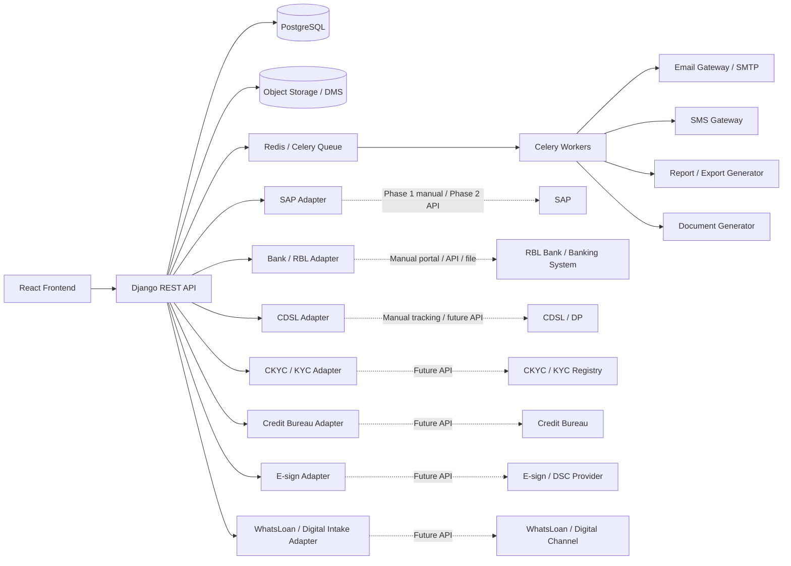
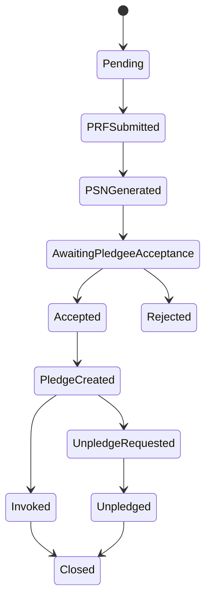

# Integrations Specification — SFPCL Member Credit Administration & Loan Disbursement Platform

## 1. Document Control

| Field | Value |
|---|---|
| Document name | `integrations.md` |
| Product / system | SFPCL Member Credit Administration & Loan Disbursement Platform |
| Client | Sahyadri Farmers Producer Company Limited |
| Backend | Python + Django + Django REST Framework |
| Frontend | React |
| Database | PostgreSQL |
| Authentication | JWT |
| Integration style | Adapter-based, API-ready, manual-first where external APIs are not confirmed |
| Source basis | Current analysis set: SOP review, client brief, user flows, functional specification, information architecture, screen specification, content specification, component specification, design system, domain model, data model, technical architecture, API contracts and auth-permissions specification |
| Intended audience | Backend engineers, frontend engineers, integration engineers, DevOps, QA, product owners, compliance stakeholders, finance users and implementation teams |
| Status | Draft for implementation planning |

---

## 2. Purpose

This document defines the detailed integration architecture and integration contracts for the SFPCL Member Credit Administration & Loan Disbursement Platform.

It covers all external and adjacent systems required to support the SOP lifecycle:

1. SAP customer code and accounting workflow.
2. RBL Bank / bank portal disbursement and reconciliation workflow.
3. Email notifications.
4. SMS notifications.
5. Object storage / Document Management System.
6. CDSL / Depository pledge tracking.
7. CKYC / KYC registry future integration.
8. Credit bureau future integration.
9. E-sign / digital signature future integration.
10. WhatsLoan / digital loan intake future integration if required.
11. Subsidiary repayment deduction data exchange.
12. Bank statement import and repayment reconciliation.
13. Report exports and document exports.
14. Audit, monitoring and alerting for integrations.

The specification supports both:

- **Phase 1 manual or semi-manual integration workflows**, where users upload evidence and record external references.
- **Phase 2 API or file-based automated integrations**, where the system can exchange data with SAP, banks, SMS providers, email gateways, CDSL, CKYC or other services.

The key principle is that every manual integration must still be represented as structured, auditable data inside the platform.

---

## 3. Integration Principles

| Principle | Meaning |
|---|---|
| Manual-first, API-ready | External APIs are not assumed for MVP; each integration starts with structured manual workflow and can later be replaced by an adapter implementation. |
| System of record clarity | The platform is the system of record for loan workflow state; SAP remains accounting/customer-code source where applicable; bank portal remains payment execution source until API integration. |
| Auditability | Every integration action must create audit logs, timestamps, user ownership and evidence references. |
| Idempotency | Any action that may create money movement, posting, code creation or notification must be idempotent. |
| No hidden external state | If external work is done outside the platform, the platform must capture reference number, status, responsible user, evidence document and timestamp. |
| Adapter isolation | Django domain services should call integration adapters, not external SDKs directly. |
| Retry safety | Automated integration calls should be retryable without duplicate side effects. |
| Secure data exchange | PAN, Aadhaar, bank account, cheque number and KYC documents must be encrypted, masked and transmitted only through approved channels. |
| Configurable providers | Email, SMS, storage, SAP mode and bank mode should be configurable by environment. |
| Observable integrations | Every call / manual step must be traceable through logs, integration events and dashboards. |

---

## 4. Integration Landscape



---

## 5. Integration Catalogue

| Integration | MVP Mode | Future Mode | Primary Owner | Criticality |
|---|---|---|---|---|
| SAP Customer Code | Manual / Excel / user confirmation | API or file integration | Credit Manager + Senior Manager – Finance | Critical |
| SAP Accounting Postings | Manual reference entry | API / scheduled sync | Accounts / Finance | High |
| RBL Bank Disbursement | Manual bank portal + reference capture | Payment API / file upload | Senior Manager – Finance + CFC | Critical |
| Bank Statement Import | Manual upload | Bank feed / API | Treasury / Accounts | High |
| Email Gateway | SMTP / API | API with delivery webhooks | System / Communications | High |
| SMS Gateway | API | API with delivery webhooks | System / Communications | High |
| Object Storage / DMS | API | API | System / IT | Critical |
| Document Generation | Internal service | Internal service / external document engine | Compliance / System | High |
| CDSL / DP Pledge Tracking | Manual milestone tracking | API if available | Company Secretary / Compliance | High |
| CKYC / KYC Registry | Manual document capture | API verification | Credit / Compliance | Medium / High |
| Credit Bureau | Not MVP unless confirmed | API enquiry | Credit | Medium |
| E-sign / DSC | Wet ink / scanned documents | API e-sign | Compliance / CS | Medium |
| Subsidiary Repayment Deduction | Manual transfer and reference capture | File / API exchange | Credit / Treasury / Subsidiary | High |
| WhatsLoan / Digital Intake | Manual reference from deck / future channel | API intake integration | Credit / IT | Medium |
| Email/SMS Delivery Webhooks | Optional MVP | Provider webhooks | IT / System | Medium |
| Reports Export | Internal generation | BI / data warehouse integration | Business / IT | Medium |
| Audit / Monitoring | Internal | SIEM integration | IT / Auditor | High |

---

# 6. Integration Architecture Pattern

## 6.1 Adapter-Based Architecture

All external integrations should be accessed through internal adapter interfaces.

```text
apps/
  integrations/
    base.py
    registry.py
    sap/
      adapter.py
      manual.py
      api.py
      serializers.py
    bank/
      adapter.py
      manual.py
      rbl_api.py
      statement_parser.py
    email/
      adapter.py
      smtp.py
      provider_api.py
    sms/
      adapter.py
      provider_api.py
    storage/
      adapter.py
      s3.py
      dms.py
    cdsl/
      adapter.py
      manual.py
    ckyc/
      adapter.py
      api.py
    bureau/
      adapter.py
      api.py
    esign/
      adapter.py
      api.py
    whatsloan/
      adapter.py
      api.py
```

## 6.2 Adapter Contract

Each adapter should expose predictable methods:

```python
class IntegrationAdapter:
    provider_code: str
    mode: str  # manual, api, file, disabled

    def validate_payload(self, payload): ...
    def submit(self, payload, *, idempotency_key=None): ...
    def get_status(self, external_reference): ...
    def cancel(self, external_reference): ...
    def parse_callback(self, payload, headers): ...
```

Not every adapter needs every method. Manual adapters may simply create internal records and wait for user confirmation.

## 6.3 Integration Mode Values

| Mode | Meaning |
|---|---|
| `disabled` | Integration not active |
| `manual` | User performs external action and records outcome |
| `file_upload` | System generates or ingests file |
| `file_exchange` | Scheduled exchange of files |
| `api` | Direct synchronous / asynchronous API integration |
| `webhook` | External system posts status callbacks |
| `hybrid` | Manual fallback plus API |

---

# 7. Integration Data Model

## 7.1 `integration_providers`

| Field | Type | Description |
|---|---|---|
| `integration_provider_id` | uuid | Primary key |
| `provider_code` | varchar | `sap`, `rbl_bank`, `email`, `sms`, `cdsl`, etc. |
| `provider_name` | varchar | Display name |
| `integration_type` | varchar | SAP, bank, email, SMS, storage, etc. |
| `mode` | varchar | Manual / API / file / disabled |
| `status` | varchar | Active / inactive |
| `environment` | varchar | dev / qa / uat / prod |
| `base_url_encrypted` | text | API base URL where relevant |
| `credentials_reference` | varchar | Secret manager reference, not raw credentials |
| `timeout_seconds` | integer | API timeout |
| `retry_policy_json` | jsonb | Retry settings |
| `created_at` | timestamptz | Created timestamp |
| `updated_at` | timestamptz | Updated timestamp |

## 7.2 `integration_events`

Append-only event table for all integration interactions.

| Field | Type | Description |
|---|---|---|
| `integration_event_id` | uuid | Primary key |
| `provider_code` | varchar | Integration provider |
| `event_type` | varchar | Request sent, response received, callback received, manual confirmation |
| `related_entity_type` | varchar | Loan application, loan account, disbursement, repayment |
| `related_entity_id` | uuid | Related entity |
| `direction` | varchar | inbound / outbound / internal |
| `request_payload_json` | jsonb | Sanitised request payload |
| `response_payload_json` | jsonb | Sanitised response payload |
| `external_reference` | varchar | External ID / UTR / SAP code / PSN |
| `status` | varchar | success / failed / pending |
| `error_code` | varchar | Error code |
| `error_message` | text | Error message |
| `idempotency_key` | varchar | Idempotency key if used |
| `attempt_number` | integer | Retry count |
| `created_by_user_id` | uuid | User or service account |
| `created_at` | timestamptz | Timestamp |

## 7.3 `integration_jobs`

For asynchronous jobs and retries.

| Field | Type | Description |
|---|---|---|
| `integration_job_id` | uuid | Primary key |
| `provider_code` | varchar | Provider |
| `job_type` | varchar | Send email, send SMS, generate SAP file, import bank statement |
| `related_entity_type` | varchar | Related entity type |
| `related_entity_id` | uuid | Related entity ID |
| `status` | varchar | queued / running / success / failed / retrying / cancelled |
| `scheduled_at` | timestamptz | Scheduled time |
| `started_at` | timestamptz | Start time |
| `completed_at` | timestamptz | Completion time |
| `retry_count` | integer | Current retry count |
| `max_retries` | integer | Max retries |
| `last_error` | text | Last error |
| `result_json` | jsonb | Sanitised result |
| `created_at` | timestamptz | Created timestamp |

## 7.4 `webhook_events`

For future provider callbacks.

| Field | Type | Description |
|---|---|---|
| `webhook_event_id` | uuid | Primary key |
| `provider_code` | varchar | Provider |
| `webhook_type` | varchar | Payment status, SMS delivery, email delivery |
| `external_event_id` | varchar | Provider event ID |
| `headers_json` | jsonb | Sanitised headers |
| `payload_json` | jsonb | Sanitised payload |
| `signature_valid_flag` | boolean | Signature verification result |
| `processing_status` | varchar | pending / processed / failed / ignored |
| `related_entity_type` | varchar | Resolved entity |
| `related_entity_id` | uuid | Resolved entity ID |
| `received_at` | timestamptz | Received timestamp |
| `processed_at` | timestamptz | Processed timestamp |
| `error_message` | text | Error details |

---

# 8. SAP Integration

## 8.1 Business Context

SAP is used or expected to be used for:

- Customer code creation.
- Vendor code where applicable.
- Initial loan payment entry.
- Repayment receipt entries.
- Interest accrual postings.
- Interest invoices / accounting records.
- Reconciliation with finance books.

The SOP requires:

1. SAP Customer ID is generated for each farmer at first loan application.
2. If borrower already has outstanding loan, no new ID is created; existing Customer ID continues.
3. Customer code is created after Sanction Committee approval.
4. Credit Manager sends official email to Senior Manager – Finance requesting SAP profile creation.
5. Email includes Excel details: farmer full name, Aadhaar, PAN, address, email ID and assigned loan application number.
6. Senior Manager – Finance confirms successful SAP Customer Code creation by email.
7. Initial loan payment SAP entry is done by Senior Manager – Finance based on Sanction Committee approval.
8. Repayment entries are posted in SAP after receipt confirmation.
9. Monthly interest accrual entries are posted in SAP.

## 8.2 MVP Integration Mode

| Aspect | MVP Approach |
|---|---|
| Customer profile creation | Platform generates request and Excel file; user creates SAP code manually |
| Request owner | Credit Manager |
| Execution owner | Senior Manager – Finance |
| Confirmation | User enters SAP customer code and uploads confirmation evidence |
| Accounting entry | Manual SAP entry; reference captured in platform |
| Error handling | Request can be returned or corrected with audit trail |
| Integration mode | `manual` / `file_upload` |

## 8.3 Future Integration Mode

| Aspect | Future Approach |
|---|---|
| Customer profile creation | API push to SAP |
| Customer code confirmation | API response or callback |
| Loan disbursement posting | API posting |
| Repayment posting | API posting or batch file |
| Interest accrual | API / scheduled posting |
| Reconciliation | Pull SAP ledger / statement |
| Integration mode | `api` / `file_exchange` |

## 8.4 SAP Data Outbound: Customer Profile Request

### Trigger

Sanction Committee approves loan and application moves to documentation / disbursement preparation.

### Source Tables

- `loan_applications`
- `members`
- `individual_member_profiles`
- `producer_institution_profiles`
- `nominees`
- `sap_customer_profile_requests`
- `document_files`

### Payload

| Field | Required | Source | Notes |
|---|---:|---|---|
| `loan_application_number` | Yes | `loan_applications.application_reference_number` | Example `LO00000025` |
| `borrower_full_name` | Yes | `members.legal_name` | Farmer / FPC name |
| `borrower_type` | Yes | `members.member_type` | Individual / FPC |
| `aadhaar_number` | Individual only | `members.aadhaar_encrypted` | Sensitive; encrypted at rest |
| `pan_number` | Yes | `members.pan_encrypted` | Sensitive |
| `registered_address` | Yes | `members` address fields | Full address |
| `email_id` | Optional | `members.email` | |
| `mobile_number` | Optional | `members.mobile_number` | |
| `folio_number` | Yes | `members.folio_number` | |
| `sanctioned_amount` | Yes | `sanction_decisions.sanctioned_amount` | |
| `sanction_date` | Yes | `sanction_decisions.recorded_at` | |
| `bank_account_last4` | Optional | `bank_accounts.account_number_last4` | Full account only where required |
| `ifsc` | Optional | `bank_accounts.ifsc` | |

### Internal API

```http
POST /api/v1/loan-applications/{loan_application_id}/sap-customer-profile-request/
```

### Response

```json
{
  "success": true,
  "data": {
    "sap_customer_profile_request_id": "uuid",
    "request_status": "draft",
    "excel_file_id": "uuid",
    "assigned_to_user": {
      "user_id": "uuid",
      "full_name": "Senior Manager – Finance"
    }
  }
}
```

## 8.5 SAP Customer Code Confirmation

### Trigger

Senior Manager – Finance completes external SAP creation.

### Required Inputs

| Field | Required | Notes |
|---|---:|---|
| `sap_customer_code` | Yes | Unique |
| `sap_vendor_code` | Optional | If applicable |
| `created_at_sap` | Optional | SAP timestamp if known |
| `confirmation_document_id` | Optional but recommended | Email / screenshot / SAP export |
| `confirmation_notes` | Optional | User notes |

### Internal API

```http
POST /api/v1/sap-customer-profile-requests/{id}/complete/
```

### Business Rules

- Existing member with outstanding loan should reuse existing SAP customer code.
- Duplicate SAP customer code should be blocked.
- Disbursement cannot proceed unless SAP customer code exists or exception is approved.
- Confirmation must be audit logged.

## 8.6 SAP Posting References

### Loan Disbursement Posting

| Field | Description |
|---|---|
| `loan_account_id` | Loan account |
| `disbursement_id` | Disbursement |
| `sap_entry_reference` | Manual / API SAP posting reference |
| `posted_by_user_id` | User who recorded posting |
| `posted_at` | Posting timestamp |
| `posting_status` | Pending / posted / failed |
| `evidence_document_id` | Optional supporting file |

### Repayment Posting

Repayment posting should be captured using:

```http
POST /api/v1/repayments/{repayment_id}/mark-sap-posted/
```

### Interest Accrual Posting

Interest accrual posting should be captured in `accrual_entries.sap_entry_reference`.

## 8.7 SAP Failure Scenarios

| Scenario | System Behaviour |
|---|---|
| Missing required profile data | Block request creation and show validation errors |
| SAP code duplicate | Block confirmation |
| SAP creation delayed | Keep request status pending; show in dashboard |
| Wrong SAP code entered | Allow correction only with privileged permission and audit log |
| SAP unavailable in future API mode | Mark integration job failed, retry if safe |
| SAP posting mismatch | Reconciliation exception and finance task |

---

# 9. Bank / RBL Bank Integration

## 9.1 Business Context

The SOP states that loan disbursement is initiated through SFPCL’s RBL Bank account:

1. Senior Manager – Finance performs final verification of approved documents and loan details.
2. Senior Manager – Finance initiates online payment through SFPCL RBL Bank account.
3. Transaction is forwarded to Chief Financial Controller for final approval / execution.
4. Once disbursed, Credit Assessment Team updates Loan Register.
5. Disbursement advice is shared with farmer.

The platform must track the bank process even if the actual transfer is performed in the external bank portal.

## 9.2 MVP Integration Mode

| Aspect | MVP Approach |
|---|---|
| Payment initiation | User marks transfer initiated after entering payment details in bank portal |
| Payment authorisation | CFC approves in bank portal and records approval in platform |
| Transfer success | UTR / bank reference entered manually |
| Evidence | Bank screenshot / statement line uploaded |
| Integration mode | `manual` |

## 9.3 Future Integration Mode

| Aspect | Future Approach |
|---|---|
| Beneficiary validation | Bank API |
| Payment initiation | Bank API or payment file |
| Payment authorisation | Bank workflow / callback |
| Payment status | Webhook or polling |
| Bank statement | API / file feed |
| Integration mode | `api` / `file_exchange` / `webhook` |

## 9.4 Disbursement Readiness Gate

Before bank integration can start:

| Check | Required |
|---|---:|
| Sanction approved | Yes |
| Loan account created | Yes |
| Documentation checklist complete | Yes |
| Company Secretary checklist approval | Yes |
| Credit Manager checklist approval | Yes |
| Sanction Committee final checklist approval | Yes |
| Security package complete | Yes |
| SAP customer code present | Yes |
| Borrower bank account verified | Yes |
| Cancelled cheque verified | Yes |
| Signature mismatch resolved | If applicable |
| Disbursement amount within sanction | Yes |
| Source bank account configured | Yes |

## 9.5 Disbursement Initiation Payload

```json
{
  "loan_account_id": "uuid",
  "loan_application_id": "uuid",
  "disbursement_amount": "400000.00",
  "source_bank_account_id": "uuid",
  "borrower_bank_account_id": "uuid",
  "borrower_account_holder_name": "Ramesh Patil",
  "borrower_account_number": "encrypted",
  "borrower_account_last4": "1234",
  "borrower_ifsc": "RATN0000001",
  "payment_method": "neft",
  "purpose": "Loan disbursement",
  "initiated_by_user_id": "uuid",
  "idempotency_key": "disbursement-LN-2026-00025-001"
}
```

## 9.6 CFC Authorisation Payload

```json
{
  "disbursement_id": "uuid",
  "decision": "approved",
  "authorised_by_user_id": "uuid",
  "comments": "Approved in bank portal.",
  "authorised_at": "2026-06-22T14:00:00Z"
}
```

## 9.7 Transfer Success Payload

```json
{
  "disbursement_id": "uuid",
  "bank_reference_number": "RBLUTR123456",
  "bank_status": "successful",
  "disbursed_at": "2026-06-22T14:15:00Z",
  "evidence_document_id": "uuid"
}
```

## 9.8 Bank Statement Import

### Purpose

Bank statements support:

- Confirming disbursement success.
- Verifying direct borrower repayments.
- Verifying subsidiary repayment transfers.
- Reconciliation with SAP.

### MVP Mode

- Upload CSV / XLSX / PDF bank statement.
- User maps columns if needed.
- System parses statement lines where possible.
- User links statement line to disbursement or repayment.
- Unmatched lines remain in reconciliation queue.

### Future Mode

- API or SFTP statement feed.
- Automatic matching by UTR, amount, date, borrower name and application reference.

## 9.9 Bank Statement Line Model

| Field | Description |
|---|---|
| `bank_statement_line_id` | UUID |
| `statement_file_id` | Uploaded statement |
| `transaction_date` | Bank transaction date |
| `value_date` | Value date |
| `description` | Bank narration |
| `debit_amount` | Debit |
| `credit_amount` | Credit |
| `balance_amount` | Balance |
| `bank_reference_number` | UTR/reference |
| `matched_entity_type` | Disbursement / repayment / other |
| `matched_entity_id` | Related ID |
| `match_status` | unmatched / suggested / matched / ignored |
| `matched_by_user_id` | User |
| `matched_at` | Timestamp |

## 9.10 Bank Failure Scenarios

| Scenario | System Behaviour |
|---|---|
| Bank portal transfer initiated but not authorised | Keep `authorisation_status = pending`; show CFC dashboard task |
| CFC rejects | Mark disbursement rejected; keep loan ready for correction |
| UTR missing | Do not mark transfer successful |
| Duplicate UTR | Block with `DUPLICATE_BANK_REFERENCE` |
| Amount mismatch | Block or create reconciliation exception |
| Wrong beneficiary | Escalate; block loan activation until corrected |
| Bank API timeout in future | Retry status check; do not duplicate payment |
| Payment failed | Mark failed and allow new initiation with new idempotency key |

---

# 10. Email Integration

## 10.1 Business Use Cases

Email is used for:

- Application acknowledgement.
- Deficiency communication.
- Rejection Note.
- Sanction approval communication.
- SAP request email to Senior Manager – Finance.
- SAP confirmation email record.
- Disbursement advice.
- Interest rate change notice.
- Interest invoice.
- Interest capitalisation intimation.
- Repayment reminders where email is chosen.
- NOC delivery.
- Grievance updates.
- Compliance task reminders.
- Admin account invitation and password reset.

## 10.2 MVP Mode

| Aspect | Approach |
|---|---|
| Provider | SMTP or email API |
| Sending | Celery asynchronous task |
| Templates | `content_templates` table |
| Evidence | `communications` record |
| Attachments | Generated documents from object storage |
| Delivery status | Sent / failed; detailed webhooks optional |
| Retry | Configured retry with backoff |

## 10.3 Email Payload

```json
{
  "communication_id": "uuid",
  "template_code": "loan_rejection_email_v1",
  "recipient_email": "borrower@example.com",
  "recipient_name": "Ramesh Patil",
  "subject": "Loan Application LO00000025 - Rejection Note",
  "body_html": "<p>Dear Ramesh Patil...</p>",
  "body_text": "Dear Ramesh Patil...",
  "attachments": [
    {
      "document_id": "uuid",
      "file_name": "rejection-note-LO00000025.pdf"
    }
  ],
  "related_entity_type": "loan_application",
  "related_entity_id": "uuid"
}
```

## 10.4 Email Template Variables

Common variables:

| Variable | Meaning |
|---|---|
| `borrower_name` | Borrower display name |
| `application_reference_number` | `LO00000025` |
| `loan_account_number` | Loan account number |
| `sanctioned_amount` | Sanctioned loan amount |
| `disbursement_amount` | Disbursed amount |
| `bank_reference_number` | UTR / transfer reference |
| `rejection_reason` | Rejection note reason |
| `deficiency_list` | Missing documents / deficiencies |
| `interest_invoice_number` | Invoice number |
| `interest_amount` | Interest payable |
| `capitalised_interest_amount` | Capitalised amount |
| `new_principal_amount` | Revised principal |
| `noc_date` | NOC issue date |
| `grievance_reference` | Grievance ID / reference |

## 10.5 Delivery Status

| Status | Meaning |
|---|---|
| `queued` | Email job queued |
| `sending` | Provider call in progress |
| `sent` | Provider accepted |
| `delivered` | Delivery confirmed, if webhook available |
| `bounced` | Delivery failed permanently |
| `failed` | Provider error |
| `retrying` | Retry pending |

## 10.6 Email Failure Scenarios

| Scenario | System Behaviour |
|---|---|
| SMTP / provider unavailable | Retry through Celery |
| Invalid email | Mark failed; show communication exception |
| Attachment missing | Block send until document exists |
| Attachment too large | Compress / link / split based on policy |
| Template inactive | Block send |
| Missing template variable | Validation error before queueing |
| Delivery bounced | Mark communication failed and notify owner |

---

# 11. SMS Integration

## 11.1 Business Use Cases

SMS is used for:

- Application acknowledgement.
- Loan status alerts.
- Interest rate change notices.
- Repayment reminders.
- Outstanding beyond one year reminders.
- Disbursement advice summary.
- Grievance updates.
- OTP / MFA if enabled in future.

## 11.2 MVP Mode

| Aspect | Approach |
|---|---|
| Provider | SMS gateway API |
| Sending | Celery asynchronous task |
| Templates | `content_templates` with `template_type = sms` |
| Delivery | Provider response; delivery webhook optional |
| Language | English initially; Marathi / Hindi future if required |
| Audit | `communications` record |

## 11.3 SMS Payload

```json
{
  "communication_id": "uuid",
  "recipient_mobile": "+919999999999",
  "template_code": "repayment_reminder_sms_v1",
  "message": "SFPCL reminder: Loan LN-2026-00025 is outstanding. Please contact Credit Team.",
  "related_entity_type": "loan_account",
  "related_entity_id": "uuid"
}
```

## 11.4 SMS Template Constraints

| Rule | Requirement |
|---|---|
| Length | Keep within provider limits |
| Variables | Must be validated |
| Sensitive data | Do not include PAN, Aadhaar, full bank details |
| Language | Template should specify language |
| Consent | Borrower communication consent should be respected where required |
| Rate limiting | Avoid duplicate reminders |

## 11.5 SMS Failure Scenarios

| Scenario | System Behaviour |
|---|---|
| Provider timeout | Retry |
| Invalid mobile number | Mark failed |
| DND / blocked | Mark failed or undelivered |
| Template not approved | Block send |
| Duplicate reminder | Prevent through communication rules |

---

# 12. Object Storage / Document Management Integration

## 12.1 Business Context

The system manages many sensitive files:

- PAN and Aadhaar.
- Share certificates.
- Land 7/12 extract.
- Crop plan.
- Bank statements.
- Cancelled cheque.
- Blank-dated cheque image, if scanned.
- Bank Verification Letter.
- PoA.
- Tri-party Declaration / Agreement.
- Term Sheet.
- Loan Agreement.
- SH-4.
- CDSL pledge evidence.
- SAP Excel request.
- Bank transfer evidence.
- Interest invoices.
- Extension notes.
- Non-Payment Notes.
- Recovery evidence.
- NOC.
- Security return acknowledgement.
- Archive evidence.
- Compliance evidence and Board minutes.

## 12.2 Storage Pattern

| Layer | Responsibility |
|---|---|
| PostgreSQL `document_files` | Metadata, sensitivity, checksum, owner, retention |
| Object Storage / DMS | File binary |
| Domain tables | Document type, workflow status, verification, stamping |
| Audit logs | Upload, view, download, delete / archive events |

## 12.3 File Upload Contract

### Internal API

```http
POST /api/v1/document-files/
Content-Type: multipart/form-data
```

### Required Metadata

| Field | Required | Notes |
|---|---:|---|
| `file` | Yes | Binary |
| `document_category` | Yes | KYC / legal / security / finance / compliance |
| `sensitivity_level` | Yes | Internal / confidential / restricted |
| `related_entity_type` | Optional | Application / loan / compliance |
| `related_entity_id` | Optional | Related UUID |
| `document_type` | Optional | PAN, Aadhaar, loan agreement, etc. |
| `retention_until_date` | Optional | Derived if not supplied |

## 12.4 Storage Controls

| Control | Requirement |
|---|---|
| Encryption at rest | Required |
| TLS in transit | Required |
| Virus scan | Recommended before marking available |
| Checksum | SHA-256 or equivalent |
| Access control | Backend permission check before signed URL |
| Signed URL expiry | Short duration |
| Download audit | Required for restricted files |
| Retention | Loan files at least eight years |
| Deletion | Restricted; prefer archive over delete |
| File naming | Do not expose sensitive values in file name |

## 12.5 Document Generation Integration

The platform may generate documents using:

- HTML-to-PDF engine.
- DOCX templates and PDF conversion.
- Template engine with merge fields.

Generated files should be stored back through the same document storage adapter.

## 12.6 File Failure Scenarios

| Scenario | System Behaviour |
|---|---|
| Upload interrupted | Mark upload failed; no document verification |
| Virus detected | Quarantine / reject file |
| Unsupported file type | Validation error |
| Storage unavailable | Retry or show error |
| Checksum mismatch | Reject file |
| User lacks access | Deny download and audit denied attempt |
| Missing file for metadata | Mark document broken and create admin task |

---

# 13. CDSL / Depository Integration

## 13.1 Business Context

For demat shares, the SOP uses a CDSL pledge process:

1. Pledgor and pledgee must have BO accounts with CDSL.
2. Pledgor submits Pledge Request Form to DP.
3. Pledgor DP creates pledge request and generates Pledge Sequence Number.
4. Pledge request is available to pledgee DP.
5. Pledgee submits accept / reject instruction.
6. Pledge is created after pledgee DP accepts.
7. Loan agreement and disbursement occur outside the depository system.
8. Pledgee informs agreement number in pledge request form.
9. Invocation is done through Invocation Request Form.
10. Securities move from pledgor account to pledgee account.
11. Unpledge is done through Unpledge Request Form.

## 13.2 MVP Mode

Manual milestone tracking:

- Capture BO account details.
- Capture DP names / IDs.
- Capture PRF submission.
- Capture PSN.
- Capture pledge acceptance.
- Capture pledge status.
- Upload evidence documents.
- Track invocation / unpledge.

## 13.3 Future Mode

API integration if DP / CDSL provides accessible APIs:

- Create pledge request.
- Fetch PSN.
- Accept pledge.
- Fetch pledge status.
- Invoke pledge.
- Unpledge.
- Fetch transaction statements.

## 13.4 CDSL Pledge Status Lifecycle



## 13.5 CDSL Data Fields

| Field | Description |
|---|---|
| `pledgor_member_id` | Borrower |
| `pledgee_entity_name` | SFPCL |
| `pledgor_bo_account` | Encrypted |
| `pledgee_bo_account` | Encrypted |
| `pledgor_dp_name` | Pledgor DP |
| `pledgee_dp_name` | Pledgee DP |
| `prf_status` | Pledge Request Form status |
| `pledge_sequence_number` | PSN |
| `pledge_acceptance_status` | Pending / accepted / rejected |
| `pledged_share_count` | Shares pledged |
| `agreement_number` | Loan agreement number |
| `pledge_status` | Pending / created / invoked / unpledged |
| `evidence_document_id` | Supporting document |

## 13.6 CDSL Failure Scenarios

| Scenario | System Behaviour |
|---|---|
| BO account missing | Block demat pledge completion |
| PRF not submitted | Security package incomplete |
| PSN missing | Cannot mark pledge created |
| Pledge rejected | Return to documentation / security correction |
| Pledge not created | Block disbursement unless exception approved |
| Invocation attempted without recovery approval | Block |
| Unpledge pending after closure | Keep closure security return pending |

---

# 14. CKYC / KYC Registry Future Integration

## 14.1 Business Context

The SOP requires KYC / CKYC controls:

- PAN.
- Aadhaar / OVD.
- Beneficial ownership for institutional borrowers.
- CKYC consent.
- KYC records preserved.
- Re-KYC every two years.
- Maker-checker verification.

## 14.2 MVP Mode

Manual KYC collection and verification:

- Upload PAN / Aadhaar / OVD.
- Capture self-attestation.
- Capture CKYC consent.
- Capture risk rating.
- Capture beneficial ownership verification for FPC / Producer Institution.
- Track re-KYC due date.

## 14.3 Future API Mode

Possible CKYC integration:

- Search CKYC by ID / PAN / Aadhaar token where legally allowed.
- Fetch CKYC profile.
- Validate OVD.
- Push KYC update.
- Update CKYC identifier in KYC profile.
- Retrieve verification status.

## 14.4 KYC Request Payload

```json
{
  "party_type": "member",
  "party_id": "uuid",
  "party_name": "Ramesh Patil",
  "pan": "ABCDE1234F",
  "aadhaar": "123412341234",
  "ckyc_consent_flag": true,
  "date_of_birth": "1980-01-15",
  "mobile_number": "+919999999999"
}
```

## 14.5 KYC Response Payload

```json
{
  "external_reference": "CKYC123456789",
  "verification_status": "verified",
  "matched_name": "Ramesh Patil",
  "risk_flags": [],
  "verified_at": "2026-06-22T10:30:00Z"
}
```

## 14.6 KYC Integration Controls

| Control | Requirement |
|---|---|
| Consent | Required before external KYC call |
| Sensitive data | Encrypt request logs or avoid storing raw payload |
| Audit | Log KYC call metadata |
| Masking | Do not expose full Aadhaar unless authorised |
| Retry | Avoid repeated KYC calls without reason |
| Re-KYC | Scheduled tasks every two years |

---

# 15. Credit Bureau Future Integration

## 15.1 Business Context

The borrower compliance section references bureau consent, but the current SOP does not fully define the credit bureau process. Therefore, bureau integration should be optional and configurable.

## 15.2 MVP Mode

- Capture bureau consent if required by client.
- Do not make bureau check mandatory unless confirmed.
- Store future-ready fields.

## 15.3 Future Mode

API call to credit bureau:

- Submit borrower identity and consent.
- Receive credit score / report.
- Store report document.
- Store summary risk flags.
- Use in appraisal / risk assessment.

## 15.4 Bureau Check Payload

```json
{
  "loan_application_id": "uuid",
  "member_id": "uuid",
  "borrower_name": "Ramesh Patil",
  "pan": "ABCDE1234F",
  "aadhaar_last4": "1234",
  "mobile_number": "+919999999999",
  "consent_document_id": "uuid",
  "loan_amount_requested": "400000.00"
}
```

## 15.5 Bureau Response Payload

```json
{
  "credit_bureau_check_id": "uuid",
  "bureau_name": "Example Bureau",
  "score": 720,
  "risk_category": "low",
  "report_document_id": "uuid",
  "check_status": "completed",
  "checked_at": "2026-06-22T10:30:00Z"
}
```

## 15.6 Open Decision

Client must confirm:

- Whether bureau checks are required.
- Which bureau provider to use.
- Whether bureau score affects eligibility or only appraisal.
- Whether bureau checks are required for all borrowers or only above a threshold.

---

# 16. E-sign / Digital Signature Future Integration

## 16.1 Business Context

The current SOP relies heavily on wet-ink signatures and notarised physical documents:

- Application signed by applicant and nominee.
- PoA signed by farmer and nominee.
- Declaration / Tri-party Agreement.
- SH-4 signed by applicant and witness.
- Term Sheet signed by applicant and nominee.
- Loan Agreement signed by applicant and witness.
- Checklist signatures by CS, Credit Manager, Sanction Committee and Senior Manager – Finance.

## 16.2 MVP Mode

- Wet-ink signature.
- Scan and upload signed documents.
- Record signature status.
- Resolve signature mismatch through Bank Verification Letter or borrower declaration.
- Record digital checklist approvals internally.

## 16.3 Future Mode

E-sign integration may support:

- Borrower e-sign.
- Nominee e-sign.
- Witness e-sign.
- Internal approver digital signature.
- Document execution status callback.
- Signed PDF retrieval.

## 16.4 E-sign Envelope Payload

```json
{
  "loan_application_id": "uuid",
  "document_id": "uuid",
  "document_type": "loan_agreement",
  "signers": [
    {
      "signer_party_type": "borrower",
      "signer_party_id": "uuid",
      "name": "Ramesh Patil",
      "email": "ramesh@example.com",
      "mobile_number": "+919999999999",
      "signature_order": 1
    },
    {
      "signer_party_type": "witness",
      "signer_party_id": "uuid",
      "name": "Witness Name",
      "email": "witness@example.com",
      "mobile_number": "+919888888888",
      "signature_order": 2
    }
  ],
  "callback_url": "https://host/api/v1/webhooks/esign/status/"
}
```

## 16.5 E-sign Status Lifecycle

| Status | Meaning |
|---|---|
| `draft` | Envelope created |
| `sent` | Sent to signers |
| `partially_signed` | Some signers completed |
| `signed` | All signers completed |
| `declined` | Signer declined |
| `expired` | Signing link expired |
| `failed` | Provider failure |

## 16.6 E-sign Constraints

| Constraint | Notes |
|---|---|
| Stamp duty | E-sign does not automatically solve stamp duty unless provider supports e-stamp |
| Notarisation | PoA / Loan Agreement notarisation requirements must be legally validated |
| Witness | Witness signing flow must be supported |
| Borrower language | Communication language must be clear |
| Audit | Provider certificate must be stored |

---

# 17. Subsidiary Repayment Deduction Integration

## 17.1 Business Context

The SOP allows repayment through subsidiary deduction:

1. Borrower sells produce to subsidiary.
2. Subsidiary pays borrower but deducts loan dues.
3. Subsidiary pays deducted amount to SFPCL.
4. SFPCL adjusts against outstanding loan.
5. Borrower signs tri-party agreement with SFPCL and relevant subsidiary.
6. Bank statement transaction must reflect borrower name and loan application number.

## 17.2 MVP Mode

Manual tracking:

- Record subsidiary company.
- Upload tri-party agreement.
- Capture produce payment reference.
- Capture bank transfer reference.
- Match repayment to loan account.
- Allocate principal-first.
- Mark SAP receipt posting.

## 17.3 Future Mode

File or API exchange with subsidiary:

- Subsidiary sends deduction file.
- Platform validates borrower and loan reference.
- Platform creates repayment records.
- Treasury reconciles bank transfer.
- Exceptions go to queue.

## 17.4 Subsidiary Deduction File Format

Suggested CSV columns:

| Column | Required | Description |
|---|---:|---|
| `deduction_reference` | Yes | Unique subsidiary deduction reference |
| `subsidiary_code` | Yes | Subsidiary identifier |
| `loan_application_number` | Yes | `LO00000025` |
| `loan_account_number` | Optional | Loan account number |
| `borrower_name` | Yes | Borrower name |
| `member_folio_number` | Optional | Folio number |
| `produce_payment_reference` | Yes | Produce payment reference |
| `produce_payment_date` | Yes | Date |
| `gross_payable_amount` | Optional | Gross amount |
| `loan_deduction_amount` | Yes | Amount deducted |
| `transfer_reference` | Optional | Bank reference |
| `transfer_date` | Optional | Date transferred to SFPCL |

## 17.5 Validation Rules

| Rule | Error / Action |
|---|---|
| Loan application not found | Mark unmatched |
| Loan account closed | Mark exception |
| Amount <= 0 | Reject row |
| Duplicate deduction reference | Ignore / duplicate exception |
| Borrower name mismatch | Flag for manual review |
| Transfer reference missing | Create pending reconciliation |
| Amount exceeds outstanding | Allocate up to outstanding and flag excess |

---

# 18. WhatsLoan / Digital Intake Future Integration

## 18.1 Context

The visual summary document references WhatsLoan in the file name / summary context. If SFPCL uses WhatsLoan or a similar digital channel for loan request intake, the platform should support future integration without making it a dependency for MVP.

## 18.2 MVP Mode

- Application channel can be set to `offline`, `digital_portal` or `assisted_digital`.
- External reference can be manually captured.
- Documents can be uploaded by internal users.

## 18.3 Future Mode

Possible inbound API:

- New loan inquiry.
- Borrower KYC data.
- Nominee details.
- Uploaded documents.
- Required loan amount.
- Crop purpose.
- Consent data.
- Status updates back to WhatsLoan.

## 18.4 Inbound Loan Inquiry Payload

```json
{
  "external_channel": "whatsloan",
  "external_reference": "WL-123456",
  "borrower": {
    "name": "Ramesh Patil",
    "mobile_number": "+919999999999",
    "pan": "ABCDE1234F",
    "aadhaar": "123412341234",
    "folio_number": "FOL-456"
  },
  "nominee": {
    "name": "Sita Patil",
    "pan": "ABCDE1234F",
    "aadhaar": "123412341234",
    "gender": "female",
    "age": 41
  },
  "loan_request": {
    "required_loan_amount": "400000.00",
    "purpose_category": "crop_production",
    "declared_purpose": "Grape cultivation"
  },
  "documents": [
    {
      "document_type": "borrower_pan",
      "file_url": "https://external-file-url"
    }
  ]
}
```

## 18.5 Outbound Status Update

```json
{
  "external_reference": "WL-123456",
  "application_reference_number": "LO00000025",
  "status": "submitted_to_sanction_committee",
  "message": "Application has been submitted for sanction approval.",
  "updated_at": "2026-06-22T10:30:00Z"
}
```

## 18.6 Controls

| Control | Requirement |
|---|---|
| Duplicate detection | PAN hash, Aadhaar hash, mobile and folio |
| Consent | External channel must provide consent records |
| Document verification | External documents still require internal verification |
| Security | API keys, signed payloads or OAuth |
| Audit | Inbound payload must be logged after sanitisation |
| Rejection | Invalid payloads go to integration exception queue |

---

# 19. Notification Event Matrix

## 19.1 Loan Origination Notifications

| Event | Recipient | Channel | Trigger |
|---|---|---|---|
| Application created | Borrower | SMS / Email | Application reference generated |
| Application incomplete | Borrower | Email / courier record | Deficiencies raised |
| Deficiency resolved | Credit Team | In-app / Email | Borrower submits missing documents |
| Appraisal due soon | Deputy Manager / Credit Manager | In-app / Email | TAT nearing breach |
| Application rejected | Borrower | Email / courier record | Rejection Note approved |
| Submitted to Sanction Committee | CFO / Directors | Email / In-app | Approval case created |

## 19.2 Approval and Documentation Notifications

| Event | Recipient | Channel | Trigger |
|---|---|---|---|
| Approval pending | CFO / Director | Email / In-app | Approval case assigned |
| Approval returned | Credit Manager | Email / In-app | Approver returns for clarification |
| Sanction approved | Credit / Compliance | Email / In-app | Approval completed |
| Documentation pending | Compliance Team | In-app | Sanction approved |
| Checklist ready for CS | Company Secretary | In-app / Email | Docs prepared |
| Checklist ready for Credit Manager | Credit Manager | In-app / Email | CS approval complete |
| Final checklist approval pending | Sanction Committee | In-app / Email | Credit approval complete |

## 19.3 Disbursement Notifications

| Event | Recipient | Channel | Trigger |
|---|---|---|---|
| SAP code request | Senior Manager – Finance | Email / In-app | Credit Manager creates request |
| SAP code completed | Credit Manager | Email / In-app | Senior Manager confirms code |
| Disbursement ready | Senior Manager – Finance | In-app | Documentation and SAP complete |
| Bank authorisation pending | CFC | In-app / Email | Transfer initiated |
| Disbursement completed | Borrower | Email / SMS | Bank transfer successful |
| Disbursement failed | Treasury / Credit | In-app / Email | Transfer failed |

## 19.4 Repayment and Monitoring Notifications

| Event | Recipient | Channel | Trigger |
|---|---|---|---|
| Repayment received | Borrower / Credit | SMS / Email / In-app | Repayment captured |
| SAP posting pending | Accounts / Finance | In-app | Repayment recorded |
| Interest invoice issued | Borrower | Email / letter | Year-end invoice generated |
| Interest unpaid by 30 April | Borrower | Email + hard-copy letter | Capitalisation rule |
| Outstanding beyond one year | Borrower | SMS / phone | Quarterly monitoring |
| DPD bucket worsened | Credit Manager / CFO | In-app / Email | DPD job |

## 19.5 Default, Recovery and Closure Notifications

| Event | Recipient | Channel | Trigger |
|---|---|---|---|
| Default case opened | Credit Manager / borrower | In-app / SMS / phone | Missed principal repayment |
| Grace period ending | Credit Manager | In-app | Before grace expiry |
| Extension granted | Borrower | Email / letter | Non-intentional default |
| Non-payment note submitted | Sanction Committee | In-app / Email | Extension expired |
| Recovery approved | Company Secretary | In-app / Email | Recovery decision approved |
| Loan closed | Borrower / CS | Email / In-app | Outstanding zero |
| NOC issued | Borrower | Email / physical | NOC generated |
| Security returned | Borrower / CS | Email / acknowledgement | Security return recorded |

---

# 20. Integration Security

## 20.1 Security Requirements

| Area | Requirement |
|---|---|
| Transport security | HTTPS/TLS for all APIs |
| Credentials | Store in secret manager, not database plaintext |
| API keys | Rotate periodically |
| Webhook signatures | Verify signatures for callbacks |
| IP allowlisting | Use for bank / SAP / webhook endpoints if possible |
| Payload sanitisation | Do not store raw PAN, Aadhaar or bank account in logs |
| Field encryption | Encrypt sensitive values before storing |
| Access control | Integration actions require role permissions |
| Audit | Every integration event logged |
| Least privilege | Service accounts get only required permissions |
| Error messages | Do not expose secrets or sensitive payloads |

## 20.2 Sensitive Data in Integrations

| Data | Integration | Rule |
|---|---|---|
| PAN | SAP, KYC, bureau | Encrypt at rest; mask in logs |
| Aadhaar | SAP, KYC | Avoid storing in integration logs; mask |
| Bank account | Bank, SAP | Encrypt; show last 4 only |
| Cheque number | Security | Restricted; never send unless required |
| BO account | CDSL | Encrypt; mask |
| KYC documents | Storage / KYC | Restricted access |
| Bank statements | Bank import | Restricted access |

## 20.3 Webhook Security

Future webhook endpoints should enforce:

- Provider signature verification.
- Replay protection using timestamp / nonce.
- Idempotency using external event ID.
- IP allowlisting where possible.
- Payload schema validation.
- Safe error responses.
- Separate audit trail for callbacks.

---

# 21. Idempotency and Duplicate Prevention

## 21.1 Idempotency-Key Required

| Integration Action | Reason |
|---|---|
| SAP customer request creation | Avoid duplicate requests |
| SAP customer code confirmation | Avoid duplicate code records |
| Disbursement initiation | Avoid duplicate payment |
| Bank transfer success marking | Avoid duplicate loan activation |
| Repayment capture | Avoid duplicate repayment |
| Repayment allocation | Avoid duplicate allocation |
| Interest accrual | Avoid duplicate month posting |
| Interest capitalisation | Avoid duplicate principal increase |
| Email / SMS send | Avoid duplicate borrower communication |
| Report export | Avoid duplicate heavy jobs |
| Recovery action initiation | Avoid duplicate security invocation |

## 21.2 Duplicate Matching Rules

| Object | Duplicate Key |
|---|---|
| SAP customer code | `sap_customer_code` |
| SAP request | `loan_application_id` + active request |
| Bank disbursement | `loan_account_id` + disbursement sequence |
| Bank transfer | `bank_reference_number` |
| Repayment | `loan_account_id` + `bank_reference_number` |
| Subsidiary deduction | `deduction_reference` |
| Accrual | `loan_account_id` + `accrual_month` |
| Interest capitalisation | `loan_account_id` + `financial_year` |
| Email / SMS | `communication_id` |
| Webhook event | provider + external event ID |

---

# 22. Error Handling and Retry Strategy

## 22.1 Error Classes

| Error Class | Examples | Retry? |
|---|---|---|
| Validation error | Missing PAN, invalid IFSC, missing template variable | No |
| Permission error | User cannot perform action | No |
| Workflow error | Disbursement before SAP code | No |
| Provider timeout | SMS / email / SAP API timeout | Yes |
| Provider 5xx | External system unavailable | Yes |
| Provider 4xx | Invalid request | Usually no |
| Duplicate error | Duplicate UTR / SAP code | No |
| Reconciliation mismatch | Amount mismatch | Manual review |
| Storage error | File upload failed | Retry if safe |

## 22.2 Retry Policy

| Integration | Retry Policy |
|---|---|
| Email | 3–5 retries with exponential backoff |
| SMS | 3–5 retries with exponential backoff |
| Object storage upload | Retry safe failures |
| SAP API future | Retry only idempotent calls |
| Bank payment future | Do not retry payment creation blindly; retry status check instead |
| Bank statement import | Retry parsing after correction |
| Webhook processing | Retry internal processing; never ask provider to resend unless needed |
| Report export | Retry once or twice depending failure |

## 22.3 Dead Letter Queue

Failed integration jobs should move to an exception queue after max retries.

Exception queue fields:

- Provider.
- Job type.
- Related entity.
- Last error.
- Retry count.
- Assigned owner.
- Resolution action.
- Resolved by.
- Resolved at.

---

# 23. Reconciliation Architecture

## 23.1 Reconciliation Types

| Type | Purpose |
|---|---|
| Bank vs platform disbursement | Confirm outgoing loan transfer |
| Bank vs repayment records | Confirm incoming repayment |
| Subsidiary transfer vs repayment records | Confirm deducted repayment reached SFPCL |
| SAP vs platform loan account | Verify loan customer code and posting |
| SAP vs platform repayment | Verify receipt postings |
| SAP vs platform interest accrual | Verify monthly accruals |
| Security register vs physical custody | Verify SH-4 / cheque / PoA custody |
| CDSL pledge vs platform security record | Verify demat pledge status |

## 23.2 Bank Reconciliation Matching Rules

Suggested matching priority:

1. Exact bank reference / UTR.
2. Exact amount + date tolerance.
3. Loan application number in narration.
4. Loan account number in narration.
5. Borrower name in narration.
6. Subsidiary transfer reference.
7. Manual matching.

## 23.3 Reconciliation Status

| Status | Meaning |
|---|---|
| `unmatched` | No candidate found |
| `candidate_found` | Possible match found |
| `matched` | Confirmed match |
| `partially_matched` | Amount partially matched |
| `mismatch` | Amount / party mismatch |
| `ignored` | Not relevant transaction |
| `escalated` | Needs review |

## 23.4 Reconciliation Exceptions

| Exception | Owner |
|---|---|
| UTR not found | Treasury |
| Amount mismatch | Accounts / Credit |
| Borrower name mismatch | Credit |
| Subsidiary reference missing | Treasury / Subsidiary coordinator |
| SAP posting missing | Accounts |
| Duplicate receipt | Accounts |
| Disbursement without bank confirmation | Senior Manager – Finance / CFC |

---

# 24. Integration Dashboards

## 24.1 SAP Dashboard

Cards:

- SAP requests pending.
- SAP requests overdue.
- SAP codes created today.
- SAP posting pending for disbursements.
- SAP posting pending for repayments.
- SAP posting failures.
- Duplicate / correction requests.

## 24.2 Bank Dashboard

Cards:

- Disbursements initiated.
- CFC authorisation pending.
- Transfers pending UTR.
- Transfer failures.
- Bank statement lines unmatched.
- Repayments pending allocation.
- Reconciliation exceptions.

## 24.3 Communication Dashboard

Cards:

- Emails queued.
- Emails failed.
- SMS queued.
- SMS failed.
- Bounced borrower emails.
- Reminder delivery exceptions.
- Pending hard-copy letters.

## 24.4 Document Storage Dashboard

Cards:

- Upload failures.
- Virus scan failures.
- Missing generated documents.
- Restricted downloads today.
- Archive pending.
- Retention due.

## 24.5 Security / CDSL Dashboard

Cards:

- CDSL pledges pending PRF.
- PSN pending.
- Pledgee acceptance pending.
- Pledges rejected.
- Unpledge pending after closure.
- Security invocation pending approval.

---

# 25. API Contracts for Integration Endpoints

## 25.1 Integration Provider Configuration

```http
GET /api/v1/integrations/providers/
POST /api/v1/integrations/providers/
PATCH /api/v1/integrations/providers/{integration_provider_id}/
```

### Example Provider

```json
{
  "provider_code": "sap",
  "provider_name": "SAP",
  "integration_type": "erp",
  "mode": "manual",
  "status": "active",
  "environment": "production",
  "timeout_seconds": 30,
  "retry_policy": {
    "max_retries": 3,
    "backoff": "exponential"
  }
}
```

## 25.2 Integration Events

```http
GET /api/v1/integrations/events/?provider_code=sap&related_entity_type=loan_application&related_entity_id=uuid
```

## 25.3 Integration Jobs

```http
GET /api/v1/integrations/jobs/?status=failed&provider_code=email
POST /api/v1/integrations/jobs/{integration_job_id}/retry/
POST /api/v1/integrations/jobs/{integration_job_id}/cancel/
```

## 25.4 Bank Statement Upload

```http
POST /api/v1/integrations/bank/statements/upload/
Content-Type: multipart/form-data
```

Fields:

- `bank_account_id`
- `statement_period_start`
- `statement_period_end`
- `file`
- `format`
- `remarks`

## 25.5 Bank Statement Match

```http
POST /api/v1/integrations/bank/statement-lines/{bank_statement_line_id}/match/
```

```json
{
  "matched_entity_type": "repayment",
  "matched_entity_id": "uuid",
  "match_reason": "UTR and amount matched."
}
```

## 25.6 Webhook Endpoints

Future endpoints:

```http
POST /api/v1/webhooks/bank/payment-status/
POST /api/v1/webhooks/email/delivery-status/
POST /api/v1/webhooks/sms/delivery-status/
POST /api/v1/webhooks/esign/status/
POST /api/v1/webhooks/whatsloan/application-status/
```

---

# 26. Integration Event Payload Standards

## 26.1 Outbound Event Envelope

```json
{
  "event_id": "uuid",
  "event_type": "SAP_CUSTOMER_CODE_REQUESTED",
  "occurred_at": "2026-06-22T10:30:00Z",
  "source_system": "sfpcl_credit_platform",
  "related_entity": {
    "type": "loan_application",
    "id": "uuid",
    "reference": "LO00000025"
  },
  "payload": {},
  "metadata": {
    "request_id": "req_123",
    "idempotency_key": "sap-request-LO00000025"
  }
}
```

## 26.2 Inbound Event Envelope

```json
{
  "provider_event_id": "provider-evt-123",
  "event_type": "PAYMENT_STATUS_UPDATED",
  "occurred_at": "2026-06-22T10:30:00Z",
  "provider_code": "rbl_bank",
  "payload": {},
  "signature": "signature"
}
```

---

# 27. Integration Monitoring and Observability

## 27.1 Logs

Integration logs must include:

- Request ID.
- Provider code.
- Job ID.
- Related entity.
- Direction.
- Status.
- Duration.
- Error code.
- Retry count.
- User / service account.
- Sanitised payload metadata.

Do not log:

- Full Aadhaar.
- Full PAN.
- Full bank account.
- Raw credentials.
- Unmasked cheque numbers.
- KYC document contents.

## 27.2 Metrics

| Metric | Purpose |
|---|---|
| Integration calls by provider | Volume |
| Success rate by provider | Reliability |
| Failure rate by provider | Alerting |
| Average latency | Performance |
| Retry count | Stability |
| Queue depth | Worker health |
| Dead-letter count | Exception load |
| SAP request pending age | Operational bottleneck |
| Disbursement pending CFC age | Finance bottleneck |
| Bank unmatched lines count | Reconciliation risk |
| Email / SMS failure count | Communication risk |

## 27.3 Alerts

| Alert | Severity |
|---|---|
| Payment integration failure | Critical |
| Disbursement marked initiated but not authorised beyond threshold | High |
| Disbursement authorised but UTR missing beyond threshold | High |
| SAP request pending beyond SLA | Medium |
| Email provider failure | Medium |
| SMS provider failure | Medium |
| Object storage unavailable | Critical |
| Bank statement import failure | Medium |
| High sensitive document download volume | High |
| Webhook signature failures spike | High |

---

# 28. Testing Strategy for Integrations

## 28.1 Unit Tests

| Area | Tests |
|---|---|
| Adapter payload mapping | Correct field mapping |
| Sensitive data masking | Logs do not contain raw sensitive data |
| Idempotency | Duplicate keys return original response |
| Retry decision | Retry only safe errors |
| Template rendering | Missing variables fail |
| Bank matching | UTR / amount / date matching |
| SAP duplicate code | Duplicate blocked |
| CDSL state transitions | Invalid transition blocked |

## 28.2 Integration Tests

| Integration | Tests |
|---|---|
| Email | Mock provider success / failure |
| SMS | Mock provider delivery response |
| Storage | Upload, download, checksum, permission |
| SAP manual | Request creation and completion |
| Bank manual | Initiation, CFC approval, UTR success |
| Bank statement | Upload and parse sample file |
| CDSL | Manual pledge milestone lifecycle |
| Webhooks | Signature validation and idempotency |

## 28.3 End-to-End Tests

Critical E2E integration scenarios:

1. Sanction approved → SAP request generated → SAP code confirmed → disbursement readiness passes.
2. Documentation complete → disbursement initiated → CFC authorised → UTR captured → loan active.
3. Direct repayment received → bank reference captured → repayment allocated principal-first → SAP posted.
4. Subsidiary deduction transfer → repayment created → bank statement matched → SAP posted.
5. Interest invoice generated → email sent → unpaid interest capitalised after 30 April.
6. Demat share pledge required → PRF submitted → PSN entered → pledge accepted → security complete.
7. Full repayment → NOC generated → security returned → archive record created.
8. Email failure → retry → dead-letter after max retries.
9. Duplicate bank UTR → duplicate blocked.
10. User without permission attempts restricted document download → denied and audit logged.

---

# 29. Data Privacy and Retention for Integrations

## 29.1 Privacy Rules

| Rule | Requirement |
|---|---|
| PII minimisation | Send only required data to external systems |
| Consent | CKYC / bureau calls require consent |
| Masking | Logs must mask sensitive values |
| Encryption | Sensitive payloads encrypted at rest |
| Retention | Integration logs retained as per audit policy |
| Deletion | Do not delete active loan integration evidence |
| Access | Restricted to authorised roles |
| Export | Sensitive export requires special permission |

## 29.2 Integration Evidence Retention

| Evidence | Retention |
|---|---|
| SAP request Excel | Loan file retention period |
| SAP confirmation | Loan file retention period |
| Bank transfer evidence | Loan file retention period |
| Bank statement lines | Accounting / audit retention |
| Email / SMS communications | Loan file retention period where related |
| CDSL pledge evidence | Loan file retention period |
| KYC verification evidence | KYC retention rules |
| Bureau report | Client-confirmed retention |
| E-sign certificate | Loan file retention period |
| Webhook logs | Operational + audit retention |

---

# 30. Deployment and Environment Configuration

## 30.1 Environment Variables

| Variable | Purpose |
|---|---|
| `SAP_MODE` | manual / api / disabled |
| `SAP_BASE_URL` | Future SAP API URL |
| `SAP_CREDENTIALS_SECRET` | Secret reference |
| `BANK_MODE` | manual / api / file / disabled |
| `BANK_PROVIDER` | rbl / other |
| `BANK_BASE_URL` | Future bank API URL |
| `BANK_WEBHOOK_SECRET` | Webhook verification secret |
| `EMAIL_PROVIDER` | smtp / provider |
| `EMAIL_HOST` | SMTP host |
| `EMAIL_API_KEY_SECRET` | Secret reference |
| `SMS_PROVIDER` | SMS provider code |
| `SMS_API_KEY_SECRET` | Secret reference |
| `OBJECT_STORAGE_PROVIDER` | s3 / dms / local |
| `OBJECT_STORAGE_BUCKET` | Bucket name |
| `OBJECT_STORAGE_CREDENTIALS_SECRET` | Secret reference |
| `CDSL_MODE` | manual / api / disabled |
| `CKYC_MODE` | disabled / api |
| `BUREAU_MODE` | disabled / api |
| `ESIGN_MODE` | disabled / api |
| `WHATSLOAN_MODE` | disabled / api |
| `INTEGRATION_LOG_PAYLOADS` | Whether to store sanitised payloads |
| `WEBHOOK_IP_ALLOWLIST` | Allowed provider IPs |

## 30.2 Environment Separation

| Environment | Integration Behaviour |
|---|---|
| Local | Mock providers |
| Dev | Mock / sandbox providers |
| QA | Mock + test files |
| UAT | Client-approved sandbox / manual |
| Staging | Production-like but non-live endpoints |
| Production | Live providers and strict security |

## 30.3 Mock Provider Strategy

For development and testing, create mock adapters for:

- SAP.
- Bank.
- Email.
- SMS.
- Storage.
- CDSL.
- CKYC.
- Bureau.
- E-sign.
- WhatsLoan.

Mock providers should simulate:

- Success.
- Timeout.
- Validation error.
- Provider error.
- Duplicate response.
- Delayed callback.
- Invalid signature.

---

# 31. Integration Roadmap

## 31.1 Phase 1 — Manual Integration Foundation

| Capability | Description |
|---|---|
| SAP request workflow | Generate Excel and record SAP code |
| Bank disbursement tracking | Manual initiation, CFC approval, UTR capture |
| Email sending | SMTP/API with templates |
| SMS sending | SMS provider API |
| Document storage | Object storage / DMS |
| Manual CDSL tracking | Pledge milestones |
| Manual subsidiary repayment | Record deduction and transfer reference |
| Bank statement upload | Upload and manual matching |
| Integration logs | Events and jobs tracking |

## 31.2 Phase 2 — Semi-Automation

| Capability | Description |
|---|---|
| SAP file exchange | Batch file creation / import |
| Bank statement parser | Automated transaction extraction |
| Reconciliation suggestions | UTR / amount / date matching |
| Email/SMS webhooks | Delivery status callbacks |
| Report export jobs | Async export and signed download |
| Integration dashboards | Operational exception tracking |

## 31.3 Phase 3 — API Integrations

| Capability | Description |
|---|---|
| SAP customer API | Create / fetch customer code |
| SAP posting API | Push disbursement / repayment / accrual |
| Bank payment API | Beneficiary validation and payment initiation |
| Bank status API | Payment status polling / webhooks |
| CKYC API | KYC lookup / validation |
| Credit bureau API | Bureau report |
| E-sign API | Digital document execution |
| WhatsLoan API | Digital loan intake and status sync |

## 31.4 Phase 4 — Advanced Integration

| Capability | Description |
|---|---|
| Data warehouse / BI | Portfolio and compliance analytics |
| SIEM | Security audit log forwarding |
| Automated CDSL / DP status | Pledge lifecycle sync |
| Subsidiary API | Deduction and repayment automation |
| Automated compliance evidence | Scheduled statutory dashboards |

---

# 32. Open Integration Questions

The following decisions must be confirmed before final implementation.

## 32.1 SAP

1. Is SAP integration manual in MVP or API/file-based?
2. What exact SAP customer master fields are mandatory?
3. Does SAP require Aadhaar, or can Aadhaar be avoided/minimised?
4. Is the SAP customer code unique per member or per loan?
5. What SAP posting references are required for disbursement, repayment, interest accrual and invoices?
6. Will SAP expose APIs, file import, or only UI-based entry?
7. Who is authorised to correct wrong SAP code entries?

## 32.2 Bank / RBL

1. Will disbursement remain manual through RBL Bank portal in MVP?
2. Is maker-checker in bank portal already configured between Senior Manager – Finance and CFC?
3. Will bank statement files be available in CSV/XLSX?
4. What is the standard UTR / reference format?
5. Is beneficiary validation required before disbursement?
6. Can bank APIs or host-to-host files be used later?
7. What is the reconciliation frequency?

## 32.3 Email and SMS

1. Which email provider or SMTP service should be used?
2. Which SMS provider should be used?
3. Are Marathi or Hindi templates required?
4. Are SMS templates regulated / pre-approved?
5. Should delivery webhooks be enabled?
6. Should borrower communication consent be tracked?

## 32.4 Document Storage

1. Is cloud object storage allowed?
2. Is on-premise storage required?
3. Is an existing DMS available?
4. What file size limits should apply?
5. Is virus scanning required in MVP?
6. What retention and deletion policy applies to KYC files?

## 32.5 CDSL

1. Will CDSL / DP provide API access?
2. What exact BO account information must be captured?
3. Is pledge evidence uploaded as PDF / screenshot?
4. Who confirms pledge acceptance?
5. Is CDSL unpledge required before or after NOC?

## 32.6 CKYC and Bureau

1. Is CKYC integration required in MVP?
2. Which CKYC provider / API will be used?
3. Are bureau checks mandatory?
4. Which bureau provider is preferred?
5. Does bureau score affect approval or only appraisal?

## 32.7 E-sign

1. Are wet signatures acceptable for MVP?
2. Is e-sign legally acceptable for PoA and Loan Agreement?
3. Is e-stamping required?
4. Is notarisation still required if e-sign is used?
5. Which provider should be used?

## 32.8 WhatsLoan / Digital Intake

1. Is WhatsLoan a confirmed integration channel?
2. Does it provide APIs?
3. What fields and files are captured in WhatsLoan?
4. Should platform send application status back?
5. How will duplicate applications be handled?

---

# 33. Integration Acceptance Criteria

## 33.1 SAP Acceptance Criteria

| ID | Criteria |
|---|---|
| INT-SAP-001 | Credit Manager can create SAP customer profile request after sanction approval. |
| INT-SAP-002 | System generates Excel file with required borrower details. |
| INT-SAP-003 | Senior Manager – Finance can mark SAP request complete with SAP customer code. |
| INT-SAP-004 | Duplicate SAP customer code is blocked. |
| INT-SAP-005 | Disbursement readiness fails if SAP customer code is missing. |
| INT-SAP-006 | SAP request and completion are audit logged. |

## 33.2 Bank Acceptance Criteria

| ID | Criteria |
|---|---|
| INT-BANK-001 | Senior Manager – Finance can initiate disbursement only after readiness checks pass. |
| INT-BANK-002 | CFC authorisation is required before transfer success. |
| INT-BANK-003 | UTR / bank reference is required to mark transfer successful. |
| INT-BANK-004 | Duplicate bank reference is blocked. |
| INT-BANK-005 | Loan status becomes active only after successful disbursement. |
| INT-BANK-006 | Bank evidence document can be uploaded and linked. |

## 33.3 Communication Acceptance Criteria

| ID | Criteria |
|---|---|
| INT-COMM-001 | Email/SMS templates can be configured and versioned. |
| INT-COMM-002 | Notifications are queued asynchronously. |
| INT-COMM-003 | Failed notifications are retryable. |
| INT-COMM-004 | Communication records are linked to applications / loans. |
| INT-COMM-005 | Sensitive values are not sent in SMS or logged in payloads. |

## 33.4 Storage Acceptance Criteria

| ID | Criteria |
|---|---|
| INT-DOC-001 | Users can upload required documents. |
| INT-DOC-002 | File metadata is stored in PostgreSQL. |
| INT-DOC-003 | File binary is stored in object storage / DMS. |
| INT-DOC-004 | Restricted downloads require permission and are audit logged. |
| INT-DOC-005 | Files include checksum and sensitivity level. |
| INT-DOC-006 | Loan documents support at least eight-year retention. |

## 33.5 CDSL Acceptance Criteria

| ID | Criteria |
|---|---|
| INT-CDSL-001 | Demat share pledge record can be created. |
| INT-CDSL-002 | PRF status, PSN and pledge acceptance can be captured. |
| INT-CDSL-003 | Security package remains incomplete until pledge is created or exception approved. |
| INT-CDSL-004 | Invocation requires recovery approval. |
| INT-CDSL-005 | Unpledge can be tracked during closure. |

## 33.6 Reconciliation Acceptance Criteria

| ID | Criteria |
|---|---|
| INT-REC-001 | Bank statement can be uploaded. |
| INT-REC-002 | Statement lines are parsed or captured. |
| INT-REC-003 | Statement lines can be matched to repayment or disbursement. |
| INT-REC-004 | Unmatched lines appear in reconciliation queue. |
| INT-REC-005 | Matched lines are audit logged. |

---

# 34. Final Integration Summary

The SFPCL platform should be built with an integration architecture that recognises the practical reality of the SOP: several external processes may remain manual at first, but every external dependency must still be captured in the platform as structured, auditable workflow data.

The most critical integrations for MVP are:

1. **SAP manual / Excel workflow** for customer code creation and accounting references.
2. **RBL Bank manual workflow** for disbursement initiation, CFC authorisation and UTR capture.
3. **Object storage / DMS** for all KYC, legal, security, finance and compliance documents.
4. **Email and SMS gateways** for borrower and internal communication.
5. **Manual CDSL tracking** for demat share pledge security.
6. **Bank statement upload and reconciliation** for repayment and disbursement verification.
7. **Subsidiary deduction tracking** for produce-payment-based repayment.

Future integrations should be implemented through the same adapter pattern so that SAP APIs, bank APIs, CKYC, bureau, e-sign, WhatsLoan and CDSL automation can be added without rewriting the core loan workflow.

The most important implementation rule is:

```text
The platform must never advance a workflow solely because an external action was assumed to be completed. Every external action must have a recorded status, responsible user or service account, timestamp, reference number and evidence before it can satisfy a workflow gate.
```

This document should be used together with `technical-architecture.md`, `api-contracts.md`, `data-model.md` and `auth-permissions.md` to implement integration services, adapter interfaces, background jobs, reconciliation workflows and operational dashboards.
