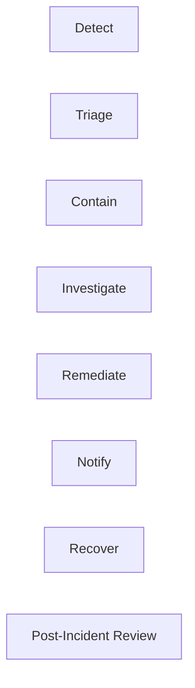

# Security & Privacy Specification — SFPCL Member Credit Administration & Loan Disbursement Platform

## 1. Document Control

| Field | Value |
|---|---|
| Document name | `security-privacy.md` |
| Product / system | SFPCL Member Credit Administration & Loan Disbursement Platform |
| Client | Sahyadri Farmers Producer Company Limited |
| Backend | Python + Django + Django REST Framework |
| Frontend | React |
| Database | PostgreSQL |
| Authentication | JWT |
| Supporting services | Redis, Celery, object storage / DMS, email gateway, SMS gateway, SAP adapter, bank adapter and future integration adapters |
| Source basis | Current analysis set: SOP review, client brief, user flows, functional specification, information architecture, screen specification, content specification, component specification, design system, domain model, data model, technical architecture, API contracts, auth-permissions and integrations specification |
| Intended audience | Engineering, DevOps, QA, compliance, product, implementation, audit, information security and operations teams |
| Status | Draft for implementation planning |

---

## 2. Purpose

This document defines the security, privacy, data protection, access-control, audit and operational security requirements for the SFPCL Member Credit Administration & Loan Disbursement Platform.

The system handles highly sensitive borrower, member, financial, KYC, banking, legal and security instrument data. Security and privacy must therefore be designed into every stage of the loan lifecycle:

1. Member identification.
2. Loan application intake.
3. Borrower and nominee KYC.
4. Active member eligibility verification.
5. Shareholding and landholding-based loan limit calculation.
6. Credit appraisal.
7. Sanction approval.
8. Documentation, stamping and notarisation.
9. Security instruments such as PoA, SH-4, CDSL pledge and blank-dated cheque.
10. SAP customer code workflow.
11. RBL Bank / bank portal disbursement.
12. Repayment through direct transfer or subsidiary deduction.
13. Interest invoicing and capitalisation.
14. DPD monitoring.
15. Default handling, grace periods, extension and recovery.
16. Closure, NOC, security return and archival.
17. Statutory compliance evidence and audit.

This specification should be used with:

- `technical-architecture.md`
- `api-contracts.md`
- `auth-permissions.md`
- `integrations.md`
- `data-model.md`
- `domain-model.md`

---

## 3. Security Objectives

## 3.1 Primary Objectives

| Objective | Description |
|---|---|
| Protect borrower privacy | Safeguard PAN, Aadhaar, KYC documents, bank accounts, land records, bank statements, shareholding records and loan data. |
| Prevent unauthorised lending actions | Enforce maker-checker, approval authority, workflow gates and conflict-of-interest controls. |
| Protect financial transactions | Prevent duplicate, unauthorised or manipulated disbursements, repayments, allocations and interest capitalisations. |
| Protect legal/security documents | Secure PoA, SH-4, blank-dated cheques, CDSL pledge evidence, loan agreements and term sheets. |
| Maintain audit evidence | Record all critical actions, approvals, downloads, sensitive field reveals and workflow transitions. |
| Support statutory compliance | Enable KYC/AML, Companies Act, Section 186, NBFC test, stamp duty, record retention and data protection controls. |
| Ensure operational resilience | Support backups, recovery, monitoring, incident response and secure integrations. |
| Minimise data exposure | Collect, show, export and transmit only the minimum data needed for each user and workflow. |

## 3.2 Security Non-Goals

| Non-Goal | Explanation |
|---|---|
| Replacing legal review | The platform enforces configured rules; legal interpretation remains with SFPCL / advisors. |
| Automatically validating all external documents | The system can assist, but human verification remains required unless external integrations are confirmed. |
| Replacing SAP or bank systems | The platform tracks workflow, references and evidence; external systems remain authoritative for accounting or payment execution where applicable. |
| Eliminating physical custody controls | Physical PoA, SH-4, cheques and stamped documents still require operational custody management. |

---

## 4. Security Principles

| Principle | Implementation Implication |
|---|---|
| Least privilege | Users receive only permissions required for their role, team and assigned workflow. |
| Need-to-know access | Sensitive borrower and legal documents are visible only to users who need them. |
| Backend enforcement | Django services must enforce all access, workflow and approval rules independent of React UI visibility. |
| Data minimisation | Do not collect or transmit data unless required by SOP, law or integration. |
| Mask by default | PAN, Aadhaar, bank account, cheque number and BO account are masked unless explicitly revealed with permission and audit. |
| Defence in depth | Use authentication, RBAC, object permissions, workflow guards, encryption, logging and monitoring together. |
| Strong auditability | Approval, disbursement, recovery and sensitive data access must be traceable. |
| Segregation of duties | Maker, checker, approver, disbursement initiator and bank authoriser must be separable. |
| Secure by default | New modules, endpoints and documents should deny access unless explicitly allowed. |
| Fail safe | Failed external integration, missing evidence or incomplete documents must block workflow progression. |
| Privacy by design | Privacy controls should be built into schema, APIs, UI, exports, reports and integrations. |
| Historical integrity | Historical loan calculations, approvals and documents must not be overwritten by later configuration changes. |

---

# 5. Regulatory and Compliance Context

## 5.1 Legal / Compliance Drivers Captured in Current Analysis

| Area | Relevance to Security and Privacy |
|---|---|
| Companies Act Producer Company provisions | Lending is member-only; unauthorised non-member lending must be prevented. |
| Section 378ZK / 378ZJ producer-company lending provisions | Loan and advance rules must be auditable and linked to members. |
| Section 186 | Exposure calculations and special resolution requirements must be traceable. |
| NBFC principal business test | Quarterly financial asset and income ratio data must be controlled and reviewed. |
| PMLA / KYC / AML | Borrower, nominee and institutional KYC records require secure collection, verification, retention and re-KYC. |
| RBI KYC direction referenced in analysis | KYC data, CKYC consent and re-KYC must be handled securely. |
| Maharashtra Stamp Act | Stamped documents, stamp values and execution records must be protected and verifiable. |
| Money-lending law review | Annual legal opinion and board note require document security and retention. |
| Record retention | Loan files must be retained at least eight years after closure; KYC records require retention after relationship end. |
| Recovery conduct and grievance | Recovery actions must be controlled, approved, logged and non-coercive. |
| Data protection and access controls | Role-based SAP/system access, locked cabinets and periodic access review are required. |

## 5.2 Privacy Scope

The platform processes personal, financial and legal data of:

- Individual farmer members.
- FPC / Producer Institution members.
- Nominees.
- Witnesses.
- Authorised signatories.
- Directors and Sanction Committee members.
- Internal users.
- Subsidiary company contacts.
- Potential future borrower portal users.

---

# 6. Data Classification Model

## 6.1 Classification Levels

| Level | Name | Description | Examples |
|---|---|---|---|
| L0 | Public | Non-sensitive public information | Public policy summaries, generic help text |
| L1 | Internal | Business information for internal use | Workflow statuses, generic dashboard counts |
| L2 | Confidential | Business-sensitive data | Loan amount, appraisal notes, approval comments, portfolio reports |
| L3 | Restricted | Highly sensitive personal, financial or legal data | PAN, Aadhaar, bank accounts, KYC documents, bank statements, SH-4, blank cheque details |
| L4 | Critical Restricted | Data that could cause severe financial/legal harm if misused | Full Aadhaar, full bank account, cheque image/number, recovery action documents, role/permission config, JWT secrets, encryption keys |

## 6.2 Classification by Data Category

| Data Category | Classification | Default Handling |
|---|---|---|
| Member name and folio number | Confidential | Role-based visibility |
| Member mobile / email | Confidential | Mask where not required |
| PAN | Restricted | Encrypted at rest, masked in UI |
| Aadhaar | Critical Restricted | Encrypted at rest, masked in UI, audited reveal |
| Nominee PAN / Aadhaar | Restricted / Critical | Same as borrower KYC |
| Witness PAN / Aadhaar | Restricted / Critical | Same as borrower KYC |
| Land 7/12 extract | Restricted | Restricted document access |
| Crop plan | Confidential | Workflow-based access |
| Shareholding record | Confidential / Restricted | Role-based access |
| Demat BO account | Restricted | Encrypted and masked |
| Bank account number | Critical Restricted | Encrypted, last 4 display |
| Bank statement | Restricted | Restricted document access |
| Cancelled cheque | Restricted | Restricted document access |
| Blank-dated cheque | Critical Restricted | Highly restricted; custody tracked |
| PoA | Restricted | Legal/security document controls |
| SH-4 | Critical Restricted | CS custody and recovery approval gate |
| CDSL pledge evidence | Restricted | Role-based and audit logged |
| Loan Agreement | Confidential / Restricted | Restricted document access |
| Term Sheet | Confidential | Role-based access |
| Appraisal Note | Confidential | Credit and approval roles |
| Approval comments | Confidential | Approval roles and auditors |
| Sanction decision | Confidential | Role-based access |
| Disbursement reference | Confidential | Finance roles and auditors |
| Repayment reference | Confidential | Finance / credit roles |
| Interest invoice | Confidential | Borrower, credit, accounts, audit |
| Default assessment | Restricted | Credit, CFO, CS, auditor |
| Recovery decision | Critical Restricted | Approver, CS, auditor |
| Compliance evidence | Confidential / Restricted | Compliance owners and auditors |
| Audit logs | Restricted | Auditor / authorised admin |
| Authentication secrets | Critical Restricted | Secret manager only |

---

# 7. Personal Data Inventory

## 7.1 Borrower / Member Personal Data

| Data | Purpose | Source | Security Control |
|---|---|---|---|
| Legal name | Member identification and documents | Application / member master | Role-based access |
| Folio number | Shareholder validation | Share records | Role-based access |
| PAN | KYC, SAP profile, tax/accounting | KYC documents | Encryption, hashing, masking |
| Aadhaar | KYC, SAP profile if required | KYC documents | Encryption, hashing, masking, strict reveal |
| Address | KYC, SAP profile, documents | Application / KYC | Role-based access |
| Mobile number | Communication and reminders | Application | Mask where not needed |
| Email | Communication and SAP profile | Application | Role-based access |
| Bank account | Disbursement and repayment | Cancelled cheque / bank verification | Encryption, last 4 display |
| IFSC / branch | Disbursement | Cancelled cheque | Role-based access |
| Land details | Eligibility and limit | 7/12 extract | Restricted document access |
| Crop plan | Purpose and land-based limit | Application | Role-based access |
| Shareholding | Loan limit and security | Share records | Role-based access |

## 7.2 Nominee Personal Data

| Data | Purpose | Security Control |
|---|---|---|
| Name | Application and legal documents | Role-based access |
| Age / DOB | Minor validation | Role-based access |
| Gender | Application form | Role-based access |
| PAN | KYC | Encryption, masking |
| Aadhaar | KYC | Encryption, masking |
| Signature | Legal documents | Restricted document access |

## 7.3 Witness Personal Data

| Data | Purpose | Security Control |
|---|---|---|
| Name | Loan Agreement / SH-4 witness | Role-based access |
| PAN | Witness KYC | Encryption, masking |
| Aadhaar | Witness KYC | Encryption, masking |
| Shareholder verification | Witness eligibility | Audit log |

## 7.4 Internal User Data

| Data | Purpose | Security Control |
|---|---|---|
| Full name | Workflow ownership | Internal access |
| Email | Login and notifications | Internal access |
| Role / team | RBAC | Admin controlled |
| Approval authority | Sanction / disbursement / legal workflows | Audit controlled |
| Login history | Security monitoring | Restricted |
| IP / device metadata | Session security | Restricted |

---

# 8. Data Processing Purpose Matrix

| Processing Activity | Data Used | Purpose | Owner |
|---|---|---|---|
| Member validation | Member ID, folio, shareholding, active status | Ensure member-only lending | Credit Assessment |
| KYC verification | PAN, Aadhaar, OVD, CKYC consent, photo | KYC / AML compliance | Credit / Compliance |
| Nominee validation | Nominee KYC and age | Ensure nominee not minor and legal docs complete | Credit / Compliance |
| Loan limit calculation | Share count, share valuation, land area, scale of finance | Determine eligible amount | Credit |
| Appraisal | Borrower, crop plan, documents, borrowing history | Credit assessment | Deputy Manager / Credit Manager |
| Sanction approval | Appraisal, eligibility, limits, risk | Approve / reject loan | CFO / Directors |
| Documentation | KYC, borrower, nominee, witness, terms | Generate and execute legal docs | Compliance / CS |
| Security creation | SH-4, PoA, CDSL, cheque | Secure loan | CS / Compliance |
| SAP profile | Name, PAN, Aadhaar if required, address, email, application number | Create customer code | Credit / Finance |
| Bank disbursement | Bank account, IFSC, amount | Transfer loan amount | Senior Manager Finance / CFC |
| Repayment processing | Bank reference, subsidiary reference, amount | Apply repayments | Credit / Accounts |
| Interest processing | Outstanding principal, rates | Invoice and accrue interest | Accounts / Credit |
| Monitoring | DPD, outstanding amounts | Portfolio control | Credit / CFO |
| Default handling | Repayment failure, reasons, evidence | Grace/extension/recovery | Credit / Sanction Committee |
| Recovery | SH-4, cheque, CDSL, approval evidence | Recover unrepaid loan | CS / Sanction Committee |
| Closure | Loan balance, NOC, security return | Settle and archive | CS / Compliance |
| Compliance | Tracker data, evidence, registers | Statutory and internal controls | CFO / CS |

---

# 9. Threat Model

## 9.1 Key Assets

| Asset | Threat Impact |
|---|---|
| Member master | Fraudulent lending, privacy breach |
| KYC data | Identity theft, regulatory breach |
| Bank details | Financial fraud |
| Blank-dated cheque records | Misuse or coercive recovery risk |
| SH-4 and PoA | Unauthorised share transfer risk |
| Approval records | Governance failure |
| Disbursement workflow | Unauthorised payment |
| Repayment allocation | Financial misstatement |
| Audit logs | Loss of evidence |
| Compliance trackers | Statutory non-compliance |
| JWT tokens | Account takeover |
| Encryption keys | Mass data exposure |
| Object storage documents | Sensitive file leakage |

## 9.2 Threat Actors

| Actor | Possible Threat |
|---|---|
| External attacker | Account takeover, API attack, document exfiltration |
| Malicious insider | Unauthorised data access, approval manipulation, document misuse |
| Negligent internal user | Accidental sharing, wrong file upload, wrong bank reference |
| Compromised user account | Fraudulent approval or disbursement |
| Integration provider compromise | Data leakage or false status update |
| Borrower misuse | False documents, duplicate applications |
| Conflicted approver | Self-approval or related-party sanction |
| System admin misuse | Excessive access or permission changes |
| Malware / ransomware | Data encryption, file loss, service outage |

## 9.3 STRIDE Threat Mapping

| STRIDE Category | Example | Mitigation |
|---|---|---|
| Spoofing | Stolen JWT used to approve sanction | Short token lifetime, refresh revocation, MFA for approvers |
| Tampering | Loan amount changed after approval | Approval snapshots, audit logs, workflow locks |
| Repudiation | Approver denies approval | Immutable approval actions with timestamp and user identity |
| Information disclosure | Aadhaar visible to unauthorised user | Encryption, masking, reveal permissions, audit |
| Denial of service | API or SMS queue overloaded | Rate limiting, Celery monitoring, autoscaling / queue controls |
| Elevation of privilege | User changes own role | Admin-only role management, maker-checker for critical config |

## 9.4 High-Risk Scenarios

| Scenario | Risk | Required Control |
|---|---|---|
| Loan to non-member | Legal / governance violation | Member FK, active status check, workflow gate |
| Loan limit tampering | Over-lending | Calculation snapshots, config approval, audit |
| CFO / Director conflict | Related-party governance risk | Conflict-of-interest rules, exclusion, general meeting approval |
| Disbursement without documents | Financial and legal risk | Documentation readiness gate |
| Disbursement without SAP code | Accounting mismatch | SAP code gate |
| Disbursement without CFC authorisation | Fraud risk | CFC approval gate |
| Duplicate repayment | Incorrect outstanding balance | Idempotency and bank reference uniqueness |
| Unauthorised SH-4 invocation | Legal risk | Recovery approval gate and CS custody |
| Unauthorised blank cheque presentation | Legal/reputation risk | Recovery approval, custody audit |
| Sensitive export leakage | Privacy breach | Export permissions and masking |
| KYC file download abuse | Privacy breach | Restricted download audit and alerting |
| Audit log deletion | Evidence destruction | Append-only logs and restricted DB access |

---

# 10. Authentication Security

## 10.1 JWT Requirements

| Requirement | Description |
|---|---|
| Short-lived access token | Recommended 10–30 minutes |
| Refresh token rotation | Refresh token should rotate on use |
| Refresh token blacklist | Logout and admin revocation must invalidate refresh token |
| Session tracking | Store refresh token hash and session metadata |
| Token claims minimised | Do not include sensitive data |
| Token revocation on role change | Role/permission changes should invalidate old sessions |
| Token revocation on password reset | Reset must revoke existing sessions |
| Secure storage | Prefer httpOnly secure cookies or hardened frontend storage pattern |
| CSRF protection | Required if cookies are used |
| HTTPS only | Tokens must never be transmitted over HTTP |

## 10.2 Login Security

| Control | Requirement |
|---|---|
| Password hashing | Django secure password hashers |
| Rate limiting | Login attempts per user/IP |
| Failed login audit | Record failed attempts |
| Account lockout | Lock or throttle after repeated failures |
| Generic error message | Do not reveal whether email exists |
| Session metadata | Store IP, user-agent, login time |
| Suspended user block | Suspended/inactive users cannot log in |
| Admin reset audit | Password resets must be logged |

## 10.3 Password Policy

| Rule | Recommendation |
|---|---|
| Minimum length | 10–12 characters minimum |
| Complexity | Letters, numbers and symbols preferred |
| Common password block | Reject common passwords |
| Password reuse | Prevent reuse of recent passwords |
| Reset token | Single-use and short-lived |
| Storage | Hash only; never store plaintext |
| Initial password | Temporary password must force change |

## 10.4 MFA Recommendations

MFA is strongly recommended for:

- CFO.
- Directors.
- CFC.
- Company Secretary.
- System Administrator.
- IT Head.
- Users with sensitive data reveal permission.
- Users who can initiate or authorise disbursement.
- Users who can invoke security instruments.
- Users who can change approval matrix or loan policy.

MFA may be implemented in phase 2 if not included in MVP.

---

# 11. Authorisation and Access Control

## 11.1 Access-Control Layers

| Layer | Example |
|---|---|
| Role permission | `finance.disbursement.initiate` |
| Team scope | Treasury Team can see disbursement queue |
| Object access | Director can see assigned approval case |
| Workflow state | Disbursement only if documentation approved |
| Approval authority | CFO/Director only for sanction |
| Sensitive data rule | Aadhaar reveal requires special permission |
| Conflict rule | Related director cannot approve |
| Maker-checker rule | Appraisal preparer cannot approve own review where configured |

## 11.2 Standard Roles

| Role | Security Relevance |
|---|---|
| Field Officer | Limited intake and upload; no approval or sensitive reveal by default |
| Deputy Manager – Finance | Appraisal preparation; no sanction approval |
| Credit Manager | Credit workflow and monitoring; no disbursement authorisation |
| Compliance Team Member | Document preparation; no final legal approval unless delegated |
| Company Secretary | Legal docs, security custody, NOC and compliance controls |
| Senior Manager – Finance | SAP completion and disbursement initiation |
| Chief Financial Controller | Bank transfer authorisation |
| CFO | Sanction and compliance review |
| Director | Assigned sanction approval |
| Accounts Head | Accruals, accounting and repayment posting |
| IT Head | Access review and security operations |
| Internal Auditor | Read-only audit and evidence |
| System Administrator | Technical administration; business data access restricted by policy |

## 11.3 Permission Enforcement Requirements

| Requirement | Description |
|---|---|
| Default deny | New endpoints require explicit permissions |
| Backend-first | Django services enforce permissions |
| UI assist only | React action visibility is not security |
| Object filtering | List endpoints filter based on user scope |
| Sensitive masking | Responses mask sensitive values by default |
| Export controls | Export permission is separate from read permission |
| Critical actions | Require reason, audit and sometimes re-authentication |
| Permission changes | Audit logged and session invalidation considered |

---

# 12. Segregation of Duties

## 12.1 Maker-Checker Controls

| Process | Maker | Checker / Approver |
|---|---|---|
| Application creation | Field Officer / Credit Team | Deputy Manager / Credit Manager |
| Appraisal note | Deputy Manager – Finance | Credit Manager |
| Sanction case | Credit Manager | CFO + Director(s) |
| Documentation package | Compliance Team | Company Secretary |
| Checklist approval | CS / Credit Manager | Sanction Committee final checklist sign-off |
| SAP request | Credit Manager | Senior Manager – Finance |
| Disbursement initiation | Senior Manager – Finance | CFC |
| Recovery proposal | Credit Team | Sanction Committee / Board as configured |
| Security invocation | CS / authorised user | Recovery approval required |
| Closure | Credit / Compliance | CS and archive control |

## 12.2 Conflict-of-Interest Controls

| Situation | Required Control |
|---|---|
| Director is borrower | Exclude director from approval; general meeting approval |
| Relative of Director is borrower | Exclude conflicted approver; general meeting approval |
| Sanction Committee member is borrower | Remaining members approve; member approval required |
| User prepared appraisal | Should not be final sanction approver |
| User changes role / permission | Cannot approve own privilege escalation |
| Recovery action involves interested party | Escalate and record conflict |

## 12.3 Enforcement Rules

- Conflict flags must be stored on approval case.
- Excluded approvers must be visible in approval record.
- Attempted conflicted approval must be denied and audit logged.
- General meeting approval evidence must be attached before sanction finalisation where required.
- Approval matrix must support exclusion and replacement logic.

---

# 13. Privacy by Design

## 13.1 Data Minimisation

| Area | Minimisation Rule |
|---|---|
| SAP | Send Aadhaar only if SAP requires it; otherwise avoid. |
| SMS | Never include PAN, Aadhaar, full bank account or cheque details. |
| Reports | Mask sensitive fields by default. |
| Audit logs | Store metadata and masked values, not raw sensitive values. |
| Integration logs | Store sanitised payloads only. |
| Search | Use hashes for PAN/Aadhaar exact match, not raw values. |
| Frontend state | Do not store full sensitive values after reveal timeout. |
| File names | Do not include PAN, Aadhaar or bank account in file names. |

## 13.2 Purpose Limitation

Sensitive data should be used only for defined purposes:

- KYC verification.
- Loan eligibility.
- Documentation.
- SAP customer profile creation.
- Disbursement.
- Repayment reconciliation.
- Legal security.
- Compliance evidence.
- Audit.

Use for unrelated analytics, marketing or non-SOP purposes should be prohibited unless separately approved.

## 13.3 Consent and Notices

The system should capture or track consent for:

| Consent | Required For |
|---|---|
| KYC / CKYC consent | KYC verification and CKYC lookup |
| Bureau consent | Future credit bureau check |
| Communication consent | SMS/email reminders where applicable |
| Tri-party deduction authorisation | Subsidiary produce-payment deduction |
| Document execution acknowledgment | Loan Agreement, Term Sheet, PoA, SH-4 |
| Future borrower portal terms | Portal login and self-service |

## 13.4 Data Subject Access Considerations

If SFPCL implements borrower portal or data request handling, system should support:

- Viewing own application status.
- Downloading own NOC.
- Viewing issued communications.
- Raising grievance.
- Requesting correction of contact / bank details through controlled workflow.
- Recording privacy/data access requests if legally required.

---

# 14. Sensitive Data Storage Controls

## 14.1 Encryption at Rest

The following fields should be encrypted at application level or database level:

| Entity | Field |
|---|---|
| Member | PAN, Aadhaar |
| Nominee | PAN, Aadhaar |
| Witness | PAN, Aadhaar |
| Authorised signatory | PAN, Aadhaar |
| Bank account | Account number |
| Cancelled cheque | Account number |
| Blank-dated cheque | Cheque number |
| Demat account | BO account number |
| CDSL pledge | Pledgor / pledgee BO account |
| SAP request | PAN, Aadhaar |
| CKYC | CKYC identifier |
| Integration credentials | Never store raw; use secret manager reference |

## 14.2 Hash Columns

Hash columns should be used for exact matching without exposing raw values:

| Sensitive Value | Hash Use |
|---|---|
| PAN | Duplicate detection and search |
| Aadhaar | Duplicate detection and search |
| Bank account | Duplicate detection |
| Cheque number | Duplicate detection |
| BO account | Duplicate detection |

Hashing requirements:

- Use keyed HMAC or secure hash with application pepper where appropriate.
- Store raw values encrypted separately if needed.
- Do not use unsalted plain hashes for sensitive national identifiers.

## 14.3 Masking Rules

| Field | Default Display |
|---|---|
| PAN | `ABCDE****F` or last 4 only |
| Aadhaar | `********1234` |
| Bank account | `********1234` |
| Cheque number | Hidden or last 2–4 only |
| BO account | Last 4 only |
| Mobile | Mask middle digits when not needed |
| Email | Partially masked for broad views |
| KYC document | Metadata only unless authorised |

## 14.4 Sensitive Reveal Workflow

Full values may be revealed only when:

1. User has explicit permission.
2. User has object access.
3. User provides reason.
4. Re-authentication is performed if policy requires.
5. Reveal action is audit logged.
6. Full value is returned for short display only.
7. Frontend does not persist value.
8. Repeated reveals are rate-limited and monitored.

---

# 15. Key Management

## 15.1 Key Types

| Key | Purpose |
|---|---|
| Django secret key | Framework signing |
| JWT signing key | Token signing |
| Field encryption key | Encrypt PAN/Aadhaar/bank details |
| Object storage encryption key | File encryption |
| Integration API keys | External services |
| Webhook signing secrets | Verify callbacks |
| Database credentials | DB access |
| Backup encryption keys | Backup protection |

## 15.2 Key Management Requirements

| Requirement | Description |
|---|---|
| No keys in code | Keys must not be committed to repository |
| Secret manager | Use environment secret manager or vault |
| Rotation | Support planned key rotation |
| Access control | Only DevOps/security roles can access production secrets |
| Audit | Secret access should be logged where tooling supports |
| Separation by environment | Dev, QA, UAT and production secrets separate |
| Backup | Key backup and recovery process required |
| Emergency revocation | Ability to revoke compromised integration keys |

## 15.3 Field Encryption Key Rotation

Recommended approach:

1. Store key version with encrypted data.
2. New writes use active key version.
3. Old records decrypted using stored key version.
4. Background migration re-encrypts old data.
5. Rotation action audited.
6. Rollback plan defined.

---

# 16. API Security

## 16.1 API Protection Controls

| Control | Requirement |
|---|---|
| HTTPS | Mandatory |
| JWT authentication | Required for protected endpoints |
| DRF permission classes | Required for all protected endpoints |
| Object-level permission | Required for application, loan and document endpoints |
| Input validation | DRF serializers and service validation |
| Output filtering | Mask sensitive fields |
| Rate limiting | Auth, reveal, export and download endpoints |
| CORS | Restrict to approved frontend domains |
| CSRF | Required if cookie-based token storage |
| Idempotency | Required for disbursement, repayment, allocation, capitalisation and recovery |
| Request size limits | Required for file and JSON payloads |
| Standard errors | Avoid leaking stack traces |
| Security headers | HSTS, CSP, X-Content-Type-Options, Referrer-Policy |

## 16.2 High-Risk Endpoints

| Endpoint Category | Required Extra Control |
|---|---|
| Login / refresh | Rate limiting and session tracking |
| Sensitive reveal | Permission, reason, audit, optional re-auth |
| File download | Permission, sensitivity check, signed URL, audit |
| Approval action | Required approver, conflict check, immutable action |
| Loan limit override | Critical permission and exception approval |
| SAP completion | Finance permission and audit |
| Disbursement initiation | Readiness gate and idempotency |
| Disbursement authorisation | CFC authority and optional re-auth/MFA |
| Repayment capture | Duplicate bank reference check |
| Interest capitalisation | Idempotency and after-30-April rule |
| Recovery action | Approved recovery decision required |
| Role/permission change | Admin permission, audit, session invalidation |
| Config change | Approval/reference, audit and effective dating |

## 16.3 API Error Security

Error messages should:

- Explain user-correctable issues.
- Avoid exposing stack traces.
- Avoid exposing SQL, object storage keys, file paths or secrets.
- Avoid confirming existence of sensitive identifiers.
- Use consistent error codes.
- Log detailed internal error separately in secure logs.

---

# 17. Frontend Security

## 17.1 React Security Requirements

| Area | Requirement |
|---|---|
| Token handling | Use secure storage pattern; avoid localStorage if possible |
| XSS prevention | Do not render untrusted HTML unless sanitised |
| Route guards | Enforce route visibility based on permissions |
| Action visibility | Use backend `available_actions` |
| Sensitive values | Clear revealed values after timeout |
| File previews | Use secure viewer; do not expose raw URLs permanently |
| Error handling | Do not show sensitive backend details |
| Form validation | Validate client-side but rely on backend enforcement |
| Dependency security | Scan npm packages |
| Build security | Production build disables source maps if policy requires |
| CSP compatibility | Avoid unsafe inline scripts where possible |

## 17.2 Frontend Sensitive Data Rules

| Rule | Requirement |
|---|---|
| FE-PII-001 | Do not store full PAN/Aadhaar/bank account in persistent browser storage. |
| FE-PII-002 | Do not include sensitive values in route URLs or query params. |
| FE-PII-003 | Do not log sensitive values to browser console. |
| FE-PII-004 | Do not include sensitive values in analytics events. |
| FE-PII-005 | Clear sensitive reveal state on route change, logout and timeout. |
| FE-PII-006 | Mask sensitive values in tables and cards by default. |

## 17.3 File Preview Security

- Use time-limited signed URLs or backend proxy.
- Disable unrestricted sharing.
- Watermark restricted documents where feasible.
- Audit download, not just preview.
- Restrict printing for highly sensitive documents if viewer supports it.
- Avoid exposing object storage keys to users.

---

# 18. Backend Django Security

## 18.1 Django Configuration

| Setting / Area | Requirement |
|---|---|
| `DEBUG` | False in production |
| `SECRET_KEY` | From secret manager |
| `ALLOWED_HOSTS` | Strict production host list |
| `SECURE_SSL_REDIRECT` | Enabled in production |
| `SESSION_COOKIE_SECURE` | Enabled if sessions/cookies used |
| `CSRF_COOKIE_SECURE` | Enabled |
| `SECURE_HSTS_SECONDS` | Enabled after validation |
| `SECURE_CONTENT_TYPE_NOSNIFF` | Enabled |
| `X_FRAME_OPTIONS` | DENY or SAMEORIGIN |
| CORS | Whitelist frontend origins |
| Admin | Restricted by IP/VPN/MFA where feasible |
| Logging | Structured logs without sensitive data |

## 18.2 Django REST Framework

| Area | Requirement |
|---|---|
| Authentication classes | JWT authentication |
| Permission classes | Explicit permission classes |
| Serializer validation | Strict field validation |
| Pagination | Required for list endpoints |
| Throttling | Login, sensitive reveal, downloads, exports |
| Filtering | Enforce user scope |
| File upload parsers | Size/type validation |
| OpenAPI docs | Restricted in production if needed |

## 18.3 Service Layer Security

All business actions should go through service methods that enforce:

- Permission.
- Object access.
- Workflow state.
- Maker-checker.
- Approval authority.
- Conflict-of-interest.
- Idempotency.
- Audit logging.
- Transaction boundary.

---

# 19. PostgreSQL Security

## 19.1 Database Access Controls

| Control | Requirement |
|---|---|
| Separate DB users | App, migration, read-only reporting users |
| Least privilege | App user has only required privileges |
| No direct production access | Restricted to authorised DBAs/DevOps |
| SSL | Use encrypted DB connections where remote |
| Backups encrypted | Required |
| Audit access | Track privileged DB access |
| Secrets | DB credentials in secret manager |
| Row-level security | Optional; app-layer object permissions still required |
| Migrations | Controlled through CI/CD |

## 19.2 Database Data Protection

| Requirement | Description |
|---|---|
| Encrypted fields | PAN, Aadhaar, bank, cheque, BO account |
| Hash fields | Search/dedup without raw values |
| Constraints | Prevent invalid status and duplicate references |
| Immutable records | Approval actions and audit logs append-only |
| Soft deletes | For operational entities where deletion allowed |
| Retention markers | Archive and deletion eligibility dates |
| Migration batch IDs | Historical data traceability |

## 19.3 Database Backup Security

- Encrypted backups.
- Access-controlled backup storage.
- Restore tests.
- Point-in-time recovery if feasible.
- Separate backup credentials.
- Backup retention aligned with legal/compliance policy.
- Backups included in incident response planning.

---

# 20. Object Storage and Document Security

## 20.1 Document Storage Requirements

| Requirement | Description |
|---|---|
| Store metadata in DB | File metadata, sensitivity, owner, retention |
| Store binary externally | S3-compatible storage or DMS |
| Encrypt at rest | Required |
| HTTPS download | Required |
| Signed URLs | Short expiry |
| Virus scanning | Recommended for uploaded files |
| Checksum | Store checksum for integrity |
| Restricted access | Backend permission check before URL |
| Audit downloads | Required for restricted documents |
| Retention | At least eight years for loan files |
| Secure deletion | Only through approved retention process |

## 20.2 Restricted Document Types

| Document | Extra Controls |
|---|---|
| PAN / Aadhaar | Restricted download |
| Bank statement | Restricted download |
| Cancelled cheque | Restricted download |
| Blank-dated cheque | Critical restricted; CS custody |
| SH-4 | Critical restricted; recovery gate |
| PoA | Restricted; legal/security access |
| Loan Agreement | Restricted where executed |
| CDSL pledge evidence | Restricted |
| Recovery evidence | Critical restricted |
| Board minutes / compliance evidence | Restricted |
| SAP profile Excel | Restricted due to PAN/Aadhaar |

## 20.3 File Upload Validation

| Validation | Requirement |
|---|---|
| File size | Configured max size |
| MIME type | Allowlist |
| Extension | Allowlist |
| Malware scan | Recommended |
| Duplicate checksum | Detect duplicates |
| File name sanitisation | Required |
| Metadata required | Category and sensitivity |
| Relationship required | Link to application/loan/compliance where applicable |

---

# 21. Integration Security

## 21.1 Integration Security Principles

| Principle | Requirement |
|---|---|
| Adapter isolation | Domain code calls internal adapters |
| Secret management | No credentials in code or DB plaintext |
| Payload sanitisation | Logs mask sensitive values |
| Idempotency | Prevent duplicate external actions |
| Webhook verification | Validate signatures |
| Retry safety | Do not blindly retry money movement |
| Manual evidence | Manual external actions require reference and upload |
| Service accounts | Least privilege and no UI login |
| Audit | All integration calls and manual confirmations logged |

## 21.2 SAP Security

| Risk | Control |
|---|---|
| Excess PAN/Aadhaar sharing | Send only mandatory fields |
| Wrong SAP code | Dual verification and audit |
| Duplicate SAP code | Unique constraint |
| Unauthorised SAP completion | Senior Manager Finance permission |
| SAP Excel leakage | Restricted document classification |
| SAP posting mismatch | Reconciliation and exception queue |

## 21.3 Bank Security

| Risk | Control |
|---|---|
| Unauthorised disbursement | Senior Manager initiation + CFC authorisation |
| Duplicate payment | Idempotency key and disbursement status |
| Wrong beneficiary | Verified cancelled cheque / bank verification |
| Fake UTR | Bank evidence and reconciliation |
| Amount manipulation | Sanction amount gate |
| Transfer without documents | Disbursement readiness gate |
| API retry causing duplicate payment | Retry status checks, not payment blindly |

## 21.4 Email/SMS Security

| Risk | Control |
|---|---|
| Sensitive data in message | Template rules block PAN/Aadhaar/bank details |
| Wrong recipient | Use verified contact records |
| Duplicate reminders | Communication idempotency and rate limits |
| Template injection | Safe templating and variable validation |
| Delivery failure | Retry and exception queue |
| Account takeover through reset email | Short-lived reset tokens |

## 21.5 CDSL / Depository Security

| Risk | Control |
|---|---|
| BO account exposure | Encrypt and mask |
| Pledge not created but treated complete | Security status gate |
| Unauthorised invocation | Recovery approval required |
| Unpledge missed after closure | Closure checklist and security return |
| Evidence tampering | Document checksum and audit |

## 21.6 CKYC / Bureau Security

| Risk | Control |
|---|---|
| Consent missing | Block external call |
| Excessive KYC calls | Rate limit and reason |
| Raw identifiers in logs | Sanitised integration logs |
| Report misuse | Restricted document access |
| Provider failure | Manual fallback and retry rules |

---

# 22. Financial Transaction Security

## 22.1 Disbursement Controls

| Control | Requirement |
|---|---|
| Sanction approval | Must exist |
| Loan account | Must be created from sanction |
| Documentation checklist | Must be complete |
| Security package | Must be complete or exception approved |
| SAP customer code | Required |
| Bank account verification | Required |
| Disbursement amount | Must not exceed sanction |
| Initiator | Senior Manager – Finance |
| Authoriser | CFC |
| Bank reference | Required to mark successful |
| Evidence | Upload bank evidence / reference |
| Idempotency | Required |
| Audit | Initiation, authorisation and success logged |

## 22.2 Repayment Controls

| Control | Requirement |
|---|---|
| Positive amount | Required |
| Active loan | Required |
| Source identified | Direct farmer or subsidiary deduction |
| Bank reference | Required where available |
| Duplicate detection | Bank reference / subsidiary reference |
| Principal-first allocation | Enforced |
| SAP posting | Captured |
| Reconciliation | Bank/SAP matching |
| Audit | Receipt and allocation logged |

## 22.3 Interest Controls

| Control | Requirement |
|---|---|
| Rate source | Configured and versioned |
| Monthly accrual | Unique by loan and month |
| Year-end invoice | Generated and issued |
| Unpaid interest | Tracked |
| Capitalisation | After 30 April rule |
| Duplicate prevention | One capitalisation per loan/year |
| Borrower notice | Email/hard-copy record |
| Audit | Invoice, accrual and capitalisation logged |

---

# 23. Recovery and Legal Security

## 23.1 Security Instruments

| Instrument | Security Risk | Control |
|---|---|---|
| PoA | Misuse of authority | CS ownership, stamped/notarised record, invocation gate |
| SH-4 | Unauthorised share transfer | Physical custody, approval before invocation |
| CDSL pledge | Unauthorised securities movement | Pledge status tracking, approval before invocation |
| Blank-dated cheque | Misuse / coercive recovery | Restricted custody, approval before presentation |
| Tri-party agreement | Incorrect deduction | Document verification and subsidiary reference |
| Loan Agreement | Contract integrity | Signed, stamped, notarised where required |
| Term Sheet | Disclosure integrity | Versioned and signed |

## 23.2 Recovery Approval Controls

Before invoking SH-4, CDSL pledge or blank-dated cheque:

1. Default case must exist.
2. Grace period must have expired.
3. Default assessment must be recorded.
4. One-year extension must be handled where non-intentional.
5. Non-Payment Note must be prepared after extension failure.
6. Sanction Committee / Board approval must be recorded as configured.
7. Recovery decision must specify permitted action.
8. Company Secretary or authorised user must execute.
9. Evidence must be uploaded.
10. Audit log must be written.

## 23.3 Recovery Conduct Privacy

Recovery reminders and calls must:

- Avoid harassment.
- Record call logs.
- Avoid disclosing borrower debt to unauthorised third parties.
- Use approved scripts/templates.
- Preserve grievance route.
- Escalate disputes to Company Secretary / grievance owner.

---

# 24. Audit and Evidence Security

## 24.1 Immutable Audit Logs

Audit logs must be append-only for:

- Login / logout.
- Failed login attempts.
- Role/permission changes.
- Sensitive data reveal.
- Restricted document download.
- Application submission.
- Eligibility assessment.
- Loan limit calculation.
- Appraisal review.
- Approval action.
- Sanction decision.
- Exception record.
- Document verification.
- Checklist approval.
- Security custody movement.
- SAP request/completion.
- Disbursement initiation/authorisation/success.
- Repayment receipt/allocation.
- Interest invoice/accrual/capitalisation.
- Default opening.
- Extension.
- Recovery approval/action.
- Loan closure.
- NOC issue.
- Security return.
- Archive creation.
- Compliance evidence submission/review.
- Configuration changes.

## 24.2 Audit Log Fields

| Field | Requirement |
|---|---|
| Actor user ID | Required |
| Actor role and team snapshot | Required |
| Actor type | User/system/integration |
| Action code | Required |
| Entity type and ID | Required |
| Old value | Sanitised |
| New value | Sanitised |
| Reason/comment | Required for critical actions |
| Request ID | Required |
| IP address | Required |
| User agent | Required |
| Timestamp | Required |
| Outcome | Success/failure/denied |
| Sensitivity | Required for sensitive access |

## 24.3 Audit Log Protection

| Control | Requirement |
|---|---|
| No UI edit | Audit logs cannot be modified from UI |
| No normal deletion | Deletion disabled for normal users |
| DB protection | Restrict direct DB write access |
| Sensitive masking | Do not store raw PAN/Aadhaar/bank in audit logs |
| Retention | Long-term, aligned with statutory retention |
| Export control | Audit export requires explicit permission |
| Monitoring | Alerts for unusual sensitive access |

---

# 25. Logging and Monitoring Privacy

## 25.1 Application Logs Must Not Include

- Full PAN.
- Full Aadhaar.
- Full bank account number.
- Cheque number.
- BO account number.
- Raw JWT token.
- Passwords.
- OTPs.
- API keys.
- Secret values.
- Raw KYC document data.
- Full bank statement content unless securely stored as document.
- Raw integration payloads containing sensitive data.

## 25.2 Structured Logging Fields

Safe fields:

- Request ID.
- User ID.
- Role code.
- Entity type.
- Entity ID.
- Action code.
- Status.
- Duration.
- Error code.
- Provider code.
- Job ID.
- Sanitised external reference.
- Timestamp.

## 25.3 Security Monitoring Alerts

| Alert | Severity |
|---|---|
| Multiple failed logins | High |
| Login from unusual IP / device | Medium / High |
| Sensitive reveal spike | High |
| Restricted document download spike | High |
| Role/permission change | High |
| Admin login outside usual pattern | High |
| Disbursement initiated outside business hours | High |
| CFC authorisation anomaly | High |
| Duplicate bank reference attempts | Medium |
| Recovery action initiated | High |
| Audit log access spike | Medium |
| Webhook signature failures | High |
| Object storage errors | Critical |
| Backup failure | Critical |

---

# 26. Data Retention and Archival

## 26.1 Retention Matrix

| Data Type | Retention |
|---|---|
| Loan application records | Loan life + at least eight years after closure |
| Loan documents | Loan life + at least eight years after closure |
| KYC records | As per KYC retention policy; at least relationship period plus required post-relationship retention |
| Approval records | Loan life + at least eight years |
| Sanction register | Long-term statutory/audit retention |
| Exception register | Long-term statutory/audit retention |
| SAP request / confirmation | Loan file retention |
| Bank transfer evidence | Loan file retention |
| Repayment records | Accounting / loan retention |
| Interest invoices / accruals | Accounting / loan retention |
| Default / recovery records | Loan file retention |
| NOC | Loan file retention |
| Security return evidence | Loan file retention |
| Compliance evidence | As per control requirement; generally long-term |
| Audit logs | Long-term, preferably aligned with maximum loan/compliance retention |
| User/session logs | Security retention policy |
| Integration events | Operational + audit retention |
| Backups | Backup policy retention |

## 26.2 Archival Controls

Before archive:

1. Loan is closed.
2. Principal, interest and charges are settled.
3. NOC is issued.
4. SH-4 returned or released.
5. Blank-dated cheque returned.
6. CDSL unpledge completed where applicable.
7. PoA release recorded where applicable.
8. Archive record created.
9. Physical and digital locations recorded.
10. Retention until date calculated.
11. Audit log written.

## 26.3 Deletion Controls

| Rule | Requirement |
|---|---|
| Active loan data | Cannot be deleted |
| Closed loan before retention expiry | Cannot be deleted |
| Restricted file deletion | Requires approved retention process |
| User deletion | Soft delete only |
| Audit log deletion | Not allowed through application |
| Backup deletion | Per backup retention policy |
| Legal hold | Must override deletion eligibility if implemented |

---

# 27. Backup and Disaster Recovery Security

## 27.1 Backup Requirements

| Backup Type | Requirement |
|---|---|
| PostgreSQL | Encrypted daily backup; PITR if feasible |
| Object storage | Versioned backup or replication |
| Configurations | Git + environment secret backup |
| Audit logs | Protected backup |
| Integration evidence | Included through DB/doc backups |
| Reports | Optional if reproducible, required if used as evidence |

## 27.2 Backup Security Controls

- Encrypt backups at rest.
- Restrict backup access.
- Store backups separately from production.
- Test restores periodically.
- Monitor backup failures.
- Do not expose backups to development environments without sanitisation.
- Maintain backup retention policy.
- Include encryption keys in secure recovery plan.

## 27.3 Disaster Recovery Targets

Final values require client confirmation. Suggested planning targets:

| Target | Recommended Planning Value |
|---|---|
| RPO | 15 minutes to 24 hours depending infrastructure |
| RTO | 4–8 hours for production |
| Restore test | Quarterly at minimum |
| DR drill | Annual or before major go-live |
| Critical recovery scope | DB, documents, audit logs, secrets and integrations config |

---

# 28. Incident Response

## 28.1 Incident Types

| Incident | Examples |
|---|---|
| Account compromise | Stolen JWT / password |
| Sensitive data breach | KYC file downloaded by unauthorised user |
| Financial fraud attempt | Unauthorised disbursement initiation |
| Document misuse | SH-4 or cheque access anomaly |
| Integration compromise | Fake bank webhook, SAP code manipulation |
| Ransomware / malware | File storage or endpoint compromise |
| Data corruption | Wrong repayment allocation / loan balance |
| Privilege abuse | Admin grants excessive role |
| Lost physical document | Missing SH-4 / blank cheque / PoA |
| Email/SMS misdelivery | Sensitive communication to wrong recipient |

## 28.2 Incident Response Lifecycle



## 28.3 Incident Response Actions

| Phase | Actions |
|---|---|
| Detect | Alerts, user report, audit anomaly, integration error |
| Triage | Classify severity, affected data, affected users |
| Contain | Disable account, revoke tokens, block integration, pause disbursement |
| Investigate | Review audit logs, integration events, document downloads, DB logs |
| Remediate | Fix vulnerability, correct data, rotate keys, update permissions |
| Notify | Notify management, compliance, affected parties or regulators if required |
| Recover | Restore service, verify data integrity |
| Review | Root cause, lessons learned, control improvements |

## 28.4 Immediate Actions for Sensitive Data Breach

1. Disable suspected user/session.
2. Revoke active refresh tokens.
3. Preserve audit logs.
4. Identify accessed records and documents.
5. Determine whether data was downloaded/exported.
6. Rotate relevant credentials if needed.
7. Notify CFO, Company Secretary, IT Head and compliance owner.
8. Prepare incident report.
9. Implement corrective action.
10. Record post-incident review.

---

# 29. Secure SDLC

## 29.1 Development Controls

| Control | Requirement |
|---|---|
| Code review | Required for all changes |
| Branch protection | Required |
| Secret scanning | Required |
| Dependency scanning | Required for Python and npm |
| Static analysis | Recommended |
| Unit tests | Required for critical services |
| API tests | Required |
| Permission tests | Required |
| Migration review | Required |
| Security acceptance criteria | Included in tickets |
| Production access | Restricted |

## 29.2 Secure Coding Requirements

| Area | Requirement |
|---|---|
| Input validation | Server-side validation always |
| SQL injection | Use Django ORM / parameterised queries |
| XSS | Escape output; sanitise rich text |
| CSRF | Protect cookie-based endpoints |
| SSRF | Validate external URLs; avoid arbitrary fetch |
| File uploads | Validate and scan |
| Deserialisation | Avoid unsafe deserialisation |
| Error handling | Sanitised errors |
| Logging | No sensitive values |
| Access checks | Service-layer enforcement |
| Idempotency | Financial actions |
| Transactions | Multi-table operations |

## 29.3 Dependency Management

- Pin dependency versions.
- Use lock files.
- Monitor CVEs.
- Patch critical vulnerabilities quickly.
- Remove unused packages.
- Review transitive dependencies.
- Use separate dependency groups for dev/prod.
- Scan Docker images.

---

# 30. Infrastructure and Deployment Security

## 30.1 Environment Separation

| Environment | Security Requirement |
|---|---|
| Local | Mock data only; no production secrets |
| Dev | Sanitised data; test integrations |
| QA | Test data; restricted integration keys |
| UAT | Client-approved data; controlled access |
| Staging | Production-like but isolated |
| Production | Live data, strict controls |
| DR | Secure backup / recovery environment |

## 30.2 Production Controls

| Control | Requirement |
|---|---|
| HTTPS | Required |
| Reverse proxy | Nginx or equivalent |
| WAF | Recommended |
| Firewall | Restrict DB/Redis/internal services |
| Private networks | DB and Redis not public |
| Container hardening | Minimal images, no root where possible |
| Secrets | Secret manager |
| Logs | Centralised secure logging |
| Monitoring | Metrics and alerts |
| Backup | Encrypted and tested |
| Admin access | VPN/IP allowlist/MFA where feasible |

## 30.3 CI/CD Security

| Stage | Security Check |
|---|---|
| Commit | Secret scan |
| Build | Dependency scan |
| Test | Unit/API/security tests |
| Package | Container scan |
| Deploy QA | Migration validation |
| UAT | Business signoff |
| Production deploy | Approval gate |
| Post-deploy | Smoke tests and monitoring |

---

# 31. Data Migration Security

## 31.1 Migration Sources

- Existing Excel Loan Register.
- Shareholder/member records.
- Physical loan files.
- KYC document scans.
- SAP customer master.
- SAP accounting entries.
- Bank statements.
- Manual sanction registers.
- Security custody records.
- Compliance trackers.

## 31.2 Migration Security Controls

| Control | Requirement |
|---|---|
| Migration batch ID | Every migrated record tagged |
| Access-limited staging | Only migration team access |
| Sanitised test data | No production PII in non-secure environments |
| File handling | Scanned KYC and legal documents treated restricted |
| Reconciliation | Loan balances matched to SAP |
| Missing data | Recorded as historical exception |
| Audit | Migration actions logged |
| Approval | Business signoff before go-live |
| Cleanup | Securely delete temporary files after migration |

## 31.3 Migration Privacy Rules

- Do not email raw KYC files.
- Do not use public file-sharing tools.
- Encrypt migration files at rest.
- Limit access to migration folder.
- Record who handled migration data.
- Mask sensitive fields in migration quality reports.

---

# 32. Reporting and Export Security

## 32.1 Export Risk

Exports can bypass application controls once downloaded. Therefore export access must be more restrictive than screen read access.

## 32.2 Export Rules

| Rule | Requirement |
|---|---|
| Explicit permission | `reports.export` required |
| Sensitive export | Separate `reports.export_sensitive` required |
| Mask by default | PAN, Aadhaar, bank, cheque and BO account masked |
| Reason | Required for sensitive exports |
| Audit | Export request and download logged |
| Expiry | Export download links expire |
| Watermark | Recommended for PDF/XLSX |
| Column control | User receives only permitted columns |
| Bulk KYC export | Disabled or highest approval |
| Report sharing | Not handled by system unless controlled |

## 32.3 Export Classification

| Report | Classification |
|---|---|
| Application pipeline | Confidential |
| Member list | Confidential / Restricted if KYC included |
| Loan portfolio | Confidential |
| DPD report | Confidential |
| Default report | Restricted |
| Recovery report | Critical Restricted |
| Compliance dashboard | Confidential / Restricted |
| KYC report | Restricted |
| Audit log export | Restricted |
| Document download bundle | Critical Restricted |

---

# 33. Physical Security Linkages

The platform must support digital tracking of physical security and legal documents.

## 33.1 Physical Items

| Item | Custody Owner | System Control |
|---|---|---|
| Original PoA | Company Secretary | Custody location and status |
| Original Loan Agreement | Compliance / CS | Document checklist and archive |
| SH-4 | Company Secretary | Custody events and invocation approval |
| Blank-dated cheque | Company Secretary | Restricted record and custody |
| Stamped documents | Company Secretary | Stamp record and storage location |
| Notarised documents | Company Secretary | Notary record and evidence |
| NOC acknowledgement | Compliance / CS | Closure evidence |
| Security return acknowledgement | Company Secretary | Security return record |

## 33.2 Custody Event Requirements

Every custody movement should capture:

- Item type.
- Item ID.
- From location.
- To location.
- Handled by.
- Timestamp.
- Acknowledgement document.
- Remarks.
- Audit event.

## 33.3 Physical Security Alerts

| Alert | Trigger |
|---|---|
| Security item missing location | Custody location empty |
| Blank cheque not returned after closure | Closure security return pending |
| SH-4 not returned after closure | Closure security return pending |
| CDSL unpledge pending | Loan closed but pledge not released |
| Custody movement without acknowledgement | Missing evidence |
| Security invocation without approval | Block and alert |

---

# 34. Compliance Security Controls

## 34.1 Control Matrix

| Control Area | Security / Privacy Control |
|---|---|
| Producer Company lending | Loan application requires member ID and active status |
| Section 186 | Exposure tracker access restricted; calculations audit logged |
| NBFC test | Quarterly ratio data protected and reviewed |
| KYC / AML | KYC documents restricted; re-KYC tasks scheduled |
| Stamp duty | Stamp and notarisation evidence protected |
| Money-lending law | Annual legal opinion stored restricted |
| Accounting | Accruals and postings controlled |
| Recovery conduct | Recovery logs and grievance records protected |
| Data protection | RBAC, encryption, masking and access reviews |
| Retention | Loan files archived minimum eight years |
| Internal audit | Read-only audit access and sampling evidence |

## 34.2 Compliance Evidence Security

- Evidence documents inherit classification from control area.
- Board minutes and legal opinions are restricted.
- Compliance task changes are audit logged.
- Evidence review comments are immutable once accepted unless reopened with audit.
- Compliance dashboards should show summary to broad roles and details to owners/auditors.

---

# 35. Access Reviews

## 35.1 Review Frequency

| Access Type | Recommended Frequency |
|---|---|
| User active/inactive status | Monthly |
| Role assignments | Quarterly |
| Sanction Committee membership | On board/committee change and quarterly |
| Sensitive reveal permissions | Quarterly |
| Disbursement permissions | Quarterly |
| System admin permissions | Monthly |
| Integration service accounts | Quarterly |
| Document restricted access | Quarterly |
| Break-glass access | After every use and monthly summary |
| Dormant users | Monthly |

## 35.2 Access Review Evidence

Access review should capture:

- Review period.
- Reviewer.
- User list.
- Roles and permissions.
- Exceptions.
- Removed access.
- Approved continuing access.
- Review completion date.
- Evidence document.

---

# 36. Privacy and Security Acceptance Criteria

## 36.1 Authentication

| ID | Acceptance Criteria |
|---|---|
| SEC-AUTH-001 | Inactive users cannot log in. |
| SEC-AUTH-002 | Access tokens expire as configured. |
| SEC-AUTH-003 | Refresh token is revoked on logout. |
| SEC-AUTH-004 | Password reset revokes active sessions. |
| SEC-AUTH-005 | Failed login attempts are logged and rate-limited. |

## 36.2 Authorisation

| ID | Acceptance Criteria |
|---|---|
| SEC-AUTHZ-001 | Field Officer cannot approve sanction. |
| SEC-AUTHZ-002 | Deputy Manager cannot submit appraisal to Sanction Committee without Credit Manager review. |
| SEC-AUTHZ-003 | Credit Manager cannot authorise disbursement. |
| SEC-AUTHZ-004 | CFC cannot edit appraisal. |
| SEC-AUTHZ-005 | Director cannot approve unassigned case. |
| SEC-AUTHZ-006 | Conflicted Director cannot approve related-party case. |
| SEC-AUTHZ-007 | Auditor cannot modify operational records. |

## 36.3 Sensitive Data

| ID | Acceptance Criteria |
|---|---|
| SEC-PII-001 | PAN is masked by default. |
| SEC-PII-002 | Aadhaar is masked by default. |
| SEC-PII-003 | Bank account number shows only last 4 digits. |
| SEC-PII-004 | Full sensitive reveal requires permission and reason. |
| SEC-PII-005 | Full sensitive reveal creates audit log. |
| SEC-PII-006 | Restricted document download creates audit log. |
| SEC-PII-007 | Exports mask sensitive fields by default. |

## 36.4 Workflow Security

| ID | Acceptance Criteria |
|---|---|
| SEC-WF-001 | Incomplete application cannot move to appraisal. |
| SEC-WF-002 | Loan cannot be sanctioned without required approval matrix. |
| SEC-WF-003 | Disbursement cannot start without documentation completion. |
| SEC-WF-004 | Disbursement cannot start without SAP customer code. |
| SEC-WF-005 | Disbursement cannot complete without CFC authorisation. |
| SEC-WF-006 | Repayment allocation is principal-first. |
| SEC-WF-007 | Interest capitalisation cannot be duplicated. |
| SEC-WF-008 | SH-4 / cheque invocation requires recovery approval. |
| SEC-WF-009 | Loan cannot close with outstanding amount. |

## 36.5 Audit

| ID | Acceptance Criteria |
|---|---|
| SEC-AUD-001 | Approval action creates immutable audit log. |
| SEC-AUD-002 | Disbursement initiation and authorisation are logged. |
| SEC-AUD-003 | Recovery action is logged. |
| SEC-AUD-004 | Role/permission changes are logged. |
| SEC-AUD-005 | Audit logs do not contain raw Aadhaar/PAN/bank values. |

## 36.6 Infrastructure

| ID | Acceptance Criteria |
|---|---|
| SEC-INFRA-001 | Production runs with `DEBUG=False`. |
| SEC-INFRA-002 | HTTPS is enforced. |
| SEC-INFRA-003 | Secrets are not stored in code. |
| SEC-INFRA-004 | Database backups are encrypted. |
| SEC-INFRA-005 | Object storage documents are encrypted. |
| SEC-INFRA-006 | Dependency scan is part of CI/CD. |

---

# 37. Security Test Plan

## 37.1 Authentication Tests

- Valid login succeeds.
- Invalid login fails without revealing whether email exists.
- Inactive user login fails.
- Suspended user login fails.
- Access token expiry is enforced.
- Refresh token rotation works.
- Logout revokes refresh token.
- Password reset revokes sessions.
- Rate limiting works for login.

## 37.2 Authorisation Tests

- Each role can access only expected modules.
- Object-level access denies unrelated records.
- Workflow actions unavailable in wrong state.
- Backend denies action even if frontend button is forced.
- Approval assignment is enforced.
- Conflicted approver is blocked.
- Maker-checker separation is enforced.

## 37.3 Sensitive Data Tests

- PAN masked in member list and detail.
- Aadhaar masked in member list and detail.
- Full reveal requires permission.
- Full reveal requires reason.
- Full reveal logs audit record.
- KYC document download restricted.
- Export without sensitive permission masks values.
- Browser console does not log sensitive values.

## 37.4 Financial Security Tests

- Duplicate disbursement idempotency key returns original response.
- Disbursement amount above sanction blocked.
- Transfer success without CFC blocked.
- Duplicate bank reference blocked.
- Duplicate repayment reference blocked.
- Partial repayment allocated to principal first.
- Duplicate interest accrual blocked.
- Duplicate capitalisation blocked.

## 37.5 Document Security Tests

- Unauthorized file download denied.
- Signed URL expires.
- File upload rejects invalid extension.
- Restricted document download audited.
- SH-4 record visible only to authorised roles.
- Blank cheque number hidden by default.
- Custody movement requires authorised user.

## 37.6 Integration Security Tests

- SAP payload logs are sanitised.
- Bank webhook invalid signature rejected.
- SMS template blocks Aadhaar variable.
- Email with missing template variable fails before send.
- Storage upload failure does not mark document verified.
- Provider retries do not duplicate financial action.

---

# 38. Security Operations Runbooks

## 38.1 User Account Compromise

1. Disable user account.
2. Revoke all sessions.
3. Review audit logs for recent actions.
4. Identify sensitive documents accessed.
5. Identify approvals/disbursements performed.
6. Reverse or suspend pending actions if possible.
7. Reset password and require MFA if available.
8. Notify IT Head, CFO and relevant process owner.
9. Document incident and corrective actions.

## 38.2 Suspected Unauthorised Disbursement

1. Freeze disbursement workflow for affected loan.
2. Check approval actions.
3. Check readiness gate evidence.
4. Check Senior Manager initiation.
5. Check CFC authorisation.
6. Verify bank portal reference.
7. Contact bank if necessary.
8. Notify CFO, CFC, CS and IT Head.
9. Preserve audit logs and bank evidence.
10. Record incident and resolution.

## 38.3 Lost Physical Security Document

1. Mark item as custody exception.
2. Notify Company Secretary.
3. Review last custody event.
4. Identify responsible handler.
5. Lock recovery invocation for that item.
6. Record incident.
7. Obtain replacement or legal remediation if possible.
8. Update security package and audit logs.

## 38.4 Sensitive Document Misdelivery

1. Identify document and recipient.
2. Disable related download URL.
3. Notify data/security owner.
4. Review communication log.
5. Notify affected borrower if required.
6. Correct recipient details.
7. Update template or process controls.
8. Record incident.

---

# 39. Open Security and Privacy Questions

The following decisions must be confirmed before final security baseline signoff.

## 39.1 Authentication

1. Should MFA be mandatory for CFO, Directors, CFC, CS and System Admin?
2. Should JWT refresh token be stored in httpOnly cookie or frontend-managed storage?
3. What should be the final access and refresh token lifetimes?
4. What lockout policy should apply for failed logins?

## 39.2 Sensitive Data

1. Is full Aadhaar reveal permitted at all, or should Aadhaar remain permanently masked?
2. Does SAP truly require Aadhaar, or can Aadhaar be minimised?
3. Which roles may download KYC documents?
4. Are watermarking and download reason mandatory for restricted files?
5. Should bulk KYC export be disabled completely?

## 39.3 Infrastructure

1. Will hosting be cloud, private cloud or on-premise?
2. Which object storage / DMS will be used?
3. Is virus scanning required in MVP?
4. What backup RPO/RTO does SFPCL require?
5. Is SIEM/log forwarding required?

## 39.4 Recovery and Legal Controls

1. Does recovery invocation require Sanction Committee approval, Board approval or both?
2. Who may physically hold blank-dated cheques?
3. Who may approve cheque presentation?
4. Should recovery actions require MFA / re-authentication?
5. What borrower notification is required before security invocation?

## 39.5 Privacy Governance

1. What privacy notice will be provided to borrowers?
2. Are Marathi/Hindi consent texts required?
3. What is final KYC retention period after relationship end?
4. Who handles borrower data correction requests?
5. Is borrower portal included in MVP?

---

# 40. Recommended MVP Security Baseline

For MVP, implement at minimum:

1. JWT authentication with refresh token revocation.
2. Strict role-based permissions.
3. Object-level access for applications, loans, documents and approvals.
4. Backend workflow gates for all SOP stages.
5. PAN, Aadhaar, bank, cheque and BO account encryption/masking.
6. Sensitive reveal workflow with reason and audit.
7. Restricted document access with download audit.
8. Object storage encryption and signed URLs.
9. Disbursement readiness gate.
10. CFC authorisation gate.
11. Idempotency for disbursement, repayment, allocation and capitalisation.
12. Immutable approval actions.
13. Conflict-of-interest checks.
14. Maker-checker controls.
15. Audit logs for critical actions.
16. Secure production Django settings.
17. Rate limiting for login and sensitive endpoints.
18. Encrypted backups.
19. Integration event logging with sanitised payloads.
20. Access review process.

---

# 41. Future Security Enhancements

Recommended later phases:

1. MFA for privileged roles.
2. Hardware/security-key support for approvers.
3. SIEM integration.
4. Data loss prevention for exports.
5. Watermarked document previews.
6. Automated anomaly detection.
7. Row-level security in PostgreSQL if needed.
8. E-sign provider security certification validation.
9. CKYC / bureau API consent enforcement.
10. Bank API webhook signature enforcement.
11. Automated access review workflow.
12. Privacy request management.
13. Legal hold management.
14. Advanced key management with HSM/KMS.
15. Periodic penetration testing.
16. Vulnerability disclosure process.
17. Secure mobile support if borrower portal/mobile app is added.

---

# 42. Final Security and Privacy Summary

The SFPCL loan administration platform handles sensitive member, financial, KYC, legal and security-instrument data. Its security model must therefore be stronger than a standard CRUD application.

The security architecture should be based on:

- JWT authentication.
- Role-based access control.
- Team and object-level access.
- Workflow-state enforcement.
- Maker-checker separation.
- Approval-authority checks.
- Conflict-of-interest controls.
- Encryption and masking of sensitive data.
- Restricted document access.
- Immutable audit logs.
- Idempotent financial operations.
- Secure integration adapters.
- Encrypted backups and operational monitoring.

The most important security rule is:

```text
No loan workflow should advance, no sensitive data should be revealed, no document should be downloaded, no disbursement should be completed and no security instrument should be invoked unless the backend has verified the user, role, object access, workflow state, approval authority, required evidence and audit requirements.
```

This document should be treated as a build baseline for engineering, QA, DevOps, compliance and audit signoff before production launch.
