# Technical Architecture — SFPCL Member Credit Administration & Loan Disbursement Platform

## 1. Document Control

| Field | Value |
|---|---|
| Document name | `technical-architecture.md` |
| Product / system | SFPCL Member Credit Administration & Loan Disbursement Platform |
| Client | Sahyadri Farmers Producer Company Limited |
| Business domain | Member credit administration, loan sanction, documentation, disbursement, repayment, monitoring, settlement, recovery and compliance |
| Backend | Python + Django |
| API layer | Django REST Framework |
| Frontend | React |
| Database | PostgreSQL |
| Authentication | JWT |
| Supporting services | Celery / background workers, Redis, object storage, email / SMS gateway, optional integration adapters |
| Source basis | Current product analysis set: client brief, user flows, functional specification, information architecture, screen specification, content specification, component specification, design system, domain model and data model |
| Intended audience | Engineering, architecture, DevOps, QA, product, implementation and security teams |
| Status | Draft for implementation planning |

---

## 2. Executive Summary

The SFPCL platform is a compliance-first loan administration system for member-only lending by Sahyadri Farmers Producer Company Limited. The platform must support the complete loan lifecycle defined in the SOP:

1. Member and borrower identification.
2. Loan application intake.
3. KYC and document collection.
4. Active member eligibility checks.
5. Loan limit calculation using shareholding and land-based scale of finance.
6. Credit appraisal.
7. Sanction Committee approval.
8. Documentation, stamping and security creation.
9. SAP customer code workflow.
10. Bank disbursement.
11. Repayment through direct transfer or subsidiary deduction.
12. Interest invoicing and accrual.
13. DPD monitoring and quarterly MIS.
14. Default handling, grace periods, extensions and recovery.
15. Closure, NOC, security return and archival.
16. Statutory compliance tracking and audit evidence.

The recommended architecture is a modular Django monolith with a React single-page application and PostgreSQL as the system of record. This approach gives strong transactional integrity, rapid development, simpler deployment and strong support for workflow-heavy business operations. The architecture can evolve into services later if volume, integrations or organisational complexity require it.

---

## 3. Architectural Goals

## 3.1 Business Goals

| Goal | Technical Implication |
|---|---|
| Ensure member-only lending | All loan applications must reference validated member records. |
| Enforce SOP stages | Workflow state machines and backend guards must prevent unauthorised stage bypass. |
| Enforce approval matrix | Approval engine must calculate required approvers based on amount, exception and special-case rules. |
| Maintain audit readiness | Every decision, document, approval, data change and communication must be audit logged. |
| Reduce manual Excel / email dependency | Replace registers and checklists with structured database workflows while still supporting export / upload where required. |
| Support SAP and bank-adjacent operations | Track requests, confirmations, references and reconciliation even if integration starts as manual. |
| Enable compliance monitoring | Statutory trackers must be represented as first-class data objects. |
| Protect sensitive member data | PAN, Aadhaar, bank account, cheque and KYC files require encryption, masking and role-based access. |

## 3.2 Technical Goals

| Goal | Technical Approach |
|---|---|
| Maintainability | Modular Django apps by domain area. |
| Transactional consistency | PostgreSQL transactions and service-layer orchestration. |
| Secure authentication | JWT access and refresh tokens, token rotation and permission checks. |
| Fine-grained access | Role-based and object-level permissions. |
| Scalable background processing | Celery workers with Redis broker. |
| Traceable workflows | Workflow events, audit logs and status history tables. |
| Reliable file handling | Object storage with document metadata in PostgreSQL. |
| Reportability | Reporting views, materialized views and export endpoints. |
| Extensibility | Integration adapters for SAP, bank, SMS, email, CDSL and CKYC. |

---

## 4. Architecture Style

## 4.1 Recommended Style: Modular Monolith

The recommended initial implementation is a **modular monolith**:

- One Django backend codebase.
- Multiple bounded-context Django apps.
- One PostgreSQL database.
- One React frontend.
- One shared authentication and authorisation layer.
- Background workers for asynchronous tasks.
- External integrations behind adapter interfaces.

This is preferred because the domain has heavy cross-entity transactional requirements:

- Sanction approval updates application, approval, sanction register and workflow state together.
- Disbursement updates loan account, disbursement, bank transfer, loan status and communication evidence.
- Repayment updates repayments, allocations, repayment schedules, loan outstanding balances and DPD status.
- Closure updates loan account, NOC, security return and archive records.

A premature microservice architecture would create unnecessary distributed transaction complexity.

## 4.2 Future Evolution Path

If future scale requires service separation, the following bounded contexts can become independent services later:

| Future Service | Trigger for Extraction |
|---|---|
| Document Service | High document volume, e-signature integration or DMS integration |
| Notification Service | Multiple channels, retry queues, template localisation |
| Reporting Service | Heavy analytics load or data warehouse integration |
| Integration Service | Real-time SAP / bank / CDSL / CKYC integrations |
| Workflow Service | Cross-product reusable workflow engine |
| Audit Service | Regulatory-grade immutable event store |

---

## 5. System Context

## 5.1 Users

| User / Actor | System Access |
|---|---|
| Borrower / Member | Future portal access; initially assisted by internal users |
| Field Officer | Assisted application intake, KYC collection, borrower communication |
| Deputy Manager – Finance | Completeness check and appraisal preparation |
| Credit Manager | Loan Request Register, eligibility review, appraisal review, rejection, reminders, loan register |
| Compliance Team Member | Document preparation and checklist coordination |
| Company Secretary | Legal documentation, stamping, PoA, compliance and NOC |
| Senior Manager – Finance | SAP customer code request handling, final verification and disbursement initiation |
| Chief Financial Controller | Bank transfer authorisation |
| CFO | Sanction approval, exception approval, compliance review and portfolio MIS |
| Director | Sanction Committee approval |
| Accounts Head | Interest accrual, accounting and reporting |
| IT Head | Access control and data protection monitoring |
| Internal Auditor | Read-only audit evidence and sampled file review |
| System Admin | User, role and configuration management |

## 5.2 External Systems

| External System | Integration Type | Purpose |
|---|---|---|
| SAP | Manual upload / future API | Customer code creation, accounting postings, repayment entries |
| RBL Bank / Bank Portal | Manual reference / future banking API | Loan disbursement, bank transfer references and reconciliation |
| Email Gateway | API / SMTP | Rejection notes, sanction updates, interest notices, NOC and official communication |
| SMS Gateway | API | Rate changes, reminders and borrower alerts |
| Object Storage / DMS | API | Store PDFs, scans, KYC files, agreements and evidence |
| CDSL / Depository | Manual tracking / future adapter | Demat share pledge, invocation and unpledge process |
| CKYC / KYC Registry | Future integration | CKYC validation and periodic re-KYC |
| Credit Bureau | Future optional integration | Bureau enquiry if client confirms |
| E-sign / Digital Signature | Future optional integration | Document signing and approval signatures |

---

## 6. High-Level Architecture

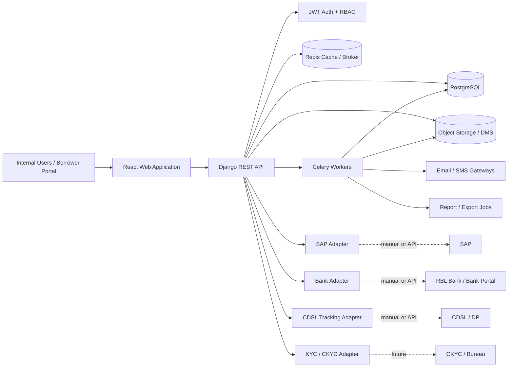

## 6.1 Runtime Components

| Component | Technology | Responsibility |
|---|---|---|
| React SPA | React, TypeScript recommended | User interface, workflow screens, forms, dashboards |
| Django API | Python, Django, Django REST Framework | Business APIs, validation, workflows, permissions |
| PostgreSQL | PostgreSQL | System of record |
| Redis | Redis | Cache, Celery broker, rate-limit support |
| Celery Workers | Celery | Background tasks, notifications, reports, reminders, scheduled jobs |
| Object Storage | S3-compatible / DMS | Document and evidence file storage |
| Nginx / Reverse Proxy | Nginx | TLS termination, static asset routing, request forwarding |
| Gunicorn / ASGI server | Gunicorn / Uvicorn if async required | Django app serving |
| Monitoring | Prometheus / Grafana / Sentry / ELK style stack | Logs, metrics, errors and audit observability |

---

# 7. Logical Application Architecture

## 7.1 Frontend Layers

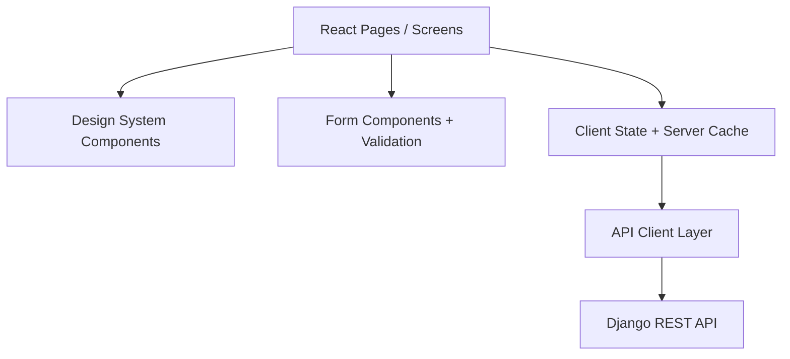

| Layer | Responsibility |
|---|---|
| Pages | Route-level screens such as Applications, Member Profile, Appraisal, Approval, Documentation, Disbursement, Monitoring |
| Feature modules | Domain-specific UI logic |
| Design system components | Buttons, tables, status badges, cards, modals, steppers, alerts |
| Form layer | Validations, error mapping, conditional fields |
| API client | Typed API calls, JWT injection, refresh handling |
| Server state | Cache fetched data, invalidation after actions |
| Local state | Wizard progress, unsaved form state, filters |

## 7.2 Backend Layers

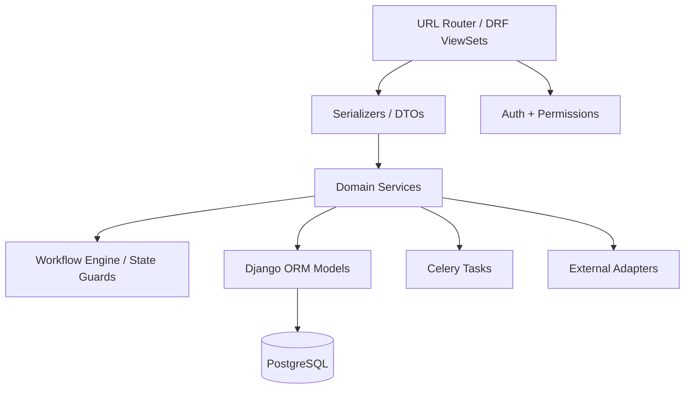

| Layer | Responsibility |
|---|---|
| API Views / ViewSets | HTTP entry points, request parsing, response formatting |
| Serializers | Input validation, output DTOs, field-level transformation |
| Permission classes | Role, team and object-level access checks |
| Service layer | Business operations and transaction boundaries |
| Workflow layer | State transitions and guard conditions |
| Model layer | Data persistence and database constraints |
| Task layer | Asynchronous work |
| Adapter layer | SAP, bank, email, SMS, object storage and future external integrations |
| Audit layer | Append-only tracking of operations |

---

# 8. Backend Architecture: Python + Django

## 8.1 Recommended Django Project Structure

```text
sfpcl_credit/
  config/
    settings/
      base.py
      local.py
      staging.py
      production.py
    urls.py
    asgi.py
    wsgi.py

  apps/
    accounts/
      models.py
      serializers.py
      views.py
      permissions.py
      services.py

    members/
      models.py
      serializers.py
      views.py
      services.py
      selectors.py

    kyc/
      models.py
      services.py
      validators.py

    applications/
      models.py
      serializers.py
      views.py
      services.py
      workflows.py

    credit/
      models.py
      services.py
      calculators.py
      workflows.py

    approvals/
      models.py
      services.py
      rules.py
      workflows.py

    documents/
      models.py
      services.py
      generators.py
      storage.py

    security/
      models.py
      services.py
      workflows.py

    loans/
      models.py
      services.py
      schedules.py
      workflows.py

    finance/
      models.py
      services.py
      allocations.py
      accruals.py

    integrations/
      sap/
      bank/
      sms/
      email/
      cdsl/
      ckyc/

    monitoring/
      models.py
      services.py
      reports.py

    defaults/
      models.py
      services.py
      workflows.py

    closures/
      models.py
      services.py
      workflows.py

    compliance/
      models.py
      services.py
      tasks.py

    communications/
      models.py
      services.py
      templates.py

    audit/
      models.py
      middleware.py
      services.py

    common/
      enums.py
      exceptions.py
      permissions.py
      pagination.py
      filters.py
      utils.py

  tests/
  manage.py
```

## 8.2 Django Apps and Responsibilities

| App | Responsibility |
|---|---|
| `accounts` | Users, roles, permissions, teams, JWT integration, RBAC |
| `members` | Member master, individual profiles, producer institution profiles, nominees, witnesses |
| `kyc` | KYC profiles, KYC documents, re-KYC tracking, sensitive data validation |
| `applications` | Loan applications, request register, application documents, deficiencies, rejection notes |
| `credit` | Eligibility assessment, loan limit calculation, appraisal note, risk assessment |
| `approvals` | Approval matrix, approval cases, approval actions, sanction decisions, registers |
| `documents` | Document templates, generated documents, checklist, signatures, stamping, notarisation |
| `security` | PoA, SH-4, CDSL pledge, blank cheque, security custody |
| `loans` | Loan accounts, loan terms, schedules, status history |
| `finance` | SAP customer code workflow, disbursements, repayments, allocations, interest, accrual |
| `monitoring` | DPD, reminders, MIS, portfolio snapshots |
| `defaults` | Default case, grace period, extension, non-payment, recovery decision |
| `closures` | Loan closure, NOC, security return, archive |
| `compliance` | Statutory controls, tasks, evidence, Section 186, NBFC test, legal reviews |
| `communications` | Email, SMS, phone logs, letters, content templates |
| `integrations` | External system adapters |
| `audit` | Audit logs, workflow events, version history |
| `common` | Shared enums, exceptions, utilities and base classes |

---

# 9. Frontend Architecture: React

## 9.1 Recommended React Stack

| Concern | Recommendation |
|---|---|
| Framework | React |
| Language | TypeScript recommended |
| Routing | React Router |
| Server state | TanStack Query / React Query |
| Forms | React Hook Form |
| Schema validation | Zod or Yup |
| UI components | Internal component library built from design system |
| Data tables | TanStack Table or equivalent |
| Charts | Recharts / lightweight chart library |
| API client | Axios / Fetch wrapper with JWT refresh handling |
| Styling | Tailwind CSS, CSS Modules, or component tokens based on design system |
| Testing | Vitest / Jest, React Testing Library, Playwright / Cypress |

## 9.2 Frontend Folder Structure

```text
src/
  app/
    router.tsx
    providers.tsx
    queryClient.ts
    authProvider.tsx

  api/
    httpClient.ts
    authApi.ts
    membersApi.ts
    applicationsApi.ts
    approvalsApi.ts
    documentsApi.ts
    loansApi.ts
    financeApi.ts
    complianceApi.ts

  features/
    auth/
    dashboard/
    members/
    applications/
    credit-assessment/
    approvals/
    documentation/
    disbursement/
    repayments/
    monitoring/
    defaults/
    closures/
    compliance/
    reports/
    settings/

  components/
    buttons/
    forms/
    tables/
    status/
    cards/
    modals/
    steppers/
    document-viewer/
    audit-timeline/
    permissions/
    layout/

  design-system/
    tokens.ts
    typography.ts
    colors.ts
    spacing.ts

  hooks/
  utils/
  types/
  constants/
  tests/
```

## 9.3 Route Groups

| Route | Purpose |
|---|---|
| `/login` | JWT login |
| `/dashboard` | Role-based dashboard |
| `/members` | Member search and member master |
| `/members/:id` | Member profile |
| `/applications` | Application pipeline |
| `/applications/new` | Loan application intake |
| `/applications/:id` | Application workspace |
| `/applications/:id/eligibility` | Eligibility assessment |
| `/applications/:id/appraisal` | Loan appraisal note |
| `/applications/:id/approvals` | Sanction workflow |
| `/applications/:id/documents` | Documentation checklist |
| `/applications/:id/security` | Security package |
| `/applications/:id/disbursement` | Disbursement readiness |
| `/loans` | Loan portfolio |
| `/loans/:id` | Loan account |
| `/loans/:id/repayments` | Repayment ledger |
| `/loans/:id/interest` | Interest invoices and accrual |
| `/loans/:id/default` | Default handling |
| `/loans/:id/closure` | Closure and NOC |
| `/compliance` | Compliance dashboard |
| `/reports` | Reports and exports |
| `/settings` | Configurations, templates, users and roles |
| `/audit` | Audit logs, where authorised |

---

# 10. Authentication Architecture: JWT

## 10.1 JWT Flow

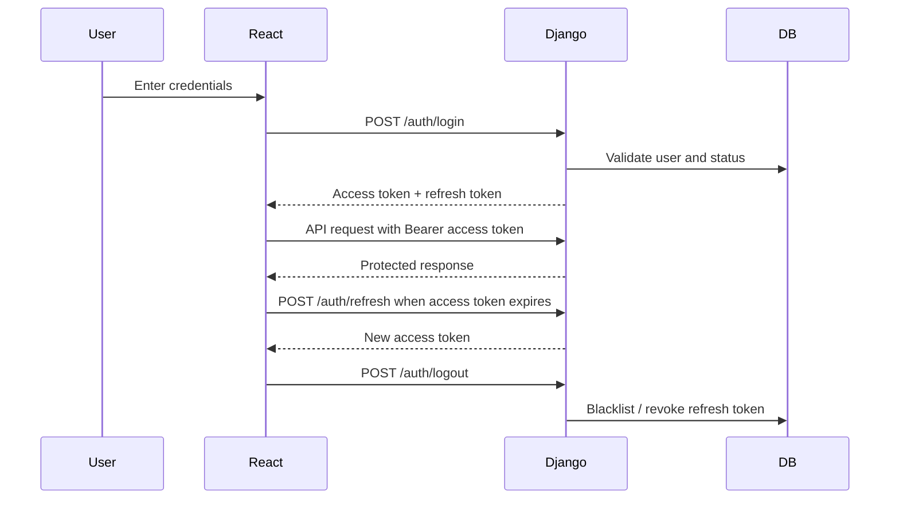

## 10.2 JWT Design

| Item | Recommendation |
|---|---|
| Access token lifetime | Short, e.g. 10–30 minutes |
| Refresh token lifetime | Longer, e.g. 8–24 hours or client policy |
| Refresh rotation | Recommended |
| Token blacklist | Required for logout and compromised sessions |
| Token claims | User ID, role IDs, team IDs, permissions version, session ID |
| Sensitive data in token | Avoid storing PAN, Aadhaar, bank data or detailed permissions payload |
| Storage | Prefer secure httpOnly cookies where feasible; otherwise hardened memory/session strategy |
| CSRF | Required if using cookies |
| Session tracking | Store refresh token/session record server-side |
| MFA | Recommended for approvers and administrators in future phase |

## 10.3 Auth Endpoints

| Endpoint | Method | Purpose |
|---|---|---|
| `/api/auth/login/` | POST | Login and issue tokens |
| `/api/auth/refresh/` | POST | Refresh access token |
| `/api/auth/logout/` | POST | Revoke refresh token |
| `/api/auth/me/` | GET | Current user profile, roles and permissions |
| `/api/auth/change-password/` | POST | Change password |
| `/api/auth/forgot-password/` | POST | Start password reset |
| `/api/auth/reset-password/` | POST | Complete password reset |

## 10.4 Authorisation Model

Authorisation should combine:

1. Role-based permissions.
2. Team membership.
3. Object-level ownership.
4. Workflow-stage permissions.
5. Approval authority.
6. Sensitive data access controls.

Example:

| Action | Required Access |
|---|---|
| Create application | Field Officer / Credit Assessment role |
| Prepare appraisal | Deputy Manager – Finance |
| Review appraisal | Credit Manager |
| Approve sanction up to ₹5 lakh | CFO + one Director |
| Approve sanction above ₹5 lakh | CFO + two Directors |
| Verify documentation | Company Secretary |
| Initiate disbursement | Senior Manager – Finance |
| Authorise transfer | Chief Financial Controller |
| View Aadhaar full value | Restricted, audited access only |
| Invoke SH-4 / blank cheque | Recovery approval authority plus Company Secretary / authorised user |

---

# 11. Database Architecture: PostgreSQL

## 11.1 PostgreSQL Role

PostgreSQL is the system of record for:

- Members.
- Loan applications.
- Documents metadata.
- Approvals.
- Loan accounts.
- Repayments.
- Interest.
- Defaults.
- Compliance.
- Audit logs.
- Workflow states.
- Configuration.

## 11.2 Database Design Principles

| Principle | Approach |
|---|---|
| Strict integrity | Foreign keys, unique constraints and check constraints |
| Workflow traceability | Status history and workflow events |
| Auditability | Append-only audit logs |
| Config versioning | Effective-dated configuration tables |
| Sensitive data protection | Encryption and hash columns |
| Reporting performance | Indexed status fields and reporting views |
| Migration safety | Legacy references and migration batch IDs |
| Financial correctness | Decimal types, transactional updates and reconciliation logs |

## 11.3 Schema Organisation

Recommended PostgreSQL schemas:

| Schema | Tables |
|---|---|
| `auth` | Users, roles, permissions, sessions |
| `core` | Members, parties, KYC, bank |
| `credit` | Applications, assessment, approval, documents, security |
| `loan` | Loan accounts, repayments, interest, defaults, closures |
| `compliance` | Controls, trackers, evidence |
| `audit` | Audit logs, workflow events, version history |
| `reporting` | Views and materialized views |

This can be implemented as actual PostgreSQL schemas or as naming conventions within the default schema.

## 11.4 Core Data Groups

| Data Group | Important Tables |
|---|---|
| Member data | `members`, `individual_member_profiles`, `producer_institution_profiles`, `nominees`, `witnesses` |
| Eligibility data | `active_member_statuses`, `shareholdings`, `share_valuations`, `land_holdings`, `crop_plans`, `produce_supply_records` |
| Application data | `loan_applications`, `loan_request_register_entries`, `deficiencies`, `rejection_notes` |
| Credit data | `eligibility_assessments`, `loan_limit_assessments`, `loan_appraisal_notes`, `risk_assessments` |
| Approval data | `approval_cases`, `approval_actions`, `sanction_decisions`, `credit_sanction_register_entries`, `exception_register_entries` |
| Documentation data | `loan_documents`, `document_checklists`, `checklist_items`, `signature_records`, `stamp_duty_records`, `notarisation_records` |
| Security data | `security_packages`, `power_of_attorneys`, `sh4_share_transfer_forms`, `cdsl_share_pledges`, `blank_dated_cheques` |
| Finance data | `sap_customer_profile_requests`, `sap_customer_codes`, `disbursements`, `repayments`, `repayment_allocations`, `interest_invoices`, `accrual_entries` |
| Monitoring data | `dpd_statuses`, `reminders`, `quarterly_mis_reports`, `loan_portfolio_snapshots` |
| Default data | `default_cases`, `default_assessments`, `extension_notes`, `non_payment_notes`, `recovery_decisions`, `recovery_actions` |
| Closure data | `loan_closures`, `nocs`, `security_returns`, `archive_records` |
| Compliance data | `compliance_controls`, `compliance_tasks`, `section_186_trackers`, `nbfc_principal_tests`, `kyc_reviews` |
| Audit data | `audit_logs`, `workflow_events`, `version_histories` |

---

# 12. API Architecture

## 12.1 API Style

Use REST APIs with JSON payloads.

Recommended characteristics:

- Resource-oriented endpoints.
- Consistent pagination, filtering and sorting.
- Standard error format.
- Role and workflow permission enforcement at API layer.
- Idempotency keys for financial and workflow actions.
- Separate action endpoints for state transitions.
- File upload endpoints for documents.
- Export endpoints for registers and reports.

## 12.2 API Versioning

Recommended base path:

```text
/api/v1/
```

Versioning strategy:

- Keep backwards-compatible changes in same version.
- Use `/api/v2/` only for breaking changes.
- Include API schema using OpenAPI / Swagger.

## 12.3 Standard API Response

```json
{
  "success": true,
  "data": {},
  "meta": {
    "request_id": "req_123",
    "timestamp": "2026-06-22T10:30:00Z"
  }
}
```

## 12.4 Standard API Error

```json
{
  "success": false,
  "error": {
    "code": "LOAN_LIMIT_EXCEEDED",
    "message": "Requested amount exceeds the final eligible loan amount.",
    "details": {
      "requested_amount": 600000,
      "eligible_amount": 500000,
      "exception_required": true
    }
  },
  "meta": {
    "request_id": "req_123"
  }
}
```

## 12.5 API Resource Groups

| API Group | Example Endpoints |
|---|---|
| Auth | `/auth/login`, `/auth/refresh`, `/auth/me` |
| Members | `/members`, `/members/{id}`, `/members/{id}/shareholdings` |
| Applications | `/loan-applications`, `/loan-applications/{id}`, `/loan-applications/{id}/submit` |
| Eligibility | `/loan-applications/{id}/eligibility-assessment` |
| Loan Limits | `/loan-applications/{id}/loan-limit-assessment/calculate` |
| Appraisal | `/loan-applications/{id}/appraisal-note` |
| Approvals | `/approval-cases`, `/approval-cases/{id}/approve`, `/approval-cases/{id}/reject` |
| Documentation | `/loan-applications/{id}/documents`, `/document-checklists/{id}/approve` |
| Security | `/security-packages/{id}`, `/security-packages/{id}/cdsl-pledge` |
| SAP | `/sap-customer-requests`, `/sap-customer-requests/{id}/complete` |
| Loans | `/loan-accounts`, `/loan-accounts/{id}` |
| Disbursements | `/loan-accounts/{id}/disbursements/initiate`, `/disbursements/{id}/authorise` |
| Repayments | `/loan-accounts/{id}/repayments`, `/repayments/{id}/allocate` |
| Interest | `/loan-accounts/{id}/interest-invoices`, `/interest-capitalisations` |
| Defaults | `/default-cases`, `/default-cases/{id}/grant-extension` |
| Recoveries | `/recovery-decisions`, `/recovery-actions` |
| Closures | `/loan-accounts/{id}/closure`, `/closures/{id}/issue-noc` |
| Compliance | `/compliance/tasks`, `/compliance/section-186`, `/compliance/nbfc-tests` |
| Reports | `/reports/application-pipeline`, `/reports/cfo-mis`, `/reports/export` |
| Audit | `/audit/logs`, `/workflow-events` |

---

# 13. Service Layer Architecture

## 13.1 Why a Service Layer Is Required

Django model methods and DRF serializers should not contain complex workflow orchestration. The SOP requires multi-entity operations, permissions, calculations and audit logs. These belong in explicit service classes or functions.

## 13.2 Example Services

| Service | Responsibility |
|---|---|
| `LoanApplicationService` | Create, submit, return incomplete application, generate reference number |
| `EligibilityService` | Run active-member, default, document, purpose and nominee checks |
| `LoanLimitService` | Calculate shareholding and land-based limits |
| `AppraisalService` | Prepare and submit appraisal note |
| `ApprovalService` | Create approval cases, apply matrix, record decisions |
| `SanctionService` | Create sanction decision and sanction register entry |
| `DocumentService` | Generate documents, track signatures, stamping and notarisation |
| `ChecklistService` | Evaluate document readiness and checklist approvals |
| `SecurityService` | Create PoA, SH-4, CDSL pledge and blank cheque records |
| `SAPCustomerService` | Create SAP customer profile request and confirmation |
| `DisbursementService` | Verify readiness, initiate payment, record CFC authorisation |
| `RepaymentService` | Capture repayment and allocate principal-first |
| `InterestService` | Generate invoices, post accruals, capitalise unpaid interest |
| `MonitoringService` | Calculate DPD, reminders and MIS snapshots |
| `DefaultService` | Open default case, manage grace period and extension |
| `RecoveryService` | Record non-payment note, approval and recovery action |
| `ClosureService` | Close loan, issue NOC, return securities and archive |
| `ComplianceService` | Generate compliance tasks and statutory trackers |
| `AuditService` | Write audit logs and workflow events |

## 13.3 Transaction Boundary Example: Sanction Approval

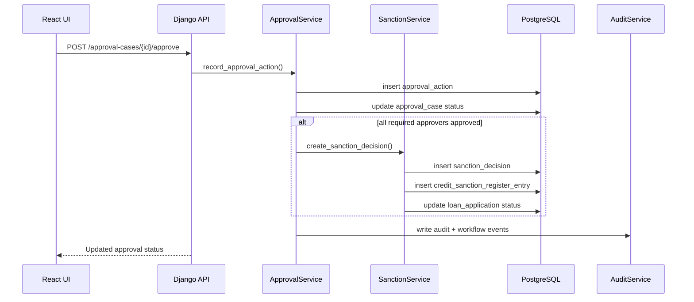

---

# 14. Workflow Architecture

## 14.1 Workflow Engine Scope

A lightweight internal workflow layer is recommended. It does not need to be a separate workflow engine initially, but it must enforce:

- Allowed transitions.
- Required role for transitions.
- Required data before transitions.
- Audit logging.
- Exception approval where transitions bypass normal gates.

## 14.2 Primary Workflows

| Workflow | Entity |
|---|---|
| Loan application workflow | `loan_applications` |
| Credit assessment workflow | `loan_appraisal_notes` |
| Approval workflow | `approval_cases` |
| Documentation workflow | `document_checklists` and `loan_documents` |
| Security workflow | `security_packages` |
| Disbursement workflow | `disbursements` |
| Repayment workflow | `repayments`, `repayment_allocations` |
| Default workflow | `default_cases` |
| Recovery workflow | `recovery_decisions`, `recovery_actions` |
| Closure workflow | `loan_closures` |
| Compliance workflow | `compliance_tasks` |

## 14.3 Loan Application State Machine

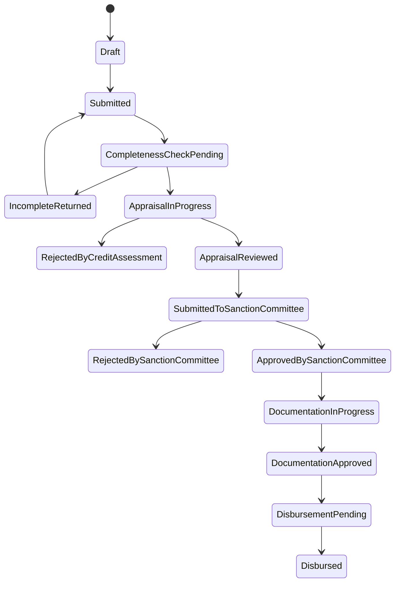

## 14.4 Gate Conditions

| Transition | Required Conditions |
|---|---|
| Draft → Submitted | Borrower, nominee, requested amount, purpose and application documents captured |
| Submitted → AppraisalInProgress | Completeness check passed |
| AppraisalInProgress → AppraisalReviewed | Appraisal note complete and reviewed by Credit Manager |
| AppraisalReviewed → SubmittedToSanctionCommittee | Eligibility and loan limit assessment completed |
| SubmittedToSanctionCommittee → Approved | Required approvers approve |
| Approved → DocumentationInProgress | Sanction decision recorded |
| DocumentationInProgress → DocumentationApproved | All required documents verified, stamped and notarised where required |
| DocumentationApproved → DisbursementPending | Checklist signed by CS, Credit Manager and Sanction Committee |
| DisbursementPending → Disbursed | SAP code present, bank verified, Senior Manager initiated and CFC authorised |

---

# 15. Document Architecture

## 15.1 Document Storage Model

Documents should be split into:

1. File metadata in PostgreSQL.
2. Binary file in object storage or DMS.
3. Document type and verification status in domain tables.
4. Physical custody information where applicable.

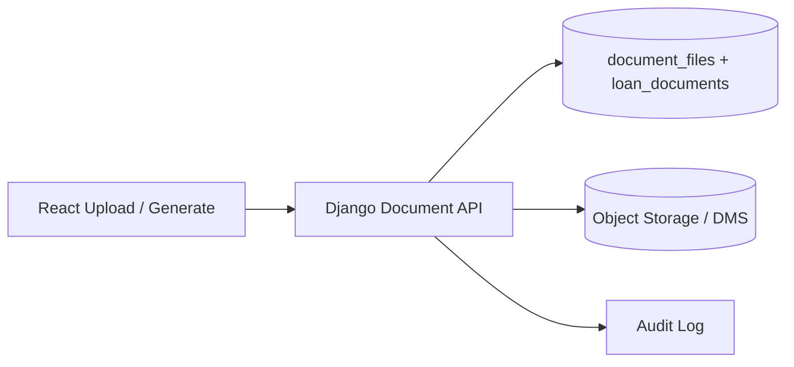

## 15.2 Document Categories

| Category | Examples |
|---|---|
| KYC | PAN, Aadhaar, CKYC consent, photographs |
| Application | Loan Application Form, crop plan, land documents |
| Legal | PoA, Term Sheet, Loan Agreement, declarations |
| Security | SH-4, CDSL evidence, blank cheque, cancelled cheque |
| Finance | SAP request Excel, disbursement advice, bank references |
| Monitoring | Interest invoices, reminders, default notes |
| Closure | NOC, security return acknowledgement, archive evidence |
| Compliance | Board minutes, legal opinion, Section 186 tracker, NBFC calculations |

## 15.3 Document Generation

Use server-side document generation for controlled templates:

- Loan Application Form.
- Loan Appraisal Note.
- Power of Attorney.
- Declaration / Tri-party Agreement.
- Term Sheet.
- Loan Agreement.
- Bank Verification Letter.
- Checklist.
- Rejection Note.
- NOC.
- Extension Note.
- Non-Payment Note.

Recommended implementation:

| Item | Approach |
|---|---|
| Template format | DOCX or HTML templates converted to PDF |
| Merge fields | Stored in template metadata |
| Version control | Effective-dated document templates |
| Output | PDF stored in object storage |
| Audit | Log template version, generated by, generated at |
| Manual upload | Allow scanned signed copy upload |

## 15.4 Physical Document Tracking

Because the SOP requires physical items such as stamp paper, notarised documents, SH-4 and blank cheques, the system must track:

- Document custody location.
- Collected by.
- Collected date.
- Moved to / from location.
- Returned to borrower.
- Acknowledgement document.
- Invocation approval reference, if used for recovery.

---

# 16. File Storage Architecture

## 16.1 Options

| Option | Use Case |
|---|---|
| S3-compatible object storage | Recommended for scalable storage |
| On-premise file server | Acceptable if client requires local data residency |
| Document Management System | Preferred if SFPCL already has DMS |
| Database BLOBs | Not recommended for large documents |

## 16.2 Recommended Pattern

- Store files outside PostgreSQL.
- Store metadata in `document_files`.
- Store secure storage key and checksum.
- Use signed URLs or backend proxy for download.
- Enforce permission checks before access.
- Watermark sensitive previews if required.
- Virus scan uploaded documents.
- Maintain retention rules.

## 16.3 Document Security

| Control | Requirement |
|---|---|
| Access control | Role and object-level check |
| Encryption | Server-side encryption at rest |
| Transport | HTTPS only |
| Audit | Log view, download and delete actions |
| Masking | Sensitive document previews restricted |
| Retention | Archive for at least eight years for loan files |
| Deletion | No deletion for active or archived compliance files except approved retention process |

---

# 17. Security Architecture

## 17.1 Security Controls

| Area | Control |
|---|---|
| Authentication | JWT with refresh rotation and blacklist |
| Authorisation | RBAC + object-level permissions |
| Sensitive data | Encryption and masking |
| Transport | TLS 1.2+ |
| Passwords | Strong hashing with Django password hashers |
| Admin access | Restricted and audited |
| File access | Permission-checked signed URLs or backend streaming |
| Audit | Append-only audit logs |
| CSRF | Required if JWT is stored in cookies |
| CORS | Restrict to approved frontend origins |
| Rate limiting | Login and sensitive endpoints |
| Session management | Refresh token records and revocation |
| Secrets | Environment variables / secret manager |
| Backups | Encrypted database and file backups |

## 17.2 Sensitive Fields

The following should be encrypted or tokenised:

- PAN.
- Aadhaar.
- Bank account number.
- Cheque number.
- BO account number.
- CKYC identifier.
- Sensitive KYC document references.
- SAP profile data containing PAN / Aadhaar.
- Recovery notes, where required by policy.

## 17.3 Masking Rules

| Field | Default Display |
|---|---|
| PAN | Last 4 characters only |
| Aadhaar | Last 4 digits only |
| Bank account number | Last 4 digits only |
| Cheque number | Hidden unless authorised |
| BO account | Last 4 digits only |
| KYC document | Restricted preview |

## 17.4 Audit Events

Audit log should capture:

- Login and logout.
- Failed login attempts.
- Member data creation / update.
- Sensitive field view.
- Document upload / download / verification.
- Application submission.
- Eligibility calculation.
- Loan limit calculation.
- Appraisal submission.
- Approval actions.
- Rejection notes.
- Checklist approvals.
- Security custody movements.
- SAP code creation confirmation.
- Disbursement initiation and authorisation.
- Repayment posting and allocation.
- Interest capitalisation.
- Default and recovery actions.
- NOC issuance.
- Security return.
- Configuration changes.
- User / role permission changes.

---

# 18. RBAC and Object Permission Architecture

## 18.1 Permission Layers

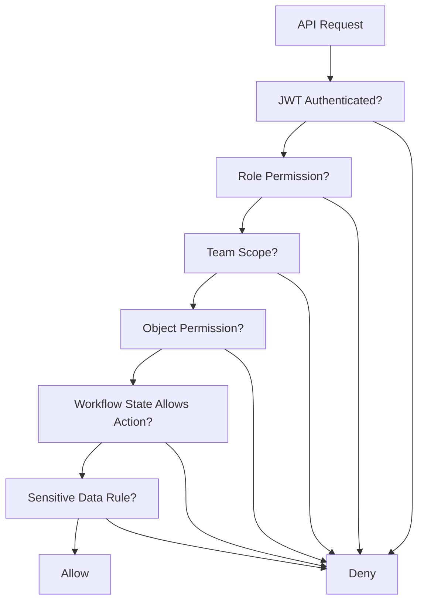

## 18.2 Example Permission Matrix

| Module / Action | Field Officer | Deputy Manager Finance | Credit Manager | CS | Senior Manager Finance | CFC | CFO | Director | Auditor |
|---|---:|---:|---:|---:|---:|---:|---:|---:|---:|
| Create application | Yes | Yes | Yes | No | No | No | No | No | Read |
| Verify completeness | No | Yes | Yes | No | No | No | No | No | Read |
| Prepare appraisal | No | Yes | No | No | No | No | No | No | Read |
| Review appraisal | No | No | Yes | No | No | No | No | No | Read |
| Approve sanction | No | No | No | No | No | No | Yes | Yes | Read |
| Prepare documents | No | No | No | Yes | No | No | No | No | Read |
| Approve checklist as CS | No | No | No | Yes | No | No | No | No | Read |
| Initiate disbursement | No | No | No | No | Yes | No | No | No | Read |
| Authorise bank transfer | No | No | No | No | No | Yes | No | No | Read |
| View portfolio MIS | No | Limited | Yes | Limited | Limited | Yes | Yes | Limited | Read |
| Perform audit review | No | No | No | No | No | No | No | No | Yes |

---

# 19. Integration Architecture

## 19.1 Integration Pattern

Use adapter classes in Django:

```text
integrations/
  sap/
    adapter.py
    manual.py
    api.py
  bank/
    adapter.py
    manual.py
    rbl.py
  sms/
    adapter.py
  email/
    adapter.py
  cdsl/
    adapter.py
  ckyc/
    adapter.py
```

Each adapter should expose a stable internal interface even if the first implementation is manual.

## 19.2 SAP Integration

## Current / Phase 1

Manual or semi-manual:

1. Credit Manager triggers SAP customer profile request.
2. System generates Excel template.
3. Senior Manager – Finance creates customer code in SAP.
4. Senior Manager – Finance enters SAP customer code and uploads confirmation evidence.
5. Loan proceeds to disbursement.

## Future / Phase 2

API or automated integration:

- Push customer profile data to SAP.
- Pull customer code confirmation.
- Push loan disbursement posting.
- Pull repayment receipt entries.
- Pull reconciliation reports.

## Data Exchanged

| Direction | Data |
|---|---|
| LMS → SAP | Farmer name, Aadhaar, PAN, address, email, loan application number |
| SAP → LMS | SAP customer code, vendor code if used, confirmation timestamp |
| LMS ↔ SAP | Loan payment entry, repayment entry, interest accrual and invoice references |

## 19.3 Bank / RBL Integration

## Phase 1

Manual bank portal workflow:

1. Senior Manager – Finance initiates online transfer in bank portal.
2. Chief Financial Controller authorises transfer.
3. Bank reference number is entered in LMS.
4. Disbursement status is marked successful.
5. Disbursement advice is sent.

## Future Phase

Possible API / file-based integration:

- Beneficiary validation.
- Payment initiation.
- Payment status pull.
- Bank statement import.
- Repayment reconciliation.

## 19.4 Email and SMS

Use asynchronous tasks for all outbound notifications.

| Notification | Channel |
|---|---|
| Application acknowledgement | Email / SMS |
| Deficiency note | Email / courier record |
| Rejection note | Email / courier record |
| Rate change | SMS / email |
| Disbursement advice | Email / SMS |
| Repayment reminder | SMS / phone log |
| Interest invoice | Email / letter |
| Interest capitalisation | Email + hard copy letter |
| NOC | Email / physical delivery |

## 19.5 CDSL Tracking

Phase 1 should track manual process milestones:

- Pledgor BO account.
- Pledgee BO account.
- PRF submitted.
- Pledge Sequence Number generated.
- Pledge accepted / rejected.
- Pledge created.
- Invocation Request Form.
- Unpledge Request Form.
- Auto-unpledge.

Future integration can be added if CDSL / DP APIs are available.

---

# 20. Background Job Architecture

## 20.1 Celery Usage

Use Celery for asynchronous and scheduled operations.

| Job | Trigger |
|---|---|
| Send email / SMS | Event-based |
| Generate PDF documents | User action / event |
| Virus scan file upload | File upload |
| Generate Excel exports | User action |
| Appraisal TAT reminders | Scheduled |
| Re-KYC reminders | Scheduled |
| DPD calculation | Daily / monthly / quarterly |
| Quarterly MIS snapshot | Quarterly |
| Interest accrual | Monthly |
| Interest invoice generation | Yearly |
| Interest capitalisation check | After 30 April |
| Default case opening | Scheduled overdue scan |
| Grace period expiry check | Daily |
| Extension expiry check | Daily |
| Compliance task generation | Scheduled |
| Archive retention review | Scheduled |

## 20.2 Celery Beat Schedule

| Schedule | Job |
|---|---|
| Daily | Overdue scan, grace expiry, extension expiry, pending reminders |
| Weekly | Document pending summary, SAP pending summary |
| Monthly | Interest accrual entries, access review reminders |
| Quarterly | DPD bucket snapshot, CFO MIS, Section 186 tracker, NBFC principal test |
| Bi-annual / 24-month cycle | Re-KYC tasks |
| Annual | Money-lending law review, record retention audit |
| After 30 April | Interest capitalisation workflow |

## 20.3 Idempotency

Background tasks must be idempotent.

Examples:

- Monthly accrual should not create duplicate accrual for same loan and month.
- Interest capitalisation should not capitalise same financial year twice.
- Reminder jobs should not spam borrowers without communication rules.
- Default case should not duplicate for the same missed schedule.

---

# 21. Reporting Architecture

## 21.1 Operational Dashboards

| Dashboard | Users |
|---|---|
| Application pipeline | Credit Assessment Team |
| Appraisal TAT | Credit Manager |
| Approval pending | CFO and Directors |
| Documentation readiness | Compliance Team / CS |
| Disbursement pending | Treasury Team |
| SAP customer code pending | Credit Manager / Senior Manager – Finance |
| Repayment ledger | Credit / Accounts |
| Default cases | Credit Manager / CFO |
| Closure pending | Compliance Team |

## 21.2 Compliance Dashboards

| Dashboard | Users |
|---|---|
| Section 186 tracker | CFO |
| NBFC principal test | CFO |
| KYC / re-KYC status | Credit Head |
| Stamp duty status | Company Secretary |
| Security custody register | CS / Internal Auditor |
| Exception Register | CFO / Auditor |
| Grievance log | Company Secretary |
| Record retention | CS / Auditor |

## 21.3 Reporting Implementation

Recommended layers:

1. Transaction tables.
2. Read-optimised views.
3. Materialized views for heavy dashboards.
4. Export jobs using Celery.
5. Role-based report access.

## 21.4 Export Formats

Support:

- XLSX.
- CSV.
- PDF for formal reports.
- JSON for integration / API use.

---

# 22. DevOps and Deployment Architecture

## 22.1 Environments

| Environment | Purpose |
|---|---|
| Local | Developer workstations |
| Dev | Shared development integration |
| QA | Functional and regression testing |
| UAT | Client validation |
| Staging | Production-like release candidate |
| Production | Live system |
| DR / Backup | Recovery environment where required |

## 22.2 Recommended Deployment Topology

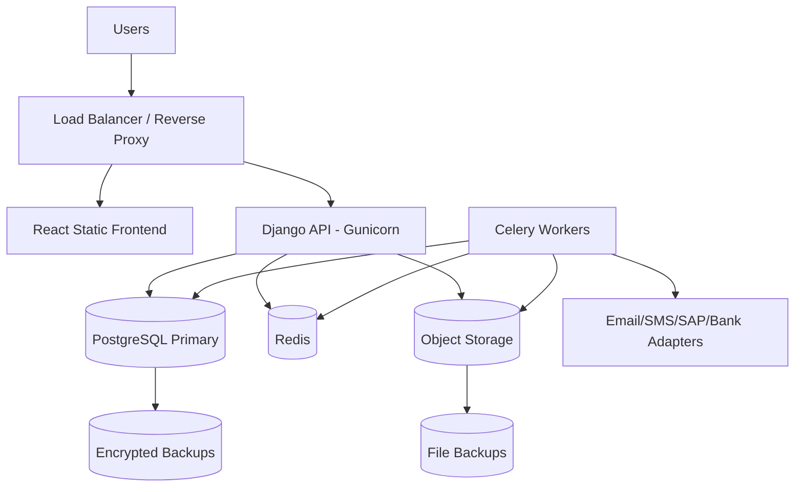

## 22.3 Containerisation

Use Docker for consistent environments.

Recommended containers:

- `frontend`
- `backend`
- `celery_worker`
- `celery_beat`
- `postgres`
- `redis`
- `nginx`

Production database may use managed PostgreSQL rather than container.

## 22.4 CI/CD Pipeline

```mermaid
flowchart LR
    DEV[Developer Commit] --> CI[CI Pipeline]
    CI --> LINT[Lint + Format]
    LINT --> TEST[Unit + Integration Tests]
    TEST --> BUILD[Build Docker Images]
    BUILD --> SECURITY[Security Scan]
    SECURITY --> DEPLOYQA[Deploy to QA]
    DEPLOYQA --> UAT[UAT Approval]
    UAT --> PROD[Deploy to Production]
    PROD --> MONITOR[Monitoring + Rollback]
```

## 22.5 CI Checks

| Layer | Checks |
|---|---|
| Backend | Python lint, type checks, Django tests, migrations check |
| Frontend | TypeScript build, lint, unit tests |
| Security | Dependency vulnerability scan, secret scan |
| Database | Migration validation |
| API | OpenAPI generation and schema diff |
| E2E | Critical flow tests |
| Build | Docker image build and scan |

---

# 23. Observability Architecture

## 23.1 Logs

Structured logs should include:

- Request ID.
- User ID.
- Entity type and ID.
- Action.
- Status.
- Duration.
- IP address.
- Error code.

Do not log sensitive values such as PAN, Aadhaar, full bank account or cheque numbers.

## 23.2 Metrics

| Metric | Purpose |
|---|---|
| API request count / latency | Performance |
| Error rate | Reliability |
| Login failures | Security |
| Application creation count | Business throughput |
| Appraisal TAT breaches | Operational control |
| Pending approvals | Bottleneck |
| Documentation pending count | Disbursement readiness |
| Disbursement failures | Finance control |
| Repayment posting failures | Finance control |
| Background job failures | Reliability |
| Notification failures | Communication control |
| DPD bucket changes | Portfolio monitoring |
| Compliance overdue tasks | Governance |

## 23.3 Alerts

| Alert | Severity |
|---|---|
| Production API down | Critical |
| Database unavailable | Critical |
| Celery queue stuck | High |
| Failed disbursement status | High |
| Repeated login failures | High |
| Sensitive data access spike | High |
| Interest accrual job failed | High |
| DPD job failed | Medium |
| Compliance task overdue | Medium |
| Document storage error | High |

## 23.4 Error Tracking

Use Sentry or equivalent for:

- Backend exceptions.
- Frontend runtime errors.
- Background task failures.
- API error traces.

---

# 24. Performance and Scalability

## 24.1 Expected Workload Characteristics

The platform is workflow-heavy rather than high-volume consumer traffic. Performance requirements are driven by:

- Search and filter across members and applications.
- Document upload and preview.
- Dashboard counts.
- Report generation.
- Approval and audit logs.
- Periodic jobs.

## 24.2 Performance Strategies

| Area | Strategy |
|---|---|
| Lists | Pagination, filtering, indexed columns |
| Search | PostgreSQL full-text search for names / references if needed |
| Dashboards | Materialized views and cached aggregates |
| Reports | Asynchronous export jobs |
| Documents | Object storage and signed URLs |
| Large files | Multipart upload if needed |
| Audit logs | Partition by date if volume grows |
| DPD snapshots | Precompute with scheduled jobs |
| Compliance dashboard | Cache task counts |

## 24.3 Database Indexing Priorities

Index:

- Application reference number.
- Member ID.
- PAN hash and Aadhaar hash.
- Application status and stage.
- Approval case status.
- Document verification status.
- Loan account status.
- Repayment date.
- DPD bucket.
- Default case status.
- Compliance task due date and status.
- Audit entity type / ID / timestamp.

---

# 25. Data Backup and Disaster Recovery

## 25.1 Backup Scope

| Data | Backup Requirement |
|---|---|
| PostgreSQL database | Full and incremental backups |
| Object storage documents | Versioned backup / replication |
| Configuration files | Git and secret manager |
| Audit logs | Immutable backup |
| Generated reports | Optional, if reproducible |
| Uploaded documents | Mandatory backup |

## 25.2 Backup Policy

Recommended baseline:

| Backup Type | Frequency |
|---|---|
| Database full backup | Daily |
| Database point-in-time recovery | Continuous WAL archiving if feasible |
| Object storage backup | Daily or versioned replication |
| Configuration backup | On change |
| Backup restore test | Monthly / quarterly |

## 25.3 Recovery Targets

Client to confirm final targets. Suggested:

| Target | Recommended |
|---|---|
| RPO | 15 minutes to 24 hours depending infrastructure |
| RTO | 4 to 8 hours for production |
| Critical data | Database, documents and audit logs |
| DR test | At least annually |

---

# 26. Compliance and Audit Architecture

## 26.1 Audit Evidence Model

Every compliance-sensitive action should produce evidence:

| Action | Evidence |
|---|---|
| Application submission | Application record and document files |
| Completeness check | Verification status and user timestamp |
| Eligibility | Eligibility assessment record |
| Loan limit | Calculation snapshot |
| Appraisal | Appraisal note |
| Sanction | Approval actions and sanction register |
| Exception | Exception register and approval case |
| Documentation | Checklist, signed docs, stamp and notarisation records |
| Disbursement | SAP code, bank transfer reference, CFC authorisation |
| Repayment | Bank reference, SAP posting and allocation |
| Interest | Invoice and accrual entry |
| Default | Default case and assessment |
| Extension | Extension note |
| Recovery | Non-payment note, recovery approval and action evidence |
| Closure | NOC, security return and archive record |
| Compliance | Control task and evidence document |
| SOP change | Version history and Board approval reference |

## 26.2 Statutory Trackers

System should support:

- Producer Company lending only to members.
- Section 186 limits.
- NBFC principal business test.
- KYC / AML and re-KYC.
- Stamp duty.
- Money-lending law review.
- Accounting and reporting.
- Recovery conduct and grievance.
- Data protection.
- Record retention and audit.

---

# 27. Configuration Architecture

## 27.1 Configurable Business Rules

| Configuration | Reason |
|---|---|
| Approval threshold amount | Currently ₹5,00,000 |
| Share valuation percentage | SOP ambiguity: 30% vs 10% |
| Per-share cap | Current referenced ₹200 |
| Scale of finance per acre | Current cap ₹20,000 |
| Interest benchmark | Pending definition |
| Interest spread | Pending definition |
| Penal interest | Pending definition |
| Re-KYC frequency | Two years |
| Record retention | Eight years |
| Grace period | Three months |
| Non-intentional extension | One year |
| DPD buckets | SOP and optional standard buckets |
| Document templates | Annexure versioning |
| Role permissions | Operational control |
| Compliance task frequencies | Statutory control |

## 27.2 Configuration Governance

All major rule changes must be:

1. Drafted.
2. Reviewed.
3. Approved by authorised role.
4. Board approval reference captured where required.
5. Effective dated.
6. Versioned.
7. Audit logged.

---

# 28. Data Migration Architecture

## 28.1 Migration Sources

Likely sources:

- Excel Loan Request Register.
- Existing member / shareholder records.
- Physical loan files.
- KYC document scans.
- SAP customer master.
- SAP loan and repayment entries.
- Bank statements.
- Manual sanction registers.
- Security custody records.
- Compliance trackers.

## 28.2 Migration Pipeline

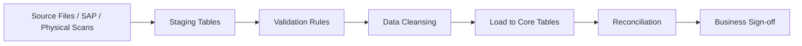

## 28.3 Migration Controls

| Control | Requirement |
|---|---|
| Batch ID | Every migrated row tagged |
| Legacy reference | Preserve original reference numbers |
| Reconciliation | Match loan balances with SAP |
| Data quality report | Missing KYC, missing security, missing approvals |
| Exception marking | Historical gaps tagged as migrated exceptions |
| Sign-off | Business owner approval before go-live |
| Rollback | Ability to reset migration in non-production |

---

# 29. Testing Architecture

## 29.1 Test Pyramid

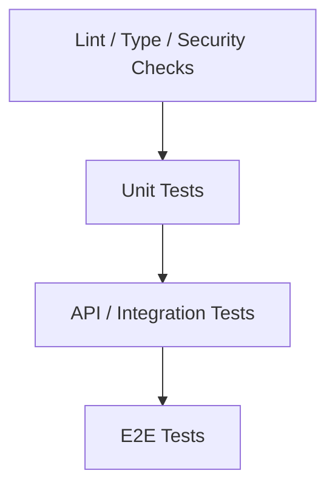

## 29.2 Backend Tests

| Test Type | Coverage |
|---|---|
| Unit tests | Loan limit calculator, repayment allocation, interest capitalisation, DPD calculation |
| Service tests | Application submission, sanction approval, disbursement, repayment, default |
| Permission tests | Role and object-level access |
| API tests | Endpoint validation and response contracts |
| Workflow tests | Allowed and blocked transitions |
| Integration tests | Email, SMS, file storage, SAP adapter mock |
| Migration tests | Data import and reconciliation |
| Security tests | Sensitive data masking and unauthorised access |

## 29.3 Frontend Tests

| Test Type | Coverage |
|---|---|
| Component tests | Forms, tables, status badges, workflow steppers |
| Page tests | Application intake, appraisal, approvals, documentation |
| Form validation tests | KYC, nominee age, loan amount, missing docs |
| Permission rendering tests | Role-based action visibility |
| E2E tests | Full loan lifecycle paths |

## 29.4 Critical E2E Scenarios

1. Individual farmer loan application approved and disbursed.
2. FPC loan application approved and disbursed.
3. Incomplete application returned with deficiencies.
4. Loan rejected by Credit Assessment Team.
5. Loan rejected by Sanction Committee.
6. Loan amount above ₹5 lakh requiring CFO + two Directors.
7. Loan exceeding permissible limit requiring exception entry.
8. Physical shares requiring SH-4 security.
9. Demat shares requiring CDSL pledge tracking.
10. Signature mismatch requiring Bank Verification Letter.
11. SAP customer code creation before disbursement.
12. CFC authorises disbursement.
13. Direct repayment and principal-first allocation.
14. Subsidiary deduction repayment.
15. Interest unpaid after 30 April capitalised into principal.
16. Missed principal repayment triggers three-month grace period.
17. Non-intentional default receives one-year extension.
18. Post-extension non-payment escalates to recovery decision.
19. Full repayment leads to NOC and security return.
20. Compliance dashboard shows Section 186 and NBFC tests.

---

# 30. API Security and Hardening

## 30.1 Backend Hardening

| Control | Implementation |
|---|---|
| Input validation | DRF serializers and service-level validation |
| SQL injection protection | Django ORM and parameterised queries |
| XSS prevention | React escaping and secure rendering |
| CSRF | Required if cookies are used |
| CORS | Restrict allowed origins |
| Rate limiting | Login, password reset and sensitive actions |
| File upload validation | MIME check, extension check, size limits, virus scan |
| Error handling | Do not expose stack traces in production |
| Secrets | Environment variables / secret manager |
| Admin URL | Restricted and protected |
| HTTPS | Mandatory in production |
| Security headers | HSTS, X-Content-Type-Options, CSP, Referrer-Policy |

## 30.2 Sensitive Action Controls

Sensitive actions should require:

- Fresh token or re-authentication.
- Reason / comment.
- Audit log.
- Optional dual approval where configured.

Sensitive actions include:

- Viewing full Aadhaar / PAN.
- Downloading KYC bundle.
- Approving sanction.
- Approving exception.
- Initiating / authorising disbursement.
- Invoking security.
- Changing loan policy config.
- Deleting or retiring templates.
- Changing roles / permissions.

---

# 31. Data Retention and Archival Architecture

## 31.1 Retention Rules

| Data Type | Retention |
|---|---|
| Loan files | At least eight years |
| Loan documents | At least eight years |
| KYC records | Five years post-relationship, subject to policy |
| Registers and minutes | At least eight years / statutory requirement |
| Audit logs | Long-term, preferably immutable |
| Security custody records | Loan life plus retention period |
| Communications | Loan life plus retention period |
| Compliance evidence | As required for audit and statutory review |

## 31.2 Archive Workflow

1. Loan closed.
2. NOC issued.
3. Security returned / released.
4. Closure checklist complete.
5. Archive record created.
6. Retention date calculated.
7. File moved to archive location.
8. Archive audit log written.

---

# 32. Deployment Configuration

## 32.1 Environment Variables

| Variable | Purpose |
|---|---|
| `DJANGO_SECRET_KEY` | Django secret |
| `DJANGO_SETTINGS_MODULE` | Environment settings |
| `DATABASE_URL` | PostgreSQL connection |
| `REDIS_URL` | Redis / Celery broker |
| `JWT_ACCESS_TOKEN_LIFETIME` | Token lifetime |
| `JWT_REFRESH_TOKEN_LIFETIME` | Refresh lifetime |
| `ALLOWED_HOSTS` | Django hosts |
| `CORS_ALLOWED_ORIGINS` | Frontend origins |
| `OBJECT_STORAGE_BUCKET` | File storage bucket |
| `OBJECT_STORAGE_ACCESS_KEY` | Storage credential |
| `OBJECT_STORAGE_SECRET_KEY` | Storage credential |
| `EMAIL_HOST` | Email server |
| `SMS_GATEWAY_API_KEY` | SMS provider |
| `SENTRY_DSN` | Error tracking |
| `ENCRYPTION_KEY` | Field encryption key |
| `SAP_MODE` | Manual / API |
| `BANK_MODE` | Manual / API |

## 32.2 Production Settings

Production must use:

- `DEBUG = False`.
- HTTPS only.
- Secure cookies.
- Strict CORS.
- Encrypted secrets.
- Database SSL if remote.
- Object storage encryption.
- Structured logging.
- Backup schedule.
- Monitoring and alerts.

---

# 33. Local Development Architecture

## 33.1 Docker Compose Services

```yaml
services:
  backend:
    build: ./backend
    command: python manage.py runserver 0.0.0.0:8000
    depends_on:
      - postgres
      - redis

  frontend:
    build: ./frontend
    command: npm run dev
    ports:
      - "3000:3000"

  postgres:
    image: postgres:16
    environment:
      POSTGRES_DB: sfpcl_credit
      POSTGRES_USER: sfpcl
      POSTGRES_PASSWORD: sfpcl

  redis:
    image: redis:7

  celery:
    build: ./backend
    command: celery -A config worker -l info
    depends_on:
      - backend
      - redis

  celery_beat:
    build: ./backend
    command: celery -A config beat -l info
    depends_on:
      - backend
      - redis
```

## 33.2 Developer Commands

| Command | Purpose |
|---|---|
| `python manage.py migrate` | Apply migrations |
| `python manage.py createsuperuser` | Create admin user |
| `python manage.py test` | Run backend tests |
| `celery -A config worker -l info` | Start worker |
| `npm run dev` | Start frontend |
| `npm run test` | Run frontend tests |
| `npm run build` | Build frontend |

---

# 34. Non-Functional Requirements

## 34.1 Availability

| Requirement | Target |
|---|---|
| Business-hours availability | High |
| Planned maintenance | Communicated in advance |
| Critical processes | Application, approval, disbursement and repayment should be recoverable after failure |

## 34.2 Performance

| Use Case | Target |
|---|---|
| Login | < 2 seconds |
| Dashboard load | < 3 seconds for common users |
| Application detail load | < 3 seconds |
| Search / filter list | < 2–4 seconds with pagination |
| File upload | Depends on file size; progress indicator required |
| Report export | Asynchronous if > 5 seconds |
| Approval action | < 2 seconds excluding notifications |

## 34.3 Reliability

- Financial operations must be transactional.
- Background jobs must be retryable.
- Notifications must track delivery status.
- Duplicate repayment allocation must be prevented.
- Duplicate application numbers must be impossible.
- System must handle partial failures with explicit statuses.

## 34.4 Maintainability

- Modular app boundaries.
- Service layer.
- Typed frontend APIs.
- OpenAPI schema.
- Automated tests.
- Code formatting and linting.
- Migration discipline.
- Documentation for all workflow transitions.

---

# 35. Build Roadmap

## 35.1 Phase 1: Core Origination and Approval

| Capability | Components |
|---|---|
| Auth and RBAC | JWT, users, roles, teams |
| Member master | Member profiles, nominees, shareholding |
| Application intake | Application form, reference generation, register |
| Document upload | Application documents and KYC |
| Eligibility | Active status, default check, purpose check |
| Loan limit | Shareholding and land-based limit |
| Appraisal | Appraisal note and TAT |
| Approval | Approval matrix, sanction decision, registers |
| Rejection | Rejection Note and communication |

## 35.2 Phase 2: Documentation and Disbursement

| Capability | Components |
|---|---|
| Document generation | PoA, Term Sheet, Loan Agreement, Declaration |
| Checklist | CS, Credit Manager, Sanction Committee sign-off |
| Security | SH-4, CDSL pledge, blank cheque, cancelled cheque |
| SAP workflow | Customer profile request and code confirmation |
| Disbursement | Senior Manager initiation, CFC authorisation |
| Disbursement advice | Communication and loan register update |

## 35.3 Phase 3: Servicing and Monitoring

| Capability | Components |
|---|---|
| Loan account | Terms, schedules, status |
| Repayment | Direct and subsidiary repayment |
| Allocation | Principal-first allocation |
| Interest | Invoices, monthly accruals |
| DPD | Bucket calculation |
| MIS | CFO quarterly reports |
| Reminders | SMS / phone / email logs |

## 35.4 Phase 4: Default, Recovery, Closure and Compliance

| Capability | Components |
|---|---|
| Default | Grace period and assessment |
| Extension | One-year extension and notes |
| Non-payment | Escalation notes |
| Recovery | Approval and SH-4 / cheque / CDSL tracking |
| Closure | NOC, security return, archive |
| Compliance | Section 186, NBFC, KYC, stamp duty and audit |
| Reporting | Export and dashboards |

---

# 36. Critical Technical Risks

| Risk | Impact | Mitigation |
|---|---|---|
| Loan limit ambiguity | Wrong sanctioned amounts | Make configurable; require Board-approved rule before go-live |
| Manual SAP dependency | Disbursement delays | Track request statuses and confirmations; future API adapter |
| Manual bank dependency | Reconciliation issues | Mandatory bank reference and CFC authorisation evidence |
| Physical documents | Missing security / audit gaps | Security custody tracking and checklist gates |
| Sensitive data exposure | Privacy and compliance risk | Encryption, masking, RBAC and audit logs |
| Approval bypass | Governance failure | Backend workflow guards and exception approval |
| Poor data migration | Incorrect outstanding balances | Reconcile with SAP and sign off migration batches |
| Interest calculation ambiguity | Financial disputes | Define benchmark, spread, reset and penal interest before automation |
| Recovery authority ambiguity | Legal / governance risk | Configure approval matrix after client confirmation |
| Notification failure | Borrower communication gaps | Retry queues and delivery tracking |

---

# 37. Open Technical Decisions

The following decisions are required before final build:

1. Final loan limit rule: 30%, 10%, ₹200 per share or another approved value.
2. Interest benchmark, spread, reset frequency and penal interest rate.
3. Whether NACH / ECS is in scope.
4. Whether guarantors are in scope.
5. Whether bureau checks are required.
6. Final approval authority for recovery invocation: Sanction Committee, Board or both.
7. Whether borrower portal is in MVP or internal-assisted only.
8. Whether SAP integration is manual, file-based or API in MVP.
9. Whether bank integration is manual or API in MVP.
10. Object storage provider and data residency requirement.
11. Whether e-sign / digital signature is required in MVP.
12. Languages required for borrower communication.
13. Final retention and deletion policy for KYC files.
14. Production hosting model: cloud, private cloud or on-premise.

---

# 38. Architecture Decision Records

## ADR-001: Use Modular Monolith

| Field | Decision |
|---|---|
| Context | Workflow-heavy compliance system with many cross-domain transactions |
| Decision | Use modular Django monolith for MVP |
| Consequence | Faster delivery, simpler transactions and easier audit trail |
| Future | Extract services only if volume or integration complexity requires |

## ADR-002: Use PostgreSQL as System of Record

| Field | Decision |
|---|---|
| Context | Structured relational domain with strong integrity and reporting needs |
| Decision | Use PostgreSQL |
| Consequence | Strong constraints, transactions, JSON support and reporting views |

## ADR-003: Use JWT Authentication

| Field | Decision |
|---|---|
| Context | React SPA needs API authentication |
| Decision | Use JWT access and refresh tokens |
| Consequence | Stateless API access with refresh token management and blacklist support |

## ADR-004: Use Service Layer

| Field | Decision |
|---|---|
| Context | SOP actions affect multiple tables and require workflow guards |
| Decision | Implement business operations in service layer |
| Consequence | Cleaner APIs, testable workflows and safer transactions |

## ADR-005: Store Files Outside Database

| Field | Decision |
|---|---|
| Context | Many scanned and generated documents |
| Decision | Store files in object storage / DMS; metadata in PostgreSQL |
| Consequence | Better scalability and file lifecycle management |

---

# 39. Final Technical Architecture Summary

The SFPCL Member Credit Administration platform should be implemented as a secure, auditable, workflow-driven web application using:

- **Python + Django** for the backend.
- **Django REST Framework** for APIs.
- **React** for the frontend.
- **PostgreSQL** as the primary database.
- **JWT** for authentication.
- **Celery + Redis** for background jobs.
- **Object storage / DMS** for documents.
- **Adapter-based integrations** for SAP, bank, email, SMS, CDSL and future KYC services.

The architecture is designed around the SOP’s operational controls. It does not treat loans as simple financial records; it treats each loan as a controlled lifecycle spanning member eligibility, credit assessment, sanction authority, legal documentation, security, SAP setup, disbursement, repayment, monitoring, default handling, closure and statutory compliance.

The most important architectural requirement is that **workflow gates must be enforced in the backend**, not only in the frontend. No application should move forward unless required data, documents, approvals and compliance checks are complete or formally approved as exceptions.

This technical architecture is suitable for MVP implementation and can scale into more automated integrations and service separation as the platform matures.
