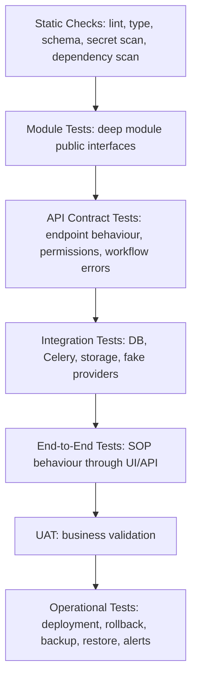

# Test Plan — SFPCL Member Credit Administration & Loan Disbursement Platform

## 1. Document Control

| Field | Value |
|---|---|
| Document name | `test-plan.md` |
| Product / system | SFPCL Member Credit Administration & Loan Disbursement Platform |
| Client | Sahyadri Farmers Producer Company Limited |
| Backend | Python + Django + Django REST Framework |
| Frontend | React |
| Database | PostgreSQL |
| Authentication | JWT |
| Supporting services | Redis, Celery, Celery Beat, object storage / DMS, email gateway, SMS gateway, SAP adapter, bank adapter, CDSL tracking adapter and future CKYC / bureau / e-sign adapters |
| Deployment model | Containerised deployment recommended |
| Test strategy style | Risk-based testing + behaviour-first TDD + integration-style tests through public interfaces |
| Source basis | Current analysis set: SOP review, client brief, user flows, functional specification, information architecture, screen specification, content specification, component specification, design system, domain model, data model, technical architecture, API contracts, auth-permissions, integrations, security/privacy, deployment/ops, implementation roadmap and codebase design |
| External testing guidance used | Matt Pocock engineering skills: TDD, tests, mocking, refactoring and codebase-design vocabulary |
| Intended audience | QA engineers, automation engineers, backend engineers, frontend engineers, product owners, business UAT users, compliance stakeholders, DevOps, support and implementation teams |
| Status | New detailed draft for implementation planning |

---

## 2. Purpose

This document defines the detailed test plan for the SFPCL Member Credit Administration & Loan Disbursement Platform.

It replaces and expands the earlier test plan by incorporating the current full analysis and a behaviour-first TDD approach inspired by Matt Pocock’s testing guidance:

- Tests should verify **observable behaviour through public interfaces**, not implementation details.
- Good tests should read like specifications.
- Tests should exercise real code paths wherever practical.
- Internal collaborators should not be mocked simply because they are convenient to mock.
- Mocking should happen at system boundaries such as email, SMS, SAP, bank, object storage, CDSL, CKYC, bureau and e-sign providers.
- Development should follow vertical tracer bullets: **one failing test → one implementation → repeat**, rather than writing a large batch of speculative tests before implementing.
- Refactoring should happen only after tests are green.
- Deep modules should be tested through their public interfaces so tests survive refactors.

The plan covers:

1. Testing philosophy and TDD operating model.
2. Test levels and test types.
3. Test environments and data.
4. Backend test strategy.
5. Frontend test strategy.
6. API contract testing.
7. Behaviour-focused E2E testing.
8. Security, privacy and permission testing.
9. Integration testing.
10. Financial, legal and compliance control testing.
11. Performance and operational testing.
12. UAT planning.
13. Regression strategy.
14. Automation priorities.
15. Release readiness and production acceptance.

---

## 3. Product Context Under Test

The platform implements SFPCL’s controlled lending workflow for members and shareholders. It manages the full member credit lifecycle:

1. Initial loan request.
2. Credit assessment.
3. Credit scrutiny and approval.
4. Documentation and stamping.
5. Loan disbursement.
6. Monitoring and repayment.
7. Default handling.
8. Recovery.
9. Closure, NOC, security return and archive.
10. Statutory compliance and audit.

The system is a compliance-sensitive internal lending platform. It must prevent incorrect workflow progression, not merely support correct user paths.

The most important testing principle for this product is:

```text
Every critical workflow must be tested for both the allowed path and the blocked path.
```

For example, QA must prove both that:

- a valid loan can be approved and disbursed, and
- an invalid loan cannot bypass membership, eligibility, approval, documentation, security, SAP, bank or CFC controls.

---

## 4. Engineering Testing Philosophy

## 4.1 Behaviour Through Public Interfaces

Tests should verify what the system does, not how the system is internally implemented.

A good backend test calls a public module interface such as:

```python
result = loan_limit_calculator.calculate_for_application(
    actor=credit_manager,
    application_id=application.id,
)
```

It should assert business behaviour:

```python
assert result.final_eligible_amount == Decimal("400000.00")
assert result.exceeds_limit is False
```

It should not assert private helper calls, internal query shapes or internal method names.

A good API test calls the endpoint that real callers use:

```http
POST /api/v1/loan-applications/{id}/loan-limit-assessments/
```

It should assert response behaviour and persisted observable state.

A good frontend test renders the page and interacts with it as a user would, or tests a UI module through props and output. It should not assert internal state variable names.

## 4.2 Specification-Like Test Names

Test names should read like product specifications.

Good names:

```text
test_active_member_with_four_year_supply_can_pass_eligibility
test_loan_above_five_lakh_requires_cfo_and_two_directors
test_disbursement_cannot_be_initiated_without_sap_customer_code
test_partial_repayment_reduces_principal_before_interest
test_recovery_action_cannot_invoke_sh4_without_approved_recovery_decision
```

Poor names:

```text
test_check_eligibility_function
test_view_calls_service
test_status_changes
test_component_renders
test_mock_called_once
```

## 4.3 Public Module Interfaces as Test Surfaces

The codebase design identifies deep modules such as:

- Permission Engine.
- Object Access.
- Sensitive Data Access.
- Active Member Status.
- Eligibility Assessment.
- Loan Limit Calculator.
- Appraisal Workflow.
- Approval Case Engine.
- Document Checklist.
- Security Package.
- SAP Customer Profile.
- Disbursement Readiness.
- Disbursement Workflow.
- Repayment Allocator.
- Interest Engine.
- DPD Monitoring.
- Default Workflow.
- Recovery Workflow.
- Loan Closure.
- Compliance Calculators.
- Report Export.

Tests should cross the same seam as callers.

For example:

| Module | Test Surface |
|---|---|
| Loan Limit Calculator | `calculate_for_application()` |
| Approval Case Engine | `create_for_application()`, `record_action()` |
| Document Checklist | `refresh_for_application()`, `approve()`, `readiness()` |
| Disbursement Workflow | `initiate()`, `authorise()`, `mark_transfer_successful()` |
| Repayment Allocator | `allocate()` |
| Interest Engine | `generate_invoice()`, `create_monthly_accrual()`, `capitalise_unpaid_interest()` |
| Recovery Workflow | `create_non_payment_note()`, `submit_for_recovery_approval()`, `initiate_recovery_action()` |

## 4.4 TDD Cycle for Feature Development

Each feature should be built with a vertical TDD loop:

```text
1. Choose one behaviour.
2. Write one failing test.
3. Implement the minimum code needed.
4. Make the test pass.
5. Add the next behaviour.
6. Repeat.
7. Refactor only after the tests are green.
```

This is not a command to write every test before writing any code. Large horizontal test batches create speculative and brittle tests. Instead, the team should use tracer bullets.

## 4.5 Tracer Bullet Definition

A tracer bullet is the first thin, working vertical path through the system.

Example for disbursement:

```text
RED:
  Test that a ready loan can be initiated for disbursement by Senior Manager Finance.

GREEN:
  Implement minimal readiness pass + initiation path.

NEXT RED:
  Test that missing SAP customer code blocks disbursement.

NEXT GREEN:
  Add SAP readiness check.

NEXT RED:
  Test that CFC authorisation is required before transfer success.

NEXT GREEN:
  Add CFC authorisation gate.
```

The tracer bullet proves the seam and interface are correct before edge cases are added.

## 4.6 Refactor Discipline

Refactor only when tests are green.

After each vertical slice, reviewers should look for:

- Duplication.
- Long methods.
- Shallow pass-through modules.
- Logic in views/pages that belongs in deep modules.
- Primitive obsession around money, dates, IDs and statuses.
- Missing test seams.
- Over-mocking.
- Over-specific assertions.

## 4.7 Mocking Philosophy

Mock at true system boundaries.

Mock or fake:

- SAP adapter.
- Bank adapter.
- Email provider.
- SMS provider.
- Object storage provider.
- CDSL / DP adapter.
- CKYC provider.
- Credit bureau provider.
- E-sign provider.
- Time/date source where deterministic tests need it.
- Random/ID generation where deterministic tests need it.

Do not mock:

- Your own deep modules when testing higher-level behaviour.
- Internal collaborators just to assert call counts.
- Private methods.
- Django models in normal service tests when a test DB is available.
- The approval engine when testing a full sanction journey.
- The repayment allocator when testing full repayment behaviour.

Use dependency injection at adapter seams so tests can inject fakes.

## 4.8 Test the Contract, Not the Shape of the Code

A test should survive refactors if behaviour does not change.

A test that fails because an internal method was renamed is probably testing implementation details.

A test that fails because a user can now bypass disbursement readiness is a valuable test.

---

# 5. Test Objectives

## 5.1 Primary Objectives

| Objective | Description |
|---|---|
| Validate SOP conformance | Ensure the platform implements the six-stage SOP and extended lifecycle controls. |
| Validate member-only lending | Ensure loans cannot be initiated for non-members or ineligible members. |
| Validate eligibility and active member rules | Ensure individual and FPC active member conditions, relaxations and defaults are checked. |
| Validate loan limit calculation | Ensure shareholding-based and land-based limits are calculated and lower-of-two rule is applied. |
| Validate approval governance | Ensure CFO/Director approvals match amount, exception and conflict-of-interest requirements. |
| Validate documentation and security gates | Ensure all legal documents, signatures, stamp duty, notarisation and security instruments block disbursement until complete. |
| Validate disbursement controls | Ensure SAP code, readiness, Senior Manager initiation, CFC authorisation, UTR and bank evidence are enforced. |
| Validate repayment correctness | Ensure direct and subsidiary repayments are captured, deduplicated, allocated principal-first and reconciled. |
| Validate interest processing | Ensure invoices, monthly accruals and after-30-April capitalisation are correct and idempotent. |
| Validate monitoring and default | Ensure DPD, reminders, grace, extension, non-payment and recovery workflows behave correctly. |
| Validate closure | Ensure loans close only after full settlement and generate NOC, security return and archive evidence. |
| Validate compliance | Ensure Section 186, NBFC test, KYC/re-KYC, stamp duty, money-lending review, grievance and audit controls are testable. |
| Validate security and privacy | Ensure JWT, RBAC, object access, masking, reveal audit, restricted document download and export controls. |
| Validate operational readiness | Ensure deployment, migrations, background jobs, monitoring, backup/restore and runbooks work. |

## 5.2 Non-Objectives

| Non-Objective | Explanation |
|---|---|
| Legal opinion validation | QA validates implemented controls, not the legal sufficiency of statutes or templates. |
| SAP configuration certification | QA validates platform-side SAP workflow, not SAP master setup unless direct integration is added. |
| Bank portal certification | QA validates platform disbursement tracking, not RBL portal internals unless API integration is added. |
| Physical custody inspection | QA validates digital custody records, not actual physical vault/cabinet conditions. |
| Business credit judgement | QA validates required appraisal fields and workflows, not whether a credit decision is commercially correct. |

---

# 6. Scope Under Test

## 6.1 In-Scope Functional Areas

| Area | Included |
|---|---|
| Authentication | Login, refresh, logout, reset, inactive user block |
| User and role management | Roles, permissions, teams, approval authority |
| Member master | Individual and FPC member profiles |
| Nominee and witness | Adult nominee, witness shareholder validation |
| KYC | PAN, Aadhaar, CKYC consent, documents, re-KYC |
| Shareholding | Physical and demat shares, folio, share certificates |
| Land and crop | 7/12 extract, land area, crop plan |
| Loan application | Reference number, application form, documents |
| Completeness | Completeness check, deficiencies and resubmission |
| Rejection | Rejection Note and communication |
| Eligibility | Active member, defaults, purpose, docs and terms |
| Loan limit | Shareholding-based, land-based and final eligible amount |
| Appraisal | Appraisal note, risk and Credit Manager review |
| Approval | Approval matrix, sanction, exceptions and conflicts |
| Documentation | Templates, generated docs, signatures, stamp, notary |
| Security package | PoA, SH-4, CDSL pledge, blank cheque, cancelled cheque |
| SAP workflow | SAP request, Excel, customer code, reuse |
| Disbursement | Readiness, initiation, CFC, UTR, advice |
| Loan account | Account creation, balances, status history |
| Repayment | Direct and subsidiary repayment |
| Allocation | Principal-first allocation |
| Bank statements | Upload, parse/match, reconciliation |
| Interest | Invoice, accrual, capitalisation |
| Monitoring | DPD, reminders, quarterly MIS |
| Default | Missed repayment, grace and assessment |
| Recovery | Extension, non-payment note, approval and action |
| Closure | Full repayment, NOC, security return, archive |
| Compliance | Section 186, NBFC, KYC, stamp, money-lending, grievance |
| Reports | Registers, MIS, exports and audit explorer |
| Communications | Email, SMS, letters and delivery status |
| Audit | Audit logs and workflow events |
| Integrations | Manual/fake adapters and future API seams |
| Deployment ops | CI/CD, health checks, jobs, backups and monitoring |

## 6.2 Out of Scope Unless Confirmed

| Item | Reason |
|---|---|
| Borrower self-service portal | Future enhancement unless included in MVP |
| Real-time SAP API | MVP likely manual/Excel |
| Real-time bank payment API | MVP likely manual bank portal |
| CKYC API | Provider and legal setup required |
| Credit bureau API | Policy not final |
| E-sign/e-stamp | Legal and process confirmation required |
| CDSL API | Dependent on DP/CDSL access |
| Mobile app | Not part of current MVP |
| Advanced BI warehouse | Future enhancement |
| AI-based document extraction | Not needed for MVP controls |

---

# 7. Test Strategy Overview

## 7.1 Test Pyramid and Risk Overlay



## 7.2 Test Level Definitions

| Level | Purpose | Primary Test Surface |
|---|---|---|
| Static checks | Prevent simple code, type, schema and security mistakes | Repository code |
| Module tests | Validate deep module behaviour | Public module interface |
| API tests | Validate external contract used by frontend | REST endpoints |
| Frontend component tests | Validate shared UI and feature UI behaviour | React component props/user interactions |
| Frontend page tests | Validate page behaviour with mocked API responses | Public page UI |
| Integration tests | Validate module interactions with DB, workers and provider fakes | Public interfaces + test infrastructure |
| E2E tests | Validate real user workflows | Browser or API-driven workflow |
| Security tests | Validate auth, RBAC, object access, masking, audit and injection controls | API + UI |
| Performance tests | Validate responsiveness and batch jobs | API, DB, workers |
| Operational tests | Validate deployment and recovery | Environments and runbooks |
| UAT | Validate business acceptance | User scripts |

## 7.3 Risk-Based Priority

| Priority | Must Cover |
|---|---|
| P0 | Auth, RBAC, sensitive data, eligibility, loan limit, approval matrix, documentation gates, disbursement, repayment allocation, interest capitalisation, recovery gates |
| P1 | KYC/re-KYC, security custody, SAP request, CDSL, default workflow, closure, NOC, compliance trackers |
| P2 | Reports, exports, notifications, dashboards, bank statement matching, operational jobs |
| P3 | Cosmetic UI, advanced filters, future integrations, enhancement-only flows |

---

# 8. TDD Operating Model for the Project

## 8.1 Story-Level TDD Workflow

Each implementation story should follow this flow:

```text
1. Read relevant CONTEXT.md, ADR and specification section.
2. Identify the public module interface or API endpoint.
3. List observable behaviours, not implementation steps.
4. Pick the first tracer-bullet behaviour.
5. Write one failing test.
6. Implement the minimum code.
7. Make the test pass.
8. Add the next behaviour.
9. Refactor after green.
10. Commit with test evidence.
```

## 8.2 Behaviour List Template

Before coding a story, write a short behaviour list.

Example for `DisbursementWorkflow.initiate()`:

```markdown
### Behaviours to test

1. Senior Manager Finance can initiate disbursement when all readiness checks pass.
2. Credit Manager cannot initiate disbursement.
3. Disbursement cannot be initiated without SAP customer code.
4. Disbursement cannot be initiated if security package is incomplete.
5. Disbursement amount cannot exceed sanctioned amount.
6. Reusing same idempotency key returns the original initiation result.
```

## 8.3 One-Test-At-A-Time Rule

Do not write all six tests before implementation.

Preferred cycle:

```text
RED 1 -> GREEN 1
RED 2 -> GREEN 2
RED 3 -> GREEN 3
...
REFACTOR when all are green
```

## 8.4 Done for a TDD Cycle

A cycle is done when:

- Test describes observable behaviour.
- Test crosses public interface.
- Test fails for the right reason before implementation.
- Minimal implementation makes it pass.
- No speculative feature was added.
- Existing tests remain green.
- Refactor, if any, happened after green.

## 8.5 TDD Exceptions

Not every artefact needs strict red-green-refactor.

Acceptable exceptions:

| Work Type | Test Approach |
|---|---|
| Pure UI layout / visual polish | Component snapshot or visual review |
| Basic CRUD admin screen | API and permission tests may be enough |
| One-off data migration | Dry-run validation and reconciliation tests |
| Config-only change | Regression and configuration snapshot test |
| Prototype spike | Time-boxed, followed by tested implementation |
| Deployment YAML | Smoke and operational tests |

---

# 9. Mocking and Fake Strategy

## 9.1 What to Mock or Fake

| Boundary | Test Double |
|---|---|
| SAP | Fake SAP adapter |
| Bank / RBL | Fake/manual bank adapter |
| Email | In-memory email adapter |
| SMS | In-memory SMS adapter |
| Object storage | Local/in-memory storage adapter |
| CDSL / DP | Fake/manual CDSL adapter |
| CKYC | Fake CKYC adapter |
| Credit bureau | Fake bureau adapter |
| E-sign | Fake e-sign adapter |
| Time/date | Frozen clock |
| Random/ID generation | Deterministic generator where needed |

## 9.2 What Not to Mock

| Do Not Mock | Reason |
|---|---|
| Loan Limit Calculator when testing eligibility-to-approval flow | It is owned code and part of behaviour |
| Approval Case Engine when testing sanction journey | It is the behaviour under test |
| Repayment Allocator when testing repayment posting | Core financial behaviour |
| Django ORM in service tests | Prefer test database for real constraints |
| Internal helper functions | Tests become implementation-coupled |
| View-to-module call counts | Tests should assert outcome, not wiring |
| Private methods | Not public interface |
| React internal state | Assert visible UI behaviour |

## 9.3 Adapter Test Rule

At external seams, test both:

1. The domain module with a fake adapter.
2. The adapter contract separately with mocked external provider responses.

Example:

- `DisbursementWorkflow` is tested with `FakeBankAdapter`.
- `RblBankAdapter` is tested against mocked bank API responses if API integration is added.

---

# 10. Test Environments

## 10.1 Environment Matrix

| Environment | Purpose | Data | Integrations |
|---|---|---|---|
| Local | Developer TDD and debugging | Synthetic | Fakes/mocks |
| Dev | Shared integration | Synthetic | Fakes/sandbox |
| QA | System testing and regression | Synthetic curated data | Fakes/sandbox |
| UAT | Business acceptance | Client-approved test data | Manual/sandbox |
| Staging | Production-like release validation | Sanitised or controlled data | Production-like non-live |
| Production | Live system | Live sensitive data | Live/manual production integrations |

## 10.2 QA Environment Requirements

| Component | Requirement |
|---|---|
| Backend | Latest QA build |
| Frontend | Matching QA build |
| PostgreSQL | Seeded with standard test packs |
| Redis | Available |
| Celery Worker | Running |
| Celery Beat | Running |
| Object storage | Test bucket/folder |
| Email | Test mailbox or fake provider |
| SMS | Fake provider or approved test gateway |
| SAP | Manual/fake mode |
| Bank | Manual/fake mode |
| CDSL | Manual/fake mode |
| Logs | Accessible to QA/engineering |
| Feature flags | Documented |
| Test users | Role-specific users seeded |

---

# 11. Test Data Strategy

## 11.1 Data Principles

| Principle | Requirement |
|---|---|
| Synthetic by default | QA and local should not use live borrower data. |
| Deterministic | Test data should be repeatable. |
| Role-complete | Each role must have a test account. |
| Edge-case rich | Include threshold, missing documents, defaults and conflicts. |
| Sensitive-safe | Use fake but format-valid PAN/Aadhaar/bank values. |
| Resettable | Test suites can reset or recreate data. |
| Audit-aware | Tests should not rely on editing audit logs. |
| Migration-ready | Migration test packs should use batch IDs. |

## 11.2 Required Test Users

| User | Role |
|---|---|
| `field.officer.qa` | Field Officer |
| `deputy.finance.qa` | Deputy Manager – Finance |
| `credit.manager.qa` | Credit Manager |
| `compliance.qa` | Compliance Team Member |
| `company.secretary.qa` | Company Secretary |
| `senior.finance.qa` | Senior Manager – Finance |
| `cfc.qa` | Chief Financial Controller |
| `cfo.qa` | CFO |
| `director1.qa` | Director |
| `director2.qa` | Director |
| `accounts.qa` | Accounts Head |
| `sales.qa` | Sales Team |
| `auditor.qa` | Internal Auditor |
| `admin.qa` | System Administrator |
| `management.qa` | Management Viewer |
| `borrower.qa` | Future borrower portal user if enabled |

## 11.3 Required Member Test Records

| Test Member | Purpose |
|---|---|
| Active individual farmer with physical shares | Standard SH-4 path |
| Active individual farmer with demat shares | CDSL pledge path |
| Active FPC / Producer Institution | Institutional borrower path |
| New member eligible under one-year relaxation | Active member relaxation |
| Individual eligible through service/employment route | Relaxation route |
| Inactive individual member | Eligibility failure |
| Inactive FPC member | Eligibility failure |
| Non-member applicant | Member-only block |
| Member with existing default | Eligibility/default block |
| Member with outstanding loan and SAP code | SAP reuse |
| Director borrower | Conflict and general meeting approval |
| Director relative borrower | Conflict workflow |
| Member with signature mismatch | Bank Verification Letter |
| Member with incomplete nominee KYC | Deficiency |
| Member with physical shares but missing SH-4 | Security blocker |
| Member with demat shares but no CDSL PSN | Security blocker |
| Member with share limit below land limit | Lower-of-two path |
| Member with land limit below share limit | Lower-of-two path |
| Member with requested amount above eligible limit | Exception path |

## 11.4 Financial Test Values

| Case | Value |
|---|---|
| Approval below threshold | ₹4,99,999 |
| Approval exactly threshold | ₹5,00,000 |
| Approval above threshold | ₹5,00,001 |
| Current per-acre cap | ₹20,000 per acre |
| Example per-share cap | ₹200 per share |
| Short-term tenure | 1 year |
| Maximum long-term tenure | 7 years |
| Grace period | 3 months |
| Non-intentional extension | 1 year |
| Re-KYC cycle | 2 years |
| Loan archive retention | At least 8 years |
| Interest capitalisation date | After 30 April |

## 11.5 Document Test Pack

| Document | Required For |
|---|---|
| Borrower PAN | KYC |
| Borrower Aadhaar | KYC |
| Nominee PAN | KYC |
| Nominee Aadhaar | KYC |
| Witness PAN | Documentation |
| Witness Aadhaar | Documentation |
| Share certificate copy | Loan limit/security |
| 7/12 extract | Land-based limit |
| Crop plan | Purpose/eligibility |
| Six-month bank statement | Credit assessment |
| Cancelled cheque | Bank verification |
| Blank-dated cheque evidence | Security |
| Bank Verification Letter | Signature mismatch |
| Power of Attorney | Security/legal |
| Tri-party Agreement | Subsidiary repayment |
| SH-4 | Physical share security |
| CDSL PRF evidence | Demat pledge |
| CDSL PSN evidence | Demat pledge |
| Term Sheet | Sanction docs |
| Loan Agreement | Legal docs |
| SAP request Excel | SAP workflow |
| SAP confirmation evidence | SAP workflow |
| Bank transfer evidence | Disbursement |
| Interest invoice | Interest |
| Extension Note | Default |
| Non-Payment Note | Recovery |
| Recovery approval evidence | Recovery |
| NOC | Closure |
| Security return acknowledgement | Closure |
| Compliance evidence | Compliance |

---

# 12. Static Checks and Build Validation

## 12.1 Backend Static Checks

| Test ID | Check | Expected Result |
|---|---|---|
| STATIC-BE-001 | Python formatting | Pass |
| STATIC-BE-002 | Python linting | No blocking issues |
| STATIC-BE-003 | Type checking for typed modules | Pass |
| STATIC-BE-004 | Django migration check | No missing migrations |
| STATIC-BE-005 | Security dependency scan | No unresolved critical vulnerabilities |
| STATIC-BE-006 | Secret scan | No secrets |
| STATIC-BE-007 | Production settings check | `DEBUG=False`, secure settings |
| STATIC-BE-008 | Import check | Django app imports successfully |
| STATIC-BE-009 | OpenAPI schema generation | Schema generated |
| STATIC-BE-010 | Unit test suite | Pass |

## 12.2 Frontend Static Checks

| Test ID | Check | Expected Result |
|---|---|---|
| STATIC-FE-001 | TypeScript build | Pass |
| STATIC-FE-002 | ESLint | No blocking issues |
| STATIC-FE-003 | Formatting | Pass |
| STATIC-FE-004 | Dependency scan | No unresolved critical vulnerabilities |
| STATIC-FE-005 | Secret scan | No secrets |
| STATIC-FE-006 | Production build | Pass |
| STATIC-FE-007 | Route import check | All routes load |
| STATIC-FE-008 | Component test suite | Pass |
| STATIC-FE-009 | Accessibility baseline | No critical violations |
| STATIC-FE-010 | Bundle size threshold | Within agreed threshold |

---

# 13. Backend Module Test Plan

## 13.1 Permission Engine Tests

| Test ID | Behaviour | Expected Result |
|---|---|---|
| MOD-RBAC-001 | Active user with permission can perform action | Allowed |
| MOD-RBAC-002 | User without permission performs action | Denied |
| MOD-RBAC-003 | Inactive user performs action | Denied |
| MOD-RBAC-004 | Suspended user performs action | Denied |
| MOD-RBAC-005 | Credit Manager attempts CFC authorisation | Denied |
| MOD-RBAC-006 | CFC attempts appraisal edit | Denied |
| MOD-RBAC-007 | Auditor attempts operational edit | Denied |
| MOD-RBAC-008 | Admin without business role attempts sanction approval | Denied |
| MOD-RBAC-009 | Available actions reflect workflow state | Correct actions |
| MOD-RBAC-010 | Role change invalidates old permission behaviour | Old access denied |

## 13.2 Object Access Tests

| Test ID | Behaviour | Expected Result |
|---|---|---|
| MOD-OBJ-001 | Field Officer views assigned application | Allowed |
| MOD-OBJ-002 | Field Officer views unrelated application | Denied |
| MOD-OBJ-003 | Director views assigned approval case | Allowed |
| MOD-OBJ-004 | Director views unassigned case | Denied |
| MOD-OBJ-005 | Auditor views loan read-only | Allowed |
| MOD-OBJ-006 | Compliance user sees documentation queue | Allowed |
| MOD-OBJ-007 | Compliance user edits appraisal | Denied |
| MOD-OBJ-008 | Restricted document access requires document permission | Enforced |
| MOD-OBJ-009 | List query returns only scoped records | Correct filtering |
| MOD-OBJ-010 | Future borrower user sees only own loan | Enforced if portal enabled |

## 13.3 Sensitive Data Module Tests

| Test ID | Behaviour | Expected Result |
|---|---|---|
| MOD-SENS-001 | PAN is masked by default | Masked |
| MOD-SENS-002 | Aadhaar is masked by default | Last 4 only |
| MOD-SENS-003 | Bank account is masked | Last 4 only |
| MOD-SENS-004 | Cheque number hidden/masked | Hidden/masked |
| MOD-SENS-005 | Reveal PAN with permission and reason | Full value + audit |
| MOD-SENS-006 | Reveal Aadhaar without permission | Denied |
| MOD-SENS-007 | Reveal without reason | Denied |
| MOD-SENS-008 | Sensitive reveal logs actor, reason and entity | Audit exists |
| MOD-SENS-009 | Sensitive values redacted in audit | No raw values |
| MOD-SENS-010 | Repeated reveal rate-limited or flagged | Alert/log |

## 13.4 Document Storage Tests

| Test ID | Behaviour | Expected Result |
|---|---|---|
| MOD-DOCS-001 | Upload valid PDF | Stored with metadata |
| MOD-DOCS-002 | Upload unsupported file type | Rejected |
| MOD-DOCS-003 | Upload oversized file | Rejected |
| MOD-DOCS-004 | Download restricted file with permission | Allowed + audit |
| MOD-DOCS-005 | Download restricted file without permission | Denied |
| MOD-DOCS-006 | Signed URL expires | Access denied |
| MOD-DOCS-007 | File checksum stored | Checksum present |
| MOD-DOCS-008 | Missing storage object | Error and admin alert |
| MOD-DOCS-009 | Archive file | Archive metadata recorded |
| MOD-DOCS-010 | Delete active loan file | Blocked |

## 13.5 Active Member Status Tests

| Test ID | Behaviour | Expected Result |
|---|---|---|
| MOD-ACTIVE-001 | Individual supplied produce for four financial years | Active |
| MOD-ACTIVE-002 | Individual supplied produce for one year under relaxation | Active under relaxation |
| MOD-ACTIVE-003 | Individual provided services/employment for three years | Active under relaxation |
| MOD-ACTIVE-004 | Individual lacks supply/service criteria | Inactive |
| MOD-ACTIVE-005 | FPC supplied produce for four financial years | Active |
| MOD-ACTIVE-006 | FPC supplied produce for one year under relaxation | Active under relaxation |
| MOD-ACTIVE-007 | Active status as-of previous financial year | Correct |
| MOD-ACTIVE-008 | Manual verification with reason | Audit logged |
| MOD-ACTIVE-009 | Override without permission | Denied |

## 13.6 Eligibility Assessment Tests

| Test ID | Behaviour | Expected Result |
|---|---|---|
| MOD-ELIG-001 | Active member with all docs and no default | Eligible |
| MOD-ELIG-002 | Non-member applicant | Ineligible |
| MOD-ELIG-003 | Inactive member | Ineligible |
| MOD-ELIG-004 | Existing default | Ineligible |
| MOD-ELIG-005 | Missing land document | Ineligible/incomplete |
| MOD-ELIG-006 | Missing KYC | Ineligible/incomplete |
| MOD-ELIG-007 | Missing crop plan | Ineligible/incomplete |
| MOD-ELIG-008 | Non-agriculture purpose | Ineligible |
| MOD-ELIG-009 | Terms not accepted | Ineligible |
| MOD-ELIG-010 | Override requires reason and permission | Enforced |

## 13.7 Loan Limit Calculator Tests

| Test ID | Behaviour | Expected Result |
|---|---|---|
| MOD-LIMIT-001 | Shareholding-based limit calculated from configured rule | Correct |
| MOD-LIMIT-002 | Land-based limit calculated from acreage and scale of finance | Correct |
| MOD-LIMIT-003 | Final eligible amount is lower of share and land limits | Correct |
| MOD-LIMIT-004 | Requested amount below eligible amount | No exception |
| MOD-LIMIT-005 | Requested amount equals eligible amount | No exception |
| MOD-LIMIT-006 | Requested amount exceeds eligible amount | Exception required |
| MOD-LIMIT-007 | Missing share valuation config | Calculation blocked |
| MOD-LIMIT-008 | Missing land area | Land limit zero or blocked per policy |
| MOD-LIMIT-009 | Policy version is snapshotted | Snapshot stored |
| MOD-LIMIT-010 | Later policy change does not alter old assessment | Historical integrity |
| MOD-LIMIT-011 | 30% vs 10% ambiguity is represented by config/warning | Visible warning until resolved |
| MOD-LIMIT-012 | Current ₹200/share example works when configured | Correct |

## 13.8 Appraisal Workflow Tests

| Test ID | Behaviour | Expected Result |
|---|---|---|
| MOD-APPRAISAL-001 | Deputy Manager creates appraisal | Draft created |
| MOD-APPRAISAL-002 | Appraisal before eligibility | Blocked |
| MOD-APPRAISAL-003 | Submit appraisal for review | Status review pending |
| MOD-APPRAISAL-004 | Credit Manager approves review | Reviewed |
| MOD-APPRAISAL-005 | Credit Manager returns review | Returned with reason |
| MOD-APPRAISAL-006 | Submit to sanction before review | Blocked |
| MOD-APPRAISAL-007 | Maker approves own review where prohibited | Blocked |
| MOD-APPRAISAL-008 | TAT tracking records due/overdue | Correct |
| MOD-APPRAISAL-009 | Appraisal version locked after sanction submission | Locked |

## 13.9 Approval Case Engine Tests

| Test ID | Behaviour | Expected Result |
|---|---|---|
| MOD-APPROVAL-001 | Amount below ₹5 lakh requires CFO + one Director | Correct |
| MOD-APPROVAL-002 | Amount exactly ₹5 lakh requires CFO + one Director | Correct |
| MOD-APPROVAL-003 | Amount above ₹5 lakh requires CFO + two Directors | Correct |
| MOD-APPROVAL-004 | Amount exceeding eligible limit creates exception route | CFO + two Directors + reason |
| MOD-APPROVAL-005 | CFO approves assigned case | Action recorded |
| MOD-APPROVAL-006 | Director approves assigned case | Action recorded |
| MOD-APPROVAL-007 | Unassigned Director approval | Denied |
| MOD-APPROVAL-008 | Conflicted Director approval | Denied |
| MOD-APPROVAL-009 | Approval incomplete after CFO only | Still pending |
| MOD-APPROVAL-010 | Approval complete after all required approvers | Sanction decision created |
| MOD-APPROVAL-011 | Rejection requires reason | Enforced |
| MOD-APPROVAL-012 | Approval action immutable | Cannot edit/delete |
| MOD-APPROVAL-013 | Director/relative case requires general meeting evidence | Enforced |
| MOD-APPROVAL-014 | Return for clarification reopens Credit queue | Correct |

## 13.10 Document Checklist Tests

| Test ID | Behaviour | Expected Result |
|---|---|---|
| MOD-CHECKLIST-001 | Generate checklist after sanction | Checklist created |
| MOD-CHECKLIST-002 | Physical share borrower requires SH-4 | Item required |
| MOD-CHECKLIST-003 | Demat share borrower requires CDSL pledge | Item required |
| MOD-CHECKLIST-004 | Missing PoA blocks checklist | Blocked |
| MOD-CHECKLIST-005 | Missing stamp duty blocks relevant document | Blocked |
| MOD-CHECKLIST-006 | Missing notarisation blocks relevant document | Blocked |
| MOD-CHECKLIST-007 | Signature mismatch unresolved blocks checklist | Blocked |
| MOD-CHECKLIST-008 | CS approval before completion | Denied |
| MOD-CHECKLIST-009 | Credit Manager approval before CS if sequence enforced | Denied |
| MOD-CHECKLIST-010 | Sanction Committee final approval after earlier approvals | Allowed |
| MOD-CHECKLIST-011 | Senior Manager Finance signature only after disbursement | Enforced |
| MOD-CHECKLIST-012 | Readiness response includes blocker reasons | Correct |

## 13.11 Security Package Tests

| Test ID | Behaviour | Expected Result |
|---|---|---|
| MOD-SECURITY-001 | Physical shares require SH-4 | Required |
| MOD-SECURITY-002 | Demat shares require CDSL pledge | Required |
| MOD-SECURITY-003 | PoA required | Required |
| MOD-SECURITY-004 | Blank-dated cheque required | Required |
| MOD-SECURITY-005 | Cancelled cheque required | Required |
| MOD-SECURITY-006 | Witness must be shareholder | Enforced |
| MOD-SECURITY-007 | CDSL missing PSN | Not complete |
| MOD-SECURITY-008 | CDSL accepted pledge | Complete |
| MOD-SECURITY-009 | Blank cheque reveal requires permission | Enforced |
| MOD-SECURITY-010 | Custody movement audited | Audit exists |

## 13.12 SAP Customer Profile Tests

| Test ID | Behaviour | Expected Result |
|---|---|---|
| MOD-SAP-001 | SAP request can be created after sanction | Created |
| MOD-SAP-002 | SAP request before sanction | Blocked |
| MOD-SAP-003 | SAP Excel generated with required fields | Document created |
| MOD-SAP-004 | Existing SAP code reused | Reuse |
| MOD-SAP-005 | Duplicate SAP code confirmation | Blocked |
| MOD-SAP-006 | SAP confirmation evidence linked | Linked |
| MOD-SAP-007 | Missing SAP code blocks disbursement readiness | Blocked |
| MOD-SAP-008 | Sensitive SAP payload redacted in integration logs | Redacted |
| MOD-SAP-009 | Manual adapter mode works | Request waits for confirmation |
| MOD-SAP-010 | Fake adapter mode works in tests | Deterministic |

## 13.13 Disbursement Readiness Tests

| Test ID | Behaviour | Expected Result |
|---|---|---|
| MOD-READY-001 | Fully prepared loan is ready | Ready |
| MOD-READY-002 | Missing sanction | Not ready |
| MOD-READY-003 | Missing checklist approval | Not ready |
| MOD-READY-004 | Missing security package | Not ready |
| MOD-READY-005 | Missing SAP customer code | Not ready |
| MOD-READY-006 | Missing bank verification | Not ready |
| MOD-READY-007 | Signature mismatch unresolved | Not ready |
| MOD-READY-008 | Amount exceeds sanction | Not ready |
| MOD-READY-009 | Readiness includes all pass/fail checks | Correct |
| MOD-READY-010 | Exception approval can satisfy configured exception checks | Correct |

## 13.14 Disbursement Workflow Tests

| Test ID | Behaviour | Expected Result |
|---|---|---|
| MOD-DISB-001 | Senior Manager initiates ready disbursement | Initiated |
| MOD-DISB-002 | Credit Manager initiates disbursement | Denied |
| MOD-DISB-003 | Initiation before readiness | Blocked |
| MOD-DISB-004 | Duplicate idempotency key | Original result |
| MOD-DISB-005 | CFC authorises initiated transfer | Authorised |
| MOD-DISB-006 | Non-CFC authorises | Denied |
| MOD-DISB-007 | Mark success without CFC | Blocked |
| MOD-DISB-008 | Mark success without UTR | Blocked |
| MOD-DISB-009 | Duplicate UTR | Blocked |
| MOD-DISB-010 | Transfer success activates loan | Loan active |
| MOD-DISB-011 | Disbursement advice queued | Communication created |
| MOD-DISB-012 | Failure allows controlled retry/new initiation | Correct |

## 13.15 Repayment Capture and Allocation Tests

| Test ID | Behaviour | Expected Result |
|---|---|---|
| MOD-REP-001 | Direct repayment captured with UTR | Repayment created |
| MOD-REP-002 | Duplicate UTR | Blocked |
| MOD-REP-003 | Subsidiary deduction captured | Repayment created |
| MOD-REP-004 | Duplicate subsidiary deduction reference | Blocked |
| MOD-REP-005 | Negative repayment amount | Blocked |
| MOD-REP-006 | Partial repayment allocated principal-first | Correct |
| MOD-REP-007 | Repayment exceeding principal handles excess per policy | Correct |
| MOD-REP-008 | Allocation duplicate | Blocked |
| MOD-REP-009 | SAP posting reference captured | Posted status |
| MOD-REP-010 | Bank statement matched to repayment | Matched |

## 13.16 Interest Engine Tests

| Test ID | Behaviour | Expected Result |
|---|---|---|
| MOD-INT-001 | Generate annual interest invoice | Invoice created |
| MOD-INT-002 | Duplicate invoice for same period | Blocked or versioned |
| MOD-INT-003 | Create monthly accrual | Accrual created |
| MOD-INT-004 | Duplicate monthly accrual | Blocked |
| MOD-INT-005 | Unpaid interest before 30 April | Not capitalised |
| MOD-INT-006 | Unpaid interest after 30 April | Capitalisation eligible |
| MOD-INT-007 | Capitalisation increases principal | Correct |
| MOD-INT-008 | Duplicate capitalisation | Blocked |
| MOD-INT-009 | Borrower intimation queued | Communication created |
| MOD-INT-010 | Historical interest uses rate snapshot | Correct |

## 13.17 Default Workflow Tests

| Test ID | Behaviour | Expected Result |
|---|---|---|
| MOD-DEF-001 | Missed scheduled principal repayment opens default | Case opened |
| MOD-DEF-002 | Three-month grace period calculated | Correct date |
| MOD-DEF-003 | Payment during grace resolves default | Resolved |
| MOD-DEF-004 | Grace expiry requires assessment | Assessment pending |
| MOD-DEF-005 | Non-intentional reason allows one-year extension | Extension created |
| MOD-DEF-006 | Intentional reason does not auto-extend | Recovery/review path |
| MOD-DEF-007 | Extension note generated | Document created |
| MOD-DEF-008 | Extension expiry triggers non-payment note requirement | Correct |
| MOD-DEF-009 | Audit logs for default transitions | Present |

## 13.18 Recovery Workflow Tests

| Test ID | Behaviour | Expected Result |
|---|---|---|
| MOD-REC-001 | Non-Payment Note created after extension failure | Created |
| MOD-REC-002 | Non-Payment Note before required conditions | Blocked |
| MOD-REC-003 | Submit recovery approval | Approval case created |
| MOD-REC-004 | Recovery action without approved decision | Blocked |
| MOD-REC-005 | SH-4 invocation after approval | Allowed |
| MOD-REC-006 | CDSL pledge invocation after approval | Allowed |
| MOD-REC-007 | Blank cheque invocation after approval | Allowed |
| MOD-REC-008 | Recovery evidence required | Enforced |
| MOD-REC-009 | Recovery action audited | Present |
| MOD-REC-010 | Recovery approval route uses configured authority | Correct |

## 13.19 Closure Module Tests

| Test ID | Behaviour | Expected Result |
|---|---|---|
| MOD-CLOSURE-001 | Outstanding balance > 0 | Closure not ready |
| MOD-CLOSURE-002 | Outstanding balance zero | Closure ready |
| MOD-CLOSURE-003 | Close loan | Status closed |
| MOD-CLOSURE-004 | Generate NOC after closure | NOC created |
| MOD-CLOSURE-005 | Generate NOC before closure | Blocked |
| MOD-CLOSURE-006 | Return SH-4 after closure | Recorded |
| MOD-CLOSURE-007 | Return blank cheque after closure | Recorded |
| MOD-CLOSURE-008 | CDSL unpledge after closure | Recorded |
| MOD-CLOSURE-009 | Archive with 8-year retention | Retention date correct |
| MOD-CLOSURE-010 | Closed loan is read-only | Enforced |

## 13.20 Compliance Module Tests

| Test ID | Behaviour | Expected Result |
|---|---|---|
| MOD-COMP-001 | Section 186 limit calculation | Correct higher-of-two limit |
| MOD-COMP-002 | Exposure within limit | No special resolution flag |
| MOD-COMP-003 | Exposure exceeds limit | Special resolution flag |
| MOD-COMP-004 | NBFC assets >50 and income >50 | Trigger |
| MOD-COMP-005 | NBFC only one ratio >50 | Warning/no trigger |
| MOD-COMP-006 | KYC re-KYC due task | Task generated |
| MOD-COMP-007 | Stamp duty evidence missing | Compliance exception |
| MOD-COMP-008 | Money-lending annual review due | Task generated |
| MOD-COMP-009 | Grievance created and resolved | Status closed |
| MOD-COMP-010 | Compliance evidence review audited | Present |

---

# 14. API Contract Test Plan

## 14.1 API Contract Principles

API tests should verify:

- HTTP status.
- Standard response envelope.
- Request/response schema.
- Permission behaviour.
- Object access.
- Workflow blockers.
- Error codes.
- Masking.
- Audit side effects where observable.
- Idempotency behaviour.

API tests should not assert internal module call counts.

## 14.2 Standard Envelope Tests

| Test ID | Behaviour | Expected Result |
|---|---|---|
| API-ENV-001 | Successful detail response | `success=true`, `data`, `meta.request_id` |
| API-ENV-002 | Successful list response | Pagination metadata |
| API-ENV-003 | Validation failure | Standard error envelope |
| API-ENV-004 | Permission failure | 403 and standard error |
| API-ENV-005 | Workflow blocker | 409 and blocker details |
| API-ENV-006 | Missing authentication | 401 |
| API-ENV-007 | Sensitive fields masked | Masked |
| API-ENV-008 | Available actions returned | Correct actions |
| API-ENV-009 | Idempotent replay | Original result |
| API-ENV-010 | Error does not expose stack trace | Safe error |

## 14.3 Auth API Tests

| Test ID | Endpoint | Behaviour | Expected Result |
|---|---|---|---|
| API-AUTH-001 | `POST /api/v1/auth/login/` | Valid login | Tokens issued |
| API-AUTH-002 | `POST /api/v1/auth/login/` | Invalid password | 401 generic error |
| API-AUTH-003 | `POST /api/v1/auth/login/` | Inactive user | Denied |
| API-AUTH-004 | `POST /api/v1/auth/refresh/` | Valid refresh | New access token |
| API-AUTH-005 | `POST /api/v1/auth/refresh/` | Revoked token | 401 |
| API-AUTH-006 | `POST /api/v1/auth/logout/` | Logout | Refresh revoked |
| API-AUTH-007 | `GET /api/v1/auth/me/` | Authenticated | User profile and permissions |
| API-AUTH-008 | Protected endpoint | No token | 401 |
| API-AUTH-009 | Password reset | Existing user | Reset flow without user enumeration |
| API-AUTH-010 | Repeated login failure | Rate limited |

## 14.4 Member and KYC API Tests

| Test ID | Behaviour | Expected Result |
|---|---|---|
| API-MEM-001 | Create individual member | Created |
| API-MEM-002 | Create FPC member | Created |
| API-MEM-003 | Invalid PAN | Validation error |
| API-MEM-004 | Duplicate PAN | Duplicate error |
| API-MEM-005 | Retrieve member detail | Sensitive fields masked |
| API-MEM-006 | Reveal PAN with reason | Full value + audit |
| API-MEM-007 | Reveal Aadhaar without permission | 403 |
| API-MEM-008 | Add adult nominee | Success |
| API-MEM-009 | Add minor nominee | Validation error |
| API-MEM-010 | Add witness non-shareholder | Validation error |
| API-MEM-011 | Upload KYC doc | File linked |
| API-MEM-012 | Verify KYC doc | Verification status updated |
| API-MEM-013 | Calculate active status | Result returned |
| API-MEM-014 | Re-KYC due list | Correct records |

## 14.5 Loan Application API Tests

| Test ID | Behaviour | Expected Result |
|---|---|---|
| API-APP-001 | Create draft application | Reference assigned |
| API-APP-002 | Submit complete draft | Submitted |
| API-APP-003 | Submit missing required field | Validation error |
| API-APP-004 | Completeness check passes | Status advances |
| API-APP-005 | Completeness check fails | Deficiencies created |
| API-APP-006 | Resolve deficiency | Deficiency closed |
| API-APP-007 | Resubmit after deficiency | Submitted |
| API-APP-008 | Create rejection note | Note created |
| API-APP-009 | Send rejection note | Communication logged |
| API-APP-010 | Cancel draft | Cancelled |
| API-APP-011 | Cancel approved/disbursed application | Blocked |

## 14.6 Credit API Tests

| Test ID | Behaviour | Expected Result |
|---|---|---|
| API-CRD-001 | Run eligibility | Result stored |
| API-CRD-002 | Eligibility failure | Failing checks returned |
| API-CRD-003 | Override eligibility | Requires permission/reason |
| API-CRD-004 | Calculate loan limit | Result stored |
| API-CRD-005 | Exceeds limit | Exception required flag |
| API-CRD-006 | Create appraisal | Draft |
| API-CRD-007 | Submit appraisal | Review pending |
| API-CRD-008 | Credit Manager review | Reviewed |
| API-CRD-009 | Submit to sanction | Approval case created |
| API-CRD-010 | Submit without review | 409 |

## 14.7 Approval API Tests

| Test ID | Behaviour | Expected Result |
|---|---|---|
| API-APR-001 | Create approval case below threshold | CFO + one Director |
| API-APR-002 | Create approval case above threshold | CFO + two Directors |
| API-APR-003 | CFO approves | Action recorded |
| API-APR-004 | Director approves | Action recorded |
| API-APR-005 | Unassigned Director approves | 403 |
| API-APR-006 | Conflicted Director approves | 403 |
| API-APR-007 | All required approvals complete | Sanction decision created |
| API-APR-008 | Rejection with reason | Case rejected |
| API-APR-009 | Rejection without reason | Validation error |
| API-APR-010 | General meeting evidence upload | Evidence linked |

## 14.8 Documentation and Security API Tests

| Test ID | Behaviour | Expected Result |
|---|---|---|
| API-DOC-001 | Generate Term Sheet | Document created |
| API-DOC-002 | Generate Loan Agreement | Document created |
| API-DOC-003 | Record signature | Signature status |
| API-DOC-004 | Flag signature mismatch | Blocker created |
| API-DOC-005 | Resolve mismatch with bank letter | Blocker removed |
| API-DOC-006 | Record stamp duty | Stamp record |
| API-DOC-007 | Record notarisation | Notary record |
| API-DOC-008 | Complete checklist item | Item complete |
| API-DOC-009 | CS approval before complete | 409 |
| API-DOC-010 | Final checklist approval | Approved |
| API-SEC-001 | Create SH-4 | Record created |
| API-SEC-002 | Create CDSL pledge | Record created |
| API-SEC-003 | Record PSN | Status updated |
| API-SEC-004 | Reveal blank cheque without permission | 403 |
| API-SEC-005 | Custody movement | Audit event |

## 14.9 Disbursement API Tests

| Test ID | Behaviour | Expected Result |
|---|---|---|
| API-DISB-001 | Create SAP request | Request created |
| API-DISB-002 | Complete SAP request | SAP code saved |
| API-DISB-003 | Duplicate SAP code | 409 |
| API-DISB-004 | Create loan account | Account created |
| API-DISB-005 | Evaluate readiness | Checks returned |
| API-DISB-006 | Initiate when ready | Initiated |
| API-DISB-007 | Initiate when not ready | 409 |
| API-DISB-008 | CFC authorise | Authorised |
| API-DISB-009 | Mark success without CFC | 409 |
| API-DISB-010 | Mark success with UTR | Loan active |
| API-DISB-011 | Duplicate UTR | 409 |
| API-DISB-012 | Disbursement advice | Communication created |

## 14.10 Repayment, Interest and Monitoring API Tests

| Test ID | Behaviour | Expected Result |
|---|---|---|
| API-REP-001 | Direct repayment | Created |
| API-REP-002 | Subsidiary repayment | Created |
| API-REP-003 | Duplicate reference | 409 |
| API-REP-004 | Allocate repayment | Principal-first |
| API-REP-005 | Mark SAP posted | Posted |
| API-REP-006 | Upload bank statement | Lines parsed/created |
| API-REP-007 | Match statement line | Matched |
| API-INT-001 | Generate invoice | Invoice created |
| API-INT-002 | Create accrual | Accrual created |
| API-INT-003 | Capitalise unpaid interest | Principal increased |
| API-MON-001 | Calculate DPD | Buckets updated |
| API-MON-002 | Generate quarterly MIS | Report created |
| API-MON-003 | Send reminder | Communication logged |

## 14.11 Default, Recovery, Closure and Compliance API Tests

| Test ID | Behaviour | Expected Result |
|---|---|---|
| API-DEF-001 | Open default case | Case created |
| API-DEF-002 | Start grace | Grace dates set |
| API-DEF-003 | Assess non-intentional default | Assessment stored |
| API-DEF-004 | Grant extension | Extension created |
| API-REC-001 | Create non-payment note | Note created |
| API-REC-002 | Submit recovery approval | Approval case |
| API-REC-003 | Initiate recovery without approval | 409 |
| API-REC-004 | Complete recovery action | Evidence stored |
| API-CLOSE-001 | Evaluate closure readiness | Checks returned |
| API-CLOSE-002 | Close with outstanding | Blocked |
| API-CLOSE-003 | Generate NOC | NOC created |
| API-CLOSE-004 | Record security return | Recorded |
| API-CLOSE-005 | Archive | Retention date |
| API-COMP-001 | Section 186 calculation | Correct |
| API-COMP-002 | NBFC test | Correct |
| API-COMP-003 | Submit compliance evidence | Evidence linked |
| API-COMP-004 | Resolve grievance | Closed |

---

# 15. Frontend Test Plan

## 15.1 Frontend Testing Principles

Frontend tests should verify user-visible behaviour:

- Screen renders correct information.
- User can perform permitted actions.
- User cannot see or trigger forbidden actions.
- Backend blocker reasons are displayed.
- Forms validate simple fields.
- Sensitive data remains masked.
- Error states are clear.
- Loading and empty states work.

Frontend tests should not duplicate backend business rules.

For example, the frontend should not independently decide whether disbursement is ready. It should display the readiness response from the backend.

## 15.2 Shared UI Module Tests

| UI Module | Test Cases |
|---|---|
| Button | Disabled, loading, destructive, permission-disabled states |
| FormField | Required, help text, inline error, disabled |
| CurrencyInput | Indian formatting, decimals, negative rejection |
| DateInput | Display format, invalid date, timezone display |
| DataTable | Pagination, filters, sorting, empty state |
| StatusBadge | Application, approval, documentation, loan and default statuses |
| StageStepper | SOP stages, current stage, blocked stage |
| Modal | Focus trap, confirm, cancel, reason required |
| FileUpload | Progress, invalid file, upload error |
| DocumentViewer | Preview, restricted download, missing file |
| AuditTimeline | Events display in order |
| AvailableActionButton | Enabled, disabled with reason, hidden |
| SensitiveField | Masked, reveal, timeout |
| Toast/Alert | Success, warning, blocker and error variants |
| ReportExportButton | Async job, download expiry, permission denial |

## 15.3 Page-Level Tests

| Page | Key Behaviour |
|---|---|
| Login | Valid login, invalid login, inactive user |
| Dashboard | Role-specific cards and tasks |
| Member Directory | Search/filter, masked values |
| Member Profile | KYC, shareholding, land, crop and loan tabs |
| Loan Application | Required fields, nominee, purpose, documents |
| Completeness Check | Missing docs and deficiencies |
| Eligibility Assessment | Pass/fail results and explanations |
| Loan Limit Calculator | Share/land/final limit display |
| Appraisal Note | Draft, submit, review |
| Approval Workbench | Assigned cases and decisions |
| Documentation Workspace | Generate/upload documents |
| Checklist | Required items and blockers |
| Security Package | PoA, SH-4, CDSL, cheques |
| SAP Request | Generate Excel and confirm code |
| Disbursement Readiness | Pass/fail checklist |
| Payment Initiation | Amount and beneficiary verification |
| CFC Authorisation | Approve/reject |
| Loan Account 360 | Ledger, repayment, interest and status |
| Direct Repayment | Capture and allocate |
| Subsidiary Repayment | Capture and match |
| Interest Invoice | Generate and issue |
| DPD Dashboard | Buckets and filters |
| Default Case | Grace, assessment, extension |
| Recovery Action | Approval and execution |
| Closure | Readiness, NOC, security return |
| Compliance Dashboard | Control tasks and evidence |
| Reports Centre | Export permissions |
| Audit Log Explorer | Filter and view |
| Admin Settings | Users, roles and config |

## 15.4 Frontend Permission Tests

| Test ID | Behaviour | Expected Result |
|---|---|---|
| FE-PERM-001 | Field Officer sees application intake, not sanction approval | Correct menu/actions |
| FE-PERM-002 | Credit Manager sees appraisal review | Visible |
| FE-PERM-003 | Credit Manager does not see CFC authorisation | Hidden/disabled |
| FE-PERM-004 | Director sees assigned approval cases | Visible |
| FE-PERM-005 | Director does not see unassigned cases | Hidden |
| FE-PERM-006 | Auditor sees read-only views | No edit buttons |
| FE-PERM-007 | Admin sees user admin but not business approval by default | Correct |
| FE-PERM-008 | Forbidden API response shows permission message | Correct |

## 15.5 Frontend Sensitive Data Tests

| Test ID | Behaviour | Expected Result |
|---|---|---|
| FE-PII-001 | Member list PAN display | Masked |
| FE-PII-002 | Aadhaar detail display | Masked |
| FE-PII-003 | Bank account display | Last 4 only |
| FE-PII-004 | Reveal button hidden without permission | Hidden |
| FE-PII-005 | Reveal requires reason | Modal requires reason |
| FE-PII-006 | Revealed value clears after timeout | Cleared |
| FE-PII-007 | Route URL does not include sensitive data | Safe |
| FE-PII-008 | Console logs do not include sensitive data | Safe |

---

# 16. End-to-End Test Scenarios

## 16.1 E2E-001 — Standard Individual Farmer Loan with Physical Shares

### Objective

Validate the complete happy path from application to closure for an active individual farmer with physical shares.

### Actors

- Field Officer / Credit Team.
- Deputy Manager – Finance.
- Credit Manager.
- CFO.
- Director.
- Compliance Team.
- Company Secretary.
- Senior Manager – Finance.
- CFC.
- Accounts.

### Steps

1. Create or select active individual farmer member.
2. Add adult nominee.
3. Add physical shareholding.
4. Add landholding and crop plan.
5. Upload required KYC and application documents.
6. Create loan application.
7. Submit application.
8. Perform completeness check.
9. Run eligibility assessment.
10. Calculate loan limit.
11. Prepare appraisal.
12. Credit Manager reviews appraisal.
13. Submit to sanction.
14. CFO approves.
15. Director approves.
16. Sanction decision created.
17. Generate PoA, Tri-party Agreement, Term Sheet and Loan Agreement.
18. Capture witness details and KYC.
19. Record SH-4.
20. Record cancelled cheque and blank-dated cheque.
21. Record signatures, stamp duty and notarisation.
22. Complete checklist.
23. CS approves checklist.
24. Credit Manager approves checklist.
25. Sanction Committee final checklist approval.
26. Create SAP request.
27. Confirm SAP customer code.
28. Create loan account.
29. Evaluate disbursement readiness.
30. Senior Manager Finance initiates disbursement.
31. CFC authorises.
32. Enter UTR and mark successful.
33. Loan becomes active.
34. Send disbursement advice.
35. Capture direct repayment.
36. Allocate principal-first.
37. Generate interest invoice.
38. Fully repay loan.
39. Close loan.
40. Generate NOC.
41. Return SH-4 and blank cheque.
42. Archive loan file.

### Expected Result

- All required states progress correctly.
- No gate is skipped.
- Loan account becomes closed.
- NOC and archive exist.
- Audit logs exist for critical actions.

## 16.2 E2E-002 — Individual Farmer with Demat Shares and CDSL Pledge

Differences from E2E-001:

- Shareholding is demat.
- SH-4 not required.
- CDSL pledge required.
- PRF submitted.
- PSN entered.
- Pledge accepted.
- Disbursement readiness blocked until pledge created.
- Closure requires unpledge record.

## 16.3 E2E-003 — FPC / Producer Institution Borrower

Validate:

- FPC profile.
- Authorised signatory.
- Beneficial ownership if required.
- Institutional KYC.
- Active FPC status.
- FPC-specific documentation.
- Sanction approval.
- Disbursement and repayment.

## 16.4 E2E-004 — Incomplete Application Returned and Resubmitted

Validate:

1. Application missing nominee Aadhaar and bank statement.
2. Completeness check creates deficiencies.
3. Application cannot proceed to appraisal.
4. Deficiency communication created.
5. Missing documents uploaded.
6. Deficiencies resolved.
7. Application resubmitted.
8. Completeness passes.

## 16.5 E2E-005 — Eligibility Failure and Rejection

Validate:

- Inactive member or member with existing default fails eligibility.
- Credit Manager creates Rejection Note.
- Borrower communication logged.
- Application status rejected.
- Cannot move to sanction.

## 16.6 E2E-006 — Approval Below, At and Above ₹5 Lakh

Run three scenarios:

| Amount | Expected Approval |
|---:|---|
| ₹4,99,999 | CFO + one Director |
| ₹5,00,000 | CFO + one Director |
| ₹5,00,001 | CFO + two Directors |

Validate approval case requirements and blockers.

## 16.7 E2E-007 — Loan Exceeding Eligible Limit

Validate:

- Loan limit calculator flags exception.
- Exception Register entry created.
- CFO + two Directors required.
- Reason mandatory.
- Disbursement blocked unless exception approved.

## 16.8 E2E-008 — Director or Relative Borrower

Validate:

- Conflict detected.
- Conflicted approver excluded.
- General meeting approval evidence required.
- Attempted conflicted approval denied.
- Remaining approval route works.

## 16.9 E2E-009 — Signature Mismatch

Validate:

- Signature mismatch flagged.
- Checklist blocked.
- Bank Verification Letter uploaded.
- Mismatch resolved.
- Checklist proceeds.

## 16.10 E2E-010 — SAP Customer Code Reuse

Validate:

- Borrower already has outstanding loan and SAP code.
- New loan uses existing SAP code.
- No duplicate SAP customer request required unless policy says otherwise.
- Disbursement readiness passes.

## 16.11 E2E-011 — Direct Repayment

Validate:

- Active loan receives RTGS/NEFT repayment.
- UTR captured.
- Duplicate UTR blocked.
- Allocation principal-first.
- SAP posting captured.
- Outstanding reduced.

## 16.12 E2E-012 — Subsidiary Deduction Repayment

Validate:

- Tri-party agreement exists.
- Subsidiary deduction captured.
- Produce payment reference captured.
- Bank transfer reference captured.
- Bank statement line matched.
- Repayment allocated.
- SAP posting captured.
- Mismatches go to reconciliation exception.

## 16.13 E2E-013 — Interest Invoice and Capitalisation

Validate:

1. Interest invoice generated at year-end.
2. Borrower fails to pay interest by 30 April.
3. Capitalisation job identifies loan.
4. Unpaid interest added to principal.
5. Borrower intimation generated.
6. Duplicate capitalisation blocked.

## 16.14 E2E-014 — Default, Grace, Extension and Recovery

Validate:

1. Principal repayment missed.
2. Default case opened.
3. Three-month grace period starts.
4. Grace expires unpaid.
5. Non-intentional reason assessed.
6. One-year extension granted.
7. Extension expires unpaid.
8. Non-Payment Note created.
9. Recovery approval obtained.
10. SH-4/CDSL/cheque action initiated according to security type.
11. Evidence uploaded.
12. Audit logs exist.

## 16.15 E2E-015 — Closure and Security Return

Validate:

- Loan outstanding zero.
- Closure readiness passes.
- Loan closed.
- NOC generated.
- SH-4 returned if applicable.
- Blank cheque returned.
- CDSL unpledge if applicable.
- Archive created with at least eight-year retention.

## 16.16 E2E-016 — Compliance Quarterly Cycle

Validate:

- Section 186 task generated.
- CFO enters capital/reserve/exposure values.
- Limit calculated.
- Evidence uploaded.
- Review completed.
- NBFC test task generated.
- Financial assets/income ratios calculated.
- Trigger/warning status displayed.
- Audit logs exist.

## 16.17 E2E-017 — KYC/Re-KYC Cycle

Validate:

- KYC profile verified.
- Re-KYC due date calculated two years later.
- Re-KYC task generated.
- Overdue re-KYC appears in compliance dashboard.
- Updated KYC documents uploaded and verified.

## 16.18 E2E-018 — Security and Permission Negative Journey

Validate:

- Field Officer cannot approve sanction.
- Credit Manager cannot authorise disbursement.
- Director cannot approve unassigned case.
- CFC cannot edit appraisal.
- Auditor cannot edit operational record.
- User cannot reveal Aadhaar without permission.
- User cannot download restricted file without permission.

---

# 17. Workflow Gate Test Matrix

## 17.1 Origination Gates

| Gate | Blocked Condition | Expected Result |
|---|---|---|
| Application submission | Missing borrower | Blocked |
| Application submission | Nominee minor | Blocked |
| Application submission | Missing purpose | Blocked |
| Completeness pass | Required document missing | Blocked |
| Appraisal start | Incomplete application | Blocked |
| Eligibility pass | Inactive member | Blocked |
| Eligibility pass | Existing default | Blocked |
| Eligibility pass | Non-agriculture purpose | Blocked |
| Sanction submission | Appraisal not reviewed | Blocked |

## 17.2 Approval Gates

| Gate | Blocked Condition | Expected Result |
|---|---|---|
| CFO approval | User not CFO | Blocked |
| Director approval | User not assigned Director | Blocked |
| Conflicted approval | Borrower is approver/relative | Blocked |
| Sanction complete | Required approver missing | Blocked |
| Exception approval | Reason missing | Blocked |
| Special case approval | General meeting evidence missing | Blocked |

## 17.3 Documentation Gates

| Gate | Blocked Condition | Expected Result |
|---|---|---|
| Checklist approval | Missing PoA | Blocked |
| Checklist approval | Missing Loan Agreement | Blocked |
| Checklist approval | Missing Term Sheet | Blocked |
| Checklist approval | Stamp duty missing | Blocked |
| Checklist approval | Notarisation missing | Blocked |
| Checklist approval | Signature mismatch unresolved | Blocked |
| Checklist approval | Witness not shareholder | Blocked |
| Checklist approval | Security package incomplete | Blocked |

## 17.4 Disbursement Gates

| Gate | Blocked Condition | Expected Result |
|---|---|---|
| Readiness | Sanction missing | Blocked |
| Readiness | Checklist incomplete | Blocked |
| Readiness | Security incomplete | Blocked |
| Readiness | SAP code missing | Blocked |
| Readiness | Bank account not verified | Blocked |
| Initiation | User not Senior Manager Finance | Blocked |
| Authorisation | User not CFC | Blocked |
| Success | UTR missing | Blocked |
| Success | Duplicate UTR | Blocked |
| Success | CFC not authorised | Blocked |

## 17.5 Servicing, Default and Closure Gates

| Gate | Blocked Condition | Expected Result |
|---|---|---|
| Repayment capture | Duplicate reference | Blocked |
| Allocation | Already allocated | Blocked |
| Accrual | Duplicate month | Blocked |
| Capitalisation | Before 30 April | Blocked |
| Capitalisation | Duplicate FY | Blocked |
| Recovery | No recovery approval | Blocked |
| Security invocation | Wrong security status | Blocked |
| Closure | Outstanding balance | Blocked |
| NOC | Loan not closed | Blocked |
| Archive | Security return pending if required | Blocked/warning per policy |

---

# 18. Security and Privacy Test Plan

## 18.1 Authentication Tests

| Test ID | Behaviour | Expected Result |
|---|---|---|
| SEC-AUTH-001 | Valid login | Success |
| SEC-AUTH-002 | Invalid password | Generic failure |
| SEC-AUTH-003 | Unknown email | Generic failure |
| SEC-AUTH-004 | Inactive user | Denied |
| SEC-AUTH-005 | Suspended user | Denied |
| SEC-AUTH-006 | Access token expiry | 401/refresh |
| SEC-AUTH-007 | Refresh token rotation | Works |
| SEC-AUTH-008 | Logout revokes refresh | Old refresh invalid |
| SEC-AUTH-009 | Password reset revokes sessions | Old sessions invalid |
| SEC-AUTH-010 | Repeated failed login | Rate limited/locked |

## 18.2 Authorisation Tests

| Test ID | Behaviour | Expected Result |
|---|---|---|
| SEC-AUTHZ-001 | Frontend hidden button forced via API | Backend denies |
| SEC-AUTHZ-002 | User opens unauthorised route | Denied/redirected |
| SEC-AUTHZ-003 | User calls unauthorised endpoint | 403 |
| SEC-AUTHZ-004 | User accesses out-of-scope object | 403 |
| SEC-AUTHZ-005 | Conflicted approver approves | 403 |
| SEC-AUTHZ-006 | Maker checks own work where prohibited | 403 |
| SEC-AUTHZ-007 | Admin performs business action without business role | 403 |

## 18.3 Sensitive Data Tests

| Test ID | Behaviour | Expected Result |
|---|---|---|
| SEC-PII-001 | PAN in API list response | Masked |
| SEC-PII-002 | Aadhaar in API detail response | Masked |
| SEC-PII-003 | Bank account in UI | Last 4 only |
| SEC-PII-004 | Cheque number in UI | Hidden/masked |
| SEC-PII-005 | Reveal with permission/reason | Full value + audit |
| SEC-PII-006 | Reveal without reason | Denied |
| SEC-PII-007 | KYC download without permission | Denied |
| SEC-PII-008 | Restricted download with permission | Allowed + audit |
| SEC-PII-009 | Export sensitive data without permission | Masked |
| SEC-PII-010 | SMS template includes Aadhaar | Blocked |
| SEC-PII-011 | Logs contain raw Aadhaar/PAN | Fails if present |
| SEC-PII-012 | URL includes sensitive values | Fails if present |

## 18.4 Web Security Tests

| Test ID | Behaviour | Expected Result |
|---|---|---|
| SEC-WEB-001 | SQL injection attempt in search | Safe response |
| SEC-WEB-002 | XSS in borrower name | Escaped |
| SEC-WEB-003 | XSS in comments | Escaped/sanitised |
| SEC-WEB-004 | Unsafe file name upload | Sanitised |
| SEC-WEB-005 | Script file upload | Rejected |
| SEC-WEB-006 | CORS from unapproved origin | Blocked |
| SEC-WEB-007 | Raw exception stack | Not exposed |
| SEC-WEB-008 | JWT in logs | Not present |
| SEC-WEB-009 | Excessive export attempts | Rate-limited/audited |
| SEC-WEB-010 | Object storage public URL | Not allowed |

## 18.5 Audit Tests

| Test ID | Behaviour | Expected Result |
|---|---|---|
| AUD-001 | Application submitted | Audit event |
| AUD-002 | Eligibility run | Audit event |
| AUD-003 | Loan limit calculated | Audit event |
| AUD-004 | Appraisal reviewed | Audit event |
| AUD-005 | Approval action | Immutable audit |
| AUD-006 | Document download | Audit event |
| AUD-007 | Sensitive reveal | Audit event |
| AUD-008 | Checklist approved | Audit event |
| AUD-009 | Disbursement initiated | Audit event |
| AUD-010 | CFC authorised | Audit event |
| AUD-011 | Repayment allocated | Audit event |
| AUD-012 | Capitalisation done | Audit event |
| AUD-013 | Recovery action | Audit event |
| AUD-014 | Role changed | Audit event |
| AUD-015 | Config changed | Versioned audit |
| AUD-016 | Audit log edit attempt | Blocked |

---

# 19. Integration Test Plan

## 19.1 Integration Philosophy

Integration tests should use fake adapters for external systems but real internal modules.

For example:

- Test `DisbursementWorkflow` with a fake bank adapter.
- Do not mock `DisbursementReadiness`.
- Do not mock `LoanAccountLifecycle`.
- Do not mock `AuditRecorder` unless testing the adapter layer in isolation.

## 19.2 SAP Manual/Fake Integration Tests

| Test ID | Behaviour | Expected Result |
|---|---|---|
| INT-SAP-001 | Create SAP request after sanction | Request created |
| INT-SAP-002 | Generate Excel | File stored |
| INT-SAP-003 | Complete request | SAP code linked |
| INT-SAP-004 | Duplicate SAP code | Blocked |
| INT-SAP-005 | Existing SAP code reused | No duplicate |
| INT-SAP-006 | SAP pending dashboard | Count correct |
| INT-SAP-007 | SAP integration event | Logged |
| INT-SAP-008 | Sensitive payload redaction | No raw PAN/Aadhaar in logs |

## 19.3 Bank Manual/Fake Integration Tests

| Test ID | Behaviour | Expected Result |
|---|---|---|
| INT-BANK-001 | Initiate payment in manual mode | Status initiated |
| INT-BANK-002 | CFC authorise | Status authorised |
| INT-BANK-003 | Mark successful with UTR | Status successful |
| INT-BANK-004 | Duplicate UTR | Blocked |
| INT-BANK-005 | Failed transfer | Failure status |
| INT-BANK-006 | Retry after failure | Controlled new initiation |
| INT-BANK-007 | Bank evidence upload | Linked |
| INT-BANK-008 | Bank dashboard count | Correct |

## 19.4 Email/SMS Tests

| Test ID | Behaviour | Expected Result |
|---|---|---|
| INT-COMM-001 | Application acknowledgement | Queued/sent |
| INT-COMM-002 | Deficiency email | Queued/sent |
| INT-COMM-003 | Rejection note email with attachment | Sent/logged |
| INT-COMM-004 | Disbursement advice | Sent/logged |
| INT-COMM-005 | Repayment reminder SMS | Sent/logged |
| INT-COMM-006 | Missing template variable | Blocked |
| INT-COMM-007 | Provider failure | Retry |
| INT-COMM-008 | Max retries | Dead-letter |
| INT-COMM-009 | Delivery webhook | Status updated |
| INT-COMM-010 | Sensitive variable in SMS | Blocked |

## 19.5 Object Storage Tests

| Test ID | Behaviour | Expected Result |
|---|---|---|
| INT-STOR-001 | Upload KYC file | Stored |
| INT-STOR-002 | Download with signed URL | Works |
| INT-STOR-003 | Expired signed URL | Denied |
| INT-STOR-004 | Storage unavailable | Error and no false verification |
| INT-STOR-005 | Archive closed loan docs | Archived |
| INT-STOR-006 | Restore sample file | File accessible |
| INT-STOR-007 | Restricted file download audit | Present |

## 19.6 CDSL Tests

| Test ID | Behaviour | Expected Result |
|---|---|---|
| INT-CDSL-001 | Create pledge record | Pending |
| INT-CDSL-002 | PRF submitted | Status updated |
| INT-CDSL-003 | PSN recorded | Status updated |
| INT-CDSL-004 | Pledge accepted | Pledge created |
| INT-CDSL-005 | Pledge rejected | Security incomplete |
| INT-CDSL-006 | Disbursement before pledge created | Blocked |
| INT-CDSL-007 | Invoke without recovery approval | Blocked |
| INT-CDSL-008 | Unpledge after closure | Complete |

## 19.7 Subsidiary Repayment Tests

| Test ID | Behaviour | Expected Result |
|---|---|---|
| INT-SUB-001 | Capture subsidiary deduction | Repayment created |
| INT-SUB-002 | Missing tri-party agreement | Warning/block per policy |
| INT-SUB-003 | Duplicate deduction reference | Blocked |
| INT-SUB-004 | Bank transfer matched | Reconciled |
| INT-SUB-005 | Borrower name mismatch | Manual review |
| INT-SUB-006 | Amount exceeds outstanding | Exception/excess handling |
| INT-SUB-007 | Missing loan application number in narration | Reconciliation exception |

---

# 20. Financial Integrity Test Plan

## 20.1 Disbursement Financial Tests

| Test ID | Behaviour | Expected Result |
|---|---|---|
| FIN-DISB-001 | Disbursement amount above sanction | Blocked |
| FIN-DISB-002 | Disbursement amount zero | Blocked |
| FIN-DISB-003 | Multiple successful disbursements exceed sanction | Blocked |
| FIN-DISB-004 | Success without UTR | Blocked |
| FIN-DISB-005 | Success without CFC | Blocked |
| FIN-DISB-006 | Duplicate idempotency key | Same result |
| FIN-DISB-007 | Duplicate bank reference | Blocked |
| FIN-DISB-008 | Loan balance after disbursement | Principal outstanding equals disbursed amount |

## 20.2 Repayment and Ledger Tests

| Test ID | Behaviour | Expected Result |
|---|---|---|
| FIN-REP-001 | Partial repayment | Principal reduced |
| FIN-REP-002 | Full principal repayment | Principal zero |
| FIN-REP-003 | Repayment exceeds outstanding | Excess handled per policy |
| FIN-REP-004 | Duplicate repayment reference | Blocked |
| FIN-REP-005 | Allocation idempotency | No duplicate ledger entries |
| FIN-REP-006 | SAP posting pending | Status visible |
| FIN-REP-007 | SAP posting reference saved | Posted |
| FIN-REP-008 | Reversal/correction requires approval | Enforced if supported |

## 20.3 Interest Tests

| Test ID | Behaviour | Expected Result |
|---|---|---|
| FIN-INT-001 | Floating rate snapshot | Stored |
| FIN-INT-002 | Year-end invoice | Correct |
| FIN-INT-003 | Monthly accrual | Correct |
| FIN-INT-004 | Duplicate accrual | Blocked |
| FIN-INT-005 | Unpaid interest capitalised after 30 April | Principal increased |
| FIN-INT-006 | Capitalisation before date | Blocked |
| FIN-INT-007 | Duplicate capitalisation | Blocked |
| FIN-INT-008 | Borrower notice generated | Communication logged |
| FIN-INT-009 | New year interest calculated on revised principal | Correct |
| FIN-INT-010 | Historical invoice unaffected by rate changes | Correct |

---

# 21. Compliance Test Plan

## 21.1 Producer Company Lending Controls

| Test ID | Behaviour | Expected Result |
|---|---|---|
| COMP-PC-001 | Non-member loan application | Blocked |
| COMP-PC-002 | Member-only loan register | Only member-linked loans |
| COMP-PC-003 | Loan cap policy snapshot | Stored |
| COMP-PC-004 | Exception requires approval | Enforced |
| COMP-PC-005 | Director/relative case | General meeting evidence required |

## 21.2 Section 186 Tracker

| Test ID | Behaviour | Expected Result |
|---|---|---|
| COMP-186-001 | Calculate 60% formula | Correct |
| COMP-186-002 | Calculate 100% formula | Correct |
| COMP-186-003 | Select higher limit | Correct |
| COMP-186-004 | Exposure within limit | No special resolution |
| COMP-186-005 | Exposure exceeds limit | Special resolution required |
| COMP-186-006 | Missing evidence | Review incomplete |
| COMP-186-007 | CFO review | Audit logged |

## 21.3 NBFC Principal Business Test

| Test ID | Behaviour | Expected Result |
|---|---|---|
| COMP-NBFC-001 | Assets <=50 and income <=50 | No trigger |
| COMP-NBFC-002 | Assets >50, income <=50 | Warning/no trigger |
| COMP-NBFC-003 | Assets <=50, income >50 | Warning/no trigger |
| COMP-NBFC-004 | Assets >50, income >50 | Trigger |
| COMP-NBFC-005 | Quarterly evidence | Stored |
| COMP-NBFC-006 | CFO review | Audit logged |

## 21.4 KYC and AML Controls

| Test ID | Behaviour | Expected Result |
|---|---|---|
| COMP-KYC-001 | KYC profile missing PAN | Incomplete |
| COMP-KYC-002 | KYC profile missing CKYC consent | Incomplete |
| COMP-KYC-003 | FPC beneficial ownership missing | Incomplete |
| COMP-KYC-004 | Re-KYC due after two years | Task generated |
| COMP-KYC-005 | Re-KYC overdue | Dashboard overdue |
| COMP-KYC-006 | KYC restricted download | Audited |
| COMP-KYC-007 | KYC verification maker-checker | Enforced if configured |

## 21.5 Stamp Duty and Money-Lending Review

| Test ID | Behaviour | Expected Result |
|---|---|---|
| COMP-STAMP-001 | PoA stamp recorded | Pass |
| COMP-STAMP-002 | Loan Agreement stamp missing | Checklist blocked |
| COMP-STAMP-003 | Notarisation missing | Checklist blocked |
| COMP-STAMP-004 | Stamp duty register export | Correct |
| COMP-ML-001 | Annual legal review task generated | Task |
| COMP-ML-002 | Legal opinion uploaded | Evidence |
| COMP-ML-003 | Board note uploaded | Evidence |
| COMP-ML-004 | Overdue review | Escalation |

## 21.6 Grievance Tests

| Test ID | Behaviour | Expected Result |
|---|---|---|
| COMP-GRV-001 | Create grievance | Reference generated |
| COMP-GRV-002 | Assign grievance | Owner assigned |
| COMP-GRV-003 | Resolve grievance | Closed with resolution |
| COMP-GRV-004 | Overdue grievance | Dashboard overdue |
| COMP-GRV-005 | Recovery-related grievance | Linked to loan/default |
| COMP-GRV-006 | Grievance report | Correct |

---

# 22. Reports and Export Test Plan

## 22.1 Operational Reports

| Report | Key Tests |
|---|---|
| Loan Request Register | Application references, statuses, filters |
| Credit Sanction Register | Approvals, amounts, approvers, reasons |
| Exception Register | Limit exceptions and approval evidence |
| Documentation Readiness | Checklist status and blockers |
| Security Custody Register | PoA, SH-4, cheques and custody |
| SAP Pending Report | Request age and code status |
| Disbursement Report | Amount, UTR, status and date |
| Repayment Report | Receipts, allocations and SAP posting |
| Interest Invoice Report | Invoices, unpaid amounts and capitalisation |
| DPD Report | Buckets and ageing |
| Default Report | Grace, extension and recovery stages |
| Recovery Report | Decisions and actions |
| Closure/NOC Report | Closed loans, NOC, security return |
| CFO Quarterly MIS | Portfolio summary |
| Section 186 Report | Exposure and limit |
| NBFC Test Report | Asset/income ratios |
| KYC/Re-KYC Report | Due and overdue |
| Stamp Duty Register | Stamp records |
| Grievance Report | Open/closed complaints |
| Audit Log Export | Restricted and auditable |

## 22.2 Export Tests

| Test ID | Behaviour | Expected Result |
|---|---|---|
| EXP-001 | Export without permission | Denied |
| EXP-002 | Export with permission | File generated |
| EXP-003 | Export sensitive report without sensitive permission | Masked |
| EXP-004 | Export sensitive report with permission | Reason + audit |
| EXP-005 | Large export | Async job |
| EXP-006 | Expired export download | Denied |
| EXP-007 | Export includes generated by/time | Present |
| EXP-008 | Export filters match UI | Correct |
| EXP-009 | Audit export restricted | Enforced |
| EXP-010 | Export file stored with retention | Correct |

---

# 23. Accessibility Test Plan

## 23.1 Accessibility Scope

Test:

- Login.
- Dashboard.
- Application forms.
- Data tables.
- Document viewer.
- Approval workbench.
- Checklist.
- Disbursement readiness.
- Loan Account 360.
- Reports.
- Admin settings.

## 23.2 Accessibility Tests

| Test ID | Behaviour | Expected Result |
|---|---|---|
| A11Y-001 | Keyboard navigation | All actions reachable |
| A11Y-002 | Focus order | Logical |
| A11Y-003 | Form labels | Present |
| A11Y-004 | Error messages | Linked to fields |
| A11Y-005 | Modal focus trap | Works |
| A11Y-006 | Status not colour-only | Text/icon present |
| A11Y-007 | Table headers | Accessible |
| A11Y-008 | File upload | Keyboard usable |
| A11Y-009 | Loading state | Announced/visible |
| A11Y-010 | Contrast | Meets agreed standard |
| A11Y-011 | Toast message | Screen-reader-friendly |
| A11Y-012 | Validation summary | Accessible |

---

# 24. Performance Test Plan

## 24.1 Performance Targets

| Operation | Target |
|---|---|
| Login | < 2 seconds |
| Dashboard | < 3 seconds |
| Member search | < 2–4 seconds |
| Application detail | < 3 seconds |
| Loan Account 360 | < 3 seconds |
| Approval action | < 2 seconds excluding async notification |
| Disbursement readiness | < 3 seconds |
| Document upload | Progress shown; completes within agreed file-size target |
| Report export | Async if > 5 seconds |
| DPD batch | Within agreed batch window |
| Monthly accrual | Within agreed batch window |
| Capitalisation dry run | Within agreed batch window |

## 24.2 Load Scenarios

| Test ID | Scenario | Load |
|---|---|---|
| PERF-001 | Concurrent login | 50–100 users |
| PERF-002 | Dashboard load | 50 users |
| PERF-003 | Member search | 25 concurrent users |
| PERF-004 | Application creation | 20 concurrent users |
| PERF-005 | Document upload | 10 concurrent uploads |
| PERF-006 | Approval actions | 10 concurrent approvers |
| PERF-007 | Report export | 5 heavy exports |
| PERF-008 | DPD batch | Full active-loan test set |
| PERF-009 | Interest accrual | Full active-loan test set |
| PERF-010 | Audit log query | Large audit data set |

## 24.3 Soak and Stress Tests

| Test | Expected Result |
|---|---|
| 4-hour sustained workflow usage | Stable memory and latency |
| Large document volume | Storage stable |
| Large audit table | Queries acceptable |
| Heavy export queue | API remains responsive |
| Worker restart during task | Idempotent recovery |
| Redis restart | No system-of-record data loss |
| Database connection pressure | Controlled degradation |

---

# 25. Operational Test Plan

## 25.1 Deployment Tests

| Test ID | Behaviour | Expected Result |
|---|---|---|
| OPS-DEP-001 | Deploy backend | Health passes |
| OPS-DEP-002 | Deploy frontend | UI loads |
| OPS-DEP-003 | Run migrations | Success |
| OPS-DEP-004 | Deploy workers | Heartbeat |
| OPS-DEP-005 | Deploy Celery Beat | Scheduler heartbeat |
| OPS-DEP-006 | Roll back backend | Previous version works |
| OPS-DEP-007 | Roll back frontend | Previous UI works |
| OPS-DEP-008 | Feature flag off | Feature hidden |
| OPS-DEP-009 | Production settings | Secure |
| OPS-DEP-010 | Smoke test after deployment | Pass |

## 25.2 Backup and Restore Tests

| Test ID | Behaviour | Expected Result |
|---|---|---|
| OPS-BCK-001 | Database backup | Created |
| OPS-BCK-002 | Object storage backup | Available |
| OPS-BCK-003 | Restore DB to test environment | Successful |
| OPS-BCK-004 | Restore document file | Opens |
| OPS-BCK-005 | Restore audit logs | Present |
| OPS-BCK-006 | Backup failure | Alert |
| OPS-BCK-007 | PITR if configured | Works |
| OPS-BCK-008 | Restore validation script | Pass |

## 25.3 Job Tests

| Test ID | Job | Expected Result |
|---|---|---|
| OPS-JOB-001 | Celery worker health | Running |
| OPS-JOB-002 | Celery Beat health | Running |
| OPS-JOB-003 | DPD scheduled job | Runs and records job run |
| OPS-JOB-004 | Monthly accrual job | Runs idempotently |
| OPS-JOB-005 | Interest invoice job | Runs and creates invoices |
| OPS-JOB-006 | Capitalisation job | Dry-run and final run |
| OPS-JOB-007 | Compliance task generation | Tasks created |
| OPS-JOB-008 | Notification retry job | Retries failed |
| OPS-JOB-009 | Job failure | Alert and job record |
| OPS-JOB-010 | Duplicate Beat instance | Prevented/detected |

## 25.4 Monitoring and Alert Tests

| Test ID | Alert | Expected Result |
|---|---|---|
| OPS-ALERT-001 | API down | Alert |
| OPS-ALERT-002 | DB unavailable | Alert |
| OPS-ALERT-003 | Redis unavailable | Alert |
| OPS-ALERT-004 | Worker stopped | Alert |
| OPS-ALERT-005 | Object storage failure | Alert |
| OPS-ALERT-006 | Email/SMS failure | Alert |
| OPS-ALERT-007 | Backup failure | Alert |
| OPS-ALERT-008 | Sensitive reveal spike | Security alert |
| OPS-ALERT-009 | Disbursement stuck | Business alert |
| OPS-ALERT-010 | Compliance overdue | Business alert |

---

# 26. Data Migration Test Plan

## 26.1 Migration Scope Candidates

Test migration only if these are in go-live scope:

- Member records.
- Shareholdings.
- Existing loans.
- SAP customer codes.
- Repayment history.
- Interest balances.
- KYC documents.
- Legal/security documents.
- Security custody records.
- Compliance trackers.

## 26.2 Migration Test Cases

| Test ID | Behaviour | Expected Result |
|---|---|---|
| MIG-001 | Import member master | Members loaded |
| MIG-002 | Import shareholdings | Linked |
| MIG-003 | Import existing loan register | Loan accounts loaded |
| MIG-004 | Import SAP customer codes | Linked |
| MIG-005 | Import repayment history | Ledger correct |
| MIG-006 | Import documents | Files linked |
| MIG-007 | Import security custody | Records created |
| MIG-008 | Missing KYC in legacy | Historical exception |
| MIG-009 | Duplicate source record | Duplicate report |
| MIG-010 | Reconcile outstanding with source/SAP | Variance report |
| MIG-011 | Migration rollback in QA | Works |
| MIG-012 | Batch audit record | Created |

## 26.3 Migration Validation Reports

Required:

- Source count vs target count.
- Failed rows.
- Duplicate rows.
- Missing mandatory fields.
- KYC gaps.
- Document gaps.
- SAP code gaps.
- Balance reconciliation.
- Security custody gaps.
- Historical exception register.

---

# 27. UAT Test Plan

## 27.1 UAT Participants

| Participant | Focus |
|---|---|
| Credit Manager | Application, appraisal, rejection, monitoring |
| Deputy Manager – Finance | Completeness and appraisal |
| Company Secretary | Documents, security, NOC, compliance |
| Compliance Team | Checklist and document preparation |
| Senior Manager – Finance | SAP and disbursement initiation |
| CFC | Payment authorisation |
| CFO | Approval, exceptions, MIS, compliance |
| Directors | Approval decisions |
| Accounts | Repayment and interest |
| Internal Auditor | Audit and reports |
| IT/Admin | Users, roles, config and operations |

## 27.2 UAT Scripts

| Script | Scenario |
|---|---|
| UAT-001 | Standard individual farmer loan |
| UAT-002 | Demat share borrower with CDSL |
| UAT-003 | FPC borrower |
| UAT-004 | Incomplete application and deficiency |
| UAT-005 | Credit rejection |
| UAT-006 | Approval below ₹5 lakh |
| UAT-007 | Approval above ₹5 lakh |
| UAT-008 | Loan limit exception |
| UAT-009 | Director/relative borrower |
| UAT-010 | Signature mismatch |
| UAT-011 | Documentation and checklist |
| UAT-012 | SAP request and confirmation |
| UAT-013 | Disbursement initiation and CFC authorisation |
| UAT-014 | Direct repayment |
| UAT-015 | Subsidiary deduction repayment |
| UAT-016 | Interest invoice and capitalisation |
| UAT-017 | DPD and quarterly MIS |
| UAT-018 | Default and extension |
| UAT-019 | Recovery approval |
| UAT-020 | Loan closure and NOC |
| UAT-021 | Section 186 tracker |
| UAT-022 | NBFC principal business test |
| UAT-023 | KYC/re-KYC tracker |
| UAT-024 | Reports and exports |
| UAT-025 | Audit log review |
| UAT-026 | Role permission review |

## 27.3 UAT Signoff Criteria

- All critical scripts executed.
- Critical defects fixed or accepted with workaround.
- Business users confirm workflow matches SOP.
- Role permissions accepted.
- Document templates accepted.
- Reports reconciled.
- Migration data accepted if in scope.
- Operational readiness accepted.
- Go-live decision recorded.

---

# 28. Regression Strategy

## 28.1 Smoke Regression

Run after every deployment:

1. Login.
2. Dashboard loads.
3. Member search works.
4. Application detail opens.
5. Create draft application.
6. Upload test document.
7. Run basic eligibility.
8. Approval list loads.
9. Loan account list loads.
10. Audit log loads.

## 28.2 Core Regression

Run before every production release:

1. Application intake.
2. Completeness and deficiencies.
3. Eligibility.
4. Loan limit.
5. Appraisal.
6. Approval below threshold.
7. Documentation checklist.
8. SAP request.
9. Disbursement readiness.
10. CFC authorisation.
11. Direct repayment.
12. Interest invoice.
13. DPD calculation.
14. Closure readiness.
15. RBAC negative tests.
16. Sensitive masking tests.

## 28.3 Full Regression

Run before major releases and go-live:

- All E2E scenarios.
- All permission tests.
- All financial integrity tests.
- All documentation/security tests.
- All compliance tracker tests.
- Reports and exports.
- Security/privacy.
- Integration tests.
- Operational tests.

---

# 29. Automation Strategy

## 29.1 Automation Priority Matrix

| Priority | Automate |
|---|---|
| P0 | Auth, RBAC, object access, sensitive masking, loan limit, approval matrix, disbursement, repayment allocation, interest capitalisation |
| P1 | Eligibility, appraisal, document checklist, security package, SAP workflow, DPD, closure |
| P2 | Compliance trackers, reports, exports, notifications, bank matching |
| P3 | Visual polish, advanced filters, future integrations |

## 29.2 Backend Automation

Automate:

- Deep module tests.
- API contract tests.
- Permission matrix tests.
- Workflow gate tests.
- Financial integrity tests.
- Idempotency tests.
- Scheduled job tests.
- Integration fake adapter tests.
- Migration validation tests.

## 29.3 Frontend Automation

Automate:

- Shared UI module tests.
- Route guard tests.
- Form validation tests.
- Available action rendering.
- Sensitive field display.
- E2E smoke tests.
- Accessibility baseline tests.

## 29.4 E2E Automation

Automate top E2E flows:

1. Application to sanction happy path.
2. Documentation checklist path.
3. SAP and disbursement path.
4. Direct repayment path.
5. Closure path.
6. Permission denial path.
7. Sensitive data reveal path.
8. Interest capitalisation path.

## 29.5 Automation Anti-Patterns

Avoid:

- Automating every UI detail before workflow stabilises.
- Mocking all backend APIs in E2E tests.
- Testing private helper functions instead of public modules.
- Snapshot-only tests for complex forms.
- Tests that assert internal call order.
- Test data that relies on production values.
- Flaky time-based tests without frozen clock.
- Non-idempotent tests that pollute shared QA data.

---

# 30. Test Case Template

Use this template for detailed test cases.

```markdown
## Test Case ID: <ID>

### Title
<Behaviour being tested>

### Type
Unit / Module / API / UI / E2E / Security / Integration / UAT

### Priority
P0 / P1 / P2 / P3

### Preconditions
- User:
- Role:
- Data:
- Workflow state:

### Steps
1.
2.
3.

### Expected Result
-

### Public Interface Under Test
-

### Test Data
-

### Assertions
-

### Audit Expectations
-

### Negative / Blocked Variant
-

### Notes
-
```

---

# 31. TDD Story Test Planning Template

Use this before implementing each story.

```markdown
# TDD Plan: <Story Name>

## Public Interface
<Module interface or endpoint>

## Behaviours to Test
1.
2.
3.

## First Tracer Bullet
<One behaviour to implement first>

## System Boundaries to Fake
- SAP:
- Bank:
- Email:
- SMS:
- Storage:
- Time:

## What Not to Mock
-

## RED/GREEN Sequence
1. RED:
   GREEN:
2. RED:
   GREEN:

## Refactor Candidates After Green
-

## Acceptance Criteria Mapping
-
```

---

# 32. Defect Management

## 32.1 Severity

| Severity | Definition | Examples |
|---|---|---|
| Sev 1 / Critical | Production-blocking, financial, legal or privacy risk | Unauthorised disbursement, loan to non-member, Aadhaar leak |
| Sev 2 / High | Major workflow blocked or incorrect financial/compliance result | Approval matrix wrong, repayment allocation wrong |
| Sev 3 / Medium | Important issue with workaround | Report filter incorrect, notification failure |
| Sev 4 / Low | Minor UI/copy issue | Alignment, typo |
| Sev 5 / Enhancement | Improvement request | Better dashboard filter |

## 32.2 Defect Fields

Each defect should include:

- ID.
- Title.
- Environment.
- Build version.
- Module.
- Severity.
- Priority.
- Role.
- Application/loan reference.
- Steps.
- Expected result.
- Actual result.
- Evidence.
- Data sensitivity flag.
- Root cause.
- Fix version.
- Retest result.
- Regression impact.

## 32.3 Defect Triage Rules

| Rule | Requirement |
|---|---|
| Sev 1 | Immediate triage and fix/rollback |
| Sev 2 | Fix before release unless business accepts workaround |
| Security defect | Security owner involved |
| Financial defect | Finance/CFO owner involved |
| Compliance defect | CS/CFO/compliance owner involved |
| Migration defect | Data owner involved |
| Flaky test defect | Engineering/QA must stabilise before release gate |

---

# 33. Release Test Gates

## 33.1 QA Entry Criteria

| Criteria | Requirement |
|---|---|
| Build deployed | Yes |
| Smoke tests pass | Yes |
| Test users ready | Yes |
| Seed data ready | Yes |
| Release notes available | Yes |
| Known issues documented | Yes |
| API schema available | Yes |
| Workers running | Yes |
| Object storage available | Yes |

## 33.2 QA Exit Criteria

| Criteria | Requirement |
|---|---|
| P0 tests | 100% pass |
| Sev 1 defects | 0 open |
| Sev 2 defects | 0 open unless accepted |
| Core regression | Pass |
| Security critical tests | Pass |
| Financial tests | Pass |
| Audit tests | Pass |
| Integration tests | Pass |
| QA summary | Published |

## 33.3 Production Gate

Production release requires:

- QA signoff.
- UAT signoff.
- Security signoff.
- Migration signoff if applicable.
- Backup verified.
- Rollback plan.
- Monitoring alerts active.
- Support/hypercare ready.
- Business go/no-go approval.

---

# 34. Production Readiness Checklist

## 34.1 Functional Readiness

- Member and KYC tested.
- Application intake tested.
- Completeness tested.
- Eligibility tested.
- Loan limit tested.
- Appraisal tested.
- Approval tested.
- Documentation tested.
- Security package tested.
- SAP workflow tested.
- Disbursement tested.
- Repayment tested.
- Interest tested.
- Monitoring tested.
- Default tested.
- Recovery tested.
- Closure tested.
- Compliance tested.
- Reports tested.

## 34.2 Security Readiness

- JWT tested.
- RBAC tested.
- Object access tested.
- Sensitive masking tested.
- Sensitive reveal tested.
- Restricted download tested.
- Export masking tested.
- Workflow blockers tested.
- Audit logs tested.
- Secret scan passed.
- Dependency scan passed.
- Production settings verified.

## 34.3 Operations Readiness

- Deployment tested.
- Rollback tested.
- Migrations tested.
- Celery workers tested.
- Celery Beat tested.
- Backup tested.
- Restore tested.
- Alerts tested.
- Runbooks tested.
- Support escalation tested.
- Hypercare plan ready.

---

# 35. Open Testing Questions

## 35.1 Policy Questions Affecting Tests

1. Which loan limit rule is final: 30%, 10% or ₹200/share?
2. Does exactly ₹5,00,000 follow the lower approval matrix? Current assumption: up to ₹5 lakh = CFO + one Director.
3. Who is final legal document signer: Company Secretary, CFO or designated Directors?
4. Which Annexure K meaning is final: Credit Sanction Register or Grievance?
5. What is final interest benchmark, spread and reset cadence?
6. Is penal interest required in MVP?
7. Are NACH/ECS mandates required?
8. Are guarantors required?
9. Are bureau checks mandatory?
10. What is the final recovery approval authority?
11. Can full Aadhaar ever be revealed?
12. Is MFA mandatory for privileged users?

## 35.2 Integration Questions Affecting Tests

1. Is SAP manual, file-based or API-based for MVP?
2. Is RBL Bank manual or API-based for MVP?
3. Which email provider is used?
4. Which SMS provider is used?
5. Which object storage/DMS is used?
6. Is CDSL API available?
7. Is CKYC in MVP?
8. Is bureau integration in MVP?
9. Is e-sign/e-stamp in MVP?

---

# 36. Final Test Plan Summary

This test plan is designed for a high-control internal lending platform. The system must not only help users complete the happy path; it must prevent users from bypassing member eligibility, loan limits, approvals, legal documentation, security, SAP, CFC authorisation, repayment allocation, recovery approval and privacy controls.

The testing model combines:

- Behaviour-first TDD.
- Public-interface module tests.
- API contract tests.
- Frontend user-behaviour tests.
- E2E SOP lifecycle tests.
- Security/privacy tests.
- Financial integrity tests.
- Compliance tests.
- Integration fake/adapter tests.
- Operational readiness tests.
- Business UAT.

The core testing rule for the implementation team is:

```text
Write tests at the seam that real callers use. Prefer behaviour over implementation, public interfaces over private helpers, real internal modules over mocks, and fake adapters only at true external system boundaries.
```

The core delivery rule is:

```text
Build one vertical tracer bullet at a time: one failing behaviour test, one minimal implementation, one green result, then the next behaviour. Do not write a large speculative test suite before learning from the first working slice.
```

This plan should be used as the QA master plan, automation guide, TDD guide, UAT planning baseline and production release testing checklist.
