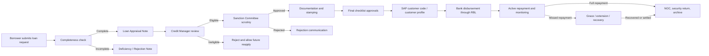
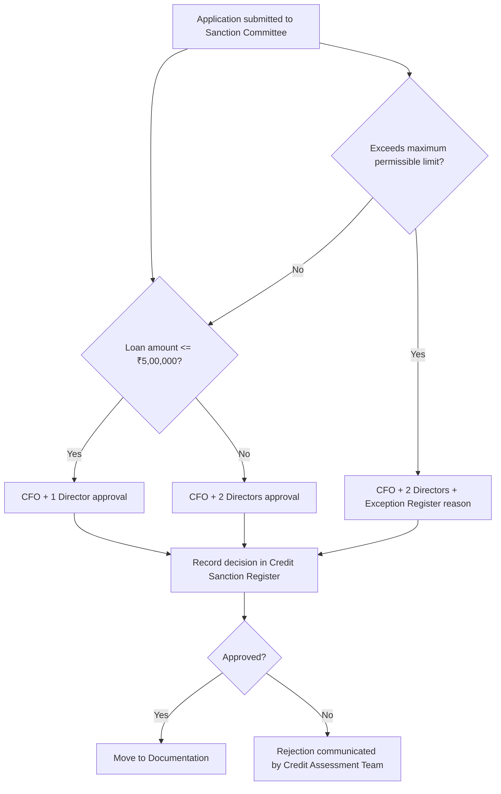
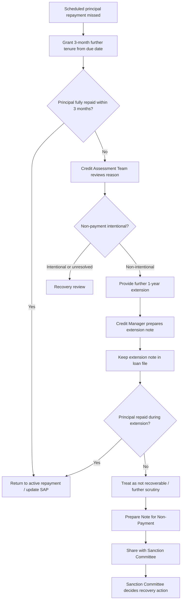

# user-flows.md

# SFPCL Member Credit Administration & Settlement — Detailed User Flows

**Client:** Sahyadri Farmers Producer Company Limited (SFPCL)  
**Process Area:** Member Credit Administration, Loan Sanction, Documentation, Disbursement, Monitoring, Repayment, Recovery and Closure  
**Source Basis:** Current analysis of the uploaded SOP documents and the previously prepared client brief  
**Primary SOP Reference:** `SOP_SFPCL_LOANDISBURSEMENT`  
**Prepared For:** Product, operations, implementation, compliance, finance and engineering teams  
**Document Type:** Functional user-flow specification in Markdown  
**Generated On:** 2026-06-22

---

## 1. Purpose of This Document

This `user-flows.md` document translates the current SOP analysis into detailed product and operational user flows. It is intended to help teams design, configure, implement or audit a workflow system for SFPCL's member lending process.

The document covers the full lifecycle:

1. Policy and configuration setup.
2. Member and borrower validation.
3. Loan request intake.
4. Application completeness checks.
5. Credit appraisal.
6. Loan limit calculation.
7. Sanction Committee approval.
8. Rejection and resubmission.
9. Documentation and stamping.
10. Physical-share and demat-share security handling.
11. Signature mismatch handling.
12. Final approval checklist.
13. SAP customer / vendor code creation.
14. Bank disbursement.
15. Repayment through direct transfer and subsidiary deduction.
16. Interest invoicing, accrual and capitalisation.
17. Monitoring, DPD classification and MIS.
18. Default handling and recovery decisioning.
19. Loan closure, NOC and return of securities.
20. Compliance, exception, grievance and change-control flows.

This is deliberately detailed and comprehensive so that it can be used as a functional specification, process blueprint, workflow configuration guide or implementation backlog.

---

## 2. Business Context

SFPCL is a farmer-owned Producer Company. It supports members through structured credit facilities for agriculture and allied productive activities. The source SOP establishes a controlled lending process aligned to the Companies Act, 2013, Producer Company provisions, the Articles of Association, statutory compliance requirements, internal approval controls, documentation requirements and repayment monitoring.

The lending process is designed for borrowers who are SFPCL members. A borrower may be:

- An individual farmer.
- A Farmer Producer Company.
- A Producer Institution member.
- A shareholder / member eligible under SFPCL's policy.

The SOP uses the terms **borrower**, **shareholder**, **farmer**, **loan applicant** and **member** depending on the context. A product implementation should normalise these into a single **Borrower Profile** while preserving member type.

---

## 3. Legal and Process Guardrails

The following rules are hard process guardrails and should be implemented as workflow gates wherever possible.

| Guardrail | System / Process Implication |
|---|---|
| Loans can be extended only to eligible members. | Application cannot move to appraisal unless membership and active status are validated or exception route is invoked. |
| Loan purpose must relate to crop production or agricultural activity only. | Loan purpose field should use controlled values; non-agri purposes should be blocked or sent to rejection. |
| No phase should be bypassed unless formally documented approval is granted by the CFO. | Workflow override must require CFO approval, reason, audit trail and Exception Register entry. |
| Loan limit must be calculated using shareholding and land-based limits. | System must compute both and use the lower amount as eligible limit. |
| Loans up to ₹5,00,000 require CFO + one Director approval. | Approval route must be amount-based. |
| Loans above ₹5,00,000 require CFO + two Directors approval. | Approval route must escalate automatically. |
| Loans exceeding maximum permissible limit require CFO + two Directors and Exception Register entry. | Exception workflow must capture reason and joint approval. |
| Director / Sanction Committee member / relative borrowing requires special handling. | Applicant-related approver must be excluded; member approval in general meeting must be captured. |
| Disbursement cannot occur before documentation, stamping, security and final checklist approval. | Treasury cannot initiate payment unless all gating checklist items are complete. |
| Security documents cannot be invoked informally. | SH-4, demat pledge invocation or blank-dated cheque action requires approval and recovery decision record. |
| Full closure requires NOC and return of security documents. | Closure task must require NOC issuance and evidence of return / unpledge. |
| Records must be archived for at least 8 years. | Archive policy should be configured at loan closure. |

---

## 4. Key Actors and Roles

### 4.1 Actor Matrix

| Actor / Role | Primary Responsibilities | Key System Permissions |
|---|---|---|
| Borrower / Member | Submits loan request, documents, declarations, signatures and repayment obligations. | Create application, upload documents, view status, receive notices, submit clarifications. |
| Nominee | Signs application, PoA and certain declarations; nominee must not be a minor. | Provide KYC details, sign applicable forms. |
| Witness | Signs SH-4 and loan agreement where applicable; must be an existing SFPCL shareholder. | Provide PAN and Aadhaar; sign witness fields. |
| Credit Manager | Receives application, maintains Loan Request Register, reviews appraisal, monitors loan limits, sends reminders, posts repayment entries as specified. | Create / edit application, issue rejection, review appraisal, submit to Sanction Committee, generate reports, post certain SAP-related repayment entries if integrated. |
| Deputy Manager – Finance | Verifies application completeness, issues acknowledgment, prepares Loan Appraisal Note. | Completeness check, generate application reference, prepare appraisal note. |
| Credit Assessment Team | Performs eligibility checks, due diligence, credit appraisal, non-payment analysis, extension note and non-payment note. | Appraisal, risk rating, eligibility decisions, default analysis. |
| Compliance Team Member | Prepares PoA, tri-party declaration, SH-4, term sheet, loan agreement, bank verification letter and checklist. | Generate legal documents, upload stamped documents, manage checklist. |
| Company Secretary | Reviews documentation, ensures statutory compliance, handles stamping, maintains registers, signs checklist, manages PoA / SH-4 / grievance / legal controls. | Approve document set, manage compliance registers, approve legal readiness, manage grievances. |
| Sanction Committee | Reviews appraisal, validates compliance, approves / rejects loans, decides recovery action. | Approve, reject, request clarification, record reason, sign sanction register. |
| Chief Financial Officer | Member of Sanction Committee; required approver based on matrix; approves exceptions and policy deviations. | Approval, exception approval, override approval, MIS review. |
| Executive Directors | Participate in Sanction Committee approvals based on authority matrix. | Approval, rejection, query, abstention if conflicted. |
| Senior Manager – Finance | Initiates SAP customer code request / creation coordination, performs final document and loan detail check, initiates disbursement, signs checklist after disbursement. | Final finance verification, payment initiation, SAP code confirmation, checklist sign-off. |
| Chief Financial Controller | Final authorised signatory for bank transfer execution. | Approve and execute bank transfer. |
| Treasury Team | Verifies bank statement receipts, passes receipt entries in SAP, manages disbursement processing with finance. | Payment processing, bank reconciliation, receipt posting. |
| Accounts Team | Monitors repayment quarterly through SAP, posts monthly accruals, supports DPD and accounting reporting. | SAP reports, DPD reports, accrual entries. |
| Sales Team | Prepares and issues annual interest invoices for farmers who have availed loans. | Interest invoice generation. |
| IT Support | Supports SAP / system issues and access controls. | Ticket handling, access control support. |
| Internal Auditor | Samples files, checks control compliance, reviews archive and registers. | Read-only access, audit export. |
| Board | Approves SOP and policy changes, loan policy, limits, and certain deviations as required. | Board approval register / meeting minute capture. |

---

## 5. Application and Loan State Model

A digital workflow should maintain a clear state machine. The following state model is recommended.

```mermaid
stateDiagram-v2
    [*] --> Draft
    Draft --> Submitted: Borrower submits application
    Submitted --> Completeness_Check: Deputy Manager - Finance starts review
    Completeness_Check --> Deficiency_Raised: Missing / incomplete details
    Deficiency_Raised --> Resubmitted: Borrower corrects deficiencies
    Resubmitted --> Completeness_Check
    Completeness_Check --> Appraisal_In_Progress: Complete application
    Appraisal_In_Progress --> Credit_Manager_Review: Appraisal note prepared
    Credit_Manager_Review --> Rejected_By_Credit: Fails eligibility
    Credit_Manager_Review --> Pending_Sanction: Submitted to Sanction Committee
    Pending_Sanction --> Rejected_By_Sanction: Rejected with reason
    Pending_Sanction --> Sanctioned: Approved
    Sanctioned --> Documentation_In_Progress
    Documentation_In_Progress --> Documentation_Deficiency: Missing / mismatch / stamping pending
    Documentation_Deficiency --> Documentation_In_Progress: Rectified
    Documentation_In_Progress --> Pending_Final_Approvals: Checklist ready
    Pending_Final_Approvals --> Disbursement_Ready: CS + Credit + Sanction approvals complete
    Disbursement_Ready --> SAP_Code_Pending
    SAP_Code_Pending --> Payment_Initiated: SAP code confirmed / in process as allowed
    Payment_Initiated --> Disbursed: CFC approves bank transfer
    Disbursed --> Active_Repayment
    Active_Repayment --> Overdue: Scheduled repayment missed
    Overdue --> Grace_Period: 3-month grace granted
    Grace_Period --> Active_Repayment: Repayment received
    Grace_Period --> Extension_Review: Still unpaid
    Extension_Review --> Extended: Non-intentional; 1-year extension
    Extension_Review --> Recovery_Review: Intentional or material issue
    Extended --> Active_Repayment: Repayment received
    Extended --> Non_Recoverable_Review: Still unpaid after extension
    Non_Recoverable_Review --> Recovery_Review
    Recovery_Review --> Recovery_Action_Approved
    Recovery_Action_Approved --> Recovered: Security invoked / recovery completed
    Active_Repayment --> Closure_Review: Full repayment received
    Recovered --> Closure_Review
    Closure_Review --> Closed: NOC + security return + archive complete
    Rejected_By_Credit --> [*]
    Rejected_By_Sanction --> [*]
    Closed --> [*]
```

---

## 6. Global Data Objects

### 6.1 Borrower Profile

| Field Group | Key Fields |
|---|---|
| Identity | Borrower name, member type, borrower category, Aadhaar, PAN, photo, contact details. |
| Membership | Folio number, shareholder status, number of shares, share certificate copies, demat / physical share status. |
| Active Member Evidence | Produce supply history, service usage history, subsidiary / step-down subsidiary relationship, FPC / Producer Institution membership linkage. |
| Nominee | Name, age, Aadhaar, PAN, gender, relationship, minor-status validation. |
| Land / Crop | 7/12 extract, land area under cultivation, crop plan, crop category, scale of finance data. |
| Bank | Account holder name, account number, IFSC, branch, cancelled cheque, signature status. |
| KYC / CKYC | PAN, Aadhaar / OVD, CKYC consent, re-KYC due date, risk category, beneficial owner details if applicable. |
| Compliance | Declarations, consents, no wilful-default declaration, end-use declaration, encumbrance declaration. |

### 6.2 Loan Application

| Field Group | Key Fields |
|---|---|
| Application Identity | Application reference number, application date, source channel, status, created by. |
| Loan Request | Requested amount, purpose, crop / agriculture activity, short-term / long-term classification, requested tenure. |
| Limits | Shareholding-based limit, land-based limit, final eligible limit, requested-vs-eligible variance, exception flag. |
| Appraisal | Repayment capacity, income evidence, risk rating, recommended amount, recommended tenure, recommended security. |
| Sanction | Approver route, sanction decision, sanction date, approval reason, rejection reason, Credit Sanction Register entry. |
| Documentation | Document checklist, stamp duty status, notarisation status, witness details, security type, PoA, SH-4 / CDSL pledge details. |
| Disbursement | SAP customer code, bank account verification, payment initiation date, CFC approval, bank reference, disbursement advice. |
| Repayment | Due schedule, repayments received, allocation principal / interest, outstanding principal, accrued interest, capitalised interest. |
| Monitoring | DPD bucket, reminder history, MIS quarter, default status, extension status. |
| Closure | NOC date, security return evidence, unpledge evidence, archive location, archive retention date. |

### 6.3 Registers

| Register | Owner | Purpose |
|---|---|---|
| Loan Request Register | Credit Manager | Tracks all applications and unique reference numbers. |
| Credit Sanction Register | Sanction Committee / CS | Records approval / rejection decisions, reasons and approval authority. |
| Exception Register | CFO / CS | Records deviations, exceeding-limit cases, bypasses and approvals. |
| Security Register | Company Secretary | Tracks SH-4, blank-dated cheques, PoA, CDSL pledge and custody. |
| Grievance Register | Company Secretary | Tracks borrower complaints, TAT and resolution. |
| SAP Customer Code Tracker | Senior Manager – Finance / Credit Manager | Tracks SAP customer code creation and confirmation. |
| Repayment / DPD Register | Credit / Accounts | Tracks repayment status, ageing, reminders and MIS. |
| Archive Register | Company Secretary / Internal Auditor | Tracks loan file retention for at least 8 years. |

---

## 7. High-Level Lifecycle Flow



---

# 8. User Flow 0 — Policy, Product and Reference Data Configuration

## 8.1 Objective

Set up Board-approved lending parameters, formulas, rates, approval thresholds, document templates and compliance controls before applications are processed.

## 8.2 Primary Actors

- CFO.
- Company Secretary.
- Credit Manager.
- Board.
- IT / system administrator.

## 8.3 Preconditions

- SOP is approved by the Board.
- Current share valuation and scale of finance are available.
- Approval matrix is approved.
- Document templates are finalised.

## 8.4 Configuration Data

| Configuration Area | Values / Rules from Current Analysis |
|---|---|
| Application number sequence | Starts with `LO00000001`; increments sequentially. |
| Loan limit method | Lower of shareholding-based limit and land-based limit. |
| Shareholding formula | `No. of shares held × 30% of valuation per share` as stated in the process section. |
| Share valuation basis | Latest audited financial statements approved at AGM; NAV / Fair Market Valuation. |
| Share valuation frequency | Yearly after statutory audit and before AGM adoption of financial statements. |
| Current per-share reference | SOP also references 10% of valuation = ₹200 per share, requiring clarification. |
| Land-based formula | `Per-acre cost of cultivation × land area under cultivation`. |
| Current scale of finance cap | ₹20,000 per acre. |
| Approval threshold | Up to ₹5,00,000: CFO + one Director; above ₹5,00,000: CFO + two Directors. |
| Interest rate | Floating; changes with bank rates; communicated by SMS / email. |
| Short-term classification | Loan tenure of 1 year. |
| Long-term classification | All other loan tenures. |
| Documentation stamp | PoA and Loan Agreement on ₹500 stamp paper and notarised as per SOP. |
| Record retention | Minimum 8 years after closure. |
| KYC re-verification | Every 2 years. |
| NBFC principal business test | Quarterly. |
| Section 186 limit monitoring | Quarterly. |
| DPD / monitoring buckets | 1–2 years, 2–3 years and more than 3 years. |

## 8.5 Main Flow

1. Company Secretary creates or updates SOP / policy configuration.
2. CFO confirms financial thresholds, approval matrix and statutory monitoring requirements.
3. Credit Manager confirms operational rules for application numbering, loan caps and appraisal requirements.
4. Board approval is recorded for any policy, percentage, cap, SOP or threshold change.
5. System administrator configures:
   - Product type.
   - Application number sequence.
   - Eligibility rules.
   - Loan-limit formula.
   - Approval hierarchy.
   - Document templates.
   - Checklist gates.
   - Compliance reminders.
   - Role-based permissions.
6. Company Secretary validates that the configured templates map to annexures.
7. CFO approves go-live configuration.

## 8.6 Outputs

- Approved configuration version.
- Board approval reference.
- Active policy date.
- Audit trail of configured values.
- Deactivated prior policy version, if applicable.

## 8.7 Controls

- No configuration change without maker-checker approval.
- Any change to share valuation percentage or loan cap must carry Board approval reference.
- Any formula ambiguity must be resolved before production configuration.

## 8.8 Open Issue

The SOP contains a contradiction between `30% of valuation per share` and `10% of valuation / ₹200 per share`. The system should not hard-code this until SFPCL confirms the operative rule.

---

# 9. User Flow 1 — Borrower Identification and Member Validation

## 9.1 Objective

Confirm that the applicant is an eligible SFPCL member before the loan application moves forward.

## 9.2 Primary Actors

- Borrower.
- Credit Manager.
- Deputy Manager – Finance.
- Credit Assessment Team.

## 9.3 Trigger

Borrower initiates loan request through offline or digital channel.

## 9.4 Preconditions

- Borrower has or claims membership / shareholding in SFPCL.
- Borrower provides folio number or shareholding details.

## 9.5 Main Flow

1. Borrower enters or provides:
   - Full name.
   - Member type: individual farmer / FPC / Producer Institution.
   - Folio number.
   - Number of shares held.
   - PAN.
   - Aadhaar / OVD.
   - Contact details.
2. System / Credit Manager searches Membership Register.
3. System validates:
   - Member exists.
   - Member is not marked inactive unless active-status evidence supports eligibility.
   - Shares are held in the member's name.
   - Borrower has no unresolved disqualification.
4. System determines if borrower is:
   - Individual member.
   - Producer Institution / FPC.
5. System checks active-member rules.
6. If eligible, application can proceed to loan request capture.
7. If not eligible, deficiency or rejection process is initiated.

## 9.6 Active Member Rules — Individual

An individual member is active when the member:

1. Avails, directly or indirectly, services offered by SFPCL, such as crop production, procurement, purchases or sale of agricultural inputs, during the membership period; and
2. Supplies primary produce continuously for 4 financial years as on the last date of the previous financial year to:
   - SFPCL; or
   - SFPCL subsidiaries; or
   - SFPCL step-down subsidiaries; or
   - Through a Producer Institution member in which the individual is also a member and which supplies to SFPCL / subsidiaries / step-down subsidiaries.

### Relaxation for New / Recent Individual Members

The 4-year condition does not apply if the member has supplied produce for at least 1 year to SFPCL, its subsidiaries, step-down subsidiaries or through an eligible Producer Institution. Alternatively, a Producer Member qualifies if they have provided services in employment or any other capacity for a continuous period of 3 years to SFPCL, its subsidiaries or step-down subsidiaries.

## 9.7 Active Member Rules — Producer Institution

A Producer Company or institutional member must:

1. Be a member of SFPCL.
2. Avail services directly or indirectly from SFPCL.
3. Supply primary produce continuously for 4 financial years to SFPCL, subsidiaries or step-down subsidiaries.

### Relaxation for New / Recent Producer Institutions

The 4-year condition does not apply if the member producer company has supplied produce for at least 1 year to SFPCL, subsidiaries or step-down subsidiaries.

## 9.8 Decision Points

| Decision | Yes Path | No Path |
|---|---|---|
| Is applicant a member? | Continue. | Reject / do not accept application. |
| Is active-member evidence available? | Continue. | Raise deficiency or reject. |
| Is applicant a director, Sanction Committee member or relative? | Route special-case approval. | Normal flow. |
| Is nominee not a minor? | Continue. | Raise deficiency. |

## 9.9 Outputs

- Validated Borrower Profile.
- Member validation result.
- Active-member evidence record.
- Special-case flag if applicable.

---

# 10. User Flow 2 — Initial Loan Request and Application Submission

## 10.1 Objective

Capture the borrower's loan request and required application details.

## 10.2 Actors

- Borrower.
- Nominee.
- Credit Manager.
- Deputy Manager – Finance.

## 10.3 Channels

- Physical submission at designated office.
- Digital application portal.
- Offline-assisted entry by Credit Assessment Team.

## 10.4 Application Fields

| Field | Requirement |
|---|---|
| Folio number | Mandatory. |
| Number of shares held | Mandatory. |
| Maximum permissible loan limit | Must be calculated or displayed as per current approved per-share / valuation rule. |
| Required loan amount | Mandatory. |
| Loan purpose | Must relate to crop production / agriculture activity. |
| Borrower details | Mandatory. |
| Nominee name | Mandatory. |
| Nominee age | Mandatory; nominee must not be minor. |
| Nominee Aadhaar | Mandatory. |
| Nominee PAN | Mandatory. |
| Nominee gender | Mandatory. |
| Borrower signature | Mandatory. |
| Nominee signature | Mandatory. |

## 10.5 Required Uploads / Attachments

For borrower and nominee, as applicable:

1. Self-attested PAN card copy.
2. Self-attested Aadhaar card copy.
3. Copy of share certificates.
4. Land documents / 7/12 extract.
5. Crop plan.
6. Recent bank statement for previous 6 months.

## 10.6 Main Flow

1. Borrower selects loan request channel.
2. Borrower fills Loan Application Form.
3. Borrower enters member and shareholding details.
4. Borrower enters requested loan amount and loan purpose.
5. Borrower enters nominee details.
6. Borrower uploads or submits mandatory documents.
7. Borrower and nominee sign application.
8. Application is submitted to Credit Assessment Team.
9. System sets status to `Submitted`.

## 10.7 Outputs

- Submitted Loan Application Form.
- Uploaded KYC and supporting documents.
- Application submission timestamp.

## 10.8 Notifications

| Recipient | Message |
|---|---|
| Borrower | Application received and pending completeness review. |
| Deputy Manager – Finance | New application awaiting completeness check. |
| Credit Manager | New loan inquiry / application received. |

---

# 11. User Flow 3 — Application Completeness Check and Reference Number Generation

## 11.1 Objective

Verify that the application is complete and issue a unique application reference number.

## 11.2 Actor

- Deputy Manager – Finance.
- Credit Manager.

## 11.3 Main Flow

1. Deputy Manager – Finance opens submitted application.
2. System displays completeness checklist.
3. Deputy Manager verifies:
   - Borrower details.
   - Nominee details.
   - Required signatures.
   - PAN and Aadhaar copies.
   - Share certificate copy.
   - Land records / 7/12 extract.
   - Crop plan.
   - Bank statement for last 6 months.
   - Loan purpose.
4. If complete, system generates unique reference number.
5. Number follows sequence beginning with `LO00000001`.
6. Application reference number is written to Loan Request Register.
7. Reference number is shown on the application record and original-copy record.
8. Borrower receives acknowledgment.

## 11.4 Incomplete Application Flow

1. Deputy Manager marks missing / deficient items.
2. Credit Manager reviews deficiencies if needed.
3. Rejection Note / deficiency note is generated using Annexure L format.
4. Borrower is notified by email or courier / offline communication.
5. Application status becomes `Deficiency Raised` or `Returned for Rectification`.
6. Borrower may resubmit after rectifying deficiencies.

## 11.5 Controls

- Reference number must not be issued for duplicate application unless intentional repeat application is approved.
- Incomplete applications should not move to appraisal.
- All deficiency reasons must be captured.

## 11.6 Outputs

- Acknowledgment with application reference number.
- Loan Request Register entry.
- Deficiency / Rejection Note if incomplete.

---

# 12. User Flow 4 — Loan Appraisal and Eligibility Assessment

## 12.1 Objective

Prepare the Loan Appraisal Note and determine whether the borrower is eligible for lending.

## 12.2 Actors

- Deputy Manager – Finance.
- Credit Manager.
- Credit Assessment Team.

## 12.3 TAT

The Loan Appraisal Note should be prepared and submitted to the Sanction Committee within **2 days from application receipt**.

## 12.4 Main Flow

1. Deputy Manager – Finance opens complete application.
2. System loads borrower profile, KYC, land, crop and shareholding details.
3. Deputy Manager prepares Loan Appraisal Note.
4. System requires entry / confirmation of:
   - Active member status.
   - No default with SFPCL, subsidiary or associate company.
   - Land documents availability.
   - KYC completeness.
   - Recent bank statement availability.
   - Crop plan availability.
   - Loan purpose check.
   - Borrower acceptance of Term Sheet and Loan Agreement terms.
   - Repayment capacity.
   - Risk rating.
   - Recommended amount.
   - Recommended tenure.
   - Recommended security.
5. System calculates loan eligibility.
6. Credit Manager reviews Loan Appraisal Note.
7. If eligible, Credit Manager submits package to Sanction Committee.
8. If ineligible, Credit Manager rejects with reason and issues Rejection Note.

## 12.5 Eligibility Checks

| Check | Rule |
|---|---|
| Active membership | Applicant must be active member. |
| Default status | Applicant must not be in default for any SFPCL, subsidiary or associate loan. |
| Documents | Land documents, KYC, bank statement and crop plan are mandatory. |
| Agreement to terms | Applicant must agree to Term Sheet and Loan Agreement terms. |
| Loan purpose | Must be crop production / agriculture-related only. |

## 12.6 Outputs

- Completed Loan Appraisal Note.
- Eligibility decision.
- Recommended loan amount and tenure.
- Rejection Note where applicable.
- Submission to Sanction Committee.

---

# 13. User Flow 5 — Loan Limit Calculation

## 13.1 Objective

Calculate maximum permissible loan amount using both required methods and select the lower amount.

## 13.2 Actors

- Deputy Manager – Finance.
- Credit Manager.
- System / LMS.
- CFO / Board for configuration.

## 13.3 Main Flow

1. System retrieves number of shares held.
2. System retrieves current approved share valuation.
3. System applies configured shareholding percentage / per-share cap.
4. System calculates shareholding-based limit.
5. System retrieves cultivated land area from land documents / 7/12 extract.
6. System retrieves current scale of finance / per-acre cost.
7. System calculates land-based limit.
8. System selects lower of both limits.
9. System compares requested amount with final eligible amount.
10. System marks one of the following:
    - `Within Limit`.
    - `Above Eligible Limit`.
    - `Requires Exception Approval`.

## 13.4 Formulae

```text
Shareholding-Based Limit = Number of shares held × approved percentage of valuation per share
```

```text
Land-Based Limit = Per-acre cost of cultivation fixed annually by SFPCL × farmer's land area under cultivation
```

```text
Final Eligible Loan Amount = Lower of Shareholding-Based Limit and Land-Based Limit
```

## 13.5 Current SOP Values

| Parameter | Current SOP Position |
|---|---|
| Scale of finance cap | ₹20,000 per acre. |
| Share valuation method | Net Asset Value Method based on Fair Market Valuation. |
| Share valuation source | Latest audited financial statements approved at AGM. |
| Share valuation frequency | Yearly. |
| Formula reference | SOP mentions 30% of valuation per share. |
| Contradictory reference | SOP also references 10% of share value and current result of ₹200 per share. |

## 13.6 Required System Controls

- Formula must be configurable, not hard-coded.
- Configuration must require Board approval.
- System must store calculation snapshot at appraisal stage.
- If formula is later changed, historical loan files must retain the formula used at approval time.
- Any request above eligible limit must route to exception workflow.

---

# 14. User Flow 6 — Credit Manager Review and Rejection

## 14.1 Objective

Allow Credit Manager to review appraisal before sanction submission or reject ineligible applications.

## 14.2 Actor

- Credit Manager.

## 14.3 Main Flow

1. Credit Manager receives Loan Appraisal Note.
2. Credit Manager checks:
   - Eligibility decision.
   - Limit calculation.
   - KYC completeness.
   - Purpose alignment.
   - Default history.
   - Risk rating.
   - Supporting documents.
3. Credit Manager either:
   - Approves submission to Sanction Committee; or
   - Sends back to Deputy Manager – Finance for clarification; or
   - Rejects application.

## 14.4 Rejection Flow

1. Credit Manager selects rejection reason(s).
2. System generates Rejection Note.
3. Rejection Note is sent via email or courier / offline mode.
4. System records date and method of communication.
5. Borrower may reapply after meeting criteria.

## 14.5 Common Rejection Reasons

- Applicant is not an active member.
- Applicant has existing default with SFPCL / subsidiary / associate.
- Required KYC documents missing.
- Land records missing.
- Crop plan missing.
- Bank statement missing or inadequate.
- Loan purpose not agriculture-related.
- Nominee is minor or nominee details incomplete.
- Requested amount exceeds eligible limit and no exception approval is justified.

---

# 15. User Flow 7 — Sanction Committee Scrutiny and Approval

## 15.1 Objective

Enable Sanction Committee to review the loan application, appraisal and compliance checks and either approve or reject.

## 15.2 Actors

- CFO.
- One or two Executive Directors depending on approval matrix.
- Credit Assessment Team.
- Credit Manager.

## 15.3 Trigger

Credit Manager submits application and Loan Appraisal Note to Sanction Committee.

## 15.4 Sanction Committee Checks

| Check | Description |
|---|---|
| Eligibility verification | Confirm membership, shareholding and other eligibility criteria. |
| Loan amount assessment | Verify loan amount is within permissible limits. |
| Purpose check | Confirm loan purpose aligns with company objectives and lending policy. |
| Compliance check | Confirm Companies Act, Producer Company provisions, internal policy and regulatory requirements. |
| Past borrowing history | Review prior loans, repayment discipline and defaults. |
| Risk assessment | Review market, operational and borrower-specific risks and mitigations. |
| Documentation completeness | Confirm required documents are submitted and authenticated. |

## 15.5 Approval Matrix Flow



## 15.6 Decision Recording

The following must be stored:

- Decision: approved / rejected / clarification needed.
- Approvers involved.
- Approval threshold category.
- Decision date and time.
- Reasons for approval or rejection.
- Exception Register reference where applicable.
- Abstention record where special case applies.
- Credit Sanction Register entry.

## 15.7 Rejection by Sanction Committee

1. Sanction Committee records rejection reason.
2. Credit Assessment Team receives decision.
3. Credit Assessment Team informs borrower.
4. Borrower remains eligible to reapply later after fulfilling rejection criteria.

---

# 16. User Flow 8 — Special Case Approval: Director / Sanction Committee Member / Relative as Borrower

## 16.1 Objective

Ensure conflict-of-interest and statutory approval requirements are enforced.

## 16.2 Trigger

Borrower is identified as:

- Sanction Committee member.
- Director.
- Relative of Sanction Committee member.
- Relative of director.

## 16.3 Main Flow

1. System flags special-case relationship.
2. Applicant-related approver is automatically excluded from approval workflow.
3. Remaining Sanction Committee members review the loan.
4. System requires general meeting approval by members in accordance with Section 378ZK.
5. Company Secretary uploads general meeting approval evidence.
6. Only after approval evidence is attached can the loan move forward.
7. All conflict-of-interest notes and abstentions are recorded.

## 16.4 Controls

- Conflicted person must not approve their own or relative's loan.
- General meeting approval evidence must be mandatory.
- Approval cannot be completed until conflict handling is closed.

## 16.5 Open Configuration Need

The SOP identifies this requirement but does not define the full operational workflow for notice, meeting, voting, document formats or member approval evidence. These should be specified by SFPCL before automation.

---

# 17. User Flow 9 — Post-Sanction Document Collection

## 17.1 Objective

Collect additional borrower, witness, bank and security documents after sanction approval.

## 17.2 Actors

- Borrower.
- Witness.
- Compliance Team.
- Company Secretary.

## 17.3 Required Documents

| Document | Purpose | Required From |
|---|---|---|
| Witness PAN copy | Witness identity verification. | Witness. |
| Witness Aadhaar copy | Witness identity verification. | Witness. |
| Cancelled cheque | Verify borrower bank account number, IFSC and branch for disbursement. | Borrower. |
| Blank-dated cheque | Security against default. | Borrower. |

## 17.4 Witness Rule

The witness must be an existing shareholder of SFPCL.

## 17.5 Main Flow

1. Compliance Team receives sanction approval.
2. System generates post-sanction document checklist.
3. Borrower submits cancelled cheque and blank-dated cheque.
4. Witness submits PAN and Aadhaar copies.
5. Compliance Team verifies witness shareholder status.
6. Compliance Team updates checklist status.
7. If any item is missing, documentation deficiency is raised.

## 17.6 Controls

- Cancelled cheque must be verified before bank details are used in SAP / bank transfer.
- Blank-dated cheque custody must be logged in Security Register.
- Witness must not be accepted unless shareholder status is validated.

---

# 18. User Flow 10 — Legal Document Preparation and Stamping

## 18.1 Objective

Prepare and execute the legal documentation package required for disbursement.

## 18.2 Actors

- Compliance Team Member.
- Company Secretary.
- Borrower.
- Nominee.
- Witness.
- Sanction Committee.

## 18.3 Documents Prepared

| Document | Mandatory Signatures / Requirements |
|---|---|
| Power of Attorney | Signed by farmer and nominee; ₹500 stamp paper; notarised. |
| Declaration / Tri-party Agreement | Signed by borrower and nominee. |
| SH-4 | Signed by loan applicant and witness; applicable for physical shares. |
| CDSL pledge records | Applicable for demat shares. |
| Term Sheet | Signed by loan applicant and nominee; additional CFO / Director signatures based on amount. |
| Loan Agreement | Signed by loan applicant and witness; ₹500 stamp paper; notarised. |
| Bank Verification Letter | Required where signature mismatch exists. |
| Checklist | Index of all documents. |

## 18.4 Main Flow

1. Compliance Team generates document package from approved loan record.
2. System pre-fills borrower, nominee, shareholding, loan amount and repayment data.
3. Compliance Team prepares PoA in favour of Company Secretary.
4. Compliance Team prepares tri-party declaration / agreement with relevant subsidiary.
5. Compliance Team determines security route:
   - Physical shares: SH-4.
   - Demat shares: CDSL pledge.
6. Compliance Team prepares Term Sheet.
7. Compliance Team prepares Loan Agreement.
8. Compliance Team checks whether bank signature mismatch exists.
9. If mismatch exists, Bank Verification Letter or stamp-paper declaration is required.
10. Stamping and notarisation are completed where required.
11. Document checklist is updated.
12. Complete file is submitted for CS review.

## 18.5 Controls

- Disbursement must be blocked until mandatory documents are complete.
- Stamp-paper and notarisation status must be captured.
- Originals must be securely stored and logged.
- Missing witness signature must block disbursement.

---

# 19. User Flow 11 — Power of Attorney Flow

## 19.1 Objective

Authorise the Company Secretary to initiate sale of shares in the event of loan default.

## 19.2 Actors

- Compliance Team.
- Borrower / farmer.
- Nominee.
- Company Secretary.

## 19.3 Main Flow

1. Compliance Team generates PoA template.
2. PoA is prepared in favour of the Company Secretary.
3. Borrower and nominee sign PoA.
4. PoA is executed on ₹500 stamp paper.
5. PoA is notarised.
6. Company Secretary verifies execution.
7. PoA is stored in legal / security document file.
8. Security Register is updated.

## 19.4 Controls

- PoA is required before recovery-related share sale authority can exist.
- PoA execution status should be visible in final checklist.
- PoA use in default should require separate recovery approval.

---

# 20. User Flow 12 — Tri-Party Repayment Declaration / Agreement

## 20.1 Objective

Enable repayment through deduction from produce payments made by SFPCL subsidiary companies.

## 20.2 Actors

- Borrower.
- Nominee.
- SFPCL.
- Relevant subsidiary company, such as Sahyadri Farms Post Harvest Care Limited where applicable.
- Compliance Team.
- Treasury Team.

## 20.3 Main Flow

1. Compliance Team identifies relevant subsidiary with which borrower transacts.
2. Tri-party declaration / agreement is generated.
3. Agreement records that borrower sells produce to subsidiary.
4. Agreement allows subsidiary to deduct loan dues from produce payment.
5. Deductible dues include:
   - Principal.
   - Interest.
   - Any other loan-related dues.
6. Subsidiary transfers deducted amount to SFPCL.
7. SFPCL adjusts received amount against outstanding loan obligation.
8. Borrower and nominee sign declaration / agreement.
9. Agreement is stored in loan file.

## 20.4 Controls

- Repayment deduction should include borrower name and loan application number in bank statement.
- Treasury should verify bank statement before SAP receipt entry.
- Agreement must be in place before repayment through subsidiary can be relied upon as a control.

---

# 21. User Flow 13 — Security Handling for Physical Shares: SH-4

## 21.1 Objective

Use Share Transfer Form SH-4 as security where borrower holds physical shares.

## 21.2 Actors

- Borrower / shareholder.
- Witness.
- Compliance Team.
- Company Secretary.
- Sanction Committee for recovery invocation.

## 21.3 Main Flow

1. System identifies shareholding mode as physical.
2. Compliance Team prepares SH-4.
3. Borrower / shareholder signs SH-4.
4. Valid witness signs SH-4.
5. Witness shareholder status is verified.
6. Company Secretary checks completeness and custody.
7. SH-4 is logged in Security Register.
8. SH-4 is held in blank as security during loan tenure.
9. On full closure, SH-4 copy / original as applicable is returned to borrower.

## 21.4 Invocation Flow on Default

1. Loan enters recovery review after defined default process.
2. Credit Assessment Team prepares Note for Non-Payment.
3. Sanction Committee reviews recovery options.
4. Sanction Committee decides whether sale of shares is required.
5. If approved, Company Secretary initiates SH-4-related recovery process.
6. All actions are logged in recovery and security registers.

## 21.5 Controls

- SH-4 must not be used without Board / Sanction Committee approval.
- Missing SH-4 witness signature blocks disbursement.
- SH-4 custody must be documented.
- On closure, return evidence must be captured.

## 21.6 Open Issue

The SOP states that in case of sale of shares the company needs to follow the procedure, but the detailed procedure section is blank. The product should include a placeholder recovery workflow and require SFPCL to define the sale-of-shares procedure before operational use.

---

# 22. User Flow 14 — Security Handling for Demat Shares: CDSL Pledge

## 22.1 Objective

Pledge demat shares through CDSL as loan security.

## 22.2 Actors

- Pledgor BO: borrower / shareholder.
- Pledgee: SFPCL.
- Pledgor's Depository Participant.
- Pledgee's Depository Participant.
- Compliance Team.
- Company Secretary.

## 22.3 Main Pledge Flow

1. System identifies shareholding mode as demat.
2. Compliance Team confirms pledgor and pledgee have Beneficiary Owner accounts with CDSL.
3. Accounts may be with same DP or different DPs.
4. Pledgor confirms securities intended for pledge are in pledgee's approved list.
5. Pledgor fills Pledge Request Form in duplicate.
6. Pledgor submits PRF to its DP.
7. Pledgor's DP creates pledge request in depository system.
8. System generates unique Pledge Sequence Number.
9. Pledge request becomes available to pledgee's DP.
10. Pledgee submits acceptance / rejection instruction to its DP unless standing instructions exist.
11. Pledge is created when pledgee DP accepts request.
12. Agreement number is recorded in pledge request form.
13. Compliance Team stores PSN and pledge evidence in loan file.
14. Checklist marks CDSL pledge as complete.

## 22.4 Future Shares Rule

If future shares are issued to the borrower, the same shall stand pledged to SFPCL. The system should include a periodic check or event trigger for additional share issuance.

## 22.5 Pledge Invocation Flow

1. Loan reaches approved recovery action stage.
2. Pledgee instructs DP to invoke pledge by submitting Invocation Request Form.
3. Securities move from pledgor's account to pledgee's account.
4. Pledgor confirmation is not required for invocation.
5. Pledgor is informed by DP of the movement of securities.
6. Recovery and security registers are updated.

## 22.6 Unpledge Flow After Repayment

1. Borrower fully repays loan.
2. Closure review begins.
3. Pledgor fills Unpledge Request Form in duplicate and submits to DP; or pledgee initiates Auto Unpledge.
4. Pledgor's DP creates unpledge request using original PSN.
5. Unpledge can be for partial or entire pledged quantity.
6. Pledgee's DP accesses request through depository system.
7. Pledgee's DP accepts or rejects based on URF copy submitted by pledgee.
8. If Auto Unpledge, pledgee gives duly filled URF to its DP and no pledgor instruction is required.
9. Unpledge evidence is uploaded.
10. Closure checklist is completed.

## 22.7 Controls

- PSN must be captured.
- Pledge evidence must be mandatory before disbursement.
- Invocation must be tied to approved recovery decision.
- Unpledge evidence must be mandatory for closure.

---

# 23. User Flow 15 — Signature Mismatch and Bank Verification

## 23.1 Objective

Resolve mismatch between borrower signature across PAN, cheque, KYC and other documents before disbursement.

## 23.2 Actors

- Credit Assessment Team.
- Borrower.
- Borrower's bank.
- Compliance Team.

## 23.3 Main Flow

1. Credit Assessment Team compares borrower signature across submitted documents.
2. If signatures match, checklist item is marked complete.
3. If mismatch exists, system creates `Signature Mismatch` task.
4. Borrower is asked to provide one of two items:
   - Bank Verification Letter signed and stamped by the concerned bank; or
   - Declaration on non-judicial stamp paper affirming the signature belongs to the loan applicant.
5. Compliance Team verifies the submitted evidence.
6. Checklist is updated.
7. Disbursement remains blocked until mismatch is resolved.

## 23.4 Controls

- Signature mismatch cannot be manually ignored without documented approval.
- Bank Verification Letter must be signed and stamped.
- Declaration must be on non-judicial stamp paper.

---

# 24. User Flow 16 — Final Documentation Checklist and Approvals

## 24.1 Objective

Obtain final sign-offs after documentation is complete and before Treasury disbursement.

## 24.2 Actors

- Compliance Team Member.
- Company Secretary.
- Credit Manager.
- Sanction Committee.
- Senior Manager – Finance.

## 24.3 Main Flow

1. Compliance Team completes document package.
2. Compliance Team updates checklist.
3. File is shared with Company Secretary.
4. Company Secretary reviews and signs checklist.
5. File is shared with Credit Manager.
6. Credit Manager verifies loan limit and signs checklist.
7. Credit Manager shares file with Sanction Committee.
8. Sanction Committee provides final approval and relevant director signs checklist.
9. File moves to Treasury Team.
10. Senior Manager – Finance signs checklist after actual disbursement.

## 24.4 Meaning of Checklist Signatures

| Signatory | Meaning |
|---|---|
| Company Secretary | All required documents are verified and attached. |
| Credit Manager | Loan disbursement limits have been reviewed and confirmed. |
| Sanction Committee Members | Final approval has been given as per authority matrix. |
| Senior Manager – Finance | Loan has been disbursed to applicant's account. |

## 24.5 Term Sheet Signing Rules

| Loan Amount | Required Term Sheet Signatures |
|---|---|
| Below ₹5,00,000 | CFO. |
| Exceeding ₹5,00,000 | CFO + two Directors. |

## 24.6 Controls

- Checklist must be an enforced workflow gate.
- Treasury cannot initiate payment until checklist is complete except where explicitly allowed by documented CFO override.
- Final approval should preserve version of all documents approved.

---

# 25. User Flow 17 — SAP Customer / Vendor Code Creation

## 25.1 Objective

Create or reuse SAP customer code for systematic recording of loan transactions.

## 25.2 Actors

- Credit Manager.
- Senior Manager – Finance.
- Treasury Team / Accounts.

## 25.3 Main Flow

1. After Sanction Committee approval, system checks whether borrower already has SAP Customer ID.
2. If first-time borrower, new Customer ID must be created.
3. If borrower already has outstanding loan, existing Customer ID continues and no new ID is created.
4. Credit Manager prepares official email / system request to Senior Manager – Finance.
5. Request includes Excel template data.
6. Senior Manager – Finance creates customer profile in SAP.
7. Senior Manager – Finance sends confirmation to Credit Manager.
8. SAP customer code is recorded in loan application.
9. Initial loan payment SAP entry is posted by Senior Manager – Finance based on Sanction Committee approval.

## 25.4 Required SAP Customer Code Data

1. Farmer's full name.
2. Aadhaar number.
3. PAN number.
4. Address.
5. Email ID.
6. Assigned loan application number.

## 25.5 Controls

- Duplicate SAP codes should be prevented.
- Borrower identity must match approved application.
- Customer code confirmation should be mandatory before final disbursement completion.
- Any manual SAP workaround must be logged.

---

# 26. User Flow 18 — Loan Disbursement

## 26.1 Objective

Disburse approved loan amount to borrower's verified bank account through controlled finance and bank approval process.

## 26.2 Actors

- Senior Manager – Finance.
- Treasury Team.
- Chief Financial Controller.
- Credit Assessment Team.
- Borrower.

## 26.3 Main Flow

1. All approvals are confirmed.
2. SAP code creation is completed or in process as per SOP operating step.
3. Complete loan file is forwarded to Treasury Team.
4. Senior Manager – Finance performs final check of:
   - Approved documents.
   - Loan amount.
   - Borrower bank details.
   - SAP customer code.
   - Sanction approvals.
   - Checklist status.
5. Senior Manager – Finance initiates online payment through SFPCL's RBL Bank account.
6. Transaction is forwarded to Chief Financial Controller.
7. Chief Financial Controller approves and executes bank transfer.
8. Disbursement confirmation is recorded.
9. Credit Assessment Team updates Loan Register.
10. Disbursement advice is shared with farmer.
11. Application status becomes `Disbursed`.

## 26.4 Controls

- Bank details must be derived from verified cancelled cheque.
- Maker-checker should exist between payment initiation and CFC approval.
- Disbursement should not be allowed if documentation, stamping, checklist or SAP checks fail.
- Disbursement advice must be retained.

## 26.5 Outputs

- Bank transfer reference.
- SAP loan entry.
- Updated Loan Register.
- Disbursement advice to borrower.
- Final checklist signature by Senior Manager – Finance.

---

# 27. User Flow 19 — Direct Repayment by Farmer

## 27.1 Objective

Record and allocate repayments received directly from borrower via RTGS / NEFT.

## 27.2 Actors

- Borrower.
- Credit Manager.
- Treasury / Accounts.

## 27.3 Main Flow

1. Borrower transfers repayment to SFPCL account via RTGS / NEFT.
2. Payment is confirmed in bank statement.
3. Treasury / Accounts identifies loan application number and borrower.
4. If partial repayment, system adjusts amount first against principal.
5. Interest recovery is considered after principal adjustment as per SOP.
6. Credit Manager posts repayment entry in SAP on next working day after payment is received and confirmed.
7. Loan outstanding balance is updated.
8. Borrower receives repayment acknowledgement, if configured.

## 27.4 Controls

- Payment must be matched to borrower and loan application.
- Partial repayment allocation must follow principal-first rule.
- SAP entry must be posted next working day.
- Unmatched receipts should be routed to reconciliation queue.

---

# 28. User Flow 20 — Repayment Through Subsidiary Deduction

## 28.1 Objective

Record loan repayment deducted by a subsidiary company from produce payments due to the borrower.

## 28.2 Actors

- Borrower.
- Subsidiary company.
- Treasury Department.
- SFPCL.
- Sales Team.
- Accounts.

## 28.3 Main Flow

1. Borrower sells produce to subsidiary company.
2. Subsidiary determines payable amount to borrower as per commercial terms.
3. Subsidiary deducts agreed loan repayment amount from payment to borrower.
4. Deduction may include principal, interest or other dues.
5. Subsidiary transfers deducted amount to SFPCL.
6. Bank statement transaction clearly reflects borrower name and loan application number.
7. Treasury verifies bank statement.
8. Treasury passes receipt entry in SAP.
9. System updates outstanding loan balance.
10. Borrower can view or receive repayment credit acknowledgement.

## 28.4 Controls

- Tri-party agreement must exist.
- Bank statement narration must identify borrower and loan application number.
- Treasury verification must precede SAP receipt entry.
- Unclear deductions must be routed to reconciliation.

---

# 29. User Flow 21 — Interest Invoicing, Accrual and Capitalisation

## 29.1 Objective

Manage annual interest invoices, monthly accrual entries and capitalisation of unpaid interest.

## 29.2 Actors

- Sales Team.
- Credit Manager.
- Accounts Team.
- Borrower.

## 29.3 Interest Invoice Flow

1. At close of financial year, system identifies farmers who have availed loans.
2. Sales Team prepares interest invoices for each farmer.
3. Invoice is issued to borrower.
4. Invoice record is linked to loan account.

## 29.4 Monthly Accrual Flow

1. Credit Manager / Accounts generates monthly accrual schedule.
2. Accrual entries are posted in SAP monthly.
3. Accrued interest is visible in loan account.
4. Exceptions are reviewed in monthly finance process.

## 29.5 Unpaid Interest Capitalisation Flow

1. System checks interest unpaid as of 30 April of next financial year.
2. If unpaid, outstanding interest is added to principal at beginning of new financial year.
3. New principal becomes:

```text
Revised Principal = Original Principal + Outstanding Interest Carried Forward
```

4. New financial year interest is calculated on revised principal.
5. Borrower is informed by official email and / or hard copy intimation letter.
6. Communication evidence is stored in loan file.

## 29.6 Controls

- Capitalisation should not occur silently; borrower intimation is required.
- Interest rate is floating and changes should be communicated via SMS / email.
- Rate history must be retained.
- The Term Sheet should clearly disclose interest rate, penal interest, other fees, repayment date and dispute resolution.

---

# 30. User Flow 22 — Repayment Monitoring, DPD and CFO MIS

## 30.1 Objective

Monitor repayment status through SAP, classify overdue loans and report to CFO quarterly.

## 30.2 Actors

- Accounts Team.
- Credit Manager.
- CFO.

## 30.3 Main Flow

1. Accounts Team monitors repayments through SAP quarterly.
2. Credit Manager classifies outstanding loans into DPD / ageing buckets:
   - 1 year to 2 years.
   - 2 years to 3 years.
   - More than 3 years.
3. Credit Manager prepares quarterly MIS.
4. MIS is presented to CFO.
5. For loans outstanding beyond 1 year at the end of each quarter, Credit Manager sends reminders by SMS / phone.
6. Reminder history is logged.

## 30.4 MIS Fields

| Field | Description |
|---|---|
| Loan application number | Unique loan reference. |
| Borrower name | Farmer / FPC / member name. |
| Loan amount | Original sanctioned / disbursed amount. |
| Disbursement date | Date loan was paid. |
| Outstanding principal | Current principal balance. |
| Outstanding interest | Accrued / unpaid interest. |
| Revised principal | If interest has been capitalised. |
| Days / period overdue | Ageing measure. |
| DPD bucket | 1–2 years, 2–3 years, more than 3 years. |
| Last repayment date | Last confirmed receipt. |
| Reminder count | Number of SMS / phone reminders. |
| Default status | Normal / overdue / grace / extended / recovery review. |
| Recommended action | Continue monitoring, reminder, extension review, recovery review. |

## 30.5 Controls

- DPD buckets must be derived from due dates and repayment history.
- Manual bucket changes should require reason.
- CFO MIS should be versioned and retained.

---

# 31. User Flow 23 — Missed Repayment, Grace Period and Extension

## 31.1 Objective

Handle missed scheduled principal repayment according to SOP-defined grace and extension process.

## 31.2 Actors

- Borrower.
- Credit Assessment Team.
- Credit Manager.
- Sanction Committee.

## 31.3 Main Flow



## 31.4 Detailed Steps

1. Borrower misses one scheduled principal repayment.
2. System marks repayment as missed.
3. Company grants further tenure of 3 months from due date.
4. System monitors repayment during grace period.
5. If complete principal repayment is made, status returns to active repayment.
6. If not paid within 3 months, Credit Assessment Team reviews reason.
7. Team classifies non-payment as intentional or non-intentional.
8. If non-intentional, company grants 1-year extension.
9. Credit Manager prepares Extension Note and stores it in loan file.
10. If borrower still cannot repay after 1-year extension, loan is considered for scrutiny and treated as not recoverable.
11. Credit Assessment Team conducts further scrutiny.
12. Credit Assessment Team prepares Note for Non-Payment.
13. Note is shared with Sanction Committee.
14. Sanction Committee decides whether to approve sale of shares and / or execution of undated cheque.

## 31.5 Controls

- Grace period start and end dates must be tracked.
- Extension must require reason and Extension Note.
- Intentional vs non-intentional default criteria should be defined by SFPCL.
- Recovery action must not begin without Sanction Committee approval.

---

# 32. User Flow 24 — Recovery Action: Shares and Blank-Dated Cheque

## 32.1 Objective

Approve and execute recovery action only after documented scrutiny and Sanction Committee decision.

## 32.2 Actors

- Credit Assessment Team.
- Credit Manager.
- Sanction Committee.
- Company Secretary.
- Treasury / Accounts.

## 32.3 Trigger

Loan remains unpaid after applicable grace / extension process, or borrower is classified for recovery review.

## 32.4 Main Flow

1. Credit Assessment Team reviews reason for non-payment.
2. Team prepares Note for Non-Payment.
3. Note includes:
   - Borrower details.
   - Loan application number.
   - Original loan amount.
   - Outstanding principal.
   - Outstanding interest.
   - Repayment history.
   - Grace period provided.
   - Extension provided.
   - Classification of non-payment.
   - Recommended recovery action.
4. Sanction Committee reviews note.
5. Sanction Committee discusses with Credit Assessment Team.
6. Sanction Committee decides whether to:
   - Initiate sale of shares.
   - Invoke demat pledge.
   - Present blank-dated cheque after inserting date.
   - Take other approved recovery route.
7. Company Secretary executes approved security-related action.
8. Recovery entries are recorded in SAP / accounting records.
9. Recovery action and outcome are logged.

## 32.5 Controls

- Board / Sanction Committee approval required before invoking SH-4 or undated cheque.
- Recovery conduct must avoid harassment and maintain call / visit logs.
- Borrower communications should be documented.
- Sale-of-shares procedure must be defined before live use.

---

# 33. User Flow 25 — Full Repayment, Closure, NOC and Security Return

## 33.1 Objective

Close loan after full repayment and complete NOC, security return and archival requirements.

## 33.2 Actors

- Borrower.
- Compliance Team.
- Company Secretary.
- Credit Manager.
- Treasury / Accounts.

## 33.3 Main Flow

1. System identifies that full repayment has been received.
2. Treasury / Accounts confirms zero outstanding principal and interest.
3. Credit Manager marks loan as ready for closure review.
4. Compliance Team verifies:
   - No outstanding dues.
   - No pending interest invoices.
   - No pending recovery charges.
   - Security documents held.
5. Compliance Team issues NOC to borrower.
6. SH-4 copy / original as applicable is returned to borrower.
7. Blank-dated cheque is returned to borrower.
8. If demat shares were pledged, unpledge process is completed.
9. Evidence of return / unpledge is uploaded.
10. Loan status becomes `Closed`.
11. All loan-related documents are archived for at least 8 years.

## 33.4 Closure Checklist

| Item | Required? |
|---|---|
| Principal fully repaid | Yes. |
| Interest fully paid or adjusted | Yes. |
| SAP balance zero / reconciled | Yes. |
| NOC generated | Yes. |
| NOC delivered to borrower | Yes. |
| SH-4 returned if applicable | Yes. |
| Blank-dated cheque returned | Yes. |
| CDSL unpledge completed if applicable | Yes. |
| Archive location recorded | Yes. |
| Retention period set to minimum 8 years | Yes. |

## 33.5 Controls

- Closure should not complete until securities are returned / unpledged.
- NOC issuance should not be delayed once dues are fully settled.
- Archive records must be audit-ready.

---

# 34. User Flow 26 — Borrower Compliance and Re-KYC

## 34.1 Objective

Ensure borrower complies with KYC, declarations, income evidence, security documents and ongoing duties.

## 34.2 Borrower Obligations

| Obligation | Evidence | When Collected | Reverification |
|---|---|---|---|
| KYC / CKYC | PAN, Aadhaar / OVD, photo, CKYC consent, group beneficial owner details if applicable. | At application. | Every 2 years. |
| Declarations and consents | Purpose declaration, end-use commitment, CKYC / bureau consent, not-wilful-defaulter declaration, no encumbrance declaration. | At application. | On change of purpose or major event. |
| Income / agriculture evidence | 7/12 extract, crop details, input / equipment invoices, 6-month bank statement. | At application and during monitoring. | Annually or upon suspicion of misuse. |
| Security documents | SH-4, blank-dated cheque, NACH / ECS mandate if required, guarantor details if required. | Documentation stage. | At sanction; returned on closure. |
| Ongoing duties | Address, bank account, landholding or shareholding changes; cooperation with inspections; timely repayment; grievance mechanism use. | Throughout tenure. | Continuous. |

## 34.3 Main Flow

1. System tracks KYC completion at onboarding.
2. System calculates re-KYC due date every 2 years.
3. Borrower receives re-KYC reminder before due date.
4. Borrower submits updated KYC.
5. Credit Officer verifies.
6. If not updated, account is flagged for compliance follow-up.

## 34.4 Open Issues

- NACH / ECS mandate is mentioned in borrower compliance but repayment flows describe RTGS / NEFT and subsidiary deduction. SFPCL should confirm whether NACH / ECS is required.
- Guarantor details are mentioned if required, but mandatory conditions are not defined.
- Bureau enquiry consent is mentioned, but bureau-check process is not defined.

---

# 35. User Flow 27 — Company Statutory Compliance Monitoring

## 35.1 Objective

Track compliance obligations that SFPCL must evidence periodically.

## 35.2 Compliance Flow Matrix

| Compliance Area | Frequency | Owner | Evidence |
|---|---|---|---|
| Producer Company lending only to members | Ongoing | Company Secretary and Credit Manager | Loan Register, Membership Register, Board policy minutes. |
| Section 186 loan limits | Quarterly | CFO | Limit calculation tracker. |
| NBFC principal business test | Quarterly | CFO | Asset / income ratio sheet, Board minutes. |
| KYC / AML | At onboarding and every 2 years | Credit Head | KYC files, CKYC records, KYC audit reports. |
| Interest and charges disclosure | At sanction and rate changes | CS and Credit Officer | Signed Term Sheet, borrower acknowledgement. |
| Stamp duty and documentation | At execution | Company Secretary | Stamped agreements, stamp purchase records. |
| Money-lending law exemption / applicability | Annual | Company Secretary | Annual legal opinion, Board note. |
| Accounting and reporting | Monthly / quarterly | Accounts Head | SAP reports, Board pack. |
| Recovery conduct and grievances | Ongoing | CS and Credit Head | Call / visit logs, grievance register. |
| Data protection and access controls | Quarterly | IT Head and CS | Access logs, destruction certificate. |
| Record retention and audit | Annual | CS and Internal Auditor | Audit reports, archive logs. |

## 35.3 Main Flow

1. System maintains compliance calendar.
2. Owners receive periodic reminders.
3. Owners upload evidence.
4. Reviewer verifies evidence.
5. Exceptions are escalated to CFO / Board.
6. Compliance dashboard shows overdue obligations.

## 35.4 Controls

- Compliance evidence should be linked to period and owner.
- Missed compliance should trigger escalation.
- Records should be exportable for audit.

---

# 36. User Flow 28 — Grievance Handling

## 36.1 Objective

Allow borrowers to lodge complaints and track resolution.

## 36.2 Actors

- Borrower.
- Company Secretary.
- Credit Head / relevant department.
- Board oversight where needed.

## 36.3 Main Flow

1. Borrower submits grievance through Grievance Form.
2. System captures:
   - Borrower name.
   - Loan application number.
   - Issue description.
   - Date received.
   - Category.
   - Supporting documents.
3. Company Secretary reviews grievance.
4. CS assigns responsible department.
5. Department investigates.
6. Resolution is recorded.
7. Borrower is informed.
8. TAT is calculated.
9. Grievance log is updated.
10. Unresolved or sensitive cases are escalated.

## 36.4 Controls

- Recovery-related grievances should be handled with special attention to fair-practice requirements.
- Grievance records should not be deleted.
- TAT should be reported periodically.

## 36.5 Annexure Issue

The source analysis identified an annexure inconsistency: one part refers to Annexure K as Credit Sanction Register, while the annexure summary identifies Annexure K as Grievance Form and Complaint-Handling Log. This should be corrected in final template mapping.

---

# 37. User Flow 29 — Exception Handling and CFO Override

## 37.1 Objective

Ensure deviations are formally documented, approved and auditable.

## 37.2 Actors

- Requesting user.
- Credit Manager.
- CFO.
- Sanction Committee.
- Company Secretary.
- Board where required.

## 37.3 Exception Types

| Exception Type | Required Approval |
|---|---|
| Phase bypass | CFO documented approval. |
| Loan exceeding maximum permissible limit | CFO + two Directors and Exception Register reason. |
| Loan cap / formula deviation | Board approval or approved exception route. |
| Missing document before disbursement | Should generally block; any override requires CFO approval. |
| Policy deviation | CFO / Board depending on nature. |
| Use of SH-4 / blank-dated cheque | Board / Sanction Committee approval as per control matrix. |

## 37.4 Main Flow

1. User identifies deviation.
2. System requires exception request.
3. Request captures:
   - Loan application number.
   - Exception type.
   - Reason.
   - Risk impact.
   - Proposed mitigation.
   - Requested approver.
4. CFO / Sanction Committee / Board reviews.
5. Decision is recorded.
6. If approved, workflow continues with exception flag.
7. If rejected, workflow remains blocked or moves to rejection.
8. Exception Register is updated.

## 37.5 Top Errors to Prevent

1. Processing loans for non-members or exceeding per-share cap.
2. Missing PAN / Aadhaar or CKYC consent in KYC files.
3. Incomplete appraisal notes without income evidence or risk rating.
4. Missing witness signatures on Loan Agreement or SH-4.
5. Disbursing before stamping is completed.
6. Entering incorrect bank account details in SAP.
7. Failing to send year-end interest invoice.
8. Not re-KYCing members every 2 years.
9. Using SH-4 or undated cheque without Board approval.
10. Delays in issuing NOC upon closure.

---

# 38. User Flow 30 — SOP / Policy Change Control

## 38.1 Objective

Control revisions to SOP, policy, approval matrix, loan limits, rates, templates and compliance requirements.

## 38.2 Actors

- Company Secretary.
- CFO.
- Board.
- Process owners.
- System administrator.

## 38.3 Main Flow

1. Change request is raised.
2. Request describes:
   - Current rule.
   - Proposed change.
   - Reason.
   - Impacted forms / templates / workflows.
   - Legal or operational impact.
3. Company Secretary reviews compliance impact.
4. CFO reviews financial and operational impact.
5. Board approval is obtained in Board Meeting.
6. Change / Revision History is updated.
7. System configuration is updated.
8. New version is activated.
9. Prior version is retained for audit.
10. Impacted users are notified.

## 38.4 Required Revision Table Fields

| Field | Description |
|---|---|
| Version | New SOP / policy version. |
| Date | Date of change. |
| Author | Person preparing change. |
| Reviewer | Person reviewing. |
| Approver | Board / authorised approver. |
| Change Note | Summary of change. |
| Board Approval Reference | Meeting date / resolution reference. |

---

# 39. Screen / Module Recommendations

## 39.1 Borrower Portal / Assisted Entry

- New application.
- Upload documents.
- Nominee details.
- Loan purpose.
- Requested amount.
- Application status.
- Deficiency response.
- Repayment status.
- Download NOC after closure.

## 39.2 Credit Dashboard

- Applications pending completeness check.
- Applications pending appraisal.
- Applications nearing 2-day TAT breach.
- Rejected / resubmitted applications.
- Loan limit calculator.
- DPD buckets.
- Reminder queue.

## 39.3 Sanction Committee Dashboard

- Pending approvals.
- Loan appraisal summary.
- Risk rating.
- Loan limit calculation.
- Exception flag.
- Special-case conflict flag.
- Approve / reject / request clarification.
- Credit Sanction Register export.

## 39.4 Compliance Dashboard

- Documentation pending.
- Stamp / notarisation pending.
- SH-4 pending.
- CDSL pledge pending.
- Signature mismatch pending.
- Checklist status.
- Security Register.
- Grievance Register.
- Re-KYC due list.

## 39.5 Treasury / Finance Dashboard

- SAP customer code pending.
- Payment-ready applications.
- Bank detail verification.
- Disbursement initiation.
- CFC approval queue.
- Repayment matching queue.
- Unmatched receipts.
- SAP posting status.

## 39.6 CFO / Management Dashboard

- Portfolio outstanding.
- Loans by ageing / DPD bucket.
- Quarterly MIS.
- Section 186 utilisation.
- NBFC principal business ratio.
- Exceptions pending.
- Recovery review cases.
- Closure delays.

---

# 40. Notifications and Communications Matrix

| Event | Recipient | Channel | Message / Content |
|---|---|---|---|
| Application submitted | Borrower | SMS / email / printed acknowledgment | Application received. |
| Reference number generated | Borrower | SMS / email / original copy | Unique application number. |
| Deficiency raised | Borrower | Email / courier / portal | List of deficiencies and resubmission instructions. |
| Appraisal submitted | Sanction Committee | Email / dashboard | Loan Application + Appraisal Note. |
| Loan rejected | Borrower | Email / courier | Rejection Note with reasons. |
| Loan sanctioned | Borrower / Credit / Compliance | Email / portal | Approval and next documentation steps. |
| Documents pending | Borrower / Compliance | SMS / email | List of pending items. |
| Signature mismatch | Borrower | Email / offline | Request Bank Verification Letter or declaration. |
| SAP code created | Credit Manager | Email / system notification | Customer code confirmation. |
| Disbursement completed | Borrower | SMS / email / advice | Disbursement advice. |
| Interest rate changed | Borrower | SMS / email | Revised floating interest rate. |
| Annual interest invoice issued | Borrower | Email / hard copy | Interest invoice. |
| Interest capitalised | Borrower | Email / hard copy | Revised principal intimation. |
| Repayment overdue beyond 1 year | Borrower | SMS / phone | Reminder. |
| Extension granted | Borrower | Email / letter | Extension terms. |
| Recovery review initiated | Borrower / internal | Letter / internal note | Depending on approved policy. |
| Full repayment | Borrower / Compliance | Email / system | Closure review initiated. |
| NOC issued | Borrower | Email / hard copy | NOC and security return confirmation. |

---

# 41. Audit Trail Requirements

Every workflow action should capture:

- User ID.
- Role.
- Action taken.
- Previous status.
- New status.
- Timestamp.
- Comment / reason.
- Uploaded evidence.
- Approver identity.
- IP / device if digital.
- Version of document or template used.

Critical audit events include:

- Application submission.
- Application reference generation.
- Completeness decision.
- Rejection reason.
- Appraisal submission.
- Loan limit calculation snapshot.
- Sanction decision.
- Exception approval.
- Document execution.
- Stamping / notarisation.
- Security custody.
- SAP code creation.
- Bank payment initiation.
- CFC approval.
- Repayment posting.
- Interest capitalisation.
- Default classification.
- Extension approval.
- Recovery approval.
- Closure and archive.

---

# 42. Acceptance Criteria by Lifecycle Stage

## 42.1 Application Stage

- Application cannot be submitted without borrower and nominee details.
- Nominee minor-status check is enforced.
- Required KYC and supporting documents are tracked.
- Application reference number is sequential and unique.
- Loan Request Register is updated automatically.

## 42.2 Appraisal Stage

- Loan Appraisal Note cannot be completed without eligibility checks.
- System calculates both loan limits.
- Final eligible loan amount is lower of both limits.
- Appraisal TAT is measurable.
- Credit Manager can approve submission, return for clarification or reject.

## 42.3 Sanction Stage

- Approval routing follows amount threshold.
- Exception cases require proper approval.
- Conflict cases exclude conflicted approvers.
- Rejection reason is mandatory.
- Credit Sanction Register is updated.

## 42.4 Documentation Stage

- Document checklist is mandatory.
- PoA, Loan Agreement and relevant documents carry stamp / notarisation status.
- SH-4 or CDSL pledge path is based on shareholding mode.
- Signature mismatch blocks disbursement until resolved.
- Checklist signatures are captured in order.

## 42.5 Disbursement Stage

- SAP customer code is created or confirmed.
- Bank account details are verified from cancelled cheque.
- Senior Manager – Finance initiates payment.
- CFC approves and executes bank transfer.
- Loan Register is updated.
- Disbursement advice is issued.

## 42.6 Repayment Stage

- Direct RTGS / NEFT payments are matched to loan.
- Subsidiary repayments require borrower name and loan application number.
- Partial repayments are allocated principal-first.
- Monthly accruals and annual invoices are generated.
- Interest capitalisation after 30 April generates borrower intimation.

## 42.7 Monitoring and Default Stage

- Quarterly DPD classification is generated.
- CFO MIS is produced.
- Reminders are sent for loans outstanding beyond 1 year.
- 3-month grace and 1-year extension are tracked.
- Non-payment note is required before recovery action.

## 42.8 Closure Stage

- NOC cannot be issued until all dues are cleared.
- Security documents must be returned / unpledged.
- Closure status requires archive record.
- Retention period of at least 8 years is assigned.

---

# 43. Product Backlog Epics

## Epic 1 — Member and Borrower Master

- Member validation.
- Active-member rule engine.
- Shareholding capture.
- Nominee capture.
- KYC / CKYC tracking.
- Re-KYC reminders.

## Epic 2 — Loan Origination

- Application form.
- Document upload.
- Application reference generation.
- Loan Request Register.
- Deficiency and rejection workflow.

## Epic 3 — Credit Appraisal

- Loan Appraisal Note.
- Eligibility checks.
- Risk rating.
- Loan limit calculator.
- Credit Manager review.

## Epic 4 — Sanction Workflow

- Approval matrix.
- Credit Sanction Register.
- Special-case approval.
- Exception Register.
- Rejection communication.

## Epic 5 — Documentation and Security

- Template generation.
- PoA.
- Tri-party agreement.
- Term Sheet.
- Loan Agreement.
- SH-4 flow.
- CDSL pledge flow.
- Bank Verification Letter.
- Checklist.

## Epic 6 — Finance and SAP

- SAP customer code request.
- Customer code confirmation.
- Disbursement initiation.
- RBL bank transfer approval tracking.
- Disbursement advice.

## Epic 7 — Repayment and Accounting

- Direct payment matching.
- Subsidiary deduction matching.
- Principal-first allocation.
- Interest invoice.
- Monthly accrual.
- Capitalisation.

## Epic 8 — Monitoring and Recovery

- DPD classification.
- CFO MIS.
- Reminders.
- Grace period.
- Extension note.
- Non-payment note.
- Security invocation approvals.

## Epic 9 — Closure and Archive

- Full repayment confirmation.
- NOC issuance.
- Security return.
- CDSL unpledge.
- Archive and retention.

## Epic 10 — Compliance and Audit

- Section 186 tracker.
- NBFC principal business test.
- Money-lending law annual review.
- KYC / AML controls.
- Data access controls.
- Audit exports.

---

# 44. Open Clarifications and Implementation Risks

| Topic | Issue | Required Client Decision |
|---|---|---|
| Loan limit formula | SOP mentions both 30% of valuation and 10% / ₹200 per share. | Confirm operative formula and cap. |
| Annexure K | Used for Credit Sanction Register in one place and Grievance Log in another. | Correct annexure numbering. |
| Interest rate | Floating rate but benchmark, spread and reset method are undefined. | Define interest benchmark and reset policy. |
| Penal interest | Term Sheet includes penalty interest but value and triggers are undefined. | Define penalty rules. |
| Other fees | Term Sheet includes other charges / fees but not values. | Define fee table. |
| NACH / ECS | Mentioned in borrower obligations but not in repayment flow. | Confirm whether required. |
| Guarantor | Mentioned if required but no criteria. | Define when guarantor is mandatory. |
| Credit bureau | Consent mentioned but no bureau process. | Confirm whether bureau check is required. |
| Intentional default | SOP requires classification but no criteria. | Define decision criteria and evidence. |
| Sale of shares | SOP leaves detailed procedure blank. | Define legal / operational procedure. |
| Director / relative loan | Requires general meeting approval but operational flow is not detailed. | Define meeting evidence and routing. |
| Money-lending law | SOP assumes Maharashtra exemption. | Confirm states of operation and annual legal opinion process. |
| NBFC threshold | Quarterly test required. | Define data source, preparer, reviewer and early warning levels. |
| Data retention | 8-year archive stated. | Define physical and digital archive locations. |

---

# 45. Summary

The SFPCL member lending process is a controlled, multi-role workflow with strong emphasis on member eligibility, loan-limit discipline, Sanction Committee governance, documentation, security, SAP-backed finance recording, repayment monitoring and recovery controls.

A robust implementation should treat the SOP as a sequential workflow with hard gates. The most important gates are:

1. Member validation.
2. Active status check.
3. KYC and application completeness.
4. Loan limit calculation.
5. Credit appraisal.
6. Sanction approval.
7. Documentation and stamping.
8. Security completion through SH-4 or CDSL pledge.
9. Final checklist sign-off.
10. SAP customer code creation.
11. Controlled bank disbursement.
12. Repayment posting and monitoring.
13. Default escalation.
14. Closure and security return.

Before automation, SFPCL should resolve the outstanding clarifications on loan-limit formula, annexure numbering, interest / penal charges, NACH / guarantor / bureau use, intentional default criteria and sale-of-shares procedure. Once resolved, the user flows in this document can serve as the basis for workflow configuration, system requirements, user stories, acceptance criteria and audit controls.
